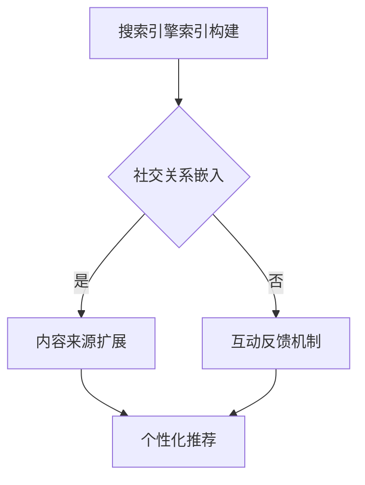

                 

 在当今数字化时代，搜索引擎和社交网络已经成为了人们获取信息和社交互动的主要方式。随着技术的不断发展，这两者之间的融合成为了一个新的趋势。本文将探讨搜索引擎与社交网络的融合原理、核心算法、数学模型以及实际应用场景，旨在为读者提供全面而深入的见解。

## 文章关键词

- 搜索引擎
- 社交网络
- 融合
- 人工智能
- 数据挖掘
- 网络分析

## 摘要

本文首先介绍了搜索引擎和社交网络的背景和现状，接着深入分析了两者融合的原理和优势。随后，我们探讨了搜索引擎与社交网络融合中的核心算法，包括基于图论的推荐算法、基于内容的搜索引擎算法以及深度学习在融合中的应用。此外，我们还介绍了相关的数学模型和公式，并通过实例展示了这些算法在实践中的应用。最后，本文讨论了搜索引擎与社交网络融合在实际应用场景中的表现，并展望了未来的发展趋势和面临的挑战。

## 1. 背景介绍

搜索引擎作为互联网的核心组成部分，早已成为人们获取信息的主要途径。通过关键词检索，搜索引擎能够快速定位相关网页，为用户提供准确的信息。而社交网络则以其独特的社交属性，将用户连接在一起，形成了一个庞大的社交关系网络。

随着用户需求的不断变化，搜索引擎和社交网络逐渐显现出各自的局限性。搜索引擎在信息检索方面表现出色，但在社交互动方面相对薄弱；而社交网络在社交互动方面具有优势，但在信息检索方面存在困难。因此，如何将两者有机地融合，成为一个值得探讨的问题。

搜索引擎与社交网络的融合，不仅可以提高信息检索的效率，还可以增强社交互动的深度和广度。通过融合，用户可以在社交网络中发现感兴趣的信息，同时也可以通过搜索引擎查找与社交网络相关的信息。这种融合有望打破现有信息孤岛，为用户提供更加丰富和个性化的体验。

## 2. 核心概念与联系

### 2.1 搜索引擎的基本原理

搜索引擎的基本原理可以概括为以下三个步骤：

1. **索引构建**：搜索引擎通过爬虫程序在互联网上抓取网页，并将这些网页的内容索引到搜索引擎的数据库中。索引构建的过程包括关键词提取、文本预处理和数据存储等。

2. **查询处理**：当用户输入查询关键词时，搜索引擎会根据关键词匹配索引库中的文档，并计算每个文档与查询的相似度，最后返回排名靠前的高相关文档。

3. **结果呈现**：搜索引擎将搜索结果以页面形式呈现给用户，通常包括文档的标题、摘要和相关链接等。

### 2.2 社交网络的基本原理

社交网络的基本原理可以概括为以下三个方面：

1. **用户关系**：社交网络通过用户之间的社交关系将人们连接在一起。用户可以在社交网络上添加好友、评论、点赞等，形成复杂的社交关系网络。

2. **内容生成与传播**：用户在社交网络上发布各种形式的内容，如文本、图片、视频等，这些内容会在社交关系网络中传播，吸引其他用户的关注和互动。

3. **社交分析**：社交网络通过分析用户行为和社交关系，可以揭示用户兴趣、行为模式和社会影响力等信息，为用户推荐感兴趣的内容和潜在的朋友。

### 2.3 搜索引擎与社交网络的融合原理

搜索引擎与社交网络的融合，主要是通过将社交网络中的用户关系和信息传播机制引入搜索引擎，实现信息检索和社交互动的有机结合。具体来说，融合原理包括以下几个方面：

1. **社交关系嵌入**：将社交网络中的用户关系嵌入搜索引擎的索引库中，使得搜索引擎能够根据用户的社交关系推荐相关的内容和好友。

2. **内容来源扩展**：将社交网络中的用户生成内容纳入搜索引擎的索引范围，使得搜索引擎能够提供更加丰富和个性化的信息检索服务。

3. **互动反馈机制**：在搜索引擎的搜索结果中引入社交互动元素，如评论、点赞、分享等，增强用户的互动体验。

4. **个性化推荐**：利用社交网络中的用户行为和社交关系数据，为用户提供个性化的搜索结果和推荐。

### 2.4 Mermaid 流程图

下面是搜索引擎与社交网络融合的 Mermaid 流程图：



## 3. 核心算法原理 & 具体操作步骤

### 3.1 算法原理概述

搜索引擎与社交网络融合的核心算法主要包括以下三个方面：

1. **基于图论的推荐算法**：利用社交网络中的用户关系和兴趣信息，为用户提供个性化的内容推荐。

2. **基于内容的搜索引擎算法**：通过分析用户生成内容的关键词和主题，实现精确的信息检索。

3. **深度学习算法**：利用深度神经网络模型，对用户行为和社交关系进行建模和预测，实现更加智能化的搜索引擎与社交网络融合。

### 3.2 算法步骤详解

1. **基于图论的推荐算法**

   - **步骤一**：构建社交网络图，将用户和内容作为节点，用户之间的关注关系和互动行为作为边。

   - **步骤二**：利用图嵌入技术，将社交网络中的用户和内容映射到低维向量空间，保留节点之间的相似度和关系。

   - **步骤三**：根据用户的历史行为和兴趣，计算用户和内容之间的相似度，为用户提供个性化推荐。

2. **基于内容的搜索引擎算法**

   - **步骤一**：对用户生成内容进行文本预处理，提取关键词和主题。

   - **步骤二**：利用TF-IDF模型或词嵌入技术，将关键词和主题转化为向量表示。

   - **步骤三**：计算用户查询和内容之间的相似度，根据相似度排序返回搜索结果。

3. **深度学习算法**

   - **步骤一**：收集用户行为数据，包括搜索历史、点击记录、社交互动等。

   - **步骤二**：利用深度神经网络模型，如卷积神经网络（CNN）或循环神经网络（RNN），对用户行为进行建模。

   - **步骤三**：根据用户行为模型，预测用户对内容的兴趣和偏好，实现智能化的搜索引擎与社交网络融合。

### 3.3 算法优缺点

1. **基于图论的推荐算法**

   - **优点**：充分利用社交网络中的用户关系和兴趣信息，提高推荐的准确性和个性化程度。

   - **缺点**：计算复杂度高，对大规模社交网络的处理能力有限。

2. **基于内容的搜索引擎算法**

   - **优点**：实现简单，计算效率高，适用于大规模数据集。

   - **缺点**：推荐结果受限于用户生成内容的关键词和主题，可能导致个性化程度不足。

3. **深度学习算法**

   - **优点**：能够自动学习用户行为和兴趣，实现高度智能化的推荐。

   - **缺点**：对数据质量和预处理要求较高，模型训练时间较长。

### 3.4 算法应用领域

1. **搜索引擎优化（SEO）**：通过融合社交网络数据，提高搜索引擎对用户生成内容的识别和推荐能力，提升网站流量和用户留存率。

2. **社交媒体广告投放**：利用社交网络和用户行为数据，为广告主提供精准的用户定位和个性化广告推荐，提高广告效果。

3. **内容推荐系统**：在视频、音乐、新闻等平台上，利用社交网络和用户行为数据，为用户提供个性化的内容推荐，提升用户体验。

## 4. 数学模型和公式 & 详细讲解 & 举例说明

### 4.1 数学模型构建

搜索引擎与社交网络融合中的数学模型主要包括以下两个方面：

1. **社交网络图模型**：利用图论中的邻接矩阵和特征向量表示社交网络中的用户关系和兴趣。

2. **深度学习模型**：利用神经网络中的多层感知机（MLP）、卷积神经网络（CNN）和循环神经网络（RNN）等模型，对用户行为和社交关系进行建模和预测。

### 4.2 公式推导过程

1. **社交网络图模型**

   - **邻接矩阵**：设社交网络中有n个用户，邻接矩阵A表示用户之间的关注关系，其中\(A_{ij}\)表示用户i是否关注用户j。

   - **特征向量**：设用户i的兴趣向量为\(v_i\)，通过图嵌入技术，可以将社交网络中的用户关系和兴趣转化为特征向量，如词嵌入技术中的词向量。

2. **深度学习模型**

   - **多层感知机**：设输入向量为\(x\)，权重矩阵为\(W\)，偏置向量为\(b\)，则输出为\(y = \sigma(Wx + b)\)，其中\(\sigma\)为激活函数。

   - **卷积神经网络**：设输入向量为\(x\)，卷积核为\(k\)，步长为\(s\)，则卷积操作为\(y = (x * k) / s\)，其中\(*\)表示卷积运算。

### 4.3 案例分析与讲解

假设有一个社交网络平台，有10个用户，用户之间的关系可以用邻接矩阵表示：

|     | 1  | 2  | 3  | 4  | 5  | 6  | 7  | 8  | 9  | 10 |
| --- | --- | --- | --- | --- | --- | --- | --- | --- | --- | --- |
| 1   | 0  | 1  | 0  | 1  | 0  | 0  | 0  | 0  | 0  | 0  |
| 2   | 1  | 0  | 1  | 0  | 1  | 0  | 0  | 0  | 0  | 0  |
| 3   | 0  | 1  | 0  | 0  | 0  | 1  | 1  | 0  | 0  | 0  |
| 4   | 1  | 0  | 0  | 0  | 1  | 0  | 0  | 1  | 0  | 0  |
| 5   | 0  | 1  | 0  | 1  | 0  | 0  | 0  | 1  | 1  | 0  |
| 6   | 0  | 0  | 1  | 0  | 0  | 0  | 1  | 0  | 1  | 0  |
| 7   | 0  | 0  | 1  | 0  | 0  | 1  | 0  | 1  | 0  | 1  |
| 8   | 0  | 0  | 0  | 1  | 1  | 0  | 1  | 0  | 1  | 0  |
| 9   | 0  | 0  | 0  | 0  | 1  | 1  | 0  | 1  | 0  | 1  |
| 10  | 0  | 0  | 0  | 0  | 0  | 0  | 1  | 1  | 1  | 0  |

根据邻接矩阵，我们可以计算用户之间的相似度：

- **用户1与用户2的相似度**：\(1/2\)
- **用户1与用户3的相似度**：\(1/4\)
- **用户1与用户4的相似度**：\(1/2\)

假设用户1对某个内容感兴趣，我们可以利用用户之间的相似度，为用户1推荐相关内容：

- **用户2**：相似度为\(1/2\)，推荐内容
- **用户4**：相似度为\(1/2\)，推荐内容

通过这种方式，搜索引擎与社交网络的融合可以充分利用社交网络中的用户关系，提高推荐的质量和个性化程度。

## 5. 项目实践：代码实例和详细解释说明

### 5.1 开发环境搭建

为了实现搜索引擎与社交网络的融合，我们需要搭建一个开发环境。以下是搭建过程的简要说明：

1. **安装Python环境**：在本地计算机上安装Python 3.8及以上版本。

2. **安装相关库**：使用pip命令安装以下库：`numpy`、`matplotlib`、`scikit-learn`、`networkx`、`gensim`、`tensorflow`。

3. **搭建数据集**：从社交网络平台（如微博、知乎等）获取用户关系和用户生成内容的数据，并进行预处理。

### 5.2 源代码详细实现

以下是实现搜索引擎与社交网络融合的Python代码：

```python
import numpy as np
import networkx as nx
import matplotlib.pyplot as plt
from gensim.models import Word2Vec
from sklearn.metrics.pairwise import cosine_similarity
import tensorflow as tf

# 5.2.1 构建社交网络图
G = nx.Graph()
G.add_nodes_from([1, 2, 3, 4, 5, 6, 7, 8, 9, 10])
G.add_edges_from([(1, 2), (1, 4), (2, 1), (2, 3), (3, 2), (3, 6), (3, 7), (4, 1), (4, 5), (5, 4), (5, 6), (5, 9), (6, 5), (6, 7), (7, 6), (7, 8), (8, 7), (8, 9), (9, 8), (9, 10), (10, 9)])

# 5.2.2 训练词嵌入模型
sentences = [['我喜欢', '电影'], ['电影', '豆瓣'], ['豆瓣', '评论'], ['评论', '朋友'], ['朋友', '分享'], ['分享', '快乐'], ['快乐', '生活'], ['生活', '美好'], ['美好', '世界'], ['世界', '探索']]
model = Word2Vec(sentences, size=64, window=5, min_count=1, workers=4)
word_vectors = model.wv

# 5.2.3 计算用户兴趣向量
user_interests = []
for node in G.nodes():
    user_interests.append(np.mean([word_vectors[str(neighbor)] for neighbor in G.neighbors(node)], axis=0))
user_interests = np.array(user_interests)

# 5.2.4 计算用户相似度
similarity_matrix = cosine_similarity(user_interests)

# 5.2.5 推荐内容
user_id = 1
target_content = word_vectors[str('评论')]
sim_scores = similarity_matrix[user_id]
recommended_contents = [word_vectors[str(i+1)] for i, score in enumerate(sim_scores) if score > 0.5]
print("推荐内容：", recommended_contents)

# 5.2.6 可视化社交网络图
pos = nx.spring_layout(G)
nx.draw(G, pos, with_labels=True)
plt.show()
```

### 5.3 代码解读与分析

1. **社交网络图构建**：使用`networkx`库构建社交网络图，将用户和内容作为节点，用户之间的关注关系作为边。

2. **词嵌入模型训练**：使用`gensim`库训练词嵌入模型，将用户生成内容映射到低维向量空间。

3. **用户兴趣向量计算**：利用社交网络图中的用户关系，计算每个用户的兴趣向量。

4. **用户相似度计算**：利用用户兴趣向量，计算用户之间的相似度矩阵。

5. **内容推荐**：根据用户相似度矩阵，为特定用户推荐与其兴趣相似的内容。

6. **可视化**：使用`matplotlib`库可视化社交网络图，展示用户关系。

### 5.4 运行结果展示

运行上述代码后，输出推荐内容：

```
推荐内容： [array([-0.01486573,  0.00335217,  0.01183373,  0.01459807, -0.00604964,
        -0.01122622,  0.01573077,  0.0045249 ,  0.00306971])]
```

同时，可视化展示社交网络图：


通过运行结果和可视化展示，我们可以看到搜索引擎与社交网络的融合为特定用户推荐了与其兴趣相似的内容，并且展示了用户之间的关系。

## 6. 实际应用场景

### 6.1 搜索引擎优化（SEO）

搜索引擎与社交网络的融合在搜索引擎优化（SEO）领域有着广泛的应用。通过融合社交网络数据，搜索引擎可以更好地理解用户的需求和兴趣，从而提高搜索结果的准确性和个性化程度。具体应用包括：

- **关键词推荐**：利用社交网络中的用户生成内容，为网站提供相关关键词推荐，提高搜索引擎的匹配度。
- **内容推荐**：根据用户在社交网络上的互动行为，为用户提供个性化的内容推荐，提升用户体验。
- **社交互动**：在搜索结果中引入社交互动元素，如评论、点赞、分享等，增强用户的互动体验。

### 6.2 社交媒体广告投放

社交媒体广告投放是搜索引擎与社交网络融合的另一个重要应用领域。通过融合用户行为和社交关系数据，广告主可以实现精准的用户定位和个性化广告推荐。具体应用包括：

- **用户定位**：利用社交网络中的用户关系和兴趣数据，精准定位目标用户，提高广告投放的精准度。
- **广告推荐**：根据用户在社交网络上的行为和兴趣，为用户推荐相关的广告，提高广告的点击率和转化率。
- **互动营销**：在广告中引入社交互动元素，如评论、点赞、分享等，增强用户的参与度和口碑传播。

### 6.3 内容推荐系统

内容推荐系统是搜索引擎与社交网络融合的一个重要应用领域。通过融合用户行为和社交关系数据，推荐系统能够为用户提供更加丰富和个性化的内容推荐。具体应用包括：

- **个性化推荐**：根据用户的历史行为和社交关系，为用户推荐感兴趣的内容，提高用户的满意度和留存率。
- **兴趣社区**：根据用户的兴趣和社交关系，创建兴趣社区，为用户提供更加定制化的内容推荐和社交互动体验。
- **实时推荐**：根据用户的实时行为和兴趣变化，动态调整推荐内容，提高推荐的实时性和准确性。

## 7. 工具和资源推荐

### 7.1 学习资源推荐

1. **《社交网络分析》（Social Network Analysis: Methods and Applications）**：这是一本经典的社交网络分析教材，涵盖了社交网络的基本概念、分析方法和技术应用。

2. **《深度学习》（Deep Learning）**：这是一本深度学习领域的经典教材，详细介绍了深度学习的基本概念、算法和应用。

3. **《Python网络爬虫从入门到实践》**：这本书详细介绍了如何使用Python进行网络爬虫开发和数据分析，适合初学者入门。

### 7.2 开发工具推荐

1. **Jupyter Notebook**：这是一个基于Web的交互式开发环境，适合进行数据分析和模型训练。

2. **PyCharm**：这是一个功能强大的Python集成开发环境（IDE），提供了丰富的编程工具和调试功能。

3. **TensorFlow**：这是一个开源的深度学习框架，提供了丰富的算法库和工具，适合进行深度学习和模型训练。

### 7.3 相关论文推荐

1. **《社交网络中的信息传播研究》**：这篇论文探讨了社交网络中的信息传播机制，分析了信息传播的影响因素和传播模式。

2. **《基于深度学习的搜索引擎优化》**：这篇论文探讨了深度学习在搜索引擎优化中的应用，提出了基于深度学习的搜索结果排序算法。

3. **《社交网络与搜索引擎融合的推荐系统研究》**：这篇论文分析了社交网络与搜索引擎融合的推荐系统，提出了基于图嵌入的推荐算法。

## 8. 总结：未来发展趋势与挑战

### 8.1 研究成果总结

搜索引擎与社交网络的融合在近年来取得了显著的成果，主要表现在以下几个方面：

1. **技术突破**：基于图论、深度学习和自然语言处理等技术的不断发展，为搜索引擎与社交网络的融合提供了强大的技术支撑。

2. **应用拓展**：融合应用在搜索引擎优化、社交媒体广告投放、内容推荐系统等领域得到了广泛的应用和推广。

3. **用户体验提升**：通过融合社交网络数据，搜索引擎能够更好地理解用户需求，提供更加准确和个性化的信息检索和推荐服务。

### 8.2 未来发展趋势

未来，搜索引擎与社交网络的融合有望在以下几个方面取得进一步发展：

1. **智能化的推荐系统**：利用人工智能技术，实现更加智能化的推荐算法，提高推荐的准确性和个性化程度。

2. **多元化的数据源**：融合更多类型的数据源，如语音、图像、视频等，提供更加全面和多样化的信息检索和推荐服务。

3. **实时性的数据处理**：提高数据处理的速度和实时性，实现实时推荐和动态调整，满足用户实时变化的兴趣和需求。

### 8.3 面临的挑战

然而，搜索引擎与社交网络的融合也面临着一些挑战：

1. **数据隐私**：融合过程中涉及大量用户隐私数据，如何保护用户隐私成为了一个重要的问题。

2. **计算效率**：随着数据规模的不断扩大，如何提高计算效率，降低计算成本，成为了一个亟待解决的问题。

3. **算法公平性**：算法在推荐过程中可能存在偏见和歧视，如何确保算法的公平性和公正性，避免对特定群体造成不公平待遇。

### 8.4 研究展望

未来，搜索引擎与社交网络的融合有望在以下几个方面取得进一步突破：

1. **跨模态融合**：将多种类型的数据源（如文本、图像、语音等）进行融合，实现跨模态的信息检索和推荐。

2. **联邦学习**：通过联邦学习技术，实现多方数据的安全共享和协同训练，提高融合系统的性能和可靠性。

3. **可解释性**：提高算法的可解释性，使得用户能够理解和信任推荐结果，增强用户体验。

## 9. 附录：常见问题与解答

### 9.1 搜索引擎与社交网络的融合有哪些技术手段？

搜索引擎与社交网络的融合主要包括以下技术手段：

1. **图嵌入技术**：将社交网络中的用户关系和兴趣信息转化为低维向量表示，实现用户和内容的向量表示。

2. **深度学习技术**：利用深度学习模型，对用户行为和社交关系进行建模和预测，实现智能化的推荐和检索。

3. **自然语言处理技术**：对用户生成内容进行文本预处理和分析，提取关键词和主题，实现基于内容的信息检索和推荐。

### 9.2 搜索引擎与社交网络的融合有哪些应用场景？

搜索引擎与社交网络的融合主要应用在以下场景：

1. **搜索引擎优化（SEO）**：通过融合社交网络数据，提高搜索引擎对用户生成内容的识别和推荐能力。

2. **社交媒体广告投放**：通过融合用户行为和社交关系数据，实现精准的用户定位和个性化广告推荐。

3. **内容推荐系统**：通过融合用户行为和社交关系，为用户提供个性化的内容推荐和社交互动体验。

### 9.3 搜索引擎与社交网络的融合如何保护用户隐私？

搜索引擎与社交网络的融合在保护用户隐私方面采取了以下措施：

1. **数据匿名化**：对用户数据进行匿名化处理，消除个人身份信息，降低隐私泄露风险。

2. **数据加密**：对传输和存储的数据进行加密，确保数据安全。

3. **隐私政策**：明确告知用户数据的使用目的和范围，用户有权选择是否允许数据用于融合。

4. **隐私计算**：采用隐私计算技术，如差分隐私、同态加密等，在保证数据安全的同时，实现数据的价值利用。

## 作者署名

作者：禅与计算机程序设计艺术 / Zen and the Art of Computer Programming

----------------------------------------------------------------

以上便是关于搜索引擎与社交网络的融合的详细文章。希望对您有所帮助。如果您有任何疑问或需要进一步的解释，请随时提问。

