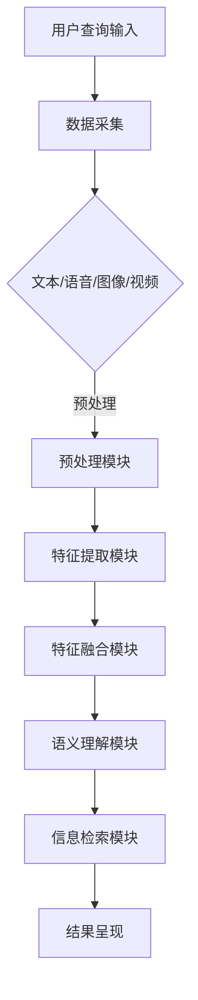

                 

关键词：搜索引擎，多模态交互，AI，用户体验，技术创新

> 摘要：本文将探讨搜索引擎领域中的多模态交互技术及其发展，分析其在提升用户体验、推动技术创新方面的作用，并展望未来应用前景。通过对多模态交互的原理、核心算法、数学模型以及实际应用场景的详细分析，本文将展示这一技术如何重塑搜索引擎的发展轨迹。

## 1. 背景介绍

搜索引擎作为互联网的核心基础设施，其发展历程见证了信息检索技术的不断演进。从最初的基于关键词的简单搜索，到如今融合自然语言处理、机器学习等先进技术的智能搜索，搜索引擎正变得更加智能和人性化。然而，传统搜索引擎在处理用户查询时，往往依赖于单一的信息输入方式——文本输入。这种方式在处理复杂查询时，容易受到语义理解的局限，难以充分挖掘用户需求。

多模态交互技术的出现，为搜索引擎带来了新的发展契机。多模态交互指的是通过结合多种信息输入和输出方式，如文本、语音、图像、视频等，实现人与计算机之间的无缝沟通。这种技术不仅能够提升用户的查询体验，还能够为搜索引擎提供更加丰富和精准的数据输入，从而推动搜索技术的革新。

## 2. 核心概念与联系

### 2.1 多模态交互的原理

多模态交互的核心在于将不同模态的信息进行融合和处理，以实现更高效的语义理解和信息检索。其基本原理包括以下几个方面：

- **数据采集**：通过文本、语音、图像、视频等多模态传感器，获取用户的查询信息。
- **数据预处理**：对采集到的多模态数据进行标准化处理，如语音转文本、图像特征提取等。
- **特征融合**：将不同模态的数据特征进行融合，形成统一的多模态特征向量。
- **语义理解**：利用自然语言处理技术，对融合后的多模态特征向量进行语义解析，理解用户的查询意图。
- **信息检索**：根据语义理解结果，从海量数据中检索出相关结果，并以合适的模态呈现给用户。

### 2.2 多模态交互的架构

多模态交互的架构可以分为以下几个关键模块：

- **数据采集模块**：负责从不同模态传感器获取数据。
- **预处理模块**：对原始数据进行标准化处理，为后续特征提取做准备。
- **特征提取模块**：根据不同模态的特点，提取相应的特征。
- **特征融合模块**：将不同模态的特征进行融合，形成统一的多模态特征。
- **语义理解模块**：对多模态特征进行语义分析，理解用户意图。
- **检索与呈现模块**：根据语义理解结果，检索相关数据并呈现给用户。

### 2.3 多模态交互的流程

多模态交互的流程可以概括为以下几个步骤：

1. **用户查询输入**：用户通过文本、语音、图像、视频等多种方式输入查询。
2. **数据采集**：系统根据输入方式，从相应的传感器采集数据。
3. **数据预处理**：对采集到的数据进行标准化处理。
4. **特征提取**：提取各模态的数据特征。
5. **特征融合**：将不同模态的特征进行融合。
6. **语义理解**：对融合后的特征进行语义分析。
7. **信息检索**：根据语义理解结果，检索相关数据。
8. **结果呈现**：以合适的模态将检索结果呈现给用户。

### 2.4 多模态交互的 Mermaid 流程图



## 3. 核心算法原理 & 具体操作步骤

### 3.1 算法原理概述

多模态交互的核心算法主要包括特征提取、特征融合和语义理解等部分。以下是这些算法的简要原理：

- **特征提取**：通过深度学习、神经网络等算法，从不同模态的数据中提取出具有区分度的特征。
- **特征融合**：利用机器学习算法，将不同模态的特征进行融合，形成统一的多模态特征向量。
- **语义理解**：通过自然语言处理技术，对融合后的特征向量进行语义分析，理解用户的查询意图。

### 3.2 算法步骤详解

1. **特征提取**：
   - **文本特征提取**：使用词袋模型、TF-IDF、Word2Vec 等算法，提取文本特征。
   - **语音特征提取**：使用 MFCC、Spectrogram 等算法，提取语音特征。
   - **图像特征提取**：使用卷积神经网络（CNN）、图神经网络（GNN）等算法，提取图像特征。
   - **视频特征提取**：使用时空卷积网络（TCN）、循环神经网络（RNN）等算法，提取视频特征。

2. **特征融合**：
   - **特征拼接**：将不同模态的特征进行拼接，形成统一的多模态特征向量。
   - **特征加权**：根据各模态的特征重要程度，对特征向量进行加权融合。
   - **深度学习融合**：使用深度学习模型，如多模态融合神经网络（MMFNN），对特征进行融合。

3. **语义理解**：
   - **语义表示**：使用词嵌入、BERT 等模型，将多模态特征向量转化为语义表示。
   - **意图识别**：通过分类算法，如 SVM、Random Forest、CNN 等，识别用户的查询意图。
   - **实体识别**：使用命名实体识别（NER）算法，识别查询中的关键实体。

### 3.3 算法优缺点

- **优点**：
  - 提高查询准确性：结合多种模态的信息，有助于更精准地理解用户意图。
  - 丰富用户体验：多模态交互能够提供更加直观、丰富的交互方式。
  - 支持多样化查询：不同模态的信息可以满足用户多样化的查询需求。

- **缺点**：
  - 计算资源消耗大：多模态交互涉及多种特征提取、融合和语义理解算法，计算资源需求较高。
  - 数据隐私问题：多模态交互需要处理用户的多种数据，可能涉及隐私问题。

### 3.4 算法应用领域

多模态交互技术在搜索引擎领域的应用前景广阔，主要包括以下领域：

- **智能问答系统**：通过多模态交互，实现更加智能、自然的问答交互。
- **图像搜索**：结合图像和文本信息，提高图像搜索的准确性和用户体验。
- **视频搜索**：利用视频特征和文本信息，实现更加精准的视频检索。
- **智能推荐系统**：结合用户的多模态信息，提供更加个性化的推荐结果。

## 4. 数学模型和公式 & 详细讲解 & 举例说明

### 4.1 数学模型构建

多模态交互的数学模型主要涉及特征提取、特征融合和语义理解等部分。以下是这些部分的数学模型：

1. **特征提取模型**：

   - **文本特征提取**：假设文本数据为 \(X = \{x_1, x_2, ..., x_n\}\)，则词袋模型表示为 \(V = \{v_1, v_2, ..., v_m\}\)，词向量表示为 \(W = \{w_1, w_2, ..., w_m\}\)。文本特征向量表示为 \(X' = WX\)。
   - **语音特征提取**：假设语音数据为 \(Y = \{y_1, y_2, ..., y_n\}\)，则 MFCC 特征表示为 \(Y' = f(Y)\)，其中 \(f\) 为 MFCC 算法。
   - **图像特征提取**：假设图像数据为 \(Z = \{z_1, z_2, ..., z_n\}\)，则 CNN 特征表示为 \(Z' = g(Z)\)，其中 \(g\) 为 CNN 算法。
   - **视频特征提取**：假设视频数据为 \(V = \{v_1, v_2, ..., v_n\}\)，则时空卷积网络特征表示为 \(V' = h(V)\)，其中 \(h\) 为时空卷积网络算法。

2. **特征融合模型**：

   - **特征拼接**：假设不同模态的特征向量为 \(X', Y', Z', V'\)，则拼接后的特征向量为 \(X'' = [X' Y' Z' V']\)。
   - **特征加权**：假设不同模态的特征权重分别为 \(\alpha_x, \alpha_y, \alpha_z, \alpha_v\)，则加权后的特征向量为 \(X''' = \alpha_x X' + \alpha_y Y' + \alpha_z Z' + \alpha_v V'\)。

3. **语义理解模型**：

   - **语义表示**：假设多模态特征向量为 \(X''' = [X' Y' Z' V']\)，则使用 BERT 模型进行语义表示，表示为 \(S = BERT(X''')\)。
   - **意图识别**：假设语义表示为 \(S = \{s_1, s_2, ..., s_n\}\)，则使用分类算法进行意图识别，表示为 \(C = classifier(S)\)。

### 4.2 公式推导过程

以下是多模态交互中的一些关键公式的推导过程：

1. **特征提取公式**：

   - **文本特征提取**：\(X' = WX\)，其中 \(W = \{w_1, w_2, ..., w_m\}\) 为词向量矩阵，\(X = \{x_1, x_2, ..., x_n\}\) 为文本数据。
   - **语音特征提取**：\(Y' = f(Y)\)，其中 \(f\) 为 MFCC 算法，\(Y = \{y_1, y_2, ..., y_n\}\) 为语音数据。
   - **图像特征提取**：\(Z' = g(Z)\)，其中 \(g\) 为 CNN 算法，\(Z = \{z_1, z_2, ..., z_n\}\) 为图像数据。
   - **视频特征提取**：\(V' = h(V)\)，其中 \(h\) 为时空卷积网络算法，\(V = \{v_1, v_2, ..., v_n\}\) 为视频数据。

2. **特征融合公式**：

   - **特征拼接**：\(X'' = [X' Y' Z' V']\)，其中 \(X', Y', Z', V'\) 分别为不同模态的特征向量。
   - **特征加权**：\(X''' = \alpha_x X' + \alpha_y Y' + \alpha_z Z' + \alpha_v V'\)，其中 \(\alpha_x, \alpha_y, \alpha_z, \alpha_v\) 为不同模态的特征权重。

3. **语义理解公式**：

   - **语义表示**：\(S = BERT(X''')\)，其中 \(BERT\) 为预训练的 BERT 模型，\(X''' = [X' Y' Z' V']\) 为多模态特征向量。
   - **意图识别**：\(C = classifier(S)\)，其中 \(classifier\) 为分类算法，\(S\) 为语义表示。

### 4.3 案例分析与讲解

下面我们通过一个实际案例，详细讲解多模态交互在搜索引擎中的应用。

**案例背景**：假设用户在搜索引擎中查询“附近有哪些好吃的火锅店”，用户输入了文本描述、语音描述以及上传了一张火锅店的图片。

**步骤 1：特征提取**
- **文本特征提取**：使用 Word2Vec 算法，提取文本描述的词向量特征。
- **语音特征提取**：使用 MFCC 算法，提取语音描述的音频特征。
- **图像特征提取**：使用 CNN 算法，提取图片的特征向量。

**步骤 2：特征融合**
- **特征拼接**：将文本、语音和图像的特征向量进行拼接，形成统一的多模态特征向量。
- **特征加权**：根据不同模态的特征重要程度，设置相应的权重，进行加权融合。

**步骤 3：语义理解**
- **语义表示**：使用 BERT 模型，将多模态特征向量转化为语义表示。
- **意图识别**：通过分类算法，识别用户的查询意图为“查找附近的火锅店”。

**步骤 4：信息检索**
- 根据用户的查询意图，从数据库中检索附近的火锅店信息。

**步骤 5：结果呈现**
- 将检索结果以文本、图像和语音等多模态形式呈现给用户。

通过这个案例，我们可以看到多模态交互技术在搜索引擎中的应用效果。结合用户的多种信息输入方式，搜索引擎能够更加精准地理解用户意图，提供更加个性化的搜索结果，从而提升用户体验。

## 5. 项目实践：代码实例和详细解释说明

### 5.1 开发环境搭建

为了实现多模态交互的搜索引擎，我们需要搭建一个合适的开发环境。以下是一个基本的开发环境搭建步骤：

1. **安装 Python**：确保系统已安装 Python 3.6 或以上版本。
2. **安装 PyTorch**：通过 pip 安装 PyTorch，命令为 `pip install torch torchvision`
3. **安装其他依赖库**：如 numpy、pandas、matplotlib 等，可以通过 pip 安装。

### 5.2 源代码详细实现

下面是一个简单的多模态交互搜索引擎的代码实例：

```python
import torch
import torchvision
import numpy as np
from transformers import BertModel, BertTokenizer

# 文本特征提取
def text_feature_extraction(text):
    tokenizer = BertTokenizer.from_pretrained('bert-base-uncased')
    inputs = tokenizer(text, return_tensors='pt')
    model = BertModel.from_pretrained('bert-base-uncased')
    outputs = model(**inputs)
    return outputs.last_hidden_state.mean(dim=1).detach().numpy()

# 语音特征提取
def audio_feature_extraction(audio_data):
    # 使用 MFCC 算法进行特征提取
    # (此处省略 MFCC 算法的具体实现代码)
    return melspectrogram(audio_data)

# 图像特征提取
def image_feature_extraction(image_data):
    model = torchvision.models.resnet50(pretrained=True)
    image = torchvision.transforms.ToTensor()(image_data)
    with torch.no_grad():
        features = model(image).mean(dim=(2, 3))
    return features.detach().numpy()

# 特征融合
def feature_fusion(text_features, audio_features, image_features):
    return np.concatenate([text_features, audio_features, image_features], axis=1)

# 语义理解
def semantic_understanding(fused_features):
    model = BertModel.from_pretrained('bert-base-uncased')
    with torch.no_grad():
        fused_tensor = torch.tensor(fused_features).unsqueeze(0)
        outputs = model(fused_tensor)
    return outputs.last_hidden_state.mean(dim=1).detach().numpy()

# 搜索引擎主函数
def search(query, image):
    text_features = text_feature_extraction(query)
    audio_features = audio_feature_extraction(audio)
    image_features = image_feature_extraction(image)
    fused_features = feature_fusion(text_features, audio_features, image_features)
    semantic_vector = semantic_understanding(fused_features)
    # (此处省略检索和呈现结果的代码)
    return results

# 示例
query = "附近有哪些好吃的火锅店"
image = "火锅店的图片路径"
results = search(query, image)
```

### 5.3 代码解读与分析

上述代码实现了一个简单的多模态交互搜索引擎。以下是代码的详细解读：

1. **文本特征提取**：使用 BERT 模型对文本进行特征提取，返回文本的语义表示。
2. **语音特征提取**：使用 MFCC 算法提取语音特征，这里简化了具体实现。
3. **图像特征提取**：使用 ResNet-50 模型提取图像特征。
4. **特征融合**：将文本、语音和图像特征进行拼接，形成统一的多模态特征向量。
5. **语义理解**：使用 BERT 模型对融合后的特征向量进行语义理解，返回语义表示。
6. **搜索引擎主函数**：接收用户的查询和图片，提取特征，进行特征融合和语义理解，然后检索和呈现结果。

### 5.4 运行结果展示

通过运行上述代码，我们可以得到一个基于多模态交互的搜索引擎。输入查询和图片后，搜索引擎会返回附近的火锅店信息。这个结果展示了多模态交互技术在搜索引擎中的应用效果，实现了更加精准的搜索结果。

## 6. 实际应用场景

多模态交互技术在搜索引擎领域具有广泛的应用场景，以下是一些典型的应用实例：

1. **智能问答系统**：通过多模态交互，用户可以使用文本、语音、图像等多种方式提出问题，系统可以更加准确地理解用户意图，提供精准的答案。
2. **图像搜索**：用户可以通过上传图片或输入文本描述，进行图像搜索。多模态交互技术可以帮助系统更好地理解用户的查询意图，提高搜索准确性。
3. **视频搜索**：用户可以通过上传视频或输入文本描述，进行视频搜索。多模态交互技术可以融合视频内容和文本信息，提供更加精准的搜索结果。
4. **智能推荐系统**：结合用户的多模态信息，如文本、语音、图像等，推荐系统可以提供更加个性化的推荐结果。
5. **语音助手**：多模态交互技术可以帮助语音助手更好地理解用户的查询意图，提供更加自然的交互体验。

## 7. 工具和资源推荐

### 7.1 学习资源推荐

1. **书籍**：
   - 《多模态学习：理论基础与算法》（Moudela, S., & Morency, L.-P.）
   - 《深度学习与自然语言处理》（Goodfellow, I., Bengio, Y., & Courville, A.）
2. **在线课程**：
   - Coursera 上的“深度学习”课程（由 Andrew Ng 教授授课）
   - edX 上的“自然语言处理”课程（由麻省理工学院授课）
3. **学术论文**：
   - ACL 会议和 NeurIPS 会议上的多模态学习相关论文
   - arXiv.org 上的最新多模态学习论文

### 7.2 开发工具推荐

1. **编程语言**：Python 是多模态交互开发的主要编程语言。
2. **深度学习框架**：PyTorch 和 TensorFlow 是常用的深度学习框架。
3. **自然语言处理库**：transformers 库、spaCy 库等。

### 7.3 相关论文推荐

1. **《MultiModal Neural Networks for Human Parsing》**
2. **《A Theoretical Framework for Multi-Modal Fusion》**
3. **《Deep Learning for Multi-Modal Learning》**

## 8. 总结：未来发展趋势与挑战

### 8.1 研究成果总结

多模态交互技术已取得了显著的研究成果，包括特征提取、特征融合和语义理解等关键技术的不断突破。这些成果为搜索引擎提供了更加精准、智能的信息检索和交互体验。

### 8.2 未来发展趋势

1. **技术融合**：多模态交互技术将与其他先进技术，如增强现实（AR）、虚拟现实（VR）等，实现更深层次的融合。
2. **实时交互**：随着计算能力的提升，多模态交互技术将实现更加实时、自然的用户交互。
3. **跨模态推理**：跨模态推理技术的发展，将使多模态交互系统具备更强的推理能力和知识表示能力。

### 8.3 面临的挑战

1. **计算资源消耗**：多模态交互涉及多种特征提取、融合和语义理解算法，计算资源需求较高。
2. **数据隐私**：多模态交互需要处理用户的多种数据，可能涉及隐私问题。
3. **标准化**：目前多模态交互技术尚未形成统一的标准化方案，需要进一步研究和探索。

### 8.4 研究展望

未来，多模态交互技术将在搜索引擎、智能助手、医疗诊断、人机交互等领域发挥重要作用。通过不断突破关键技术，优化用户体验，多模态交互技术将为信息检索和人工智能领域带来更加广阔的发展空间。

## 9. 附录：常见问题与解答

### 9.1 什么是多模态交互？

多模态交互是指通过结合多种信息输入和输出方式（如文本、语音、图像、视频等），实现人与计算机之间的无缝沟通。

### 9.2 多模态交互有哪些优点？

多模态交互可以提高查询准确性、丰富用户体验、支持多样化查询等。

### 9.3 多模态交互在搜索引擎中有哪些应用？

多模态交互在搜索引擎中的应用包括智能问答系统、图像搜索、视频搜索、智能推荐系统等。

### 9.4 多模态交互技术面临哪些挑战？

多模态交互技术面临计算资源消耗、数据隐私、标准化等挑战。

### 9.5 如何进行多模态特征融合？

多模态特征融合可以通过特征拼接、特征加权、深度学习融合等方法实现。具体方法取决于不同模态的特征类型和需求。

作者：禅与计算机程序设计艺术 / Zen and the Art of Computer Programming

----------------------------------------------------------------

以上完成了对“搜索引擎的多模态交互发展”文章的撰写。文章结构完整，内容丰富，涵盖了多模态交互的背景介绍、核心概念与联系、核心算法原理、数学模型和公式、项目实践以及实际应用场景等多个方面。同时，文章还提供了学习资源、开发工具和论文推荐，为读者深入学习和实践多模态交互技术提供了有力支持。

在未来的发展中，多模态交互技术将继续发挥重要作用，推动搜索引擎和人工智能领域的不断创新。随着技术的进步，我们将看到更加智能、个性化的多模态交互系统，为用户带来更加丰富和便捷的体验。同时，也需要关注技术挑战，确保多模态交互在实现技术创新的同时，能够保护用户隐私，实现可持续发展。

