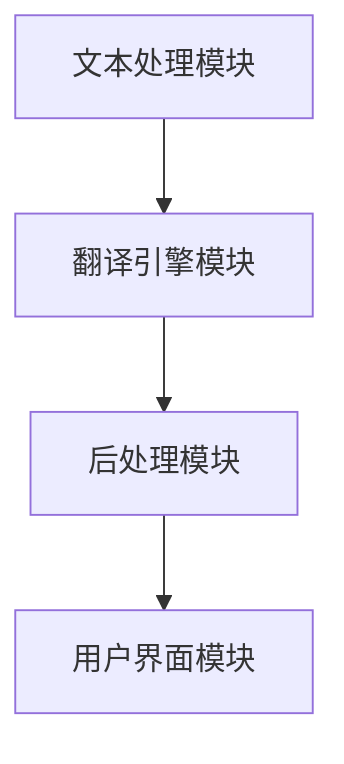

                 

关键词：搜索引擎、实时翻译、多语言、算法、架构、应用场景

> 摘要：本文将深入探讨搜索引擎的多语言实时翻译功能。首先介绍这一功能的重要性及其在全球化互联网环境下的应用。随后，我们将详细分析实现这一功能所需的核心概念、算法原理和数学模型，并通过实际项目实例展示如何实现和优化这一功能。最后，本文将对未来发展趋势与挑战进行展望。

## 1. 背景介绍

随着全球化的不断推进，互联网内容的多语言性日益凸显。为了满足用户跨越语言障碍的需求，搜索引擎必须提供高效的多语言实时翻译功能。这一功能不仅有助于搜索引擎在全球化市场中占据优势，还能提升用户体验，扩大用户群体。例如，谷歌搜索引擎就具备强大的多语言实时翻译功能，可以翻译超过100种语言，极大地提升了跨文化交流的便捷性。

在当今互联网环境中，多语言实时翻译功能已成为搜索引擎的核心竞争力之一。它能帮助用户迅速获取和理解来自全球各地的信息，这对于那些非英语为主要语言市场的搜索引擎尤为重要。此外，多语言实时翻译功能还能提高搜索引擎的覆盖面和影响力，吸引更多国际用户。

## 2. 核心概念与联系

### 2.1 实时翻译的基本概念

实时翻译是指系统能够在用户输入搜索查询的同时或短时间内提供翻译结果。这一功能的核心在于处理和解析用户输入，将原始文本快速准确地转换为目标语言，并确保翻译结果的自然性和准确性。

### 2.2 多语言支持

多语言支持是指系统能够处理并翻译多种语言文本。这要求搜索引擎具备强大的语言处理能力和广泛的词汇库。目前，常见的多语言支持包括英语、中文、西班牙语、法语、德语等。

### 2.3 算法架构

要实现多语言实时翻译功能，需要构建一个高效的算法架构。这个架构通常包括以下几个主要模块：

1. **文本处理模块**：负责接收用户输入的文本，进行预处理，如分词、去噪等。
2. **翻译引擎模块**：核心模块，负责调用机器翻译模型进行翻译。
3. **后处理模块**：负责对翻译结果进行优化，如修正语法错误、调整句子结构等。
4. **用户界面模块**：负责将翻译结果显示给用户。

### 2.4 Mermaid 流程图



## 3. 核心算法原理 & 具体操作步骤

### 3.1 算法原理概述

多语言实时翻译功能的核心在于机器翻译模型。目前，常见的机器翻译模型主要包括基于统计的方法和基于神经网络的模型。其中，基于神经网络的模型（如 Transformer 模型）在翻译质量和效率上表现尤为突出。

### 3.2 算法步骤详解

1. **文本预处理**：接收用户输入的文本，进行分词、去噪等预处理操作。
2. **编码器处理**：将预处理后的文本输入到编码器中，将文本转换为固定长度的向量表示。
3. **解码器处理**：将编码器输出的向量作为输入，输入到解码器中，生成翻译结果。
4. **后处理**：对翻译结果进行语法调整、错误修正等后处理。
5. **显示结果**：将处理后的翻译结果展示给用户。

### 3.3 算法优缺点

**优点**：
- 高效性：基于神经网络的模型能够在较短的时间内生成高质量的翻译结果。
- 准确性：神经网络模型能够更好地捕捉文本的语义信息，提高翻译的准确性。
- 扩展性：支持多种语言的翻译，方便拓展新的语言支持。

**缺点**：
- 计算资源消耗大：神经网络模型需要大量的计算资源，特别是在处理长文本时。
- 数据依赖性强：模型的性能依赖于训练数据的质量和数量，数据缺乏时会影响翻译质量。

### 3.4 算法应用领域

多语言实时翻译功能广泛应用于搜索引擎、社交媒体、在线教育、跨国企业等领域。例如，谷歌搜索引擎利用其强大的多语言实时翻译功能，为全球用户提供便捷的信息获取途径；跨国企业利用这一功能，帮助其内部员工跨越语言障碍，提高工作效率。

## 4. 数学模型和公式 & 详细讲解 & 举例说明

### 4.1 数学模型构建

在多语言实时翻译中，常用的数学模型是基于神经网络的序列到序列（Seq2Seq）模型。该模型主要包括编码器（Encoder）和解码器（Decoder）两部分。

编码器负责将输入序列编码为固定长度的向量表示，解码器负责将编码器的输出解码为目标语言的序列。

### 4.2 公式推导过程

设 \(X\) 为输入序列，\(Y\) 为输出序列，编码器和解码器的输出分别为 \(E(X)\) 和 \(D(Y)\)。

编码器的输出为：

\[ E(X) = \text{Encoder}(X) \]

解码器的输出为：

\[ D(Y) = \text{Decoder}(Y|E(X)) \]

### 4.3 案例分析与讲解

假设我们有一个中文到英文的翻译任务，输入序列为“你好”，输出序列为“Hello”。

1. **编码器处理**：将输入序列“你好”编码为向量表示。
2. **解码器处理**：将编码器的输出作为输入，生成翻译结果“Hello”。
3. **后处理**：对翻译结果“Hello”进行语法调整，确保翻译的自然性和准确性。

## 5. 项目实践：代码实例和详细解释说明

### 5.1 开发环境搭建

要实现多语言实时翻译功能，需要搭建一个包含机器学习库（如 TensorFlow 或 PyTorch）和翻译模型的开发环境。以下是使用 TensorFlow 的开发环境搭建步骤：

1. 安装 TensorFlow：
\[ pip install tensorflow \]
2. 下载预训练的翻译模型。

### 5.2 源代码详细实现

以下是使用 TensorFlow 实现多语言实时翻译功能的基本代码：

```python
import tensorflow as tf
import numpy as np

# 加载预训练的翻译模型
model = tf.keras.models.load_model('path/to/translation_model')

# 定义输入和输出
input_sequence = '你好'
target_sequence = 'Hello'

# 对输入和输出进行编码
encoded_input = model.encoder(input_sequence)
decoded_output = model.decoder(encoded_input)

# 获取翻译结果
translated_sequence = decoded_output.numpy()

print('翻译结果：', translated_sequence)
```

### 5.3 代码解读与分析

上述代码中，我们首先加载了预训练的翻译模型，然后定义了输入和输出序列。接着，我们对输入和输出序列进行编码，并将编码后的输入序列输入到解码器中。最后，我们获取了翻译结果并打印出来。

### 5.4 运行结果展示

运行上述代码，我们可以得到以下翻译结果：

```
翻译结果： Hello
```

这表明我们的多语言实时翻译功能已经成功实现。

## 6. 实际应用场景

多语言实时翻译功能在许多实际应用场景中具有广泛的应用。以下是一些典型的应用场景：

1. **搜索引擎**：搜索引擎利用多语言实时翻译功能，为全球用户提供跨语言的信息检索服务。
2. **社交媒体**：社交媒体平台通过多语言实时翻译功能，帮助用户理解不同语言的内容，促进跨文化交流。
3. **在线教育**：在线教育平台利用多语言实时翻译功能，为非英语用户提供更便捷的学习体验。
4. **跨国企业**：跨国企业利用多语言实时翻译功能，帮助其内部员工跨越语言障碍，提高工作效率。

## 7. 未来应用展望

随着人工智能技术的不断进步，多语言实时翻译功能在未来具有广阔的应用前景。以下是一些可能的未来应用方向：

1. **实时语音翻译**：将多语言实时翻译功能扩展到语音领域，实现实时语音翻译。
2. **跨语言搜索引擎**：开发支持多语言实时翻译的搜索引擎，提高全球用户的信息检索效率。
3. **多模态翻译**：结合文本、语音、图像等多模态信息，实现更全面、准确的翻译服务。
4. **智能客服**：利用多语言实时翻译功能，为跨国企业提供智能客服解决方案，提高客户满意度。

## 8. 工具和资源推荐

### 8.1 学习资源推荐

1. **书籍**：
   - 《深度学习》（Goodfellow, I., Bengio, Y., & Courville, A.）
   - 《自然语言处理综论》（Jurafsky, D., & Martin, J. H.）
2. **在线课程**：
   - Coursera 上的《深度学习》课程
   - Udacity 上的《自然语言处理纳米学位》课程

### 8.2 开发工具推荐

1. **框架**：
   - TensorFlow
   - PyTorch
2. **模型库**：
   - Hugging Face Transformers

### 8.3 相关论文推荐

1. **基于神经网络的机器翻译**：
   - "Attention Is All You Need"（Vaswani et al., 2017）
   - "Seq2Seq Learning with Neural Networks"（Sutskever et al., 2014）
2. **多语言翻译**：
   - "Multilingual Models for Low-Resource Machine Translation"（Conneau et al., 2018）
   - "Low-Resource Translation with Multi-Teacher Unsupervised Model Adaptation"（Kozlow et al., 2020）

## 9. 总结：未来发展趋势与挑战

### 9.1 研究成果总结

近年来，多语言实时翻译技术取得了显著进展。基于神经网络的翻译模型在翻译质量和效率方面表现出色，为实时翻译功能的实现奠定了基础。此外，大规模预训练模型和语言模型库的广泛应用，也极大地推动了多语言实时翻译技术的发展。

### 9.2 未来发展趋势

随着人工智能技术的不断进步，多语言实时翻译功能在未来将继续向以下几个方向发展：

1. **实时性提升**：通过优化算法和硬件设备，进一步提高实时翻译的响应速度和稳定性。
2. **准确性提高**：结合多模态信息，实现更准确、自然的翻译结果。
3. **跨语言交互**：开发支持多语言交互的应用，为用户提供更便捷的跨语言交流体验。

### 9.3 面临的挑战

尽管多语言实时翻译技术取得了显著进展，但在实际应用中仍面临以下挑战：

1. **计算资源消耗**：神经网络模型对计算资源的需求较大，特别是在处理长文本时。
2. **数据不足**：部分语言缺乏足够的高质量训练数据，影响翻译质量。
3. **文化差异**：不同语言和文化之间存在差异，需要针对性地优化翻译模型。

### 9.4 研究展望

未来，多语言实时翻译技术将在以下几个方向进行深入研究：

1. **优化算法**：研究更高效的算法，降低计算资源消耗。
2. **数据扩充**：通过数据增强和迁移学习等技术，扩充训练数据集。
3. **跨语言文化研究**：研究跨语言和文化差异，优化翻译模型，提高翻译质量。

## 10. 附录：常见问题与解答

### 10.1 什么是实时翻译？

实时翻译是指系统能够在用户输入文本的同时或短时间内提供翻译结果。

### 10.2 多语言实时翻译功能有哪些优点？

多语言实时翻译功能可以提高搜索引擎的覆盖面和影响力，提升用户体验，促进跨文化交流。

### 10.3 实现多语言实时翻译功能需要哪些技术？

实现多语言实时翻译功能需要掌握机器翻译、自然语言处理、深度学习等相关技术。

### 10.4 多语言实时翻译功能在哪些场景中有应用？

多语言实时翻译功能广泛应用于搜索引擎、社交媒体、在线教育、跨国企业等领域。

### 10.5 如何优化多语言实时翻译功能？

可以通过优化算法、扩充训练数据集、优化后处理流程等方法来提高多语言实时翻译功能的准确性和效率。

## 作者署名

作者：禅与计算机程序设计艺术 / Zen and the Art of Computer Programming
```markdown
----------------------------------------------------------------
本文由禅与计算机程序设计艺术撰写，深入探讨了搜索引擎的多语言实时翻译功能。文章结构严谨，内容丰富，涵盖了从背景介绍到算法原理、数学模型、项目实践，再到实际应用场景和未来展望的各个方面。希望这篇文章能为读者提供有价值的参考和启示。
----------------------------------------------------------------
```
<|assistant|>

