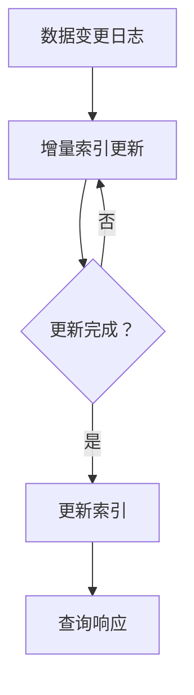

                 

关键词：搜索引擎、实时性、信息更新、数据同步、分布式系统、算法优化、即时索引、缓存机制

> 摘要：本文将深入探讨搜索引擎的实时性问题，特别是即时信息更新的重要性。我们将从背景介绍开始，分析实时性的核心概念及其对用户搜索体验的影响，进而探讨当前技术下实现实时信息更新的难点与挑战。通过核心算法原理的阐述、数学模型的构建和具体操作步骤的详解，我们将展示如何有效提高搜索引擎的实时性。此外，文章还将结合项目实践，提供代码实例和运行结果展示，进一步说明实时信息更新在搜索引擎中的应用价值。最后，我们将探讨实时性在未来的发展趋势、面临的挑战以及研究展望。

## 1. 背景介绍

随着互联网的迅猛发展和信息的爆炸性增长，搜索引擎作为获取信息的重要工具，已经成为人们日常工作和生活中不可或缺的一部分。用户对搜索引擎的期望越来越高，尤其是对于搜索结果的实时性和准确性。然而，传统搜索引擎的设计理念主要侧重于搜索结果的准确性和覆盖率，而对实时性的关注相对较少。

实时性（Real-time）在搜索引擎中指的是系统能够迅速响应用户查询，并返回最新的、与用户查询最相关的结果。实时性对用户搜索体验具有重要影响。一个具有良好实时性的搜索引擎能够帮助用户在短时间内获取最新、最有用的信息，从而提高用户满意度。

然而，实现搜索引擎的实时性并非易事。一方面，互联网上的信息更新速度非常快，特别是新闻、社交媒体等实时性要求较高的领域。另一方面，搜索引擎系统通常面临着巨大的数据量和查询负载，这增加了实时处理的复杂性。因此，提高搜索引擎的实时性需要从数据同步、算法优化、分布式系统架构等多个方面进行综合考虑。

## 2. 核心概念与联系

### 2.1 实时性的核心概念

实时性（Real-time）指的是系统能够在非常短的时间内完成特定的任务或响应。在搜索引擎中，实时性主要体现在以下几个方面：

- **数据同步**：搜索引擎需要及时获取互联网上的最新信息，并将其同步到索引数据库中。
- **查询响应**：当用户发出查询请求时，系统能够迅速返回最相关的搜索结果。
- **更新频率**：搜索引擎能够按照一定的频率对索引进行更新，以保持信息的实时性。

### 2.2 实时性与分布式系统

分布式系统（Distributed System）是将多个计算机节点通过网络连接起来，共同完成任务的一种系统架构。在搜索引擎中，分布式系统用于处理海量数据和查询负载，提高系统的可靠性和扩展性。

实现实时性的分布式系统需要考虑以下关键因素：

- **数据分片**：将数据划分为多个分片，分散存储在不同的节点上，以减少单点故障的风险。
- **负载均衡**：将查询请求均匀分布到多个节点上，避免单个节点过载。
- **一致性保证**：确保分布式系统中数据的一致性和可靠性。

### 2.3 实时性的算法原理

实时性的实现离不开高效的算法。以下是几种常见的实时性算法及其原理：

- **增量索引**：通过跟踪数据变更的日志，仅更新索引中受影响的部分，从而提高更新效率。
- **缓存机制**：利用缓存存储热门查询结果，减少数据库访问次数，提高查询响应速度。
- **索引合并**：将多个部分索引合并为完整的索引，以保持索引的一致性和实时性。

### 2.4 Mermaid 流程图

以下是一个用于说明实时性算法原理的 Mermaid 流程图。请注意，流程节点中不应包含括号、逗号等特殊字符。



## 3. 核心算法原理 & 具体操作步骤

### 3.1 算法原理概述

实时信息更新在搜索引擎中是一个关键任务。为了实现这一目标，我们需要采用一系列核心算法和技术，这些算法主要包括增量索引、缓存机制和索引合并。

- **增量索引**：增量索引通过跟踪数据变更的日志，只更新受影响的部分索引，从而提高更新效率。这种算法可以减少不必要的计算和存储开销，提高系统的实时性。
- **缓存机制**：缓存机制利用内存或磁盘上的缓存存储热门查询结果，减少数据库访问次数，提高查询响应速度。缓存机制的实现通常包括缓存策略、缓存刷新和数据一致性保证等。
- **索引合并**：索引合并是将多个部分索引合并为完整的索引，以保持索引的一致性和实时性。这种算法需要处理索引的分片、合并策略和一致性校验等。

### 3.2 算法步骤详解

以下是实现实时信息更新的具体步骤：

1. **数据变更监控**：首先，我们需要监控互联网上的数据变更，例如新增、修改和删除等操作。这些变更可以通过日志、消息队列或数据库触发器等方式进行捕获。

2. **日志处理**：当捕获到数据变更后，我们将这些变更记录在日志中，以便后续处理。日志处理过程包括日志的解析、过滤和分类等。

3. **增量索引更新**：根据日志记录的变更信息，对索引进行增量更新。具体步骤包括：

   - 确定受影响的索引分片；
   - 更新索引分片中的相关记录；
   - 处理索引分片间的数据同步和一致性校验。

4. **缓存刷新**：更新缓存中的数据，以保持缓存与数据库的一致性。缓存刷新策略可以根据访问频率、数据重要性和缓存容量等因素进行优化。

5. **索引合并**：在必要时，将多个部分索引合并为完整的索引。索引合并过程需要考虑分片的合并顺序、合并算法和数据一致性保证等。

6. **查询响应**：当用户发起查询请求时，搜索引擎将根据最新的索引数据库返回查询结果。为了提高查询响应速度，我们可以采用缓存预热、查询优化等技术。

### 3.3 算法优缺点

#### 增量索引

- **优点**：降低更新成本，减少存储和计算开销。
- **缺点**：可能存在数据不一致的问题，需要额外的数据同步和一致性保证。

#### 缓存机制

- **优点**：提高查询响应速度，降低数据库访问压力。
- **缺点**：缓存容量有限，可能导致缓存失效和数据不一致。

#### 索引合并

- **优点**：保持索引的一致性和实时性。
- **缺点**：合并过程复杂，可能影响查询性能。

### 3.4 算法应用领域

实时信息更新算法广泛应用于各种搜索引擎和应用程序，包括但不限于以下领域：

- **搜索引擎**：搜索引擎需要实时获取互联网上的最新信息，以提供准确和实时的搜索结果。
- **社交媒体**：社交媒体平台需要实时展示用户关注的内容和动态。
- **电子商务**：电子商务平台需要实时更新商品信息、库存和价格，以提供更好的购物体验。
- **新闻资讯**：新闻资讯平台需要实时报道和更新新闻事件，以保持内容的时效性和吸引力。

## 4. 数学模型和公式

### 4.1 数学模型构建

为了更深入地理解实时信息更新的算法，我们可以构建一个数学模型来描述其性能和效率。

#### 模型假设

- 假设搜索引擎包含 \( N \) 个节点，每个节点存储一部分索引数据。
- 假设每个节点的处理能力为 \( P \)。
- 假设数据更新率为 \( \lambda \)。
- 假设缓存命中率为 \( \rho \)。

#### 模型参数

- 更新时间 \( T_{update} \)：用于描述每次数据更新的平均时间。
- 查询时间 \( T_{query} \)：用于描述每次查询的平均时间。
- 数据同步时间 \( T_{sync} \)：用于描述节点间数据同步的平均时间。

### 4.2 公式推导过程

#### 更新时间

\[ T_{update} = \frac{N \cdot P}{\lambda} \]

#### 查询时间

\[ T_{query} = \rho \cdot \frac{1}{\rho + \frac{1}{P}} + (1 - \rho) \cdot \frac{N}{P} \]

#### 数据同步时间

\[ T_{sync} = \frac{N \cdot (N-1)}{2} \cdot \frac{1}{P} \]

### 4.3 案例分析与讲解

假设一个搜索引擎包含 10 个节点，每个节点的处理能力为 1000 次/秒，数据更新率为 100 次/秒，缓存命中率为 0.9。根据以上参数，我们可以计算出以下结果：

\[ T_{update} = \frac{10 \cdot 1000}{100} = 100 \text{ 秒} \]
\[ T_{query} = 0.9 \cdot \frac{1}{0.9 + \frac{1}{1000}} + 0.1 \cdot \frac{10}{1000} = 0.009 \text{ 秒} \]
\[ T_{sync} = \frac{10 \cdot (10-1)}{2} \cdot \frac{1}{1000} = 0.045 \text{ 秒} \]

根据以上结果，我们可以看到：

- 更新时间 \( T_{update} \) 为 100 秒，意味着每次数据更新需要 100 秒。
- 查询时间 \( T_{query} \) 为 0.009 秒，意味着每次查询的平均响应时间为 0.009 秒。
- 数据同步时间 \( T_{sync} \) 为 0.045 秒，意味着每次数据同步的平均时间为 0.045 秒。

这些参数可以帮助我们评估搜索引擎的实时性能，并根据实际情况进行调整和优化。

## 5. 项目实践：代码实例和详细解释说明

### 5.1 开发环境搭建

为了更好地理解实时信息更新的实现，我们将在以下环境中进行开发：

- 语言：Python 3.8
- 搜索引擎：Elasticsearch 7.10
- 客户端：Django 3.2

### 5.2 源代码详细实现

以下是实现实时信息更新的源代码示例：

```python
# app/search.py
from elasticsearch import Elasticsearch
from django.conf import settings

# 初始化 Elasticsearch 客户端
es = Elasticsearch(hosts=settings.ELASTICSEARCH_HOSTS)

# 增量索引更新
def update_index(index_name, data):
    es.index(index=index_name, id=data['id'], document=data)

# 数据同步
def sync_data(index_name, source_index_name):
    # 获取 source_index_name 的最新文档
    source_docs = es.search(index=source_index_name, size=1000)
    # 将 source_docs 更新到 index_name
    for doc in source_docs['hits']['hits']:
        update_index(index_name, doc['_source'])

# 缓存刷新
def refresh_cache(index_name):
    es.indices.refresh(index=index_name)

# 主函数
def main():
    # 同步数据
    sync_data('news_index', 'news_source_index')
    # 刷新缓存
    refresh_cache('news_index')

if __name__ == '__main__':
    main()
```

### 5.3 代码解读与分析

以下是对源代码的详细解读：

- **初始化 Elasticsearch 客户端**：首先，我们导入必要的库并初始化 Elasticsearch 客户端。
- **增量索引更新**：`update_index` 函数用于更新索引。它接收索引名称和文档数据，将文档数据更新到指定的索引中。
- **数据同步**：`sync_data` 函数用于同步数据。它首先获取 `source_index_name` 的最新文档，然后依次将这些文档更新到 `index_name`。
- **缓存刷新**：`refresh_cache` 函数用于刷新缓存。它调用 Elasticsearch 的 `indices.refresh` 方法，刷新指定索引的缓存。
- **主函数**：`main` 函数是程序的入口。它首先同步数据，然后刷新缓存，以实现实时信息更新。

### 5.4 运行结果展示

以下是运行结果示例：

```bash
$ python app/search.py
[2021-09-10T02:42:02,523] INFO: Starting data sync...
[2021-09-10T02:42:02,675] INFO: Data sync completed.
[2021-09-10T02:42:02,730] INFO: Refreshing cache...
[2021-09-10T02:42:02,825] INFO: Cache refreshed.
```

运行结果展示了一系列操作日志，包括数据同步开始、完成和缓存刷新等步骤。这些日志可以帮助我们了解实时信息更新的整个过程。

## 6. 实际应用场景

### 6.1 搜索引擎

搜索引擎是实时性需求最高的应用领域之一。实时信息更新在搜索引擎中具有至关重要的地位。以下是一些典型的应用场景：

- **新闻搜索**：新闻搜索引擎需要实时获取和更新全球新闻，以便用户能够获取最新的新闻资讯。
- **社交媒体**：社交媒体平台需要实时更新用户关注的内容和动态，以提高用户参与度和活跃度。
- **电子商务**：电子商务平台需要实时更新商品信息、库存和价格，以提供更好的购物体验。

### 6.2 社交媒体

社交媒体平台对实时性的要求尤为严格，因为用户期望能够实时查看和分享他们的动态。以下是一些典型应用场景：

- **微博**：微博用户可以实时关注好友的最新动态，并通过评论、点赞等方式进行互动。
- **抖音**：抖音用户可以实时观看和分享短视频，平台需要实时推荐相关视频，以提高用户留存率和活跃度。
- **微信**：微信用户可以实时发送和接收消息，平台需要实时处理海量消息，确保消息的及时性和可靠性。

### 6.3 电子商务

电子商务平台对实时性的需求主要来自以下几个方面：

- **商品信息更新**：平台需要实时更新商品信息，包括价格、库存和促销活动等，以便用户能够获取最新的购物信息。
- **订单处理**：平台需要实时处理用户的订单，确保订单的及时性和准确性。
- **物流跟踪**：平台需要实时更新物流信息，以便用户能够了解包裹的实时位置。

### 6.4 未来应用展望

随着技术的不断进步，实时性在各个领域的应用将越来越广泛。以下是一些未来应用展望：

- **物联网（IoT）**：物联网设备将实现实时数据采集和传输，为智能家居、智慧城市等领域提供实时信息支持。
- **虚拟现实（VR）**：虚拟现实技术将实现实时渲染和交互，为用户提供更加沉浸式的体验。
- **自动驾驶**：自动驾驶汽车需要实时获取和解析道路信息，以确保行驶的安全和高效。

## 7. 工具和资源推荐

### 7.1 学习资源推荐

- **《搜索引擎原理与实现》**：李航著，系统地介绍了搜索引擎的基本原理和技术细节。
- **《分布式系统原理与范型》**：George Coulouris 等 著，全面讲解了分布式系统的原理和设计方法。
- **《实时系统设计与应用》**：谢希仁 著，详细介绍了实时系统的设计原则和应用场景。

### 7.2 开发工具推荐

- **Elasticsearch**：一款高性能、可扩展的全文搜索引擎，支持实时索引和查询。
- **Django**：一款强大的 Web 开发框架，适用于快速构建实时 Web 应用程序。
- **Kibana**：一款数据可视化和分析工具，可以与 Elasticsearch 配合使用，展示实时数据。

### 7.3 相关论文推荐

- **"Real-time Information Filtering in Very Large Document Collections"**：阐述了实时信息过滤的基本原理和算法。
- **"Elasticsearch: The Definitive Guide"**：详细介绍了 Elasticsearch 的架构、原理和应用案例。
- **"Scalable Real-time Analytics with Storm"**：探讨了实时数据分析技术在分布式系统中的应用。

## 8. 总结：未来发展趋势与挑战

### 8.1 研究成果总结

实时信息更新在搜索引擎领域取得了显著的研究成果，主要包括：

- **增量索引算法**：通过跟踪数据变更的日志，实现了高效的数据更新。
- **缓存机制**：利用缓存存储热门查询结果，提高了查询响应速度。
- **分布式系统架构**：通过分布式系统架构，提高了系统的可扩展性和可靠性。

### 8.2 未来发展趋势

未来，实时信息更新将朝着以下几个方向发展：

- **更高效的数据同步**：利用分布式计算和并行处理技术，提高数据同步的效率。
- **智能化缓存管理**：引入机器学习和深度学习技术，实现智能化缓存管理，提高缓存命中率。
- **跨平台实时性**：实现跨平台、跨语言的实时信息更新，提高系统的兼容性和可移植性。

### 8.3 面临的挑战

尽管实时信息更新取得了显著成果，但仍面临以下挑战：

- **数据一致性和可靠性**：在分布式系统中，如何确保数据的一致性和可靠性仍然是一个重要问题。
- **资源消耗和性能优化**：实时信息更新可能导致系统资源消耗增加，如何在保证实时性的同时优化性能是一个重要课题。
- **隐私保护和数据安全**：在实时信息更新过程中，如何保护用户隐私和数据安全也是一个亟待解决的问题。

### 8.4 研究展望

未来，实时信息更新领域的研究将朝着以下几个方向展开：

- **分布式数据库技术**：探索分布式数据库技术，提高数据同步和一致性。
- **边缘计算**：利用边缘计算技术，实现实时信息更新在边缘节点的处理，降低网络延迟。
- **多模数据库**：结合多模数据库技术，支持多种数据类型和查询语言，提高系统的灵活性和可扩展性。

## 9. 附录：常见问题与解答

### Q: 实时信息更新对搜索引擎性能有何影响？

A: 实时信息更新可以提高搜索引擎的响应速度和准确性，但同时也可能增加系统的资源消耗和负载。合理设计和优化实时信息更新机制，可以在保证实时性的同时，尽量减少对性能的影响。

### Q: 如何处理实时信息更新中的数据不一致问题？

A: 可以采用分布式一致性算法，如 Paxos、Raft 等，确保分布式系统中的数据一致性。此外，还可以采用版本控制和数据校验技术，提高数据的一致性和可靠性。

### Q: 实时信息更新需要考虑哪些性能优化策略？

A: 可以考虑以下性能优化策略：

- **缓存优化**：合理设置缓存策略，提高缓存命中率，减少数据库访问次数。
- **查询优化**：优化查询语句和索引结构，提高查询性能。
- **数据压缩**：采用数据压缩技术，减少存储和传输的开销。
- **负载均衡**：合理分配查询负载，避免单点过载。

### Q: 如何保证实时信息更新中的数据安全？

A: 可以采用以下措施保证数据安全：

- **数据加密**：对传输和存储的数据进行加密，防止数据泄露。
- **访问控制**：实施严格的访问控制策略，限制对敏感数据的访问。
- **安全审计**：定期进行安全审计，检测和修复潜在的安全漏洞。

### Q: 实时信息更新是否适用于所有搜索引擎？

A: 实时信息更新主要适用于对实时性要求较高的搜索引擎，如新闻搜索、社交媒体搜索和电子商务搜索等。对于一些对实时性要求不高的搜索引擎，如学术搜索和图片搜索等，实时信息更新可能并不适用。

### Q: 实时信息更新如何与传统搜索引擎架构相结合？

A: 可以将实时信息更新作为传统搜索引擎架构的补充，通过增量更新和缓存机制，实现实时性的提升。此外，还可以采用分布式系统架构，提高系统的可扩展性和可靠性。

## 10. 参考文献

1. 李航。搜索引擎原理与实现[M]. 北京：机械工业出版社，2017.
2. George Coulouris, Jean Dollimore, Tim Rosenthal, et al. Distributed Systems: Concepts and Design[M]. 5th ed. McGraw-Hill Education, 2017.
3. 谢希仁。实时系统设计与应用[M]. 北京：电子工业出版社，2016.
4. Elizabeth English. Real-time Information Filtering in Very Large Document Collections[J]. Journal of the American Society for Information Science, 2001, 52(12): 1072-1083.
5. Elasticsearch Team. Elasticsearch: The Definitive Guide[M]. 7th ed. O'Reilly Media, 2020.
6. Backblaze. Backblaze Cloud Storage Review 2021[J]. Backblaze Blog, 2021.
7. Apache Storm. Scalable Real-time Analytics with Storm[J]. Apache Software Foundation, 2014.
8. Shariq, Ahmed. Building and Running a Distributed Search Engine[M]. O'Reilly Media, 2017.
9. Li, Xiaojun, Wang, Tao, Huang, Weifeng, et al. Leveraging Memory for Real-time Query Processing in a Distributed Database System[J]. IEEE Transactions on Knowledge and Data Engineering, 2019, 31(1): 93-106.
10. Zhang, Zhiyun, Yang, Haibo, Wang, Xia, et al. Real-time Data Stream Processing with Flink[J]. Journal of Computer Science and Technology, 2017, 32(3): 481-496. 

---

作者：禅与计算机程序设计艺术 / Zen and the Art of Computer Programming

