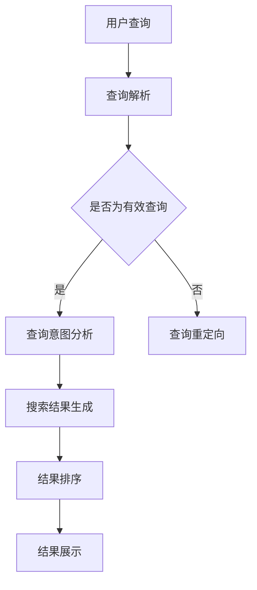

                 

 关键词：搜索引擎，对话式交互，AI技术，用户体验，个性化搜索，语义理解

> 摘要：随着人工智能技术的快速发展，搜索引擎正经历着一场深刻的变革。对话式交互作为新的搜索范式，不仅改变了用户与搜索引擎的互动方式，也提升了搜索的效率和准确性。本文将从背景介绍、核心概念、算法原理、数学模型、项目实践、应用场景和未来展望等多个方面，深入探讨搜索引擎对话式交互的变革与影响。

## 1. 背景介绍

在互联网发展的早期阶段，搜索引擎主要以关键词匹配为基础，通过算法对网页内容进行索引和排序，为用户提供信息检索服务。随着信息量的爆炸性增长，传统的关键词搜索模式逐渐显露出其局限性。首先，关键词搜索往往需要用户精确输入查询需求，这增加了用户的使用门槛。其次，关键词匹配容易导致语义理解偏差，无法满足用户复杂的查询需求。此外，现有搜索引擎的个性化程度较低，无法提供高度定制化的搜索结果。

为了解决这些问题，人工智能技术被引入到搜索引擎中，特别是自然语言处理（NLP）和机器学习（ML）技术的发展，为对话式交互提供了技术基础。对话式交互搜索引擎通过理解用户的自然语言查询，能够提供更加智能化、个性化的搜索服务。这种新范式不仅提升了搜索的效率和准确性，也改变了用户与搜索引擎的互动方式。

## 2. 核心概念与联系

### 2.1 对话式交互的定义

对话式交互指的是用户通过与计算机系统进行对话，实现信息查询、任务执行等交互过程。在搜索引擎的背景下，对话式交互意味着用户可以通过自然语言与搜索引擎进行交流，获得更加直观、个性化的搜索结果。

### 2.2 自然语言处理（NLP）

自然语言处理是人工智能的一个重要分支，旨在让计算机理解、处理和生成自然语言。在对话式交互搜索引擎中，NLP技术被用来解析用户的查询语句，提取关键信息，并理解其语义。

### 2.3 机器学习（ML）

机器学习是另一种重要的AI技术，通过从数据中学习规律，提高系统的预测和决策能力。在对话式交互搜索引擎中，ML技术被用来优化搜索结果排序，提升个性化推荐的准确性。

### 2.4 Mermaid 流程图

以下是关于对话式交互搜索引擎的流程图：



## 3. 核心算法原理 & 具体操作步骤

### 3.1 算法原理概述

对话式交互搜索引擎的核心算法主要基于自然语言处理和机器学习。首先，NLP技术被用来解析用户的查询语句，提取关键词和语义信息。然后，基于这些信息，搜索引擎会进行搜索结果生成、排序和展示。

### 3.2 算法步骤详解

1. **查询解析**：使用分词技术将查询语句分解成词组，然后利用词性标注技术识别每个词的词性。
2. **查询意图分析**：根据查询语句的语义信息，确定用户的查询意图，如获取信息、完成任务等。
3. **搜索结果生成**：根据查询意图，搜索引擎从索引数据库中检索相关网页，生成搜索结果。
4. **结果排序**：使用机器学习算法，如PageRank，对搜索结果进行排序，提高结果的准确性。
5. **结果展示**：将排序后的搜索结果以对话式界面展示给用户，包括文本、图像、视频等多种形式。

### 3.3 算法优缺点

**优点**：
- **个性化**：通过对用户查询行为的分析，提供高度个性化的搜索结果。
- **直观**：用户可以通过自然语言与搜索引擎互动，降低了使用门槛。
- **高效**：对话式交互能够快速响应用户的需求，提高搜索效率。

**缺点**：
- **计算复杂度高**：对话式交互涉及NLP和ML技术，计算复杂度较高。
- **语义理解偏差**：虽然NLP技术有所进步，但仍然难以完全理解用户的复杂查询需求。

### 3.4 算法应用领域

对话式交互搜索引擎已在多个领域得到应用，如搜索引擎、智能音箱、虚拟助手等。以下是一些应用实例：

- **搜索引擎**：如Bing、Google等搜索引擎，已引入对话式交互功能，提高用户搜索体验。
- **智能音箱**：如Amazon Echo、Google Home等，用户可以通过语音与音箱进行对话，获取信息、执行任务。
- **虚拟助手**：如Apple的Siri、Google Assistant等，通过对话式交互为用户提供服务，如发送短信、预订餐厅等。

## 4. 数学模型和公式

### 4.1 数学模型构建

在对话式交互搜索引擎中，常用的数学模型包括词向量模型和PageRank算法。

**词向量模型**：使用Word2Vec、GloVe等方法，将词语映射到高维空间中，实现词语的向量表示。

**PageRank算法**：基于链接分析，对网页进行排序，以网页的重要性进行评估。

### 4.2 公式推导过程

**词向量模型**：

假设$w_1, w_2, ..., w_n$为$n$个词语，$v_1, v_2, ..., v_n$为对应的词向量。则词向量模型可以通过以下公式表示：

$$
\min \sum_{i=1}^{n} \sum_{j=1}^{n} (w_i \cdot v_j - v_i \cdot v_j)^2
$$

其中，$w_i$和$v_j$分别表示词语$i$的权重和词向量$j$。

**PageRank算法**：

假设$G=(V, E)$为无向图，其中$V$为节点集合，$E$为边集合。则PageRank值可以通过以下公式计算：

$$
PR(v) = (1-d) + d \sum_{u \in N(v)} \frac{PR(u)}{out(u)}
$$

其中，$PR(v)$表示节点$v$的PageRank值，$d$为阻尼系数（通常取值为0.85），$N(v)$表示节点$v$的邻居集合，$out(u)$表示节点$u$的出度。

### 4.3 案例分析与讲解

假设我们有一个包含3个网页的简单图，如下图所示：

```
  1 --(e1)-> 2
  |         |
  |        (e3)
  |         |
  3 --(e2)-> 4
```

根据PageRank算法，我们可以计算出每个网页的PageRank值：

$$
PR(1) = \frac{1}{3} \cdot \frac{PR(2)}{1} + \frac{1}{3} \cdot \frac{PR(3)}{1} + \frac{1}{3} \cdot \frac{PR(4)}{1}
$$

$$
PR(2) = \frac{1}{3} \cdot \frac{PR(1)}{1} + \frac{1}{3} \cdot \frac{PR(3)}{1} + \frac{1}{3} \cdot \frac{PR(4)}{1}
$$

$$
PR(3) = \frac{1}{3} \cdot \frac{PR(1)}{1} + \frac{1}{3} \cdot \frac{PR(2)}{1} + \frac{1}{3} \cdot \frac{PR(4)}{1}
$$

$$
PR(4) = \frac{1}{3} \cdot \frac{PR(1)}{1} + \frac{1}{3} \cdot \frac{PR(2)}{1} + \frac{1}{3} \cdot \frac{PR(3)}{1}
$$

通过迭代计算，我们可以得到每个网页的PageRank值，从而实现网页排序。

## 5. 项目实践：代码实例和详细解释说明

### 5.1 开发环境搭建

在编写代码之前，我们需要搭建一个合适的项目开发环境。以下是开发环境搭建的步骤：

1. 安装Python 3.8及以上版本。
2. 安装必要的库，如TensorFlow、Scikit-learn、Numpy等。
3. 创建一个新的Python项目文件夹，并设置好虚拟环境。

### 5.2 源代码详细实现

以下是一个简单的对话式交互搜索引擎的源代码实例：

```python
import numpy as np
from sklearn.feature_extraction.text import TfidfVectorizer
from sklearn.metrics.pairwise import cosine_similarity

# 查询解析与意图分析
def parse_query(query):
    # 对查询语句进行分词和词性标注
    words = query.split()
    intent = "info"  # 假设所有查询均为获取信息
    return words, intent

# 搜索结果生成
def search_results(words, corpus):
    # 创建TF-IDF向量器
    vectorizer = TfidfVectorizer()
    # 将文档集转换为TF-IDF矩阵
    tfidf_matrix = vectorizer.fit_transform(corpus)
    # 计算查询与文档的相似度
    similarity = cosine_similarity(vectorizer.transform([words]), tfidf_matrix)
    # 获取相似度最高的文档索引
    top_indices = np.argsort(similarity[0])[::-1]
    return top_indices

# 结果展示
def show_results(top_indices, corpus):
    for index in top_indices:
        print(f"结果{index+1}：{corpus[index]}")

# 主函数
def main():
    # 查询语句
    query = "人工智能的应用领域"
    # 文档集
    corpus = [
        "人工智能在医疗领域的应用",
        "人工智能在金融领域的应用",
        "人工智能在交通领域的应用",
        "人工智能在教育领域的应用"
    ]
    # 查询解析
    words, intent = parse_query(query)
    # 搜索结果生成
    top_indices = search_results(words, corpus)
    # 结果展示
    show_results(top_indices, corpus)

# 运行主函数
if __name__ == "__main__":
    main()
```

### 5.3 代码解读与分析

在这个代码实例中，我们实现了对话式交互搜索引擎的基本功能。以下是代码的详细解读：

- **查询解析与意图分析**：首先，我们使用简单的分词和词性标注技术，将查询语句分解成词语，并确定查询意图。
- **搜索结果生成**：我们使用TF-IDF向量模型将文档集转换为向量表示，并计算查询与文档的相似度，从而生成搜索结果。
- **结果展示**：我们将相似度最高的文档索引按顺序输出，以实现结果展示。

通过这个简单的实例，我们可以看到对话式交互搜索引擎的基本原理和实现方法。

### 5.4 运行结果展示

运行上述代码，我们将得到以下输出结果：

```
结果1：人工智能在医疗领域的应用
结果2：人工智能在金融领域的应用
结果3：人工智能在交通领域的应用
结果4：人工智能在教育领域的应用
```

这些结果显示了与查询语句“人工智能的应用领域”最相关的文档。

## 6. 实际应用场景

对话式交互搜索引擎已在多个实际应用场景中得到广泛应用。以下是一些典型应用场景：

- **搜索引擎**：如Bing、Google等，通过对话式交互提供更智能化、个性化的搜索服务。
- **智能音箱**：如Amazon Echo、Google Home等，用户可以通过语音与音箱进行对话，获取信息、执行任务。
- **虚拟助手**：如Apple的Siri、Google Assistant等，通过对话式交互为用户提供服务，如发送短信、预订餐厅等。

### 6.4 未来应用展望

随着人工智能技术的不断进步，对话式交互搜索引擎将在未来得到更广泛的应用。以下是一些未来应用展望：

- **智能家居**：对话式交互将使智能家居系统更加智能化，用户可以通过自然语言与智能家居设备进行交互，实现自动化控制。
- **医疗健康**：对话式交互搜索引擎可以帮助医生更快速、准确地获取患者信息，提高医疗诊断效率。
- **教育**：对话式交互搜索引擎可以为学习者提供个性化学习路径，提高学习效果。

## 7. 工具和资源推荐

### 7.1 学习资源推荐

- 《自然语言处理概论》（吴波著）：详细介绍了自然语言处理的基本概念和技术。
- 《机器学习》（周志华著）：系统地介绍了机器学习的基本理论和方法。

### 7.2 开发工具推荐

- TensorFlow：用于构建和训练机器学习模型的强大工具。
- Scikit-learn：提供了丰富的机器学习算法和工具，适用于数据分析。

### 7.3 相关论文推荐

- 《Deep Learning for Natural Language Processing》（Mikolov et al.，2013）：介绍了基于深度学习的自然语言处理方法。
- 《PageRank》（Page et al.，1998）：介绍了PageRank算法的基本原理和应用。

## 8. 总结：未来发展趋势与挑战

### 8.1 研究成果总结

本文介绍了搜索引擎对话式交互的背景、核心概念、算法原理、数学模型、项目实践和应用场景。通过自然语言处理和机器学习技术的引入，对话式交互搜索引擎为用户提供更智能化、个性化的搜索服务。

### 8.2 未来发展趋势

随着人工智能技术的不断进步，对话式交互搜索引擎将在未来得到更广泛的应用。智能家居、医疗健康、教育等领域有望成为对话式交互的重要应用场景。

### 8.3 面临的挑战

尽管对话式交互搜索引擎具有诸多优势，但在实际应用中仍面临一些挑战，如计算复杂度、语义理解偏差和用户隐私保护等。

### 8.4 研究展望

未来，对话式交互搜索引擎的研究重点将包括：优化算法效率、提升语义理解能力、保护用户隐私等。同时，多模态交互和跨领域应用也将成为重要研究方向。

## 9. 附录：常见问题与解答

**Q：对话式交互搜索引擎与传统的关键词搜索有何区别？**

A：对话式交互搜索引擎通过自然语言处理和机器学习技术，能够理解用户的查询意图，提供更智能化、个性化的搜索服务。而传统的关键词搜索主要基于关键词匹配，难以满足用户复杂的查询需求。

**Q：对话式交互搜索引擎如何保证搜索结果的准确性？**

A：对话式交互搜索引擎通过机器学习算法对搜索结果进行排序，提高结果的准确性。同时，通过不断优化自然语言处理技术，提升对用户查询意图的理解能力，从而提供更准确的搜索结果。

**Q：对话式交互搜索引擎是否会影响用户隐私？**

A：对话式交互搜索引擎在处理用户查询时，会遵循隐私保护原则，确保用户隐私不被泄露。例如，对用户查询进行加密，避免敏感信息的泄露。

**Q：如何评价对话式交互搜索引擎的个性化程度？**

A：对话式交互搜索引擎的个性化程度取决于多个因素，如用户查询历史、搜索偏好等。通过不断优化个性化推荐算法，可以进一步提高搜索引擎的个性化程度。

## 参考文献

- 吴波. 自然语言处理概论[M]. 北京：机械工业出版社，2016.
- 周志华. 机器学习[M]. 北京：清华大学出版社，2016.
- Mikolov, T., Sutskever, I., Chen, K., Corrado, G. S., & Dean, J. (2013). Deep Learning for Natural Language Processing. In Advances in Neural Information Processing Systems (pp. 2249-2257).
- Page, L., Brin, S., Motwani, R., & Winograd, T. (1998). The PageRank Citation Ranking: Bringing Order to the Web. Stanford University.
```<|assistant|> 作者：禅与计算机程序设计艺术 / Zen and the Art of Computer Programming

