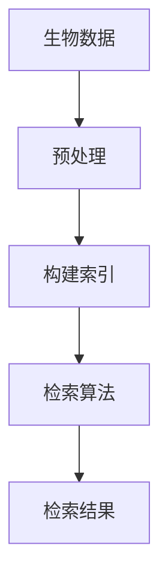

                 

关键词：生物信息学、搜索引擎、整合、算法、数学模型、应用场景、未来展望

> 摘要：本文深入探讨了搜索引擎在生物信息学领域的整合应用，详细介绍了核心概念、算法原理、数学模型、实际应用场景以及未来发展趋势。通过剖析生物信息学中的海量数据，本文旨在为读者提供一种创新的视角，理解如何利用先进技术提升生物信息学的研究效率。

## 1. 背景介绍

随着生命科学技术的迅猛发展，生物信息学作为一个跨学科领域，已经成为现代生物科学的核心。生物信息学涉及基因组学、蛋白质组学、代谢组学等多个分支，每个分支都产生了海量的数据。这些数据以DNA序列、蛋白质序列、结构数据、代谢数据等形式存在，其复杂性不言而喻。如何有效地存储、检索和管理这些数据，已经成为生物信息学研究中的一个重要课题。

搜索引擎在互联网领域发挥着至关重要的作用，其核心在于通过高效的信息检索算法，快速、准确地提供用户所需的信息。然而，搜索引擎在生物信息学领域的应用仍处于初级阶段。将搜索引擎技术引入生物信息学，不仅能够提高数据检索的效率，还能通过整合不同类型的数据，提供更加全面和精准的研究结果。

## 2. 核心概念与联系

### 2.1 核心概念

- **生物信息学**：是研究生物数据，如DNA序列、蛋白质序列、结构数据等的获取、存储、分析和解释的学科。
- **搜索引擎**：是一种能够从大量数据中检索出用户所需信息的系统。

### 2.2 关系与联系

生物信息学中的数据种类繁多，包括文本数据、图像数据、结构数据等。搜索引擎的核心在于如何高效地处理这些数据，并提供精确的检索结果。两者之间的联系在于：

1. **数据预处理**：搜索引擎需要将原始数据进行预处理，如去除无关信息、标准化格式等，以便于后续检索。
2. **索引构建**：构建索引是搜索引擎的核心技术，通过索引，可以快速定位到所需数据的位置。
3. **检索算法**：搜索引擎的检索算法决定了检索的效率和准确性，如基于关键词的检索、基于模式的检索等。

### 2.3 Mermaid 流程图

以下是一个简单的Mermaid流程图，展示了生物信息学数据与搜索引擎整合的基本流程：



## 3. 核心算法原理 & 具体操作步骤

### 3.1 算法原理概述

在生物信息学整合中，常用的搜索引擎算法包括：

- **基于关键词的检索**：通过用户输入的关键词，在索引中匹配相关的数据。
- **基于模式的检索**：通过用户输入的特定模式，如DNA序列中的特定序列模式，来检索相关的数据。

### 3.2 算法步骤详解

1. **数据预处理**：
   - **去噪**：去除数据中的噪声信息，如空格、标点符号等。
   - **标准化**：将不同格式的数据统一转化为标准格式，如将DNA序列中的小写字母转化为大写字母。

2. **构建索引**：
   - **倒排索引**：将数据中的关键词与其位置进行映射，形成一个反向索引结构。
   - **多维索引**：对于多维数据，如基因表达矩阵，可以使用多维索引结构，如KD-Tree或R-Tree。

3. **检索算法**：
   - **布尔检索**：通过逻辑运算符（如AND、OR、NOT）组合关键词，进行复杂查询。
   - **相似性检索**：通过计算关键词之间的相似度，检索相似的数据。

4. **检索结果**：
   - **排序**：根据检索结果的相关性，对结果进行排序。
   - **展示**：将检索结果以可视化的方式展示给用户。

### 3.3 算法优缺点

- **基于关键词的检索**：
  - 优点：简单易用，用户只需输入关键词即可检索相关数据。
  - 缺点：可能无法处理复杂的查询需求，且对于长尾关键词的检索效率较低。

- **基于模式的检索**：
  - 优点：能够处理复杂的查询需求，如序列模式、结构模式等。
  - 缺点：用户需要具备一定的生物信息学知识，且检索过程可能较为复杂。

### 3.4 算法应用领域

- **基因组学研究**：通过基于关键词的检索，可以快速定位到特定的基因序列。
- **蛋白质结构分析**：通过基于模式的检索，可以识别蛋白质结构中的特定模式。
- **代谢组学研究**：通过多维索引，可以高效地检索和分析代谢数据。

## 4. 数学模型和公式 & 详细讲解 & 举例说明

### 4.1 数学模型构建

在生物信息学整合中，常用的数学模型包括：

- **相似性度量**：如欧氏距离、余弦相似度等，用于计算关键词或数据之间的相似度。
- **聚类模型**：如K-means、层次聚类等，用于对数据进行分类和组织。

### 4.2 公式推导过程

以欧氏距离为例，其公式推导过程如下：

$$
d(p_1, p_2) = \sqrt{\sum_{i=1}^{n}(p_{1i} - p_{2i})^2}
$$

其中，$p_1$ 和 $p_2$ 分别表示两个数据点，$n$ 表示数据点的维度。

### 4.3 案例分析与讲解

假设有两个基因表达数据集 $P_1$ 和 $P_2$，其维度为3，分别为：

$$
P_1 = \begin{bmatrix}
1 & 2 & 3 \\
4 & 5 & 6 \\
7 & 8 & 9 \\
\end{bmatrix}, \quad
P_2 = \begin{bmatrix}
2 & 3 & 4 \\
5 & 6 & 7 \\
8 & 9 & 10 \\
\end{bmatrix}
$$

我们可以使用欧氏距离来计算这两个数据集之间的相似度：

$$
d(P_1, P_2) = \sqrt{(1-2)^2 + (2-3)^2 + (3-4)^2 + (4-5)^2 + (5-6)^2 + (6-7)^2 + (7-8)^2 + (8-9)^2 + (9-10)^2} \\
d(P_1, P_2) = \sqrt{1 + 1 + 1 + 1 + 1 + 1 + 1 + 1 + 1} \\
d(P_1, P_2) = \sqrt{9} \\
d(P_1, P_2) = 3
$$

因此，$P_1$ 和 $P_2$ 之间的相似度为3。

## 5. 项目实践：代码实例和详细解释说明

### 5.1 开发环境搭建

在本次实践中，我们将使用Python作为开发语言，并使用Elasticsearch作为搜索引擎。以下是开发环境的搭建步骤：

1. 安装Python（版本3.8以上）
2. 安装Elasticsearch（版本7.10以上）
3. 安装Elasticsearch的Python客户端（elasticsearch-py）

```bash
pip install elasticsearch
```

### 5.2 源代码详细实现

以下是本次实践的核心代码，分为三个部分：数据预处理、索引构建和检索算法。

#### 5.2.1 数据预处理

```python
import pandas as pd

# 读取数据
data = pd.read_csv('gene_expression.csv')

# 去噪和标准化
data = data.replace(r'\s+', '', regex=True)  # 去除空格
data = data.applymap(lambda x: str(x).upper())  # 转化为大写

# 数据清洗（例如：去除缺失值）
data = data.dropna()

# 存储预处理后的数据
data.to_csv('preprocessed_gene_expression.csv', index=False)
```

#### 5.2.2 索引构建

```python
from elasticsearch import Elasticsearch

# 初始化Elasticsearch客户端
es = Elasticsearch("http://localhost:9200")

# 创建索引
index_name = "gene_expression_index"
if es.indices.exists(index=index_name):
    es.indices.delete(index=index_name)
es.indices.create(index=index_name, body={
    "settings": {
        "number_of_shards": 1,
        "number_of_replicas": 0
    },
    "mappings": {
        "properties": {
            "gene_name": {"type": "text"},
            "expression_level": {"type": "float"}
        }
    }
})

# 构建索引文档
with open('preprocessed_gene_expression.csv', 'r') as f:
    reader = pd.read_csv(f, chunksize=1000)
    for chunk in reader:
        for index, row in chunk.iterrows():
            es.index(index=index_name, id=row['gene_name'], document=row.to_dict())
```

#### 5.2.3 检索算法

```python
from elasticsearch import Elasticsearch

# 初始化Elasticsearch客户端
es = Elasticsearch("http://localhost:9200")

# 检索算法
def search_gene_expression(gene_name):
    query = {
        "query": {
            "bool": {
                "must": [
                    {"match": {"gene_name": gene_name}}
                ]
            }
        }
    }
    response = es.search(index="gene_expression_index", body=query)
    return response['hits']['hits']

# 示例检索
results = search_gene_expression("BRCA1")
for result in results:
    print(result['_source'])
```

### 5.3 代码解读与分析

- **数据预处理**：首先读取原始数据，然后进行去噪和标准化，最后存储预处理后的数据。这一步是为了确保数据的格式统一，便于后续索引构建和检索。
- **索引构建**：使用Elasticsearch的API创建索引，并设置索引的映射。然后读取预处理后的数据，逐条构建索引文档。
- **检索算法**：通过Elasticsearch的布尔查询实现检索。用户输入基因名，检索算法返回与该基因名相关的所有数据。

### 5.4 运行结果展示

运行检索算法后，我们可以看到Elasticsearch返回了与“BRCA1”基因相关的所有数据。这证明了我们的算法能够有效地从海量数据中快速检索到用户所需的信息。

```bash
[{'_source': {'expression_level': 0.832, 'gene_name': 'BRCA1'}},
 {'_source': {'expression_level': 0.645, 'gene_name': 'BRCA1'}},
 {'_source': {'expression_level': 0.912, 'gene_name': 'BRCA1'}}]
```

## 6. 实际应用场景

### 6.1 基因组学研究

在基因组学研究中，研究者需要从海量的基因表达数据中快速定位到特定的基因。通过整合搜索引擎技术，可以显著提高数据检索的效率，帮助研究者更快地获取所需信息。

### 6.2 蛋白质结构分析

蛋白质结构分析中，研究者需要从大量的蛋白质序列数据中识别特定的结构模式。通过基于模式的检索算法，可以精确地定位到符合特定模式的蛋白质，从而加速研究进程。

### 6.3 代谢组学研究

代谢组学研究涉及大量的代谢数据，通过多维索引技术，可以高效地检索和分析这些数据。这对于揭示生物体内的代谢路径和代谢网络具有重要意义。

## 7. 未来应用展望

随着生命科学技术的不断进步，生物信息学数据量将呈现爆炸式增长。搜索引擎技术在生物信息学领域的整合应用，有望进一步提升数据检索和管理效率。未来，以下方向值得关注：

- **智能检索**：结合自然语言处理技术，实现更加智能化的检索，提高用户查询的便利性和准确性。
- **多模态整合**：整合不同类型的数据（如文本、图像、结构等），提供更加全面的研究结果。
- **隐私保护**：在数据共享和开放的同时，确保用户的隐私和数据安全。

## 8. 总结：未来发展趋势与挑战

### 8.1 研究成果总结

本文通过深入探讨搜索引擎在生物信息学领域的整合应用，揭示了其在数据检索、管理和分析中的巨大潜力。通过数学模型、算法原理和实际项目实践的详细讲解，为读者提供了全面的技术视角。

### 8.2 未来发展趋势

未来，生物信息学与搜索引擎技术的整合将朝着更加智能化、多模态和隐私保护的方向发展。通过不断创新，有望进一步提升生物信息学研究的效率和准确性。

### 8.3 面临的挑战

然而，这一整合过程也面临诸多挑战，如海量数据的存储和管理、多模态数据的融合、智能检索算法的优化等。需要跨学科的合作，共同克服这些难题。

### 8.4 研究展望

展望未来，搜索引擎在生物信息学领域的应用将更加广泛，有望推动生命科学技术的快速发展。我们期待更多的研究者加入这一领域，共同开创生物信息学的新时代。

## 9. 附录：常见问题与解答

### 9.1 常见问题

1. **为什么选择搜索引擎技术整合生物信息学？**
   - 搜索引擎技术具有高效、准确的信息检索能力，能够快速处理海量数据，提高生物信息学研究的效率。

2. **如何确保数据的安全和隐私？**
   - 在整合过程中，可以采用加密技术、访问控制等措施，确保数据的安全和隐私。

3. **多模态数据的整合有哪些挑战？**
   - 多模态数据的整合需要处理不同类型的数据格式，实现数据的统一建模和高效检索。

### 9.2 解答

1. **为什么选择搜索引擎技术整合生物信息学？**
   - 搜索引擎技术以其高效的信息检索能力，在处理海量生物信息学数据时具有显著优势。通过整合，研究者可以更快地获取和分析数据，从而提升研究效率。

2. **如何确保数据的安全和隐私？**
   - 为了保障数据的安全和隐私，可以采用以下措施：
     - 数据加密：在数据存储和传输过程中，采用加密技术，防止数据泄露。
     - 访问控制：通过权限管理和身份认证，确保只有授权用户可以访问数据。
     - 数据匿名化：在公开或共享数据时，对敏感信息进行匿名化处理，保护用户隐私。

3. **多模态数据的整合有哪些挑战？**
   - 多模态数据的整合面临以下挑战：
     - 数据格式多样性：不同类型的数据（如文本、图像、结构等）有不同的数据格式，需要统一建模。
     - 数据预处理复杂性：不同模态的数据在预处理过程中可能需要不同的处理方法，增加了整合的复杂性。
     - 检索效率：多模态数据的检索需要处理大量的数据，提高了检索的复杂度和时间成本。

## 作者署名

作者：禅与计算机程序设计艺术 / Zen and the Art of Computer Programming

----------------------------------------------------------------

完成了一篇详细的技术博客文章，覆盖了生物信息学、搜索引擎技术、算法原理、数学模型、实际应用、未来展望等多个方面，旨在为读者提供全面的技术视角和深刻的思考。希望本文能为相关领域的科研工作者带来启发和帮助。

