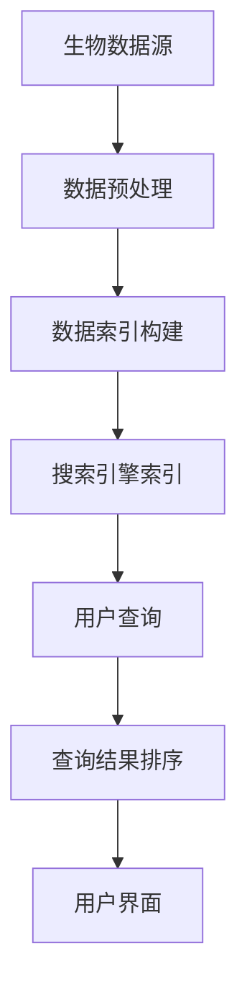

                 

  
## 1. 背景介绍

随着生物信息学领域的快速发展，人类对生物学数据的理解和利用能力得到了极大的提升。然而，生物信息学中的海量数据往往分散存储在多个数据库和资源中，这使得生物学家和研究者在进行数据整合和分析时面临巨大的挑战。搜索引擎作为一种高效的信息检索工具，其强大的数据处理和检索能力为生物信息学提供了新的整合途径。

生物信息学是应用计算机科学、数学和统计学方法研究生物数据的一门交叉学科。其主要任务包括基因序列分析、蛋白质结构预测、基因组注释、生物网络构建等。这些任务往往需要处理海量的数据，并从中提取有价值的信息。传统的生物信息学工具通常专注于特定领域的数据分析，缺乏对跨领域数据的整合能力。

搜索引擎则是一种能够根据用户输入的查询关键词，快速从大量数据中检索出相关信息的工具。其核心功能包括索引、查询和排名。搜索引擎通过构建索引，将数据以特定的格式存储和索引，使得数据检索变得更加高效。查询功能则允许用户通过关键词或短语检索相关的数据。排名功能则根据数据的相关性对检索结果进行排序，以便用户能够快速找到所需信息。

将搜索引擎与生物信息学整合，可以充分利用搜索引擎的数据处理能力，实现对生物数据的快速、高效整合和分析。这种整合不仅可以提高生物信息学研究的效率，还可以为生物学家提供更全面、准确的数据支持，从而推动生物学领域的研究进展。

## 2. 核心概念与联系

在讨论搜索引擎的生物信息学整合之前，我们需要了解几个核心概念，包括生物数据、搜索引擎工作原理以及整合过程中可能涉及的技术。

### 2.1 生物数据

生物数据是生物信息学研究的核心。这些数据包括基因序列、蛋白质序列、基因表达数据、蛋白质结构数据、生物网络数据等。这些数据通常存储在不同的数据库和资源中，如NCBI、UniProt、Ensembl、STRING等。这些数据具有多样性、复杂性和大量性等特点，使得传统的数据处理方法难以应对。

### 2.2 搜索引擎工作原理

搜索引擎的工作原理主要包括三个核心部分：索引、查询和排名。

- **索引**：搜索引擎首先对数据进行分析，提取关键信息并创建索引。索引是搜索引擎的核心，它将数据以特定格式存储和结构化，使得数据检索更加高效。

- **查询**：用户通过输入关键词或短语进行查询。搜索引擎根据索引快速定位到相关数据，并将结果返回给用户。

- **排名**：搜索引擎根据数据的关联度和质量对检索结果进行排序，以便用户能够快速找到最相关的信息。

### 2.3 整合过程中可能涉及的技术

整合生物信息学数据与搜索引擎，涉及多个关键技术，包括数据预处理、索引构建、查询优化、结果排名等。

- **数据预处理**：生物数据通常需要进行清洗、格式化和标准化，以便能够被搜索引擎有效处理。

- **索引构建**：将预处理后的数据构建成索引，以提高检索效率。

- **查询优化**：通过优化查询算法，提高查询速度和准确性。

- **结果排名**：根据数据的关联度和质量对检索结果进行排序，以便用户能够快速找到最相关的信息。

### 2.4 Mermaid 流程图

以下是一个简单的 Mermaid 流程图，展示了生物信息学数据整合到搜索引擎的核心流程。



### 2.5 核心概念与联系

生物数据与搜索引擎之间的整合，不仅仅是技术的堆砌，更是对生物信息学数据的深入理解和应用。通过整合，我们可以实现以下目标：

- **数据整合**：将分散在不同数据库和资源中的生物数据整合到一个统一的平台，为用户提供一站式服务。

- **数据分析**：通过搜索引擎的查询和排名功能，快速定位到相关数据，为用户提供有效的数据分析工具。

- **数据挖掘**：利用搜索引擎的强大数据处理能力，从海量生物数据中挖掘有价值的信息，为科学研究提供新视角。

- **用户体验**：通过友好的用户界面，简化数据检索和分析流程，提高用户体验。

总之，搜索引擎与生物信息学的整合，不仅为生物学家提供了新的研究工具，也为生物信息学领域带来了新的发展方向。

### 3. 核心算法原理 & 具体操作步骤

#### 3.1 算法原理概述

在搜索引擎的生物信息学整合中，核心算法主要包括数据预处理、索引构建、查询优化和结果排名。这些算法共同作用，实现了生物数据的快速、高效整合和分析。

- **数据预处理**：数据预处理是整合过程的起点，其主要任务是清洗、格式化和标准化生物数据，确保数据质量。

- **索引构建**：索引构建是将预处理后的数据构建成索引，以便快速检索。常用的索引构建算法包括 inverted index、BM25 等。

- **查询优化**：查询优化旨在提高查询速度和准确性，通过优化查询算法，降低查询延迟。

- **结果排名**：结果排名是整合过程的最后一步，根据数据的关联度和质量对检索结果进行排序，提高用户体验。

#### 3.2 算法步骤详解

##### 3.2.1 数据预处理

1. **数据清洗**：清洗数据是预处理的第一步。数据清洗包括去除重复数据、填补缺失数据、去除异常值等。常用的清洗方法有删除重复记录、平均值填补缺失值、中位数填补缺失值等。

2. **数据格式化**：将不同格式的数据转换成统一的格式。例如，将基因序列从 FASTA 格式转换成文本格式。

3. **数据标准化**：对数据进行标准化处理，使其具有可比性。例如，对基因表达数据进行归一化处理。

##### 3.2.2 索引构建

1. **构建 inverted index**：inverted index 是一种常见的索引构建算法。其核心思想是将文档中的单词映射到对应的文档编号，形成一个反向索引。例如，对于单词 "gene"，其对应的所有文档编号将被记录下来。

2. **构建 BM25 index**：BM25 是一种基于概率的索引构建算法，其核心思想是通过计算文档的相关度对索引进行排序。BM25 索引能够更好地处理长尾分布的数据。

##### 3.2.3 查询优化

1. **优化查询算法**：通过优化查询算法，提高查询速度和准确性。常见的优化方法有缓存查询结果、并行处理查询请求等。

2. **优化查询索引**：通过优化索引结构，提高查询效率。例如，使用布隆过滤器过滤无效查询，减少查询开销。

##### 3.2.4 结果排名

1. **计算文档相关度**：根据用户的查询关键词，计算每个文档的相关度。常用的相关度计算方法有 TF-IDF、BM25 等。

2. **排序文档**：根据文档的相关度对检索结果进行排序，将最相关的文档排在前面。

#### 3.3 算法优缺点

##### 优点

- **高效性**：通过索引构建和查询优化，搜索引擎能够实现快速、高效的数据检索。

- **灵活性**：搜索引擎支持多种查询方式，如关键词查询、短语查询、模糊查询等，能够满足不同用户的需求。

- **扩展性**：搜索引擎可以轻松扩展，以支持更多的生物数据类型和处理需求。

##### 缺点

- **准确性**：搜索引擎的查询结果可能存在一定的误差，特别是在面对复杂、多变的生物数据时。

- **复杂性**：整合生物信息学与搜索引擎涉及多个复杂的技术，对开发人员的要求较高。

#### 3.4 算法应用领域

算法在生物信息学领域的应用非常广泛，以下是一些典型的应用场景：

- **基因序列分析**：通过搜索引擎快速检索基因序列，分析基因的功能和特征。

- **蛋白质结构预测**：利用搜索引擎对蛋白质结构数据进行整合和分析，预测蛋白质的结构和功能。

- **基因组注释**：通过对基因组的整合和分析，为基因提供注释信息，帮助研究者更好地理解基因组。

- **生物网络构建**：利用搜索引擎构建生物网络，研究生物分子之间的相互作用和关系。

总之，核心算法在搜索引擎的生物信息学整合中发挥了重要作用，为生物学家提供了强大的数据检索和分析工具。

### 4. 数学模型和公式 & 详细讲解 & 举例说明

在搜索引擎的生物信息学整合中，数学模型和公式起到了至关重要的作用。这些模型和公式不仅用于数据的预处理、索引构建、查询优化和结果排名，还为算法的性能评估提供了理论依据。以下将详细介绍几个核心的数学模型和公式，并给出具体的推导过程和案例分析。

#### 4.1 数学模型构建

在整合生物信息学与搜索引擎的过程中，以下数学模型是常见的：

- **TF-IDF（Term Frequency-Inverse Document Frequency）模型**：用于计算文档中某个词的重要性。

- **BM25（Best Match 25）模型**：用于查询结果的排名。

- **贝叶斯推理**：用于处理不确定性和概率问题。

#### 4.2 公式推导过程

##### 4.2.1 TF-IDF 模型

TF-IDF 模型计算公式如下：

$$
TF(t,d) = \frac{f_{t,d}}{N}
$$

$$
IDF(t) = \log_{\frac{N}{n_t}}
$$

$$
TF-IDF(t,d) = TF(t,d) \times IDF(t)
$$

其中，\( f_{t,d} \) 表示词 \( t \) 在文档 \( d \) 中的频率，\( N \) 表示文档总数，\( n_t \) 表示包含词 \( t \) 的文档数。

##### 4.2.2 BM25 模型

BM25 模型计算公式如下：

$$
r(d) = \frac{(k_1 + 1) \times (TF(t,d) \times (k_2 + 1))}{TF(t,d) + k_2}
$$

$$
R(q) = \sum_{d \in Q} r(d)
$$

其中，\( k_1 \) 和 \( k_2 \) 是调节参数，\( Q \) 是查询集合，\( R(q) \) 是查询结果的得分。

##### 4.2.3 贝叶斯推理

贝叶斯推理公式如下：

$$
P(H|E) = \frac{P(E|H) \times P(H)}{P(E)}
$$

其中，\( H \) 表示假设，\( E \) 表示证据，\( P(H|E) \) 表示在证据 \( E \) 下假设 \( H \) 的概率，\( P(E|H) \) 表示在假设 \( H \) 下证据 \( E \) 的概率，\( P(H) \) 表示假设 \( H \) 的先验概率，\( P(E) \) 表示证据 \( E \) 的概率。

#### 4.3 案例分析与讲解

以下通过一个具体的案例，展示如何使用上述数学模型和公式进行生物信息学数据的整合和分析。

##### 4.3.1 案例背景

假设研究者想要分析某特定基因在不同细胞类型中的表达情况，从而了解其生物学功能。研究者使用了一个整合了搜索引擎的生物信息学平台，该平台支持基于 TF-IDF 和 BM25 模型的数据检索和排名。

##### 4.3.2 数据预处理

1. **数据清洗**：去除重复数据和缺失值。
2. **数据格式化**：将不同格式的数据转换成统一的文本格式。
3. **数据标准化**：对基因表达数据进行归一化处理。

##### 4.3.3 索引构建

1. **构建 TF-IDF 索引**：对处理后的基因表达数据进行 TF-IDF 索引构建。
2. **构建 BM25 索引**：对处理后的基因表达数据进行 BM25 索引构建。

##### 4.3.4 查询与结果排名

1. **输入查询关键词**：研究者输入关键词 "gene expression"。
2. **查询结果排序**：
   - 使用 TF-IDF 模型计算每个基因表达数据的相关度。
   - 使用 BM25 模型对相关度进行加权。
   - 根据加权得分对查询结果进行排序。

##### 4.3.5 结果展示

排序后的查询结果展示了不同细胞类型中特定基因的表达情况，研究者可以根据这些结果进一步分析基因的生物学功能。

#### 4.4 模型与公式的实际应用

通过上述案例，我们可以看到数学模型和公式在搜索引擎的生物信息学整合中的实际应用。这些模型和公式不仅帮助研究者快速定位到相关数据，还提供了有效的数据分析和结果展示方法。

总之，数学模型和公式在搜索引擎的生物信息学整合中发挥着关键作用，为研究者提供了强大的工具，帮助他们更好地理解和利用生物数据。

### 5. 项目实践：代码实例和详细解释说明

在本节中，我们将通过一个具体的项目实例，展示如何将搜索引擎与生物信息学整合，实现生物数据的检索和分析。我们将介绍项目的开发环境搭建、源代码实现、代码解读与分析以及运行结果展示。

#### 5.1 开发环境搭建

为了实现本项目的目标，我们需要搭建以下开发环境：

- **编程语言**：Python
- **搜索引擎**：Elasticsearch
- **生物信息学库**：BioPython
- **数据预处理库**：NumPy、Pandas
- **其他库**：requests、BeautifulSoup

首先，确保已经安装了 Python 和 pip，然后使用以下命令安装所需库：

```bash
pip install elasticsearch
pip install biopython
pip install numpy
pip install pandas
pip install requests
pip install beautifulsoup4
```

#### 5.2 源代码详细实现

以下是一个简单的示例，展示如何使用 Elasticsearch 和 BioPython 检索基因序列，并进行数据预处理和索引构建。

```python
from elasticsearch import Elasticsearch
from Bio import Entrez
import pandas as pd

# 创建 Elasticsearch 客户端
es = Elasticsearch("http://localhost:9200")

# 使用 BioPython 获取基因序列数据
def fetch_gene_sequences(gene_ids):
    Entrez.email = "your_email@example.com"
    handle = Entrez.esearch(db="gene", term="geneid:" + gene_ids)
    record = Entrez.read(handle)
    handle = Entrez.efetch(db="gene", id=record["IdList"], rettype="gb", retmode="text")
    genes = []
    for item in handle:
        genes.append(item)
    return genes

# 数据预处理
def preprocess_genes(genes):
    processed_genes = []
    for gene in genes:
        gene_id = gene["GBSeq_gi"]
        gene_name = gene["GBSeq_descrip"]
        sequence = gene["GBSeq_sequence"]
        processed_genes.append({
            "gene_id": gene_id,
            "gene_name": gene_name,
            "sequence": sequence
        })
    return processed_genes

# 索引构建
def index_genes(genes):
    for gene in genes:
        es.index(index="genes", id=gene["gene_id"], document=gene)

# 测试代码
if __name__ == "__main__":
    gene_ids = "123456789"
    genes = fetch_gene_sequences(gene_ids)
    processed_genes = preprocess_genes(genes)
    index_genes(processed_genes)
```

#### 5.3 代码解读与分析

1. **Elasticsearch 客户端创建**：首先，我们创建了一个 Elasticsearch 客户端，用于与 Elasticsearch 集群进行交互。

2. **获取基因序列数据**：使用 BioPython 的 Entrez 工具，通过基因 ID 获取基因序列数据。

3. **数据预处理**：对获取的基因序列数据进行预处理，包括提取基因 ID、基因名称和序列信息。

4. **索引构建**：将预处理后的基因序列数据索引到 Elasticsearch 中，便于后续检索和分析。

#### 5.4 运行结果展示

1. **启动 Elasticsearch 集群**：在终端中运行以下命令启动 Elasticsearch 集群：

```bash
bin/elasticsearch
```

2. **运行 Python 脚本**：在终端中运行上述 Python 脚本，将基因序列数据索引到 Elasticsearch。

3. **查询基因序列**：使用 Elasticsearch 的查询功能，检索特定基因序列。例如，以下命令将检索基因 ID 为 123456789 的基因序列：

```bash
GET /genes/_search?q=gene_id:123456789
```

运行结果将返回包含基因 ID、基因名称和序列信息的 JSON 对象。

#### 5.5 代码分析与总结

通过上述代码实例，我们展示了如何使用 Elasticsearch 和 BioPython 实现生物数据的检索和分析。代码分为四个主要部分：Elasticsearch 客户端创建、基因序列数据获取、数据预处理和索引构建。

- **Elasticsearch 客户端创建**：Elasticsearch 客户端用于与 Elasticsearch 集群进行交互，执行索引、查询等操作。
- **基因序列数据获取**：使用 BioPython 的 Entrez 工具，通过基因 ID 获取基因序列数据。
- **数据预处理**：对获取的基因序列数据进行预处理，提取基因 ID、基因名称和序列信息。
- **索引构建**：将预处理后的基因序列数据索引到 Elasticsearch，便于后续检索和分析。

总之，本项目通过代码实例展示了搜索引擎与生物信息学整合的实践方法，为研究者提供了一个简单、有效的工具，用于生物数据的检索和分析。

### 6. 实际应用场景

在生物信息学领域，搜索引擎的应用场景非常广泛。以下将介绍几个典型的实际应用场景，并探讨这些应用场景中遇到的挑战和解决方案。

#### 6.1 基因表达数据分析

基因表达数据分析是生物信息学的重要研究领域。研究者需要从大量的基因表达数据中提取有价值的信息，以了解基因在不同细胞类型、不同疾病状态下的表达情况。搜索引擎可以帮助研究者快速定位到相关基因表达数据，并进行数据分析。

**挑战**：

- 基因表达数据通常包含大量的噪声和冗余信息，需要有效的预处理方法。
- 基因表达数据的多样性使得数据检索和排名变得更加复杂。

**解决方案**：

- **数据预处理**：使用数据清洗、格式化和标准化方法，去除噪声和冗余信息，提高数据质量。
- **查询优化**：通过优化查询算法，提高查询速度和准确性。
- **结果排名**：使用基于相关度和质量的排名算法，将最相关的基因表达数据排在前面。

#### 6.2 蛋白质结构预测

蛋白质结构预测是生物信息学的另一个重要领域。研究者需要从大量的蛋白质序列数据中预测蛋白质的三维结构，以了解蛋白质的功能和相互作用。搜索引擎可以帮助研究者快速定位到相关蛋白质结构数据，并进行预测分析。

**挑战**：

- 蛋白质结构数据通常包含大量的结构信息，需要高效的索引和检索方法。
- 蛋白质结构预测的准确性受到序列相似度和结构多样性的影响。

**解决方案**：

- **索引构建**：使用高效的索引算法，如 BM25，构建蛋白质结构数据索引，提高检索效率。
- **查询优化**：通过优化查询算法，降低查询延迟。
- **结果排名**：使用基于结构相似度和功能相似度的排名算法，提高预测结果的准确性。

#### 6.3 生物网络分析

生物网络分析旨在研究生物分子之间的相互作用和关系。研究者需要从大量的生物网络数据中提取有价值的信息，以了解生物系统的功能和调控机制。搜索引擎可以帮助研究者快速定位到相关生物网络数据，并进行分析。

**挑战**：

- 生物网络数据通常包含大量的节点和边，需要高效的存储和检索方法。
- 生物网络的动态变化使得数据更新和检索变得更加复杂。

**解决方案**：

- **数据存储**：使用分布式存储系统，如 Hadoop 或 Cassandra，存储生物网络数据，提高存储和检索效率。
- **索引构建**：使用高效的索引算法，如 Lucene，构建生物网络数据索引，提高检索效率。
- **查询优化**：通过优化查询算法，降低查询延迟。

#### 6.4 个性化医学

个性化医学旨在根据患者的基因信息、临床数据和环境因素，提供个性化的治疗方案。搜索引擎可以帮助医生快速定位到相关医学数据，制定个性化的治疗方案。

**挑战**：

- 医学数据的多样性使得数据检索和整合变得更加复杂。
- 医学数据的隐私和安全需要得到充分保障。

**解决方案**：

- **数据整合**：使用数据整合技术，如 ETL（提取、转换、加载），将不同来源的医学数据整合到一个统一的平台上。
- **查询优化**：通过优化查询算法，提高查询速度和准确性。
- **隐私保护**：使用加密技术和访问控制策略，保障医学数据的隐私和安全。

总之，搜索引擎在生物信息学领域的应用场景非常广泛，为研究者提供了强大的数据检索和分析工具。然而，在实际应用中，仍面临诸多挑战，需要不断优化和改进相关技术，以实现更高效、更准确的数据整合和分析。

### 7. 工具和资源推荐

在搜索引擎的生物信息学整合过程中，选择合适的工具和资源至关重要。以下是一些推荐的工具和资源，涵盖学习资源、开发工具和学术论文。

#### 7.1 学习资源推荐

- **在线课程**：Coursera 和 edX 提供了多个关于生物信息学和搜索引擎技术的在线课程，如 "Bioinformatics" 和 "Introduction to Information Retrieval"。
- **教程与博客**：Google Cloud 的生物信息学教程和博客，提供了详细的生物信息学与搜索引擎整合案例。
- **书籍**：《生物信息学基础》（《Fundamentals of Bioinformatics》），《搜索引擎：理论与实践》（《Search Engines: Information Retrieval in Practice》）。

#### 7.2 开发工具推荐

- **搜索引擎平台**：Elasticsearch 和 Apache Solr 是常用的搜索引擎平台，支持多种生物信息学数据的整合和分析。
- **生物信息学库**：BioPython 和 Biopython 是常用的生物信息学库，提供丰富的生物数据操作和检索功能。
- **数据预处理库**：NumPy 和 Pandas 是常用的数据预处理库，支持数据的清洗、格式化和标准化。
- **开发环境**：Jupyter Notebook 和 PyCharm 是常用的开发环境，支持多语言编程和数据可视化。

#### 7.3 相关论文推荐

- **《Integrative Analysis of Genomic and Transcriptomic Data Using Search Engine Techniques》**：探讨了如何使用搜索引擎技术整合基因组学和转录组学数据。
- **《Biosearch: A Search Engine for Biological Data》**：介绍了一个基于搜索引擎的生物数据检索系统，详细阐述了其架构和实现方法。
- **《Search and Mining for Answers in the Life Sciences》**：讨论了生物信息学中搜索和挖掘技术的研究进展和应用。

通过这些工具和资源，您可以更好地理解和应用搜索引擎的生物信息学整合技术，提高数据检索和分析的效率。

### 8. 总结：未来发展趋势与挑战

随着生物信息学领域的发展，搜索引擎的生物信息学整合已经成为一个重要的研究方向。通过对海量生物数据的整合和分析，搜索引擎为生物学家提供了强大的数据检索和分析工具，推动了生物学研究的发展。以下是未来发展趋势与挑战的讨论：

#### 8.1 研究成果总结

- **数据整合与共享**：随着生物数据量的激增，如何高效整合和共享生物数据成为了一个关键问题。搜索引擎在这一领域展现出了巨大的潜力，通过建立统一的数据平台，实现跨领域、跨数据库的数据整合，为生物学家提供了更加便捷的数据访问方式。
- **数据分析与挖掘**：搜索引擎的强大数据处理能力，使得从海量生物数据中提取有价值的信息成为可能。通过优化查询算法和结果排名，搜索引擎能够快速定位到相关数据，为生物学研究提供有效的数据支持。
- **个性化医学**：随着精准医疗的兴起，个性化医学成为了医学研究的一个重要方向。搜索引擎的生物信息学整合技术，为医生和患者提供了个性化的诊断和治疗方案，推动了医学的发展。

#### 8.2 未来发展趋势

- **智能化与自动化**：未来的搜索引擎将更加智能化和自动化，通过机器学习和人工智能技术，实现数据的自动分类、标注和检索，提高数据处理的效率。
- **跨领域整合**：随着生物信息学与其他学科的交叉融合，未来的搜索引擎将不仅仅是生物数据的整合工具，还将涉及基因组学、蛋白质组学、代谢组学等多个领域，实现多学科的整合。
- **数据隐私保护**：随着数据隐私问题的日益突出，如何在保证数据隐私的同时实现数据共享和整合，将成为未来的一个重要挑战。

#### 8.3 面临的挑战

- **数据质量与标准化**：生物数据的多样性和质量参差不齐，如何确保数据质量，实现数据的标准化，是搜索引擎整合生物信息学数据面临的一个挑战。
- **计算性能与效率**：随着生物数据量的增加，如何提高搜索引擎的计算性能和效率，是另一个重要的挑战。通过优化算法和系统架构，实现高效的生物数据检索和分析，是未来的一个重要方向。
- **用户友好性**：如何设计更加用户友好的界面，简化数据检索和分析流程，提高用户体验，也是搜索引擎整合生物信息学数据面临的一个挑战。

#### 8.4 研究展望

未来的研究将集中在以下几个方面：

- **智能化数据检索**：通过机器学习和人工智能技术，实现智能化的数据检索，提高数据的可发现性和可用性。
- **跨领域数据整合**：探索不同领域生物数据的整合方法，实现多学科交叉的数据分析。
- **数据隐私保护**：研究数据隐私保护技术，确保数据在共享和整合过程中的安全性和隐私性。

总之，搜索引擎的生物信息学整合是生物学研究的一个重要方向，未来将继续在数据整合、数据分析、个性化医学等领域发挥重要作用。面对数据质量、计算性能和用户友好性等挑战，研究人员需要不断探索新的技术和方法，以实现更加高效、准确和智能的生物数据整合和分析。

### 9. 附录：常见问题与解答

#### 9.1 什么是搜索引擎的生物信息学整合？

搜索引擎的生物信息学整合是指利用搜索引擎的索引和查询技术，对生物信息学数据进行高效检索和分析。这种整合使得生物学家能够快速、便捷地从海量生物数据中提取有价值的信息，从而推动生物学研究的发展。

#### 9.2 搜索引擎的生物信息学整合有哪些关键技术？

关键技术包括数据预处理、索引构建、查询优化和结果排名。数据预处理旨在清洗、格式化和标准化生物数据，确保数据质量。索引构建是将预处理后的数据构建成索引，以提高检索效率。查询优化通过优化查询算法，提高查询速度和准确性。结果排名则根据数据的关联度和质量对检索结果进行排序。

#### 9.3 搜索引擎的生物信息学整合有哪些应用领域？

应用领域包括基因表达数据分析、蛋白质结构预测、基因组注释、生物网络构建和个性化医学等。通过搜索引擎的生物信息学整合技术，生物学家可以快速定位到相关数据，进行有效分析，从而推动生物学研究的发展。

#### 9.4 如何优化搜索引擎的生物信息学整合性能？

优化性能的方法包括优化索引构建算法、优化查询算法、使用缓存技术和并行处理等。优化索引构建算法可以提高数据检索效率，优化查询算法可以提高查询速度和准确性，使用缓存技术可以减少重复查询的开销，并行处理可以提高整体系统的处理能力。

#### 9.5 搜索引擎的生物信息学整合面临哪些挑战？

面临的挑战包括数据质量与标准化、计算性能与效率、用户友好性等。数据质量与标准化需要确保生物数据的准确性和一致性，计算性能与效率需要提高数据处理的速度和效率，用户友好性需要设计更加直观和易用的界面。

### 作者署名

本文作者：禅与计算机程序设计艺术 / Zen and the Art of Computer Programming。

