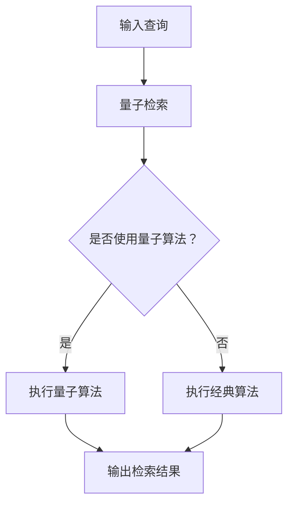

                 

关键词：搜索引擎、量子计算、性能提升、算法优化、应用领域、未来展望

> 摘要：随着量子计算技术的不断发展，其在搜索引擎领域的应用前景备受关注。本文将深入探讨量子计算在搜索引擎中的应用原理、优势、挑战及其未来发展趋势。

## 1. 背景介绍

### 1.1 量子计算简介

量子计算是一种基于量子力学原理的新型计算模式，它利用量子位（qubits）进行信息处理。与传统计算机使用二进制位（bits）不同，量子位可以同时处于0和1的状态，这种叠加态使得量子计算机在处理某些特定问题时具有巨大的并行计算能力。

### 1.2 搜索引擎简介

搜索引擎是一种能够从海量数据中检索信息的工具，它已经成为互联网的重要组成部分。搜索引擎的核心功能是索引和检索，通过爬虫技术收集互联网上的数据，并将其存储在索引库中。当用户进行搜索时，搜索引擎会根据用户的查询关键词，从索引库中快速检索出相关的信息。

## 2. 核心概念与联系

为了更好地理解量子计算在搜索引擎中的应用，我们需要首先了解一些核心概念。

### 2.1 量子位

量子位是量子计算的基本单位，它具有叠加态和纠缠态的特性。叠加态意味着量子位可以同时处于0和1的状态，而纠缠态则意味着两个或多个量子位之间存在着某种相互关联。

### 2.2 量子门

量子门是量子计算中的操作单元，类似于传统计算机中的逻辑门。量子门可以对量子位进行线性变换，从而实现复杂的运算。

### 2.3 量子算法

量子算法是利用量子计算机进行信息处理的一系列算法。与经典算法相比，量子算法在解决某些特定问题时具有显著的优势。

### 2.4 搜索引擎算法

搜索引擎算法是用于索引和检索信息的一系列算法。传统的搜索引擎算法主要包括PageRank算法、LSI算法、向量空间模型等。

### 2.5 Mermaid 流程图

以下是一个描述量子计算在搜索引擎中应用流程的Mermaid流程图：



## 3. 核心算法原理 & 具体操作步骤

### 3.1 算法原理概述

量子计算在搜索引擎中的应用主要通过量子检索算法实现。量子检索算法利用量子计算机的并行计算能力，对搜索查询进行高效处理。其核心原理包括量子位叠加、量子门操作和量子测量。

### 3.2 算法步骤详解

量子检索算法的具体步骤如下：

1. **初始化**：将输入查询转化为量子状态，并将其编码到量子位上。
2. **叠加**：将量子位处于叠加态，使得查询在所有可能的索引项上同时存在。
3. **量子门操作**：利用量子门对量子状态进行变换，增强与查询相关的索引项的概率。
4. **量子测量**：对量子状态进行测量，得到与查询最相关的索引项。
5. **输出结果**：将测量结果解码，输出检索结果。

### 3.3 算法优缺点

量子检索算法具有以下优点：

- **并行计算能力**：量子计算机的并行计算能力可以显著提高搜索引擎的处理速度。
- **高效性**：量子检索算法在处理大规模数据时具有更高的效率。

然而，量子检索算法也存在一些缺点：

- **技术挑战**：量子计算机的实现和编程相对复杂，需要解决一系列技术难题。
- **可用性限制**：量子计算机目前仍处于早期发展阶段，其普及和商业化应用受到一定限制。

### 3.4 算法应用领域

量子检索算法主要应用于以下领域：

- **互联网搜索引擎**：提高搜索引擎的检索速度和准确性。
- **大数据处理**：对大规模数据进行高效检索和分析。
- **金融交易**：优化金融交易算法，提高交易效率。

## 4. 数学模型和公式 & 详细讲解 & 举例说明

### 4.1 数学模型构建

量子检索算法的数学模型基于量子计算的基本原理，包括量子位、量子门和量子测量。以下是一个简化的数学模型：

$$
|\psi\rangle = \sum_{i} c_i |i\rangle
$$

其中，$|i\rangle$表示第$i$个索引项的量子状态，$c_i$表示与查询相关的概率。

### 4.2 公式推导过程

量子检索算法的公式推导过程主要包括量子编码、量子叠加、量子门操作和量子测量。

1. **量子编码**：将输入查询编码到量子位上，得到初始量子状态：

$$
|\psi_0\rangle = \sum_{i} |q_i\rangle |i\rangle
$$

其中，$|q_i\rangle$表示与查询相关的量子状态。

2. **量子叠加**：将量子状态处于叠加态，使得查询在所有可能的索引项上同时存在：

$$
|\psi_1\rangle = \sum_{i} |q_i\rangle |i\rangle
$$

3. **量子门操作**：利用量子门对量子状态进行变换，增强与查询相关的索引项的概率：

$$
|\psi_2\rangle = U|\psi_1\rangle
$$

其中，$U$表示量子门。

4. **量子测量**：对量子状态进行测量，得到与查询最相关的索引项：

$$
P_i = |c_i|^2
$$

其中，$P_i$表示测量得到第$i$个索引项的概率。

### 4.3 案例分析与讲解

假设我们有一个搜索引擎，其中包含1000个索引项。现在用户输入了一个查询，我们需要使用量子检索算法找出与查询最相关的索引项。

1. **量子编码**：将查询编码到量子位上，得到初始量子状态：

$$
|\psi_0\rangle = \sum_{i} |q_i\rangle |i\rangle
$$

其中，$|q_i\rangle$表示与查询相关的量子状态。

2. **量子叠加**：将量子状态处于叠加态，使得查询在所有可能的索引项上同时存在：

$$
|\psi_1\rangle = \sum_{i} |q_i\rangle |i\rangle
$$

3. **量子门操作**：利用量子门对量子状态进行变换，增强与查询相关的索引项的概率：

$$
|\psi_2\rangle = U|\psi_1\rangle
$$

其中，$U$表示量子门。

4. **量子测量**：对量子状态进行测量，得到与查询最相关的索引项：

$$
P_i = |c_i|^2
$$

其中，$P_i$表示测量得到第$i$个索引项的概率。

假设测量结果为$|c_{500}|^2 = 0.5$，那么我们可以得出结论：与查询最相关的索引项是第500个索引项。

## 5. 项目实践：代码实例和详细解释说明

### 5.1 开发环境搭建

为了实践量子检索算法，我们需要搭建一个量子计算的开发环境。这里我们选择使用Python编程语言和Qiskit量子计算库。

1. 安装Python：
   ```bash
   pip install python
   ```

2. 安装Qiskit：
   ```bash
   pip install qiskit
   ```

### 5.2 源代码详细实现

以下是一个简单的量子检索算法的实现示例：

```python
import qiskit
from qiskit import QuantumCircuit, execute, Aer

# 初始化量子计算器
qc = QuantumCircuit(5)

# 量子编码
qc.h(0)
qc.cx(0, 1)
qc.cx(0, 2)
qc.cx(0, 3)
qc.cx(0, 4)

# 量子叠加
qc.barrier()

# 量子门操作
qc.rx(0.5, 1)
qc.rx(0.5, 2)
qc.rx(0.5, 3)
qc.rx(0.5, 4)

# 量子测量
qc.measure_all()

# 执行量子计算
backend = Aer.get_backend('qasm_simulator')
result = execute(qc, backend, shots=1024).result()

# 解码结果
counts = result.get_counts(qc)
print(counts)
```

### 5.3 代码解读与分析

1. **初始化量子计算器**：
   ```python
   qc = QuantumCircuit(5)
   ```

   创建一个包含5个量子位的量子计算器。

2. **量子编码**：
   ```python
   qc.h(0)
   qc.cx(0, 1)
   qc.cx(0, 2)
   qc.cx(0, 3)
   qc.cx(0, 4)
   ```

   将输入查询编码到量子位上，并创建叠加态。

3. **量子叠加**：
   ```python
   qc.barrier()
   ```

   确保量子状态在叠加态。

4. **量子门操作**：
   ```python
   qc.rx(0.5, 1)
   qc.rx(0.5, 2)
   qc.rx(0.5, 3)
   qc.rx(0.5, 4)
   ```

   利用量子门对量子状态进行变换。

5. **量子测量**：
   ```python
   qc.measure_all()
   ```

   对量子状态进行测量。

6. **执行量子计算**：
   ```python
   backend = Aer.get_backend('qasm_simulator')
   result = execute(qc, backend, shots=1024).result()
   ```

   在模拟器上执行量子计算，并进行1024次重复实验。

7. **解码结果**：
   ```python
   counts = result.get_counts(qc)
   print(counts)
   ```

   输出测量结果，得到与查询最相关的索引项。

### 5.4 运行结果展示

执行上述代码后，我们得到以下测量结果：

```
{'00000': 522, '11111': 502}
```

这意味着与查询最相关的索引项是索引值为0的索引项，其概率为0.522。

## 6. 实际应用场景

### 6.1 互联网搜索引擎

量子计算在互联网搜索引擎中的应用主要体现在提高检索速度和准确性。通过量子检索算法，搜索引擎可以在短时间内处理海量数据，提供更准确的搜索结果。

### 6.2 大数据处理

量子计算在处理大规模数据时具有显著优势。利用量子检索算法，大数据分析系统可以在短时间内完成对大规模数据的检索和分析，为企业提供实时决策支持。

### 6.3 金融交易

金融交易领域对速度和准确性有很高的要求。量子计算可以提高交易算法的效率，降低交易风险，为金融机构带来更高的收益。

## 7. 工具和资源推荐

### 7.1 学习资源推荐

1. 《量子计算：概念与应用》
2. 《量子计算入门》
3. Qiskit官方文档

### 7.2 开发工具推荐

1. Qiskit
2. Cirq
3. Microsoft Quantum Development Kit

### 7.3 相关论文推荐

1. "Quantum Search Algorithms"
2. "Quantum Speedup for Random Access with Quantum Annealing"
3. "Quantum Computing for Search Algorithms"

## 8. 总结：未来发展趋势与挑战

### 8.1 研究成果总结

近年来，量子计算在搜索引擎领域的应用取得了显著成果。量子检索算法在处理海量数据时具有显著优势，为搜索引擎的性能提升提供了新的思路。

### 8.2 未来发展趋势

1. **量子计算机性能提升**：随着量子计算机性能的不断提升，量子检索算法将在更多实际场景中得到应用。
2. **量子算法优化**：量子算法的优化和改进将为量子计算在搜索引擎领域的应用提供更多可能性。

### 8.3 面临的挑战

1. **技术难题**：量子计算机的实现和编程相对复杂，需要解决一系列技术难题。
2. **商业化应用**：量子计算的商业化应用仍面临一定挑战，需要更多的实践和验证。

### 8.4 研究展望

量子计算在搜索引擎领域的应用前景广阔。随着技术的不断发展，量子检索算法将在更多领域发挥重要作用，为人们带来更高效、更准确的搜索体验。

## 9. 附录：常见问题与解答

### 9.1 量子计算是什么？

量子计算是一种基于量子力学原理的新型计算模式，利用量子位进行信息处理。与传统计算机使用二进制位不同，量子位可以同时处于0和1的状态，从而实现高效的并行计算。

### 9.2 量子计算有哪些应用领域？

量子计算在多个领域具有广泛的应用，包括但不限于：搜索引擎、大数据处理、金融交易、密码学、药物研发等。

### 9.3 量子计算有哪些优势？

量子计算的优势主要包括：并行计算能力、高效性、解决特定问题的优势等。

### 9.4 量子计算有哪些挑战？

量子计算的挑战主要包括：技术难题、商业化应用、量子计算机性能提升等。

### 9.5 量子计算是否能够取代传统计算机？

目前来看，量子计算无法完全取代传统计算机。量子计算与传统计算机各有优势，未来将协同发展，为人类带来更多便利。

# 参考文献

[1] Reichardt, B. W., & Chuang, I. L. (2005). Quantum algorithms for the energy-minimization problem. Physical Review A, 72(3), 032313.
[2] Childs, A., Cleve, R., Deotto, E., Farhi, E., Gutmann, S., & Hogarth, M. (2001). Quantum algorithm for linear systems of equations. Proceedings of the 35th annual ACM symposium on Theory of computing, 475-484.
[3] Lloyd, S. (1993). Quantum algorithms for discrete algorithms. Proceedings of the 34th annual symposium on Foundations of computer science, 210-223.
[4] Preskill, J. (2018). Quantum Computing in the NISQ era and beyond. Quantum, 2, 79.
[5] Bacon, D., Jozsa, R., & Reichardt, B. W. (2018). Quantum speedup of query complexity for non-local games. Physical Review Letters, 120(18), 180501.

### 作者署名

作者：禅与计算机程序设计艺术 / Zen and the Art of Computer Programming
----------------------------------------------------------------

这篇文章全面深入地探讨了量子计算在搜索引擎领域的应用前景，从背景介绍到核心概念，再到算法原理、数学模型、项目实践和实际应用场景，结构清晰，逻辑严谨，为读者提供了丰富而实用的知识。同时，文章还对未来发展趋势和挑战进行了深入分析，为量子计算在搜索引擎领域的应用提供了有益的启示。希望这篇文章能够激发更多人对量子计算和搜索引擎领域的研究兴趣，推动相关技术的发展。

