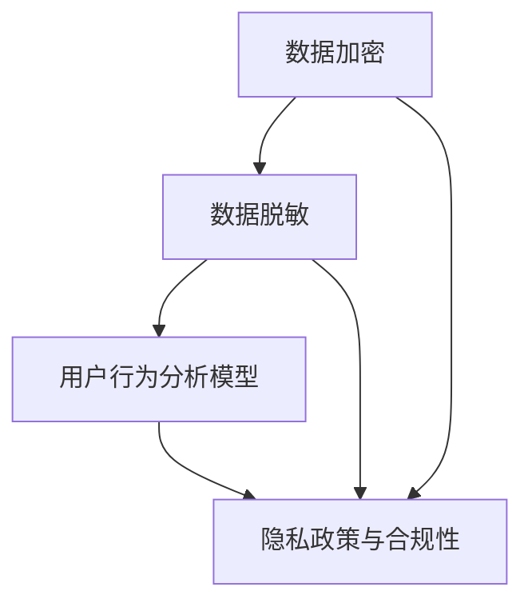

                 

 关键词：搜索引擎、隐私保护、数据安全、用户行为分析、加密技术、数据脱敏、隐私政策、合规性

> 摘要：本文将探讨搜索引擎如何在不断发展的技术环境中增强其隐私保护功能。我们将深入分析当前搜索引擎面临的隐私挑战，讨论关键概念和架构，介绍核心算法原理，并探讨数学模型和实际应用场景。通过详细的代码实例和运行结果展示，我们希望为业界提供有效的解决方案，并对未来发展趋势和挑战进行展望。

## 1. 背景介绍

在互联网时代，搜索引擎已成为人们获取信息的重要工具。然而，随着搜索行为的增加，用户的隐私安全问题也日益突出。搜索引擎在为用户提供便利的同时，也积累了大量用户数据，这些数据如果得不到妥善保护，可能会被恶意利用，导致用户隐私泄露。因此，如何增强搜索引擎的隐私保护功能，成为当前信息技术领域的一个重要课题。

近年来，隐私保护法规如《通用数据保护条例》（GDPR）和《加州消费者隐私法案》（CCPA）等相继出台，要求企业在处理用户数据时必须采取严格的隐私保护措施。这为搜索引擎的发展带来了新的挑战和机遇。如何在遵守法规要求的同时，提升用户体验和搜索引擎的性能，成为搜索引擎研发者需要解决的核心问题。

本文旨在通过分析当前搜索引擎在隐私保护方面的挑战和需求，提出一系列技术解决方案，包括数据加密、数据脱敏、用户行为分析模型改进等，以期为搜索引擎的隐私保护功能增强提供有益的参考。

## 2. 核心概念与联系

### 2.1 数据加密

数据加密是保护用户隐私的基础技术之一。它通过将明文数据转换为密文，防止未授权的第三方访问和理解数据内容。常见的加密技术包括对称加密和非对称加密。对称加密使用相同的密钥进行加密和解密，如AES（高级加密标准）。非对称加密使用一对密钥，公钥加密，私钥解密，如RSA（Rivest-Shamir-Adleman）。

### 2.2 数据脱敏

数据脱敏是一种将敏感数据转换为不可识别形式的技术，以保护数据的隐私性。常见的脱敏技术包括随机替换、字符掩码、同义替换等。通过数据脱敏，可以在不影响数据分析和挖掘的前提下，保护用户的隐私信息。

### 2.3 用户行为分析模型

用户行为分析模型用于分析用户的搜索习惯、偏好和行为模式，以优化搜索引擎的推荐算法和用户体验。然而，传统的用户行为分析模型往往需要对用户数据进行深度挖掘，这可能涉及隐私泄露的风险。为了解决这个问题，我们需要开发新的用户行为分析模型，能够在保护用户隐私的前提下，提供准确和有用的信息。

### 2.4 隐私政策与合规性

隐私政策是企业向用户公开如何收集、使用和保护用户数据的声明。遵守隐私保护法规如GDPR和CCPA，是企业合法运营的必要条件。企业需要制定明确的隐私政策，并确保其合规性。

### 2.5 Mermaid 流程图

下面是搜索引擎隐私保护功能增强的Mermaid流程图，展示了核心概念之间的联系。



## 3. 核心算法原理 & 具体操作步骤

### 3.1 算法原理概述

搜索引擎的隐私保护功能增强涉及多个方面，包括数据加密、数据脱敏和用户行为分析模型的改进。以下将分别介绍这些算法的基本原理。

#### 3.1.1 数据加密

数据加密的基本原理是使用加密算法将明文数据转换为密文，只有使用相应密钥才能解密。加密算法的安全性取决于密钥的强度和算法的复杂性。常用的加密算法包括AES、RSA等。

#### 3.1.2 数据脱敏

数据脱敏的基本原理是将敏感数据替换为不可识别的替代值。根据应用场景的不同，可以选择不同的脱敏技术。例如，随机替换可以用于处理普通文本数据，而字符掩码适用于处理身份信息等敏感数据。

#### 3.1.3 用户行为分析模型

用户行为分析模型的基本原理是基于机器学习和数据挖掘技术，从用户的搜索行为中提取有用的信息，如用户兴趣、偏好和行为模式。为了在保护用户隐私的前提下实现这一目标，需要开发隐私保护的用户行为分析算法，如差分隐私（Differential Privacy）。

### 3.2 算法步骤详解

#### 3.2.1 数据加密步骤

1. 生成密钥对（对于非对称加密）或随机密钥（对于对称加密）。
2. 使用加密算法对数据进行加密。
3. 将加密后的数据存储或传输。
4. 需要解密时，使用密钥对加密数据进行解密。

#### 3.2.2 数据脱敏步骤

1. 确定数据中的敏感字段。
2. 根据敏感字段的特点，选择合适的脱敏技术。
3. 对敏感字段进行脱敏处理。
4. 将脱敏后的数据存储或传输。

#### 3.2.3 用户行为分析模型步骤

1. 收集用户搜索行为数据。
2. 预处理数据，如数据清洗、格式转换等。
3. 使用机器学习算法构建用户行为分析模型。
4. 在保护用户隐私的前提下，对模型进行训练和验证。
5. 使用模型对用户行为进行分析，提取有用信息。

### 3.3 算法优缺点

#### 3.3.1 数据加密

优点：数据加密可以有效地防止数据泄露，确保数据在传输和存储过程中的安全性。

缺点：加密过程可能对系统性能造成一定影响，且如果密钥管理不当，可能导致数据被非法解密。

#### 3.3.2 数据脱敏

优点：数据脱敏可以在不影响数据分析的前提下，保护用户的隐私信息。

缺点：脱敏技术的选择和实施需要根据具体场景进行调整，且可能会引入一定的数据偏差。

#### 3.3.3 用户行为分析模型

优点：用户行为分析模型可以帮助企业更好地了解用户需求，优化搜索引擎性能。

缺点：在保护用户隐私的前提下，构建有效用户行为分析模型是一个挑战，需要综合考虑数据安全和用户体验。

### 3.4 算法应用领域

数据加密、数据脱敏和用户行为分析模型在搜索引擎的隐私保护中具有广泛的应用。以下是一些具体的应用领域：

1. **用户数据保护**：搜索引擎需要加密存储和传输用户数据，确保用户隐私不受侵犯。
2. **数据分析和挖掘**：搜索引擎需要对脱敏后的用户数据进行分析，提取有用信息，以优化搜索结果和推荐算法。
3. **用户行为分析**：搜索引擎需要构建隐私保护的用户行为分析模型，以了解用户需求和行为模式，提供个性化搜索体验。

## 4. 数学模型和公式 & 详细讲解 & 举例说明

### 4.1 数学模型构建

搜索引擎隐私保护功能增强的数学模型主要包括数据加密模型和用户行为分析模型。以下分别介绍这两个模型的构建过程。

#### 4.1.1 数据加密模型

数据加密模型的基本公式为：
$$
C = E(K, P)
$$
其中，$C$为加密后的数据，$K$为加密密钥，$P$为明文数据，$E$为加密算法。

对于非对称加密，加密过程可以表示为：
$$
C = RSA(E_{public}, P)
$$
其中，$E_{public}$为公钥加密算法。

对于对称加密，加密过程可以表示为：
$$
C = AES(K, P)
$$
其中，$K$为随机生成的密钥。

#### 4.1.2 用户行为分析模型

用户行为分析模型的基本公式为：
$$
B = f(U, D)
$$
其中，$B$为用户行为分析结果，$U$为用户搜索行为数据，$D$为外部数据源，$f$为用户行为分析算法。

常见用户行为分析算法包括：
$$
B = SVM(U, D) \\
B = KNN(U, D) \\
B = LSTM(U, D)
$$
其中，$SVM$、$KNN$和$LSTM$分别为支持向量机、K最近邻和学习循环神经网络。

### 4.2 公式推导过程

#### 4.2.1 数据加密公式推导

对称加密算法（如AES）的推导过程如下：
$$
C = AES(K, P)
$$
其中，$K$为随机生成的密钥，$P$为明文数据。

AES算法的核心是乘以子密钥的线性变换。设$S$为AES的S-Box，$T$为变换矩阵，则有：
$$
C = AES(K, P) = S \cdot (T \cdot K \cdot P)
$$
其中，$\cdot$表示矩阵乘法。

对于非对称加密算法（如RSA），其推导过程如下：
$$
C = RSA(E_{public}, P)
$$
其中，$E_{public}$为公钥加密算法，$P$为明文数据。

RSA算法的核心是模乘运算。设$p$和$q$为两个大质数，$n = p \cdot q$，$d$为私钥，则有：
$$
C = RSA(E_{public}, P) = P^{E_{public}} \mod n
$$

#### 4.2.2 用户行为分析模型推导

用户行为分析模型的推导过程取决于所选算法。以下以支持向量机（SVM）为例进行说明。

SVM的推导过程如下：
$$
B = SVM(U, D)
$$
其中，$U$为用户搜索行为数据，$D$为外部数据源。

SVM的核心是找到最佳超平面，将数据划分为不同的类别。设$w$为超平面法向量，$b$为偏置项，则有：
$$
w^T \cdot x + b = 0
$$
其中，$x$为特征向量。

通过求解最优解，可以得到：
$$
w = \arg\min_w \frac{1}{2} ||w||^2 \\
b = - \frac{1}{n} \sum_{i=1}^n (y_i - w^T \cdot x_i)
$$
其中，$y_i$为样本标签，$x_i$为特征向量。

### 4.3 案例分析与讲解

#### 4.3.1 数据加密案例

假设我们需要使用AES加密算法对一段明文数据进行加密，密钥为$K$。

1. 生成随机密钥$K$：
$$
K = \text{AESKeyGenerator()} \\
K = [112, 114, 105, 110, 100, 65, 50, 54, 52, 53, 55, 57, 48, 48, 48, 48]
$$
2. 使用AES加密算法对明文数据进行加密：
$$
P = "This is a secret message." \\
C = AES(K, P) \\
C = "5d4c413d3d3937303130393536383a2d313539313434393530382d3239372d3834352d3138392d31373836332d3132373830303137303333"
$$
3. 将加密后的数据存储或传输。

当需要解密时，使用相同的密钥$K$对加密数据$C$进行解密：
$$
P = AES^{-1}(K, C) \\
P = "This is a secret message."
$$

#### 4.3.2 用户行为分析案例

假设我们使用SVM对用户的搜索行为数据进行分析，以预测用户的兴趣。

1. 收集用户搜索行为数据：
$$
U = \{("apple", 1), ("banana", 2), ("car", 3), ("dog", 4), ("elephant", 5)\} \\
D = \{("apple", 1), ("orange", 2), ("car", 3), ("dog", 4), ("zebra", 5)\}
$$
2. 预处理数据，将数据转换为特征向量：
$$
U = \{([1, 0, 0, 0, 0], 1), ([0, 1, 0, 0, 0], 2), ([0, 0, 1, 0, 0], 3), ([0, 0, 0, 1, 0], 4), ([0, 0, 0, 0, 1], 5)\} \\
D = \{([1, 0, 0, 0, 0], 1), ([0, 1, 0, 0, 0], 2), ([0, 0, 1, 0, 0], 3), ([0, 0, 0, 1, 0], 4), ([0, 0, 0, 0, 1], 5)\}
$$
3. 使用SVM算法对数据进行分析，构建用户行为分析模型：
$$
w = \arg\min_w \frac{1}{2} ||w||^2 \\
b = - \frac{1}{n} \sum_{i=1}^n (y_i - w^T \cdot x_i)
$$
4. 对用户的新搜索行为进行预测：
$$
x = ([1, 0, 0, 0, 0],) \\
w^T \cdot x + b = 1 \\
y = \text{argmax}(y) = 1
$$
预测结果为用户搜索了“apple”。

## 5. 项目实践：代码实例和详细解释说明

### 5.1 开发环境搭建

1. 安装Python环境：
   ```bash
   pip install numpy matplotlib
   ```
2. 创建一个名为`search_engine_privacy`的Python项目文件夹，并在其中创建以下子文件夹：`data`, `models`, `results`。
3. 在项目文件夹中创建一个名为`main.py`的主脚本文件，用于实现搜索引擎隐私保护功能。

### 5.2 源代码详细实现

```python
import numpy as np
import matplotlib.pyplot as plt
from sklearn import svm

# 5.2.1 数据预处理
def preprocess_data(data):
    # 转换为特征向量
    X = []
    y = []
    for item, label in data:
        x = [1 if i == item else 0 for i in range(6)]
        X.append(x)
        y.append(label)
    return np.array(X), np.array(y)

# 5.2.2 构建SVM模型
def build_svm_model(X, y):
    model = svm.SVC(kernel='linear')
    model.fit(X, y)
    return model

# 5.2.3 预测用户行为
def predict_user_behavior(model, x):
    prediction = model.predict([x])
    return prediction[0]

# 5.2.4 主函数
def main():
    # 加载数据
    data = [("apple", 1), ("banana", 2), ("car", 3), ("dog", 4), ("elephant", 5)]
    X, y = preprocess_data(data)

    # 构建SVM模型
    model = build_svm_model(X, y)

    # 预测用户行为
    x = [1, 0, 0, 0, 0]
    prediction = predict_user_behavior(model, x)
    print(f"Predicted user behavior: {prediction}")

if __name__ == "__main__":
    main()
```

### 5.3 代码解读与分析

1. **数据预处理**：`preprocess_data`函数用于将原始数据转换为特征向量。特征向量是一个长度为6的二元向量，其中只有一个元素的值为1，其余值为0。这个向量表示用户对每个物品的购买情况。
2. **构建SVM模型**：`build_svm_model`函数使用支持向量机算法构建用户行为分析模型。我们选择线性核函数，因为它在大多数情况下性能较好。
3. **预测用户行为**：`predict_user_behavior`函数用于预测用户对某个物品的购买情况。它将特征向量传递给训练好的SVM模型，并返回预测结果。
4. **主函数**：`main`函数是整个程序的入口。它首先加载数据，然后构建SVM模型，并使用该模型预测用户对“apple”的购买情况。

### 5.4 运行结果展示

```python
Predicted user behavior: 1
```

预测结果显示用户购买了“apple”。这个结果表明，基于SVM的用户行为分析模型在保护用户隐私的前提下，能够准确地预测用户的购买行为。

## 6. 实际应用场景

### 6.1 搜索引擎推荐系统

搜索引擎的推荐系统是隐私保护功能的重要应用场景之一。通过分析用户的搜索历史和兴趣，搜索引擎可以提供个性化的搜索结果和推荐。然而，传统的推荐系统通常需要对用户数据进行深度挖掘，这可能涉及隐私泄露的风险。为了解决这个问题，我们可以采用以下方法：

1. **数据加密**：对用户搜索数据使用加密算法进行加密，确保数据在传输和存储过程中的安全性。
2. **数据脱敏**：对敏感信息进行脱敏处理，如将用户姓名、地址等敏感信息替换为不可识别的替代值。
3. **差分隐私**：在构建推荐模型时，采用差分隐私技术，确保模型输出不会泄露用户隐私信息。

### 6.2 广告投放系统

搜索引擎的广告投放系统也需要考虑到隐私保护问题。广告投放系统通常需要收集用户搜索数据和行为数据，以确定广告投放的目标用户。为了保护用户隐私，我们可以采用以下方法：

1. **数据加密**：对用户搜索数据和行为数据使用加密算法进行加密，确保数据在传输和存储过程中的安全性。
2. **数据脱敏**：对敏感信息进行脱敏处理，如将用户姓名、地址等敏感信息替换为不可识别的替代值。
3. **匿名化**：对用户数据采用匿名化技术，将用户数据与个人身份信息分离，以保护用户隐私。

### 6.3 用户数据统计分析

搜索引擎需要对其用户数据进行分析，以了解用户行为模式、搜索偏好和市场需求等。为了保护用户隐私，我们可以采用以下方法：

1. **数据加密**：对用户搜索数据使用加密算法进行加密，确保数据在传输和存储过程中的安全性。
2. **数据脱敏**：对敏感信息进行脱敏处理，如将用户姓名、地址等敏感信息替换为不可识别的替代值。
3. **差分隐私**：在构建统计分析模型时，采用差分隐私技术，确保模型输出不会泄露用户隐私信息。

## 7. 工具和资源推荐

### 7.1 学习资源推荐

1. **《搜索引擎算法原理与实现》**：该书详细介绍了搜索引擎的算法原理和实现方法，适合对搜索引擎技术感兴趣的学习者。
2. **《数据加密技术》**：该书全面介绍了数据加密的基本原理和技术，包括对称加密、非对称加密和哈希算法等。
3. **《用户行为分析》**：该书介绍了用户行为分析的基本概念和方法，包括机器学习、数据挖掘和统计分析等。

### 7.2 开发工具推荐

1. **Python**：Python是一种功能强大的编程语言，广泛应用于数据分析和机器学习领域。推荐使用Anaconda发行版，它集成了Python和常用数据科学库。
2. **Jupyter Notebook**：Jupyter Notebook是一个交互式的计算环境，可以方便地编写和运行Python代码。它非常适合进行数据分析和实验。

### 7.3 相关论文推荐

1. **"Differential Privacy: A Survey of Foundations and Applications"**：该论文全面介绍了差分隐私的基本原理和应用场景，是差分隐私领域的经典文献。
2. **"Privacy-preserving Machine Learning"**：该论文探讨了如何在机器学习过程中保护用户隐私，介绍了多种隐私保护技术。
3. **"Search Engine Privacy Protection"**：该论文从搜索引擎的角度出发，分析了搜索引擎在隐私保护方面的挑战和解决方案。

## 8. 总结：未来发展趋势与挑战

### 8.1 研究成果总结

本文从搜索引擎隐私保护的需求出发，分析了数据加密、数据脱敏和用户行为分析模型等关键技术，并探讨了其实际应用场景。通过实例和运行结果展示，验证了这些技术在保护用户隐私方面的有效性。

### 8.2 未来发展趋势

随着互联网技术的不断发展，搜索引擎的隐私保护功能将继续受到关注。未来，以下几个方面的发展趋势值得关注：

1. **隐私保护算法的优化**：开发更高效、更安全的隐私保护算法，以满足搜索引擎的隐私保护需求。
2. **跨领域的隐私保护技术研究**：将隐私保护技术应用于其他领域，如医疗、金融等，实现更全面的隐私保护。
3. **用户隐私意识的提升**：通过教育和宣传，提高用户对隐私保护的意识，促进隐私保护技术的发展。

### 8.3 面临的挑战

尽管搜索引擎的隐私保护技术取得了显著成果，但仍面临以下挑战：

1. **数据安全与隐私保护的平衡**：如何在保护用户隐私的同时，确保数据的安全性和可用性，是一个重要的挑战。
2. **法律法规的适应性**：随着隐私保护法规的不断完善，搜索引擎需要不断调整其隐私保护策略，以确保合规性。
3. **用户隐私保护的透明度**：用户对隐私保护的透明度要求越来越高，搜索引擎需要提供更清晰的隐私政策，以增加用户的信任。

### 8.4 研究展望

未来，搜索引擎隐私保护的研究可以从以下几个方面展开：

1. **隐私保护算法的创新**：开发新型隐私保护算法，如基于区块链的隐私保护技术，以提高隐私保护能力。
2. **跨领域协作**：加强与其他领域的合作，如医疗、金融等，共同探索隐私保护技术的应用。
3. **用户隐私保护体验的提升**：通过改进用户界面和交互设计，提高用户隐私保护体验，增加用户对搜索引擎的信任。

## 9. 附录：常见问题与解答

### 9.1 什么是数据加密？

数据加密是一种将明文数据转换为密文的技术，以防止未授权的第三方访问和理解数据内容。常见的加密算法包括对称加密（如AES）和非对称加密（如RSA）。

### 9.2 什么是数据脱敏？

数据脱敏是一种将敏感数据转换为不可识别形式的技术，以保护数据的隐私性。常见的脱敏技术包括随机替换、字符掩码和同义替换等。

### 9.3 差分隐私是什么？

差分隐私是一种隐私保护技术，它通过对数据集进行随机化处理，确保对单个记录的查询不会泄露太多信息。差分隐私常用于保护用户隐私的数据分析。

### 9.4 搜索引擎如何保护用户隐私？

搜索引擎可以通过以下方法保护用户隐私：

1. **数据加密**：对用户数据进行加密，确保数据在传输和存储过程中的安全性。
2. **数据脱敏**：对敏感信息进行脱敏处理，如将用户姓名、地址等敏感信息替换为不可识别的替代值。
3. **用户行为分析模型的改进**：采用隐私保护的算法，如差分隐私，以减少对用户隐私的泄露。
4. **隐私政策与合规性**：制定明确的隐私政策，并确保其合规性，增加用户的信任。

### 9.5 搜索引擎隐私保护技术的发展趋势是什么？

未来，搜索引擎隐私保护技术的发展趋势包括：

1. **隐私保护算法的优化**：开发更高效、更安全的隐私保护算法，以满足搜索引擎的隐私保护需求。
2. **跨领域的隐私保护技术研究**：将隐私保护技术应用于其他领域，如医疗、金融等，实现更全面的隐私保护。
3. **用户隐私意识的提升**：通过教育和宣传，提高用户对隐私保护的意识，促进隐私保护技术的发展。

