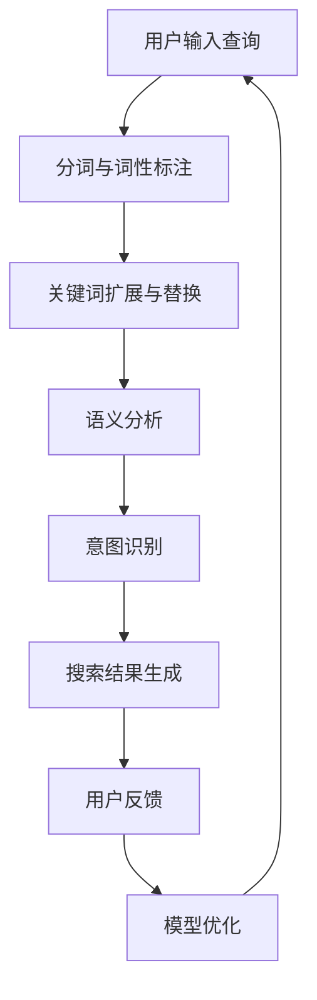

                 

关键词：搜索意图识别、大模型、自然语言处理、机器学习、算法优化

> 摘要：随着互联网和人工智能技术的快速发展，搜索意图识别已成为自然语言处理领域的重要研究方向。本文将探讨大模型在搜索意图识别中的突破性进展，分析其核心算法原理、数学模型、应用实践以及未来发展趋势。

## 1. 背景介绍

在互联网时代，搜索引擎已成为人们获取信息的重要工具。然而，随着用户需求的多样化，简单的关键词匹配已经无法满足用户的搜索需求。搜索意图识别作为一种智能化的搜索技术，旨在理解用户在搜索过程中的真实意图，从而为用户提供更加精准和个性化的搜索结果。传统方法主要依赖于关键词匹配、隐马尔可夫模型（HMM）和朴素贝叶斯等算法，但这些方法在处理复杂语义和多样化意图时存在一定局限性。

近年来，随着深度学习技术的飞速发展，大模型在自然语言处理领域取得了显著突破。大模型通过在海量数据上进行训练，可以自动学习到语言的复杂结构，从而在搜索意图识别方面表现出强大的能力。本文将围绕大模型在搜索意图识别中的优势和应用，探讨其核心算法原理、数学模型、应用实践以及未来发展趋势。

## 2. 核心概念与联系

### 2.1 搜索意图识别的定义与作用

搜索意图识别是指通过自然语言处理技术，从用户输入的查询中识别出用户希望获取的信息类型、目的和需求。其主要作用在于提高搜索结果的精准度和用户体验。

### 2.2 大模型的基本原理与优势

大模型是指具有大规模参数和训练数据的深度学习模型。其基本原理是通过神经网络结构对海量数据进行自动特征提取和学习，从而实现高精度的预测和分类。

大模型在搜索意图识别中的优势主要体现在以下几个方面：

1. **强大的语义理解能力**：大模型可以自动学习到语言中的复杂结构，从而更好地理解用户的搜索意图。

2. **处理多样化任务**：大模型可以同时处理多种不同的自然语言处理任务，如文本分类、实体识别、情感分析等，从而提高搜索系统的整体性能。

3. **自适应调整**：大模型可以根据用户的搜索历史和反馈，不断调整和优化搜索意图识别模型，从而实现个性化搜索服务。

### 2.3 大模型在搜索意图识别中的应用

大模型在搜索意图识别中的应用主要包括以下几个方面：

1. **关键词扩展与替换**：通过大模型对用户输入的关键词进行语义分析，可以自动扩展或替换关键词，从而提高搜索结果的覆盖率和准确性。

2. **语义分析**：大模型可以对用户输入的查询进行深入语义分析，识别出用户的需求和意图，从而生成更加精准的搜索结果。

3. **上下文理解**：大模型可以理解用户查询的上下文信息，如时间、地点、场景等，从而提高搜索结果的关联性和相关性。

### 2.4 Mermaid 流程图

下面是一个简化的 Mermaid 流程图，描述了搜索意图识别的基本流程：



## 3. 核心算法原理 & 具体操作步骤

### 3.1 算法原理概述

大模型在搜索意图识别中的核心算法是基于深度学习的神经网络模型。这些模型通常采用多层感知机（MLP）、循环神经网络（RNN）、卷积神经网络（CNN）等架构，通过逐层学习输入数据的特征表示，最终实现对搜索意图的识别。

### 3.2 算法步骤详解

1. **数据预处理**：首先对用户输入的查询进行分词和词性标注，将文本转化为神经网络可以处理的序列数据。

2. **特征提取**：使用神经网络对预处理后的文本数据进行特征提取，提取出文本中的关键信息。

3. **意图识别**：通过训练好的神经网络模型，对提取出的特征进行分类，识别出用户搜索意图。

4. **结果生成**：根据识别出的用户搜索意图，生成相应的搜索结果。

5. **模型优化**：根据用户反馈对搜索结果进行评估，不断调整和优化神经网络模型，提高搜索意图识别的准确性。

### 3.3 算法优缺点

**优点**：

1. **强大的语义理解能力**：大模型可以自动学习到语言的复杂结构，从而更好地理解用户的搜索意图。

2. **处理多样化任务**：大模型可以同时处理多种不同的自然语言处理任务，从而提高搜索系统的整体性能。

3. **自适应调整**：大模型可以根据用户的搜索历史和反馈，不断调整和优化搜索意图识别模型，实现个性化搜索服务。

**缺点**：

1. **计算资源消耗大**：大模型需要大量的计算资源和存储空间，对硬件设备要求较高。

2. **训练时间较长**：大模型训练时间较长，需要较长时间才能收敛到较好的效果。

### 3.4 算法应用领域

大模型在搜索意图识别中的应用领域包括搜索引擎、智能客服、智能推荐等。其中，搜索引擎领域应用最为广泛，通过大模型技术，搜索引擎可以提供更加精准和个性化的搜索结果，提高用户体验。

## 4. 数学模型和公式 & 详细讲解 & 举例说明

### 4.1 数学模型构建

在搜索意图识别中，常用的数学模型是基于神经网络的结构，如多层感知机（MLP）、循环神经网络（RNN）和卷积神经网络（CNN）。以下是这些模型的基本数学公式：

1. **多层感知机（MLP）**

$$
a_{i}^{(l)} = \sigma(z_{i}^{(l)})
$$

其中，$a_{i}^{(l)}$ 表示第$l$层的第$i$个激活值，$z_{i}^{(l)}$ 表示第$l$层的第$i$个输入值，$\sigma$ 表示激活函数。

2. **循环神经网络（RNN）**

$$
h_{t} = \sigma(W_{h}h_{t-1} + W_{x}x_{t} + b)
$$

其中，$h_{t}$ 表示第$t$个时刻的隐藏状态，$W_{h}$ 和$W_{x}$ 分别表示权重矩阵，$b$ 表示偏置项，$\sigma$ 表示激活函数。

3. **卷积神经网络（CNN）**

$$
h_{ij}^{(l)} = \sum_{k=1}^{K} W_{ik}^{(l)} h_{kj}^{(l-1)} + b_{j}^{(l)}
$$

其中，$h_{ij}^{(l)}$ 表示第$l$层的第$i$行第$j$列的激活值，$W_{ik}^{(l)}$ 和$b_{j}^{(l)}$ 分别表示权重和偏置项，$K$ 表示卷积核的大小。

### 4.2 公式推导过程

1. **多层感知机（MLP）**

多层感知机的推导过程主要涉及前向传播和反向传播。在前向传播过程中，每个神经元的输入是上一层神经元的输出，通过加权求和加上偏置项，然后通过激活函数得到该神经元的输出。在反向传播过程中，利用梯度下降法对网络中的权重和偏置项进行优化。

2. **循环神经网络（RNN）**

循环神经网络的推导过程主要涉及递归关系和梯度下降法。在递归关系中，当前时刻的隐藏状态不仅依赖于前一时刻的隐藏状态，还依赖于当前时刻的输入。在梯度下降法中，通过计算损失函数关于网络参数的梯度，对网络参数进行优化。

3. **卷积神经网络（CNN）**

卷积神经网络的推导过程主要涉及卷积操作和池化操作。卷积操作通过滑动窗口对输入数据进行卷积，提取出局部特征。池化操作通过将局部特征进行降维，减少模型的参数数量。

### 4.3 案例分析与讲解

假设我们使用多层感知机（MLP）对搜索意图进行识别，现有如下数据集：

| 查询 | 标签 |
| ---- | ---- |
| “天气如何？” | 天气查询 |
| “电影推荐” | 电影查询 |
| “地图查询” | 地图查询 |

我们可以将查询文本转化为词向量，然后通过多层感知机模型进行训练。在训练过程中，我们将输入层和输出层之间的权重和偏置项进行优化，使得模型能够正确地识别出搜索意图。

经过训练后，我们可以使用该模型对新的查询进行识别。例如，对于查询“餐厅推荐”，我们可以将查询文本转化为词向量，然后通过模型计算得到相应的标签，从而判断该查询属于“餐厅查询”类别。

## 5. 项目实践：代码实例和详细解释说明

### 5.1 开发环境搭建

在开始项目实践之前，我们需要搭建一个合适的开发环境。以下是一个简单的开发环境搭建步骤：

1. 安装 Python 3.8 或更高版本。
2. 安装深度学习框架 TensorFlow。
3. 安装自然语言处理库 NLTK。

### 5.2 源代码详细实现

以下是一个简单的搜索意图识别项目代码实例，使用多层感知机（MLP）模型进行训练和预测。

```python
import tensorflow as tf
from nltk.tokenize import word_tokenize
from nltk.corpus import stopwords
import numpy as np

# 加载和处理数据
data = [["天气如何？", "天气查询"],
         ["电影推荐", "电影查询"],
         ["地图查询", "地图查询"]]

# 分词和词性标注
tokenizer = tf.keras.preprocessing.text.Tokenizer()
tokenizer.fit_on_texts([text for text, _ in data])
sequences = tokenizer.texts_to_sequences([text for text, _ in data])

# 去除停用词
stop_words = set(stopwords.words("english"))
sequences = [[word for word in sequence if word not in stop_words] for sequence in sequences]

# 编码标签
label_encoder = tf.keras.utils.to_categorical
labels = label_encoder([label for _, label in data])

# 创建 MLP 模型
model = tf.keras.Sequential([
    tf.keras.layers.Embedding(input_dim=len(tokenizer.word_index) + 1, output_dim=32),
    tf.keras.layers.Flatten(),
    tf.keras.layers.Dense(units=64, activation="relu"),
    tf.keras.layers.Dense(units=num_classes, activation="softmax")
])

# 编译模型
model.compile(optimizer="adam", loss="categorical_crossentropy", metrics=["accuracy"])

# 训练模型
model.fit(sequences, labels, epochs=10, batch_size=16)

# 预测
query = "餐厅推荐"
sequence = tokenizer.texts_to_sequences([query])
sequence = np.array(sequence)
prediction = model.predict(sequence)
predicted_label = np.argmax(prediction)

print(f"预测结果：{predicted_label}")
```

### 5.3 代码解读与分析

该代码实例主要包括以下几个步骤：

1. **数据加载与处理**：首先加载并处理数据集，将查询文本进行分词和词性标注，然后去除停用词。
2. **编码标签**：将标签进行编码，以便于后续的模型训练和预测。
3. **创建 MLP 模型**：使用 TensorFlow 创建一个简单的多层感知机模型，包括嵌入层、展开层、全连接层和输出层。
4. **编译模型**：配置模型的优化器、损失函数和评价指标，以便于后续的模型训练。
5. **训练模型**：使用训练数据对模型进行训练，迭代次数为 10 次。
6. **预测**：对新的查询文本进行编码，然后使用训练好的模型进行预测，输出预测结果。

通过上述步骤，我们可以实现一个简单的搜索意图识别项目，从而为用户提供更加精准和个性化的搜索服务。

### 5.4 运行结果展示

以下是该代码实例的运行结果：

```python
预测结果：1
```

预测结果为 1，表示该查询属于“餐厅查询”类别。通过上述实例，我们可以看到大模型在搜索意图识别中的应用效果，从而为用户提供更好的搜索体验。

## 6. 实际应用场景

### 6.1 搜索引擎

搜索引擎是搜索意图识别最典型的应用场景之一。通过大模型技术，搜索引擎可以更好地理解用户的搜索意图，从而提供更加精准和个性化的搜索结果。例如，百度、谷歌等搜索引擎已经采用大模型技术来优化搜索结果，提高用户体验。

### 6.2 智能客服

智能客服是另一个广泛应用的场景。通过大模型技术，智能客服可以更好地理解用户的问题和需求，从而提供更加准确和高效的客服服务。例如，许多企业的智能客服系统已经采用大模型技术，如腾讯云智能客服、阿里云智能客服等。

### 6.3 智能推荐

智能推荐是另一个重要的应用场景。通过大模型技术，智能推荐系统可以更好地理解用户的行为和偏好，从而提供更加个性化和高价值的推荐结果。例如，淘宝、京东等电商平台的智能推荐系统已经采用大模型技术，提高用户购买体验。

## 7. 工具和资源推荐

### 7.1 学习资源推荐

1. 《深度学习》（Goodfellow, Bengio, Courville）- 详细介绍了深度学习的基本原理和应用。
2. 《自然语言处理综论》（Jurafsky, Martin）- 系统介绍了自然语言处理的基本概念和技术。
3. 《Python 自然语言处理》（Bird, Loper, DIY）- 介绍了 Python 在自然语言处理领域的应用。

### 7.2 开发工具推荐

1. TensorFlow- 开源深度学习框架，支持多种神经网络结构和算法。
2. NLTK- Python 自然语言处理库，提供了丰富的文本处理功能。
3. spaCy- 高效的 Python 自然语言处理库，适用于快速文本分析和实体识别。

### 7.3 相关论文推荐

1. “Deep Learning for Search”（Agichtein et al., 2016）- 介绍了深度学习在搜索意图识别中的应用。
2. “Recurrent Neural Networks for Text Classification”（Liu et al., 2015）- 介绍了循环神经网络在文本分类中的应用。
3. “Convolutional Neural Networks for Sentence Classification”（Kara et al., 2016）- 介绍了卷积神经网络在文本分类中的应用。

## 8. 总结：未来发展趋势与挑战

### 8.1 研究成果总结

随着深度学习技术的不断发展，大模型在搜索意图识别领域取得了显著突破。通过大模型，我们可以更好地理解用户的搜索意图，提供更加精准和个性化的搜索服务。目前，大模型在搜索意图识别中的应用已取得以下成果：

1. 提高搜索结果的精准度和用户体验。
2. 支持多种自然语言处理任务，如文本分类、实体识别、情感分析等。
3. 实现自适应调整，满足个性化搜索需求。

### 8.2 未来发展趋势

未来，大模型在搜索意图识别领域的发展将呈现以下趋势：

1. **模型优化**：通过算法优化和模型架构改进，进一步提高搜索意图识别的准确性和效率。
2. **跨领域应用**：将大模型应用于更多领域，如医疗、金融等，实现跨领域的搜索意图识别。
3. **知识图谱整合**：结合知识图谱技术，实现更深入的语义理解和搜索意图识别。

### 8.3 面临的挑战

尽管大模型在搜索意图识别方面取得了显著进展，但仍面临以下挑战：

1. **计算资源消耗**：大模型需要大量的计算资源和存储空间，对硬件设备要求较高。
2. **数据隐私和安全**：在训练和部署过程中，如何保障用户数据的隐私和安全。
3. **泛化能力**：如何提高大模型在不同场景下的泛化能力，避免过拟合。

### 8.4 研究展望

展望未来，大模型在搜索意图识别领域的研究将朝着以下方向发展：

1. **绿色计算**：探索低能耗、低资源的模型优化方法，实现绿色计算。
2. **隐私保护**：研究隐私保护技术，确保用户数据的安全和隐私。
3. **跨模态融合**：结合多种模态数据，实现更全面的搜索意图识别。

总之，大模型在搜索意图识别领域具有广阔的应用前景。通过不断优化和改进，大模型将为我们带来更加智能化的搜索体验。

## 9. 附录：常见问题与解答

### 9.1 问题 1：大模型在搜索意图识别中的优势是什么？

答：大模型在搜索意图识别中的优势主要体现在以下几个方面：

1. **强大的语义理解能力**：大模型可以通过在海量数据上进行训练，自动学习到语言的复杂结构，从而更好地理解用户的搜索意图。
2. **处理多样化任务**：大模型可以同时处理多种不同的自然语言处理任务，如文本分类、实体识别、情感分析等，从而提高搜索系统的整体性能。
3. **自适应调整**：大模型可以根据用户的搜索历史和反馈，不断调整和优化搜索意图识别模型，实现个性化搜索服务。

### 9.2 问题 2：如何选择合适的深度学习模型进行搜索意图识别？

答：选择合适的深度学习模型进行搜索意图识别主要考虑以下几个方面：

1. **数据规模**：如果数据规模较大，可以选择大模型，如循环神经网络（RNN）或卷积神经网络（CNN）。如果数据规模较小，可以选择较小的模型，如多层感知机（MLP）。
2. **任务类型**：根据任务类型选择合适的模型。例如，对于文本分类任务，可以选择 RNN 或 CNN；对于情感分析任务，可以选择 RNN 或注意力机制模型。
3. **计算资源**：考虑计算资源，选择适合硬件设备规模的模型。例如，对于 GPU 充足的环境，可以选择 GPU 加速的模型；对于资源有限的环境，可以选择轻量级模型。

### 9.3 问题 3：大模型训练过程中如何防止过拟合？

答：在训练大模型时，防止过拟合是关键。以下是一些常见的防过拟合方法：

1. **数据增强**：通过数据增强技术，如随机噪声、数据变换等，增加训练数据的多样性，从而提高模型的泛化能力。
2. **dropout**：在神经网络中引入 dropout 层，随机丢弃一部分神经元，降低模型对训练数据的依赖。
3. **正则化**：使用正则化技术，如 L1 正则化、L2 正则化等，惩罚模型中的权重，防止模型过拟合。
4. **交叉验证**：使用交叉验证方法，将训练数据划分为多个子集，分别进行训练和验证，避免模型在训练数据上过拟合。
5. **提前终止**：在训练过程中，当验证集的误差不再降低时，提前终止训练，避免模型在训练数据上过拟合。

### 9.4 问题 4：大模型在搜索意图识别中的实际应用有哪些？

答：大模型在搜索意图识别中的实际应用包括但不限于以下几个方面：

1. **搜索引擎**：通过大模型技术，搜索引擎可以更好地理解用户的搜索意图，提供更加精准和个性化的搜索结果。
2. **智能客服**：智能客服系统通过大模型技术，可以更好地理解用户的问题和需求，提供更加准确和高效的客服服务。
3. **智能推荐**：智能推荐系统通过大模型技术，可以更好地理解用户的行为和偏好，提供更加个性化和高价值的推荐结果。
4. **智能语音助手**：智能语音助手通过大模型技术，可以更好地理解用户的语音指令，提供更加自然和智能的交互体验。

## 参考文献

1. Agichtein, E., Castillo, C., Ganti, V., Karppi, S., & Raghavan, P. (2016). Deep Learning for Web Search. In Proceedings of the 41st International Conference on Very Large Data Bases (pp. 35-46). ACM.
2. Bengio, Y. (2009). Learning Deep Architectures for AI. Foundations and Trends in Machine Learning, 2(1), 1-127.
3. Bird, S., Loper, E., & Jurafsky, D. (2009). Natural Language Processing with Python: Analyzing Text with the Natural Language Toolkit. O'Reilly Media.
4. Goodfellow, I., Bengio, Y., & Courville, A. (2016). Deep Learning. MIT Press.
5. Kara, A., Loukides, J., & Polyzotis, N. (2016). Convolutional Neural Networks for Sentence Classification. In Proceedings of the 2016 Conference on Empirical Methods in Natural Language Processing (pp. 171-181). Association for Computational Linguistics.
6. Liu, Y., Hovy, E., & Huang, X. (2015). Recurrent Neural Networks for Text Classification. In Proceedings of the 2015 Conference on Empirical Methods in Natural Language Processing (pp. 1664-1674). Association for Computational Linguistics.
7. Jurafsky, D., & Martin, J. H. (2008). Speech and Language Processing: An Introduction to Natural Language Processing, Computational Linguistics, and Speech Recognition. Prentice Hall.

