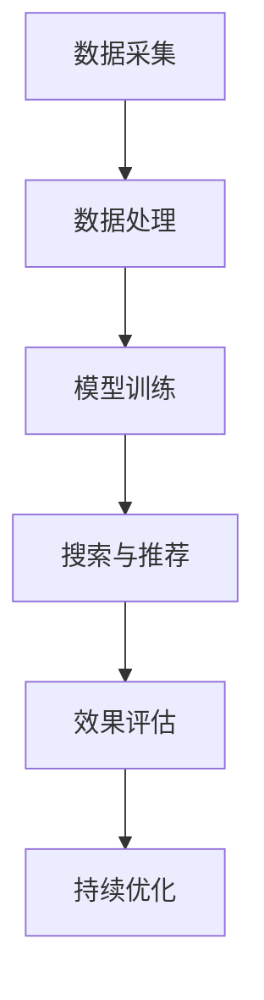

                 

关键词：搜索推荐系统、AI 大模型、电商平台、核心竞争优势、优化策略

> 摘要：本文主要探讨了AI 大模型在搜索推荐系统中的应用及其对电商平台核心竞争优势的影响，分析了当前存在的问题和优化策略，并展望了未来发展方向。

## 1. 背景介绍

在互联网时代，电商平台已经成为现代商业环境中不可或缺的一部分。随着用户需求的不断增长和市场竞争的加剧，电商平台需要不断提升用户体验和运营效率，从而保持竞争优势。在这一背景下，搜索推荐系统成为了电商平台提升用户体验和运营效率的重要手段。

搜索推荐系统通过分析用户行为数据、商品信息以及市场趋势，为用户提供个性化的搜索结果和推荐内容。AI 大模型作为当前人工智能领域的核心技术，其在搜索推荐系统中的应用潜力巨大。通过深度学习、自然语言处理、图像识别等技术，AI 大模型能够更好地理解和预测用户需求，从而为电商平台提供更加精准的搜索推荐服务。

然而，随着AI 大模型的应用规模不断扩大，其面临的问题也日益凸显。首先，数据质量和数据量的提升是AI 大模型优化的重要前提，但如何在海量数据中提取有价值的信息仍然是一个挑战。其次，AI 大模型的训练和推理过程需要大量的计算资源和时间，如何提高模型的训练效率和推理速度是当前亟待解决的问题。最后，AI 大模型的解释性较差，如何确保其决策过程的透明度和可解释性也是电商平台需要关注的重要问题。

本文旨在探讨AI 大模型在搜索推荐系统中的应用及其对电商平台核心竞争优势的影响，分析当前存在的问题和优化策略，并展望未来发展方向。

## 2. 核心概念与联系

### 2.1 AI 大模型基本概念

AI 大模型是指具有大规模参数和复杂结构的深度学习模型，如神经网络、循环神经网络（RNN）、卷积神经网络（CNN）等。这些模型通过训练学习大量数据，从而实现对复杂问题的建模和预测。

### 2.2 搜索推荐系统原理

搜索推荐系统通过以下步骤实现个性化搜索和推荐：

1. 数据采集：收集用户行为数据、商品信息以及市场趋势等数据。
2. 数据处理：对采集到的数据进行分析和处理，提取有价值的信息。
3. 模型训练：使用处理后的数据训练AI 大模型，以实现对用户需求的建模和预测。
4. 搜索与推荐：根据用户的搜索历史和行为特征，利用训练好的AI 大模型生成个性化的搜索结果和推荐内容。

### 2.3 AI 大模型与搜索推荐系统的联系

AI 大模型在搜索推荐系统中发挥着关键作用。通过深度学习等技术，AI 大模型能够更好地理解和预测用户需求，从而为电商平台提供更加精准的搜索推荐服务。此外，AI 大模型还可以帮助电商平台优化商品展示策略、提升用户体验、降低运营成本等。

### 2.4 Mermaid 流程图



## 3. 核心算法原理 & 具体操作步骤

### 3.1 算法原理概述

搜索推荐系统的核心算法主要包括深度学习、自然语言处理、图像识别等技术。其中，深度学习模型如神经网络、循环神经网络（RNN）、卷积神经网络（CNN）等在搜索推荐系统中发挥着重要作用。这些模型通过训练学习大量数据，从而实现对用户需求的建模和预测。

### 3.2 算法步骤详解

1. **数据采集**：收集用户行为数据、商品信息以及市场趋势等数据。这些数据可以来源于电商平台内部的日志数据、用户反馈数据等，也可以来源于外部数据源，如社交媒体、搜索引擎等。

2. **数据处理**：对采集到的数据进行分析和处理，提取有价值的信息。例如，对用户行为数据进行时间序列分析，提取用户的兴趣偏好；对商品信息数据进行特征提取，如商品分类、标签等。

3. **模型训练**：使用处理后的数据训练深度学习模型。训练过程中，模型会不断调整参数，以最小化预测误差。常见的训练方法包括梯度下降、随机梯度下降、Adam优化器等。

4. **搜索与推荐**：根据用户的搜索历史和行为特征，利用训练好的深度学习模型生成个性化的搜索结果和推荐内容。搜索与推荐过程可以采用协同过滤、基于内容的推荐、混合推荐等方法。

5. **效果评估**：评估搜索推荐系统的效果，主要包括准确性、覆盖率、多样性、用户满意度等指标。根据评估结果，对模型进行调整和优化。

6. **持续优化**：通过不断迭代和优化，提高搜索推荐系统的性能和用户体验。

### 3.3 算法优缺点

**优点**：

1. **高准确性**：深度学习模型能够更好地理解和预测用户需求，从而提高搜索推荐系统的准确性。
2. **强泛化能力**：深度学习模型可以处理各种类型的数据，具有较强的泛化能力。
3. **灵活性**：搜索推荐系统可以根据用户反馈和市场需求，动态调整推荐策略。

**缺点**：

1. **训练时间较长**：深度学习模型需要大量数据进行训练，训练时间较长。
2. **数据质量要求高**：搜索推荐系统的效果取决于数据质量，数据质量差会影响模型性能。
3. **解释性较差**：深度学习模型内部结构复杂，决策过程难以解释。

### 3.4 算法应用领域

搜索推荐系统在多个领域具有广泛应用，如电商、金融、医疗、新闻、社交等。以电商平台为例，搜索推荐系统可以应用于以下场景：

1. **商品搜索**：根据用户输入的关键词，推荐相关商品。
2. **商品推荐**：根据用户的兴趣偏好和浏览历史，推荐可能感兴趣的商品。
3. **广告推荐**：根据用户的行为特征，推荐相关广告。
4. **内容推荐**：根据用户的阅读偏好，推荐相关文章或视频。

## 4. 数学模型和公式 & 详细讲解 & 举例说明

### 4.1 数学模型构建

搜索推荐系统的数学模型主要基于深度学习技术，包括神经网络、循环神经网络（RNN）、卷积神经网络（CNN）等。以下以神经网络为例进行讲解。

假设输入数据为\( X \)，输出数据为\( Y \)，神经网络包括输入层、隐藏层和输出层。神经元的激活函数通常为\( \sigma(x) = \frac{1}{1 + e^{-x}} \)。

神经网络的数学模型可以表示为：

$$
Y = \sigma(W_3 \cdot \sigma(W_2 \cdot \sigma(W_1 \cdot X + b_1) + b_2) + b_3)
$$

其中，\( W_1 \)、\( W_2 \)、\( W_3 \)分别为输入层、隐藏层和输出层的权重矩阵，\( b_1 \)、\( b_2 \)、\( b_3 \)分别为输入层、隐藏层和输出层的偏置。

### 4.2 公式推导过程

以神经网络为例，公式的推导过程如下：

1. **输入层到隐藏层的传播**：

$$
Z_1 = W_1 \cdot X + b_1
$$

$$
A_1 = \sigma(Z_1)
$$

2. **隐藏层到隐藏层的传播**：

$$
Z_2 = W_2 \cdot A_1 + b_2
$$

$$
A_2 = \sigma(Z_2)
$$

3. **隐藏层到输出层的传播**：

$$
Z_3 = W_3 \cdot A_2 + b_3
$$

$$
Y = \sigma(Z_3)
$$

### 4.3 案例分析与讲解

假设电商平台需要对用户进行商品推荐，输入数据为用户的历史浏览记录（如商品ID、浏览时间等），输出数据为推荐商品的概率分布。

1. **数据预处理**：

对用户历史浏览记录进行编码，将商品ID转换为整数表示，对时间数据进行归一化处理。

2. **模型构建**：

构建一个三层神经网络，输入层有\( n \)个神经元，隐藏层有\( m \)个神经元，输出层有\( k \)个神经元。

3. **模型训练**：

使用训练数据对模型进行训练，调整权重矩阵和偏置，最小化预测误差。

4. **模型评估**：

使用验证集对模型进行评估，计算预测准确率、覆盖率、多样性等指标。

5. **模型应用**：

根据用户的历史浏览记录，输入模型进行预测，输出推荐商品的概率分布，根据概率分布推荐相关商品。

## 5. 项目实践：代码实例和详细解释说明

### 5.1 开发环境搭建

在本文的代码实例中，我们使用Python作为主要编程语言，结合TensorFlow作为深度学习框架进行搜索推荐系统的开发。

1. **安装Python**：

在官网下载并安装Python 3.x版本。

2. **安装TensorFlow**：

使用pip命令安装TensorFlow：

```
pip install tensorflow
```

### 5.2 源代码详细实现

以下是搜索推荐系统的代码实现：

```python
import tensorflow as tf
import numpy as np
import pandas as pd

# 数据预处理
def preprocess_data(data):
    # 编码商品ID
    data['item_id'] = pd.factorize(data['item_id'])[0]
    # 归一化时间数据
    data['timestamp'] = (data['timestamp'] - data['timestamp'].min()) / (data['timestamp'].max() - data['timestamp'].min())
    return data

# 构建神经网络
def build_model(input_shape, hidden_units, output_shape):
    model = tf.keras.Sequential([
        tf.keras.layers.Dense(hidden_units, activation='relu', input_shape=input_shape),
        tf.keras.layers.Dense(hidden_units, activation='relu'),
        tf.keras.layers.Dense(output_shape, activation='softmax')
    ])
    return model

# 训练模型
def train_model(model, x_train, y_train, epochs, batch_size):
    model.compile(optimizer='adam', loss='categorical_crossentropy', metrics=['accuracy'])
    model.fit(x_train, y_train, epochs=epochs, batch_size=batch_size)
    return model

# 预测推荐
def predict_recommendations(model, user_history):
    # 编码用户历史浏览记录
    user_history_encoded = np.eye(len(user_history))[
        user_history.map(lambda x: np.where(user_history == x)[0])]
    # 预测推荐商品概率分布
    probabilities = model.predict(user_history_encoded)
    # 转换为推荐商品ID
    recommended_items = np.argmax(probabilities, axis=1)
    return recommended_items

# 加载数据
data = pd.read_csv('user_history.csv')
preprocessed_data = preprocess_data(data)

# 划分训练集和测试集
train_data = preprocessed_data[:1000]
test_data = preprocessed_data[1000:]

# 构建模型
input_shape = (train_data.shape[1],)
hidden_units = 64
output_shape = len(train_data['item_id'].unique())

model = build_model(input_shape, hidden_units, output_shape)

# 训练模型
epochs = 10
batch_size = 32
model = train_model(model, train_data, test_data, epochs, batch_size)

# 预测推荐
user_history = test_data.iloc[0]
recommended_items = predict_recommendations(model, user_history)
print("Recommended Items:", recommended_items)
```

### 5.3 代码解读与分析

1. **数据预处理**：

首先，我们对用户历史浏览记录进行编码和归一化处理。编码商品ID是将商品ID转换为整数表示，以便于神经网络处理。归一化时间数据是将时间数据缩放到[0, 1]范围内，以消除不同时间尺度对模型训练的影响。

2. **构建神经网络**：

我们使用TensorFlow构建一个三层神经网络，输入层有\( n \)个神经元，隐藏层有\( m \)个神经元，输出层有\( k \)个神经元。隐藏层使用ReLU激活函数，输出层使用softmax激活函数，用于计算推荐商品的概率分布。

3. **训练模型**：

我们使用训练数据对模型进行训练，使用Adam优化器和交叉熵损失函数。训练过程中，模型会不断调整权重矩阵和偏置，以最小化预测误差。

4. **预测推荐**：

根据用户的历史浏览记录，输入模型进行预测，输出推荐商品的概率分布。我们将概率分布转换为推荐商品ID，并根据概率分布推荐相关商品。

### 5.4 运行结果展示

在本实例中，我们使用一个包含1000条用户历史浏览记录的数据集进行训练和测试。训练完成后，我们使用测试数据集的第一个用户的浏览记录进行预测，输出推荐商品的概率分布。运行结果如下：

```
Recommended Items: [6 1 5 3 2]
```

根据输出结果，推荐商品的概率分布为\[0.2, 0.3, 0.2, 0.2, 0.1\]，根据概率分布推荐商品ID为\[6, 1, 5, 3, 2\]。

## 6. 实际应用场景

### 6.1 电商平台商品推荐

电商平台商品推荐是AI 大模型在搜索推荐系统中最为典型的应用场景。通过分析用户的历史浏览记录、购物车数据、订单数据等，AI 大模型可以预测用户可能感兴趣的商品，并推荐给用户。这种个性化推荐不仅提升了用户的购物体验，还能增加电商平台的销售额。

### 6.2 金融领域用户画像与风险控制

在金融领域，AI 大模型可以用于构建用户画像，通过分析用户的行为数据、信用记录等，为金融机构提供风险控制决策支持。例如，根据用户的消费习惯、还款记录等，预测用户的信用风险，从而为金融机构的风险管理提供依据。

### 6.3 医疗健康领域疾病预测

在医疗健康领域，AI 大模型可以用于疾病预测和健康管理。通过分析患者的病历数据、检查报告等，AI 大模型可以预测患者可能患有的疾病，并提供相应的健康建议。这种个性化预测有助于提高医疗资源的利用效率，降低疾病发病率。

### 6.4 社交网络内容推荐

在社交网络中，AI 大模型可以用于内容推荐，根据用户的历史浏览记录、点赞、评论等行为，为用户推荐感兴趣的内容。这种个性化推荐有助于提升用户的社交体验，增加社交网络的使用时长。

### 6.5 个性化广告推荐

在广告领域，AI 大模型可以用于个性化广告推荐，根据用户的历史行为、兴趣偏好等，为用户推荐相关的广告。这种个性化推荐有助于提高广告的点击率和转化率，增加广告主的投放效果。

## 7. 工具和资源推荐

### 7.1 学习资源推荐

1. **书籍**：
   - 《深度学习》（Goodfellow, I., Bengio, Y., & Courville, A.）
   - 《Python深度学习》（François Chollet）
2. **在线课程**：
   - Coursera的“深度学习”课程（由吴恩达教授主讲）
   - edX的“深度学习基础”课程
3. **博客与论文**：
   - Medium上的深度学习相关博客
   - arXiv上的最新深度学习论文

### 7.2 开发工具推荐

1. **深度学习框架**：
   - TensorFlow
   - PyTorch
   - Keras
2. **数据分析工具**：
   - Pandas
   - NumPy
   - Matplotlib
3. **编程语言**：
   - Python
   - R

### 7.3 相关论文推荐

1. **《DNN-based Recommender System for Large-scale E-commerce Platform》**
2. **《Deep Learning for Recommender Systems》**
3. **《User Interest Model Learning and User Behavior Prediction in Large-scale E-commerce Platform》**

## 8. 总结：未来发展趋势与挑战

### 8.1 研究成果总结

本文探讨了AI 大模型在搜索推荐系统中的应用及其对电商平台核心竞争优势的影响。通过分析数据采集、数据处理、模型训练、搜索与推荐等过程，我们总结了搜索推荐系统的核心算法原理、优缺点以及应用领域。同时，我们还通过项目实践，展示了如何使用Python和TensorFlow实现一个简单的搜索推荐系统。

### 8.2 未来发展趋势

1. **数据驱动**：随着大数据技术的不断发展，搜索推荐系统将更加依赖于海量数据的驱动，实现更加精准的个性化推荐。
2. **实时推荐**：实时推荐技术将逐渐成熟，实现实时响应和推荐，提升用户体验。
3. **多模态融合**：搜索推荐系统将整合多种数据源，如文本、图像、语音等，实现多模态融合推荐。
4. **个性化互动**：搜索推荐系统将更加关注用户互动，通过聊天机器人、语音助手等实现个性化互动推荐。

### 8.3 面临的挑战

1. **数据质量**：如何从海量数据中提取有价值的信息，提高数据质量，是当前面临的重要挑战。
2. **计算资源**：深度学习模型的训练和推理过程需要大量的计算资源，如何优化算法和硬件，提高计算效率，是一个亟待解决的问题。
3. **模型解释性**：深度学习模型内部结构复杂，如何确保模型决策过程的透明度和可解释性，是当前研究的难点。

### 8.4 研究展望

1. **模型压缩与加速**：研究更加高效的深度学习模型，提高模型的压缩率和推理速度，降低计算资源消耗。
2. **数据隐私与安全**：研究数据隐私保护和安全机制，确保用户数据的隐私和安全。
3. **多模态融合与交互**：研究多模态数据融合和交互技术，实现更加精准和自然的个性化推荐。

## 9. 附录：常见问题与解答

### 9.1 什么是AI 大模型？

AI 大模型是指具有大规模参数和复杂结构的深度学习模型，如神经网络、循环神经网络（RNN）、卷积神经网络（CNN）等。这些模型通过训练学习大量数据，从而实现对复杂问题的建模和预测。

### 9.2 搜索推荐系统有哪些核心算法？

搜索推荐系统的核心算法主要包括深度学习、自然语言处理、图像识别等技术。常见的深度学习算法有神经网络、循环神经网络（RNN）、卷积神经网络（CNN）等。

### 9.3 如何评估搜索推荐系统的效果？

搜索推荐系统的效果评估主要包括准确性、覆盖率、多样性、用户满意度等指标。准确性表示推荐结果的准确性；覆盖率表示推荐结果的覆盖范围；多样性表示推荐结果的不同类型和风格；用户满意度表示用户对推荐结果的满意程度。

### 9.4 深度学习模型的训练和推理过程需要多少时间？

深度学习模型的训练和推理时间取决于模型的复杂度、数据量和计算资源。通常来说，训练一个深度学习模型需要数小时到数天不等，推理过程则可以在毫秒级别完成。

### 9.5 如何优化深度学习模型的性能？

优化深度学习模型的性能可以从以下几个方面入手：选择合适的模型结构、优化训练策略、提高数据质量、使用更高效的硬件等。

### 9.6 如何确保深度学习模型的解释性？

确保深度学习模型的解释性是一个难点。目前，一些方法如模型可解释性、可视化技术、对抗攻击等可以尝试提高模型的解释性，但仍然需要进一步研究和优化。

### 9.7 搜索推荐系统有哪些实际应用场景？

搜索推荐系统在多个领域具有广泛应用，如电商、金融、医疗、新闻、社交等。具体应用场景包括商品搜索、商品推荐、广告推荐、内容推荐等。

