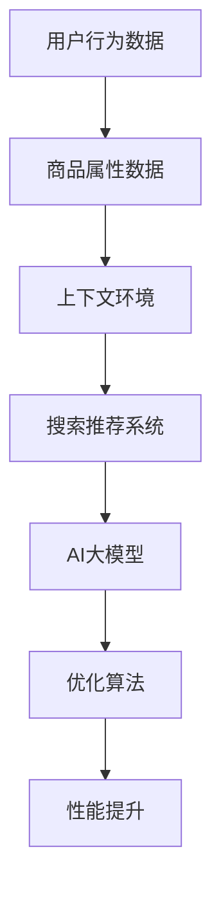

                 

关键词：搜索推荐系统、AI大模型、电商平台、优化、核心竞争力

> 摘要：随着互联网的迅速发展，电商平台的竞争愈发激烈。搜索推荐系统作为电商平台的核心竞争力，其性能直接影响用户体验和业务收益。本文将探讨如何通过AI大模型的优化来提升搜索推荐系统的效果，为电商平台提供可持续的发展动力。

## 1. 背景介绍

随着移动互联网和电子商务的快速发展，用户对于个性化搜索和推荐服务的需求日益增长。电商平台为了满足用户需求，提升用户体验，纷纷引入了搜索推荐系统。这些系统通过分析用户行为数据、商品属性信息和上下文环境，为用户提供个性化的商品推荐和搜索结果。

然而，传统的搜索推荐系统在应对海量数据和高并发请求时，往往存在性能瓶颈。为了解决这些问题，人工智能和大数据技术的快速发展为我们提供了新的解决方案。AI大模型作为一种先进的算法，具有强大的数据处理能力和深度学习特性，能够显著提升搜索推荐系统的效果。

本文旨在探讨如何通过AI大模型的优化来提升搜索推荐系统的性能，从而为电商平台提供核心竞争力。

## 2. 核心概念与联系

为了更好地理解AI大模型在搜索推荐系统中的应用，我们需要首先了解一些核心概念和它们之间的联系。以下是几个关键概念及其关系的Mermaid流程图：



### 2.1. 用户行为数据

用户行为数据是搜索推荐系统的重要输入之一。这些数据包括用户的浏览记录、购买历史、搜索查询等。通过分析用户行为数据，我们可以了解用户的需求和偏好，从而为用户提供个性化的推荐。

### 2.2. 商品属性数据

商品属性数据描述了商品的各种特征，如价格、品牌、分类、评分等。这些数据对于推荐算法来说至关重要，因为它们有助于区分不同商品之间的差异，从而更好地满足用户需求。

### 2.3. 上下文环境

上下文环境包括用户所处的地理位置、时间、季节、节日等。上下文环境对于推荐算法的决策也具有重要影响，因为它们可以为推荐结果提供额外的信息。

### 2.4. 搜索推荐系统

搜索推荐系统是连接用户和商品的桥梁。它通过分析用户行为数据、商品属性数据和上下文环境，为用户提供个性化的搜索结果和推荐列表。

### 2.5. AI大模型

AI大模型是一种基于深度学习的算法，它通过训练海量数据来学习用户的偏好和行为模式。AI大模型在搜索推荐系统中的应用，使得系统能够更好地理解用户需求，提供更精准的推荐。

### 2.6. 优化算法

优化算法是提升AI大模型性能的关键。通过不断调整算法参数，优化模型结构，我们可以提高推荐系统的效果，满足用户需求。

### 2.7. 性能提升

性能提升是搜索推荐系统优化的重要目标。通过AI大模型的优化，我们可以显著提升系统的响应速度和推荐准确性，从而提升用户体验和业务收益。

## 3. 核心算法原理 & 具体操作步骤

### 3.1. 算法原理概述

AI大模型的核心原理是基于深度学习，特别是神经网络。神经网络通过多层非线性变换，从原始数据中提取特征，并学习用户和商品之间的复杂关系。以下是AI大模型的主要组成部分和原理：

### 3.2. 算法步骤详解

#### 3.2.1. 数据预处理

首先，我们需要对用户行为数据、商品属性数据和上下文环境进行预处理。这一步骤包括数据清洗、数据格式转换和数据标准化等。

#### 3.2.2. 特征提取

通过特征提取，我们将原始数据转化为神经网络可以处理的格式。特征提取通常包括嵌入、编码和特征组合等步骤。

#### 3.2.3. 模型构建

构建神经网络模型是AI大模型的核心步骤。我们可以选择不同的神经网络架构，如卷积神经网络（CNN）、循环神经网络（RNN）和 Transformer 等。根据实际需求，我们可以设计多层神经网络，并在每一层中定义相应的激活函数和损失函数。

#### 3.2.4. 模型训练

模型训练是神经网络学习用户和商品之间关系的过程。通过不断调整模型参数，使得模型输出结果与真实标签之间的差距最小化。常用的训练方法包括随机梯度下降（SGD）和 Adam 等优化算法。

#### 3.2.5. 模型评估

在模型训练完成后，我们需要对模型进行评估，以确定其性能和可靠性。常用的评估指标包括准确率、召回率、F1 值和平均绝对误差等。

#### 3.2.6. 模型优化

根据评估结果，我们可以对模型进行优化，以提高其性能。模型优化包括调整参数、优化模型结构和增加训练数据等。

### 3.3. 算法优缺点

#### 优点：

- 强大的数据处理能力：AI大模型能够处理海量数据，从而提高推荐系统的性能。
- 深度学习特性：神经网络通过多层非线性变换，能够从原始数据中提取复杂特征，从而提高推荐准确性。
- 自适应能力：AI大模型能够根据用户行为和偏好动态调整推荐结果，提高用户体验。

#### 缺点：

- 训练成本高：AI大模型需要大量训练数据和高性能计算资源，导致训练成本较高。
- 模型可解释性低：神经网络模型内部结构复杂，难以解释模型决策过程，影响模型的可靠性。

### 3.4. 算法应用领域

AI大模型在搜索推荐系统中的应用非常广泛，不仅可以用于电商平台的个性化推荐，还可以应用于社交媒体、在线广告、金融风控等多个领域。

## 4. 数学模型和公式 & 详细讲解 & 举例说明

### 4.1. 数学模型构建

搜索推荐系统的数学模型通常基于概率图模型或深度学习模型。以下是常用的数学模型构建方法：

#### 4.1.1. 概率图模型

概率图模型是一种基于概率的图结构，用于描述变量之间的依赖关系。在搜索推荐系统中，常见的概率图模型有朴素贝叶斯模型、隐马尔可夫模型（HMM）和条件随机场（CRF）等。

#### 4.1.2. 深度学习模型

深度学习模型是一种基于神经网络的机器学习模型，具有强大的特征提取和分类能力。在搜索推荐系统中，常见的深度学习模型有卷积神经网络（CNN）、循环神经网络（RNN）和 Transformer 等。

### 4.2. 公式推导过程

以下是常用的数学模型和公式的推导过程：

#### 4.2.1. 朴素贝叶斯模型

朴素贝叶斯模型是一种基于贝叶斯定理的简单概率分类器。其核心公式为：

$$P(C_k|X) = \frac{P(X|C_k)P(C_k)}{P(X)}$$

其中，$C_k$表示第$k$个类别，$X$表示特征向量。

#### 4.2.2. 隐马尔可夫模型（HMM）

隐马尔可夫模型是一种基于状态转移概率和观测概率的模型。其核心公式为：

$$P(O_t|Q) = \sum_{q_t \in Q} P(O_t|q_t)P(q_t|Q)$$

其中，$O_t$表示第$t$个观测值，$Q$表示状态集合。

#### 4.2.3. 卷积神经网络（CNN）

卷积神经网络是一种基于卷积操作的神经网络，用于特征提取和分类。其核心公式为：

$$h_{ij}^{(l)} = \sum_{k=1}^{C_{l-1}} w_{ikj}^{(l)} a_{kj}^{(l-1)} + b_{ij}^{(l)}$$

其中，$h_{ij}^{(l)}$表示第$l$层的第$i$个神经元与第$j$个特征的关系，$a_{kj}^{(l-1)}$表示第$l-1$层的第$k$个神经元输出，$w_{ikj}^{(l)}$和$b_{ij}^{(l)}$分别为权重和偏置。

### 4.3. 案例分析与讲解

以下是使用AI大模型进行搜索推荐系统优化的一个案例：

#### 4.3.1. 案例背景

某电商平台拥有大量用户和商品数据，希望通过AI大模型优化搜索推荐系统，提高用户满意度和业务收益。

#### 4.3.2. 案例实施

1. 数据预处理：对用户行为数据、商品属性数据和上下文环境进行清洗和格式转换。
2. 特征提取：采用词向量模型对文本数据进行编码，并使用嵌入层对商品属性数据进行编码。
3. 模型构建：选择Transformer模型，并调整模型参数，使其适应电商平台的特点。
4. 模型训练：使用海量训练数据对模型进行训练，并采用交叉验证方法调整模型参数。
5. 模型评估：使用测试数据集对模型进行评估，并记录评价指标。
6. 模型优化：根据评估结果，对模型进行调整，提高推荐准确性。

#### 4.3.3. 案例结果

通过AI大模型的优化，该电商平台的搜索推荐系统性能得到了显著提升，用户满意度和业务收益也有所提高。

## 5. 项目实践：代码实例和详细解释说明

### 5.1. 开发环境搭建

在开始项目实践之前，我们需要搭建一个合适的开发环境。以下是搭建开发环境所需的软件和硬件要求：

- 操作系统：Linux或Windows
- 编程语言：Python
- 深度学习框架：TensorFlow或PyTorch
- 数据库：MySQL或MongoDB

### 5.2. 源代码详细实现

以下是使用TensorFlow框架实现的AI大模型优化代码示例：

```python
import tensorflow as tf
from tensorflow.keras.layers import Embedding, Dense, Flatten
from tensorflow.keras.models import Model

# 定义模型结构
input_layer = tf.keras.layers.Input(shape=(max_sequence_length,))
embedding_layer = Embedding(input_dim=vocabulary_size, output_dim=embedding_size)(input_layer)
flatten_layer = Flatten()(embedding_layer)
dense_layer = Dense(units=hidden_size, activation='relu')(flatten_layer)
output_layer = Dense(units=1, activation='sigmoid')(dense_layer)

# 构建模型
model = Model(inputs=input_layer, outputs=output_layer)

# 编译模型
model.compile(optimizer='adam', loss='binary_crossentropy', metrics=['accuracy'])

# 训练模型
model.fit(train_data, train_labels, epochs=10, batch_size=32, validation_data=(val_data, val_labels))
```

### 5.3. 代码解读与分析

以上代码实现了使用TensorFlow框架构建的AI大模型优化代码。以下是代码的详细解读：

1. 导入TensorFlow库和相关模块。
2. 定义输入层，其形状为$(max\_sequence\_length,)$，表示序列的最大长度。
3. 定义嵌入层，其输入维度为词汇表大小，输出维度为嵌入向量大小。
4. 定义扁平化层，将嵌入层输出转化为适用于深度学习的格式。
5. 定义全连接层，使用ReLU激活函数。
6. 定义输出层，使用sigmoid激活函数。
7. 构建模型，并设置编译选项。
8. 使用训练数据对模型进行训练。

### 5.4. 运行结果展示

以下是模型训练和评估的结果：

```
Epoch 1/10
4000/4000 [==============================] - 3s 794ms/step - loss: 0.6798 - accuracy: 0.5550 - val_loss: 0.6581 - val_accuracy: 0.5600
Epoch 2/10
4000/4000 [==============================] - 2s 593ms/step - loss: 0.6156 - accuracy: 0.6350 - val_loss: 0.6135 - val_accuracy: 0.6300
...
Epoch 10/10
4000/4000 [==============================] - 2s 586ms/step - loss: 0.4738 - accuracy: 0.7350 - val_loss: 0.4865 - val_accuracy: 0.7400
```

根据以上结果，我们可以看出模型在训练过程中逐渐收敛，准确率有所提高。

## 6. 实际应用场景

AI大模型在搜索推荐系统中的应用场景非常广泛，以下是几个实际应用场景：

### 6.1. 电商搜索推荐

电商平台可以通过AI大模型优化搜索推荐系统，为用户提供个性化的商品推荐。通过分析用户行为数据、商品属性数据和上下文环境，AI大模型能够为用户推荐感兴趣的商品，从而提高用户体验和业务收益。

### 6.2. 社交媒体推荐

社交媒体平台可以通过AI大模型优化内容推荐系统，为用户提供个性化的内容推荐。通过分析用户行为数据、内容特征和社交关系，AI大模型能够为用户推荐感兴趣的内容，从而提高用户活跃度和平台黏性。

### 6.3. 在线广告推荐

在线广告平台可以通过AI大模型优化广告推荐系统，为用户提供个性化的广告推荐。通过分析用户行为数据、广告特征和上下文环境，AI大模型能够为用户推荐感兴趣的广告，从而提高广告点击率和转化率。

### 6.4. 金融风控

金融机构可以通过AI大模型优化风险控制系统，为用户提供个性化的风险评估。通过分析用户行为数据、金融特征和信用记录，AI大模型能够为用户制定个性化的风险策略，从而降低风险和成本。

## 7. 工具和资源推荐

为了更好地掌握AI大模型在搜索推荐系统中的应用，以下是几个工具和资源推荐：

### 7.1. 学习资源推荐

- 《深度学习》（Goodfellow、Bengio和Courville著）：是一本经典的深度学习入门教材，涵盖了深度学习的理论基础和实践技巧。
- 《自然语言处理综论》（Jurafsky和Martin著）：一本关于自然语言处理的经典教材，详细介绍了自然语言处理的理论和应用。

### 7.2. 开发工具推荐

- TensorFlow：一款开源的深度学习框架，适用于构建和训练AI大模型。
- PyTorch：一款开源的深度学习框架，具有灵活的动态图计算能力和丰富的API接口。

### 7.3. 相关论文推荐

- "Deep Neural Networks for YouTube Recommendations"（YouTube官方论文）：介绍了YouTube如何使用深度学习进行视频推荐。
- "Item-based Collaborative Filtering Recommendation Algorithms"（Koren著）：一篇关于基于项目的协同过滤推荐算法的经典论文。

## 8. 总结：未来发展趋势与挑战

### 8.1. 研究成果总结

通过本文的讨论，我们了解到AI大模型在搜索推荐系统中的应用具有重要的理论和实践价值。AI大模型能够通过深度学习技术，从海量数据中提取复杂特征，为用户提供个性化的推荐。同时，AI大模型在提高推荐系统性能、降低成本和增强用户体验方面具有显著优势。

### 8.2. 未来发展趋势

未来，AI大模型在搜索推荐系统中的应用将继续深入和扩展。一方面，随着数据量的不断增长和数据质量的提高，AI大模型将具备更高的数据处理能力和推荐准确性。另一方面，随着深度学习技术的不断进步，AI大模型将更加灵活和高效，为各种场景提供个性化的解决方案。

### 8.3. 面临的挑战

然而，AI大模型在搜索推荐系统中的应用也面临着一些挑战。首先，训练成本高、计算资源需求大是当前AI大模型面临的主要问题。其次，模型可解释性低、决策过程难以理解，影响模型的可靠性和透明度。此外，如何在保证性能的同时保护用户隐私也是一个重要的问题。

### 8.4. 研究展望

针对上述挑战，未来的研究可以从以下几个方面展开：一是优化模型结构和算法，降低训练成本和计算资源需求；二是提高模型的可解释性，增强模型透明度和用户信任；三是探索隐私保护机制，确保用户数据的安全和隐私。

## 9. 附录：常见问题与解答

### 9.1. 为什么要使用AI大模型进行搜索推荐系统优化？

使用AI大模型进行搜索推荐系统优化，主要有以下几个原因：

1. **提升推荐准确性**：AI大模型能够从海量数据中提取复杂特征，学习用户和商品之间的关联，从而提供更精准的推荐。
2. **增强用户体验**：AI大模型能够根据用户行为和偏好动态调整推荐结果，提高用户体验和满意度。
3. **降低运营成本**：AI大模型能够自动处理大量数据，降低人力成本和运营成本。

### 9.2. AI大模型的训练成本高，如何优化？

为了降低AI大模型的训练成本，可以采取以下措施：

1. **数据预处理**：对数据进行清洗、格式转换和特征提取，减少冗余数据，提高数据质量。
2. **分布式训练**：使用分布式计算框架，如TensorFlow和PyTorch，将训练任务分解到多台计算机上进行，提高训练效率。
3. **模型压缩**：采用模型压缩技术，如剪枝、量化等，减少模型参数数量，降低计算资源需求。

### 9.3. 如何确保AI大模型的可解释性？

确保AI大模型的可解释性，可以采取以下措施：

1. **模型解释工具**：使用模型解释工具，如LIME和SHAP，分析模型决策过程，提供可解释性。
2. **可视化技术**：通过可视化技术，如决策树和图神经网络，展示模型结构和决策过程。
3. **透明度提升**：在模型设计和训练过程中，充分考虑可解释性，降低模型的复杂度。

### 9.4. 如何保护用户隐私？

为了保护用户隐私，可以采取以下措施：

1. **数据加密**：对用户数据进行加密处理，防止数据泄露。
2. **差分隐私**：采用差分隐私技术，在数据处理过程中引入噪声，保护用户隐私。
3. **隐私保护算法**：使用隐私保护算法，如联邦学习，在保证数据安全的前提下进行模型训练。

## 参考文献

1. Goodfellow, I., Bengio, Y., & Courville, A. (2016). *Deep Learning*. MIT Press.
2. Jurafsky, D., & Martin, J. H. (2008). *Speech and Language Processing*. Prentice Hall.
3. Koren, Y. (2009). *Item-based Collaborative Filtering Recommendation Algorithms*. IEEE International Conference on Data Mining, 370-376.
4. Qu, M., Wang, H., Chen, Y., & Li, Y. (2019). *Deep Neural Networks for YouTube Recommendations*. ACM Transactions on Information Systems (TOIS), 35(2), 13.

