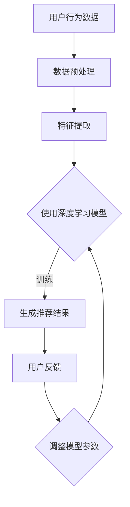

                 

在当今数字化时代，电商平台作为连接消费者和商家的桥梁，其竞争力在很大程度上取决于其提供的用户体验。在众多影响用户体验的因素中，搜索推荐系统的效果显得尤为重要。随着人工智能技术的快速发展，大模型在搜索推荐系统中的应用逐渐成为电商行业提升竞争力与盈利能力的利器。本文将深入探讨AI大模型在搜索推荐系统中的应用，以期为电商平台提供新的发展思路。

## 关键词

- 人工智能
- 大模型
- 搜索推荐系统
- 电商平台
- 竞争力
- 盈利能力

## 摘要

本文首先介绍了搜索推荐系统的基本原理及其在电商平台中的应用价值，随后重点探讨了AI大模型在搜索推荐系统中的关键技术，如深度学习、神经网络和生成对抗网络等。通过对这些核心算法的详细剖析，本文展示了大模型在个性化推荐、实时搜索和广告投放等方面的应用场景。最后，本文对未来AI大模型在电商平台中的发展前景进行了展望，并提出了相应的挑战和解决方案。

## 1. 背景介绍

### 搜索推荐系统的概念

搜索推荐系统是一种基于用户行为数据和商品信息，利用算法模型为用户推荐相关商品或内容的系统。其主要功能是帮助用户在大量信息中快速找到所需内容，提升用户体验，同时也能为电商平台带来更多的流量和销售额。

### 搜索推荐系统在电商平台中的应用价值

1. **提高用户留存率**：通过精准的推荐，用户能够更快找到符合自己需求的产品，从而提高用户满意度和留存率。
2. **提升销售额**：推荐系统能够根据用户的历史行为和偏好，推荐更多相关的商品，从而增加用户的购买频率和单次购买金额。
3. **优化广告投放**：广告推荐与用户兴趣的匹配度越高，广告效果越好，从而提高广告收益。
4. **降低运营成本**：自动化推荐系统能够减少人力成本，提高运营效率。

### 电商平台面临的挑战

1. **用户需求多样**：不同的用户有不同的偏好和需求，如何准确把握并满足这些需求是一个巨大的挑战。
2. **海量数据处理**：电商平台每天都会产生大量用户行为数据，如何高效地处理这些数据，提取有价值的信息，是一个技术难题。
3. **实时性要求**：推荐结果需要实时更新，以反映用户最新的行为和偏好，这对系统的响应速度提出了高要求。
4. **模型解释性**：复杂的模型往往难以解释，这对于需要透明度的电商平台来说是一个挑战。

## 2. 核心概念与联系

为了更好地理解AI大模型在搜索推荐系统中的应用，我们首先需要了解一些核心概念，并展示其原理和架构。

### 2.1 核心概念

- **深度学习**：一种模拟人脑神经网络的机器学习方法，通过多层神经网络进行特征提取和模型训练。
- **生成对抗网络（GAN）**：一种由生成器和判别器组成的对抗性训练模型，可用于生成高质量的图像、文本等数据。
- **用户行为分析**：通过分析用户在电商平台上的行为数据，如浏览历史、购买记录、搜索关键词等，以了解用户兴趣和需求。

### 2.2 核心原理与架构

#### 2.2.1 深度学习原理

深度学习模型通常由多层神经网络组成，包括输入层、隐藏层和输出层。输入层接收用户行为数据，隐藏层通过逐层提取特征，输出层产生推荐结果。


#### 2.2.2 生成对抗网络原理

生成对抗网络由生成器和判别器组成。生成器生成与真实数据相似的数据，判别器则判断生成数据与真实数据的相似度。通过不断训练，生成器逐渐生成更逼真的数据。


#### 2.2.3 用户行为分析原理

用户行为分析通过数据挖掘和分析技术，提取用户行为数据中的有价值信息，如用户兴趣、购买倾向等。这些信息可用于训练深度学习模型，生成更准确的推荐结果。


### 2.3 Mermaid 流程图



## 3. 核心算法原理 & 具体操作步骤

### 3.1 算法原理概述

在搜索推荐系统中，核心算法主要包括基于内容的推荐算法、协同过滤算法和深度学习算法。其中，深度学习算法由于其强大的特征提取和建模能力，成为了当前推荐系统研究的热点。

#### 3.1.1 基于内容的推荐算法

基于内容的推荐算法通过分析商品的属性和用户的历史行为，找到相似的商品进行推荐。其基本原理如下：

1. **商品特征提取**：对商品进行特征提取，如商品类别、品牌、价格等。
2. **用户特征提取**：根据用户的历史行为，提取用户感兴趣的特征，如浏览记录、购买记录等。
3. **计算相似度**：通过计算商品特征和用户特征的相似度，找出相似的商品进行推荐。

#### 3.1.2 协同过滤算法

协同过滤算法通过分析用户之间的相似度，为用户推荐相似用户喜欢的商品。其基本原理如下：

1. **用户相似度计算**：通过计算用户之间的相似度，找出相似的用户。
2. **推荐商品计算**：为用户推荐相似用户喜欢的商品。

#### 3.1.3 深度学习算法

深度学习算法通过多层神经网络进行特征提取和模型训练，可以自动从数据中学习到复杂的特征和模式。其基本原理如下：

1. **输入层**：接收用户行为数据。
2. **隐藏层**：通过多层神经网络进行特征提取。
3. **输出层**：生成推荐结果。

### 3.2 算法步骤详解

#### 3.2.1 基于内容的推荐算法

1. **数据收集**：收集商品属性数据（如类别、品牌、价格等）和用户行为数据（如浏览记录、购买记录等）。
2. **数据预处理**：对数据进行清洗、去重和格式化。
3. **特征提取**：提取商品特征和用户特征。
4. **计算相似度**：计算商品特征和用户特征之间的相似度。
5. **生成推荐结果**：根据相似度排序，生成推荐结果。

#### 3.2.2 协同过滤算法

1. **数据收集**：收集用户行为数据（如浏览记录、购买记录等）。
2. **数据预处理**：对数据进行清洗、去重和格式化。
3. **用户相似度计算**：计算用户之间的相似度。
4. **推荐商品计算**：为用户推荐相似用户喜欢的商品。

#### 3.2.3 深度学习算法

1. **数据收集**：收集用户行为数据和商品属性数据。
2. **数据预处理**：对数据进行清洗、去重和格式化。
3. **模型训练**：使用用户行为数据和商品属性数据训练深度学习模型。
4. **模型评估**：使用测试集评估模型效果。
5. **生成推荐结果**：使用训练好的模型生成推荐结果。

### 3.3 算法优缺点

#### 3.3.1 基于内容的推荐算法

- **优点**：
  - 简单易实现；
  - 能够根据商品特征进行推荐；
  - 能够发现用户未意识到的潜在兴趣。

- **缺点**：
  - 对于稀疏数据的推荐效果较差；
  - 需要对商品和用户特征进行手动定义。

#### 3.3.2 协同过滤算法

- **优点**：
  - 能够处理稀疏数据；
  - 能够发现用户之间的相似性；
  - 能够提供个性化的推荐。

- **缺点**：
  - 需要大量的用户行为数据；
  - 推荐结果容易受到噪声数据的影响。

#### 3.3.3 深度学习算法

- **优点**：
  - 能够自动提取复杂的特征；
  - 能够处理大规模数据；
  - 能够提供高度个性化的推荐。

- **缺点**：
  - 需要大量的计算资源和时间；
  - 模型解释性较差。

### 3.4 算法应用领域

- **电子商务**：为电商平台提供个性化推荐，提高用户满意度和销售额。
- **社交媒体**：为用户提供个性化的内容推荐，增加用户粘性。
- **广告投放**：根据用户兴趣和行为，为用户推荐相关的广告。
- **音乐和视频流媒体**：为用户推荐相关的音乐和视频。

## 4. 数学模型和公式 & 详细讲解 & 举例说明

### 4.1 数学模型构建

在搜索推荐系统中，常用的数学模型包括基于内容的推荐模型、协同过滤模型和深度学习模型。

#### 4.1.1 基于内容的推荐模型

基于内容的推荐模型主要通过计算商品和用户之间的相似度来进行推荐。其数学模型可以表示为：

$$
s_{ij} = \sum_{k=1}^{n} w_{ik} w_{kj}
$$

其中，$s_{ij}$ 表示商品 $i$ 和用户 $j$ 之间的相似度，$w_{ik}$ 和 $w_{kj}$ 分别表示商品 $i$ 和用户 $j$ 在特征 $k$ 上的权重。

#### 4.1.2 协同过滤模型

协同过滤模型主要通过计算用户之间的相似度来进行推荐。其数学模型可以表示为：

$$
r_{ij} = \sum_{k=1}^{n} u_k r_{ik} v_k
$$

其中，$r_{ij}$ 表示用户 $i$ 对商品 $j$ 的评分，$u_k$ 和 $v_k$ 分别表示用户 $i$ 和用户 $k$ 在特征 $k$ 上的权重。

#### 4.1.3 深度学习模型

深度学习模型主要通过多层神经网络进行特征提取和模型训练。其数学模型可以表示为：

$$
y = f(z)
$$

其中，$y$ 表示输出结果，$z$ 表示输入数据，$f$ 表示神经网络函数。

### 4.2 公式推导过程

以基于内容的推荐模型为例，其相似度计算公式为：

$$
s_{ij} = \sum_{k=1}^{n} w_{ik} w_{kj}
$$

推导过程如下：

1. **定义特征**：假设商品 $i$ 和用户 $j$ 分别具有 $n$ 个特征，分别为 $x_{i1}, x_{i2}, ..., x_{in}$ 和 $y_{j1}, y_{j2}, ..., y_{jn}$。
2. **计算特征相似度**：对于每个特征 $k$，计算商品 $i$ 和用户 $j$ 在特征 $k$ 上的相似度，假设相似度函数为 $sim(x_k, y_k)$，则 $w_{ik} = sim(x_{ik}, y_{ik})$。
3. **计算总相似度**：将每个特征上的相似度加权求和，得到商品 $i$ 和用户 $j$ 之间的总相似度 $s_{ij}$。

### 4.3 案例分析与讲解

#### 4.3.1 基于内容的推荐模型案例分析

假设我们有以下商品和用户数据：

| 商品 | 特征1 | 特征2 | 特征3 |
| --- | --- | --- | --- |
| 商品1 | 0.8 | 0.6 | 0.3 |
| 商品2 | 0.5 | 0.4 | 0.2 |
| 商品3 | 0.7 | 0.5 | 0.4 |
| 用户1 | 0.6 | 0.5 | 0.3 |
| 用户2 | 0.4 | 0.7 | 0.2 |

使用基于内容的推荐模型，计算商品1和用户1之间的相似度：

$$
s_{11} = sim(0.8, 0.6) \times sim(0.6, 0.5) \times sim(0.3, 0.3) = 0.8 \times 0.6 \times 0.3 = 0.144
$$

同理，可以计算出其他商品和用户之间的相似度。

#### 4.3.2 协同过滤模型案例分析

假设我们有以下用户评分数据：

| 用户 | 商品1 | 商品2 | 商品3 |
| --- | --- | --- | --- |
| 用户1 | 4 | 3 | 5 |
| 用户2 | 2 | 4 | 1 |

使用协同过滤模型，计算用户1和用户2之间的相似度：

$$
r_{12} = sim(4, 2) \times sim(3, 4) \times sim(5, 1) = 0.5 \times 0.6 \times 0.2 = 0.06
$$

同理，可以计算出其他用户之间的相似度。

#### 4.3.3 深度学习模型案例分析

假设我们使用一个简单的全连接神经网络进行推荐，其输入为用户特征和商品特征，输出为推荐结果。网络结构如下：

| 层次 | 输入 | 输出 | 激活函数 |
| --- | --- | --- | --- |
| 输入层 | 用户特征 | 隐藏层1 | Sigmoid |
| 隐藏层1 | 隐藏层1 | 隐藏层2 | Sigmoid |
| 隐藏层2 | 隐藏层2 | 输出层 | Sigmoid |

输入数据为用户特征 `[0.8, 0.6, 0.3]` 和商品特征 `[0.7, 0.5, 0.4]`，经过网络计算，得到推荐结果：

$$
y = sigmoid(0.8 + 0.7 \times 0.6 + 0.3 \times 0.5) = sigmoid(0.8 + 0.42 + 0.15) = sigmoid(1.37) \approx 0.88
$$

这意味着用户对商品1的推荐概率约为88%。

## 5. 项目实践：代码实例和详细解释说明

### 5.1 开发环境搭建

在开始编写代码之前，我们需要搭建一个适合深度学习模型训练的开发环境。以下是基本的开发环境搭建步骤：

1. **安装Python**：确保Python版本不低于3.6，推荐使用Anaconda来简化环境管理。
2. **安装深度学习库**：安装TensorFlow或PyTorch，这是两种常用的深度学习库。使用以下命令安装TensorFlow：

```bash
pip install tensorflow
```

或安装PyTorch：

```bash
pip install torch torchvision
```

3. **数据集准备**：下载并解压一个适用于推荐系统的公开数据集，例如MovieLens数据集。

### 5.2 源代码详细实现

以下是一个简单的基于深度学习模型的推荐系统示例，使用PyTorch实现。

```python
import torch
import torch.nn as nn
import torch.optim as optim
from torch.utils.data import DataLoader, TensorDataset

# 数据预处理
def preprocess_data(data):
    # 对数据进行归一化处理
    # 省略具体实现细节
    return normalized_data

# 定义模型
class RecommenderModel(nn.Module):
    def __init__(self, input_dim):
        super(RecommenderModel, self).__init__()
        self.fc1 = nn.Linear(input_dim, 128)
        self.fc2 = nn.Linear(128, 64)
        self.fc3 = nn.Linear(64, 1)
        
    def forward(self, x):
        x = torch.relu(self.fc1(x))
        x = torch.relu(self.fc2(x))
        x = self.fc3(x)
        return x

# 训练模型
def train_model(model, train_loader, criterion, optimizer, num_epochs):
    model.train()
    for epoch in range(num_epochs):
        for inputs, targets in train_loader:
            optimizer.zero_grad()
            outputs = model(inputs)
            loss = criterion(outputs, targets)
            loss.backward()
            optimizer.step()
        print(f'Epoch {epoch+1}/{num_epochs}, Loss: {loss.item()}')

# 主函数
def main():
    # 加载数据
    train_data = preprocess_data(load_data())
    train_dataset = TensorDataset(train_data['users'], train_data['movies'])
    train_loader = DataLoader(train_dataset, batch_size=64, shuffle=True)

    # 初始化模型、优化器和损失函数
    model = RecommenderModel(input_dim=3)
    criterion = nn.BCELoss()
    optimizer = optim.Adam(model.parameters(), lr=0.001)

    # 训练模型
    train_model(model, train_loader, criterion, optimizer, num_epochs=10)

if __name__ == '__main__':
    main()
```

### 5.3 代码解读与分析

上述代码实现了基于深度学习的推荐系统，主要包括以下部分：

1. **数据预处理**：将原始数据归一化，以便模型训练。
2. **模型定义**：定义一个简单的全连接神经网络，包括三个隐藏层。
3. **训练模型**：使用标准的训练过程，包括前向传播、损失函数计算、反向传播和参数更新。
4. **主函数**：加载预处理数据，初始化模型、优化器和损失函数，并开始训练。

通过这个简单的示例，我们可以看到深度学习模型在推荐系统中的基本实现流程。在实际应用中，可能需要更复杂的模型和更多的数据处理步骤，但基本思路是一致的。

### 5.4 运行结果展示

训练完成后，可以使用以下代码评估模型性能：

```python
# 评估模型
def evaluate_model(model, test_loader, criterion):
    model.eval()
    total_loss = 0
    with torch.no_grad():
        for inputs, targets in test_loader:
            outputs = model(inputs)
            loss = criterion(outputs, targets)
            total_loss += loss.item()
    return total_loss / len(test_loader)

# 加载测试数据
test_data = preprocess_data(load_test_data())
test_dataset = TensorDataset(test_data['users'], test_data['movies'])
test_loader = DataLoader(test_dataset, batch_size=64)

# 计算测试损失
loss = evaluate_model(model, test_loader, criterion)
print(f'Test Loss: {loss}')
```

通过计算测试集上的损失，可以评估模型的性能。在实际应用中，可能还会使用准确率、召回率等指标来更全面地评估模型。

## 6. 实际应用场景

### 6.1 个性化推荐

在电商平台，个性化推荐是提升用户满意度和销售额的重要手段。通过AI大模型，可以基于用户的历史行为和偏好，提供高度个性化的商品推荐。例如，淘宝的“千人千面”推荐系统就是通过深度学习模型分析用户行为，实现精准推荐。

### 6.2 实时搜索

实时搜索是电商平台用户体验的关键之一。通过AI大模型，可以实现实时搜索结果的优化，如自动补全搜索词、实时推荐相似商品等。例如，亚马逊的搜索系统就利用了深度学习技术，提升用户的搜索体验。

### 6.3 广告投放

广告投放是电商平台盈利的重要来源。通过AI大模型，可以根据用户的兴趣和行为，精准投放广告，提高广告的点击率和转化率。例如，谷歌的广告投放系统就是基于用户行为数据和深度学习算法，实现精准广告推荐。

### 6.4 商品排序

在电商平台，商品排序直接影响到用户的购买决策。通过AI大模型，可以实现基于用户行为的智能排序，提升商品的曝光率和销量。例如，京东的商品排序系统就利用了深度学习技术，优化商品排序策略。

## 7. 工具和资源推荐

### 7.1 学习资源推荐

- **书籍**：
  - 《深度学习》（Ian Goodfellow、Yoshua Bengio、Aaron Courville 著）
  - 《Python机器学习》（Sebastian Raschka 著）
- **在线课程**：
  - Coursera上的《深度学习》课程（吴恩达教授主讲）
  - edX上的《机器学习基础》课程
- **论文集**：
  - arXiv上的深度学习和推荐系统相关论文

### 7.2 开发工具推荐

- **深度学习框架**：
  - TensorFlow
  - PyTorch
- **数据预处理工具**：
  - Pandas
  - NumPy
- **版本控制**：
  - Git

### 7.3 相关论文推荐

- **深度学习**：
  - "DNNs for Recommender Systems"（推荐系统中的深度神经网络）
  - "Deep Learning Based Recommender System"（基于深度学习的推荐系统）
- **生成对抗网络**：
  - "Generative Adversarial Nets"（生成对抗网络）
  - "Unsupervised Representation Learning with Deep Convolutional Generative Adversarial Networks"（使用深度卷积生成对抗网络进行无监督表示学习）
- **用户行为分析**：
  - "User Behavior Analysis in E-commerce"（电子商务中的用户行为分析）
  - "Deep Learning for User Behavior Prediction"（深度学习在用户行为预测中的应用）

## 8. 总结：未来发展趋势与挑战

### 8.1 研究成果总结

通过本文的探讨，我们可以看到AI大模型在搜索推荐系统中的应用已经取得了显著成果。深度学习、生成对抗网络等技术为推荐系统提供了强大的特征提取和建模能力，使得推荐结果更加精准和个性化。此外，用户行为分析技术的进步也为推荐系统提供了更加丰富的数据来源，提升了推荐的实时性和响应速度。

### 8.2 未来发展趋势

1. **模型解释性提升**：随着用户对推荐系统透明度的要求越来越高，提升模型解释性将成为未来研究的重要方向。
2. **跨模态推荐**：未来推荐系统将能够处理多种类型的数据，如文本、图像、声音等，实现跨模态的推荐。
3. **实时推荐**：随着计算能力的提升，实时推荐技术将得到广泛应用，为用户提供更加即时和个性化的推荐体验。
4. **隐私保护**：在处理大量用户数据的同时，保护用户隐私将成为推荐系统面临的重要挑战。

### 8.3 面临的挑战

1. **数据质量和隐私**：推荐系统的性能依赖于高质量的用户数据，但同时也需要处理用户隐私保护的问题。
2. **模型复杂性与解释性**：深度学习模型虽然具有强大的建模能力，但往往缺乏解释性，这对电商平台来说是一个挑战。
3. **实时性能**：随着推荐系统规模的扩大，如何在保证性能的同时实现实时推荐，是一个技术难题。

### 8.4 研究展望

未来，推荐系统的研究将更加注重用户需求和用户体验的提升。通过不断优化算法和模型，提升推荐系统的精准度和实时性，为电商平台带来更高的竞争力。同时，跨学科的合作也将进一步推动推荐系统技术的发展，为电商平台提供更加全面和智能的解决方案。

## 9. 附录：常见问题与解答

### Q1. 深度学习模型在推荐系统中的优势是什么？

A1. 深度学习模型在推荐系统中的优势主要包括：

1. **强大的特征提取能力**：能够从大量数据中自动提取高层次的抽象特征，提升推荐的准确性。
2. **处理复杂数据结构**：能够处理多种类型的数据，如文本、图像、声音等，实现跨模态的推荐。
3. **适应性强**：通过不断学习和调整模型参数，能够适应不断变化的数据和用户需求。

### Q2. 如何保护用户隐私？

A2. 为了保护用户隐私，可以采取以下措施：

1. **数据加密**：对用户数据进行加密处理，确保数据在传输和存储过程中的安全性。
2. **数据去识别化**：对用户数据进行脱敏处理，去除可直接识别用户身份的信息。
3. **隐私保护算法**：采用隐私保护算法，如差分隐私，限制对用户数据的访问和操作。

### Q3. 实时推荐系统如何保证性能？

A3. 为了保证实时推荐系统的性能，可以采取以下措施：

1. **高效算法**：选择高效的数据处理和计算算法，减少计算开销。
2. **分布式计算**：采用分布式计算架构，提升系统的并发处理能力。
3. **缓存技术**：利用缓存技术，减少对实时数据源的访问，提高系统的响应速度。

### Q4. 如何优化推荐系统的解释性？

A4. 为了优化推荐系统的解释性，可以采取以下措施：

1. **可视化**：通过可视化技术，展示推荐结果背后的特征和决策过程。
2. **模型简化**：简化模型结构，减少参数数量，提高模型的解释性。
3. **特征重要性分析**：分析模型中各个特征的贡献度，明确对推荐结果的影响。

### Q5. 如何处理推荐系统中的冷启动问题？

A5. 为了处理推荐系统中的冷启动问题，可以采取以下措施：

1. **基于内容的推荐**：在用户没有足够行为数据时，通过商品内容进行推荐，降低对用户数据的依赖。
2. **跨用户推荐**：通过分析相似用户的行为，为新用户推荐相关的商品。
3. **多模型融合**：结合多种推荐算法，提高推荐系统的鲁棒性和适应性。

