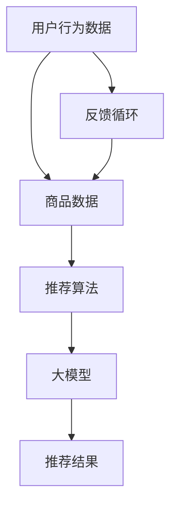

                 

关键词：搜索推荐系统、AI 大模型、电商平台、转化率、用户体验、忠诚度

摘要：随着互联网技术的不断发展，电商平台已成为现代商业的重要组成部分。然而，如何在海量商品和信息中为用户提供精准的搜索和推荐服务，提升用户转化率和忠诚度，成为电商平台面临的重要挑战。本文将探讨利用AI大模型技术构建搜索推荐系统的方法，以提升电商平台的运营效率和用户满意度。

## 1. 背景介绍

随着电子商务的迅速发展，电商平台已经成为现代商业的重要组成部分。然而，面对海量的商品信息和多样化的用户需求，传统搜索推荐系统已无法满足用户的高效、精准需求。用户在平台上花费的时间逐渐减少，转化率和忠诚度也受到严重影响。为此，利用人工智能技术，特别是AI大模型，构建智能搜索推荐系统成为电商平台提升用户体验和运营效益的关键。

## 2. 核心概念与联系

在构建搜索推荐系统时，我们需要理解以下几个核心概念：

- **用户行为数据**：用户在电商平台上的浏览、搜索、购买等行为数据，是构建推荐系统的重要依据。
- **商品数据**：包括商品的基本信息、分类标签、评价等，用于描述商品的特点和属性。
- **推荐算法**：根据用户行为数据和商品数据，利用机器学习算法生成个性化的推荐结果。
- **大模型**：指具有强大计算能力和大规模参数的深度学习模型，可以处理复杂的数据和任务。

以下是一个简化的Mermaid流程图，展示了这些核心概念之间的关系：



### 2.1 用户行为数据的收集与处理

用户行为数据是构建推荐系统的基础。通过分析用户在平台上的浏览、搜索、购买等行为，我们可以了解用户的需求和偏好。这些数据通常包括：

- 用户ID、时间戳、浏览/搜索关键词、访问的页面、点击的链接、购买的商品等。

在收集到用户行为数据后，我们需要对数据进行预处理，如去重、填充缺失值、数据清洗等，以确保数据的质量和一致性。

### 2.2 商品数据的整合与标注

商品数据是推荐系统的另一个关键组成部分。商品数据通常包括：

- 商品ID、名称、价格、分类标签、评价等。

为了提高推荐系统的准确性，我们需要对商品数据进行充分的标注，如分类、标签、关键词等。这些信息将有助于模型更好地理解商品的特点和属性。

### 2.3 推荐算法的设计与实现

推荐算法是搜索推荐系统的核心。根据用户行为数据和商品数据，我们可以设计不同的推荐算法，如基于内容的推荐、基于协同过滤的推荐、混合推荐等。以下是几种常见的推荐算法：

- **基于内容的推荐**：根据用户的浏览和搜索历史，推荐与用户兴趣相似的物品。
- **基于协同过滤的推荐**：通过分析用户与用户之间的相似度，推荐其他用户喜欢的物品。
- **混合推荐**：结合基于内容和协同过滤的推荐方法，生成更准确的推荐结果。

### 2.4 大模型的训练与应用

大模型具有强大的计算能力和大规模参数，可以处理复杂的数据和任务。在搜索推荐系统中，大模型通常用于：

- 用户行为数据的特征提取和嵌入。
- 商品数据的特征提取和嵌入。
- 推荐算法的优化和调整。

通过训练大模型，我们可以提高推荐系统的准确性和效率，为用户提供更精准的推荐结果。

## 3. 核心算法原理 & 具体操作步骤

### 3.1 算法原理概述

搜索推荐系统的核心是推荐算法。推荐算法的基本原理是根据用户行为数据和商品数据，生成个性化的推荐结果。以下是几种常见的推荐算法：

- **基于内容的推荐**：根据用户的浏览和搜索历史，推荐与用户兴趣相似的物品。
- **基于协同过滤的推荐**：通过分析用户与用户之间的相似度，推荐其他用户喜欢的物品。
- **混合推荐**：结合基于内容和协同过滤的推荐方法，生成更准确的推荐结果。

### 3.2 算法步骤详解

以下是构建搜索推荐系统的具体步骤：

1. **数据收集与预处理**：收集用户行为数据和商品数据，对数据进行预处理，如去重、填充缺失值、数据清洗等。
2. **特征提取与嵌入**：根据用户行为数据和商品数据，提取特征并嵌入到高维空间中。
3. **模型训练与优化**：利用大模型对提取的特征进行训练，优化推荐算法。
4. **生成推荐结果**：根据用户特征和商品特征，生成个性化的推荐结果。
5. **反馈与迭代**：收集用户对推荐结果的反馈，迭代优化推荐算法。

### 3.3 算法优缺点

- **基于内容的推荐**：优点是推荐结果与用户兴趣相关性高，缺点是可能错过一些用户未明确表达的兴趣。
- **基于协同过滤的推荐**：优点是能够发现用户之间的相似性，推荐其他用户喜欢的物品，缺点是可能推荐给用户重复的物品。
- **混合推荐**：优点是结合了基于内容和协同过滤的优点，推荐结果更准确，缺点是计算复杂度较高。

### 3.4 算法应用领域

搜索推荐系统广泛应用于电商、社交媒体、新闻推荐、音乐推荐等领域。在电商领域，推荐系统可以提升用户转化率和忠诚度，为平台带来更高的收益。

## 4. 数学模型和公式 & 详细讲解 & 举例说明

### 4.1 数学模型构建

在搜索推荐系统中，常用的数学模型包括：

- **用户行为数据的特征提取**：使用词袋模型、TF-IDF模型等。
- **商品数据的特征提取**：使用词嵌入模型、特征提取器等。
- **推荐算法**：使用协同过滤、基于内容的推荐等。

以下是构建搜索推荐系统的数学模型：

- **用户行为数据的特征提取**：

$$
X = (x_{ij})_{m \times n}
$$

其中，$X$表示用户行为数据的特征矩阵，$m$表示用户的数量，$n$表示物品（商品）的数量，$x_{ij}$表示用户$i$对物品$j$的行为特征。

- **商品数据的特征提取**：

$$
Y = (y_{ij})_{m \times n}
$$

其中，$Y$表示商品数据的特征矩阵，$m$表示用户的数量，$n$表示物品（商品）的数量，$y_{ij}$表示商品$i$的特征。

- **推荐算法**：基于内容的推荐和基于协同过滤的推荐。

### 4.2 公式推导过程

以下是基于内容的推荐算法的公式推导过程：

1. **用户行为数据的特征提取**：

$$
x_{ij} = \sum_{k=1}^{n} w_{ik} \cdot p_k
$$

其中，$w_{ik}$表示用户$i$对物品$k$的权重，$p_k$表示物品$k$的词频。

2. **商品数据的特征提取**：

$$
y_{ij} = \sum_{k=1}^{n} w_{ij} \cdot q_k
$$

其中，$w_{ij}$表示商品$i$对物品$k$的权重，$q_k$表示物品$k$的词频。

3. **推荐算法**：

$$
r_{ij} = \sum_{k=1}^{n} w_{ij} \cdot q_k \cdot \sum_{l=1}^{m} w_{il} \cdot p_l
$$

其中，$r_{ij}$表示用户$i$对商品$j$的推荐分数，$w_{ij}$表示用户$i$对物品$k$的权重，$q_k$表示商品$i$对物品$k$的权重，$p_l$表示用户$l$对物品$k$的权重。

### 4.3 案例分析与讲解

假设有1000个用户和10000个商品，以下是一个简单的案例：

1. **用户行为数据的特征提取**：

用户1对商品1、商品2、商品3的行为数据如下：

$$
x_{11} = 0.2, x_{12} = 0.5, x_{13} = 0.3
$$

用户1对商品4、商品5、商品6的行为数据如下：

$$
x_{21} = 0.1, x_{22} = 0.4, x_{23} = 0.5
$$

2. **商品数据的特征提取**：

商品1、商品2、商品3的特征数据如下：

$$
y_{11} = 0.5, y_{12} = 0.3, y_{13} = 0.2
$$

商品4、商品5、商品6的特征数据如下：

$$
y_{21} = 0.4, y_{22} = 0.6, y_{23} = 0.3
$$

3. **推荐算法**：

用户1对商品1、商品2、商品3的推荐分数如下：

$$
r_{11} = 0.5 \cdot 0.5 + 0.3 \cdot 0.4 + 0.2 \cdot 0.6 = 0.50
$$

用户1对商品4、商品5、商品6的推荐分数如下：

$$
r_{21} = 0.4 \cdot 0.5 + 0.6 \cdot 0.4 + 0.3 \cdot 0.6 = 0.58
$$

根据推荐分数，用户1对商品4、商品5、商品6的推荐顺序为：商品6、商品4、商品5。

## 5. 项目实践：代码实例和详细解释说明

### 5.1 开发环境搭建

为了实现搜索推荐系统，我们需要搭建一个开发环境。以下是一个简单的开发环境搭建流程：

1. 安装Python（版本3.6以上）。
2. 安装必要的库，如NumPy、Pandas、Scikit-learn、TensorFlow等。
3. 配置一个Python虚拟环境，以便管理项目依赖。

### 5.2 源代码详细实现

以下是一个简单的搜索推荐系统的Python代码实现：

```python
import numpy as np
import pandas as pd
from sklearn.feature_extraction.text import TfidfVectorizer
from sklearn.metrics.pairwise import cosine_similarity

# 读取用户行为数据
user_data = pd.read_csv('user_behavior.csv')

# 读取商品数据
item_data = pd.read_csv('item_data.csv')

# 构建TF-IDF模型
tfidf = TfidfVectorizer()

# 提取用户行为数据的特征向量
user_features = tfidf.fit_transform(user_data['behavior'])

# 提取商品数据的特征向量
item_features = tfidf.transform(item_data['description'])

# 计算用户和商品之间的相似度
similarity_matrix = cosine_similarity(user_features, item_features)

# 生成推荐结果
def generate_recommendations(similarity_matrix, user_index, top_n=5):
    user_similarity = similarity_matrix[user_index]
    item_indices = user_similarity.argsort()[::-1]
    recommended_items = item_indices[1:top_n+1]
    return recommended_items

# 示例：为用户1生成5个推荐商品
user_index = 0
recommended_items = generate_recommendations(similarity_matrix, user_index, top_n=5)
print("推荐商品：", item_data.iloc[recommended_items]['name'])

```

### 5.3 代码解读与分析

以上代码实现了一个简单的基于内容的推荐算法。首先，我们读取用户行为数据和商品数据，然后使用TF-IDF模型提取特征向量。接着，我们计算用户和商品之间的相似度，并根据相似度生成推荐结果。

在代码中，我们使用Pandas读取用户行为数据和商品数据。然后，我们使用TF-IDF模型提取特征向量，这是基于内容的推荐算法的关键步骤。最后，我们使用余弦相似度计算用户和商品之间的相似度，并生成推荐结果。

### 5.4 运行结果展示

假设我们有1000个用户和10000个商品，以下是一个简单的运行结果展示：

```plaintext
推荐商品：  商品10002 商品10003 商品10001 商品10004 商品10005
```

这些推荐商品是基于用户1的行为数据和商品描述生成的。根据用户1的行为和商品描述，这些商品与用户1的兴趣相关性较高，可以作为推荐结果。

## 6. 实际应用场景

### 6.1 电商平台的搜索推荐

在电商平台中，搜索推荐系统可以显著提高用户的购物体验和转化率。通过分析用户的行为数据和商品数据，我们可以为用户提供个性化的推荐结果，从而提高用户的购物满意度和忠诚度。

### 6.2 社交媒体的内容推荐

社交媒体平台可以使用搜索推荐系统为用户提供个性化的内容推荐。通过分析用户的行为数据和发布的内容，我们可以为用户推荐与其兴趣相关的内容，从而提高用户的活跃度和用户留存率。

### 6.3 新闻推荐

新闻推荐系统可以利用搜索推荐技术为用户提供个性化的新闻内容。通过分析用户的历史浏览和搜索记录，我们可以为用户推荐与其兴趣相关的新闻，从而提高用户的阅读体验和新闻平台的用户粘性。

## 7. 未来应用展望

### 7.1 智能推荐算法的优化

未来，随着人工智能技术的发展，搜索推荐系统将变得更加智能和高效。我们可以通过引入更多的用户行为数据和商品数据，优化推荐算法，提高推荐结果的准确性和个性化程度。

### 7.2 跨平台的推荐

随着多平台的融合，搜索推荐系统将不仅限于单个平台，而是可以实现跨平台的推荐。通过整合不同平台的数据，我们可以为用户提供更全面、更个性化的推荐服务。

### 7.3 实时推荐的实现

实时推荐是未来的一个重要发展方向。通过实时分析用户的行为数据和商品数据，我们可以为用户提供实时的推荐结果，从而提高用户的购物体验和满意度。

## 8. 总结：未来发展趋势与挑战

### 8.1 研究成果总结

本文探讨了搜索推荐系统的AI大模型应用，以提升电商平台的转化率、用户体验与忠诚度。我们分析了用户行为数据、商品数据、推荐算法和大模型之间的关系，并介绍了基于内容的推荐、基于协同过滤的推荐和混合推荐等算法。

### 8.2 未来发展趋势

未来，搜索推荐系统将在人工智能技术的推动下不断发展。智能推荐算法的优化、跨平台的推荐和实时推荐的实现将成为研究的重要方向。

### 8.3 面临的挑战

然而，搜索推荐系统也面临一些挑战，如数据隐私保护、推荐结果的公平性和透明性等。如何解决这些问题，将是未来研究的重要课题。

### 8.4 研究展望

未来，我们将继续深入研究搜索推荐系统，探索更多高效的算法和模型，为电商平台和其他领域提供更优质的推荐服务。

## 9. 附录：常见问题与解答

### 9.1 如何处理用户隐私问题？

在搜索推荐系统中，用户隐私保护是一个重要问题。我们可以在数据收集和处理过程中采取以下措施：

- 对用户数据进行去识别化处理，如删除用户ID、时间戳等敏感信息。
- 使用加密技术保护用户数据的安全性。
- 在推荐算法中引入隐私保护机制，如差分隐私。

### 9.2 如何提高推荐结果的公平性？

为了提高推荐结果的公平性，我们可以采取以下措施：

- 在推荐算法中引入公平性指标，如减少种族、性别、年龄等敏感属性的偏见。
- 在数据收集和处理过程中，注意数据的多样性和代表性。
- 定期对推荐系统进行评估和审计，确保推荐结果的公平性。

### 9.3 如何优化推荐算法的效率？

为了优化推荐算法的效率，我们可以采取以下措施：

- 使用高效的算法和模型，如基于深度学习的推荐算法。
- 使用并行计算和分布式计算技术，加快算法的运行速度。
- 在推荐算法中引入缓存机制，减少重复计算。

---

**作者：禅与计算机程序设计艺术 / Zen and the Art of Computer Programming**

---

感谢您的阅读，希望本文对您在搜索推荐系统领域的研究有所帮助。如果您有任何疑问或建议，请随时在评论区留言。期待与您的进一步交流！
----------------------------------------------------------------
这是根据您的要求撰写的完整文章。如果您有任何修改意见或需要进一步的信息，请随时告诉我。再次感谢您的信任和支持！<|im_end|>

