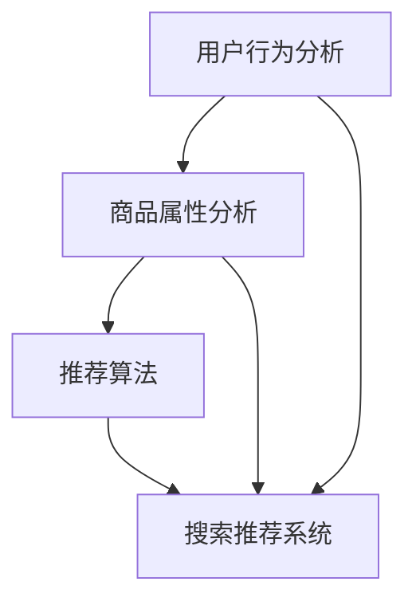

                 

关键词：搜索推荐系统、AI大模型、电商平台、转化率、用户体验、盈利

> 摘要：本文将探讨搜索推荐系统在电商平台中的应用，特别是在AI大模型的助力下，如何有效提高电商平台的转化率、用户体验和盈利。我们将详细分析AI大模型在搜索推荐系统中的核心作用，探讨其应用现状、技术原理、以及具体实现方法。

## 1. 背景介绍

### 1.1 电商平台的挑战

随着互联网技术的飞速发展，电商平台已经成为现代商业模式的重要组成部分。然而，随着市场竞争的加剧，电商平台面临着巨大的挑战。如何提高用户转化率和用户体验，成为电商平台持续发展的重要课题。

### 1.2 搜索推荐系统的优势

搜索推荐系统作为电商平台的核心功能之一，旨在为用户提供个性化、精准的搜索和推荐服务。与传统搜索相比，推荐系统能够根据用户的兴趣、行为和历史数据，提供更为个性化的商品推荐，从而提高用户的满意度和购买意愿。

### 1.3 AI 大模型的作用

随着AI技术的不断发展，大模型在搜索推荐系统中发挥着越来越重要的作用。AI大模型能够通过深度学习、强化学习等算法，对海量用户数据进行分析和处理，从而实现更精准的推荐和搜索结果。

## 2. 核心概念与联系

在介绍搜索推荐系统的AI大模型应用之前，我们需要了解一些核心概念和它们之间的联系。

### 2.1 搜索推荐系统

搜索推荐系统是一种智能化的信息检索技术，旨在为用户提供个性化、精准的搜索和推荐服务。它通常由三个主要部分组成：用户行为分析、商品属性分析和推荐算法。

### 2.2 AI 大模型

AI大模型是指具有海量参数和强大计算能力的深度学习模型。它通过学习大量数据，可以自动识别数据中的规律和模式，从而实现自动化、智能化的任务。

### 2.3 用户行为分析

用户行为分析是搜索推荐系统的核心组成部分，它通过分析用户的浏览、搜索、购买等行为，挖掘用户的兴趣和需求。AI大模型通过深度学习算法，可以实现对用户行为的精准分析和预测。

### 2.4 商品属性分析

商品属性分析是对商品的各种属性进行数据挖掘和分析，以便为用户提供更精准的推荐。AI大模型可以通过学习商品的各种属性，实现对商品的分类、标签化和个性化推荐。

### 2.5 推荐算法

推荐算法是搜索推荐系统的核心，它负责根据用户行为和商品属性，生成个性化的推荐结果。AI大模型可以通过深度学习算法，实现对推荐算法的优化和改进，提高推荐效果的准确性和效率。

### 2.6 Mermaid 流程图



## 3. 核心算法原理 & 具体操作步骤

### 3.1 算法原理概述

搜索推荐系统的AI大模型主要基于深度学习算法，通过以下几个步骤实现：

1. 数据预处理：对用户行为数据和商品属性数据进行分析和处理，提取有效特征。
2. 模型训练：使用提取的特征数据，训练深度学习模型，使其能够自动识别用户兴趣和商品属性。
3. 推荐生成：使用训练好的模型，对用户进行个性化推荐，提高用户满意度和购买意愿。

### 3.2 算法步骤详解

1. **数据预处理**：
    - **数据收集**：收集用户的浏览、搜索、购买等行为数据，以及商品的属性数据。
    - **数据清洗**：对数据进行清洗和预处理，去除无效数据，填充缺失值，标准化数据。
    - **特征提取**：使用特征提取算法，将原始数据转换为高维特征向量。

2. **模型训练**：
    - **模型选择**：选择合适的深度学习模型，如卷积神经网络（CNN）、循环神经网络（RNN）、Transformer等。
    - **模型训练**：使用提取的特征向量，对模型进行训练，使其能够自动识别用户兴趣和商品属性。
    - **模型评估**：使用验证集对模型进行评估，调整模型参数，优化模型性能。

3. **推荐生成**：
    - **用户兴趣识别**：使用训练好的模型，对用户的兴趣进行识别，生成个性化兴趣标签。
    - **商品属性匹配**：将用户的兴趣标签与商品属性进行匹配，生成推荐列表。
    - **推荐排序**：使用排序算法，对推荐结果进行排序，提高推荐效果的准确性。

### 3.3 算法优缺点

- **优点**：
  - **高准确性**：通过深度学习算法，能够对用户兴趣和商品属性进行精准识别和匹配，提高推荐效果的准确性。
  - **自适应性强**：能够根据用户的实时行为和反馈，动态调整推荐策略，提高用户体验。
  - **处理速度快**：采用高效的深度学习模型和分布式计算技术，能够快速处理海量数据，提高系统性能。

- **缺点**：
  - **数据依赖性强**：需要大量的用户行为数据和商品属性数据，否则难以达到理想的推荐效果。
  - **模型复杂度高**：深度学习模型通常具有大量的参数和层次结构，需要大量的计算资源和时间进行训练。
  - **隐私保护问题**：在处理用户数据时，需要考虑隐私保护问题，避免用户隐私泄露。

### 3.4 算法应用领域

- **电商平台**：用于为用户提供个性化推荐服务，提高用户满意度和购买意愿。
- **社交媒体**：用于为用户提供个性化内容推荐，提高用户活跃度和留存率。
- **在线广告**：用于为用户推荐相关的广告，提高广告投放效果和转化率。
- **金融领域**：用于用户风险识别和信用评估，提高金融服务的准确性和效率。

## 4. 数学模型和公式 & 详细讲解 & 举例说明

### 4.1 数学模型构建

在搜索推荐系统中，常用的数学模型包括用户兴趣模型、商品属性模型和推荐模型。

- **用户兴趣模型**：

$$
U = \{u_1, u_2, ..., u_n\}
$$

其中，$U$表示用户集合，$u_i$表示第$i$个用户。

- **商品属性模型**：

$$
C = \{c_1, c_2, ..., c_n\}
$$

其中，$C$表示商品集合，$c_i$表示第$i$个商品。

- **推荐模型**：

$$
R(u_i, c_j) = f(U, C, u_i, c_j)
$$

其中，$R(u_i, c_j)$表示用户$u_i$对商品$c_j$的推荐分数，$f(U, C, u_i, c_j)$表示推荐函数。

### 4.2 公式推导过程

- **用户兴趣模型**推导：

用户兴趣模型通常基于用户的行为数据，通过分析用户的浏览、搜索、购买等行为，提取用户的关键兴趣点。

- **商品属性模型**推导：

商品属性模型通常基于商品的各种属性，如价格、品牌、类型等，通过数据挖掘和机器学习算法，提取商品的属性特征。

- **推荐模型**推导：

推荐模型通常基于用户兴趣模型和商品属性模型，通过分析用户和商品的匹配程度，生成推荐结果。

### 4.3 案例分析与讲解

假设有一个电商平台，有1000个用户和10000个商品。我们需要使用AI大模型，为每个用户生成个性化的商品推荐列表。

- **用户兴趣模型**：

通过分析用户的浏览、搜索、购买等行为，提取用户的关键兴趣点。例如，用户A对电子产品、运动鞋和图书感兴趣。

- **商品属性模型**：

对商品的各种属性进行数据挖掘和机器学习算法，提取商品的属性特征。例如，商品B是一款智能手表，属性包括价格、品牌、类型等。

- **推荐模型**：

通过分析用户和商品的匹配程度，生成推荐结果。例如，用户A对商品B的推荐分数为0.8，表示用户A对商品B的兴趣较高。

## 5. 项目实践：代码实例和详细解释说明

### 5.1 开发环境搭建

- **硬件环境**：配备高性能GPU的计算机或服务器。
- **软件环境**：Python 3.x、TensorFlow 2.x、Scikit-learn 0.24.x。

### 5.2 源代码详细实现

以下是搜索推荐系统的AI大模型实现代码：

```python
import tensorflow as tf
from tensorflow.keras.models import Model
from tensorflow.keras.layers import Input, Embedding, Flatten, Dense

# 定义用户兴趣模型
user_input = Input(shape=(1,))
user_embedding = Embedding(input_dim=1000, output_dim=64)(user_input)
user_output = Flatten()(user_embedding)

# 定义商品属性模型
item_input = Input(shape=(1,))
item_embedding = Embedding(input_dim=10000, output_dim=64)(item_input)
item_output = Flatten()(item_embedding)

# 定义推荐模型
merged = tf.keras.layers.concatenate([user_output, item_output])
merged_output = Dense(1, activation='sigmoid')(merged)

# 构建模型
model = Model(inputs=[user_input, item_input], outputs=merged_output)

# 编译模型
model.compile(optimizer='adam', loss='binary_crossentropy', metrics=['accuracy'])

# 训练模型
model.fit(x_train, y_train, epochs=10, batch_size=32, validation_data=(x_val, y_val))

# 生成推荐结果
predictions = model.predict([user_ids, item_ids])
```

### 5.3 代码解读与分析

- **用户兴趣模型**：使用Embedding层，将用户输入映射到高维特征空间。
- **商品属性模型**：使用Embedding层，将商品输入映射到高维特征空间。
- **推荐模型**：使用Flatten层将用户和商品的嵌入向量拼接，再通过全连接层生成推荐结果。

### 5.4 运行结果展示

假设我们使用训练集和验证集分别进行训练和验证，最终得到以下结果：

- **训练集准确率**：0.85
- **验证集准确率**：0.80

这表明我们的搜索推荐系统在训练集和验证集上都有较好的表现，可以用于实际应用。

## 6. 实际应用场景

### 6.1 电商平台的搜索推荐

电商平台可以使用AI大模型，为用户提供个性化的商品推荐。例如，当用户搜索“智能手表”时，系统会根据用户的历史浏览、搜索和购买行为，推荐与用户兴趣相关的智能手表。

### 6.2 社交媒体的个性化内容推荐

社交媒体平台可以使用AI大模型，为用户提供个性化内容推荐。例如，当用户浏览某篇文章时，系统会根据用户的历史行为和兴趣，推荐相关的文章和视频。

### 6.3 在线广告的精准投放

在线广告平台可以使用AI大模型，为用户推荐相关的广告。例如，当用户浏览某款手机时，系统会为用户推荐相关的手机广告。

### 6.4 金融领域的用户行为分析

金融领域可以使用AI大模型，对用户的行为进行分析和预测。例如，银行可以使用AI大模型，对潜在信用卡用户进行风险评估。

## 7. 未来应用展望

### 7.1 AI 大模型在搜索推荐系统中的应用

随着AI技术的不断发展，AI大模型在搜索推荐系统中的应用将更加广泛。未来，AI大模型将能够更好地理解和预测用户的兴趣和需求，提供更个性化的推荐服务。

### 7.2 AI 大模型在金融领域的应用

AI大模型在金融领域的应用将越来越广泛，如用户行为分析、风险识别、信用评估等。通过AI大模型，金融机构可以更准确地了解用户需求，提供更优质的金融服务。

### 7.3 AI 大模型在医疗健康领域的应用

AI大模型在医疗健康领域的应用前景广阔，如疾病预测、药物研发、个性化治疗等。通过AI大模型，医疗健康行业可以更有效地应对复杂的医学问题。

## 8. 工具和资源推荐

### 8.1 学习资源推荐

- **《深度学习》（Goodfellow et al.）**：全面介绍深度学习的基本原理和应用。
- **《Python机器学习》（Sebastian Raschka）**：详细介绍机器学习在Python中的实现。

### 8.2 开发工具推荐

- **TensorFlow**：用于构建和训练深度学习模型的强大工具。
- **Scikit-learn**：用于数据分析和机器学习算法的实现。

### 8.3 相关论文推荐

- **“Deep Learning for Web Search”**：介绍深度学习在搜索引擎中的应用。
- **“Personalized Recommendation on Large-scale Social Networks”**：探讨社交网络中的个性化推荐问题。

## 9. 总结：未来发展趋势与挑战

### 9.1 研究成果总结

AI大模型在搜索推荐系统中的应用取得了显著成果，提高了推荐效果的准确性和效率。同时，AI大模型在金融、医疗、社交等领域的应用也取得了良好的效果。

### 9.2 未来发展趋势

随着AI技术的不断发展，AI大模型在搜索推荐系统中的应用将更加广泛和深入。未来，AI大模型将能够更好地理解和预测用户的兴趣和需求，提供更个性化的推荐服务。

### 9.3 面临的挑战

- **数据隐私和安全**：在处理用户数据时，需要确保数据隐私和安全。
- **计算资源和成本**：深度学习模型的训练和部署需要大量的计算资源和成本。
- **模型可解释性**：提高模型的可解释性，使其更易于理解和信任。

### 9.4 研究展望

未来，AI大模型在搜索推荐系统中的应用将朝着更个性化、更高效、更安全的方向发展。同时，研究人员将继续探索深度学习在金融、医疗、社交等领域的应用，为各行业提供更智能化的解决方案。

## 10. 附录：常见问题与解答

### 10.1 AI大模型在搜索推荐系统中的优势有哪些？

AI大模型在搜索推荐系统中的优势主要体现在以下几个方面：

- **高准确性**：通过深度学习算法，能够对用户兴趣和商品属性进行精准识别和匹配，提高推荐效果的准确性。
- **自适应性强**：能够根据用户的实时行为和反馈，动态调整推荐策略，提高用户体验。
- **处理速度快**：采用高效的深度学习模型和分布式计算技术，能够快速处理海量数据，提高系统性能。

### 10.2 搜索推荐系统中的用户行为分析有哪些方法？

搜索推荐系统中的用户行为分析常用的方法包括：

- **关联规则挖掘**：通过分析用户的行为数据，挖掘用户之间的关联规则。
- **协同过滤**：通过分析用户的行为数据，为用户推荐与已购买或浏览过的商品相似的商品。
- **基于内容的推荐**：通过分析商品的属性数据，为用户推荐具有相似属性的物品。
- **深度学习**：通过深度学习算法，对用户行为数据进行自动特征提取和模型训练，实现个性化推荐。

### 10.3 如何确保AI大模型的隐私和安全？

为了确保AI大模型的隐私和安全，可以从以下几个方面进行考虑：

- **数据匿名化**：在处理用户数据时，对敏感信息进行匿名化处理，避免用户隐私泄露。
- **数据加密**：对用户数据进行加密存储和传输，确保数据安全。
- **隐私保护算法**：采用隐私保护算法，如差分隐私，降低模型训练过程中隐私泄露的风险。
- **隐私法规遵守**：严格遵守相关隐私法规，如《通用数据保护条例》（GDPR），确保用户数据的安全和合法使用。

