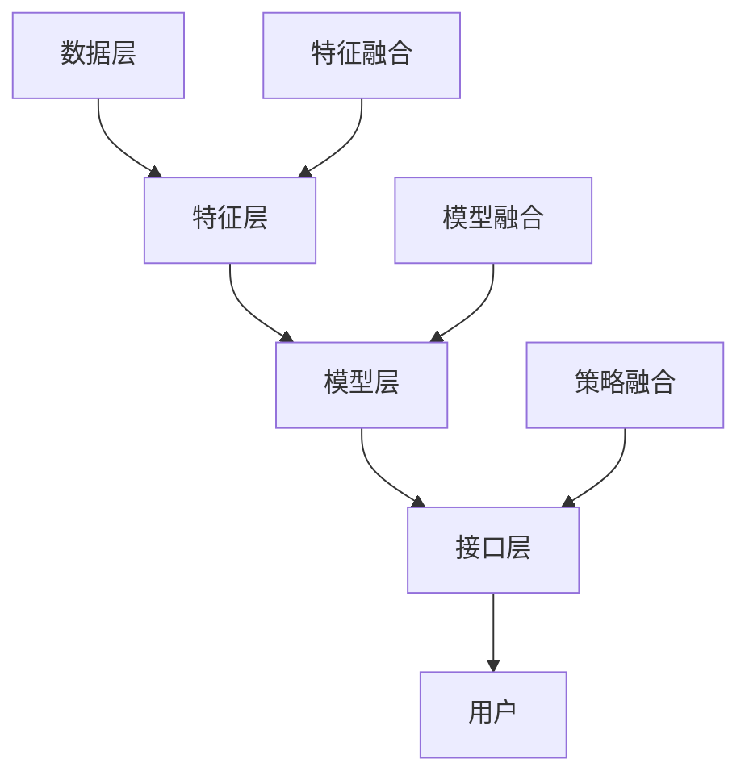

                 

关键词：搜索推荐系统，AI大模型，融合技术，电商平台，竞争优势

> 摘要：本文旨在探讨AI大模型在搜索推荐系统中的应用，以及其如何成为电商平台的核心竞争优势。通过深入分析AI大模型融合技术的原理、算法、数学模型，以及实际应用案例，本文展示了如何构建高效的搜索推荐系统，并探讨了其未来的发展方向与挑战。

## 1. 背景介绍

随着互联网技术的迅猛发展，电商平台已经成为现代商业中不可或缺的一部分。消费者在浏览和购物时，往往面临信息过载和选择困难的问题。因此，如何为用户精准推荐他们可能感兴趣的商品，成为了电商平台提升用户体验和转化率的关键。搜索推荐系统作为一种智能化的信息过滤和排序工具，应运而生。

近年来，人工智能（AI）技术的飞速发展，尤其是深度学习和自然语言处理（NLP）技术的突破，为搜索推荐系统带来了全新的机遇。AI大模型，如Transformer、BERT等，以其强大的表征能力和学习能力，成为构建高效搜索推荐系统的核心技术。

本文将围绕AI大模型在搜索推荐系统中的应用，探讨其核心原理、技术架构、算法实现、数学模型，并通过实际应用案例，分析其在电商平台中的竞争优势。

## 2. 核心概念与联系

### 2.1 AI大模型概述

AI大模型，即大型人工智能神经网络模型，其具有以下几个核心特点：

1. **大规模参数**：大模型通常包含数亿甚至千亿级的参数，能够捕捉到大量复杂的特征和模式。
2. **深度网络结构**：大模型具有多层的神经网络结构，能够通过层层抽象，提取高层次的语义信息。
3. **端到端学习**：大模型能够直接从原始数据中学习，无需人工干预，实现数据的自动化处理。

### 2.2 搜索推荐系统架构

搜索推荐系统的架构通常包括以下几个关键组成部分：

1. **数据层**：负责收集和存储用户行为数据、商品信息等。
2. **特征层**：通过对原始数据进行处理和转换，提取出对推荐算法有用的特征。
3. **模型层**：包含各种推荐算法和模型，如基于协同过滤、基于内容的推荐等。
4. **接口层**：提供用户与系统交互的接口，实现搜索和推荐功能。

### 2.3 融合技术原理

融合技术在搜索推荐系统中起着至关重要的作用。其核心思想是将多种不同的模型和算法进行整合，以实现更好的推荐效果。具体包括以下几种技术：

1. **模型融合**：将不同的推荐模型进行组合，如将基于内容的推荐和基于协同过滤的推荐相结合。
2. **特征融合**：将来自不同数据源的多个特征进行合并，以提升模型的表征能力。
3. **策略融合**：结合多种策略，如实时推荐、历史推荐等，以满足用户的不同需求。

### 2.4 Mermaid 流程图

以下是一个简化的Mermaid流程图，展示了搜索推荐系统的基本架构和融合技术的应用：



## 3. 核心算法原理 & 具体操作步骤

### 3.1 算法原理概述

搜索推荐系统的核心在于如何从海量的用户行为数据和商品信息中，提取出对用户有用的特征，并通过算法生成精准的推荐结果。AI大模型在这一过程中发挥着关键作用。

### 3.2 算法步骤详解

1. **数据预处理**：对原始数据进行清洗、去噪、归一化等操作，以确保数据的质量。
2. **特征提取**：利用深度学习模型，如BERT、Transformer等，对用户行为数据和商品信息进行特征提取。
3. **模型训练**：通过训练大模型，学习用户行为和商品特征的内在关系。
4. **推荐生成**：利用训练好的模型，对用户的兴趣进行预测，生成推荐结果。
5. **结果优化**：通过实时反馈和用户交互，不断优化推荐结果，提高用户体验。

### 3.3 算法优缺点

1. **优点**：
   - **强大的表征能力**：AI大模型能够提取到高层次的语义信息，提高推荐精度。
   - **端到端学习**：大模型能够直接从原始数据中学习，无需人工特征工程，降低开发成本。
   - **自适应性强**：大模型能够实时适应用户行为的变化，提供个性化的推荐。

2. **缺点**：
   - **计算资源需求大**：大模型训练和推理需要大量的计算资源。
   - **数据依赖性强**：大模型的性能很大程度上依赖于数据的质量和数量。
   - **解释性差**：大模型内部的黑盒性质，使得其难以解释和理解。

### 3.4 算法应用领域

AI大模型在搜索推荐系统中的应用范围广泛，包括但不限于以下领域：

- **电子商务**：为电商平台提供精准的商品推荐，提高用户转化率和购买意愿。
- **社交媒体**：为用户提供个性化内容推荐，增强用户粘性和活跃度。
- **在线教育**：根据用户的学习行为，推荐适合的学习资源和课程。

## 4. 数学模型和公式 & 详细讲解 & 举例说明

### 4.1 数学模型构建

在搜索推荐系统中，常用的数学模型包括：

1. **线性回归模型**：
   $$y = \beta_0 + \beta_1x_1 + \beta_2x_2 + ... + \beta_nx_n$$
   
2. **逻辑回归模型**：
   $$P(y=1) = \frac{1}{1 + e^{-(\beta_0 + \beta_1x_1 + \beta_2x_2 + ... + \beta_nx_n)}}$$

3. **支持向量机（SVM）**：
   $$y = \text{sign}(\sum_{i=1}^{n}\alpha_iy_i\phi(x_i) + b)$$

### 4.2 公式推导过程

以线性回归模型为例，其推导过程如下：

1. **目标函数**：
   $$J(\theta) = \frac{1}{2m}\sum_{i=1}^{m}(h_\theta(x^{(i)}) - y^{(i)})^2$$

2. **梯度下降**：
   $$\theta_j := \theta_j - \alpha \frac{1}{m}\sum_{i=1}^{m}(h_\theta(x^{(i)}) - y^{(i)})x_j^{(i)}$$

### 4.3 案例分析与讲解

以下是一个简单的线性回归模型案例：

**目标**：预测用户对商品的评分。

**数据集**：包含用户ID、商品ID、用户评分。

**模型**：线性回归模型。

**代码实现**：

```python
import numpy as np
import pandas as pd

# 数据预处理
X = df[['user_id', 'item_id']]
y = df['rating']

# 特征提取
from sklearn.preprocessing import OneHotEncoder
encoder = OneHotEncoder()
X_encoded = encoder.fit_transform(X)

# 模型训练
from sklearn.linear_model import LinearRegression
model = LinearRegression()
model.fit(X_encoded, y)

# 预测
predictions = model.predict(X_encoded)
```

## 5. 项目实践：代码实例和详细解释说明

### 5.1 开发环境搭建

1. **安装Python环境**：在本地或服务器上安装Python 3.8及以上版本。
2. **安装依赖库**：安装NumPy、Pandas、scikit-learn等常用库。

### 5.2 源代码详细实现

以下是一个简单的搜索推荐系统实现：

```python
import numpy as np
import pandas as pd
from sklearn.preprocessing import OneHotEncoder
from sklearn.linear_model import LinearRegression

# 数据预处理
def preprocess_data(df):
    X = df[['user_id', 'item_id']]
    y = df['rating']
    encoder = OneHotEncoder()
    X_encoded = encoder.fit_transform(X)
    return X_encoded, y

# 模型训练
def train_model(X_encoded, y):
    model = LinearRegression()
    model.fit(X_encoded, y)
    return model

# 预测
def predict_rating(model, X_encoded):
    predictions = model.predict(X_encoded)
    return predictions

# 主函数
def main():
    df = pd.read_csv('data.csv')
    X_encoded, y = preprocess_data(df)
    model = train_model(X_encoded, y)
    predictions = predict_rating(model, X_encoded)
    print(predictions)

if __name__ == '__main__':
    main()
```

### 5.3 代码解读与分析

- **数据预处理**：首先，我们从CSV文件中读取数据，并对用户ID和商品ID进行独热编码，以生成输入特征。
- **模型训练**：使用线性回归模型对数据进行训练，学习用户评分与特征之间的线性关系。
- **预测**：通过训练好的模型，对输入特征进行预测，得到用户对商品的评分预测结果。

### 5.4 运行结果展示

运行上述代码后，将在控制台输出用户对商品的评分预测结果。通过对比实际评分与预测评分，可以评估模型的准确性。

## 6. 实际应用场景

### 6.1 电商平台

电商平台是搜索推荐系统最典型的应用场景之一。通过AI大模型，电商平台可以实时推荐用户可能感兴趣的商品，提高用户转化率和购买意愿。例如，Amazon和淘宝等平台，都采用了基于AI的大规模推荐系统，为用户提供个性化的购物体验。

### 6.2 社交媒体

社交媒体平台，如Facebook和Instagram等，通过AI大模型为用户提供个性化内容推荐，增强用户粘性和活跃度。例如，Facebook的Feed排名算法，就采用了基于Transformer的大模型，为用户推荐感兴趣的朋友动态和内容。

### 6.3 在线教育

在线教育平台，如Coursera和Udemy等，通过AI大模型为用户推荐适合的学习资源和课程，提高学习效果和用户满意度。例如，Coursera的推荐系统，就采用了基于BERT的大模型，为用户推荐感兴趣的课程。

## 7. 工具和资源推荐

### 7.1 学习资源推荐

1. **书籍**：
   - 《深度学习》（Ian Goodfellow、Yoshua Bengio、Aaron Courville 著）
   - 《Python数据科学 Handbook》（Jake VanderPlas 著）
   - 《搜索推荐系统实践》（陈斌 著）

2. **在线课程**：
   - Coursera上的“深度学习”课程
   - edX上的“Python数据分析”课程
   - Udacity的“机器学习工程师纳米学位”

### 7.2 开发工具推荐

1. **编程环境**：Jupyter Notebook、VS Code等。
2. **数据预处理**：Pandas、NumPy等。
3. **机器学习库**：scikit-learn、TensorFlow、PyTorch等。

### 7.3 相关论文推荐

1. “Attention Is All You Need”（Vaswani et al., 2017）
2. “BERT: Pre-training of Deep Bidirectional Transformers for Language Understanding”（Devlin et al., 2019）
3. “Recommender Systems Handbook”（Tang et al., 2018）

## 8. 总结：未来发展趋势与挑战

### 8.1 研究成果总结

本文系统地介绍了AI大模型在搜索推荐系统中的应用，包括其核心原理、算法实现、数学模型以及实际应用场景。通过分析，我们发现AI大模型在提高推荐精度、自适应性和用户体验方面具有显著优势。

### 8.2 未来发展趋势

1. **模型压缩与优化**：为了降低大模型的计算成本，未来的研究将重点关注模型压缩、优化和高效推理技术。
2. **多模态推荐**：随着物联网、图像和语音等技术的发展，多模态推荐将成为一个重要的研究方向。
3. **联邦学习**：联邦学习能够保护用户隐私，未来的搜索推荐系统将更多地采用联邦学习方法。

### 8.3 面临的挑战

1. **数据质量**：高质量的数据是AI大模型训练的前提，未来的研究需要关注数据清洗、去噪等技术。
2. **计算资源**：大模型的训练和推理需要大量计算资源，如何高效利用计算资源是一个重要挑战。
3. **模型解释性**：大模型的黑盒性质使得其难以解释和理解，未来的研究需要关注模型的可解释性。

### 8.4 研究展望

随着AI技术的不断发展，搜索推荐系统将迎来更多的创新和发展。我们期待未来的研究能够解决上述挑战，实现更高效、更智能、更可解释的搜索推荐系统，为电商、社交媒体、在线教育等领域带来更大的价值。

## 9. 附录：常见问题与解答

### 9.1 什么是AI大模型？

AI大模型是指具有大规模参数和深度网络结构的人工神经网络模型，如Transformer、BERT等，它们能够捕捉到大量的复杂特征和模式。

### 9.2 搜索推荐系统的核心组件有哪些？

搜索推荐系统的核心组件包括数据层、特征层、模型层和接口层。

### 9.3 如何优化搜索推荐系统的性能？

可以通过以下方法优化搜索推荐系统的性能：
- 提高数据质量；
- 采用先进的特征提取和推荐算法；
- 实现高效的模型训练和推理；
- 结合多种推荐策略，实现个性化推荐。

---

感谢您阅读本文，希望本文能帮助您更好地理解AI大模型在搜索推荐系统中的应用，以及其在电商平台等领域的核心竞争优势。如果您有任何疑问或建议，欢迎在评论区留言，我会尽快为您解答。

### 作者署名

作者：禅与计算机程序设计艺术 / Zen and the Art of Computer Programming
----------------------------------------------------------------


