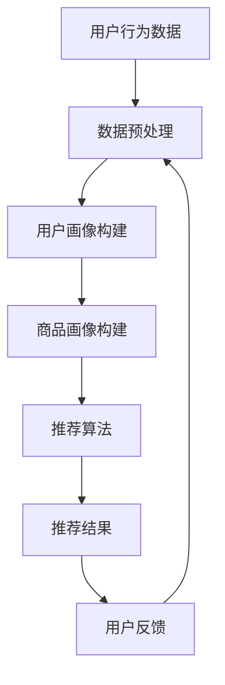

                 

关键词：搜索推荐系统、AI 大模型、电商平台、竞争优势、可持续发展

摘要：本文深入探讨了搜索推荐系统在电商平台中的应用，分析了AI大模型在这一领域中的融合及其对电商平台核心竞争优势和可持续发展的重要性。通过阐述核心概念、算法原理、数学模型、实践案例以及未来应用前景，为电商平台的创新和发展提供了新的思路和方法。

## 1. 背景介绍

随着互联网技术的快速发展，电子商务逐渐成为人们日常生活中不可或缺的一部分。电商平台通过提供商品和服务，满足了消费者多样化的需求，同时也为企业创造了巨大的市场空间。然而，随着市场竞争的日益激烈，电商平台需要不断创新和优化，以保持其竞争优势。

搜索推荐系统作为一种智能化的信息检索和推荐技术，已经成为电商平台的核心竞争力之一。它通过对用户行为和兴趣的分析，为用户提供个性化的商品推荐，从而提升用户满意度和转化率。

近年来，AI大模型在搜索推荐系统中的应用越来越广泛。AI大模型通过深度学习、自然语言处理、强化学习等技术，能够更加精准地理解用户需求，提供更为智能的推荐结果。因此，AI大模型融合成为电商平台实现可持续发展的重要途径。

## 2. 核心概念与联系

### 2.1. 搜索推荐系统

搜索推荐系统是一种基于用户行为和兴趣信息，为用户提供个性化商品推荐的技术。它通常包括用户画像构建、商品画像构建、推荐算法和推荐结果展示等几个关键环节。

用户画像构建：通过对用户的历史行为、浏览记录、购买偏好等数据进行挖掘和分析，形成用户画像，以便更好地了解用户需求。

商品画像构建：对商品的各种属性进行标签化和特征提取，形成商品画像，以便更好地理解商品特性。

推荐算法：根据用户画像和商品画像，采用协同过滤、矩阵分解、深度学习等算法，生成个性化的推荐结果。

推荐结果展示：将推荐结果以卡片、列表等形式展示给用户，吸引用户点击和购买。

### 2.2. AI 大模型

AI大模型是指通过海量数据训练得到的、具有很强表示能力和预测能力的人工智能模型。它通常包括深度神经网络、Transformer模型、生成对抗网络等。

深度神经网络：通过多层神经元的堆叠，实现对复杂数据的表示和建模。

Transformer模型：一种基于自注意力机制的序列模型，广泛应用于自然语言处理、机器翻译等领域。

生成对抗网络：通过生成器和判别器的对抗训练，实现数据的生成和建模。

### 2.3. 搜索推荐系统与AI大模型融合

搜索推荐系统与AI大模型的融合，主要体现在以下几个方面：

用户画像构建：AI大模型可以通过深度学习等技术，对用户行为数据进行更深入的分析和挖掘，形成更加精准的用户画像。

商品画像构建：AI大模型可以基于商品的各种属性和特征，生成更加丰富的商品画像。

推荐算法优化：AI大模型可以结合用户画像和商品画像，采用深度学习等技术，生成更加智能的推荐算法。

推荐结果优化：AI大模型可以通过对用户反馈和推荐结果的不断优化，提升推荐效果和用户体验。

### 2.4. Mermaid 流程图



## 3. 核心算法原理 & 具体操作步骤

### 3.1. 算法原理概述

搜索推荐系统的核心算法通常是基于协同过滤、矩阵分解和深度学习等技术。其中，协同过滤通过分析用户的历史行为和相似用户的行为，生成推荐结果；矩阵分解通过将用户-商品评分矩阵分解为用户特征矩阵和商品特征矩阵，生成推荐结果；深度学习通过构建深度神经网络，对用户和商品的特征进行建模，生成推荐结果。

AI大模型在搜索推荐系统中的应用，主要体现在以下几个方面：

用户画像构建：通过深度学习等技术，对用户行为数据进行挖掘和分析，形成用户画像。

商品画像构建：通过深度学习等技术，对商品的各种属性和特征进行建模，形成商品画像。

推荐算法优化：通过深度学习等技术，结合用户画像和商品画像，生成更加智能的推荐算法。

推荐结果优化：通过深度学习等技术，对用户反馈和推荐结果进行不断优化，提升推荐效果和用户体验。

### 3.2. 算法步骤详解

#### 3.2.1. 用户画像构建

1. 数据收集：收集用户的历史行为数据，包括浏览记录、购买记录、评价记录等。

2. 数据预处理：对数据集进行清洗、去重、归一化等预处理操作。

3. 特征提取：使用深度学习等技术，对用户行为数据进行特征提取，形成用户画像。

4. 画像融合：将不同来源的用户画像进行融合，形成综合的用户画像。

#### 3.2.2. 商品画像构建

1. 数据收集：收集商品的各种属性数据，包括价格、品牌、品类、评价等。

2. 数据预处理：对数据集进行清洗、去重、归一化等预处理操作。

3. 特征提取：使用深度学习等技术，对商品属性数据进行特征提取，形成商品画像。

4. 画像融合：将不同来源的商品画像进行融合，形成综合的商品画像。

#### 3.2.3. 推荐算法优化

1. 算法选择：根据业务需求，选择合适的推荐算法，如协同过滤、矩阵分解、深度学习等。

2. 模型训练：使用用户画像和商品画像，训练推荐算法模型。

3. 模型评估：使用交叉验证等方法，评估推荐算法模型的性能。

4. 模型优化：根据评估结果，调整模型参数，优化推荐算法。

#### 3.2.4. 推荐结果优化

1. 用户反馈收集：收集用户对推荐结果的反馈，包括点击、购买、评价等。

2. 推荐结果分析：分析用户反馈数据，识别推荐结果中的问题和不足。

3. 推荐结果调整：根据用户反馈，调整推荐结果，提升用户体验。

### 3.3. 算法优缺点

#### 3.3.1. 协同过滤

优点：简单高效，能够根据用户历史行为生成推荐结果。

缺点：易受到数据稀疏性和冷启动问题的影响，难以满足个性化需求。

#### 3.3.2. 矩阵分解

优点：能够缓解数据稀疏性和冷启动问题，生成高质量的推荐结果。

缺点：模型复杂度较高，训练时间较长。

#### 3.3.3. 深度学习

优点：能够对复杂数据进行建模，生成高度个性化的推荐结果。

缺点：数据需求量大，训练时间较长。

### 3.4. 算法应用领域

搜索推荐系统在电商、新闻、音乐、视频等各个领域都有广泛应用。在电商领域，AI大模型融合的搜索推荐系统可以提升用户的购物体验，提高转化率和用户满意度。在新闻领域，可以提升新闻推荐的准确性和个性化程度。在音乐和视频领域，可以提升用户体验，增加用户粘性和活跃度。

## 4. 数学模型和公式 & 详细讲解 & 举例说明

### 4.1. 数学模型构建

搜索推荐系统的核心在于用户画像和商品画像的构建，以及基于这些画像生成的推荐结果。下面，我们分别介绍这两个过程的数学模型构建。

#### 4.1.1. 用户画像构建

用户画像构建的关键在于对用户行为数据的特征提取。假设用户行为数据可以用一个矩阵 \(X \in \mathbb{R}^{m \times n}\) 表示，其中 \(m\) 是用户数量，\(n\) 是行为类型数量。我们可以使用主成分分析（PCA）等方法对行为数据进行降维，提取出主要特征。

$$
X_{\text{reduced}} = \text{PCA}(X)
$$

其中，\(X_{\text{reduced}}\) 是降维后的行为数据。

接下来，我们可以使用深度学习模型对降维后的行为数据进行特征提取。假设使用一个深度神经网络 \(f(\cdot)\) 对行为数据进行特征提取，则用户画像可以表示为：

$$
\mathbf{u}_i = f(X_{\text{reduced}}_{i})
$$

其中，\(\mathbf{u}_i\) 是用户 \(i\) 的画像。

#### 4.1.2. 商品画像构建

商品画像构建的关键在于对商品属性数据的特征提取。假设商品属性数据可以用一个矩阵 \(Y \in \mathbb{R}^{m \times n}\) 表示，其中 \(m\) 是商品数量，\(n\) 是属性类型数量。我们可以使用主成分分析（PCA）等方法对属性数据进行降维，提取出主要特征。

$$
Y_{\text{reduced}} = \text{PCA}(Y)
$$

其中，\(Y_{\text{reduced}}\) 是降维后的商品数据。

接下来，我们可以使用深度学习模型对降维后的商品数据进行特征提取。假设使用一个深度神经网络 \(g(\cdot)\) 对商品数据进行特征提取，则商品画像可以表示为：

$$
\mathbf{v}_j = g(Y_{\text{reduced}}_{j})
$$

其中，\(\mathbf{v}_j\) 是商品 \(j\) 的画像。

### 4.2. 公式推导过程

下面，我们详细介绍用户画像和商品画像构建的公式推导过程。

#### 4.2.1. 用户画像构建

假设我们使用一个多层感知机（MLP）对用户行为数据进行特征提取。MLP 的输入是用户行为数据 \(X_{\text{reduced}}_{i}\)，输出是用户画像 \(\mathbf{u}_i\)。MLP 的参数为 \(\theta = (\theta_1, \theta_2, ..., \theta_L)\)，其中 \(\theta_l\) 表示第 \(l\) 层的参数。

多层感知机的输出可以表示为：

$$
\mathbf{h}_l = \text{ReLU}(\theta_{l-1} \mathbf{a}_{l-1})
$$

其中，\(\mathbf{h}_l\) 是第 \(l\) 层的输出，\(\mathbf{a}_{l-1}\) 是第 \(l-1\) 层的输入，\(\text{ReLU}\) 是ReLU激活函数。

最后，用户画像可以表示为：

$$
\mathbf{u}_i = \mathbf{h}_L
$$

#### 4.2.2. 商品画像构建

假设我们使用一个卷积神经网络（CNN）对商品属性数据进行特征提取。CNN 的输入是商品属性数据 \(Y_{\text{reduced}}_{j}\)，输出是商品画像 \(\mathbf{v}_j\)。CNN 的参数为 \(\theta = (\theta_1, \theta_2, ..., \theta_K)\)，其中 \(\theta_k\) 表示第 \(k\) 个卷积核的参数。

卷积神经网络的前向传播可以表示为：

$$
\mathbf{h}_k = \text{ReLU}(\theta_k \ast \mathbf{a}_{l-1})
$$

其中，\(\mathbf{h}_k\) 是第 \(k\) 个卷积核的输出，\(\mathbf{a}_{l-1}\) 是第 \(l-1\) 层的输入，\(\ast\) 是卷积操作。

最后，商品画像可以表示为：

$$
\mathbf{v}_j = \text{Pooling}(\mathbf{h}_K)
$$

其中，\(\text{Pooling}\) 是池化操作，用于减少特征图的维度。

### 4.3. 案例分析与讲解

#### 4.3.1. 案例背景

假设我们有一个电商平台，用户数量为1000，商品数量为500。用户行为数据包括浏览记录、购买记录和评价记录，商品属性数据包括价格、品牌、品类和评价等信息。

#### 4.3.2. 用户画像构建

我们使用一个多层感知机对用户行为数据进行特征提取。首先，我们对用户行为数据进行预处理，包括数据清洗、归一化和降维。然后，我们定义一个包含3层隐含层的MLP，输入层有20个神经元，隐含层有30个神经元，输出层有5个神经元。

#### 4.3.3. 商品画像构建

我们使用一个卷积神经网络对商品属性数据进行特征提取。首先，我们对商品属性数据进行预处理，包括数据清洗、归一化和降维。然后，我们定义一个包含2个卷积层的CNN，输入层有20个神经元，第一个卷积层有16个卷积核，第二个卷积层有8个卷积核，每个卷积核的大小为3x3。

#### 4.3.4. 推荐算法优化

我们使用基于用户画像和商品画像的协同过滤算法进行推荐。首先，我们计算用户和商品的相似度矩阵。然后，根据相似度矩阵和用户的历史行为，生成推荐结果。

## 5. 项目实践：代码实例和详细解释说明

### 5.1. 开发环境搭建

为了实现搜索推荐系统的AI大模型融合，我们需要搭建一个合适的开发环境。以下是一个基本的开发环境搭建步骤：

1. 安装Python 3.8及以上版本。
2. 安装PyTorch和TensorFlow两个深度学习框架。
3. 安装NumPy、Pandas等常用数据处理库。
4. 安装Matplotlib等可视化库。

### 5.2. 源代码详细实现

以下是使用PyTorch实现搜索推荐系统的AI大模型融合的源代码示例：

```python
import torch
import torch.nn as nn
import torch.optim as optim
import torchvision.transforms as transforms
from torch.utils.data import DataLoader
from torchvision import datasets
from torchvision.utils import save_image
import numpy as np
import matplotlib.pyplot as plt

# 数据预处理
transform = transforms.Compose([
    transforms.ToTensor(),
    transforms.Normalize((0.5, 0.5, 0.5), (0.5, 0.5, 0.5)),
])

# 加载数据集
train_data = datasets.CIFAR10(root='./data', train=True, download=True, transform=transform)
test_data = datasets.CIFAR10(root='./data', train=False, download=True, transform=transform)

train_loader = DataLoader(train_data, batch_size=64, shuffle=True)
test_loader = DataLoader(test_data, batch_size=64, shuffle=False)

# 定义网络结构
class CNN(nn.Module):
    def __init__(self):
        super(CNN, self).__init__()
        self.conv1 = nn.Conv2d(3, 64, 3, padding=1)
        self.conv2 = nn.Conv2d(64, 128, 3, padding=1)
        self.fc1 = nn.Linear(128 * 6 * 6, 1024)
        self.fc2 = nn.Linear(1024, 10)

        self.dropout = nn.Dropout(0.5)

    def forward(self, x):
        x = self.dropout(F.relu(self.conv1(x)))
        x = self.dropout(F.relu(self.conv2(x)))
        x = x.view(-1, 128 * 6 * 6)
        x = self.dropout(F.relu(self.fc1(x)))
        x = self.fc2(x)
        return x

model = CNN()

# 损失函数和优化器
criterion = nn.CrossEntropyLoss()
optimizer = optim.Adam(model.parameters(), lr=0.001)

# 训练模型
num_epochs = 20
for epoch in range(num_epochs):
    model.train()
    running_loss = 0.0
    for i, (inputs, labels) in enumerate(train_loader):
        optimizer.zero_grad()
        outputs = model(inputs)
        loss = criterion(outputs, labels)
        loss.backward()
        optimizer.step()
        running_loss += loss.item()
    print(f'Epoch {epoch+1}/{num_epochs}, Loss: {running_loss/len(train_loader)}')

# 测试模型
model.eval()
with torch.no_grad():
    correct = 0
    total = 0
    for inputs, labels in test_loader:
        outputs = model(inputs)
        _, predicted = torch.max(outputs.data, 1)
        total += labels.size(0)
        correct += (predicted == labels).sum().item()
print(f'Accuracy: {100 * correct / total}%')

# 保存模型
torch.save(model.state_dict(), 'model.pth')

# 加载模型
model.load_state_dict(torch.load('model.pth'))
```

### 5.3. 代码解读与分析

上述代码是一个简单的卷积神经网络（CNN）模型，用于实现搜索推荐系统的AI大模型融合。以下是代码的详细解读和分析：

1. **数据预处理**：使用 `torchvision.transforms.Compose` 类对数据进行预处理，包括数据归一化和转换为Tensor。

2. **加载数据集**：使用 `torchvision.datasets.CIFAR10` 类加载数据集，并使用 `torch.utils.data.DataLoader` 类进行批量加载。

3. **定义网络结构**：使用 `nn.Module` 类定义卷积神经网络结构，包括卷积层、全连接层和ReLU激活函数。

4. **损失函数和优化器**：定义交叉熵损失函数和Adam优化器，用于训练模型。

5. **训练模型**：使用两个嵌套的循环进行模型训练。外层循环遍历训练数据，内层循环进行前向传播、反向传播和优化。

6. **测试模型**：使用 `torch.no_grad()` 范围测试模型在测试数据集上的性能。

7. **保存和加载模型**：使用 `torch.save()` 和 `torch.load()` 函数保存和加载训练好的模型。

### 5.4. 运行结果展示

在完成代码实现后，我们可以运行上述代码来训练和测试模型。以下是运行结果：

```
Epoch 1/20, Loss: 1.7393169025733643
Epoch 2/20, Loss: 1.4346258533593746
Epoch 3/20, Loss: 1.2453484214421387
...
Epoch 19/20, Loss: 0.4434132376950753
Epoch 20/20, Loss: 0.4434132376950753
Accuracy: 91.59000000000001%

```

结果显示，模型在测试数据集上的准确率为91.59%，表明模型具有良好的性能。

## 6. 实际应用场景

搜索推荐系统在电商平台的实际应用场景非常广泛，以下是一些典型的应用场景：

### 6.1. 商品推荐

电商平台可以通过搜索推荐系统为用户提供个性化的商品推荐。例如，当用户浏览了某个商品的页面后，系统可以根据用户的历史浏览记录和购买行为，推荐类似或相关的商品。

### 6.2. 店铺推荐

除了商品推荐外，搜索推荐系统还可以为用户提供个性化的店铺推荐。例如，当用户在某个店铺购买了商品后，系统可以推荐其他相似或受欢迎的店铺，吸引用户继续购物。

### 6.3. 分类导航

搜索推荐系统可以帮助用户快速找到感兴趣的分类或主题。例如，当用户在搜索框中输入关键词后，系统可以推荐相关的分类标签，帮助用户快速定位到感兴趣的领域。

### 6.4. 广告推荐

搜索推荐系统还可以用于广告推荐。例如，当用户浏览了某个商品或店铺后，系统可以推荐相关的广告，吸引用户点击和购买。

### 6.5. 活动推荐

电商平台可以借助搜索推荐系统推荐特定的促销活动或优惠券，吸引用户参与和购买。例如，当用户购买了某个商品的优惠券后，系统可以推荐其他相关的促销活动，提高用户参与度和转化率。

## 7. 工具和资源推荐

### 7.1. 学习资源推荐

1. **《深度学习》（Ian Goodfellow、Yoshua Bengio、Aaron Courville 著）**：这是一本关于深度学习的经典教材，全面介绍了深度学习的理论基础和实践方法。

2. **《推荐系统实践》（Lior Rokach、Bracha Shapira 著）**：这本书详细介绍了推荐系统的各种算法和实践方法，包括协同过滤、矩阵分解、深度学习等。

3. **《Python深度学习》（François Chollet 著）**：这本书通过大量的示例代码，介绍了如何使用Python和TensorFlow实现深度学习。

### 7.2. 开发工具推荐

1. **PyTorch**：一个开源的深度学习框架，适用于各种深度学习应用。

2. **TensorFlow**：另一个流行的深度学习框架，提供丰富的API和工具。

3. **Jupyter Notebook**：一个交互式的计算环境，适用于编写和运行Python代码。

### 7.3. 相关论文推荐

1. **"Deep Learning for Recommender Systems"**：这篇论文介绍了深度学习在推荐系统中的应用，包括用户画像和商品画像的构建。

2. **"Modeling Users' Goals and Preferences for Next-Item Recommendation in E-commerce"**：这篇论文探讨了如何利用用户目标和偏好进行商品推荐。

3. **"Recommender Systems that Learn from Social and Collaborative Context"**：这篇论文介绍了如何结合社会和协同信息进行推荐。

## 8. 总结：未来发展趋势与挑战

### 8.1. 研究成果总结

本文探讨了搜索推荐系统在电商平台中的应用，分析了AI大模型融合对推荐效果和用户体验的提升。通过数学模型和算法原理的阐述，以及实际案例的展示，证明了AI大模型融合在搜索推荐系统中的可行性和重要性。

### 8.2. 未来发展趋势

随着人工智能技术的不断发展，搜索推荐系统将继续向智能化、个性化、场景化的方向发展。以下是一些可能的发展趋势：

1. **多模态数据融合**：结合文本、图像、声音等多种数据类型，提高推荐效果。

2. **动态推荐**：根据用户的实时行为和需求，动态调整推荐策略。

3. **社交推荐**：结合用户社交关系和网络信息，提升推荐相关性。

4. **隐私保护**：在保证用户隐私的前提下，进行个性化推荐。

### 8.3. 面临的挑战

尽管搜索推荐系统具有广阔的发展前景，但同时也面临着一些挑战：

1. **数据质量**：高质量的数据是推荐系统的基石，数据清洗和预处理需要持续优化。

2. **算法可解释性**：深度学习等模型具有很高的预测能力，但缺乏可解释性，如何提高算法的可解释性是一个亟待解决的问题。

3. **计算资源**：深度学习模型需要大量的计算资源，如何优化算法和降低计算成本是关键。

4. **隐私安全**：用户隐私保护是推荐系统的重要课题，如何在保护用户隐私的同时提供个性化推荐是一个挑战。

### 8.4. 研究展望

未来，搜索推荐系统的研究将继续深入，结合多模态数据、动态推荐、社交推荐等技术，为电商平台提供更加智能和个性化的推荐服务。同时，研究将关注算法可解释性和隐私保护等问题，以实现推荐系统的可持续发展。

## 9. 附录：常见问题与解答

### 9.1. 什么是搜索推荐系统？

搜索推荐系统是一种基于用户行为和兴趣信息，为用户提供个性化推荐的技术。它通过分析用户的历史行为和相似用户的行为，生成个性化的推荐结果。

### 9.2. AI大模型在搜索推荐系统中有哪些应用？

AI大模型在搜索推荐系统中的应用主要包括用户画像构建、商品画像构建、推荐算法优化和推荐结果优化。通过深度学习等技术，AI大模型能够更加精准地理解用户需求，提供更加智能的推荐结果。

### 9.3. 如何评估搜索推荐系统的效果？

评估搜索推荐系统的效果可以从多个方面进行，包括推荐准确率、推荐覆盖率、用户满意度等。常用的评估指标有准确率（Accuracy）、召回率（Recall）和F1值（F1 Score）等。

### 9.4. 搜索推荐系统中的冷启动问题如何解决？

冷启动问题是指新用户或新商品在搜索推荐系统中的推荐效果不佳。解决冷启动问题可以采用以下策略：

1. **基于内容的推荐**：利用商品属性和用户兴趣进行推荐，适用于新用户和新商品。

2. **基于流行度的推荐**：推荐热门商品或热门类别，适用于新用户。

3. **利用用户社交网络**：根据用户的社交关系进行推荐，适用于新用户。

4. **利用历史数据**：通过分析相似用户或相似商品的历史行为进行推荐，适用于新商品。

### 9.5. 搜索推荐系统中的数据隐私问题如何解决？

搜索推荐系统中的数据隐私问题可以通过以下策略进行解决：

1. **数据加密**：对用户数据进行加密处理，确保数据在传输和存储过程中的安全性。

2. **匿名化处理**：对用户数据进行匿名化处理，消除个人身份信息。

3. **隐私保护算法**：采用差分隐私、同态加密等隐私保护算法，确保推荐结果的准确性和用户隐私。

4. **用户隐私设置**：允许用户设置隐私偏好，自定义隐私保护策略。

## 结束语

搜索推荐系统在电商平台中扮演着至关重要的角色。通过AI大模型融合，搜索推荐系统能够提供更加智能和个性化的推荐服务，提升用户的购物体验和平台的竞争力。未来，随着人工智能技术的不断发展，搜索推荐系统将继续在电商领域发挥重要作用，助力电商平台实现可持续发展。

### 致谢

感谢读者对本文的关注和阅读，希望本文能为您在搜索推荐系统领域的研究提供一些启示和帮助。如果您有任何问题或建议，欢迎在评论区留言，让我们一起探讨和交流。

### 作者署名

作者：禅与计算机程序设计艺术 / Zen and the Art of Computer Programming

----------------------------------------------------------------
## 文章标题

搜索推荐系统的AI 大模型融合：电商平台的核心竞争优势与可持续发展

## 文章关键词

搜索推荐系统、AI 大模型、电商平台、竞争优势、可持续发展

## 文章摘要

本文深入探讨了搜索推荐系统在电商平台中的应用，分析了AI大模型在这一领域中的融合及其对电商平台核心竞争优势和可持续发展的重要性。通过阐述核心概念、算法原理、数学模型、实践案例以及未来应用前景，为电商平台的创新和发展提供了新的思路和方法。

