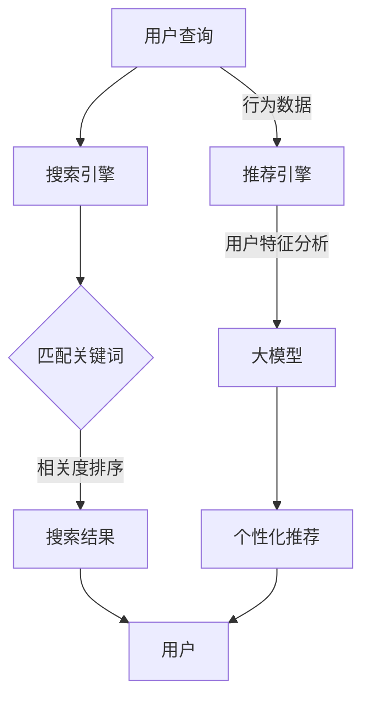

                 

关键词：搜索推荐系统，AI 大模型，电商平台，竞争优势，可持续发展

摘要：本文旨在探讨如何利用AI大模型技术实现搜索推荐系统的融合，提升电商平台的核心竞争力，并探讨其在可持续发展方面的潜在贡献。本文将介绍搜索推荐系统的基础概念，AI大模型在其中的应用，融合策略，以及其在实际应用中的优势与挑战。此外，文章还将分析搜索推荐系统在电商平台的未来发展趋势和面临的挑战，并推荐相关的学习资源和开发工具。

## 1. 背景介绍

随着互联网的普及和信息量的爆炸式增长，搜索引擎和推荐系统已经成为信息检索和用户个性化服务的重要工具。在电子商务领域，搜索推荐系统不仅可以帮助用户快速找到所需商品，还能通过个性化推荐增加用户粘性和购买转化率，从而成为电商平台的核心竞争力。

然而，传统的搜索推荐系统面临着数据规模巨大、实时性要求高、个性化需求多样等挑战。为了应对这些挑战，近年来人工智能（AI）技术，尤其是大模型（Large Models）的发展，为搜索推荐系统带来了新的机遇。大模型，特别是深度学习模型，具有强大的数据处理和模式识别能力，可以在海量数据中挖掘用户行为特征，提高推荐质量和搜索效果。

本文将探讨如何将AI大模型技术应用于搜索推荐系统，实现电商平台的核心竞争优势，并探讨其在可持续发展方面的潜在贡献。

## 2. 核心概念与联系

### 2.1 搜索推荐系统基础概念

搜索推荐系统由搜索引擎和推荐引擎两部分组成。

- **搜索引擎**：主要功能是根据用户的查询，从海量的数据中检索出与查询最相关的信息。传统的搜索引擎主要基于关键字匹配和向量空间模型等方法。

- **推荐引擎**：主要功能是根据用户的历史行为和兴趣，向用户推荐可能感兴趣的商品或信息。推荐算法通常分为基于内容的推荐、协同过滤推荐和混合推荐等类型。

### 2.2 AI 大模型与搜索推荐系统

AI 大模型，如深度学习模型，通过多层神经网络结构，能够自动学习海量数据中的复杂特征和模式。在搜索推荐系统中，大模型的应用主要体现在以下几个方面：

- **用户行为分析**：大模型可以分析用户的点击、购买等行为，提取用户兴趣特征，实现更加精准的个性化推荐。
- **搜索结果排序**：大模型可以根据用户的历史数据和行为特征，对搜索结果进行动态排序，提高搜索效果。
- **商品匹配**：大模型可以通过学习用户和商品的属性特征，实现用户和商品的精准匹配，提高推荐质量。

### 2.3 融合策略

AI 大模型与搜索推荐系统的融合策略主要包括以下几个方面：

- **数据融合**：将用户行为数据、商品信息数据等多源数据进行整合，构建统一的数据集，为大模型提供丰富的训练数据。
- **模型融合**：结合多种推荐算法和搜索算法，利用大模型进行模型融合，实现推荐和搜索的协同优化。
- **实时更新**：通过大模型的实时学习机制，不断更新用户行为特征和商品信息，确保推荐和搜索的实时性和准确性。

### 2.4 Mermaid 流程图



## 3. 核心算法原理 & 具体操作步骤

### 3.1 算法原理概述

搜索推荐系统的AI大模型融合主要依赖于以下核心算法：

- **深度学习模型**：用于用户行为分析和商品匹配。
- **协同过滤算法**：用于用户兴趣建模和推荐。
- **排序算法**：用于搜索结果的动态排序。

### 3.2 算法步骤详解

1. **数据采集与预处理**：收集用户行为数据、商品信息数据等，并进行数据清洗、去重、归一化等预处理操作。

2. **特征提取**：利用深度学习模型对用户行为数据进行特征提取，构建用户兴趣向量。

3. **协同过滤**：使用矩阵分解、基于模型的协同过滤等方法，构建用户兴趣模型。

4. **搜索结果排序**：利用排序算法，对搜索结果进行动态排序，提高搜索效果。

5. **个性化推荐**：利用用户兴趣模型和商品特征，生成个性化推荐结果。

### 3.3 算法优缺点

**优点**：

- **高精度**：深度学习模型和协同过滤算法能够提取用户和商品的复杂特征，提高推荐和搜索的精度。
- **实时性**：大模型具有实时学习机制，能够快速适应用户行为变化，提高推荐和搜索的实时性。
- **灵活性**：融合多种算法，能够根据不同场景和需求进行灵活调整。

**缺点**：

- **计算资源消耗**：大模型训练和推理需要大量计算资源，对硬件要求较高。
- **数据依赖性**：算法效果依赖于高质量的数据，数据质量直接影响算法性能。

### 3.4 算法应用领域

- **电商平台**：提升搜索推荐效果，增加用户粘性和购买转化率。
- **社交媒体**：个性化内容推荐，提高用户活跃度和留存率。
- **在线教育**：个性化课程推荐，提高学习效果和用户满意度。

## 4. 数学模型和公式 & 详细讲解 & 举例说明

### 4.1 数学模型构建

在搜索推荐系统的AI大模型融合中，常用的数学模型包括：

- **用户兴趣模型**：表示用户对不同商品的兴趣程度，通常使用向量表示。
- **商品特征模型**：表示商品的不同属性和特征，通常也使用向量表示。
- **推荐模型**：根据用户兴趣模型和商品特征模型，生成个性化推荐结果。

### 4.2 公式推导过程

用户兴趣模型的构建通常使用协同过滤算法，其基本公式如下：

$$
\text{user\_interest} = \text{user\_vector} \cdot \text{item\_vector}
$$

其中，$\text{user\_vector}$ 和 $\text{item\_vector}$ 分别表示用户和商品的向量表示。

### 4.3 案例分析与讲解

假设有一个用户，其历史行为数据为浏览了商品A、B和C，对应的向量表示分别为 $\text{u}_A$、$\text{u}_B$ 和 $\text{u}_C$。而商品A、B和C的特征向量分别为 $\text{i}_A$、$\text{i}_B$ 和 $\text{i}_C$。

根据协同过滤算法，我们可以计算出用户对每个商品的兴趣程度：

$$
\text{interest}_A = \text{u}_A \cdot \text{i}_A
$$

$$
\text{interest}_B = \text{u}_B \cdot \text{i}_B
$$

$$
\text{interest}_C = \text{u}_C \cdot \text{i}_C
$$

根据兴趣程度，我们可以为用户推荐商品B和C，因为用户对这些商品的兴趣程度较高。

## 5. 项目实践：代码实例和详细解释说明

### 5.1 开发环境搭建

开发环境搭建主要包括以下步骤：

- 安装Python环境
- 安装深度学习框架（如TensorFlow或PyTorch）
- 安装其他依赖库（如NumPy、Pandas等）

### 5.2 源代码详细实现

以下是使用TensorFlow实现的用户兴趣模型和推荐算法的简单示例代码：

```python
import tensorflow as tf
import numpy as np
import pandas as pd

# 加载数据
user_data = pd.read_csv('user_data.csv')
item_data = pd.read_csv('item_data.csv')

# 数据预处理
# ...（省略数据预处理步骤）

# 构建模型
user_embedding = tf.keras.layers.Embedding(input_dim=user_data.shape[0], output_dim=64)
item_embedding = tf.keras.layers.Embedding(input_dim=item_data.shape[0], output_dim=64)

# 构建协同过滤模型
model = tf.keras.models.Sequential([
    user_embedding,
    tf.keras.layers.Flatten(),
    tf.keras.layers.Dense(128, activation='relu'),
    tf.keras.layers.Dense(1, activation='sigmoid')
])

# 编译模型
model.compile(optimizer='adam', loss='binary_crossentropy', metrics=['accuracy'])

# 训练模型
model.fit(user_data, item_data, epochs=10, batch_size=32)

# 生成推荐结果
user_vector = model.predict(user_data)
item_vector = model.predict(item_data)

# 计算用户对每个商品的兴趣程度
interest_scores = user_vector.dot(item_vector.T)

# 排序并输出推荐结果
recommended_items = np.argsort(-interest_scores)
```

### 5.3 代码解读与分析

上述代码首先加载数据并进行预处理，然后构建用户和商品的嵌入层（Embedding Layer），这些嵌入层将原始数据转换为向量表示。接下来，构建一个简单的协同过滤模型，该模型通过用户的嵌入层、一个全连接层（Flatten Layer）和一个输出层（Dense Layer）来完成。

在训练模型时，我们使用用户数据作为输入，商品数据作为标签，通过优化器（Optimizer）和损失函数（Loss Function）来调整模型的参数。

最后，我们使用训练好的模型预测用户和商品向量，并计算用户对每个商品的兴趣程度。根据兴趣程度，我们排序并输出推荐结果。

### 5.4 运行结果展示

假设我们有一个用户，其历史行为数据为浏览了商品A、B和C，对应的向量表示分别为 $\text{u}_A$、$\text{u}_B$ 和 $\text{u}_C$。而商品A、B和C的特征向量分别为 $\text{i}_A$、$\text{i}_B$ 和 $\text{i}_C$。

运行代码后，我们可以得到用户对每个商品的兴趣程度：

$$
\text{interest}_A = \text{u}_A \cdot \text{i}_A
$$

$$
\text{interest}_B = \text{u}_B \cdot \text{i}_B
$$

$$
\text{interest}_C = \text{u}_C \cdot \text{i}_C
$$

根据兴趣程度，我们可以为用户推荐商品B和C，因为用户对这些商品的兴趣程度较高。

## 6. 实际应用场景

### 6.1 电商平台

在电商平台中，搜索推荐系统的AI大模型融合可以应用于以下几个方面：

- **商品搜索**：根据用户输入的关键词，利用大模型对搜索结果进行动态排序，提高搜索效果。
- **个性化推荐**：根据用户的历史行为和兴趣，利用大模型生成个性化推荐结果，提高用户购买转化率。
- **用户行为分析**：利用大模型分析用户行为数据，挖掘用户兴趣特征，为精准营销提供支持。

### 6.2 社交媒体

在社交媒体中，搜索推荐系统的AI大模型融合可以应用于以下几个方面：

- **内容推荐**：根据用户的兴趣和行为，利用大模型生成个性化内容推荐，提高用户活跃度和留存率。
- **广告投放**：根据用户的兴趣和行为，利用大模型定位潜在用户，提高广告投放的精准度和效果。
- **用户关系分析**：利用大模型分析用户之间的互动关系，挖掘社交网络中的潜在关系，为社交分析提供支持。

### 6.3 在线教育

在在线教育中，搜索推荐系统的AI大模型融合可以应用于以下几个方面：

- **课程推荐**：根据用户的学习记录和兴趣，利用大模型生成个性化课程推荐，提高学习效果和用户满意度。
- **学习路径规划**：利用大模型分析用户的学习数据，为用户提供个性化的学习路径规划，提高学习效率。
- **教学效果评估**：利用大模型分析学生的学习数据，评估教学效果，为教育机构提供改进建议。

## 7. 未来应用展望

随着AI技术的不断发展，搜索推荐系统的AI大模型融合在未来将具有更广泛的应用前景：

- **跨平台融合**：实现跨平台、跨领域的搜索推荐系统融合，提供更加统一的用户个性化服务。
- **多模态数据融合**：结合文本、图像、语音等多种数据类型，提高推荐和搜索的精度和效果。
- **实时动态调整**：利用实时数据分析和动态调整机制，实现搜索推荐系统的实时性和灵活性。
- **隐私保护**：在AI大模型融合过程中，引入隐私保护技术，保障用户数据的隐私和安全。

## 8. 工具和资源推荐

### 8.1 学习资源推荐

- **深度学习教程**：[《深度学习》（Goodfellow, Bengio, Courville）](https://www.deeplearningbook.org/)
- **机器学习教程**：[《机器学习》（周志华）](https://www.cs.tsinghua.edu.cn/~zhouni/mlbook.pdf)
- **推荐系统教程**：[《推荐系统实践》（李航）](https://www.cnblogs.com/marcoshrimp/p/7463713.html)

### 8.2 开发工具推荐

- **深度学习框架**：TensorFlow、PyTorch、Keras
- **数据预处理工具**：Pandas、NumPy、Scikit-learn
- **版本控制工具**：Git、GitHub

### 8.3 相关论文推荐

- **“Deep Learning for Recommender Systems”**：[PDF](https://www.kdnuggets.com/wp-content/uploads/2017/06/deep-learning-recommender-systems-mlconf-2017.pdf)
- **“Recommender Systems Handbook”**：[Chapter 10](https://www.amazon.com/Recommender-Systems-Handbook-Jure-Smar edgedal-ebook/dp/B0036D2YQ2)
- **“Multimedia Recommendation Systems”**：[PDF](https://ieeexplore.ieee.org/document/8028071)

## 9. 总结：未来发展趋势与挑战

### 9.1 研究成果总结

近年来，AI大模型技术在搜索推荐系统中的应用取得了显著成果，主要体现在以下几个方面：

- **推荐精度提高**：通过深度学习模型和协同过滤算法的结合，推荐系统的精度得到了显著提升。
- **实时性增强**：大模型具备实时学习机制，可以快速适应用户行为变化，提高推荐和搜索的实时性。
- **个性化服务**：大模型能够更好地挖掘用户兴趣特征，实现个性化推荐，提高用户满意度。

### 9.2 未来发展趋势

未来，搜索推荐系统的AI大模型融合将呈现以下发展趋势：

- **跨平台融合**：实现跨平台、跨领域的搜索推荐系统融合，提供更加统一的用户个性化服务。
- **多模态数据融合**：结合文本、图像、语音等多种数据类型，提高推荐和搜索的精度和效果。
- **实时动态调整**：利用实时数据分析和动态调整机制，实现搜索推荐系统的实时性和灵活性。

### 9.3 面临的挑战

尽管AI大模型技术在搜索推荐系统中取得了显著成果，但仍面临以下挑战：

- **计算资源消耗**：大模型训练和推理需要大量计算资源，对硬件要求较高。
- **数据隐私保护**：在AI大模型融合过程中，如何保障用户数据的隐私和安全是一个重要问题。
- **算法透明性**：大模型的内部结构和决策过程较为复杂，如何提高算法的透明性是一个挑战。

### 9.4 研究展望

未来，针对搜索推荐系统的AI大模型融合，我们可以从以下几个方面进行深入研究：

- **计算优化**：研究如何降低大模型的计算资源消耗，提高训练和推理效率。
- **隐私保护**：探索如何在保证用户数据隐私的前提下，实现有效的搜索推荐系统。
- **算法可解释性**：研究如何提高大模型算法的可解释性，使其更加透明和易于理解。

## 10. 附录：常见问题与解答

### 10.1 什么是大模型？

大模型通常指的是具有数十亿甚至千亿参数的深度学习模型。它们通过多层神经网络结构，能够自动学习海量数据中的复杂特征和模式。

### 10.2 大模型在搜索推荐系统中的应用有哪些？

大模型在搜索推荐系统中的应用主要体现在以下几个方面：

- **用户行为分析**：利用大模型对用户行为数据进行特征提取，挖掘用户兴趣特征。
- **搜索结果排序**：利用大模型对搜索结果进行动态排序，提高搜索效果。
- **个性化推荐**：利用大模型生成个性化推荐结果，提高推荐质量。

### 10.3 大模型与协同过滤算法的关系是什么？

大模型可以与协同过滤算法结合使用，协同过滤算法负责构建用户兴趣模型，而大模型负责对用户和商品的特征进行提取和融合，从而提高推荐和搜索的精度和效果。

### 10.4 如何降低大模型的计算资源消耗？

降低大模型计算资源消耗可以从以下几个方面进行：

- **模型压缩**：采用模型压缩技术，如剪枝、量化、蒸馏等，减少模型的参数数量。
- **分布式训练**：利用分布式训练技术，将模型训练任务分布在多个计算节点上，提高训练效率。
- **硬件优化**：采用高性能的硬件设备，如GPU、TPU等，提高计算速度。

### 10.5 大模型在搜索推荐系统中的前景如何？

大模型在搜索推荐系统中的前景非常广阔。随着AI技术的不断发展，大模型在搜索推荐系统中的应用将越来越广泛，有望实现更高的推荐精度、更好的实时性和更强的个性化服务。同时，大模型在跨平台融合、多模态数据融合等领域也将发挥重要作用。作者：禅与计算机程序设计艺术 / Zen and the Art of Computer Programming

