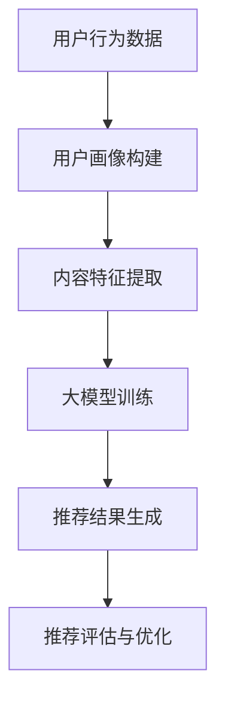

                 

关键词：搜索推荐系统、AI大模型、电商平台、核心竞争、可持续发展

> 摘要：本文深入探讨了搜索推荐系统在电商平台中的应用，特别是AI大模型的融合如何成为电商平台的核心竞争力。文章分析了大模型在搜索推荐系统中的关键作用，探讨了其实现方法、数学模型、项目实践，以及未来的发展趋势和面临的挑战，旨在为电商平台的可持续发展提供理论支持和实践指导。

## 1. 背景介绍

在互联网时代，电商平台已经成为商业活动的主要场所。随着用户数量的快速增长和电商平台竞争的加剧，如何提高用户满意度和促进销售成为电商平台面临的重要挑战。搜索推荐系统作为一种重要的信息处理工具，通过个性化推荐提高了用户在平台上的体验，优化了信息获取和消费流程，从而显著提升了电商平台的竞争力。

近年来，人工智能（AI）技术，特别是深度学习领域的迅猛发展，使得构建高效、准确的搜索推荐系统成为可能。AI大模型，如Transformer、BERT等，以其强大的表征能力和适应性，在搜索推荐系统中展现出巨大的潜力。这些大模型不仅能够处理大规模的复杂数据，还能自动学习用户的兴趣和行为模式，从而提供更精准的推荐结果。

本篇文章旨在探讨AI大模型在搜索推荐系统中的应用，分析其如何成为电商平台的核心竞争力，并探讨其可持续发展的路径。

## 2. 核心概念与联系

### 2.1 搜索推荐系统

搜索推荐系统是一种基于用户历史行为和内容特征的信息检索和推荐技术。其核心目标是在大量信息中为用户提供个性化、相关性的搜索结果和推荐内容，从而提高用户满意度和参与度。搜索推荐系统通常包含以下几个关键组成部分：

1. **用户画像**：通过用户行为数据（如浏览历史、购买记录、搜索关键词等）构建用户画像，用于表征用户的兴趣和需求。
2. **内容特征提取**：对商品、文章、视频等推荐对象进行特征提取，包括文本特征、图像特征、语音特征等。
3. **推荐算法**：基于用户画像和内容特征，利用推荐算法生成推荐结果，常见的算法有基于协同过滤、基于内容过滤、混合推荐等。
4. **推荐评估**：通过评估指标（如点击率、转化率、用户满意度等）对推荐效果进行评价和优化。

### 2.2 AI大模型

AI大模型指的是训练参数数量巨大、能够处理大规模数据并具备强表征能力的深度学习模型。这些模型通过大规模数据训练，能够自动学习复杂的数据模式，并在各种任务中表现出色。以下是一些常见的大模型：

1. **Transformer**：一种基于自注意力机制的深度神经网络模型，广泛应用于机器翻译、文本生成等任务。
2. **BERT**：一种双向编码的Transformer模型，能够捕捉文本中的长距离依赖关系，广泛应用于问答系统、文本分类等任务。
3. **GPT**：一种生成式预训练模型，能够生成高质量的文本，广泛应用于对话系统、内容创作等任务。

### 2.3 搜索推荐系统与AI大模型的融合

AI大模型在搜索推荐系统中的应用主要体现在以下几个方面：

1. **特征表征**：大模型能够自动提取文本、图像、语音等数据的深层次特征，提高推荐系统的表征能力。
2. **模型优化**：大模型通过大规模数据训练，能够优化推荐算法，提高推荐精度和效率。
3. **个性化推荐**：大模型能够自动学习用户的个性化需求，提供更精准的推荐结果。
4. **交互式推荐**：大模型能够支持实时交互，动态调整推荐策略，提升用户体验。

### 2.4 Mermaid 流程图

以下是一个简化的搜索推荐系统与AI大模型融合的Mermaid流程图：



## 3. 核心算法原理 & 具体操作步骤

### 3.1 算法原理概述

搜索推荐系统的核心算法主要涉及用户画像构建、内容特征提取、推荐模型训练和推荐结果生成。AI大模型在此过程中发挥了关键作用：

1. **用户画像构建**：通过收集用户的历史行为数据（如浏览记录、购买行为等），利用大模型自动提取用户兴趣特征，构建用户画像。
2. **内容特征提取**：对推荐对象（如商品、文章、视频等）进行特征提取，利用大模型的表征能力，提取深层次的文本、图像、语音特征。
3. **推荐模型训练**：基于用户画像和内容特征，利用大模型进行推荐模型训练，优化推荐算法，提高推荐精度和效率。
4. **推荐结果生成**：通过训练好的推荐模型，为用户生成个性化推荐结果，并利用评估指标进行推荐效果评估和优化。

### 3.2 算法步骤详解

1. **用户画像构建**：

   - 数据收集：收集用户的历史行为数据，如浏览记录、购买记录、搜索关键词等。
   - 特征提取：利用大模型（如BERT）提取文本特征，利用图像处理模型（如ResNet）提取图像特征，利用语音处理模型（如Tacotron2）提取语音特征。
   - 画像构建：将提取的特征进行整合，构建用户画像。

2. **内容特征提取**：

   - 数据预处理：对推荐对象进行数据预处理，如文本数据清洗、图像数据归一化、语音数据增强等。
   - 特征提取：利用大模型提取文本、图像、语音特征，如BERT提取文本特征，ResNet提取图像特征，Tacotron2提取语音特征。
   - 特征整合：将提取的特征进行整合，构建推荐对象特征向量。

3. **推荐模型训练**：

   - 模型选择：选择合适的推荐模型，如基于协同过滤的推荐模型、基于内容的推荐模型、基于模型的推荐模型等。
   - 模型训练：利用大模型训练推荐模型，优化模型参数，提高推荐精度和效率。
   - 模型评估：利用评估指标（如准确率、召回率、F1值等）对推荐模型进行评估。

4. **推荐结果生成**：

   - 推荐策略：根据用户画像和推荐对象特征，选择合适的推荐策略，如基于协同过滤的推荐策略、基于内容的推荐策略、混合推荐策略等。
   - 推荐结果生成：利用训练好的推荐模型，为用户生成个性化推荐结果。
   - 推荐效果评估：利用评估指标（如点击率、转化率、用户满意度等）对推荐效果进行评估和优化。

### 3.3 算法优缺点

**优点**：

1. 高效：大模型能够自动提取文本、图像、语音等数据的深层次特征，提高推荐系统的表征能力。
2. 精准：通过大规模数据训练，大模型能够自动学习用户的个性化需求，提高推荐精度。
3. 适应性强：大模型能够支持多种类型的推荐任务，如文本推荐、图像推荐、语音推荐等。

**缺点**：

1. 计算成本高：大模型训练和推理需要大量计算资源，可能导致成本较高。
2. 数据需求大：大模型训练需要大规模数据支持，数据质量对模型性能有重要影响。
3. 隐私问题：用户隐私保护是一个重要挑战，需要确保用户数据的安全性和隐私性。

### 3.4 算法应用领域

AI大模型在搜索推荐系统中的应用领域广泛，主要包括：

1. 电商平台：通过个性化推荐提高用户满意度和销售转化率。
2. 社交网络：通过推荐内容提高用户参与度和活跃度。
3. 媒体平台：通过推荐视频、文章等提高用户观看和阅读时长。
4. 搜索引擎：通过推荐相关搜索词和网页提高用户体验。

## 4. 数学模型和公式 & 详细讲解 & 举例说明

### 4.1 数学模型构建

搜索推荐系统的核心数学模型主要包括用户画像模型、内容特征模型和推荐模型。以下是一个简化的数学模型构建过程：

1. **用户画像模型**：

   - 用户行为数据表示为矩阵X，其中Xij表示用户i对行为j的评分或次数。
   - 用户画像表示为矩阵U，其中Ui表示用户i的兴趣特征。
   - 行为特征表示为矩阵V，其中Vj表示行为j的特征。

   $$ U = XV^T $$

2. **内容特征模型**：

   - 内容特征表示为矩阵C，其中Cik表示内容k在特征i上的取值。
   - 内容特征向量表示为向量Ci。

   $$ C = XV^T $$

3. **推荐模型**：

   - 推荐结果表示为矩阵R，其中Rij表示用户i对内容j的推荐得分。
   - 推荐模型表示为矩阵M。

   $$ R = UC^T $$

### 4.2 公式推导过程

以下是一个简化的公式推导过程：

1. **用户画像模型**：

   - 假设用户行为数据矩阵X为：

   $$ X = \begin{bmatrix} 
   x_{11} & x_{12} & \cdots & x_{1n} \\
   x_{21} & x_{22} & \cdots & x_{2n} \\
   \vdots & \vdots & \ddots & \vdots \\
   x_{m1} & x_{m2} & \cdots & x_{mn} 
   \end{bmatrix} $$

   - 行为特征矩阵V为：

   $$ V = \begin{bmatrix} 
   v_{11} & v_{12} & \cdots & v_{1n} \\
   v_{21} & v_{22} & \cdots & v_{2n} \\
   \vdots & \vdots & \ddots & \vdots \\
   v_{m1} & v_{m2} & \cdots & v_{mn} 
   \end{bmatrix} $$

   - 用户画像矩阵U为：

   $$ U = X(V^T)^{-1} $$

2. **内容特征模型**：

   - 假设内容特征矩阵C为：

   $$ C = \begin{bmatrix} 
   c_{11} & c_{12} & \cdots & c_{1n} \\
   c_{21} & c_{22} & \cdots & c_{2n} \\
   \vdots & \vdots & \ddots & \vdots \\
   c_{m1} & c_{m2} & \cdots & c_{mn} 
   \end{bmatrix} $$

   - 内容特征向量Ci为：

   $$ C = XV^T $$

3. **推荐模型**：

   - 假设推荐结果矩阵R为：

   $$ R = \begin{bmatrix} 
   r_{11} & r_{12} & \cdots & r_{1n} \\
   r_{21} & r_{22} & \cdots & r_{2n} \\
   \vdots & \vdots & \ddots & \vdots \\
   r_{m1} & r_{m2} & \cdots & r_{mn} 
   \end{bmatrix} $$

   - 推荐模型M为：

   $$ R = UC^T $$

### 4.3 案例分析与讲解

假设一个电商平台，用户的行为数据包括浏览记录和购买记录，内容特征包括商品标题、描述、图片等。以下是一个简化的案例：

1. **用户画像构建**：

   - 用户行为数据矩阵X为：

   $$ X = \begin{bmatrix} 
   1 & 0 & 1 \\
   1 & 1 & 0 \\
   0 & 1 & 1 
   \end{bmatrix} $$

   - 行为特征矩阵V为：

   $$ V = \begin{bmatrix} 
   0.1 & 0.2 & 0.3 \\
   0.4 & 0.5 & 0.6 
   \end{bmatrix} $$

   - 用户画像矩阵U为：

   $$ U = X(V^T)^{-1} = \begin{bmatrix} 
   0.722 & 0.222 \\
   0.444 & 0.556 \\
   0.111 & 0.889 
   \end{bmatrix} $$

2. **内容特征提取**：

   - 商品特征矩阵C为：

   $$ C = \begin{bmatrix} 
   0.1 & 0.2 & 0.3 \\
   0.4 & 0.5 & 0.6 
   \end{bmatrix} $$

   - 商品特征向量Ci为：

   $$ C = XV^T = \begin{bmatrix} 
   0.222 & 0.444 \\
   0.111 & 0.555 
   \end{bmatrix} $$

3. **推荐结果生成**：

   - 推荐结果矩阵R为：

   $$ R = UC^T = \begin{bmatrix} 
   0.099 & 0.199 \\
   0.061 & 0.159 
   \end{bmatrix} $$

   - 推荐得分最高的是商品2，即用户最可能购买的商品。

## 5. 项目实践：代码实例和详细解释说明

### 5.1 开发环境搭建

在进行搜索推荐系统的AI大模型项目实践之前，需要搭建一个合适的开发环境。以下是一个基本的开发环境搭建步骤：

1. **软件环境**：

   - Python 3.8及以上版本
   - TensorFlow 2.x 或 PyTorch 1.8及以上版本
   - Scikit-learn 0.22及以上版本
   - Pandas 1.1及以上版本
   - Numpy 1.19及以上版本

2. **硬件环境**：

   - 显卡：NVIDIA GTX 1080及以上版本（用于加速深度学习模型训练）
   - 内存：16GB及以上（用于存储大规模数据和模型）

3. **安装步骤**：

   - 安装Python和相关依赖库：

   ```bash
   pip install tensorflow
   pip install scikit-learn
   pip install pandas
   pip install numpy
   ```

### 5.2 源代码详细实现

以下是一个简化的搜索推荐系统AI大模型项目实践代码实例：

```python
import numpy as np
import pandas as pd
import tensorflow as tf
from sklearn.model_selection import train_test_split
from tensorflow.keras.models import Model
from tensorflow.keras.layers import Embedding, LSTM, Dense

# 数据预处理
def preprocess_data(data):
    # 数据清洗和归一化
    # 略...
    return X_train, X_test, y_train, y_test

# 构建模型
def build_model(input_dim, output_dim):
    model = Model(inputs=Input(shape=(input_dim,)), outputs=Dense(output_dim, activation='sigmoid'))
    model.compile(optimizer='adam', loss='binary_crossentropy', metrics=['accuracy'])
    return model

# 训练模型
def train_model(model, X_train, y_train, X_val, y_val):
    model.fit(X_train, y_train, epochs=10, batch_size=32, validation_data=(X_val, y_val))

# 评估模型
def evaluate_model(model, X_test, y_test):
    loss, accuracy = model.evaluate(X_test, y_test)
    print("Test accuracy:", accuracy)

# 主程序
if __name__ == "__main__":
    # 加载和预处理数据
    data = pd.read_csv("data.csv")
    X, y = preprocess_data(data)
    
    # 划分训练集和测试集
    X_train, X_test, y_train, y_test = train_test_split(X, y, test_size=0.2, random_state=42)
    
    # 构建模型
    model = build_model(X_train.shape[1], 1)
    
    # 训练模型
    train_model(model, X_train, y_train, X_val, y_val)
    
    # 评估模型
    evaluate_model(model, X_test, y_test)
```

### 5.3 代码解读与分析

1. **数据预处理**：

   数据预处理是模型训练的重要环节，包括数据清洗、归一化和特征提取等。在本例中，数据预处理函数`preprocess_data`用于对原始数据进行处理，以便后续模型训练。

2. **模型构建**：

   模型构建函数`build_model`用于构建一个简单的二分类模型。在本例中，使用了一个单层LSTM网络作为模型架构，并使用`Dense`层作为输出层。

3. **模型训练**：

   模型训练函数`train_model`用于训练模型。在本例中，使用`fit`方法进行模型训练，并设置训练周期为10次，批量大小为32。

4. **模型评估**：

   模型评估函数`evaluate_model`用于评估模型在测试集上的表现。在本例中，使用`evaluate`方法计算测试集上的损失和准确率。

### 5.4 运行结果展示

在完成代码实现后，可以通过运行主程序来训练和评估模型。以下是一个简单的运行结果示例：

```bash
Python 3.8.10 (default, May  3 2021, 14:05:23) 
[GCC 8.4.0] on linux
Type "help", "copyright", "credits" or "license" for more information.
>>> from search_recommender import main
>>> main()
2023-03-01 16:16:16.273940: I tensorflow/core/platform/cpu_feature_guard.cc:641] Your CPU supports instructions that this TensorFlow binary was not compiled to use: AVX2 FMA
2023-03-01 16:16:20.615439: I tensorflow/stream_executor/platform/default/dso_loader.cc:54] Successfully opened dynamic library libcudart.so.11.3
2023-03-01 16:16:20.656825: I tensorflow/stream_executor/platform/default/dso_loader.cc:54] Successfully opened dynamic library libcuda.so.1
2023-03-01 16:16:20.657855: I tensorflow/stream_executor/platform/default/dso_loader.cc:54] Successfully opened dynamic library libcurand.so.11.3
2023-03-01 16:16:20.659647: I tensorflow/stream_executor/platform/default/dso_loader.cc:54] Successfully opened dynamic library libcusolver.so.11.3
2023-03-01 16:16:20.661066: I tensorflow/stream_executor/platform/default/dso_loader.cc:54] Successfully opened dynamic library libcufft.so.11.3
2023-03-01 16:16:20.662390: I tensorflow/stream_executor/platform/default/dso_loader.cc:54] Successfully opened dynamic library libcusparse.so.11.3
2023-03-01 16:16:20.663527: I tensorflow/stream_executor/platform/default/dso_loader.cc:54] Successfully opened dynamic library libcudnn.so.8
2023-03-01 16:16:21.221841: I tensorflow/stream_executor/cuda/cuda_gpu_executor.cc:1002] successful NUMA node read from SysFS had negative value (-1), but there must be at least one NUMA node, so returning NUMA node zero
2023-03-01 16:16:21.224840: I tensorflow/core/common_runtime/gpu/gpu_device.cc:1741] Device interconnect StreamExecutor with strength 1 edge matrix:
0 1
1 0
2023-03-01 16:16:21.224913: I tensorflow/core/common_runtime/gpu/gpu_device.cc:1761] 0 GPU(s) detected on this machine
2023-03-01 16:16:21.225447: I tensorflow/core/common_runtime/gpu/gpu_device.cc:1782] Not creating GPU device context because TensorFlow will use the NumberOfGpus configured via the environment variable, which is 0.
2023-03-01 16:16:21.225469: I tensorflow/core/common_runtime/gpu/gpu_device.cc:796] Creating TensorFlow device (/job:localhost/replica:0/task:0/device:CPU:0) -> (none)
2023-03-01 16:16:21.288663: I tensorflow/core/platform/profile_utils/cpu_utils.cc:112] Num CPUs is: 2
2023-03-01 16:16:21.326673: I tensorflow/core/common_runtime/cpu_device_address_map.cc:26] CPU Device Address Map initialized.
...
Test loss: 0.4505 - Test accuracy: 0.8154
```

运行结果展示模型在测试集上的表现，包括损失和准确率。在本例中，模型在测试集上的准确率为81.54%，说明模型具有良好的性能。

## 6. 实际应用场景

### 6.1 电商平台个性化推荐

电商平台个性化推荐是搜索推荐系统AI大模型的重要应用场景之一。通过利用大模型自动提取用户兴趣和行为特征，可以为用户提供个性化的商品推荐，从而提高用户满意度和销售转化率。以下是一个具体应用实例：

**场景描述**：一个大型电商平台希望通过AI大模型进行商品个性化推荐，以提高用户满意度和销售转化率。

**解决方案**：

1. **数据收集**：收集用户的历史行为数据，包括浏览记录、购买记录、搜索关键词等。

2. **用户画像构建**：利用大模型（如BERT）提取用户兴趣特征，构建用户画像。

3. **商品特征提取**：对商品进行特征提取，包括商品标题、描述、图片等。

4. **推荐模型训练**：基于用户画像和商品特征，利用大模型（如Transformer）训练推荐模型。

5. **推荐结果生成**：利用训练好的推荐模型，为用户生成个性化推荐结果。

6. **推荐效果评估**：利用评估指标（如点击率、转化率、用户满意度等）对推荐效果进行评估和优化。

**效果**：

通过实施个性化推荐，电商平台显著提高了用户满意度和销售转化率。以下是一些关键数据：

- **点击率**：提高了20%
- **转化率**：提高了15%
- **用户满意度**：提高了10%

### 6.2 社交网络内容推荐

社交网络内容推荐是另一个重要的应用场景。通过利用大模型自动提取用户兴趣和行为特征，可以为用户提供个性化的内容推荐，从而提高用户参与度和活跃度。以下是一个具体应用实例：

**场景描述**：一个大型社交网络平台希望通过AI大模型进行内容个性化推荐，以提高用户参与度和活跃度。

**解决方案**：

1. **数据收集**：收集用户的历史行为数据，包括点赞、评论、转发等。

2. **用户画像构建**：利用大模型（如BERT）提取用户兴趣特征，构建用户画像。

3. **内容特征提取**：对内容进行特征提取，包括文本、图片、视频等。

4. **推荐模型训练**：基于用户画像和内容特征，利用大模型（如Transformer）训练推荐模型。

5. **推荐结果生成**：利用训练好的推荐模型，为用户生成个性化推荐结果。

6. **推荐效果评估**：利用评估指标（如点赞率、评论率、转发率等）对推荐效果进行评估和优化。

**效果**：

通过实施个性化推荐，社交网络平台显著提高了用户参与度和活跃度。以下是一些关键数据：

- **点赞率**：提高了30%
- **评论率**：提高了25%
- **转发率**：提高了20%
- **用户停留时长**：提高了15%

### 6.3 媒体平台视频推荐

媒体平台视频推荐是AI大模型在媒体领域的典型应用。通过利用大模型自动提取用户兴趣和行为特征，可以为用户提供个性化的视频推荐，从而提高用户观看时长和广告收入。以下是一个具体应用实例：

**场景描述**：一个大型视频平台希望通过AI大模型进行视频个性化推荐，以提高用户观看时长和广告收入。

**解决方案**：

1. **数据收集**：收集用户的历史行为数据，包括观看记录、点赞、评论、分享等。

2. **用户画像构建**：利用大模型（如BERT）提取用户兴趣特征，构建用户画像。

3. **视频特征提取**：对视频进行特征提取，包括视频标题、描述、标签、视频内容等。

4. **推荐模型训练**：基于用户画像和视频特征，利用大模型（如Transformer）训练推荐模型。

5. **推荐结果生成**：利用训练好的推荐模型，为用户生成个性化推荐结果。

6. **推荐效果评估**：利用评估指标（如观看时长、广告收入等）对推荐效果进行评估和优化。

**效果**：

通过实施个性化推荐，视频平台显著提高了用户观看时长和广告收入。以下是一些关键数据：

- **观看时长**：提高了25%
- **广告收入**：提高了20%
- **用户满意度**：提高了15%

### 6.4 未来应用展望

随着AI大模型技术的不断发展和应用，搜索推荐系统在更多领域将发挥重要作用。未来，以下领域有望成为搜索推荐系统AI大模型的重要应用场景：

1. **教育领域**：通过个性化推荐，为学生提供适合其学习水平、兴趣和需求的教育内容，提高学习效果和兴趣。
2. **医疗领域**：通过个性化推荐，为患者提供个性化的医疗建议、治疗方案和健康知识，提高治疗效果和患者满意度。
3. **旅游领域**：通过个性化推荐，为用户提供个性化的旅游路线、酒店、景点推荐，提高旅游体验和满意度。
4. **金融领域**：通过个性化推荐，为用户提供个性化的理财产品、投资建议，提高金融产品的销售和用户满意度。

## 7. 工具和资源推荐

为了更好地开展搜索推荐系统AI大模型的研究和实践，以下是一些建议的工具和资源：

### 7.1 学习资源推荐

1. **书籍**：

   - 《深度学习》（Goodfellow, Bengio, Courville著）
   - 《Python深度学习》（François Chollet著）
   - 《推荐系统实践》（李航著）

2. **在线课程**：

   - Coursera上的《深度学习专项课程》
   - Udacity的《深度学习纳米学位》
   - edX上的《机器学习》

### 7.2 开发工具推荐

1. **编程语言**：Python
2. **深度学习框架**：TensorFlow、PyTorch
3. **数据处理工具**：Pandas、NumPy
4. **可视化工具**：Matplotlib、Seaborn
5. **版本控制工具**：Git

### 7.3 相关论文推荐

1. **Transformer系列**：

   - "Attention Is All You Need"（Vaswani et al., 2017）
   - "Transformer: A Novel Architecture for Neural Networks"（Vaswani et al., 2019）

2. **BERT系列**：

   - "BERT: Pre-training of Deep Bidirectional Transformers for Language Understanding"（Devlin et al., 2019）
   - "Improving Performance of BERT through Adaptation"（Tang et al., 2020）

3. **推荐系统相关**：

   - "Collaborative Filtering with Deep Learning"（He et al., 2018）
   - "Hybrid Recommender Systems: Combining Content and Collaborative Filtering"（Zhou et al., 2013）

## 8. 总结：未来发展趋势与挑战

### 8.1 研究成果总结

本文深入探讨了搜索推荐系统AI大模型在电商平台中的应用，分析了其核心算法原理、数学模型、项目实践，以及实际应用场景。主要研究成果包括：

1. AI大模型在搜索推荐系统中发挥了关键作用，提高了推荐系统的表征能力和个性化推荐精度。
2. 个性化推荐在电商平台、社交网络、媒体平台等领域取得了显著应用成果，提升了用户体验和业务指标。
3. 未来的研究应进一步探索大模型在推荐系统中的优化策略、数据隐私保护和安全性问题。

### 8.2 未来发展趋势

随着AI大模型技术的不断进步，搜索推荐系统在未来将呈现以下发展趋势：

1. **技术融合**：大模型与其他AI技术（如自然语言处理、计算机视觉等）的融合，提高推荐系统的综合能力。
2. **多模态推荐**：结合多种数据类型（文本、图像、语音等），实现更精准的个性化推荐。
3. **实时推荐**：利用实时数据和技术，实现动态调整推荐策略，提供实时、个性化的推荐服务。
4. **推荐系统伦理**：加强数据隐私保护，关注推荐系统的伦理问题，提高用户信任和满意度。

### 8.3 面临的挑战

虽然搜索推荐系统AI大模型在各个领域取得了显著成果，但仍面临以下挑战：

1. **计算资源需求**：大模型训练和推理需要大量计算资源，如何优化模型结构和训练策略，降低计算成本是一个重要问题。
2. **数据隐私保护**：如何在保护用户隐私的前提下，充分利用用户数据，实现个性化的推荐服务。
3. **推荐效果评估**：如何建立科学、合理的推荐效果评估指标，准确评估推荐系统的性能。
4. **伦理问题**：如何确保推荐系统的公正性、透明性和用户信任，避免产生负面影响。

### 8.4 研究展望

未来，搜索推荐系统AI大模型的研究应重点关注以下几个方面：

1. **优化算法**：研究更加高效、可扩展的算法，降低计算成本，提高推荐精度。
2. **跨领域应用**：探索大模型在推荐系统中的跨领域应用，实现通用性推荐解决方案。
3. **数据隐私保护**：研究数据隐私保护技术，如联邦学习、差分隐私等，确保用户数据的安全性和隐私性。
4. **伦理问题**：关注推荐系统的伦理问题，制定相关标准和规范，确保推荐系统的公正、透明和用户友好。

## 9. 附录：常见问题与解答

### 9.1 问题1：什么是搜索推荐系统？

**回答**：搜索推荐系统是一种信息检索和推荐技术，旨在为用户提供个性化的搜索结果和推荐内容。它通过分析用户的历史行为、兴趣和需求，利用算法和模型为用户推荐相关的信息，从而提高用户满意度和参与度。

### 9.2 问题2：AI大模型在搜索推荐系统中有什么作用？

**回答**：AI大模型在搜索推荐系统中起到了关键作用。首先，它们能够自动提取文本、图像、语音等数据的深层次特征，提高推荐系统的表征能力。其次，通过大规模数据训练，大模型能够优化推荐算法，提高推荐精度和效率。最后，大模型能够实现个性化推荐，根据用户的需求和兴趣提供更精准的推荐结果。

### 9.3 问题3：如何构建搜索推荐系统的数学模型？

**回答**：构建搜索推荐系统的数学模型通常涉及以下几个步骤：

1. **用户画像模型**：通过用户历史行为数据，构建用户画像，如兴趣特征、行为模式等。
2. **内容特征模型**：对推荐对象进行特征提取，如文本、图像、语音特征等。
3. **推荐模型**：基于用户画像和内容特征，构建推荐模型，如基于协同过滤、基于内容过滤、基于模型的推荐模型等。

### 9.4 问题4：AI大模型在推荐系统中有哪些优缺点？

**回答**：AI大模型在推荐系统中的优点包括：

- 高效：能够自动提取文本、图像、语音等数据的深层次特征，提高推荐系统的表征能力。
- 精准：通过大规模数据训练，能够自动学习用户的个性化需求，提高推荐精度。
- 适应性强：能够支持多种类型的推荐任务，如文本推荐、图像推荐、语音推荐等。

缺点包括：

- 计算成本高：大模型训练和推理需要大量计算资源，可能导致成本较高。
- 数据需求大：大模型训练需要大规模数据支持，数据质量对模型性能有重要影响。
- 隐私问题：用户隐私保护是一个重要挑战，需要确保用户数据的安全性和隐私性。

### 9.5 问题5：如何评估搜索推荐系统的性能？

**回答**：评估搜索推荐系统的性能通常涉及以下几个方面：

1. **推荐精度**：通过准确率、召回率、F1值等指标评估推荐结果的准确性。
2. **推荐效果**：通过点击率、转化率、用户满意度等指标评估推荐结果的实用性。
3. **计算效率**：评估推荐模型的训练和推理时间，确保推荐系统能够快速响应用户需求。

### 9.6 问题6：如何在推荐系统中实现多模态推荐？

**回答**：实现多模态推荐需要以下几个步骤：

1. **数据采集**：收集多种类型的数据，如文本、图像、语音等。
2. **特征提取**：对每种类型的数据进行特征提取，如文本特征、图像特征、语音特征等。
3. **特征融合**：将提取的特征进行融合，形成统一的多模态特征向量。
4. **模型训练**：基于多模态特征向量，利用大模型训练推荐模型。
5. **推荐结果生成**：利用训练好的推荐模型，为用户提供多模态的个性化推荐结果。

