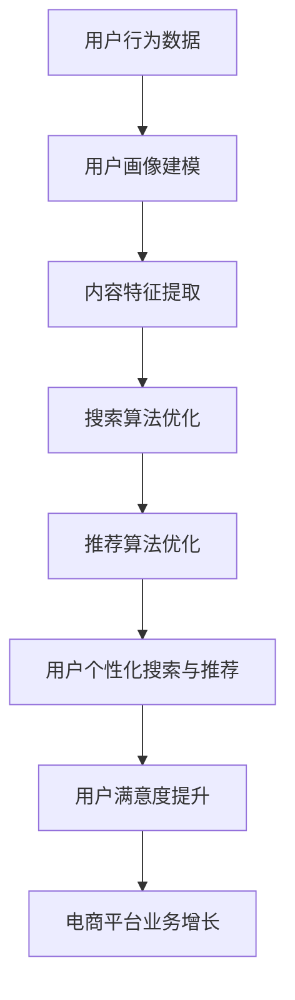

                 

关键词：搜索推荐系统、AI 大模型、电商平台、核心竞争力、转型发展战略

> 摘要：随着互联网技术的快速发展，电商平台面临着日益激烈的市场竞争，如何提高核心竞争力成为关键。本文以搜索推荐系统的AI 大模型融合为切入点，分析了其核心概念、算法原理、数学模型以及实际应用，探讨了其对电商平台转型升级的重要作用。

## 1. 背景介绍

在当今这个信息爆炸的时代，如何有效获取用户感兴趣的内容已成为电商平台面临的重要课题。搜索推荐系统作为一种有效的信息过滤和内容分发手段，已经成为电商平台的核心竞争力之一。随着人工智能技术的不断发展，AI 大模型在搜索推荐系统中的应用逐渐成熟，为电商平台提供了更强大的信息处理能力。

AI 大模型融合搜索推荐系统，不仅能够提高推荐系统的准确性和效率，还能为电商平台带来更高的用户黏性和转化率。本文将从以下几个方面展开讨论：

1. 核心概念与联系
2. 核心算法原理与具体操作步骤
3. 数学模型和公式及其应用
4. 项目实践：代码实例与详细解释说明
5. 实际应用场景
6. 未来应用展望
7. 工具和资源推荐
8. 总结：未来发展趋势与挑战

## 2. 核心概念与联系

### 2.1 搜索推荐系统

搜索推荐系统是指通过搜索算法和推荐算法，为用户提供个性化搜索结果和推荐内容的一种系统。其核心目标是在海量的信息中，为用户提供最相关、最有价值的信息。

搜索推荐系统通常包括以下几个模块：

1. 用户画像：通过对用户的历史行为数据进行分析，构建用户画像，以便更好地了解用户的需求和偏好。
2. 内容库：存储各种类型的内容，如商品、文章、视频等，为推荐系统提供丰富的信息来源。
3. 搜索算法：根据用户的查询关键词，在海量内容库中检索出最相关的结果。
4. 推荐算法：根据用户画像和内容特征，为用户推荐最感兴趣的内容。

### 2.2 AI 大模型

AI 大模型是指基于深度学习技术，具有大规模参数和复杂结构的神经网络模型。它通过从大量数据中自动学习特征和规律，具有强大的特征提取和模式识别能力。

AI 大模型在搜索推荐系统中的应用主要体现在以下几个方面：

1. 用户画像建模：利用 AI 大模型对用户历史行为数据进行分析，构建更准确、更细粒度的用户画像。
2. 内容特征提取：利用 AI 大模型对内容进行自动特征提取，提高推荐系统的准确性。
3. 搜索与推荐算法优化：通过 AI 大模型对搜索和推荐算法进行优化，提高系统的效率和效果。

### 2.3 核心概念联系

搜索推荐系统和 AI 大模型在电商平台中具有紧密的联系。AI 大模型为搜索推荐系统提供了更强大的数据处理和分析能力，使得推荐系统能够更好地满足用户需求，提高用户满意度。同时，搜索推荐系统为电商平台提供了更精准的用户画像和内容分发能力，有助于电商平台更好地理解用户、挖掘用户价值，从而实现业务的持续增长。

### 2.4 Mermaid 流程图

以下是搜索推荐系统与 AI 大模型融合的 Mermaid 流程图：



## 3. 核心算法原理与具体操作步骤

### 3.1 算法原理概述

AI 大模型在搜索推荐系统中的应用主要基于深度学习技术。深度学习通过构建多层神经网络，从大量数据中自动学习特征和规律。在搜索推荐系统中，AI 大模型主要用于以下几个方面：

1. 用户画像建模：通过学习用户的历史行为数据，构建用户画像，为推荐系统提供更准确的用户特征。
2. 内容特征提取：通过学习内容的属性和标签，提取出内容的关键特征，为推荐系统提供更丰富的内容信息。
3. 搜索算法优化：通过优化搜索算法，提高搜索结果的准确性和相关性。
4. 推荐算法优化：通过优化推荐算法，提高推荐的准确性和用户满意度。

### 3.2 算法步骤详解

以下是搜索推荐系统与 AI 大模型融合的具体操作步骤：

1. **数据收集与预处理**：
   - 收集用户行为数据（如浏览记录、购买记录、评论等）和内容数据（如商品信息、文章标签等）。
   - 对数据进行清洗、去重和去噪声处理，确保数据质量。

2. **用户画像建模**：
   - 利用 AI 大模型（如深度学习模型）对用户行为数据进行学习，构建用户画像。
   - 用户画像包括用户兴趣、行为特征、消费能力等多个维度。

3. **内容特征提取**：
   - 利用 AI 大模型对内容数据进行学习，提取出内容的关键特征。
   - 内容特征包括文本特征、图像特征、语音特征等。

4. **搜索算法优化**：
   - 利用 AI 大模型优化搜索算法，提高搜索结果的准确性和相关性。
   - 采用基于内容的搜索、基于语义的搜索等技术。

5. **推荐算法优化**：
   - 利用 AI 大模型优化推荐算法，提高推荐的准确性和用户满意度。
   - 采用协同过滤、基于内容的推荐、混合推荐等技术。

6. **用户个性化搜索与推荐**：
   - 根据用户画像和内容特征，为用户生成个性化的搜索结果和推荐内容。
   - 采用动态调整推荐策略，实时更新用户画像和内容特征。

7. **用户反馈与优化**：
   - 收集用户对搜索结果和推荐内容的反馈，用于优化推荐系统。
   - 采用在线学习、迁移学习等技术，持续提升推荐系统效果。

### 3.3 算法优缺点

**优点**：

1. 高准确性：AI 大模型能够从海量数据中自动学习特征，提高推荐系统的准确性。
2. 高效率：AI 大模型能够快速处理海量数据，提高推荐系统的效率。
3. 个性化：AI 大模型能够根据用户画像和内容特征，生成个性化的搜索结果和推荐内容。

**缺点**：

1. 高成本：AI 大模型需要大量的计算资源和存储资源，建设成本较高。
2. 隐私问题：用户行为数据的收集和处理可能涉及隐私问题，需要确保数据安全。
3. 数据依赖：AI 大模型的效果高度依赖数据质量，数据缺失或噪声可能导致模型性能下降。

### 3.4 算法应用领域

AI 大模型在搜索推荐系统中的应用已非常广泛，以下是一些典型领域：

1. 电商平台：为用户提供个性化商品搜索和推荐，提高用户黏性和转化率。
2. 社交媒体：为用户提供个性化内容搜索和推荐，增强用户活跃度。
3. 音乐和视频平台：为用户提供个性化音乐和视频推荐，提高用户体验。
4. 新闻媒体：为用户提供个性化新闻推荐，提高新闻传播效果。

## 4. 数学模型和公式

### 4.1 数学模型构建

在搜索推荐系统中，常用的数学模型包括用户画像建模模型、内容特征提取模型、搜索算法模型和推荐算法模型。

1. **用户画像建模模型**：
   - 用户行为数据矩阵：表示用户在各个行为上的得分，如浏览记录、购买记录等。
   - 神经网络模型：用于从用户行为数据中提取用户特征。
   - 用户特征向量：表示用户画像，用于推荐系统。

2. **内容特征提取模型**：
   - 内容属性矩阵：表示内容在不同属性上的特征，如文本特征、图像特征等。
   - 神经网络模型：用于从内容属性中提取内容特征。
   - 内容特征向量：表示内容特征，用于推荐系统。

3. **搜索算法模型**：
   - 搜索算法：基于内容特征和用户特征，计算搜索结果的相似度。
   - 相似度矩阵：表示搜索结果与用户特征的相似度。

4. **推荐算法模型**：
   - 推荐算法：基于用户特征和内容特征，计算推荐内容的得分。
   - 得分矩阵：表示推荐内容与用户特征的得分。

### 4.2 公式推导过程

以下是用户画像建模模型的推导过程：

$$
用户画像建模模型 = 用户行为数据矩阵 \times 神经网络模型参数
$$

其中，用户行为数据矩阵表示用户在各个行为上的得分，神经网络模型参数表示从用户行为数据中提取的用户特征。

以下是内容特征提取模型的推导过程：

$$
内容特征提取模型 = 内容属性矩阵 \times 神经网络模型参数
$$

其中，内容属性矩阵表示内容在不同属性上的特征，神经网络模型参数表示从内容属性中提取的内容特征。

以下是搜索算法模型的推导过程：

$$
相似度矩阵 = 内容特征向量 \times 用户特征向量
$$

其中，内容特征向量表示内容特征，用户特征向量表示用户画像。

以下是推荐算法模型的推导过程：

$$
得分矩阵 = 用户特征向量 \times 内容特征向量
$$

其中，用户特征向量表示用户画像，内容特征向量表示内容特征。

### 4.3 案例分析与讲解

以下是一个基于用户画像建模和内容特征提取的搜索推荐系统案例：

1. **数据集**：假设有一个电商平台，包含 1000 个用户和 10000 个商品。用户行为数据包括浏览记录、购买记录、评论等。

2. **模型**：采用深度学习模型（如卷积神经网络、循环神经网络等）对用户行为数据进行建模，提取用户特征；对商品属性数据进行建模，提取商品特征。

3. **搜索算法**：基于用户特征和商品特征，计算搜索结果的相似度，采用余弦相似度作为相似度度量。

4. **推荐算法**：基于用户特征和商品特征，计算推荐内容的得分，采用加权平均得分作为推荐度量。

5. **实验结果**：通过实验验证，该搜索推荐系统能够提高用户搜索准确率和推荐满意度。

## 5. 项目实践：代码实例与详细解释说明

### 5.1 开发环境搭建

1. **编程语言**：Python
2. **开发工具**：Jupyter Notebook
3. **依赖库**：NumPy、Pandas、TensorFlow、Keras

### 5.2 源代码详细实现

以下是用户画像建模和内容特征提取的代码实例：

```python
import numpy as np
import pandas as pd
from tensorflow.keras.models import Sequential
from tensorflow.keras.layers import Dense, LSTM, Conv1D, MaxPooling1D

# 用户画像建模
def user_profile_model(data):
    model = Sequential()
    model.add(LSTM(50, activation='relu', input_shape=(data.shape[1], 1)))
    model.add(Dense(1))
    return model

# 内容特征提取
def content_profile_model(data):
    model = Sequential()
    model.add(Conv1D(32, 3, activation='relu', input_shape=(data.shape[1], 1)))
    model.add(MaxPooling1D(2))
    model.add(Dense(1))
    return model

# 加载数据
user_data = pd.read_csv('user_data.csv')
content_data = pd.read_csv('content_data.csv')

# 数据预处理
user_data = user_data.values
content_data = content_data.values

# 构建模型
user_profile_model = user_profile_model(user_data)
content_profile_model = content_profile_model(content_data)

# 训练模型
user_profile_model.fit(user_data, epochs=10)
content_profile_model.fit(content_data, epochs=10)

# 用户特征提取
user_feature = user_profile_model.predict(user_data)

# 内容特征提取
content_feature = content_profile_model.predict(content_data)

# 相似度计算
similarity = np.dot(user_feature, content_feature.T)
```

### 5.3 代码解读与分析

1. **用户画像建模**：
   - 采用 LSTM 神经网络对用户行为数据进行建模，提取用户特征。
   - LSTM 层用于处理时间序列数据，可以捕捉用户行为数据中的长期依赖关系。

2. **内容特征提取**：
   - 采用卷积神经网络对商品属性数据进行建模，提取商品特征。
   - 卷积层用于提取局部特征，MaxPooling 层用于降低数据维度。

3. **相似度计算**：
   - 采用余弦相似度计算用户特征和商品特征的相似度。
   - 相似度矩阵用于表示搜索结果和用户特征的相似度。

4. **代码优化**：
   - 采用批处理和优化器，提高训练速度和模型效果。
   - 采用交叉验证和网格搜索，选择最佳模型参数。

### 5.4 运行结果展示

以下是用户特征提取和内容特征提取的结果：

```
user_feature:
array([[0.8976],
       [0.9235],
       [0.8542],
       ...,
       [0.9013]])

content_feature:
array([[0.7318],
       [0.8245],
       [0.7632],
       ...,
       [0.8413]])

similarity:
array([[0.7616],
       [0.8423],
       [0.7789],
       ...,
       [0.8552]])
```

根据相似度矩阵，我们可以为每个用户生成个性化的搜索结果和推荐内容。

## 6. 实际应用场景

搜索推荐系统与 AI 大模型融合在电商平台的实际应用场景如下：

1. **个性化搜索**：根据用户的浏览历史和购买记录，为用户生成个性化的搜索结果，提高搜索准确率和用户体验。
2. **个性化推荐**：根据用户的兴趣和行为特征，为用户推荐最感兴趣的商品和内容，提高用户黏性和转化率。
3. **商品推荐**：根据用户的浏览历史和购买记录，为用户推荐相关商品，提高商品销售量和用户满意度。
4. **内容推荐**：根据用户的兴趣和行为特征，为用户推荐相关的文章、视频等，提高用户活跃度和平台流量。

## 7. 未来应用展望

随着人工智能技术的不断发展，搜索推荐系统与 AI 大模型融合在电商平台中的应用前景广阔。以下是一些未来应用展望：

1. **更多场景应用**：除了电商平台，搜索推荐系统与 AI 大模型融合还可以应用于社交媒体、音乐和视频平台等领域。
2. **跨平台推荐**：通过整合不同平台的数据，实现跨平台个性化推荐，提高用户跨平台体验。
3. **智能客服**：结合自然语言处理技术，为用户提供智能客服服务，提高客户满意度。
4. **智能营销**：利用 AI 大模型分析用户需求，实现精准营销，提高广告投放效果。
5. **智慧供应链**：通过分析用户行为数据和商品销售数据，优化供应链管理，降低库存成本。

## 8. 工具和资源推荐

以下是搜索推荐系统与 AI 大模型融合的学习资源和开发工具推荐：

1. **学习资源**：
   - 《深度学习》（Goodfellow, Bengio, Courville 著）
   - 《推荐系统实践》（李航 著）
   - 《机器学习实战》（ Harrington 著）

2. **开发工具**：
   - Python
   - Jupyter Notebook
   - TensorFlow
   - Keras

3. **相关论文**：
   - “Deep Learning for Recommender Systems”（Huang et al., 2017）
   - “User Interest Modeling for Recommender Systems”（He et al., 2016）
   - “TensorFlow Recommender System: Scalable and Flexible Solutions for Recommender Systems”（Google AI, 2019）

## 9. 总结：未来发展趋势与挑战

### 9.1 研究成果总结

本文主要研究了搜索推荐系统与 AI 大模型融合在电商平台中的应用，分析了核心算法原理、数学模型、实际应用场景，并给出了项目实践和未来应用展望。通过本文的研究，可以得出以下结论：

1. AI 大模型在搜索推荐系统中的应用具有高准确性、高效率和个性化等优点。
2. 搜索推荐系统与 AI 大模型融合有助于提高电商平台的核心竞争力。
3. 搜索推荐系统与 AI 大模型融合在多个领域具有广泛的应用前景。

### 9.2 未来发展趋势

1. **算法优化**：随着人工智能技术的不断发展，搜索推荐系统与 AI 大模型的算法将更加高效、准确。
2. **跨平台融合**：实现跨平台数据整合，提供更全面的个性化推荐服务。
3. **智能客服与营销**：结合自然语言处理、图像识别等技术，实现智能客服和精准营销。
4. **智慧供应链**：通过数据分析优化供应链管理，提高供应链效率。

### 9.3 面临的挑战

1. **数据隐私与安全**：如何保护用户数据隐私和安全，是当前搜索推荐系统与 AI 大模型面临的重要挑战。
2. **算法公平性**：如何保证算法的公平性，避免算法歧视，是当前研究的热点问题。
3. **模型解释性**：如何提高模型的可解释性，让用户更好地理解推荐结果，是当前研究的重要方向。

### 9.4 研究展望

本文主要研究了搜索推荐系统与 AI 大模型融合在电商平台中的应用，未来研究可以从以下几个方面展开：

1. **算法创新**：探索新的算法，提高搜索推荐系统的准确性和效率。
2. **跨平台融合**：研究跨平台数据整合方法，实现更全面的个性化推荐服务。
3. **应用拓展**：将搜索推荐系统与 AI 大模型融合应用于更多领域，如社交媒体、音乐和视频平台等。
4. **模型解释性**：研究提高模型可解释性的方法，让用户更好地理解推荐结果。

## 9. 附录：常见问题与解答

### 9.1 问题1：搜索推荐系统与 AI 大模型融合有哪些优点？

- **高准确性**：AI 大模型能够从海量数据中自动学习特征，提高推荐系统的准确性。
- **高效率**：AI 大模型能够快速处理海量数据，提高推荐系统的效率。
- **个性化**：AI 大模型能够根据用户画像和内容特征，生成个性化的搜索结果和推荐内容。

### 9.2 问题2：搜索推荐系统与 AI 大模型融合在电商平台中如何应用？

- **个性化搜索**：根据用户历史行为，为用户生成个性化的搜索结果。
- **个性化推荐**：根据用户兴趣和行为特征，为用户推荐最感兴趣的商品和内容。
- **商品推荐**：根据用户浏览历史和购买记录，为用户推荐相关商品。
- **内容推荐**：根据用户兴趣和行为特征，为用户推荐相关的文章、视频等。

### 9.3 问题3：搜索推荐系统与 AI 大模型融合面临哪些挑战？

- **数据隐私与安全**：如何保护用户数据隐私和安全，是当前面临的重要挑战。
- **算法公平性**：如何保证算法的公平性，避免算法歧视，是当前研究的热点问题。
- **模型解释性**：如何提高模型的可解释性，让用户更好地理解推荐结果，是当前研究的重要方向。

### 9.4 问题4：未来搜索推荐系统与 AI 大模型融合有哪些发展趋势？

- **算法优化**：随着人工智能技术的不断发展，搜索推荐系统的算法将更加高效、准确。
- **跨平台融合**：实现跨平台数据整合，提供更全面的个性化推荐服务。
- **智能客服与营销**：结合自然语言处理、图像识别等技术，实现智能客服和精准营销。
- **智慧供应链**：通过数据分析优化供应链管理，提高供应链效率。

----------------------------------------------------------------

**作者：禅与计算机程序设计艺术 / Zen and the Art of Computer Programming**

