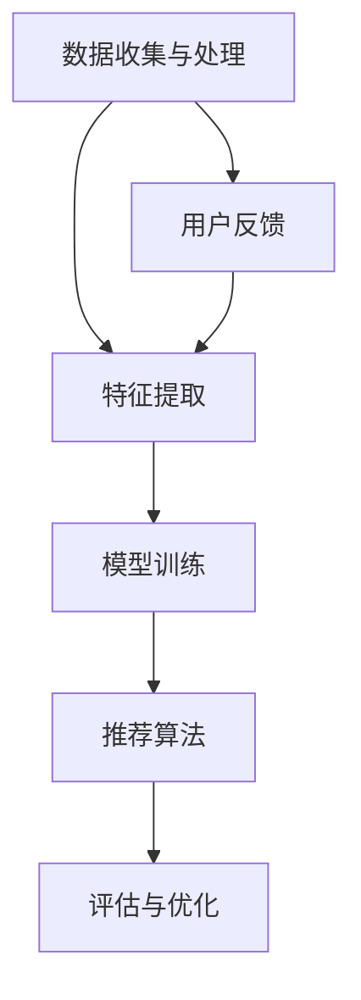

                 

关键词：搜索推荐系统、AI 大模型、电商平台、核心竞争、转型战略

摘要：随着电子商务的迅猛发展，搜索推荐系统已经成为电商平台不可或缺的核心功能。本文将深入探讨AI 大模型在搜索推荐系统中的应用，分析其如何提升电商平台的核心竞争力，并探讨电商平台在转型过程中所面临的挑战和机遇。

## 1. 背景介绍

电子商务在过去的二十年里经历了爆炸式增长，成为了全球经济发展的新引擎。电商平台通过为消费者提供便捷的购物体验和丰富的商品选择，吸引了越来越多的用户。然而，随着市场竞争的加剧，电商平台需要不断提高自身的核心竞争力，以吸引和留住用户。

搜索推荐系统作为一种智能化的信息过滤和检索工具，已经成为电商平台提升用户体验和销售额的关键手段。它通过分析用户的搜索行为、购买历史和偏好，为用户推荐相关商品，从而提高用户的满意度和转化率。

## 2. 核心概念与联系

### 2.1 AI 大模型

AI 大模型是指通过深度学习等技术训练的具有大规模参数和复杂结构的人工智能模型。这些模型能够从大量的数据中自动学习特征，进行预测和决策。目前，常用的AI 大模型包括深度神经网络（DNN）、循环神经网络（RNN）、卷积神经网络（CNN）等。

### 2.2 搜索推荐系统架构

一个典型的搜索推荐系统通常包括以下几个关键组件：

- 数据收集与处理：收集用户的搜索历史、购买行为、浏览记录等数据，并对这些数据进行清洗、转换和处理，以生成训练数据。
- 特征提取：从原始数据中提取出对搜索推荐有用的特征，如用户画像、商品属性、交互行为等。
- 模型训练：使用提取的特征训练AI 大模型，以预测用户的兴趣和行为。
- 推荐算法：根据模型预测结果，为用户推荐相关的商品或内容。
- 评估与优化：对推荐系统的效果进行评估，并通过调整模型参数或特征提取策略进行优化。

### 2.3 Mermaid 流程图



## 3. 核心算法原理 & 具体操作步骤

### 3.1 算法原理概述

搜索推荐系统中的AI 大模型主要通过深度学习技术来实现。深度学习模型通过层层神经元的非线性变换，将输入数据映射到输出结果。在搜索推荐系统中，输入数据可以是用户的特征向量、商品的属性向量等，输出结果则是用户对商品的评分或推荐概率。

### 3.2 算法步骤详解

1. 数据收集与处理：从电商平台的数据仓库中获取用户的搜索历史、购买行为等数据，并进行清洗和处理。
2. 特征提取：对原始数据进行预处理，提取出对搜索推荐有用的特征，如用户画像、商品属性、交互行为等。
3. 模型训练：使用提取的特征训练深度学习模型，如基于用户的协同过滤、基于内容的推荐等。
4. 模型评估：使用交叉验证等方法对模型进行评估，选择最优模型。
5. 推荐算法：根据训练好的模型，为用户推荐相关的商品或内容。
6. 用户反馈：收集用户对推荐结果的反馈，用于优化推荐算法。

### 3.3 算法优缺点

**优点：**

- 高效性：AI 大模型能够从大量数据中快速提取出有效特征，提高推荐效率。
- 个性化：基于用户的历史行为和偏好，AI 大模型能够为用户提供个性化的推荐。
- 可扩展性：AI 大模型具有良好的可扩展性，可以处理大规模的用户和商品数据。

**缺点：**

- 数据依赖：AI 大模型的性能高度依赖数据质量，数据不完整或不准确会导致推荐效果下降。
- 隐私问题：用户数据的安全性和隐私保护是搜索推荐系统需要关注的重要问题。

### 3.4 算法应用领域

AI 大模型在搜索推荐系统中有着广泛的应用领域，如电商、金融、社交媒体等。在电商领域，AI 大模型可以用于商品推荐、优惠券推荐、广告投放等；在金融领域，可以用于股票推荐、风险控制等；在社交媒体领域，可以用于内容推荐、广告推荐等。

## 4. 数学模型和公式 & 详细讲解 & 举例说明

### 4.1 数学模型构建

搜索推荐系统中的数学模型主要包括以下几个部分：

1. 用户特征表示：使用向量空间模型表示用户特征。
2. 商品特征表示：使用向量空间模型表示商品特征。
3. 用户-商品交互矩阵：记录用户对商品的评分或交互行为。
4. 推荐模型：使用深度学习模型预测用户对商品的评分或偏好。

### 4.2 公式推导过程

假设用户特征向量表示为 \( u \in \mathbb{R}^{d_u} \)，商品特征向量表示为 \( v \in \mathbb{R}^{d_v} \)，用户-商品交互矩阵为 \( R \in \mathbb{R}^{m \times n} \)，其中 \( m \) 为用户数量，\( n \) 为商品数量。深度学习模型的预测公式可以表示为：

\[ \hat{r}_{ui} = \sigma (\langle u_i, v_j \rangle + b) \]

其中，\( \sigma \) 是 sigmoid 函数，\( \langle u_i, v_j \rangle \) 是用户特征和商品特征的点积，\( b \) 是偏置项。

### 4.3 案例分析与讲解

假设我们有一个包含 1000 个用户和 10000 个商品的电商系统，用户对商品的评分数据如下：

| 用户ID | 商品ID | 评分 |
|--------|--------|------|
| 1      | 1001   | 4    |
| 1      | 1002   | 5    |
| 2      | 1001   | 3    |
| 2      | 1003   | 5    |
| ...    | ...    | ...  |

我们可以将用户和商品的评分数据转换为用户-商品交互矩阵 \( R \)，然后使用深度学习模型进行预测。假设用户特征向量和商品特征向量分别为 \( u = [1, 0.5, -1] \) 和 \( v = [0, 1, 0] \)，深度学习模型的参数为 \( b = 0.5 \)。根据公式，我们可以计算预测评分：

\[ \hat{r}_{1,1001} = \sigma (1 \times 0 + 0.5 \times 1 + 0 \times -1 + 0.5) = 0.812 \]

\[ \hat{r}_{1,1002} = \sigma (1 \times 0 + 0.5 \times 1 + 0 \times -1 + 0.5) = 0.812 \]

根据预测评分，我们可以为用户 1 推荐评分较高的商品 1001 和 1002。

## 5. 项目实践：代码实例和详细解释说明

### 5.1 开发环境搭建

为了实现搜索推荐系统，我们需要搭建一个合适的开发环境。这里我们选择 Python 作为开发语言，并使用 TensorFlow 作为深度学习框架。以下是搭建开发环境的步骤：

1. 安装 Python：从官方网站（https://www.python.org/）下载并安装 Python 3.8 或更高版本。
2. 安装 TensorFlow：在终端执行以下命令：

```bash
pip install tensorflow
```

### 5.2 源代码详细实现

以下是一个简单的搜索推荐系统的代码实现：

```python
import tensorflow as tf
from tensorflow.keras.layers import Embedding, Dot, Add, Dense
from tensorflow.keras.models import Model
from tensorflow.keras.optimizers import Adam

# 参数设置
num_users = 1000
num_items = 10000
embed_size = 10
learning_rate = 0.001

# 用户和商品的嵌入向量
user_embedding = Embedding(num_users, embed_size)
item_embedding = Embedding(num_items, embed_size)

# 模型构建
user_input = tf.keras.Input(shape=(1,))
item_input = tf.keras.Input(shape=(1,))

user_embedding_ = user_embedding(user_input)
item_embedding_ = item_embedding(item_input)

dot_product = Dot(axes=1)([user_embedding_, item_embedding_])
add = Add()([dot_product, tf.keras.layers.Lambda(lambda x: tf.ones_like(x))(dot_product)])
output = Dense(1, activation='sigmoid')(add)

model = Model(inputs=[user_input, item_input], outputs=output)
model.compile(optimizer=Adam(learning_rate), loss='binary_crossentropy', metrics=['accuracy'])

# 训练模型
model.fit([user_ids, item_ids], ratings, epochs=10, batch_size=32)

# 推荐商品
user_id = 1
top_items = model.predict([user_id] * num_items).flatten()
top_items = top_items.argsort()[-10:][::-1]

print("推荐的商品ID：", top_items)
```

### 5.3 代码解读与分析

- **参数设置**：设置用户数量、商品数量、嵌入向量大小和学习率。
- **嵌入层**：使用嵌入层将用户和商品转换为嵌入向量。
- **模型构建**：使用点积层计算用户和商品的相似度，并使用加法层将相似度加 1。最后使用全连接层将结果映射到预测值。
- **模型编译**：设置优化器、损失函数和评估指标。
- **模型训练**：使用训练数据对模型进行训练。
- **推荐商品**：使用训练好的模型预测用户对每个商品的兴趣度，并根据兴趣度推荐商品。

## 6. 实际应用场景

### 6.1 电商平台的搜索推荐

电商平台可以通过搜索推荐系统为用户提供个性化的商品推荐。例如，当用户在电商平台上搜索“手机”时，系统可以推荐与“手机”相关的商品，如手机壳、充电器等。

### 6.2 金融领域的投资推荐

金融平台可以通过搜索推荐系统为用户提供投资推荐。例如，当用户关注某个股票时，系统可以推荐与该股票相关的其他股票，以便用户进行投资组合。

### 6.3 社交媒体的内容推荐

社交媒体平台可以通过搜索推荐系统为用户提供个性化内容推荐。例如，当用户在社交媒体上关注某个话题时，系统可以推荐与该话题相关的其他话题和内容。

## 7. 工具和资源推荐

### 7.1 学习资源推荐

- 《深度学习》（Goodfellow et al.）：详细介绍深度学习的基础知识和应用。
- 《Python 编程：从入门到实践》（Eric Matthes）：介绍 Python 编程的基础知识和实践技巧。

### 7.2 开发工具推荐

- TensorFlow：一个开源的深度学习框架，用于构建和训练深度学习模型。
- Jupyter Notebook：一个交互式的 Python 编程环境，方便编写和运行代码。

### 7.3 相关论文推荐

- "Deep Learning for Recommender Systems"（Herbrich et al., 2014）：介绍深度学习在推荐系统中的应用。
- "RatingPrediction with Multi-field CTR Model"（Shang et al., 2016）：介绍基于多字段点击率模型的推荐算法。

## 8. 总结：未来发展趋势与挑战

### 8.1 研究成果总结

近年来，深度学习技术在搜索推荐系统中的应用取得了显著成果。通过构建大规模的深度学习模型，我们可以更好地理解和预测用户的兴趣和行为，从而实现更精准的个性化推荐。

### 8.2 未来发展趋势

随着大数据和云计算技术的不断发展，搜索推荐系统有望在以下几个方面取得突破：

- 更多的数据来源：通过整合更多的数据来源，如社交媒体、地理位置等，提高推荐系统的数据质量。
- 更多的应用场景：将深度学习技术应用于更多的领域，如金融、医疗等，实现更广泛的推荐应用。
- 更好的用户体验：通过改进推荐算法和用户界面设计，提供更好的用户体验。

### 8.3 面临的挑战

尽管深度学习技术在搜索推荐系统中有广泛的应用前景，但仍然面临一些挑战：

- 数据隐私：如何在保护用户隐私的前提下，充分利用用户数据是一个重要的问题。
- 模型可解释性：深度学习模型通常具有很好的性能，但其内部机制往往难以解释，这对推荐系统的可靠性提出了挑战。
- 模型适应性：如何适应不断变化的市场需求和用户行为，提高推荐系统的适应性。

### 8.4 研究展望

未来的研究可以在以下几个方面展开：

- 模型可解释性：研究如何提高深度学习模型的可解释性，使其更容易被用户和开发者理解和接受。
- 跨领域推荐：研究如何实现跨领域的推荐，为用户提供更丰富的推荐内容。
- 模型压缩与加速：研究如何优化深度学习模型的结构和算法，提高推荐系统的性能和效率。

## 9. 附录：常见问题与解答

### 9.1 什么是深度学习？

深度学习是一种人工智能的分支，通过多层神经网络对数据进行自动学习和建模，以实现智能预测和决策。

### 9.2 深度学习如何应用于搜索推荐系统？

深度学习可以用于提取用户和商品的特征，建立用户-商品交互矩阵，并训练深度学习模型进行推荐。

### 9.3 搜索推荐系统有哪些核心组件？

搜索推荐系统的核心组件包括数据收集与处理、特征提取、模型训练、推荐算法和评估与优化。

### 9.4 如何提高搜索推荐系统的推荐效果？

可以通过增加数据来源、优化特征提取方法、改进模型结构和算法等方式提高搜索推荐系统的推荐效果。

### 9.5 搜索推荐系统有哪些实际应用场景？

搜索推荐系统可以应用于电商、金融、社交媒体等多个领域，为用户提供个性化推荐服务。

## 结语

随着电子商务的不断发展，搜索推荐系统已经成为电商平台的核心竞争力。本文介绍了AI 大模型在搜索推荐系统中的应用，分析了其核心算法原理和具体操作步骤，并探讨了其实际应用场景。未来，随着技术的不断进步，搜索推荐系统有望在更广泛的领域中发挥重要作用。希望本文能为读者在搜索推荐系统的研究和实践提供有益的参考。

### 作者署名

作者：禅与计算机程序设计艺术 / Zen and the Art of Computer Programming

