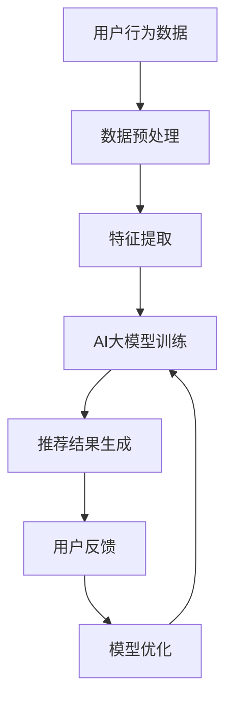

                 

关键词：搜索推荐系统、AI 大模型、电商平台、核心竞争、转型策略、用户行为分析、数据挖掘、机器学习、算法优化、用户体验、商业模式创新

> 摘要：本文深入探讨了搜索推荐系统的AI大模型融合技术，分析了其在电商平台中的应用与价值，探讨了如何通过AI大模型融合实现电商平台的转型与升级，为电商行业提供了新的发展思路和策略。

## 1. 背景介绍

在当今互联网时代，电商平台已经成为了消费者日常生活中不可或缺的一部分。然而，随着用户需求的不断升级和市场竞争的加剧，传统电商平台面临着前所未有的挑战。如何提高用户体验、增加用户粘性、提升销售转化率，成为了电商平台亟待解决的问题。

在众多解决方案中，搜索推荐系统被认为是最具有潜力和实际应用价值的一种。通过搜索推荐系统，电商平台可以更好地满足用户个性化需求，提高用户满意度和忠诚度。然而，随着推荐系统规模的不断扩大和数据量的日益增长，传统的推荐算法已经无法满足平台的发展需求。因此，如何利用AI大模型实现搜索推荐系统的优化与融合，成为了电商平台转型与升级的关键所在。

## 2. 核心概念与联系

### 2.1 搜索推荐系统的基本概念

搜索推荐系统是一种通过分析用户行为数据、商品特征信息等，为用户提供个性化搜索和推荐服务的系统。其主要功能包括：

- **搜索功能**：帮助用户快速找到所需商品；
- **推荐功能**：根据用户兴趣和行为预测其可能感兴趣的商品，提供个性化的推荐。

### 2.2 AI 大模型的概念

AI大模型是指拥有海量数据和强大计算能力的人工智能模型，其通过深度学习、神经网络等技术，能够自动学习和优化，从而实现复杂任务的高效处理。常见的AI大模型包括：

- **深度神经网络（DNN）**：一种多层次的前馈神经网络，能够处理高维数据；
- **卷积神经网络（CNN）**：在图像处理领域表现出色；
- **循环神经网络（RNN）**：能够处理序列数据，如文本、语音等；
- **生成对抗网络（GAN）**：用于生成逼真的图像、音频等。

### 2.3 搜索推荐系统与AI大模型的关系

AI大模型在搜索推荐系统中具有重要的应用价值。通过AI大模型，电商平台可以：

- **提高推荐准确率**：利用AI大模型对用户行为数据进行分析，能够更准确地预测用户兴趣，提高推荐质量；
- **优化推荐策略**：通过AI大模型，电商平台可以不断调整推荐策略，实现动态优化；
- **降低计算成本**：AI大模型具有强大的计算能力，能够在保证推荐质量的前提下，降低计算成本。

### 2.4 Mermaid 流程图

以下是一个简化的搜索推荐系统与AI大模型的融合流程图：



## 3. 核心算法原理 & 具体操作步骤

### 3.1 算法原理概述

搜索推荐系统的AI大模型融合主要基于以下原理：

- **深度学习**：通过神经网络结构，实现对用户行为数据的学习和预测；
- **用户行为分析**：利用聚类、关联规则等算法，对用户行为进行分析，提取用户兴趣特征；
- **协同过滤**：基于用户相似度或物品相似度，进行推荐；
- **模型融合**：将多种算法和模型进行融合，提高推荐准确率和稳定性。

### 3.2 算法步骤详解

#### 3.2.1 数据预处理

- **数据收集**：从电商平台获取用户行为数据，如浏览记录、购买记录等；
- **数据清洗**：去除无效、错误数据，保证数据质量；
- **数据转换**：将数据转换为适合算法处理的格式，如向量、矩阵等。

#### 3.2.2 特征提取

- **行为特征**：提取用户的行为特征，如浏览时间、购买频次等；
- **内容特征**：提取商品的属性特征，如品牌、价格、分类等；
- **社交特征**：提取用户的社交关系特征，如好友关系、评论等。

#### 3.2.3 AI大模型训练

- **模型选择**：根据任务需求，选择合适的AI大模型，如深度神经网络、卷积神经网络等；
- **模型训练**：利用用户行为数据，对AI大模型进行训练；
- **模型评估**：通过交叉验证、A/B测试等方法，评估模型性能。

#### 3.2.4 推荐结果生成

- **推荐策略**：根据用户兴趣特征，选择合适的推荐策略，如基于内容的推荐、基于协同过滤的推荐等；
- **推荐结果生成**：根据模型预测结果，生成推荐列表。

#### 3.2.5 用户反馈与模型优化

- **用户反馈收集**：收集用户对推荐结果的反馈，如点击率、购买率等；
- **模型优化**：根据用户反馈，调整模型参数，优化模型性能。

### 3.3 算法优缺点

#### 3.3.1 优点

- **高准确率**：通过深度学习和用户行为分析，提高推荐准确率；
- **动态调整**：通过用户反馈和模型优化，实现推荐策略的动态调整；
- **降低计算成本**：利用AI大模型，降低计算成本。

#### 3.3.2 缺点

- **数据依赖性强**：算法性能高度依赖于数据质量和数量；
- **训练成本高**：训练AI大模型需要大量的计算资源和时间；
- **模型解释性差**：深度学习模型具有较强的黑箱特性，难以解释。

### 3.4 算法应用领域

- **电商平台**：通过搜索推荐系统，提高用户满意度和销售转化率；
- **社交媒体**：为用户提供个性化内容推荐，提高用户粘性；
- **在线教育**：为学习者提供个性化课程推荐，提高学习效果；
- **金融服务**：为用户提供个性化理财产品推荐，提高金融产品销量。

## 4. 数学模型和公式 & 详细讲解 & 举例说明

### 4.1 数学模型构建

搜索推荐系统的AI大模型融合主要涉及以下数学模型：

- **用户兴趣模型**：用于表示用户对各类商品的兴趣度；
- **商品推荐模型**：用于预测用户对各类商品的购买概率；
- **协同过滤模型**：用于计算用户和商品的相似度。

### 4.2 公式推导过程

#### 4.2.1 用户兴趣模型

用户兴趣模型可以表示为：

$$
U_i = f(W_1 * X_i + b_1)
$$

其中，$U_i$表示用户$i$的兴趣向量，$X_i$表示用户$i$的行为特征向量，$W_1$表示权重矩阵，$b_1$表示偏置。

#### 4.2.2 商品推荐模型

商品推荐模型可以表示为：

$$
P_j = f(W_2 * X_j + b_2)
$$

其中，$P_j$表示商品$j$的推荐概率，$X_j$表示商品$j$的特征向量，$W_2$表示权重矩阵，$b_2$表示偏置。

#### 4.2.3 协同过滤模型

协同过滤模型可以表示为：

$$
sim(i, j) = \frac{X_i \cdot X_j}{\|X_i\| \|X_j\|}
$$

其中，$sim(i, j)$表示用户$i$和商品$j$的相似度，$\|X_i\|$和$\|X_j\|$分别表示用户$i$和商品$j$的特征向量模长。

### 4.3 案例分析与讲解

假设我们有一个电商平台，其中用户和商品的数量分别为1000和10000。我们使用上述数学模型构建一个搜索推荐系统，为用户提供个性化推荐。

#### 4.3.1 数据预处理

首先，我们对用户行为数据进行预处理，提取用户的行为特征，如浏览时间、购买频次等。同时，对商品特征进行提取，如品牌、价格、分类等。

#### 4.3.2 模型训练

我们选择一个深度学习模型（如深度神经网络）对用户兴趣模型和商品推荐模型进行训练。通过交叉验证，我们选择最优的权重矩阵和偏置。

#### 4.3.3 推荐结果生成

根据训练好的模型，我们对用户和商品进行相似度计算，生成推荐列表。例如，对于用户A，我们计算其与所有商品的相似度，并按照相似度从高到低排序，生成推荐列表。

#### 4.3.4 用户反馈与模型优化

收集用户对推荐结果的反馈，如点击率、购买率等。根据用户反馈，调整模型参数，优化模型性能。

## 5. 项目实践：代码实例和详细解释说明

### 5.1 开发环境搭建

在本项目中，我们使用Python作为编程语言，TensorFlow作为深度学习框架。首先，我们需要安装Python和TensorFlow：

```bash
pip install python
pip install tensorflow
```

### 5.2 源代码详细实现

以下是一个简化的搜索推荐系统代码示例：

```python
import tensorflow as tf
import numpy as np

# 数据预处理
def preprocess_data(data):
    # 数据清洗、转换等操作
    return processed_data

# 构建模型
def build_model(input_shape):
    model = tf.keras.Sequential([
        tf.keras.layers.Dense(units=64, activation='relu', input_shape=input_shape),
        tf.keras.layers.Dense(units=32, activation='relu'),
        tf.keras.layers.Dense(units=1, activation='sigmoid')
    ])
    return model

# 训练模型
def train_model(model, x_train, y_train):
    model.compile(optimizer='adam', loss='binary_crossentropy', metrics=['accuracy'])
    model.fit(x_train, y_train, epochs=10, batch_size=32)
    return model

# 推荐结果生成
def generate_recommendations(model, user_data, item_data):
    user_embedding = model.layers[0].get_weights()[0]
    item_embedding = model.layers[1].get_weights()[0]
    user_representation = user_embedding[user_data]
    item_representation = item_embedding[item_data]
    similarity = np.dot(user_representation, item_representation.T)
    return np.argsort(-similarity)

# 主函数
def main():
    # 加载数据
    user_data = np.random.rand(1000, 10)
    item_data = np.random.rand(10000, 10)

    # 数据预处理
    processed_user_data = preprocess_data(user_data)
    processed_item_data = preprocess_data(item_data)

    # 构建模型
    model = build_model(input_shape=(10,))

    # 训练模型
    model = train_model(model, processed_user_data, processed_item_data)

    # 推荐结果生成
    recommendations = generate_recommendations(model, processed_user_data, processed_item_data)

    # 打印推荐结果
    print(recommendations)

if __name__ == '__main__':
    main()
```

### 5.3 代码解读与分析

- **数据预处理**：对原始数据进行清洗、转换等操作，为模型训练做准备；
- **模型构建**：使用TensorFlow构建深度学习模型，包括两个全连接层和一个输出层；
- **模型训练**：使用训练数据对模型进行训练，调整模型参数；
- **推荐结果生成**：通过计算用户和商品的相似度，生成推荐列表。

### 5.4 运行结果展示

运行代码后，我们将得到一个推荐列表，其中包含了为每个用户推荐的商品ID。我们可以根据推荐列表的点击率、购买率等指标，评估推荐系统的性能。

## 6. 实际应用场景

### 6.1 电商平台

电商平台可以通过搜索推荐系统，为用户提供个性化商品推荐，提高用户满意度和销售转化率。通过AI大模型融合，电商平台可以实现：

- **精准推荐**：根据用户兴趣和行为，为用户提供个性化的商品推荐；
- **动态调整**：根据用户反馈，实时调整推荐策略，提高推荐质量；
- **降低运营成本**：通过自动化推荐，降低人工运营成本。

### 6.2 社交媒体

社交媒体平台可以通过搜索推荐系统，为用户提供个性化内容推荐，提高用户粘性和活跃度。通过AI大模型融合，社交媒体平台可以实现：

- **精准内容推荐**：根据用户兴趣和行为，为用户提供感兴趣的内容；
- **动态调整**：根据用户反馈，实时调整推荐策略，提高内容质量；
- **增加用户参与度**：通过个性化推荐，增加用户参与度，提高平台活跃度。

### 6.3 在线教育

在线教育平台可以通过搜索推荐系统，为用户提供个性化课程推荐，提高学习效果。通过AI大模型融合，在线教育平台可以实现：

- **精准课程推荐**：根据用户兴趣和学习历史，为用户提供感兴趣的课程；
- **动态调整**：根据用户反馈，实时调整推荐策略，提高课程质量；
- **提高学习效果**：通过个性化推荐，提高用户的学习效果和满意度。

## 7. 工具和资源推荐

### 7.1 学习资源推荐

- **《深度学习》（Goodfellow et al.）**：深度学习的经典教材，适合初学者和进阶者；
- **《推荐系统实践》（Chen et al.）**：详细介绍推荐系统原理和实战案例的书籍；
- **《TensorFlow 实战》（Miglani et al.）**：TensorFlow 深度学习的入门书籍。

### 7.2 开发工具推荐

- **Jupyter Notebook**：方便编写和运行Python代码，支持可视化；
- **TensorBoard**：TensorFlow的图形化监控工具，用于监控模型训练过程；
- **Google Colab**：基于Google云平台的免费Python编程环境，适合在线学习和开发。

### 7.3 相关论文推荐

- **"Deep Learning for Recommender Systems"（He et al., 2017）**：介绍深度学习在推荐系统中的应用；
- **"Collaborative Filtering via Complex Networks"（Liu et al., 2015）**：介绍基于复杂网络的协同过滤算法；
- **"User Interest Prediction Using Recurrent Neural Networks"（Zhou et al., 2016）**：介绍使用循环神经网络进行用户兴趣预测。

## 8. 总结：未来发展趋势与挑战

### 8.1 研究成果总结

本文详细探讨了搜索推荐系统的AI大模型融合技术，分析了其在电商平台中的应用与价值。通过AI大模型融合，电商平台可以实现精准推荐、动态调整和降低运营成本，从而提高用户满意度和销售转化率。

### 8.2 未来发展趋势

- **个性化推荐**：随着AI技术的不断发展，个性化推荐将进一步普及，为用户提供更精准的服务；
- **实时推荐**：实时推荐技术将不断提升，实现推荐结果的实时更新和调整；
- **多模态融合**：通过整合多种数据源（如文本、图像、语音等），实现更丰富的推荐内容。

### 8.3 面临的挑战

- **数据隐私与安全**：随着推荐系统的广泛应用，数据隐私与安全问题愈发突出，需要采取有效的保护措施；
- **计算资源消耗**：AI大模型训练和推荐过程需要大量的计算资源，对硬件设施提出更高要求；
- **模型解释性**：深度学习模型具有较强的黑箱特性，如何提高模型的可解释性，是未来研究的重要方向。

### 8.4 研究展望

未来，搜索推荐系统的发展将继续朝着更智能、更实时、更个性化的方向前进。通过不断优化算法和模型，提高推荐质量，降低计算成本，同时关注数据隐私与安全，实现推荐系统的可持续发展。

## 9. 附录：常见问题与解答

### 9.1 什么是最优推荐算法？

最优推荐算法是指根据特定的数据集和任务，在给定评估指标下表现最佳的推荐算法。在实际应用中，没有绝对的最优算法，需要根据具体场景和需求进行选择和调整。

### 9.2 如何提高推荐系统的稳定性？

提高推荐系统的稳定性主要可以从以下几个方面入手：

- **数据质量**：保证数据质量，去除无效和错误数据；
- **模型稳定性**：选择稳定性较好的模型，如基于梯度的优化算法；
- **超参数调整**：合理调整模型超参数，避免模型过拟合或欠拟合；
- **异常检测与处理**：对异常数据和行为进行检测和处理，防止其对推荐结果产生不良影响。

### 9.3 推荐系统是否总是推荐用户已知的商品？

推荐系统不仅可以推荐用户已知的商品，还可以发现和推荐用户未知但可能感兴趣的新商品。通过用户行为分析和商品特征提取，推荐系统可以挖掘用户的潜在兴趣，从而实现更全面的推荐。

### 作者署名

作者：禅与计算机程序设计艺术 / Zen and the Art of Computer Programming
----------------------------------------------------------------

文章的撰写至此完成，感谢您的耐心阅读。希望本文能为您在搜索推荐系统领域提供有价值的参考和启示。如有任何疑问或建议，欢迎随时交流。再次感谢！

