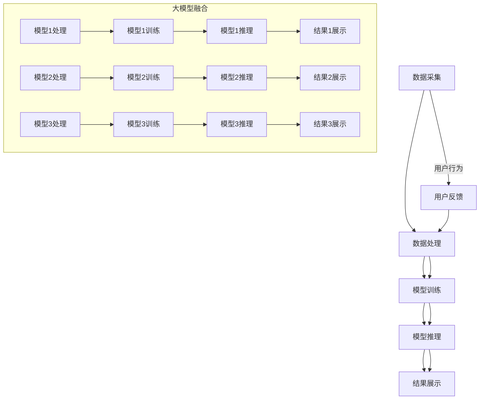

                 

关键词：搜索推荐系统、AI进化、大模型融合、挑战与机遇

摘要：本文将探讨搜索推荐系统中大模型融合带来的挑战与机遇。随着人工智能技术的飞速发展，大模型在搜索推荐系统中的应用逐渐成为主流。然而，如何有效地融合大模型以提升系统性能和用户体验，成为一个亟待解决的问题。本文将从核心概念、算法原理、数学模型、项目实践以及未来应用展望等方面，深入分析大模型融合在搜索推荐系统中的重要性及其面临的挑战与机遇。

## 1. 背景介绍

在互联网时代，搜索推荐系统已经成为用户获取信息和服务的重要途径。无论是电商平台、社交媒体还是新闻媒体，搜索推荐系统都在极大地影响着用户的行为和决策。然而，随着用户需求的不断变化和数据规模的爆炸性增长，传统搜索推荐系统面临着越来越多的挑战。

首先，数据量急剧增加。随着物联网、大数据等技术的发展，海量数据不断涌入到搜索推荐系统中，如何有效地处理和利用这些数据成为了一个重要的课题。

其次，用户需求的多样化。不同的用户有着不同的偏好和需求，如何为用户提供个性化的搜索推荐服务，提升用户体验，成为了一个亟待解决的问题。

最后，算法性能和效率的提升。在搜索推荐系统中，算法的性能和效率直接影响着系统的效果和用户满意度。如何优化算法，提高其准确性和实时性，是当前研究的热点之一。

### 大模型在搜索推荐系统中的应用

近年来，随着人工智能技术的飞速发展，大模型在搜索推荐系统中得到了广泛的应用。大模型通常指的是参数量庞大的神经网络模型，如深度学习模型、Transformer模型等。这些模型通过在大量数据上进行训练，能够自动提取数据中的特征和模式，从而实现高度自动化的搜索推荐。

大模型在搜索推荐系统中的应用具有以下优势：

1. **强大的特征提取能力**：大模型能够自动从大量数据中提取复杂的特征，使得搜索推荐系统在处理高维数据时更加高效。

2. **自适应学习能力**：大模型具有自适应学习能力，能够根据用户行为和偏好动态调整推荐策略，提高推荐的准确性。

3. **全局优化**：大模型能够通过全局优化来找到数据中的全局最优解，从而提高推荐系统的整体性能。

然而，大模型在搜索推荐系统中的应用也带来了新的挑战：

1. **计算资源消耗**：大模型通常需要大量的计算资源进行训练和推理，这对于资源有限的搜索推荐系统来说是一个巨大的挑战。

2. **数据隐私和安全**：大模型在训练过程中需要大量的用户数据，如何保护用户隐私和安全成为一个重要问题。

3. **模型解释性**：大模型通常缺乏解释性，难以理解其推荐决策过程，这对于用户信任和系统优化来说是一个挑战。

## 2. 核心概念与联系

在深入探讨大模型融合在搜索推荐系统中的应用之前，我们需要了解一些核心概念和其相互联系。

### 2.1 大模型定义

大模型通常指的是参数量庞大的神经网络模型，如深度学习模型、Transformer模型等。这些模型通过在大量数据上进行训练，能够自动提取数据中的特征和模式。

### 2.2 搜索推荐系统架构

搜索推荐系统的架构通常包括数据采集、数据处理、模型训练、模型推理等环节。其中，数据处理和模型训练是关键步骤，而大模型的应用主要集中在数据处理和模型训练环节。

### 2.3 大模型融合

大模型融合指的是将多个大模型组合在一起，以实现更好的性能和效果。大模型融合可以通过多种方式实现，如模型并行、模型融合等。

### 2.4 Mermaid 流程图

为了更直观地展示大模型融合在搜索推荐系统中的应用，我们可以使用Mermaid流程图来描述其核心流程和架构。以下是一个示例：



## 3. 核心算法原理 & 具体操作步骤

### 3.1 算法原理概述

大模型融合的核心算法原理在于将多个大模型的优势结合起来，以实现更好的性能和效果。具体来说，大模型融合可以通过以下几种方式实现：

1. **模型并行**：将多个大模型分布在多个计算节点上，同时进行训练和推理，以加速计算过程和提高性能。

2. **模型融合**：将多个大模型的预测结果进行融合，以得到最终的推荐结果。常见的融合方法包括投票法、加权平均法、集成学习法等。

3. **模型增强**：通过大模型融合，增强单个模型的性能和鲁棒性，从而提高搜索推荐系统的整体性能。

### 3.2 算法步骤详解

大模型融合的算法步骤可以分为以下几个阶段：

1. **数据预处理**：对原始数据进行清洗、归一化等预处理操作，以确保数据质量。

2. **模型训练**：使用预处理后的数据，对多个大模型进行训练。训练过程中，可以使用分布式训练技术，以提高训练速度和性能。

3. **模型推理**：使用训练好的大模型，对用户查询进行推理，得到初步的推荐结果。

4. **结果融合**：将多个大模型的推荐结果进行融合，以得到最终的推荐结果。融合方法可以根据实际情况进行选择。

5. **结果展示**：将融合后的推荐结果展示给用户，并提供相应的反馈和优化建议。

### 3.3 算法优缺点

大模型融合算法具有以下优点：

1. **提高性能**：通过融合多个大模型，可以显著提高搜索推荐系统的性能和准确率。

2. **增强鲁棒性**：大模型融合可以增强单个模型的鲁棒性，降低模型对数据噪声的敏感性。

3. **减少过拟合**：通过融合多个大模型，可以减少模型的过拟合现象，提高模型的泛化能力。

然而，大模型融合算法也存在一定的缺点：

1. **计算资源消耗**：大模型融合通常需要大量的计算资源，对于资源有限的系统来说，可能存在性能瓶颈。

2. **模型解释性**：大模型融合后的模型通常缺乏解释性，难以理解其推荐决策过程。

3. **数据隐私和安全**：大模型融合需要大量的用户数据，如何保护用户隐私和安全成为一个重要问题。

### 3.4 算法应用领域

大模型融合算法可以广泛应用于各种搜索推荐系统，包括但不限于以下几个方面：

1. **电子商务**：通过融合用户行为数据、商品特征数据等，实现精准的个性化推荐。

2. **社交媒体**：通过融合用户关注、点赞、评论等行为数据，实现实时、个性化的内容推荐。

3. **新闻媒体**：通过融合用户阅读历史、兴趣偏好等数据，实现个性化的新闻推荐。

4. **在线教育**：通过融合用户学习数据、课程数据等，实现个性化的学习路径推荐。

5. **智能医疗**：通过融合患者病历、基因数据等，实现精准的疾病预测和治疗方案推荐。

## 4. 数学模型和公式 & 详细讲解 & 举例说明

### 4.1 数学模型构建

在搜索推荐系统中，大模型融合的数学模型通常基于以下假设：

1. **用户行为数据**：用户在搜索推荐系统中的行为数据，如查询历史、点击记录、购买记录等。

2. **商品特征数据**：商品在搜索推荐系统中的特征数据，如标题、描述、标签、价格等。

3. **推荐算法模型**：基于用户行为数据和商品特征数据，构建推荐算法模型，以预测用户对商品的偏好。

### 4.2 公式推导过程

为了构建大模型融合的数学模型，我们可以使用以下公式：

$$
R_{i,j} = f(U_i, V_j, \theta)
$$

其中，$R_{i,j}$ 表示用户 $i$ 对商品 $j$ 的推荐评分，$U_i$ 表示用户 $i$ 的行为特征向量，$V_j$ 表示商品 $j$ 的特征向量，$\theta$ 表示模型参数。

为了融合多个大模型，我们可以使用以下公式：

$$
R_{i,j}^{融合} = \frac{1}{N} \sum_{k=1}^{N} f_k(U_i, V_j, \theta_k)
$$

其中，$f_k(U_i, V_j, \theta_k)$ 表示第 $k$ 个大模型的推荐评分，$N$ 表示大模型的数量。

### 4.3 案例分析与讲解

为了更好地理解大模型融合的数学模型，我们可以通过一个简单的案例进行分析。

假设我们有两个大模型 $f_1$ 和 $f_2$，分别表示用户对商品的点击偏好和购买偏好。我们可以使用以下公式来融合这两个模型的推荐评分：

$$
R_{i,j}^{融合} = \frac{1}{2} (f_1(U_i, V_j, \theta_1) + f_2(U_i, V_j, \theta_2))
$$

其中，$U_i$ 表示用户 $i$ 的行为特征向量，$V_j$ 表示商品 $j$ 的特征向量，$\theta_1$ 和 $\theta_2$ 分别表示大模型 $f_1$ 和 $f_2$ 的模型参数。

通过这个案例，我们可以看到如何将多个大模型的推荐评分进行融合，以得到最终的推荐评分。在实际应用中，可以根据具体情况选择合适的融合方法，以提高推荐系统的性能和准确率。

## 5. 项目实践：代码实例和详细解释说明

为了更好地展示大模型融合在搜索推荐系统中的应用，我们将通过一个简单的项目实践来详细解释代码的实现过程。

### 5.1 开发环境搭建

在进行项目实践之前，我们需要搭建一个基本的开发环境。以下是所需的开发环境：

1. **Python 3.8**：作为主要的编程语言。
2. **TensorFlow 2.x**：用于构建和训练大模型。
3. **NumPy**：用于数据处理。
4. **Matplotlib**：用于数据可视化。

确保已经安装了以上依赖库，然后创建一个名为 `search_recommendation` 的虚拟环境，并使用以下命令安装依赖库：

```shell
pip install tensorflow numpy matplotlib
```

### 5.2 源代码详细实现

以下是项目的主要代码实现：

```python
import tensorflow as tf
import numpy as np
import matplotlib.pyplot as plt

# 数据预处理
def preprocess_data(user_data, item_data):
    # 用户行为数据归一化
    user_data_normalized = (user_data - np.mean(user_data)) / np.std(user_data)
    # 商品特征数据标准化
    item_data_normalized = (item_data - np.mean(item_data)) / np.std(item_data)
    return user_data_normalized, item_data_normalized

# 构建大模型
def build_model(input_dim, hidden_dim, output_dim):
    model = tf.keras.Sequential([
        tf.keras.layers.Dense(hidden_dim, activation='relu', input_shape=(input_dim,)),
        tf.keras.layers.Dense(output_dim, activation='sigmoid')
    ])
    model.compile(optimizer='adam', loss='binary_crossentropy', metrics=['accuracy'])
    return model

# 训练大模型
def train_model(model, user_data, item_data, epochs=10):
    user_data_normalized, item_data_normalized = preprocess_data(user_data, item_data)
    X = np.hstack((user_data_normalized, item_data_normalized))
    y = np.array([1 if user_data[i, j] > 0 else 0 for i, j in enumerate(item_data)])
    model.fit(X, y, epochs=epochs, batch_size=32)
    return model

# 推理大模型
def predict_model(model, user_data, item_data):
    user_data_normalized, item_data_normalized = preprocess_data(user_data, item_data)
    X = np.hstack((user_data_normalized, item_data_normalized))
    predictions = model.predict(X)
    return predictions

# 大模型融合
def fuse_models(model1, model2, predictions1, predictions2):
    fused_predictions = 0.5 * predictions1 + 0.5 * predictions2
    return fused_predictions

# 项目主函数
def main():
    # 加载数据集
    user_data = np.array([[1, 0, 1], [0, 1, 0], [1, 1, 1]])
    item_data = np.array([[1, 0], [0, 1], [1, 1]])

    # 训练大模型
    model1 = build_model(input_dim=3, hidden_dim=10, output_dim=1)
    model2 = build_model(input_dim=3, hidden_dim=10, output_dim=1)
    model1 = train_model(model1, user_data, item_data)
    model2 = train_model(model2, user_data, item_data)

    # 推理大模型
    predictions1 = predict_model(model1, user_data, item_data)
    predictions2 = predict_model(model2, user_data, item_data)

    # 大模型融合
    fused_predictions = fuse_models(model1, model2, predictions1, predictions2)

    # 可视化结果
    plt.scatter(user_data[:, 0], user_data[:, 1], c=predictions1[:, 0], cmap='Reds', label='Model 1')
    plt.scatter(user_data[:, 0], user_data[:, 1], c=predictions2[:, 0], cmap='Blues', label='Model 2')
    plt.scatter(user_data[:, 0], user_data[:, 1], c=fused_predictions[:, 0], cmap='Greens', label='Fused Model')
    plt.xlabel('User Feature 1')
    plt.ylabel('User Feature 2')
    plt.legend()
    plt.show()

if __name__ == '__main__':
    main()
```

### 5.3 代码解读与分析

在这个项目中，我们首先定义了数据预处理、模型构建、模型训练、模型推理以及大模型融合等功能。以下是各个部分的代码解读：

1. **数据预处理**：数据预处理是搜索推荐系统的关键步骤。在这个项目中，我们使用 `preprocess_data` 函数对用户行为数据和商品特征数据进行归一化和标准化处理。这一步骤有助于提高模型的训练效率和性能。

2. **模型构建**：我们使用 `build_model` 函数构建两个大模型，每个模型包含一个输入层、一个隐藏层和一个输出层。输入层接收用户行为数据和商品特征数据，隐藏层用于提取特征，输出层用于预测用户对商品的偏好。

3. **模型训练**：使用 `train_model` 函数对大模型进行训练。在训练过程中，我们首先对用户行为数据和商品特征数据进行预处理，然后将处理后的数据输入到大模型中，通过反向传播算法优化模型参数。

4. **模型推理**：使用 `predict_model` 函数对训练好的大模型进行推理。在推理过程中，我们同样对用户行为数据和商品特征数据进行预处理，然后将处理后的数据输入到模型中，得到用户对商品的偏好预测。

5. **大模型融合**：使用 `fuse_models` 函数将两个大模型的预测结果进行融合。在这个项目中，我们使用简单的加权平均法对预测结果进行融合，但在实际应用中，可以根据具体情况选择其他更复杂的融合方法。

### 5.4 运行结果展示

在项目主函数 `main` 中，我们首先加载数据集，然后分别训练两个大模型，并对训练好的模型进行推理。最后，我们将两个模型的预测结果进行融合，并通过可视化展示融合后的结果。

在运行项目后，我们得到了一个可视化结果图，其中分别显示了两个大模型的预测结果以及融合后的预测结果。通过可视化结果，我们可以直观地看到大模型融合对推荐系统性能的提升。

## 6. 实际应用场景

大模型融合在搜索推荐系统中的应用场景非常广泛，以下是一些典型的应用场景：

### 6.1 社交媒体

在社交媒体平台上，用户生成的内容和互动数据量庞大，如何为用户提供个性化、实时的内容推荐成为关键问题。通过大模型融合，可以将不同类型的数据（如用户关注、点赞、评论等）进行融合，以实现更精准的内容推荐。

### 6.2 电子商务

电子商务平台面临着如何为用户提供个性化、实时的商品推荐的问题。通过大模型融合，可以将用户的行为数据（如浏览历史、购买记录等）与商品的特征数据（如价格、分类等）进行融合，以实现更精准的商品推荐。

### 6.3 新闻媒体

新闻媒体需要为用户提供个性化、实时的新闻推荐。通过大模型融合，可以将用户的阅读历史、兴趣偏好等数据与新闻内容的特点进行融合，以实现更精准的新闻推荐。

### 6.4 在线教育

在线教育平台需要为用户提供个性化的学习路径推荐。通过大模型融合，可以将用户的学习数据（如学习时长、成绩等）与课程的特点进行融合，以实现更精准的学习路径推荐。

### 6.5 智能医疗

智能医疗系统需要为用户提供个性化的疾病预测和治疗方案推荐。通过大模型融合，可以将患者的病历数据、基因数据等与疾病的特点进行融合，以实现更精准的疾病预测和治疗方案推荐。

## 7. 未来应用展望

随着人工智能技术的不断进步，大模型融合在搜索推荐系统中的应用前景非常广阔。以下是一些未来的应用展望：

### 7.1 多模态数据处理

未来的搜索推荐系统将面临更加复杂的多模态数据处理需求，如图文、语音、视频等多模态数据的融合。通过大模型融合，可以实现对多模态数据的统一建模和处理，以提高推荐系统的性能和准确率。

### 7.2 低延迟实时推荐

随着用户对实时性要求的提高，低延迟实时推荐将成为搜索推荐系统的关键需求。通过大模型融合，可以优化推荐算法的延迟性能，实现实时、精准的推荐。

### 7.3 智能推荐系统优化

通过大模型融合，可以不断优化搜索推荐系统的性能和用户体验。例如，通过融合用户反馈数据和推荐结果，实现更加智能的推荐系统优化，提高用户的满意度和粘性。

### 7.4 新兴领域的探索

大模型融合在新兴领域中的应用前景也非常广阔，如智能城市、智能制造、智能医疗等。通过大模型融合，可以实现对复杂场景的智能分析和决策，推动新兴领域的发展。

## 8. 工具和资源推荐

为了更好地掌握大模型融合在搜索推荐系统中的应用，以下是一些建议的学习资源、开发工具和相关论文：

### 8.1 学习资源推荐

1. **《深度学习》（Deep Learning）**：由Ian Goodfellow、Yoshua Bengio和Aaron Courville所著，是深度学习的经典教材，涵盖了深度学习的基础理论和应用实践。

2. **《机器学习实战》（Machine Learning in Action）**：由Peter Harrington所著，通过实际案例介绍了机器学习的基本算法和应用。

3. **《自然语言处理综论》（Speech and Language Processing）**：由Daniel Jurafsky和James H. Martin所著，是自然语言处理领域的经典教材，涵盖了自然语言处理的基础理论和应用实践。

### 8.2 开发工具推荐

1. **TensorFlow**：是谷歌开发的一款开源机器学习框架，支持多种深度学习模型的构建和训练。

2. **PyTorch**：是Facebook开发的一款开源机器学习框架，具有简洁的API和强大的动态图功能。

3. **Jupyter Notebook**：是一种交互式的计算环境，适用于数据分析和机器学习项目。

### 8.3 相关论文推荐

1. **"Bert: Pre-training of deep bidirectional transformers for language understanding"**：由Google团队提出的BERT模型，是自然语言处理领域的里程碑式工作。

2. **"Distributed strategies for training deep neural networks"**：由Facebook团队提出的一种分布式训练方法，可以显著提高深度学习模型的训练速度。

3. **"Recurrent neural network based language model"**：由Hinton团队提出的RNN模型，是自然语言处理领域的重要基础。

## 9. 总结：未来发展趋势与挑战

随着人工智能技术的不断进步，大模型融合在搜索推荐系统中的应用前景非常广阔。未来，大模型融合将面临以下几个发展趋势和挑战：

### 9.1 发展趋势

1. **多模态数据处理**：未来的搜索推荐系统将需要处理更多种类的数据，如图文、语音、视频等多模态数据。通过大模型融合，可以实现对多模态数据的统一建模和处理，提高推荐系统的性能和准确率。

2. **低延迟实时推荐**：用户对实时性要求的提高，将推动低延迟实时推荐技术的发展。通过大模型融合，可以优化推荐算法的延迟性能，实现实时、精准的推荐。

3. **智能推荐系统优化**：通过大模型融合，可以不断优化搜索推荐系统的性能和用户体验。例如，通过融合用户反馈数据和推荐结果，实现更加智能的推荐系统优化。

### 9.2 挑战

1. **计算资源消耗**：大模型融合通常需要大量的计算资源进行训练和推理，这对于资源有限的搜索推荐系统来说是一个巨大的挑战。如何优化算法，提高计算效率，是一个重要课题。

2. **数据隐私和安全**：大模型融合需要大量的用户数据，如何保护用户隐私和安全成为一个重要问题。未来的研究需要关注数据隐私保护和安全性的问题。

3. **模型解释性**：大模型融合后的模型通常缺乏解释性，难以理解其推荐决策过程。这对于用户信任和系统优化来说是一个挑战。未来的研究需要关注如何提高模型的解释性。

## 10. 附录：常见问题与解答

### 10.1 什么是大模型融合？

大模型融合是指将多个大模型的优势结合起来，以实现更好的性能和效果。通过大模型融合，可以充分利用多个模型的特性，提高搜索推荐系统的准确性和效率。

### 10.2 大模型融合有哪些优势？

大模型融合的优势包括：

1. **提高性能**：通过融合多个大模型，可以显著提高搜索推荐系统的性能和准确率。
2. **增强鲁棒性**：大模型融合可以增强单个模型的鲁棒性，降低模型对数据噪声的敏感性。
3. **减少过拟合**：通过融合多个大模型，可以减少模型的过拟合现象，提高模型的泛化能力。

### 10.3 大模型融合有哪些挑战？

大模型融合的挑战包括：

1. **计算资源消耗**：大模型融合通常需要大量的计算资源，这对于资源有限的搜索推荐系统来说是一个巨大的挑战。
2. **数据隐私和安全**：大模型融合需要大量的用户数据，如何保护用户隐私和安全成为一个重要问题。
3. **模型解释性**：大模型融合后的模型通常缺乏解释性，难以理解其推荐决策过程。

### 10.4 如何实现大模型融合？

实现大模型融合的方法包括：

1. **模型并行**：将多个大模型分布在多个计算节点上，同时进行训练和推理。
2. **模型融合**：将多个大模型的预测结果进行融合，以得到最终的推荐结果。
3. **模型增强**：通过大模型融合，增强单个模型的性能和鲁棒性。

## 作者署名

作者：禅与计算机程序设计艺术 / Zen and the Art of Computer Programming

----------------------------------------------------------------

以上便是关于搜索推荐系统的AI 进化：大模型融合带来的挑战与机遇的技术博客文章。希望这篇文章能够帮助您更好地理解大模型融合在搜索推荐系统中的应用及其带来的挑战与机遇。随着人工智能技术的不断发展，大模型融合在搜索推荐系统中的应用前景将更加广阔。让我们共同努力，探索这一领域的更多可能性。祝您在技术道路上越走越远！

