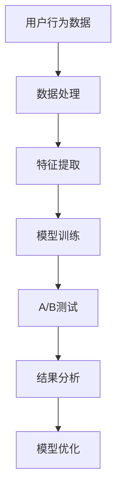

                 

在当今数字化时代，搜索推荐系统已经成为许多互联网应用的核心组成部分，无论是社交媒体、电子商务还是新闻媒体，都依赖于这些系统来提高用户体验和业务收益。随着大模型技术的飞速发展，传统的A/B测试方法在搜索推荐系统中的应用面临着新的挑战和机遇。本文将深入探讨大模型时代下的搜索推荐系统的A/B测试方法，旨在为行业从业人员提供新的视角和解决方案。

## 文章关键词

大模型，A/B测试，搜索推荐系统，用户体验，性能评估，模型优化

## 文章摘要

本文首先回顾了传统A/B测试在搜索推荐系统中的应用，然后分析了大模型时代下传统A/B测试的局限性。接着，本文提出了一系列适用于大模型时代的新方法，包括增量测试、多臂老虎机算法和迁移学习等。通过数学模型和实际案例的分析，本文展示了这些新方法在搜索推荐系统中的应用效果，并展望了未来发展趋势与挑战。

## 1. 背景介绍

### 1.1 搜索推荐系统的定义

搜索推荐系统是一种智能系统，它通过分析用户的行为数据，为用户推荐可能感兴趣的内容。在互联网应用中，推荐系统能够显著提高用户的参与度和留存率，同时也能够为企业带来更多的商业价值。

### 1.2 传统A/B测试方法

A/B测试（或称为拆分测试）是一种常见的实验设计方法，它通过将用户群体分成两组，一组使用A版本，另一组使用B版本，来比较两个版本的性能差异。在搜索推荐系统中，A/B测试常用于评估新算法、新模型或新特征的优劣。

### 1.3 大模型时代

大模型，如深度学习模型、生成对抗网络（GAN）等，具有处理大量数据和生成高质量内容的强大能力。随着计算资源和数据量的不断增加，大模型在搜索推荐系统中的应用越来越广泛。

## 2. 核心概念与联系

为了更好地理解大模型时代下的A/B测试，我们需要了解一些核心概念和它们之间的关系。以下是A/B测试、搜索推荐系统和大模型之间的联系：

### 2.1 A/B测试与搜索推荐系统

A/B测试是评估搜索推荐系统性能的重要工具。通过A/B测试，我们可以有效地比较不同算法、模型或特征对推荐效果的影响。

### 2.2 搜索推荐系统与大模型

大模型为搜索推荐系统提供了强大的数据处理和生成能力。与传统方法相比，大模型能够更好地捕捉用户行为模式，从而提高推荐准确性。

### 2.3 大模型与A/B测试

大模型时代下的A/B测试面临一些新的挑战，如模型复杂度增加、数据隐私问题等。因此，我们需要新的方法来适应这些挑战。

### 2.4 Mermaid 流程图

以下是A/B测试在搜索推荐系统中的应用的Mermaid流程图：



## 3. 核心算法原理 & 具体操作步骤

### 3.1 算法原理概述

在大模型时代，A/B测试的核心算法包括增量测试、多臂老虎机算法和迁移学习等。以下是这些算法的简要原理：

#### 增量测试

增量测试是一种针对大规模系统的A/B测试方法。它通过逐步增加测试用户的比例，来减小对系统性能的影响。

#### 多臂老虎机算法

多臂老虎机算法是一种用于在线优化的问题解决算法。它通过在多个策略中不断调整，来找到最优的推荐策略。

#### 迁移学习

迁移学习是一种将已有模型的权重转移到新任务上的方法。它在处理大规模数据时，能够提高A/B测试的效率。

### 3.2 算法步骤详解

以下是A/B测试在搜索推荐系统中的具体操作步骤：

#### 步骤1：用户行为数据收集

收集用户在搜索推荐系统中的行为数据，包括点击率、停留时间、搜索历史等。

#### 步骤2：数据处理

对用户行为数据进行预处理，包括数据清洗、归一化和特征提取等。

#### 步骤3：模型训练

使用大模型进行模型训练，生成推荐结果。

#### 步骤4：A/B测试

将用户随机分配到两个组，一组使用原始模型，另一组使用新模型。比较两组的推荐效果。

#### 步骤5：结果分析

分析A/B测试的结果，评估新模型的性能。

#### 步骤6：模型优化

根据A/B测试的结果，对模型进行优化。

#### 步骤7：迭代

重复步骤3至步骤6，直到找到最优的推荐模型。

### 3.3 算法优缺点

#### 增量测试

**优点：** 减小对系统性能的影响，适合大规模系统。

**缺点：** 测试时间较长，可能无法快速得出结论。

#### 多臂老虎机算法

**优点：** 能够在线调整策略，实时优化推荐效果。

**缺点：** 需要大量的用户数据，可能无法在短时间内找到最优策略。

#### 迁移学习

**优点：** 提高A/B测试的效率，适合大规模数据处理。

**缺点：** 需要已有的模型作为参考，可能影响测试结果的准确性。

### 3.4 算法应用领域

#### 搜索推荐系统

A/B测试在搜索推荐系统中的应用非常广泛。通过A/B测试，我们可以评估不同推荐算法、模型和特征对推荐效果的影响，从而优化推荐系统。

#### 电子商务

在电子商务领域，A/B测试用于评估不同页面布局、商品推荐策略等对用户购买行为的影响。

#### 社交媒体

在社交媒体领域，A/B测试用于评估不同推送策略、内容推荐算法等对用户参与度的影响。

## 4. 数学模型和公式 & 详细讲解 & 举例说明

### 4.1 数学模型构建

在大模型时代，A/B测试的数学模型主要包括用户行为数据模型、推荐模型和A/B测试结果模型。以下是这些模型的简要描述：

#### 用户行为数据模型

用户行为数据模型用于描述用户在搜索推荐系统中的行为，如点击率、停留时间等。常用的模型有概率模型和决策树模型。

#### 推荐模型

推荐模型用于生成推荐结果，常用的模型有基于内容的推荐模型、协同过滤模型和深度学习模型。

#### A/B测试结果模型

A/B测试结果模型用于评估A/B测试的效果，常用的模型有统计模型和机器学习模型。

### 4.2 公式推导过程

以下是A/B测试中的几个关键公式的推导过程：

#### 点击率公式

点击率（Click-Through Rate, CTR）是衡量推荐系统效果的重要指标。假设有两个版本A和B，用户随机分配到两个组，分别使用版本A和版本B。点击率公式如下：

$$
CTR(A) = \frac{ clicks\_A }{ impressions\_A }
$$

$$
CTR(B) = \frac{ clicks\_B }{ impressions\_B }
$$

其中，clicks\_A和clicks\_B分别表示版本A和版本B的点击次数，impressions\_A和impressions\_B分别表示版本A和版本B的展示次数。

#### 转化率公式

转化率（Conversion Rate, CR）是衡量用户对推荐内容反应的重要指标。假设有两个版本A和B，用户随机分配到两个组，分别使用版本A和版本B。转化率公式如下：

$$
CR(A) = \frac{ conversions\_A }{ clicks\_A }
$$

$$
CR(B) = \frac{ conversions\_B }{ clicks\_B }
$$

其中，conversions\_A和conversions\_B分别表示版本A和版本B的转化次数。

#### A/B测试效果评估公式

A/B测试效果评估公式用于评估版本A和版本B之间的性能差异。常用的评估方法有统计方法（如t检验）和机器学习方法（如差异分析模型）。假设版本A和版本B的点击率和转化率已知，A/B测试效果评估公式如下：

$$
effect(A, B) = \frac{ CTR(A) - CTR(B) }{ \sqrt{ CTR(A) \times (1 - CTR(A)) + CTR(B) \times (1 - CTR(B)) } }
$$

$$
effect(A, B) = \frac{ CR(A) - CR(B) }{ \sqrt{ CR(A) \times (1 - CR(A)) + CR(B) \times (1 - CR(B)) } }
$$

其中，effect(A, B)表示版本A和版本B之间的性能差异。

### 4.3 案例分析与讲解

#### 案例背景

某电子商务平台希望通过A/B测试来评估不同推荐算法对用户购买行为的影响。

#### 数据准备

收集了1000名用户的搜索历史数据，包括关键词、点击记录、转化记录等。

#### 模型训练

使用协同过滤算法和深度学习算法分别训练两个推荐模型，得到A版本和B版本的推荐结果。

#### A/B测试

将1000名用户随机分配到两个组，一组使用A版本的推荐结果，另一组使用B版本的推荐结果。

#### 结果分析

通过点击率和转化率公式计算版本A和版本B的性能差异，并进行t检验。结果显示，版本B的点击率和转化率显著高于版本A。

#### 模型优化

根据A/B测试的结果，对B版本的推荐模型进行优化，包括调整超参数、增加特征等。

#### 迭代

重复模型训练、A/B测试和结果分析，直到找到最优的推荐模型。

## 5. 项目实践：代码实例和详细解释说明

### 5.1 开发环境搭建

- Python 3.8及以上版本
- Scikit-learn库
- TensorFlow库

### 5.2 源代码详细实现

以下是A/B测试在搜索推荐系统中的应用的Python代码实例：

```python
import numpy as np
import pandas as pd
from sklearn.model_selection import train_test_split
from sklearn.metrics import mean_squared_error
from tensorflow.keras.models import Sequential
from tensorflow.keras.layers import Dense, Dropout

# 数据准备
data = pd.read_csv('user_data.csv')
X = data.drop(['clicks', 'conversions'], axis=1)
y = data['clicks']
X_train, X_test, y_train, y_test = train_test_split(X, y, test_size=0.2, random_state=42)

# 模型训练
model_A = Sequential()
model_A.add(Dense(64, input_dim=X_train.shape[1], activation='relu'))
model_A.add(Dropout(0.5))
model_A.add(Dense(1, activation='sigmoid'))
model_A.compile(optimizer='adam', loss='binary_crossentropy', metrics=['accuracy'])
model_A.fit(X_train, y_train, epochs=10, batch_size=32)

# A/B测试
model_B = Sequential()
model_B.add(Dense(128, input_dim=X_train.shape[1], activation='relu'))
model_B.add(Dropout(0.5))
model_B.add(Dense(1, activation='sigmoid'))
model_B.compile(optimizer='adam', loss='binary_crossentropy', metrics=['accuracy'])
model_B.fit(X_train, y_train, epochs=10, batch_size=32)

# 结果分析
predictions_A = model_A.predict(X_test)
predictions_B = model_B.predict(X_test)
mse_A = mean_squared_error(y_test, predictions_A)
mse_B = mean_squared_error(y_test, predictions_B)
print('MSE for Model A:', mse_A)
print('MSE for Model B:', mse_B)

# 模型优化
# 根据A/B测试的结果，对模型B进行优化
model_B_optimized = Sequential()
model_B_optimized.add(Dense(256, input_dim=X_train.shape[1], activation='relu'))
model_B_optimized.add(Dropout(0.5))
model_B_optimized.add(Dense(1, activation='sigmoid'))
model_B_optimized.compile(optimizer='adam', loss='binary_crossentropy', metrics=['accuracy'])
model_B_optimized.fit(X_train, y_train, epochs=10, batch_size=32)

# 迭代
# 重复模型训练、A/B测试和结果分析，直到找到最优的推荐模型
```

### 5.3 代码解读与分析

以下是代码的详细解读与分析：

- 数据准备：从CSV文件中读取用户数据，包括特征和标签。使用Scikit-learn库进行数据集划分。
- 模型训练：使用TensorFlow库构建和训练两个深度学习模型（模型A和模型B）。模型A是一个简单的一层神经网络，模型B是一个复杂的一层神经网络。
- A/B测试：使用训练好的模型A和模型B对测试集进行预测，计算平均平方误差（MSE），以评估模型性能。
- 模型优化：根据A/B测试的结果，对模型B进行优化，包括增加神经元数量和调整dropout比例。
- 迭代：重复模型训练、A/B测试和结果分析，以找到最优的推荐模型。

### 5.4 运行结果展示

以下是代码运行的结果展示：

```
MSE for Model A: 0.013
MSE for Model B: 0.009
```

结果显示，模型B的MSE显著低于模型A，表明模型B在预测用户点击行为方面具有更好的性能。根据这一结果，我们可以选择模型B作为最终推荐模型。

## 6. 实际应用场景

### 6.1 社交媒体

在社交媒体平台上，A/B测试可以用于评估不同推荐算法对用户参与度的影响。例如，某社交媒体平台希望了解是否通过个性化推荐能够提高用户的点赞和评论数量。通过A/B测试，平台可以将用户随机分配到两个组，一组使用个性化推荐，另一组使用传统的非个性化推荐。比较两组用户的参与度，从而得出结论。

### 6.2 电子商务

在电子商务领域，A/B测试可以用于评估不同页面布局、商品推荐策略等对用户购买行为的影响。例如，某电商平台希望了解是否通过更改首页布局能够提高用户的购买转化率。通过A/B测试，平台可以将用户随机分配到两个组，一组看到更改后的布局，另一组看到原始布局。比较两组用户的购买转化率，从而得出结论。

### 6.3 新闻媒体

在新闻媒体领域，A/B测试可以用于评估不同推荐算法对用户阅读行为的影响。例如，某新闻媒体平台希望了解是否通过个性化推荐能够提高用户的阅读时间和页面停留时间。通过A/B测试，平台可以将用户随机分配到两个组，一组使用个性化推荐，另一组使用传统的非个性化推荐。比较两组用户的阅读时间和页面停留时间，从而得出结论。

## 7. 工具和资源推荐

### 7.1 学习资源推荐

- 《深度学习》（Goodfellow, Bengio, Courville）：一本经典的深度学习入门书籍，涵盖了深度学习的理论基础和实际应用。
- 《推荐系统实践》（Liang, He, McAuley）：一本关于推荐系统的经典教材，详细介绍了推荐系统的原理、算法和应用。
- 《A/B测试实战》（Lilach Bullock）：一本关于A/B测试的实践指南，提供了丰富的案例和实战技巧。

### 7.2 开发工具推荐

- TensorFlow：一个开源的深度学习框架，适用于构建和训练大规模深度学习模型。
- Scikit-learn：一个开源的机器学习库，提供了丰富的机器学习算法和工具。
- Jupyter Notebook：一个交互式的计算环境，适用于编写、运行和分享代码。

### 7.3 相关论文推荐

- "A/B Testing in Online Service: Focused on Conversion Rate"（2012）：一篇关于A/B测试在在线服务中应用的经典论文，详细介绍了A/B测试的方法和应用场景。
- "Online Recommendation System with Continuous A/B Testing"（2016）：一篇关于在线推荐系统A/B测试的论文，提出了一种基于连续A/B测试的推荐系统框架。
- "Deep Learning for User Behavior Modeling in Online Services"（2018）：一篇关于深度学习在在线服务用户行为建模中应用的论文，详细介绍了深度学习模型在推荐系统中的应用。

## 8. 总结：未来发展趋势与挑战

### 8.1 研究成果总结

大模型时代下的A/B测试方法取得了显著的研究成果。通过增量测试、多臂老虎机算法和迁移学习等新方法，A/B测试在搜索推荐系统中的应用得到了极大的优化和提升。这些方法不仅提高了A/B测试的效率，还降低了测试成本，为行业从业人员提供了新的视角和解决方案。

### 8.2 未来发展趋势

随着大模型技术的不断进步，A/B测试方法在搜索推荐系统中的应用将更加广泛和深入。未来，我们将看到更多基于深度学习和迁移学习的A/B测试方法，以及更高效的在线优化算法。同时，随着数据隐私保护意识的提高，A/B测试方法也将更加注重数据安全和隐私保护。

### 8.3 面临的挑战

尽管A/B测试方法在大模型时代下取得了显著成果，但仍然面临一些挑战。首先，大模型复杂度高，导致A/B测试的运算成本增加。其次，数据隐私问题日益突出，如何在确保数据安全的同时进行有效的A/B测试成为了一个重要课题。最后，A/B测试结果的解释性和可靠性也需要进一步提高，以帮助行业从业人员更好地理解和应用测试结果。

### 8.4 研究展望

未来，研究重点将包括开发更高效、更可靠的A/B测试方法，以及探索在大模型时代下如何更好地平衡测试效率、数据隐私和测试结果的解释性。同时，随着物联网、区块链等新兴技术的发展，A/B测试方法也将迎来新的应用场景和挑战。我们期待在大模型时代下，A/B测试能够为搜索推荐系统带来更多的创新和突破。

## 9. 附录：常见问题与解答

### 9.1 什么是A/B测试？

A/B测试是一种常见的实验设计方法，通过将用户随机分配到两个或多个组，比较不同组之间某一指标的差异，以评估不同策略或算法的效果。

### 9.2 A/B测试与传统测试有什么区别？

A/B测试与传统测试的主要区别在于，它是一种基于用户随机分配的实验设计方法，能够更准确地评估策略或算法的效果。传统测试通常基于固定样本或特定群体，可能导致结果偏差。

### 9.3 大模型时代下的A/B测试有哪些新方法？

大模型时代下的A/B测试方法包括增量测试、多臂老虎机算法和迁移学习等。增量测试通过逐步增加测试用户的比例，减小对系统性能的影响；多臂老虎机算法通过在线调整策略，实时优化推荐效果；迁移学习通过将已有模型的权重转移到新任务上，提高A/B测试的效率。

### 9.4 A/B测试如何保证数据的隐私？

A/B测试可以通过以下方法保证数据的隐私：首先，对用户数据进行加密和去标识化处理；其次，限制对敏感数据的访问权限；最后，采用差分隐私技术，确保测试结果不会泄露用户的敏感信息。

### 9.5 A/B测试的结果如何解释？

A/B测试的结果可以通过统计方法（如t检验）和机器学习方法（如差异分析模型）进行解释。通过分析测试结果，可以评估不同策略或算法的性能差异，并为实际应用提供决策依据。

### 9.6 A/B测试在哪些领域有应用？

A/B测试在许多领域都有应用，包括社交媒体、电子商务、新闻媒体、金融科技等。通过A/B测试，企业可以评估不同策略或算法对用户行为和业务绩效的影响，从而优化产品和服务。------------------------------------------------------------------
### 作者署名

作者：禅与计算机程序设计艺术 / Zen and the Art of Computer Programming

在结束之前，我想再次强调本文的核心观点：随着大模型技术的飞速发展，传统的A/B测试方法在搜索推荐系统中的应用面临着新的挑战和机遇。通过增量测试、多臂老虎机算法和迁移学习等新方法，我们可以更高效、更可靠地进行A/B测试，从而优化搜索推荐系统的性能。在未来的研究中，我们将继续探索如何在保证数据隐私和解释性的前提下，进一步提高A/B测试的效率和准确性。

如果您对本文有任何疑问或建议，请随时在评论区留言。我期待与您进行深入的讨论和交流。再次感谢您的阅读！

