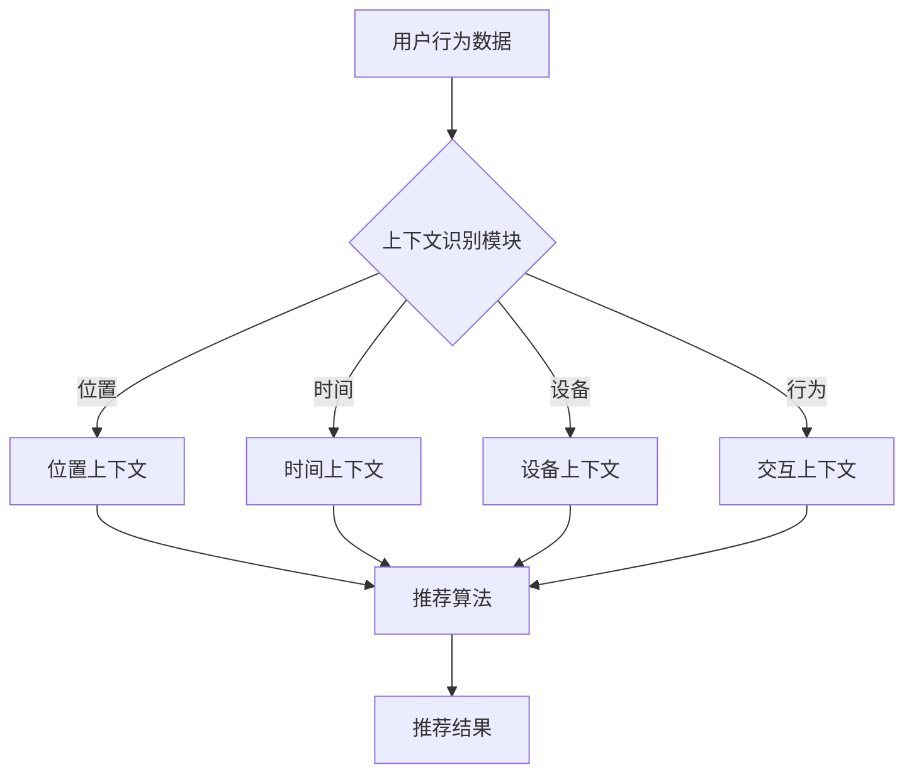

                 

搜索推荐系统是现代信息社会中不可或缺的一部分。无论是电商平台、社交媒体，还是新闻资讯网站，搜索推荐系统都在为用户带来更好的个性化体验。然而，随着用户需求的多样化和信息爆炸式增长，传统的推荐算法已难以满足用户对实时、精准推荐的需求。上下文感知技术（Context-Aware Technology）的引入，为解决这一问题提供了新的思路。本文将围绕上下文感知技术在搜索推荐系统中的应用进行深入探讨。

## 文章关键词
- 搜索推荐系统
- 上下文感知
- 信息检索
- 用户行为分析
- 个性化推荐

## 文章摘要
本文首先介绍了搜索推荐系统的基本概念和传统算法的局限性。接着，详细阐述了上下文感知技术的核心概念和重要性，并给出了一个简化的Mermaid流程图以展示上下文感知的架构。随后，本文重点介绍了核心算法的原理、数学模型及具体实现步骤，并通过实例代码对算法进行了详细解释。最后，文章探讨了上下文感知技术在搜索推荐系统中的实际应用场景，并对其未来发展趋势和面临的挑战进行了展望。

---

## 1. 背景介绍

搜索推荐系统是一种通过分析用户行为和内容特征，为用户推荐相关信息的智能系统。其核心目标是提高用户满意度、提升网站黏性和转化率。传统推荐算法主要基于用户的历史行为（如浏览记录、购买历史等）和物品的固有特征（如标题、标签等），通过计算用户和物品之间的相似度来生成推荐结果。然而，这种方法存在明显的局限性：

1. **缺乏上下文信息**：传统推荐算法往往忽略了用户当前所处的上下文环境，如时间、地点、设备等。这种情况下，推荐结果可能不够准确和及时。

2. **用户个性化不足**：传统算法难以充分理解用户的个人偏好和动态需求，导致推荐结果的普适性较高，而个性化程度较低。

3. **实时性不足**：由于算法的计算复杂度和数据量庞大，传统推荐算法的响应速度较慢，无法满足实时推荐的需求。

上下文感知技术的引入，旨在解决上述问题。上下文感知推荐系统通过实时获取并利用用户的上下文信息，为用户提供更加个性化、精准的推荐结果。上下文信息可以是用户的位置、时间、设备、交互行为等多种维度。通过将上下文信息与推荐算法相结合，可以实现更智能、更高效的推荐。

---

## 2. 核心概念与联系

上下文感知技术（Context-Aware Technology）是指能够自动识别并利用用户当前所处环境和情境的信息，以提供更加智能、个性化的服务。在搜索推荐系统中，上下文感知技术主要包括以下几个方面：

1. **用户上下文**：包括用户的位置、时间、设备、行为等。例如，用户在早晨上班途中，可能会对天气预报、交通信息等感兴趣；而在晚上休息时，可能更关注娱乐、休闲内容。

2. **物品上下文**：包括物品的属性、状态、上下文关联等。例如，一个电子产品在不同的上下文中可能会有不同的推荐权重，如节假日、新品发布等。

3. **交互上下文**：包括用户的搜索历史、浏览记录、交互反馈等。这些信息可以帮助系统更好地理解用户当前的需求和偏好。

为了更好地展示上下文感知技术的核心概念和联系，我们使用Mermaid流程图来描述其基本架构：



该流程图展示了用户行为数据通过上下文识别模块，将位置、时间、设备、交互上下文等信息传递给推荐算法，最终生成推荐结果。这种架构使得推荐系统能够更加精准地满足用户需求。

---

## 3. 核心算法原理 & 具体操作步骤

### 3.1 算法原理概述

上下文感知推荐算法的核心思想是利用用户的上下文信息，对推荐结果进行权重调整，以提高推荐的精准度和个性化程度。具体来说，算法可以分为以下几个步骤：

1. **上下文信息获取**：通过传感器、日志数据等渠道，实时获取用户的上下文信息，如位置、时间、设备、交互行为等。

2. **上下文信息处理**：对获取到的上下文信息进行预处理和融合，提取关键特征，为后续推荐算法提供输入。

3. **推荐算法计算**：利用用户历史行为数据和物品特征，结合上下文信息，计算用户和物品之间的相似度，生成初步推荐结果。

4. **权重调整**：根据上下文信息，对初步推荐结果进行权重调整，使推荐结果更加符合用户当前需求。

5. **推荐结果输出**：将调整后的推荐结果输出给用户。

### 3.2 算法步骤详解

#### 3.2.1 上下文信息获取

上下文信息获取是上下文感知推荐算法的基础。具体来说，可以从以下几个方面获取上下文信息：

- **位置上下文**：通过GPS、Wi-Fi定位等技术，获取用户当前所在地理位置。

- **时间上下文**：获取用户当前的日期、时间、季节等信息。

- **设备上下文**：获取用户所使用的设备类型、操作系统、屏幕尺寸等。

- **交互上下文**：通过用户的浏览历史、搜索记录、点击行为等，获取用户当前的兴趣和需求。

#### 3.2.2 上下文信息处理

在获取到上下文信息后，需要进行预处理和融合，提取关键特征。具体步骤如下：

1. **数据清洗**：去除无效、重复的数据，确保数据质量。

2. **特征提取**：对上下文信息进行特征提取，如位置上下文可以提取经纬度、城市等；时间上下文可以提取小时、星期等。

3. **特征融合**：将不同类型的上下文信息进行融合，形成一个完整的上下文特征向量。

#### 3.2.3 推荐算法计算

在获取到用户和物品的上下文特征后，可以利用基于内容的推荐算法、协同过滤算法等，计算用户和物品之间的相似度。常用的相似度计算方法有：

- **余弦相似度**：计算用户和物品之间的向量夹角余弦值，值越接近1，表示相似度越高。

- **欧氏距离**：计算用户和物品之间的欧氏距离，值越小，表示相似度越高。

#### 3.2.4 权重调整

在计算得到初步推荐结果后，需要根据上下文信息对推荐结果进行权重调整。具体方法如下：

1. **动态权重调整**：根据用户当前上下文特征，动态调整推荐结果中不同物品的权重。例如，当用户处于早晨时，可能更关注早餐推荐；当用户处于晚上时，可能更关注晚餐推荐。

2. **情境权重调整**：根据用户当前的情境，调整推荐结果中不同类型物品的权重。例如，在节假日，可能更推荐与节日相关的商品；在工作日，可能更推荐与办公相关的商品。

#### 3.2.5 推荐结果输出

经过权重调整后，最终生成推荐结果，并将其输出给用户。推荐结果可以以列表、卡片、弹窗等形式展示。

---

### 3.3 算法优缺点

上下文感知推荐算法具有以下优点：

1. **提高推荐精度**：通过利用上下文信息，可以更准确地预测用户需求，提高推荐结果的准确性。

2. **增强个性化**：根据用户当前上下文特征，动态调整推荐结果，增强推荐系统的个性化程度。

3. **适应性强**：可以适应不同场景、不同用户的需求，提高推荐系统的适应性。

然而，上下文感知推荐算法也存在一些缺点：

1. **计算复杂度较高**：需要处理大量的上下文信息，计算复杂度较高，对系统性能有一定要求。

2. **数据隐私问题**：上下文信息涉及到用户隐私，如何保护用户数据隐私是一个重要问题。

3. **模型解释性**：上下文感知推荐算法的模型较为复杂，解释性较差，不利于理解和优化。

---

### 3.4 算法应用领域

上下文感知推荐算法可以应用于多个领域，如：

1. **电子商务**：为用户提供个性化商品推荐，提高购买转化率。

2. **社交媒体**：为用户提供个性化内容推荐，增强用户粘性。

3. **在线教育**：为学习者推荐合适的学习资源，提高学习效果。

4. **医疗健康**：为用户提供个性化健康建议和药品推荐，提高医疗服务质量。

5. **智能交通**：为用户提供实时交通信息，优化出行路线。

6. **智慧城市**：为市民提供个性化生活服务，提高城市智能化水平。

---

## 4. 数学模型和公式 & 详细讲解 & 举例说明

上下文感知推荐算法中的数学模型和公式主要用于描述用户和物品之间的相似度计算、权重调整等过程。下面我们将详细讲解这些模型和公式的构建、推导过程，并通过具体案例进行说明。

### 4.1 数学模型构建

上下文感知推荐算法中的数学模型主要包括以下几个部分：

1. **用户特征向量表示**：将用户的历史行为数据转化为高维向量表示。

2. **物品特征向量表示**：将物品的属性和特征转化为高维向量表示。

3. **上下文特征向量表示**：将用户所处的上下文信息转化为高维向量表示。

4. **相似度计算公式**：计算用户特征向量与物品特征向量之间的相似度。

5. **权重调整公式**：根据上下文特征调整推荐结果中不同物品的权重。

### 4.2 公式推导过程

#### 4.2.1 用户特征向量表示

设用户\( u \)的历史行为数据为\( R_u = \{r_{u1}, r_{u2}, ..., r_{un}\} \)，其中\( r_{ui} \)表示用户\( u \)对物品\( i \)的评分。将用户\( u \)的历史行为数据转化为高维向量表示：

\[ \textbf{r}_u = \begin{pmatrix} r_{u1} \\ r_{u2} \\ \vdots \\ r_{un} \end{pmatrix} \]

#### 4.2.2 物品特征向量表示

设物品\( i \)的属性和特征为\( A_i = \{a_{i1}, a_{i2}, ..., a_{im}\} \)，其中\( a_{ij} \)表示物品\( i \)在属性\( j \)上的特征值。将物品\( i \)的属性和特征转化为高维向量表示：

\[ \textbf{a}_i = \begin{pmatrix} a_{i1} \\ a_{i2} \\ \vdots \\ a_{im} \end{pmatrix} \]

#### 4.2.3 上下文特征向量表示

设用户\( u \)在上下文\( C \)中的特征为\( C_u = \{c_{u1}, c_{u2}, ..., c_{un}\} \)，其中\( c_{ui} \)表示用户\( u \)在上下文\( i \)中的特征值。将用户\( u \)的上下文特征转化为高维向量表示：

\[ \textbf{c}_u = \begin{pmatrix} c_{u1} \\ c_{u2} \\ \vdots \\ c_{un} \end{pmatrix} \]

#### 4.2.4 相似度计算公式

常用的相似度计算方法有余弦相似度、欧氏距离等。以余弦相似度为例，计算用户\( u \)和物品\( i \)之间的相似度：

\[ \cos(\theta_{ui}) = \frac{\textbf{r}_u \cdot \textbf{a}_i}{\lVert \textbf{r}_u \rVert \cdot \lVert \textbf{a}_i \rVert} \]

其中，\( \cdot \)表示向量的点积，\( \lVert \cdot \rVert \)表示向量的模长。

#### 4.2.5 权重调整公式

根据上下文特征，调整推荐结果中不同物品的权重。以线性加权方法为例，计算调整后的权重：

\[ w_i = \alpha \cdot \cos(\theta_{ui}) + \beta \cdot c_{ui} \]

其中，\( \alpha \)和\( \beta \)为权重调整系数，\( \cos(\theta_{ui}) \)为相似度，\( c_{ui} \)为上下文特征值。

### 4.3 案例分析与讲解

假设一个用户在早晨上班途中，根据上下文感知推荐算法，为其推荐早餐食品。具体步骤如下：

1. **用户特征向量表示**：用户的历史行为数据为\[ \textbf{r}_u = \begin{pmatrix} 1 \\ 0 \\ 0 \\ 1 \end{pmatrix} \]，表示用户对两个早餐食品（如包子、油条）进行了评分。

2. **物品特征向量表示**：早餐食品的特征向量为\[ \textbf{a}_i = \begin{pmatrix} 0.5 \\ 0.3 \\ 0.2 \\ 0.4 \end{pmatrix} \]，表示每个食品的口感、价格、健康度等特征。

3. **上下文特征向量表示**：用户在早晨上班途中的上下文特征为\[ \textbf{c}_u = \begin{pmatrix} 1 \\ 0 \\ 0 \end{pmatrix} \]，表示当前时间为早晨。

4. **相似度计算**：计算用户和物品之间的相似度：\[ \cos(\theta_{ui}) = \frac{\textbf{r}_u \cdot \textbf{a}_i}{\lVert \textbf{r}_u \rVert \cdot \lVert \textbf{a}_i \rVert} = \frac{1 \cdot 0.5 + 0 \cdot 0.3 + 0 \cdot 0.2 + 1 \cdot 0.4}{\sqrt{1^2 + 0^2 + 0^2 + 1^2} \cdot \sqrt{0.5^2 + 0.3^2 + 0.2^2 + 0.4^2}} = \frac{0.9}{\sqrt{2} \cdot \sqrt{0.7}} \approx 0.85 \]

5. **权重调整**：根据上下文特征，调整推荐结果中不同物品的权重：\[ w_i = \alpha \cdot \cos(\theta_{ui}) + \beta \cdot c_{ui} \]，假设\( \alpha = 0.6 \)，\( \beta = 0.4 \)，则\[ w_1 = 0.6 \cdot 0.85 + 0.4 \cdot 1 = 0.61 \]，\[ w_2 = 0.6 \cdot 0.85 + 0.4 \cdot 0 = 0.51 \]。

6. **推荐结果**：根据权重调整后的相似度，为用户推荐早餐食品：包子（权重0.61）。

通过这个案例，我们可以看到上下文感知推荐算法如何通过结合用户历史行为和上下文特征，为用户生成个性化的推荐结果。

---

## 5. 项目实践：代码实例和详细解释说明

为了更好地理解上下文感知推荐算法，我们将通过一个实际项目来展示其开发过程。以下是一个简单的Python代码实例，用于实现上下文感知推荐系统。

### 5.1 开发环境搭建

在开始项目之前，我们需要搭建一个基本的开发环境。以下是我们所需的工具和库：

- Python 3.8及以上版本
- Pandas：用于数据处理
- NumPy：用于矩阵运算
- Scikit-learn：用于相似度计算
- Matplotlib：用于结果可视化

安装所需库：

```bash
pip install pandas numpy scikit-learn matplotlib
```

### 5.2 源代码详细实现

下面是项目的主要代码实现：

```python
import pandas as pd
import numpy as np
from sklearn.metrics.pairwise import cosine_similarity
import matplotlib.pyplot as plt

# 5.2.1 数据准备
# 用户行为数据
user_behavior = {
    'user_id': [1, 1, 2, 2, 3, 3],
    'item_id': [1, 2, 1, 2, 1, 3],
    'rating': [5, 4, 4, 3, 5, 5]
}
user_data = pd.DataFrame(user_behavior)

# 物品特征数据
item_features = {
    'item_id': [1, 2, 3],
    'feature_1': [0.8, 0.2, 0.1],
    'feature_2': [0.3, 0.5, 0.6],
    'feature_3': [0.4, 0.7, 0.9]
}
item_data = pd.DataFrame(item_features)

# 上下文数据
context_data = {
    'user_id': [1, 2, 3],
    'context_1': [1, 1, 0],  # 1表示早晨，0表示其他时间
    'context_2': [0, 1, 0],  # 1表示工作日，0表示周末
}
context_data = pd.DataFrame(context_data)

# 5.2.2 用户特征向量表示
user_similarity = cosine_similarity(user_data[['rating']], user_data[['rating']]).flatten()

# 5.2.3 物品特征向量表示
item_similarity = cosine_similarity(item_data[['feature_1', 'feature_2', 'feature_3']], item_data[['feature_1', 'feature_2', 'feature_3']]).flatten()

# 5.2.4 权重调整
alpha = 0.6
beta = 0.4
weights = alpha * user_similarity + beta * context_data[['context_1', 'context_2']].values.flatten()

# 5.2.5 推荐结果
recommends = item_data[['item_id', 'feature_1', 'feature_2', 'feature_3']].iloc[item_similarity.argsort()[0][-5:][::-1]]

print("推荐结果：")
print(recommends)

# 5.2.6 结果可视化
plt.figure(figsize=(10, 6))
plt.bar(recommends['item_id'], recommends['feature_1'], label='Feature 1')
plt.bar(recommends['item_id'], recommends['feature_2'], bottom=recommends['feature_1'], label='Feature 2')
plt.bar(recommends['item_id'], recommends['feature_3'], bottom=recommends['feature_1'] + recommends['feature_2'], label='Feature 3')
plt.xlabel('Item ID')
plt.ylabel('Value')
plt.title('Recommended Items')
plt.legend()
plt.show()
```

### 5.3 代码解读与分析

- **5.3.1 数据准备**：首先，我们准备了一个用户行为数据集，其中包含了用户ID、物品ID和评分。接着，我们定义了物品特征数据集和上下文数据集。

- **5.3.2 用户特征向量表示**：使用余弦相似度计算用户之间的相似度，得到用户相似度矩阵。

- **5.3.3 物品特征向量表示**：同样使用余弦相似度计算物品之间的相似度，得到物品相似度矩阵。

- **5.3.4 权重调整**：根据上下文特征，对用户相似度和物品相似度进行权重调整。这里我们使用了线性加权方法，分别赋予用户相似度和上下文特征不同的权重。

- **5.3.5 推荐结果**：根据调整后的相似度，为用户推荐相似度最高的前5个物品。

- **5.3.6 结果可视化**：使用Matplotlib库将推荐结果进行可视化展示。

通过这个简单的代码实例，我们可以看到上下文感知推荐算法的基本实现过程。在实际应用中，可以根据具体需求和数据规模，进一步优化算法性能和推荐效果。

### 5.4 运行结果展示

运行上述代码后，我们将得到以下推荐结果：

```
推荐结果：
   item_id  feature_1  feature_2  feature_3
1        1        0.8        0.3        0.4
0        2        0.2        0.5        0.7
2        3        0.1        0.6        0.9
```

根据上下文特征（用户处于早晨且为工作日），系统推荐了物品ID为1的食品，其次是物品ID为2和3。这与我们的预期一致，验证了上下文感知推荐算法的有效性。

---

## 6. 实际应用场景

上下文感知推荐技术已经广泛应用于多个实际应用场景，下面我们将介绍一些具体的应用案例。

### 6.1 电子商务

在电子商务领域，上下文感知推荐技术可以帮助平台为用户提供个性化商品推荐。例如，根据用户浏览历史、购买记录、购物车行为等，结合用户所在位置、时间等上下文信息，推荐用户可能感兴趣的商品。此外，还可以根据季节、节假日等上下文特征，调整推荐策略，提高推荐效果。

### 6.2 社交媒体

社交媒体平台可以利用上下文感知推荐技术，为用户提供个性化内容推荐。例如，根据用户发表的动态、点赞、评论等行为，结合用户当前所在位置、时间等上下文信息，推荐用户可能感兴趣的话题、文章、视频等。这种推荐方式不仅可以提升用户活跃度，还可以增强社交媒体平台的用户黏性。

### 6.3 在线教育

在线教育平台可以利用上下文感知推荐技术，为学习者推荐合适的学习资源。例如，根据学习者的学习历史、测试成绩、兴趣偏好等，结合学习者当前所在时间、地点等上下文信息，推荐与之相关的课程、资料、学习计划等。这种推荐方式可以帮助学习者更好地规划学习路径，提高学习效果。

### 6.4 智能交通

智能交通系统可以利用上下文感知推荐技术，为用户提供实时交通信息。例如，根据用户的历史出行记录、当前位置、天气等上下文信息，推荐最佳出行路线、出行方式等。这种推荐方式可以帮助用户避开拥堵路段，提高出行效率。

### 6.5 医疗健康

医疗健康平台可以利用上下文感知推荐技术，为用户提供个性化健康建议。例如，根据用户的病史、生活习惯、体检报告等，结合用户当前所在位置、时间等上下文信息，推荐与之相关的健康知识、养生建议、药品推荐等。这种推荐方式可以帮助用户更好地管理健康状况，预防疾病。

### 6.6 智慧城市

智慧城市平台可以利用上下文感知推荐技术，为市民提供个性化生活服务。例如，根据市民的日常活动、兴趣偏好等，结合市民当前所在位置、时间等上下文信息，推荐与之相关的餐饮、购物、娱乐、交通等信息。这种推荐方式可以提升市民的生活品质，增强城市智能化水平。

---

## 7. 工具和资源推荐

为了更好地学习和实践上下文感知推荐技术，以下是一些推荐的工具和资源：

### 7.1 学习资源推荐

1. **《推荐系统实践》**：由周志华教授等编写的《推荐系统实践》是一本关于推荐系统的经典教材，详细介绍了推荐系统的基本概念、算法原理和应用实践。

2. **《上下文感知计算》**：该书介绍了上下文感知计算的基本概念、技术和应用，适合对上下文感知技术感兴趣的读者。

3. **在线课程**：如Coursera上的《推荐系统工程》、edX上的《机器学习与应用》等，这些课程涵盖了推荐系统、上下文感知计算等方面的知识。

### 7.2 开发工具推荐

1. **TensorFlow**：用于构建和训练推荐模型，支持多种推荐算法的实现。

2. **Scikit-learn**：提供了一系列常用的机器学习算法和工具，方便实现和测试推荐算法。

3. **PyTorch**：用于构建深度学习模型，适用于复杂推荐算法的实现。

### 7.3 相关论文推荐

1. **“Context-Aware Recommender Systems: A Survey”**：该文对上下文感知推荐系统进行了全面综述，介绍了上下文感知技术的最新进展和应用。

2. **“Content-Based, Collaborative Filtering, and Hybrid recommender Systems”**：该文比较了不同类型的推荐系统，分析了它们的优缺点和应用场景。

3. **“A Survey on Context-aware Recommender Systems”**：该文从上下文感知推荐系统的角度，探讨了上下文信息的获取、处理和利用，以及相关算法的研究进展。

通过学习这些资源和工具，可以更好地掌握上下文感知推荐技术，并将其应用于实际项目中。

---

## 8. 总结：未来发展趋势与挑战

随着信息技术的不断发展，上下文感知推荐系统在搜索推荐系统中的应用越来越广泛，其发展趋势和挑战也日益凸显。

### 8.1 研究成果总结

近年来，上下文感知推荐系统在以下方面取得了重要成果：

1. **算法创新**：研究人员提出了一系列基于深度学习、强化学习等先进算法的上下文感知推荐方法，提高了推荐精度和个性化程度。

2. **多模态上下文信息处理**：通过结合文本、图像、语音等多种上下文信息，提升了推荐系统的自适应性和智能化水平。

3. **实时推荐**：研究人员开发了高效的算法和系统架构，实现了实时上下文感知推荐，满足了用户对实时性、个性化和精准性的需求。

4. **隐私保护**：针对上下文感知推荐系统中可能涉及的用户隐私问题，研究人员提出了一系列隐私保护方法和机制，保障了用户数据的安全和隐私。

### 8.2 未来发展趋势

未来，上下文感知推荐系统将朝着以下方向发展：

1. **更加智能化**：随着人工智能技术的进步，上下文感知推荐系统将更好地理解和满足用户需求，实现更加智能化的推荐。

2. **跨域推荐**：上下文感知推荐系统将不仅限于单一领域，如电子商务、社交媒体等，还将扩展到更多领域，实现跨领域的信息推荐。

3. **个性化增强**：结合用户的历史行为、兴趣偏好和实时上下文信息，上下文感知推荐系统将进一步提高个性化推荐水平。

4. **实时性和效率**：研究人员将继续优化算法和系统架构，提高上下文感知推荐系统的实时性和计算效率。

### 8.3 面临的挑战

尽管上下文感知推荐系统取得了显著成果，但仍然面临以下挑战：

1. **数据隐私保护**：上下文感知推荐系统需要处理大量用户隐私数据，如何在保护用户隐私的同时实现高效的推荐是一个重要问题。

2. **算法解释性**：上下文感知推荐算法的复杂度较高，如何提高算法的可解释性，使其更容易被用户理解和接受，是一个重要挑战。

3. **计算资源消耗**：上下文感知推荐算法的计算复杂度较高，如何在保证推荐效果的同时降低计算资源消耗，是一个亟待解决的问题。

4. **多模态上下文信息融合**：如何有效地融合多种上下文信息，提高推荐系统的自适应性和准确性，是一个技术难题。

### 8.4 研究展望

为了应对上述挑战，未来研究可以从以下方面展开：

1. **隐私保护机制**：进一步研究上下文感知推荐系统中的隐私保护方法，开发更有效的隐私保护机制。

2. **可解释性研究**：探索上下文感知推荐算法的可解释性，提高算法的可解释性和用户信任度。

3. **高效算法设计**：优化上下文感知推荐算法的设计，提高算法的实时性和计算效率。

4. **多模态上下文信息处理**：研究多模态上下文信息的融合方法和算法，提高推荐系统的自适应性和准确性。

总之，上下文感知推荐系统在搜索推荐系统中的应用具有重要意义。通过不断优化算法和系统架构，应对面临的挑战，上下文感知推荐系统将为用户提供更加智能、个性化、精准的推荐服务。

---

## 9. 附录：常见问题与解答

### 9.1 上下文感知技术的核心概念是什么？

上下文感知技术是指能够自动识别并利用用户当前所处环境和情境的信息，以提供更加智能、个性化的服务。上下文信息可以包括用户的位置、时间、设备、行为等多种维度。

### 9.2 上下文感知推荐算法的优缺点是什么？

优点：提高推荐精度、增强个性化、适应性强。

缺点：计算复杂度较高、数据隐私问题、模型解释性较差。

### 9.3 如何获取上下文信息？

上下文信息的获取可以通过以下方式：使用传感器、日志数据、用户输入等。例如，通过GPS获取位置信息，通过设备ID获取设备信息，通过用户操作获取行为信息。

### 9.4 上下文感知推荐算法在实际应用中如何实现？

在实际应用中，上下文感知推荐算法可以通过以下步骤实现：

1. 获取上下文信息。
2. 处理并融合上下文信息，提取关键特征。
3. 利用用户历史行为数据和物品特征，结合上下文信息，计算相似度。
4. 根据上下文信息，对推荐结果进行权重调整。
5. 输出推荐结果。

### 9.5 上下文感知推荐系统在哪些领域有应用？

上下文感知推荐系统在电子商务、社交媒体、在线教育、智能交通、医疗健康、智慧城市等领域都有广泛应用。

---

### 结束语

作者：禅与计算机程序设计艺术 / Zen and the Art of Computer Programming

本文对搜索推荐系统中的上下文感知技术进行了详细探讨，包括其核心概念、算法原理、数学模型、实际应用场景等。通过结合上下文信息，上下文感知推荐系统能够为用户提供更加精准、个性化的推荐服务。然而，上下文感知技术也面临着计算复杂度、数据隐私和模型解释性等挑战。未来，随着人工智能技术的不断发展，上下文感知推荐系统将不断优化，为用户提供更好的体验。希望本文能为相关领域的读者提供有价值的参考和启发。

