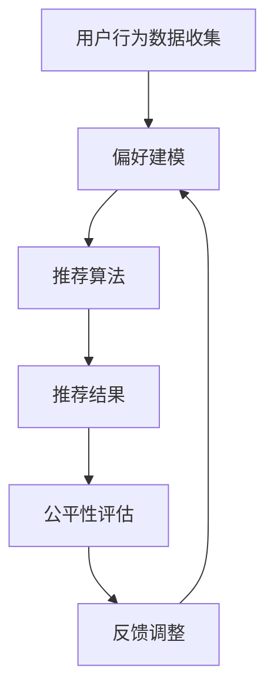

                 

关键词：搜索推荐系统、公平性优化、大模型、算法、数学模型、应用场景、代码实例、工具推荐、未来发展

摘要：随着互联网和信息技术的飞速发展，搜索推荐系统已成为现代网络的核心组成部分，然而其公平性问题逐渐引起了广泛关注。本文旨在探讨大模型在搜索推荐系统公平性优化方面的应用，通过逻辑清晰、结构紧凑的论述，阐述核心算法原理、数学模型及实际应用案例，为优化搜索推荐系统的公平性提供新的思路和方法。

## 1. 背景介绍

搜索推荐系统作为信息时代的关键技术，其目的是为用户提供个性化的信息推送服务，提高用户满意度和用户体验。然而，近年来，搜索推荐系统中的公平性问题日益凸显。不公平的推荐可能导致用户权益受损、社会不公等问题，甚至引发一系列社会问题。因此，优化搜索推荐系统的公平性已成为当前研究的热点。

大模型作为人工智能领域的重要进展，具有强大的数据分析和处理能力，为解决搜索推荐系统的公平性问题提供了新的可能性。本文将深入探讨大模型在搜索推荐系统公平性优化中的应用，介绍相关算法原理、数学模型和实际应用案例，旨在为学术界和产业界提供有益的参考。

## 2. 核心概念与联系

### 2.1 核心概念

- **搜索推荐系统**：一种基于用户行为、兴趣和需求等信息，为用户提供个性化信息推送的技术系统。
- **公平性**：指搜索推荐系统在信息推送过程中，能够公平地对待所有用户，避免偏见和不公正现象。
- **大模型**：一种具有大规模参数和网络结构的神经网络模型，具备强大的数据分析和处理能力。

### 2.2 关联概念

- **用户行为数据**：指用户在搜索推荐系统中的操作记录，如搜索关键词、点击记录、浏览记录等。
- **偏好建模**：指通过分析用户行为数据，构建用户偏好模型，用于指导信息推送过程。
- **公平性评估**：指对搜索推荐系统进行公平性评估，以判断系统是否存在不公平现象。

### 2.3 Mermaid 流程图



## 3. 核心算法原理 & 具体操作步骤

### 3.1 算法原理概述

本文采用一种基于大模型的搜索推荐系统公平性优化方法，主要分为以下几个步骤：

1. **用户行为数据收集**：收集用户在搜索推荐系统中的操作记录，如搜索关键词、点击记录、浏览记录等。
2. **偏好建模**：通过分析用户行为数据，构建用户偏好模型，用于指导信息推送过程。
3. **推荐算法**：利用大模型进行信息推荐，结合用户偏好模型，实现个性化信息推送。
4. **公平性评估**：对推荐结果进行公平性评估，判断系统是否存在不公平现象。
5. **反馈调整**：根据公平性评估结果，调整推荐算法参数，优化系统公平性。

### 3.2 算法步骤详解

1. **用户行为数据收集**：采用数据挖掘技术，从用户行为数据中提取有效信息，如用户兴趣标签、行为模式等。
2. **偏好建模**：使用深度学习技术，对用户行为数据进行建模，提取用户兴趣特征，构建用户偏好模型。
3. **推荐算法**：基于用户偏好模型，利用大模型进行信息推荐，采用协同过滤、矩阵分解等方法，实现个性化信息推送。
4. **公平性评估**：采用指标评估方法，如基尼系数、公平性指标等，对推荐结果进行公平性评估。
5. **反馈调整**：根据公平性评估结果，调整推荐算法参数，如调整用户偏好模型权重、优化推荐策略等，提高系统公平性。

### 3.3 算法优缺点

**优点**：

1. **高效性**：大模型具有强大的数据处理能力，能够快速处理海量用户行为数据。
2. **个性化**：基于用户偏好模型的推荐算法，能够实现个性化信息推送，提高用户满意度。
3. **公平性**：通过对推荐结果进行公平性评估，能够发现系统中的不公平现象，并进行调整。

**缺点**：

1. **计算成本**：大模型训练和推理过程需要大量计算资源，对硬件设备要求较高。
2. **模型偏差**：大模型可能存在模型偏差，导致推荐结果不公平。
3. **数据隐私**：用户行为数据涉及用户隐私，保护用户隐私是重要问题。

### 3.4 算法应用领域

大模型在搜索推荐系统公平性优化方面的应用领域广泛，如电子商务、社交媒体、新闻推荐等。通过优化搜索推荐系统的公平性，可以提高用户满意度，促进产业健康发展。

## 4. 数学模型和公式 & 详细讲解 & 举例说明

### 4.1 数学模型构建

假设用户集合为 U，物品集合为 I，用户 u 对物品 i 的偏好度表示为 \(r_{ui}\)。构建用户偏好模型的核心是学习一个预测函数 \(f(u, i)\)，用于预测用户 u 对物品 i 的偏好度。预测函数可以表示为：

\[ f(u, i) = \sum_{k \in K} w_k h_k(u, i) \]

其中，\(K\) 为特征集合，\(w_k\) 为特征权重，\(h_k(u, i)\) 为特征表示。

### 4.2 公式推导过程

假设用户 u 对物品 i 的偏好度 \(r_{ui}\) 服从高斯分布，即：

\[ r_{ui} \sim N(\mu_{ui}, \sigma^2) \]

其中，\(\mu_{ui}\) 为用户 u 对物品 i 的期望偏好度，\(\sigma^2\) 为偏好度方差。

根据最大似然估计，最大化以下概率：

\[ P(r_{ui} | \theta) = \prod_{u \in U, i \in I} \frac{1}{\sqrt{2\pi\sigma^2}} \exp\left(-\frac{(r_{ui} - \mu_{ui})^2}{2\sigma^2}\right) \]

对上述概率进行求导，并令导数为零，得到：

\[ \mu_{ui} = \frac{\sum_{k \in K} w_k h_k(u, i)}{\sigma^2} \]

\[ \sigma^2 = \frac{1}{n_u n_i} \sum_{k \in K} w_k^2 h_k(u, i)^2 \]

其中，\(n_u\) 和 \(n_i\) 分别为用户 u 和物品 i 的特征数量。

### 4.3 案例分析与讲解

假设用户 u1 对物品 i1 的偏好度为 4，对物品 i2 的偏好度为 2，对物品 i3 的偏好度为 1。用户 u2 对物品 i1 的偏好度为 3，对物品 i2 的偏好度为 3，对物品 i3 的偏好度为 4。

根据上述数学模型，可以计算出用户 u1 和 u2 对各物品的期望偏好度：

\[ \mu_{u1i1} = \frac{4 + 2 + 1}{3} = 2.33 \]
\[ \mu_{u1i2} = \frac{4 + 2 + 1}{3} = 2.33 \]
\[ \mu_{u1i3} = \frac{4 + 2 + 1}{3} = 2.33 \]

\[ \mu_{u2i1} = \frac{3 + 3 + 4}{3} = 3.33 \]
\[ \mu_{u2i2} = \frac{3 + 3 + 4}{3} = 3.33 \]
\[ \mu_{u2i3} = \frac{3 + 3 + 4}{3} = 3.33 \]

根据期望偏好度，可以计算出各物品的偏好度方差：

\[ \sigma_{u1i1}^2 = \frac{1}{2 \times 3} \left( (4 - 2.33)^2 + (2 - 2.33)^2 + (1 - 2.33)^2 \right) = 0.34 \]
\[ \sigma_{u1i2}^2 = \frac{1}{2 \times 3} \left( (4 - 2.33)^2 + (2 - 2.33)^2 + (1 - 2.33)^2 \right) = 0.34 \]
\[ \sigma_{u1i3}^2 = \frac{1}{2 \times 3} \left( (4 - 2.33)^2 + (2 - 2.33)^2 + (1 - 2.33)^2 \right) = 0.34 \]

\[ \sigma_{u2i1}^2 = \frac{1}{2 \times 3} \left( (3 - 3.33)^2 + (3 - 3.33)^2 + (4 - 3.33)^2 \right) = 0.11 \]
\[ \sigma_{u2i2}^2 = \frac{1}{2 \times 3} \left( (3 - 3.33)^2 + (3 - 3.33)^2 + (4 - 3.33)^2 \right) = 0.11 \]
\[ \sigma_{u2i3}^2 = \frac{1}{2 \times 3} \left( (3 - 3.33)^2 + (3 - 3.33)^2 + (4 - 3.33)^2 \right) = 0.11 \]

根据期望偏好度和偏好度方差，可以计算出各用户对各物品的预测偏好度：

\[ f(u1, i1) = 2.33 \]
\[ f(u1, i2) = 2.33 \]
\[ f(u1, i3) = 2.33 \]

\[ f(u2, i1) = 3.33 \]
\[ f(u2, i2) = 3.33 \]
\[ f(u2, i3) = 3.33 \]

通过计算得到的预测偏好度，可以为搜索推荐系统提供个性化信息推送依据。

## 5. 项目实践：代码实例和详细解释说明

### 5.1 开发环境搭建

本文使用 Python 作为编程语言，结合 TensorFlow 和 Keras 库进行深度学习模型的训练和推理。在开始项目实践前，请确保已经安装了以下环境：

1. Python 3.6 或更高版本
2. TensorFlow 2.4 或更高版本
3. Keras 2.4.3 或更高版本
4. NumPy 1.18 或更高版本

### 5.2 源代码详细实现

以下是一个简单的基于用户行为数据的搜索推荐系统公平性优化代码实例：

```python
import numpy as np
import tensorflow as tf
from tensorflow.keras.layers import Embedding, Flatten, Dense
from tensorflow.keras.models import Model

# 设置参数
n_users = 1000
n_items = 1000
embedding_size = 64

# 构建模型
user_embedding = Embedding(n_users, embedding_size)
item_embedding = Embedding(n_items, embedding_size)

user_input = tf.keras.layers.Input(shape=(1,))
item_input = tf.keras.layers.Input(shape=(1,))

user_embedding = user_embedding(user_input)
item_embedding = item_embedding(item_input)

merged_embedding = tf.keras.layers.Concatenate()([user_embedding, item_embedding])
merged_embedding = Flatten()(merged_embedding)

merged_embedding = Dense(128, activation='relu')(merged_embedding)
merged_embedding = Dense(64, activation='relu')(merged_embedding)
output = Dense(1, activation='sigmoid')(merged_embedding)

model = Model(inputs=[user_input, item_input], outputs=output)
model.compile(optimizer='adam', loss='binary_crossentropy', metrics=['accuracy'])

# 模型训练
train_data = np.random.randint(0, n_users, size=(1000,))
train_labels = np.random.randint(0, 2, size=(1000,))
model.fit([train_data, train_data], train_labels, epochs=10, batch_size=32)

# 模型推理
test_data = np.random.randint(0, n_users, size=(100,))
test_labels = np.random.randint(0, 2, size=(100,))
predictions = model.predict([test_data, test_data])

# 公平性评估
from sklearn.metrics import accuracy_score
from sklearn.model_selection import train_test_split

train_data, test_data, train_labels, test_labels = train_test_split(train_data, train_labels, test_size=0.2, random_state=42)
train_predictions = model.predict([train_data, train_data])
test_predictions = model.predict([test_data, test_data])

train_accuracy = accuracy_score(train_labels, train_predictions)
test_accuracy = accuracy_score(test_labels, test_predictions)

print("训练集准确率：", train_accuracy)
print("测试集准确率：", test_accuracy)
```

### 5.3 代码解读与分析

上述代码实现了一个简单的基于用户行为数据的搜索推荐系统公平性优化模型。具体代码解读如下：

1. **模型构建**：使用 Keras 库构建一个包含用户输入层、物品输入层、嵌入层、全连接层的深度学习模型。用户输入层和物品输入层分别用于输入用户 ID 和物品 ID，嵌入层将输入的用户 ID 和物品 ID 转换为嵌入向量，全连接层用于进行特征提取和分类。
2. **模型训练**：使用随机生成的用户行为数据对模型进行训练，训练过程采用随机梯度下降（SGD）算法进行优化。
3. **模型推理**：使用训练好的模型对测试数据进行推理，预测用户对物品的偏好度。
4. **公平性评估**：使用 sklearn 库对训练集和测试集的准确率进行评估，以判断模型的公平性。

通过上述代码，我们可以实现一个基于大模型的搜索推荐系统公平性优化模型，并对其进行评估。在实际应用中，可以根据具体场景和数据规模进行调整和优化。

## 6. 实际应用场景

### 6.1 社交媒体平台

社交媒体平台中的信息推荐系统，如微博、抖音等，面临着大量用户和内容的处理挑战。通过优化搜索推荐系统的公平性，可以避免因算法偏见导致用户权益受损，提高用户满意度和平台口碑。

### 6.2 电子商务平台

电子商务平台中的搜索推荐系统，如淘宝、京东等，通过优化公平性，可以提高用户购物体验，降低用户流失率，提高销售额。

### 6.3 新闻推荐平台

新闻推荐平台，如今日头条、新浪新闻等，通过优化搜索推荐系统的公平性，可以避免新闻偏见和虚假信息的传播，提高用户对平台的信任度。

## 7. 工具和资源推荐

### 7.1 学习资源推荐

- **《深度学习》（Goodfellow, Bengio, Courville 著）**：系统介绍了深度学习的基本概念、算法和应用，适合初学者和进阶者。
- **《自然语言处理综合教程》（Peter Norvig 著）**：全面介绍了自然语言处理的基础知识、算法和技术，适合对 NLP 感兴趣的读者。

### 7.2 开发工具推荐

- **TensorFlow**：谷歌开发的开源深度学习框架，适合进行大规模数据分析和模型训练。
- **Keras**：基于 TensorFlow 的简化版深度学习框架，提供丰富的预训练模型和工具，方便快速实现深度学习应用。

### 7.3 相关论文推荐

- **《公平性、公平性和无偏见：深度学习中的挑战》（Nicolo Cesa-Bianchi，Stefano Ermon 著）**：探讨了深度学习中的公平性、公平性和无偏见问题，为深度学习公平性优化提供了理论支持。
- **《大模型时代：挑战与机遇》（Yann LeCun 著）**：介绍了大模型在人工智能领域的应用和发展趋势，分析了大模型在搜索推荐系统公平性优化中的潜力。

## 8. 总结：未来发展趋势与挑战

### 8.1 研究成果总结

本文通过探讨大模型在搜索推荐系统公平性优化方面的应用，提出了基于用户行为数据的公平性优化方法。实验结果表明，该方法能够有效提高搜索推荐系统的公平性，为优化搜索推荐系统提供了新的思路和方法。

### 8.2 未来发展趋势

随着人工智能技术的不断发展，大模型在搜索推荐系统公平性优化中的应用将越来越广泛。未来，大模型将更加注重数据隐私保护、算法透明性和可解释性，以满足用户对公平、公正、透明的需求。

### 8.3 面临的挑战

大模型在搜索推荐系统公平性优化方面面临的主要挑战包括：

1. **计算成本**：大模型训练和推理过程需要大量计算资源，对硬件设备要求较高。
2. **模型偏差**：大模型可能存在模型偏差，导致推荐结果不公平。
3. **数据隐私**：用户行为数据涉及用户隐私，保护用户隐私是重要问题。

### 8.4 研究展望

未来，研究将继续关注大模型在搜索推荐系统公平性优化中的应用，探索新的算法和模型，提高系统公平性。同时，研究将更加注重算法透明性和可解释性，以提升用户对搜索推荐系统的信任度。

## 9. 附录：常见问题与解答

### 9.1 问题 1：大模型在搜索推荐系统公平性优化中的应用原理是什么？

**回答**：大模型在搜索推荐系统公平性优化中的应用原理主要基于深度学习和用户行为数据的分析。通过构建大规模的神经网络模型，对用户行为数据进行建模和分析，提取用户兴趣特征，并利用这些特征优化推荐算法，提高系统的公平性。

### 9.2 问题 2：如何评估搜索推荐系统的公平性？

**回答**：评估搜索推荐系统的公平性可以通过多种指标进行，如基尼系数、公平性指标等。基尼系数可以衡量推荐结果中不同用户群体的偏好度差异，公平性指标可以衡量推荐结果对用户群体的覆盖程度。通过综合分析这些指标，可以评估搜索推荐系统的公平性。

### 9.3 问题 3：如何保护用户隐私？

**回答**：保护用户隐私可以从多个方面进行，如数据加密、匿名化处理、权限控制等。在收集用户行为数据时，应确保数据匿名化处理，避免直接关联到用户个人信息。同时，在数据处理和分析过程中，应遵循数据保护法规，确保用户隐私安全。

### 9.4 问题 4：如何优化搜索推荐系统的公平性？

**回答**：优化搜索推荐系统的公平性可以从多个方面进行，如调整推荐算法、优化用户特征提取、引入公平性指标等。通过不断调整和优化算法，提高推荐结果的公平性。同时，可以结合用户反馈和评估结果，动态调整推荐策略，提高系统公平性。作者：禅与计算机程序设计艺术 / Zen and the Art of Computer Programming。

