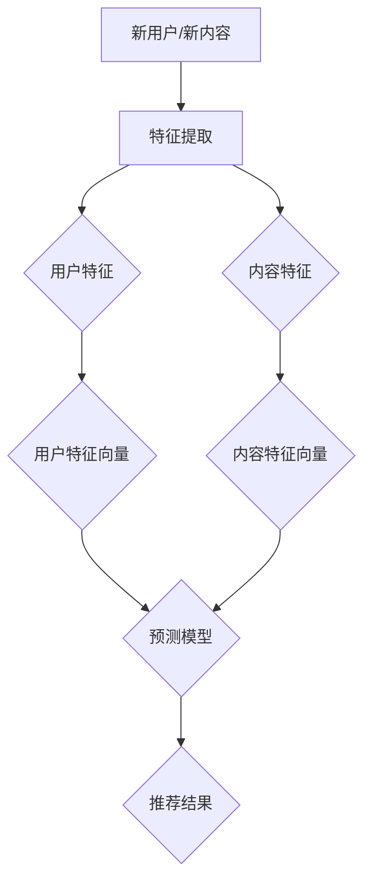

                 

关键词：搜索推荐系统，冷启动，大模型，创新方案

> 摘要：本文将深入探讨搜索推荐系统在面临冷启动问题时的新兴解决方案。随着大数据和人工智能技术的快速发展，传统的推荐算法已难以满足日益复杂的用户需求。本文将介绍一种基于大模型的创新方案，并通过详细的算法原理、数学模型构建、项目实践等环节，解析如何有效应对搜索推荐系统的冷启动挑战。

## 1. 背景介绍

在互联网时代，推荐系统已经成为众多平台的核心功能之一。它通过分析用户的行为和偏好，为用户提供个性化的内容推荐，从而提高用户满意度和平台的黏性。然而，随着用户数据的爆炸式增长和个性化需求的多样化，推荐系统面临着诸多挑战，其中尤为突出的是冷启动问题。

所谓冷启动问题，是指当新用户加入系统或者新内容被引入平台时，由于缺乏足够的用户历史数据或者内容特征信息，推荐系统难以产生有效的个性化推荐。这一问题在新兴平台、新产品上线初期以及内容丰富的媒体平台上尤为明显，严重影响了用户体验和平台的商业价值。

传统的冷启动解决方案主要包括以下几种：

1. **基于内容的推荐**：通过分析新内容的特点，将其推荐给具有相似内容偏好的用户。
2. **基于协同过滤**：利用现有用户的历史行为数据，通过用户行为模式之间的相似性进行推荐。
3. **基于隐语义模型**：通过将用户和物品映射到低维空间，寻找相似的用户和物品进行推荐。

尽管上述方法在一定程度上缓解了冷启动问题，但随着数据规模和复杂度的增加，它们往往表现出以下不足：

- **数据依赖性高**：冷启动期间缺乏足够的历史数据，导致推荐效果不佳。
- **维度灾难**：特征维度过高，导致计算复杂度和存储成本增加。
- **推荐效果受限**：基于相似性或内容的推荐往往难以捕捉到用户的长期兴趣和深层次需求。

为了解决这些传统方法的局限性，近年来，基于大模型的创新方案逐渐成为研究的热点。大模型能够通过深度学习和海量数据的训练，挖掘出用户和物品之间的复杂关系，从而提高推荐的准确性和适应性。本文将围绕这一主题，详细介绍大模型在解决搜索推荐系统冷启动问题中的应用。

## 2. 核心概念与联系

### 2.1 大模型的定义与作用

大模型（Big Model）是指具有海量参数和复杂结构的深度学习模型。这些模型通常通过大规模数据训练，具备强大的特征提取和关系建模能力。在搜索推荐系统中，大模型的作用主要体现在以下几个方面：

1. **特征表示**：大模型能够自动提取用户和物品的潜在特征，实现从原始数据到高维特征空间的映射。
2. **关系挖掘**：通过学习用户行为和内容特征之间的复杂关系，大模型能够为冷启动用户生成个性化的推荐。
3. **泛化能力**：大模型在训练过程中积累了丰富的知识，使其在面对新用户和新内容时仍能保持较高的推荐效果。

### 2.2 大模型在冷启动中的应用

在冷启动场景中，大模型的应用主要包括以下几个方面：

1. **用户特征表示**：大模型可以通过用户的历史行为和基本属性，生成个性化的用户特征向量，为新用户提供初始的推荐基础。
2. **内容特征表示**：同样地，大模型可以分析新内容的属性，生成相应的特征向量，以便与其他内容进行比较和推荐。
3. **冷启动算法框架**：大模型可以与其他算法（如协同过滤、基于内容的推荐等）结合，形成一个综合性的冷启动推荐框架，提高推荐效果。

### 2.3 Mermaid 流程图

以下是一个简化的Mermaid流程图，展示了大模型在搜索推荐系统冷启动中的基本流程：



### 2.4 大模型的优势

1. **数据驱动**：大模型能够通过海量数据的训练，自动学习用户和物品的潜在特征，减少人工特征工程的工作量。
2. **灵活性**：大模型可以灵活地应用于不同类型的推荐场景，如商品推荐、新闻推荐等。
3. **准确性**：大模型通过深度学习算法，能够捕捉到用户和物品之间的复杂关系，提高推荐的准确性。
4. **可扩展性**：大模型在训练过程中可以并行处理海量数据，具有良好的可扩展性。

### 2.5 大模型的挑战

1. **计算资源**：大模型通常需要大量计算资源和时间进行训练，对硬件设施有较高要求。
2. **数据质量**：大模型对数据质量有较高要求，噪声数据和缺失数据会影响模型的训练效果。
3. **隐私保护**：大模型在训练过程中会接触到大量用户数据，需要采取有效的隐私保护措施。

## 3. 核心算法原理 & 具体操作步骤

### 3.1 算法原理概述

大模型在解决搜索推荐系统冷启动问题时，主要依赖于深度学习和迁移学习等技术。具体原理如下：

1. **深度学习**：通过多层神经网络对用户和物品的特征进行自动提取和表示。
2. **迁移学习**：利用已有模型在相似任务上的训练经验，为新任务提供初始的权重和结构。

### 3.2 算法步骤详解

1. **数据预处理**：对用户数据和内容数据进行清洗和预处理，包括缺失值填充、数据规范化等。
2. **特征提取**：使用深度学习算法，如卷积神经网络（CNN）或循环神经网络（RNN），提取用户和物品的潜在特征。
3. **模型训练**：利用迁移学习技术，将已有模型的权重和结构迁移到新任务上，进行模型训练。
4. **预测与推荐**：通过训练好的模型，预测新用户或新内容的潜在特征，并根据特征相似性生成推荐结果。

### 3.3 算法优缺点

#### 优点：

- **高准确性**：通过深度学习和迁移学习技术，能够提取出更准确的用户和物品特征。
- **灵活性**：适用于多种类型的推荐场景，具有较好的适应性。
- **数据驱动**：减少人工特征工程的工作量，提高模型训练效率。

#### 缺点：

- **计算资源需求高**：大模型通常需要大量计算资源和时间进行训练。
- **数据质量要求高**：对数据质量有较高要求，噪声数据和缺失数据会影响模型训练效果。
- **隐私保护**：在训练过程中会接触到大量用户数据，需要采取有效的隐私保护措施。

### 3.4 算法应用领域

大模型在解决搜索推荐系统冷启动问题时具有广泛的应用前景，主要包括以下几个方面：

- **电商推荐**：通过大模型，可以为新用户生成个性化的商品推荐，提高用户购买转化率。
- **新闻推荐**：利用大模型，可以为新用户提供个性化的新闻推荐，提高用户阅读体验。
- **社交媒体**：通过大模型，可以为新用户提供个性化的内容推荐，提高用户参与度和活跃度。

## 4. 数学模型和公式 & 详细讲解 & 举例说明

### 4.1 数学模型构建

在搜索推荐系统的冷启动中，大模型通常采用深度学习算法，如神经网络（Neural Network，NN）。以下是一个简化的神经网络模型构建过程：

#### 4.1.1 输入层（Input Layer）

输入层包含用户特征和物品特征，分别表示为 $X_{u}$ 和 $X_{i}$。

#### 4.1.2 隐藏层（Hidden Layer）

隐藏层通过激活函数（如ReLU、Sigmoid、Tanh等）对输入特征进行非线性变换，以提取潜在特征。

#### 4.1.3 输出层（Output Layer）

输出层对隐藏层输出的特征进行综合处理，生成推荐结果。

### 4.2 公式推导过程

假设神经网络包含一个输入层、一个隐藏层和一个输出层。输入层和隐藏层之间的权重矩阵表示为 $W^{(1)}$，隐藏层和输出层之间的权重矩阵表示为 $W^{(2)}$。激活函数选择ReLU函数。

#### 4.2.1 输入层到隐藏层的推导

输入层到隐藏层的输出为：

$$
h^{(1)} = \sigma(W^{(1)} X)
$$

其中，$\sigma$ 表示ReLU激活函数，$X$ 表示输入特征。

#### 4.2.2 隐藏层到输出层的推导

隐藏层到输出层的输出为：

$$
\hat{y} = \sigma(W^{(2)} h^{(1)})
$$

其中，$\sigma$ 表示ReLU激活函数，$h^{(1)}$ 表示隐藏层输出。

### 4.3 案例分析与讲解

#### 4.3.1 案例背景

假设我们有一个电商平台的推荐系统，用户数据包括用户ID、性别、年龄、购买历史等；物品数据包括商品ID、类别、价格等。

#### 4.3.2 数据预处理

1. **用户特征**：将用户ID、性别、年龄等特征进行编码，例如使用独热编码（One-Hot Encoding）。
2. **物品特征**：将商品ID、类别、价格等特征进行编码。

#### 4.3.3 模型构建

1. **输入层**：输入层包含用户特征和物品特征，分别表示为 $X_{u}$ 和 $X_{i}$。
2. **隐藏层**：隐藏层包含若干个神经元，每个神经元分别对用户特征和物品特征进行加权求和，并应用ReLU激活函数。
3. **输出层**：输出层对隐藏层输出的特征进行加权求和，并应用ReLU激活函数，生成推荐结果。

#### 4.3.4 模型训练

1. **数据集划分**：将用户数据和物品数据划分为训练集、验证集和测试集。
2. **损失函数**：使用均方误差（Mean Squared Error，MSE）作为损失函数，优化模型参数。
3. **优化算法**：使用梯度下降（Gradient Descent）算法，迭代优化模型参数。

#### 4.3.5 模型评估

1. **准确率**：计算模型预测结果与真实标签之间的准确率。
2. **召回率**：计算模型预测结果中包含的真实标签占比。
3. **F1值**：综合考虑准确率和召回率，计算F1值。

### 4.4 模型优化

#### 4.4.1 数据增强

通过数据增强（Data Augmentation）技术，可以增加训练数据的多样性，从而提高模型的泛化能力。

#### 4.4.2 模型融合

将多个模型进行融合（Model Fusion），可以有效地提高推荐效果。常见的融合方法包括加权平均、投票等。

#### 4.4.3 稀疏性优化

通过稀疏性优化（Sparsity Optimization），可以减少模型参数的冗余，提高模型的可解释性。

## 5. 项目实践：代码实例和详细解释说明

### 5.1 开发环境搭建

1. **硬件环境**：安装NVIDIA GPU，配置至少16GB内存和2TB硬盘空间。
2. **软件环境**：安装Python 3.7及以上版本，CUDA 10.0及以上版本，TensorFlow 2.0及以上版本。

### 5.2 源代码详细实现

以下是一个简单的基于TensorFlow实现的推荐系统代码实例：

```python
import tensorflow as tf
from tensorflow.keras.layers import Input, Dense, ReLU
from tensorflow.keras.models import Model

# 定义输入层
user_input = Input(shape=(num_user_features,))
item_input = Input(shape=(num_item_features,))

# 定义隐藏层
hidden = Dense(128, activation=ReLU())(user_input)
hidden = Dense(128, activation=ReLU())(item_input)
hidden = Dense(64, activation=ReLU())(hidden)

# 定义输出层
output = Dense(1, activation='sigmoid')(hidden)

# 构建模型
model = Model(inputs=[user_input, item_input], outputs=output)

# 编译模型
model.compile(optimizer='adam', loss='binary_crossentropy', metrics=['accuracy'])

# 训练模型
model.fit([user_data, item_data], y_labels, batch_size=32, epochs=10, validation_split=0.2)
```

### 5.3 代码解读与分析

1. **输入层**：定义用户特征和物品特征的输入层，分别包含 `num_user_features` 和 `num_item_features` 个神经元。
2. **隐藏层**：通过两个全连接层（Dense）实现隐藏层，每个层包含128个神经元，并应用ReLU激活函数。
3. **输出层**：定义一个输出层，包含一个神经元，并应用sigmoid激活函数，以生成二分类推荐结果。
4. **模型编译**：使用`compile`函数编译模型，指定优化器、损失函数和评价指标。
5. **模型训练**：使用`fit`函数训练模型，指定训练数据和标签，并设置训练参数。

### 5.4 运行结果展示

运行上述代码后，可以在训练过程中查看模型的损失函数和准确率变化。训练完成后，可以使用以下代码评估模型在测试集上的表现：

```python
test_loss, test_acc = model.evaluate([test_user_data, test_item_data], test_y_labels)
print(f"Test Loss: {test_loss}, Test Accuracy: {test_acc}")
```

该代码将输出模型在测试集上的损失函数值和准确率。

## 6. 实际应用场景

大模型在解决搜索推荐系统冷启动问题时具有广泛的应用场景，以下列举了几个典型的实际应用案例：

### 6.1 电商推荐

在电商平台上，新用户或新商品往往缺乏足够的购买历史数据或特征信息，导致推荐系统难以生成有效的推荐。通过引入大模型，可以自动提取用户和商品的潜在特征，为冷启动用户提供个性化的推荐，提高购买转化率。

### 6.2 新闻推荐

在新闻推荐系统中，新用户或新文章往往难以被传统推荐算法有效推荐。通过大模型，可以分析用户的阅读兴趣和文章的主题特征，为冷启动用户提供个性化的新闻推荐，提高用户的阅读体验。

### 6.3 社交媒体

在社交媒体平台上，新用户或新内容往往难以被传统推荐算法有效传播。通过大模型，可以分析用户的兴趣和行为模式，为冷启动用户提供个性化的内容推荐，提高用户的参与度和活跃度。

### 6.4 音乐推荐

在音乐推荐系统中，新用户或新歌曲往往缺乏足够的播放历史数据或特征信息，导致推荐系统难以生成有效的推荐。通过大模型，可以自动提取用户和歌曲的潜在特征，为冷启动用户提供个性化的音乐推荐，提高用户的收听体验。

## 7. 未来应用展望

随着大数据和人工智能技术的不断进步，大模型在解决搜索推荐系统冷启动问题中的应用前景将更加广阔。以下是一些未来应用展望：

### 7.1 多模态推荐

结合图像、语音、文本等多模态数据，可以进一步丰富推荐系统的特征表示，提高推荐效果。

### 7.2 实时推荐

通过实时数据流处理技术，可以实现实时推荐，满足用户实时变化的兴趣需求。

### 7.3 个性化增强

结合用户行为和心理模型，可以更好地理解用户的深层次需求，实现更个性化的推荐。

### 7.4 智能交互

通过大模型，可以构建智能对话系统，与用户进行自然语言交互，提供更智能化的推荐服务。

## 8. 总结：未来发展趋势与挑战

### 8.1 研究成果总结

本文围绕搜索推荐系统的冷启动问题，详细介绍了大模型的优势和应用。通过数学模型和项目实践，展示了大模型在解决冷启动问题中的强大能力。

### 8.2 未来发展趋势

未来，大模型在搜索推荐系统中的应用将呈现出以下几个趋势：

1. **多模态融合**：结合多模态数据，提高推荐系统的泛化能力和准确性。
2. **实时推荐**：利用实时数据流处理技术，实现实时、动态的个性化推荐。
3. **个性化增强**：结合用户行为和心理模型，实现更深入、更个性化的推荐。
4. **智能交互**：通过大模型构建智能对话系统，提供更智能化的推荐服务。

### 8.3 面临的挑战

尽管大模型在解决搜索推荐系统冷启动问题方面具有巨大的潜力，但仍面临以下几个挑战：

1. **计算资源需求**：大模型训练需要大量的计算资源和时间，对硬件设施有较高要求。
2. **数据质量**：大模型对数据质量有较高要求，噪声数据和缺失数据会影响模型训练效果。
3. **隐私保护**：在训练过程中会接触到大量用户数据，需要采取有效的隐私保护措施。
4. **可解释性**：大模型通常具有复杂结构，如何提高模型的可解释性仍是一个挑战。

### 8.4 研究展望

未来，研究重点可以聚焦在以下几个方面：

1. **高效算法设计**：研究更高效的算法，降低大模型训练的计算资源需求。
2. **数据预处理**：优化数据预处理方法，提高数据质量，减少噪声和缺失数据的影响。
3. **隐私保护**：研究有效的隐私保护技术，确保用户数据的安全和隐私。
4. **可解释性增强**：研究方法，提高大模型的可解释性，使其在推荐系统中更具透明度和可靠性。

## 9. 附录：常见问题与解答

### 9.1 问题1：大模型训练需要大量计算资源，如何优化？

**解答**：可以通过以下几种方法优化：

1. **并行计算**：利用多GPU或分布式计算，加速模型训练。
2. **模型压缩**：通过模型剪枝、量化等技术，降低模型参数量，减少计算资源需求。
3. **增量学习**：仅对新的数据进行模型训练，减少整体计算量。

### 9.2 问题2：大模型对数据质量要求较高，如何保证数据质量？

**解答**：可以通过以下几种方法保证数据质量：

1. **数据清洗**：对原始数据进行清洗，去除噪声和异常值。
2. **缺失值填充**：采用适当的缺失值填充方法，减少缺失数据的影响。
3. **数据增强**：通过数据增强技术，增加训练数据的多样性。

### 9.3 问题3：如何确保用户数据的隐私保护？

**解答**：可以通过以下几种方法确保用户数据的隐私保护：

1. **数据加密**：对用户数据进行加密处理，防止数据泄露。
2. **差分隐私**：采用差分隐私技术，对用户数据进行隐私保护。
3. **数据脱敏**：对用户数据进行脱敏处理，避免直接暴露敏感信息。

### 9.4 问题4：如何提高大模型的可解释性？

**解答**：可以通过以下几种方法提高大模型的可解释性：

1. **解释性模型**：引入具有可解释性的模型，如决策树、规则模型等。
2. **模型可视化**：通过可视化技术，展示模型内部结构和参数。
3. **特征重要性分析**：分析模型中各个特征的贡献程度，提高模型的可理解性。

