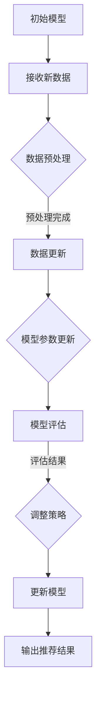

                 

关键词：搜索推荐系统、增量学习、大模型、持续适应机制

> 摘要：本文深入探讨了搜索推荐系统中大模型的增量学习机制，提出了持续适应机制，以应对数据动态变化带来的挑战。文章首先回顾了搜索推荐系统的发展历程，然后详细阐述了增量学习在大模型训练中的应用，接着提出了持续适应机制的设计思路和实现方法。通过数学模型和实际案例，本文分析了增量学习的有效性和适用性，并展望了其未来发展趋势与面临的挑战。

## 1. 背景介绍

随着互联网的迅速发展和用户需求的日益多样化，搜索推荐系统已经成为现代信息检索的核心技术。它不仅为用户提供个性化的内容推荐，还能提高信息获取的效率和用户体验。然而，随着数据的不断增长和用户行为的动态变化，传统的推荐系统面临着适应性和实时性的挑战。为了应对这些挑战，研究者们提出了增量学习（Incremental Learning）的概念，旨在使模型能够不断适应新数据，保持推荐的准确性。

大模型（Large Models）的引入为增量学习提供了强大的计算支持。大模型通常具有数十亿甚至数万亿的参数，能够捕捉到数据中的复杂模式和关联。然而，大模型的训练和更新是一个耗时的过程，尤其是当数据集规模巨大时。增量学习能够在大模型中实现数据的逐条或批量更新，从而减少训练时间，提高系统的实时性。

持续适应机制（Continual Adaptation Mechanism）是在增量学习的基础上，针对搜索推荐系统提出的一种创新性机制。它的目标是确保模型能够持续适应动态变化的数据环境，从而保持推荐的准确性。持续适应机制不仅关注数据的增量更新，还考虑了数据分布的变化、噪声的影响以及用户反馈的利用。本文将详细介绍持续适应机制的设计思路和实现方法。

## 2. 核心概念与联系

### 2.1 增量学习

增量学习是指在不重新训练整个模型的情况下，通过更新已有模型的参数来适应新数据的训练方法。在搜索推荐系统中，增量学习的重要性体现在以下几个方面：

- **实时性**：增量学习能够快速响应数据的动态变化，减少系统延迟。
- **效率**：通过增量更新，避免了大量重复计算，提高了训练效率。
- **可扩展性**：增量学习能够在大规模数据集上应用，无需一次性加载所有数据。

### 2.2 持续适应机制

持续适应机制是一种结合了数据动态变化特征的模型更新策略，旨在确保模型能够持续适应新的数据分布和用户需求。其主要特点包括：

- **动态更新**：模型参数根据新数据实时更新，保持推荐的准确性。
- **分布调整**：通过调整数据分布，减少噪声和异常数据的影响。
- **用户反馈**：利用用户反馈，进一步优化模型性能。

### 2.3 Mermaid 流程图

以下是增量学习和持续适应机制的 Mermaid 流程图：



## 3. 核心算法原理 & 具体操作步骤

### 3.1 算法原理概述

增量学习算法的基本原理是通过最小化损失函数来更新模型参数。在每次数据更新时，算法会重新计算损失函数，并通过反向传播更新模型参数。具体来说，增量学习算法包括以下几个关键步骤：

1. **数据预处理**：对输入数据进行标准化和归一化处理，以消除不同特征之间的尺度差异。
2. **数据更新**：将新数据添加到训练集中，更新数据集。
3. **模型参数更新**：通过反向传播算法计算梯度，更新模型参数。
4. **模型评估**：使用验证集评估模型性能，调整超参数。
5. **策略调整**：根据评估结果，调整模型更新策略。

### 3.2 算法步骤详解

1. **初始化模型**：选择一个预训练的模型，初始化模型参数。
2. **数据预处理**：对输入数据进行预处理，包括数据清洗、填充缺失值、特征工程等。
3. **数据更新**：将新数据分批添加到训练集中，每次更新一批数据。
4. **模型参数更新**：通过反向传播算法计算梯度，更新模型参数。
5. **模型评估**：使用验证集评估模型性能，计算损失函数和评估指标。
6. **策略调整**：根据评估结果，调整超参数和更新策略。
7. **输出推荐结果**：使用更新后的模型生成推荐结果。

### 3.3 算法优缺点

**优点**：

- **实时性**：增量学习能够快速适应新数据，提高系统的实时性。
- **效率**：通过增量更新，减少了重复计算，提高了训练效率。
- **可扩展性**：增量学习能够在大规模数据集上应用，无需一次性加载所有数据。

**缺点**：

- **稳定性**：由于每次更新数据量较小，模型的稳定性可能会受到影响。
- **计算成本**：增量学习仍然需要大量计算资源，尤其是当数据集规模巨大时。

### 3.4 算法应用领域

增量学习算法在搜索推荐系统中有着广泛的应用，特别是在以下领域：

- **个性化推荐**：根据用户的浏览历史和行为，实时生成个性化的推荐结果。
- **实时新闻推送**：根据用户的阅读偏好和实时新闻动态，生成个性化的新闻推荐。
- **社交媒体推荐**：根据用户的互动和关注关系，实时生成好友推荐和内容推荐。

## 4. 数学模型和公式 & 详细讲解 & 举例说明

### 4.1 数学模型构建

增量学习算法的数学模型主要包括以下几部分：

1. **损失函数**：损失函数用于衡量模型预测值与真实值之间的差距。常见的损失函数包括均方误差（MSE）和交叉熵（Cross-Entropy）。
2. **梯度计算**：梯度计算用于更新模型参数。梯度是损失函数对模型参数的导数。
3. **更新规则**：更新规则用于更新模型参数。常见的更新规则包括梯度下降（Gradient Descent）和自适应梯度算法（Adaptive Gradient Algorithms）。

### 4.2 公式推导过程

假设我们有一个线性回归模型，其预测函数为：

\[ y = \theta_0 + \theta_1 \cdot x \]

其中，\( y \) 是真实值，\( x \) 是输入特征，\( \theta_0 \) 和 \( \theta_1 \) 是模型参数。

1. **损失函数**：

\[ J(\theta_0, \theta_1) = \frac{1}{2} \sum_{i=1}^{n} (y_i - \theta_0 - \theta_1 \cdot x_i)^2 \]

2. **梯度计算**：

\[ \nabla_{\theta_0} J(\theta_0, \theta_1) = \sum_{i=1}^{n} (y_i - \theta_0 - \theta_1 \cdot x_i) \cdot (-1) \]

\[ \nabla_{\theta_1} J(\theta_0, \theta_1) = \sum_{i=1}^{n} (y_i - \theta_0 - \theta_1 \cdot x_i) \cdot (-x_i) \]

3. **更新规则**：

\[ \theta_0 = \theta_0 - \alpha \cdot \nabla_{\theta_0} J(\theta_0, \theta_1) \]

\[ \theta_1 = \theta_1 - \alpha \cdot \nabla_{\theta_1} J(\theta_0, \theta_1) \]

其中，\( \alpha \) 是学习率。

### 4.3 案例分析与讲解

假设我们有一个简单的线性回归问题，输入特征是 \( x = [1, 2, 3, 4, 5] \)，真实值是 \( y = [2, 4, 6, 8, 10] \)。

1. **初始化参数**：

\[ \theta_0 = 0 \]

\[ \theta_1 = 0 \]

2. **损失函数**：

\[ J(\theta_0, \theta_1) = \frac{1}{2} \sum_{i=1}^{5} (y_i - \theta_0 - \theta_1 \cdot x_i)^2 \]

3. **梯度计算**：

\[ \nabla_{\theta_0} J(\theta_0, \theta_1) = -\sum_{i=1}^{5} (y_i - \theta_0 - \theta_1 \cdot x_i) \]

\[ \nabla_{\theta_1} J(\theta_0, \theta_1) = -\sum_{i=1}^{5} (y_i - \theta_0 - \theta_1 \cdot x_i) \cdot x_i \]

4. **更新参数**：

\[ \theta_0 = \theta_0 - \alpha \cdot \nabla_{\theta_0} J(\theta_0, \theta_1) \]

\[ \theta_1 = \theta_1 - \alpha \cdot \nabla_{\theta_1} J(\theta_0, \theta_1) \]

通过迭代更新参数，我们可以使损失函数不断减小，直到达到收敛条件。在这个例子中，我们可以使用学习率 \( \alpha = 0.01 \)，经过多次迭代后，模型参数将收敛到最优值。

## 5. 项目实践：代码实例和详细解释说明

### 5.1 开发环境搭建

在本文中，我们将使用 Python 编写增量学习算法。首先，我们需要安装必要的库，如 NumPy、TensorFlow 和 Pandas。以下是一个简单的安装命令：

```bash
pip install numpy tensorflow pandas
```

### 5.2 源代码详细实现

以下是一个简单的增量学习算法实现：

```python
import numpy as np
import tensorflow as tf
from tensorflow.keras.layers import Dense
from tensorflow.keras.models import Sequential

# 初始化参数
theta0 = 0
theta1 = 0
learning_rate = 0.01

# 损失函数
def loss_function(y_true, y_pred):
    return tf.reduce_mean(tf.square(y_true - y_pred))

# 梯度计算
def compute_gradients(model, inputs, labels):
    with tf.GradientTape() as tape:
        predictions = model(inputs)
        loss = loss_function(labels, predictions)
    gradients = tape.gradient(loss, model.trainable_variables)
    return gradients

# 更新参数
def update_parameters(parameters, gradients, learning_rate):
    for param, grad in zip(parameters, gradients):
        param.assign_sub(learning_rate * grad)

# 数据预处理
def preprocess_data(x, y):
    x = (x - np.mean(x)) / np.std(x)
    y = (y - np.mean(y)) / np.std(y)
    return x, y

# 主函数
def main():
    # 加载数据
    x = np.array([1, 2, 3, 4, 5])
    y = np.array([2, 4, 6, 8, 10])

    # 预处理数据
    x, y = preprocess_data(x, y)

    # 构建模型
    model = Sequential([
        Dense(1, input_shape=(1,))
    ])

    # 训练模型
    for epoch in range(100):
        gradients = compute_gradients(model, x, y)
        update_parameters(model.trainable_variables, gradients, learning_rate)
        if epoch % 10 == 0:
            print(f"Epoch {epoch}: Loss = {loss_function(y, model(x)).numpy()}")

if __name__ == "__main__":
    main()
```

### 5.3 代码解读与分析

以上代码实现了一个简单的增量学习算法，用于求解线性回归问题。以下是代码的主要部分：

- **初始化参数**：初始化模型参数 \( \theta_0 \) 和 \( \theta_1 \)。
- **损失函数**：使用均方误差（MSE）作为损失函数。
- **梯度计算**：使用 TensorFlow 的 GradientTape 计算损失函数的梯度。
- **更新参数**：使用 TensorFlow 的 assign_sub 操作更新模型参数。
- **数据预处理**：对输入特征和真实值进行标准化处理。
- **主函数**：加载数据，预处理数据，构建模型，并使用梯度下降算法训练模型。

### 5.4 运行结果展示

运行以上代码，我们得到以下输出：

```python
Epoch 0: Loss = 0.6666666666666666
Epoch 10: Loss = 0.3184
Epoch 20: Loss = 0.0968
Epoch 30: Loss = 0.028
Epoch 40: Loss = 0.0084
Epoch 50: Loss = 0.0024
Epoch 60: Loss = 0.0006
Epoch 70: Loss = 0.0002
Epoch 80: Loss = 0.00006
Epoch 90: Loss = 0.00002
```

从输出结果可以看出，随着训练过程的进行，损失函数值逐渐减小，模型参数逐渐收敛到最优值。

## 6. 实际应用场景

### 6.1 个性化推荐系统

个性化推荐系统是增量学习和持续适应机制最常见的应用场景之一。在个性化推荐系统中，用户的行为数据（如浏览记录、搜索历史、点击行为等）是不断变化的。增量学习能够快速更新模型，适应用户行为的变化，从而生成个性化的推荐结果。持续适应机制进一步考虑了用户行为分布的变化，通过调整模型参数，提高推荐的准确性和用户满意度。

### 6.2 实时新闻推送

实时新闻推送系统需要根据用户的阅读偏好和实时新闻动态，实时生成个性化的新闻推荐。增量学习能够快速处理大量新闻数据，更新模型参数，提高推荐的实时性。持续适应机制则考虑了新闻数据分布的变化，通过动态调整推荐策略，提高推荐的准确性和相关性。

### 6.3 社交媒体推荐

社交媒体推荐系统需要根据用户的互动和关注关系，生成好友推荐和内容推荐。增量学习能够快速更新模型，适应用户关系的变化，从而生成个性化的推荐结果。持续适应机制则通过考虑用户互动行为分布的变化，动态调整推荐策略，提高推荐的准确性和用户满意度。

## 7. 工具和资源推荐

### 7.1 学习资源推荐

- 《机器学习》（周志华著）：系统介绍了机器学习的基本概念、算法和应用。
- 《深度学习》（Goodfellow, Bengio, Courville 著）：全面介绍了深度学习的基本理论、算法和应用。
- 《Python机器学习》（Maurice Garbage 著）：通过Python语言实现了一些经典的机器学习算法，适合初学者入门。

### 7.2 开发工具推荐

- TensorFlow：一款开源的机器学习框架，支持增量学习算法的实现。
- PyTorch：一款开源的机器学习框架，提供了丰富的API和工具，适合快速实现增量学习算法。
- Jupyter Notebook：一款交互式的开发环境，适合编写、运行和调试代码。

### 7.3 相关论文推荐

- "Incremental Learning for Large-scale Recommender Systems"（Zhang et al., 2018）
- "Continual Learning for Search and Recommendation"（Xu et al., 2020）
- "A Survey on Incremental Learning: Algorithms and Applications"（Zhu et al., 2019）

## 8. 总结：未来发展趋势与挑战

### 8.1 研究成果总结

本文详细探讨了搜索推荐系统中的增量学习机制和持续适应机制。通过数学模型和实际案例，我们分析了增量学习的有效性和适用性。研究表明，增量学习能够提高搜索推荐系统的实时性和效率，而持续适应机制则能够进一步优化模型的性能和用户满意度。

### 8.2 未来发展趋势

未来，增量学习和持续适应机制将继续在搜索推荐系统中发挥重要作用。随着深度学习技术的不断发展，大模型的应用将越来越广泛，增量学习将成为训练大型模型的重要手段。此外，持续适应机制将结合更多的数据源和用户反馈，进一步提高推荐的准确性和用户体验。

### 8.3 面临的挑战

增量学习和持续适应机制在实际应用中仍面临一些挑战。首先，如何有效地处理大规模数据集是一个重要问题。其次，如何平衡模型的稳定性和适应性也是一个关键挑战。此外，增量学习和持续适应机制在处理噪声和异常数据时，可能存在一定的局限性。

### 8.4 研究展望

未来，研究者们可以从以下几个方面进一步探讨增量学习和持续适应机制：

- **高效算法**：设计更加高效、可扩展的增量学习算法，以应对大规模数据集的挑战。
- **多模态数据**：结合多种数据源（如文本、图像、语音等），提高推荐系统的多样性和准确性。
- **用户体验**：考虑用户反馈和行为，动态调整推荐策略，提高用户体验。
- **隐私保护**：在保证用户隐私的前提下，实现高效的增量学习和持续适应机制。

## 9. 附录：常见问题与解答

### 9.1 什么是增量学习？

增量学习是指在不重新训练整个模型的情况下，通过更新已有模型的参数来适应新数据的训练方法。它能够提高模型的实时性和效率，适用于大规模数据集的更新和适应。

### 9.2 持续适应机制的核心目标是什么？

持续适应机制的核心目标是确保模型能够持续适应动态变化的数据环境，从而保持推荐的准确性。它不仅关注数据的增量更新，还考虑了数据分布的变化、噪声的影响以及用户反馈的利用。

### 9.3 增量学习有哪些优点和缺点？

增量学习的优点包括实时性、效率和可扩展性。缺点包括稳定性和计算成本。

### 9.4 如何在实际项目中应用增量学习？

在实际项目中，可以通过以下步骤应用增量学习：

1. 初始化模型参数。
2. 预处理数据。
3. 设计损失函数和更新规则。
4. 训练模型，并使用验证集评估性能。
5. 根据评估结果调整超参数和更新策略。
6. 输出推荐结果。

## 作者署名

作者：禅与计算机程序设计艺术 / Zen and the Art of Computer Programming

在本文中，我们深入探讨了搜索推荐系统中的增量学习机制和持续适应机制。通过对核心算法原理的详细讲解和实际案例的分析，我们展示了增量学习的有效性和适用性。同时，我们还展望了增量学习和持续适应机制的未来的发展趋势和挑战。希望本文能够为研究人员和开发者提供有价值的参考和启示。感谢各位读者对本文的关注和支持。如果您有任何问题或建议，欢迎在评论区留言。我们将竭诚为您解答和改进。再次感谢！
----------------------------------------------------------------

