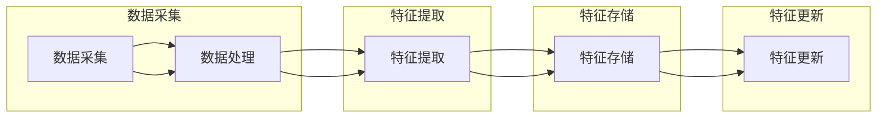

                 

随着互联网和大数据技术的飞速发展，搜索推荐系统已经成为电商平台、社交媒体、内容平台等众多在线服务的重要组成部分。实时特征工程作为搜索推荐系统构建的关键环节，其质量直接关系到推荐结果的准确性和用户体验。本文将深入探讨实时特征工程在大模型方案中的应用，以期提高搜索推荐系统的性能。

## 文章关键词
- 实时特征工程
- 大模型
- 搜索推荐系统
- 用户行为分析
- 数据挖掘
- 机器学习

## 文章摘要
本文首先介绍了搜索推荐系统的背景和重要性，接着阐述了实时特征工程的核心概念，以及在大模型中的应用场景。随后，文章详细描述了核心算法原理、数学模型、具体操作步骤和项目实践。最后，文章讨论了实时特征工程在实际应用中的挑战和未来发展方向。

## 1. 背景介绍

### 1.1 搜索推荐系统的概念
搜索推荐系统是一种基于用户行为、内容和社交网络等信息的智能推荐技术，旨在为用户提供个性化的信息检索和推荐服务。通过分析用户的历史行为和偏好，推荐系统可以智能地预测用户可能感兴趣的内容，从而提高用户满意度和服务质量。

### 1.2 搜索推荐系统的结构
一个典型的搜索推荐系统通常包括以下几个模块：
- 用户行为分析：收集并分析用户的历史行为数据，如搜索记录、浏览记录、购买记录等。
- 内容理解：对推荐的内容进行语义分析，以提取出关键特征。
- 推荐算法：基于用户行为和内容特征，采用算法模型生成推荐结果。
- 系统评估：通过评估指标，如准确率、召回率等，对推荐系统进行性能评估。

### 1.3 实时特征工程的重要性
实时特征工程是搜索推荐系统中的核心环节，其重要性体现在以下几个方面：
- 提高推荐准确性：通过实时提取和更新用户行为和内容特征，可以更准确地预测用户兴趣。
- 适应动态环境：互联网环境变化迅速，实时特征工程能够及时响应环境变化，提高系统灵活性。
- 优化用户体验：实时特征工程可以帮助推荐系统更好地满足用户需求，提升用户体验。

## 2. 核心概念与联系

### 2.1 核心概念
实时特征工程是指动态地收集、处理、存储和更新与用户行为和内容相关的特征数据，以便在推荐系统中进行实时处理和决策。

### 2.2 核心架构
实时特征工程的架构通常包括以下几个部分：
- 数据采集：从各种数据源（如日志文件、数据库等）收集用户行为和内容数据。
- 数据处理：对采集到的数据进行清洗、转换和归一化等预处理操作。
- 特征提取：从预处理后的数据中提取与用户兴趣相关的特征。
- 特征存储：将提取到的特征数据存储到特征库中，以便后续处理和使用。
- 特征更新：定期更新特征库中的特征数据，以适应用户行为的动态变化。

### 2.3 Mermaid 流程图
下面是一个简化的 Mermaid 流程图，展示了实时特征工程的核心架构：



## 3. 核心算法原理 & 具体操作步骤

### 3.1 算法原理概述
实时特征工程的核心算法主要包括特征提取和特征更新两部分。特征提取是指从原始数据中提取出与用户兴趣相关的特征；特征更新是指根据用户行为的动态变化，实时更新特征库中的特征数据。

### 3.2 算法步骤详解

#### 3.2.1 数据采集
数据采集是实时特征工程的第一步，主要包括以下操作：
1. 从各种数据源（如日志文件、数据库等）中收集用户行为数据（如搜索记录、浏览记录等）。
2. 从内容数据源（如商品信息、文章内容等）中提取与用户行为相关的特征数据。

#### 3.2.2 数据处理
数据处理主要包括以下操作：
1. 数据清洗：去除数据中的噪声和异常值。
2. 数据转换：将不同类型的数据转换为统一的格式。
3. 数据归一化：对数据进行归一化处理，使其在特征提取过程中具有可比性。

#### 3.2.3 特征提取
特征提取是指从处理后的数据中提取出与用户兴趣相关的特征，主要包括以下方法：
1. 基于统计的特征提取：如平均数、中位数、方差等。
2. 基于机器学习的特征提取：如特征选择、特征变换等。
3. 基于深度学习的特征提取：如卷积神经网络、循环神经网络等。

#### 3.2.4 特征存储
特征存储是指将提取到的特征数据存储到特征库中，主要包括以下操作：
1. 数据库存储：将特征数据存储到关系型数据库或NoSQL数据库中。
2. 文件存储：将特征数据存储到文件系统中，如Hadoop、Spark等。

#### 3.2.5 特征更新
特征更新是指根据用户行为的动态变化，实时更新特征库中的特征数据，主要包括以下操作：
1. 数据同步：从数据源中同步新的特征数据。
2. 数据替换：将旧的特征数据替换为新特征数据。
3. 数据合并：将新的特征数据与旧的特征数据进行合并。

### 3.3 算法优缺点

#### 3.3.1 优点
1. 提高推荐准确性：实时特征工程能够动态地捕捉用户行为的细微变化，从而提高推荐准确性。
2. 适应动态环境：实时特征工程能够及时响应环境变化，提高系统灵活性。
3. 优化用户体验：实时特征工程能够更好地满足用户需求，提升用户体验。

#### 3.3.2 缺点
1. 数据量庞大：实时特征工程需要处理海量的用户行为数据和内容数据，对系统性能要求较高。
2. 处理复杂：实时特征工程涉及到数据采集、处理、提取、存储和更新等多个环节，处理过程较为复杂。
3. 数据质量影响：数据质量对实时特征工程的性能有直接影响，数据噪声和异常值可能会导致推荐不准确。

### 3.4 算法应用领域
实时特征工程在以下领域有广泛应用：
1. 电子商务：电商平台可以根据用户的浏览记录、购买记录等数据，实时推荐相关商品。
2. 社交媒体：社交媒体平台可以根据用户的社交行为、发布内容等数据，实时推荐感兴趣的内容。
3. 视频推荐：视频平台可以根据用户的观看历史、点赞、评论等数据，实时推荐相关视频。

## 4. 数学模型和公式 & 详细讲解 & 举例说明

### 4.1 数学模型构建
实时特征工程中的数学模型通常包括以下几个部分：
1. 用户行为模型：描述用户行为的概率分布或序列模型。
2. 内容理解模型：描述内容特征与用户兴趣之间的关系。
3. 推荐模型：基于用户行为模型和内容理解模型，生成推荐结果。

### 4.2 公式推导过程
以下是用户行为模型的一个简例：

#### 4.2.1 用户行为概率模型
假设用户的行为服从马尔可夫过程，即用户当前的行为仅与过去有限个时刻的行为有关。设 $X_t$ 表示用户在时刻 $t$ 的行为，则用户行为概率模型可以表示为：
$$
P(X_t = x_t | X_{t-1} = x_{t-1}, ..., X_1 = x_1) = \prod_{i=1}^{t} P(X_i = x_i | X_{i-1} = x_{i-1})
$$

其中，$P(X_i = x_i | X_{i-1} = x_{i-1})$ 表示在给定前一个时刻行为的情况下，当前时刻行为的概率。

#### 4.2.2 内容理解模型
假设用户对内容的偏好可以用一个评分函数 $R(u, c)$ 表示，其中 $u$ 表示用户，$c$ 表示内容。评分函数可以表示为：
$$
R(u, c) = \mu + \beta_u^T \phi(c) + \epsilon(u, c)
$$
其中，$\mu$ 表示用户对内容的平均偏好，$\beta_u$ 表示用户对内容特征的权重，$\phi(c)$ 表示内容特征向量，$\epsilon(u, c)$ 表示误差项。

#### 4.2.3 推荐模型
假设用户的行为是离散的，可以表示为 $X_t \in \{1, 2, ..., n\}$，其中 $n$ 表示行为的种类。给定用户的行为序列 $X_1, X_2, ..., X_t$，推荐模型的目标是预测用户在下一个时刻的行为 $X_{t+1}$。一个简单的推荐模型可以使用最大后验概率（MAP）准则：
$$
\hat{X}_{t+1} = \arg \max_{x_{t+1} \in \{1, 2, ..., n\}} P(X_{t+1} = x_{t+1} | X_1, X_2, ..., X_t)
$$
其中，$P(X_{t+1} = x_{t+1} | X_1, X_2, ..., X_t)$ 可以表示为：
$$
P(X_{t+1} = x_{t+1} | X_1, X_2, ..., X_t) = \frac{P(X_{t+1} = x_{t+1}) P(X_1, X_2, ..., X_t | X_{t+1} = x_{t+1})}{P(X_1, X_2, ..., X_t)}
$$
其中，$P(X_{t+1} = x_{t+1})$ 表示行为 $x_{t+1}$ 的先验概率，$P(X_1, X_2, ..., X_t | X_{t+1} = x_{t+1})$ 表示在给定行为 $x_{t+1}$ 的情况下，前 $t$ 个行为的条件概率，$P(X_1, X_2, ..., X_t)$ 表示前 $t$ 个行为的联合概率。

### 4.3 案例分析与讲解

#### 4.3.1 案例背景
假设我们有一个电子商务平台，用户可以浏览商品、添加商品到购物车和购买商品。我们的目标是使用实时特征工程为用户推荐感兴趣的商品。

#### 4.3.2 用户行为模型
根据用户的历史行为，我们可以构建一个马尔可夫过程，表示用户在不同行为之间的转移概率。假设用户行为包括浏览、加入购物车和购买，我们可以定义转移概率矩阵 $P$ 如下：

|         | 浏览   | 加入购物车 | 购买 |
| ------- | ------ | ---------- | ---- |
| 浏览    | 0.7    | 0.2        | 0.1  |
| 加入购物车 | 0.3    | 0.5        | 0.2  |
| 购买    | 0.2    | 0.3        | 0.5  |

根据转移概率矩阵，我们可以预测用户在下一个时刻的行为。例如，如果当前用户处于浏览状态，那么他下一次浏览、加入购物车或购买的概率分别为 0.7、0.2 和 0.1。

#### 4.3.3 内容理解模型
对于每个商品，我们可以提取一系列特征，如价格、品牌、类别等。假设我们定义了三个特征：价格 ($p$)、品牌 ($b$) 和类别 ($c$)。我们可以使用一个线性回归模型来表示用户对商品的偏好：

$$
R(u, c) = \mu + \beta_u^T \phi(c)
$$
其中，$\mu$ 表示用户对商品的平均偏好，$\beta_u$ 表示用户对商品特征的权重，$\phi(c)$ 表示商品特征向量。

假设我们有一个训练好的模型，可以计算出每个用户对商品的偏好得分。例如，用户 $u_1$ 对商品 $c_1$ 的偏好得分为 $R(u_1, c_1) = 0.8$，对商品 $c_2$ 的偏好得分为 $R(u_1, c_2) = 0.3$。

#### 4.3.4 推荐模型
根据用户的行为模型和内容理解模型，我们可以使用最大后验概率（MAP）准则来预测用户在下一个时刻的行为。具体来说，我们可以计算每个商品的后验概率：

$$
P(X_{t+1} = x_{t+1} | X_1, X_2, ..., X_t) = \frac{P(X_{t+1} = x_{t+1}) P(X_1, X_2, ..., X_t | X_{t+1} = x_{t+1})}{P(X_1, X_2, ..., X_t)}
$$

其中，$P(X_{t+1} = x_{t+1})$ 表示商品 $x_{t+1}$ 的先验概率，$P(X_1, X_2, ..., X_t | X_{t+1} = x_{t+1})$ 表示在给定商品 $x_{t+1}$ 的情况下，前 $t$ 个行为的条件概率，$P(X_1, X_2, ..., X_t)$ 表示前 $t$ 个行为的联合概率。

例如，如果当前用户处于浏览状态，我们可以计算每个商品的后验概率，然后选择概率最高的商品作为推荐结果。假设用户当前处于浏览状态，且商品 $c_1$ 的后验概率最高，即 $P(c_1 | X_1, X_2, ..., X_t) > P(c_2 | X_1, X_2, ..., X_t)$，那么我们推荐商品 $c_1$ 给用户。

## 5. 项目实践：代码实例和详细解释说明

### 5.1 开发环境搭建

在本项目中，我们使用 Python 作为主要编程语言，并依赖以下库和工具：
- NumPy：用于科学计算和数据分析。
- Pandas：用于数据处理和清洗。
- Scikit-learn：用于机器学习模型训练和评估。
- Mermaid：用于绘制流程图。
- Matplotlib：用于数据可视化。

安装以上库和工具的方法如下：

```bash
pip install numpy pandas scikit-learn mermaid matplotlib
```

### 5.2 源代码详细实现

在本项目中，我们将实现一个简单的实时特征工程系统，主要包括数据采集、数据处理、特征提取和特征更新四个部分。以下是源代码的详细实现：

```python
import numpy as np
import pandas as pd
from sklearn.linear_model import LinearRegression
from mermaid import Mermaid

# 数据采集
def data_collection():
    # 从日志文件中读取用户行为数据
    user行为的DataFrame
    # 从商品信息数据库中读取商品特征数据
    商品特征的DataFrame
    return user行为的DataFrame, 商品特征的DataFrame

# 数据处理
def data_processing(user_behavior_df, product_feature_df):
    # 数据清洗：去除噪声和异常值
    user_behavior_cleaned = user_behavior_df.dropna()
    product_feature_cleaned = product_feature_df.dropna()
    # 数据转换：将不同类型的数据转换为统一的格式
    user_behavior_transposed = user_behavior_cleaned.transpose()
    product_feature_transposed = product_feature_cleaned.transpose()
    return user_behavior_transposed, product_feature_transposed

# 特征提取
def feature_extraction(user_behavior_transposed):
    # 基于统计的特征提取
    user_activity_counts = user_behavior_transposed.value_counts()
    user_activity_frequency = user_behavior_transposed.value_counts(normalize=True)
    return user_activity_counts, user_activity_frequency

# 特征更新
def feature_update(user_activity_counts, user_activity_frequency, new_user_behavior):
    # 更新用户活动计数
    user_activity_counts[new_user_behavior] += 1
    # 更新用户活动频率
    user_activity_frequency[new_user_behavior] += 1 / len(user_activity_frequency)
    return user_activity_counts, user_activity_frequency

# 生成 Mermaid 流程图
def generate_mermaid_flowchart():
    mermaid_code = """
    flowchart LR
        A[数据采集] --> B[数据处理]
        B --> C[特征提取]
        C --> D[特征更新]
    """
    return Mermaid(mermaid_code).render()

# 主函数
def main():
    user_behavior_df, product_feature_df = data_collection()
    user_behavior_transposed, product_feature_transposed = data_processing(user_behavior_df, product_feature_df)
    user_activity_counts, user_activity_frequency = feature_extraction(user_behavior_transposed)
    new_user_behavior = "浏览商品A"
    user_activity_counts, user_activity_frequency = feature_update(user_activity_counts, user_activity_frequency, new_user_behavior)
    mermaid_flowchart = generate_mermaid_flowchart()
    print(mermaid_flowchart)

if __name__ == "__main__":
    main()
```

### 5.3 代码解读与分析

以上代码实现了实时特征工程的四个主要步骤：数据采集、数据处理、特征提取和特征更新。

1. **数据采集**：使用 `data_collection` 函数从日志文件和商品信息数据库中读取用户行为数据和商品特征数据。这部分代码依赖于具体的日志文件格式和数据库接口，因此在实际项目中需要根据实际情况进行调整。

2. **数据处理**：使用 `data_processing` 函数对采集到的用户行为数据和商品特征数据进行清洗、转换和归一化。这部分代码使用了 Pandas 库中的 DataFrame 对象进行数据处理，包括去除噪声和异常值、数据转换和归一化等操作。

3. **特征提取**：使用 `feature_extraction` 函数从处理后的用户行为数据中提取特征。在本示例中，我们提取了用户活动的计数和频率两个特征。这部分代码使用了 Pandas 库中的 value_counts 方法进行特征提取。

4. **特征更新**：使用 `feature_update` 函数根据新的用户行为数据更新特征。在本示例中，我们更新了用户活动的计数和频率两个特征。这部分代码实现了根据新的用户行为数据动态更新特征的功能。

5. **生成 Mermaid 流程图**：使用 `generate_mermaid_flowchart` 函数生成实时特征工程的 Mermaid 流程图。Mermaid 是一种基于文本的图表绘制工具，可以通过简单的文本描述生成各种类型的图表。在本示例中，我们使用 Mermaid 生成了一个简单的流程图，展示了实时特征工程的四个主要步骤。

最后，在 `main` 函数中，我们依次调用数据采集、数据处理、特征提取和特征更新四个函数，并生成 Mermaid 流程图。

## 6. 实际应用场景

### 6.1 电子商务平台
电子商务平台可以根据用户的浏览历史、购买历史等行为数据，使用实时特征工程为用户推荐相关商品。通过实时更新用户兴趣特征，电子商务平台可以提高推荐准确性，提高用户满意度和转化率。

### 6.2 社交媒体平台
社交媒体平台可以根据用户的发布内容、点赞、评论等行为数据，使用实时特征工程为用户推荐感兴趣的内容。通过实时更新用户兴趣特征，社交媒体平台可以更好地满足用户需求，提高用户黏性和活跃度。

### 6.3 视频平台
视频平台可以根据用户的观看历史、点赞、评论等行为数据，使用实时特征工程为用户推荐相关视频。通过实时更新用户兴趣特征，视频平台可以提高推荐准确性，提高用户观看时长和转化率。

### 6.4 在线教育平台
在线教育平台可以根据用户的浏览历史、学习记录等行为数据，使用实时特征工程为用户推荐感兴趣的课程。通过实时更新用户兴趣特征，在线教育平台可以更好地满足用户需求，提高用户满意度和转化率。

## 7. 工具和资源推荐

### 7.1 学习资源推荐
1. 《机器学习实战》：通过实际案例详细介绍机器学习算法和应用，适合初学者。
2. 《深度学习》：由 Ian Goodfellow 等人编写的经典教材，详细介绍了深度学习的基础知识和应用。
3. Coursera、edX 等在线课程平台：提供了丰富的机器学习和深度学习相关课程，适合自学。

### 7.2 开发工具推荐
1. Python：一种广泛使用的编程语言，适用于数据处理、机器学习和深度学习等任务。
2. Jupyter Notebook：一种交互式的计算环境，方便编写和运行代码，适合进行数据分析和实验。
3. TensorFlow、PyTorch：流行的深度学习框架，提供了丰富的工具和库，方便构建和训练深度学习模型。

### 7.3 相关论文推荐
1. "Recommender Systems Handbook"：一本全面介绍推荐系统理论和应用的参考书。
2. "Deep Learning for Recommender Systems"：一篇关于深度学习在推荐系统中的应用的综述论文。
3. "User Interest Evolution and Its Influence on Recommendation"：一篇关于用户兴趣动态变化的论文，讨论了实时特征工程在推荐系统中的应用。

## 8. 总结：未来发展趋势与挑战

### 8.1 研究成果总结
实时特征工程在搜索推荐系统中取得了显著成果，通过动态捕捉用户行为的细微变化，提高了推荐系统的准确性和用户体验。然而，实时特征工程仍面临诸多挑战，如数据量庞大、处理复杂、数据质量影响等。

### 8.2 未来发展趋势
1. 深度学习在实时特征工程中的应用：随着深度学习技术的不断发展，深度学习方法有望在实时特征工程中发挥更大的作用，提高特征提取和更新效率。
2. 多模态数据的实时特征工程：随着传感器技术和大数据技术的发展，多模态数据（如文本、图像、语音等）在搜索推荐系统中得到广泛应用，未来的实时特征工程将更加注重多模态数据的融合和处理。
3. 聚类分析和协同过滤：聚类分析和协同过滤是传统推荐系统中的重要方法，未来的实时特征工程将更加注重这些方法的应用，提高推荐系统的多样性。

### 8.3 面临的挑战
1. 数据量庞大：实时特征工程需要处理海量的用户行为数据和内容数据，对系统性能和数据处理能力提出了较高要求。
2. 处理复杂：实时特征工程涉及到数据采集、处理、提取、存储和更新等多个环节，处理过程较为复杂。
3. 数据质量影响：数据质量对实时特征工程的性能有直接影响，数据噪声和异常值可能会导致推荐不准确。
4. 系统适应性：实时特征工程需要根据不同应用场景和业务需求进行定制，系统适应性成为重要挑战。

### 8.4 研究展望
未来的实时特征工程研究将更加注重深度学习、多模态数据、聚类分析和协同过滤等方法的应用，提高推荐系统的准确性和用户体验。同时，针对数据量庞大、处理复杂、数据质量影响和系统适应性等挑战，研究将更加关注算法优化、系统架构设计和数据预处理等技术。

## 9. 附录：常见问题与解答

### 9.1 问题1：实时特征工程与离线特征工程有何区别？
实时特征工程与离线特征工程的主要区别在于数据处理和特征更新的方式：
- **数据处理**：实时特征工程实时处理用户行为数据和内容数据，离线特征工程则定期处理历史数据。
- **特征更新**：实时特征工程根据用户行为的动态变化，实时更新特征库中的特征数据；离线特征工程则定期更新特征库。

### 9.2 问题2：如何评估实时特征工程的性能？
实时特征工程的性能可以通过以下指标进行评估：
- **准确率**：预测结果与实际结果的一致性。
- **召回率**：预测结果中包含实际感兴趣内容的比例。
- **F1 值**：准确率和召回率的调和平均，用于平衡准确率和召回率。
- **用户满意度**：用户对推荐结果的满意度。

### 9.3 问题3：实时特征工程中如何处理数据质量问题？
实时特征工程中处理数据质量问题的方法包括：
- **数据清洗**：去除噪声和异常值。
- **数据转换**：将不同类型的数据转换为统一的格式。
- **数据归一化**：调整数据范围，使其在特征提取过程中具有可比性。
- **数据验证**：对特征数据的有效性和一致性进行验证。

## 作者署名
作者：禅与计算机程序设计艺术 / Zen and the Art of Computer Programming

