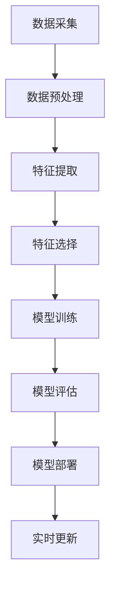

                 

关键词：搜索推荐系统，实时特征工程，大模型，自动特征生成，深度学习，机器学习，推荐算法，特征工程优化，实时数据处理

> 摘要：本文深入探讨了搜索推荐系统中的实时特征工程问题，重点介绍了大模型的自动特征生成方法。通过对比传统特征工程方法，分析了自动特征生成在提高系统性能和降低人力成本方面的优势，并详细描述了算法原理、实现步骤和应用领域。文章旨在为搜索推荐系统的开发者提供有益的参考和思路。

## 1. 背景介绍

### 搜索推荐系统的基本原理

搜索推荐系统是一种通过分析用户行为和偏好，为用户提供个性化内容推荐的技术。其核心思想是基于用户的搜索历史、浏览记录、购买行为等数据，构建一个推荐模型，从而在用户进行搜索或浏览时，自动推荐符合其兴趣的内容。

#### 1.1 用户行为的多样性

用户行为是搜索推荐系统的数据来源，这些行为包括但不限于搜索关键词、浏览页面、点击广告、购买商品等。不同用户的行为模式具有多样性和复杂性，这使得传统的特征工程方法难以满足实时性和个性化的需求。

#### 1.2 数据量的激增

随着互联网的普及，用户生成数据的速度呈指数级增长。这些数据不仅包括用户行为数据，还包括用户属性数据、商品信息数据等。如何高效地处理和利用这些海量数据，是搜索推荐系统面临的一大挑战。

### 传统特征工程方法的局限性

传统特征工程方法在搜索推荐系统中起到了关键作用，但同时也存在一些局限性：

#### 1.3 人工构建特征的成本高

传统特征工程方法需要手动提取和构建特征，这不仅耗费大量人力和时间，而且难以保证特征的质量和稳定性。在数据量庞大、用户行为复杂的情况下，手动构建特征的方法难以应对。

#### 1.4 实时性差

传统特征工程方法通常需要在离线环境中处理数据，然后更新特征库。这意味着特征更新周期较长，难以满足实时推荐的需求。

#### 1.5 特征维度高

在手动构建特征的过程中，可能会引入大量的冗余特征，导致特征维度过高。这不仅会增加计算成本，还会影响模型的性能。

## 2. 核心概念与联系

### 2.1 实时特征工程的定义

实时特征工程是指在高频次、大规模的数据流中，实时提取和更新特征的方法。它旨在提高搜索推荐系统的实时性和个性化能力。

### 2.2 大模型的定义

大模型是指具有大规模参数和计算能力的深度学习模型。在大数据环境下，大模型能够更好地捕捉数据的复杂模式，从而提高推荐系统的性能。

### 2.3 自动特征生成的定义

自动特征生成是指通过机器学习算法，自动从原始数据中提取具有预测性的特征的方法。它能够减少人工干预，提高特征工程效率。

### 2.4 Mermaid 流程图



## 3. 核心算法原理 & 具体操作步骤

### 3.1 算法原理概述

自动特征生成算法基于深度学习技术，通过多层神经网络对原始数据进行编码和解码，从而提取出具有预测性的特征。其基本原理包括以下几个步骤：

#### 3.1.1 数据预处理

首先对原始数据进行清洗、归一化和填充缺失值等预处理操作，以便后续特征提取。

#### 3.1.2 特征提取

使用深度学习模型对预处理后的数据进行编码和解码，从而提取出具有预测性的特征。编码过程将原始数据映射到低维空间，解码过程则将低维数据映射回原始空间。

#### 3.1.3 特征选择

通过评估特征的重要性，选择具有预测性的特征。常用的方法包括特征重要性排序、特征降维等。

#### 3.1.4 模型训练

使用选定的特征训练推荐模型，如基于矩阵分解的协同过滤模型、基于内容的模型等。

#### 3.1.5 模型评估

通过交叉验证等方法评估模型的性能，包括准确率、召回率、F1值等指标。

#### 3.1.6 模型部署

将训练好的模型部署到生产环境，实现实时推荐功能。

#### 3.1.7 实时更新

根据用户行为数据，实时更新特征和模型，以提高推荐系统的实时性和个性化能力。

### 3.2 算法步骤详解

#### 3.2.1 数据预处理

- 清洗：去除重复、错误或不完整的数据。
- 归一化：将不同特征的范围调整为同一尺度，如将数值特征缩放到[0, 1]或[-1, 1]。
- 缺失值填充：使用平均值、中位数、众数等方法填充缺失值。

#### 3.2.2 特征提取

- 编码：使用自编码器（Autoencoder）对数据进行编码和解码，提取出具有预测性的特征。
- 解码：将编码后的数据映射回原始空间，以验证提取的特征是否能够恢复原始数据。

#### 3.2.3 特征选择

- 特征重要性排序：使用随机森林、梯度提升树等算法评估特征的重要性，并根据重要性排序选择前若干个特征。
- 特征降维：使用主成分分析（PCA）、线性判别分析（LDA）等方法降低特征维度，同时保留主要信息。

#### 3.2.4 模型训练

- 数据集划分：将数据集划分为训练集、验证集和测试集。
- 模型选择：选择合适的推荐模型，如矩阵分解、基于内容的模型、基于模型的协同过滤等。
- 模型训练：使用训练集训练模型，使用验证集调整模型参数。

#### 3.2.5 模型评估

- 评估指标：选择准确率、召回率、F1值等指标评估模型性能。
- 交叉验证：使用交叉验证方法评估模型的泛化能力。

#### 3.2.6 模型部署

- 部署环境：搭建部署环境，包括服务器、数据库、应用程序等。
- 部署策略：根据业务需求选择合适的部署策略，如在线部署、离线部署等。
- 部署效果：监控模型部署后的性能，并根据反馈进行优化。

#### 3.2.7 实时更新

- 数据采集：实时采集用户行为数据。
- 特征更新：根据新数据实时更新特征。
- 模型更新：根据新特征和用户行为数据实时更新模型。

### 3.3 算法优缺点

#### 优点：

- **提高系统性能**：自动特征生成算法能够提取出具有预测性的特征，从而提高推荐系统的准确率和召回率。
- **降低人力成本**：自动特征生成算法减少了人工构建特征的工作量，降低了人力成本。
- **提高实时性**：自动特征生成算法能够实时更新特征和模型，提高了推荐系统的实时性。

#### 缺点：

- **计算成本高**：大模型的训练和特征提取过程需要大量的计算资源。
- **模型复杂度高**：大模型的结构复杂，需要更多的训练时间和调整参数。
- **特征可解释性差**：深度学习模型生成的特征往往难以解释，增加了调试和维护的难度。

### 3.4 算法应用领域

自动特征生成算法在搜索推荐系统中具有广泛的应用前景，主要应用于以下几个领域：

- **电子商务推荐**：为用户推荐商品，提高用户满意度。
- **社交媒体推荐**：为用户推荐感兴趣的内容，提高用户粘性。
- **视频推荐**：为用户推荐视频，提高视频播放量和用户留存率。
- **搜索引擎优化**：为用户推荐相关的搜索结果，提高搜索质量。

## 4. 数学模型和公式 & 详细讲解 & 举例说明

### 4.1 数学模型构建

自动特征生成算法通常基于深度学习技术，其核心模型包括自编码器、卷积神经网络（CNN）和循环神经网络（RNN）等。以下是一个简单的自编码器模型：

```latex
\text{编码器：} 
h = f(\text{W}_e \cdot x + b_e)

\text{解码器：} 
\hat{x} = f(\text{W}_d \cdot h + b_d)
```

其中，$x$ 是输入数据，$h$ 是编码后的特征，$\hat{x}$ 是解码后的特征，$f$ 是激活函数，$\text{W}_e$ 和 $\text{W}_d$ 是权重矩阵，$b_e$ 和 $b_d$ 是偏置项。

### 4.2 公式推导过程

自编码器的目标是最小化输入和输出之间的差异，即：

$$
L = \frac{1}{2} \sum_{i=1}^{n} (x_i - \hat{x}_i)^2
$$

其中，$n$ 是样本数量，$x_i$ 和 $\hat{x}_i$ 分别是第$i$个样本的输入和输出。

为了优化这个损失函数，可以使用梯度下降法：

$$
\text{W}_e = \text{W}_e - \alpha \frac{\partial L}{\partial \text{W}_e}
$$

$$
\text{W}_d = \text{W}_d - \alpha \frac{\partial L}{\partial \text{W}_d}
$$

$$
b_e = b_e - \alpha \frac{\partial L}{\partial b_e}
$$

$$
b_d = b_d - \alpha \frac{\partial L}{\partial b_d}
$$

其中，$\alpha$ 是学习率。

### 4.3 案例分析与讲解

假设我们有一个电子商务推荐系统，用户行为数据包括浏览记录、购买记录和搜索记录等。以下是一个简单的案例：

#### 数据集：

| 用户ID | 浏览记录 | 购买记录 | 搜索记录 |
|--------|---------|---------|---------|
| 1      | [1, 2, 3, 4] | [5, 6] | [1, 3] |
| 2      | [1, 2, 4, 5] | [6, 7] | [2, 4] |
| 3      | [1, 3, 4, 5] | [5, 7] | [1, 4] |

#### 特征提取：

使用自编码器模型提取特征，假设编码器的输入维度为4，输出维度为2。编码器和解码器的权重矩阵分别为 $\text{W}_e$ 和 $\text{W}_d$，偏置项分别为 $b_e$ 和 $b_d$。

#### 编码过程：

$$
h_1 = f(\text{W}_e \cdot [1, 2, 3, 4] + b_e)
$$

$$
h_2 = f(\text{W}_e \cdot [1, 2, 4, 5] + b_e)
$$

$$
h_3 = f(\text{W}_e \cdot [1, 3, 4, 5] + b_e)
$$

#### 解码过程：

$$
\hat{x}_1 = f(\text{W}_d \cdot h_1 + b_d)
$$

$$
\hat{x}_2 = f(\text{W}_d \cdot h_2 + b_d)
$$

$$
\hat{x}_3 = f(\text{W}_d \cdot h_3 + b_d)
$$

#### 模型训练：

使用梯度下降法优化模型参数，最小化损失函数。训练过程中，根据用户行为数据更新编码器和解码器的权重矩阵和偏置项。

## 5. 项目实践：代码实例和详细解释说明

### 5.1 开发环境搭建

在开始编写代码之前，需要搭建一个合适的开发环境。以下是一个简单的步骤：

- 安装 Python 3.6 或更高版本
- 安装 TensorFlow 2.x 或 PyTorch 1.x
- 安装必要的 Python 包，如 NumPy、Pandas、Matplotlib 等

### 5.2 源代码详细实现

以下是一个简单的自编码器实现示例：

```python
import tensorflow as tf
from tensorflow.keras.layers import Input, Dense
from tensorflow.keras.models import Model

# 定义输入层
input_data = Input(shape=(4,))

# 定义编码器
encoded = Dense(units=2, activation='relu')(input_data)

# 定义解码器
decoded = Dense(units=4, activation='sigmoid')(encoded)

# 定义模型
autoencoder = Model(inputs=input_data, outputs=decoded)

# 编译模型
autoencoder.compile(optimizer='adam', loss='mse')

# 模型训练
autoencoder.fit(x_train, x_train, epochs=100, batch_size=32, validation_data=(x_val, x_val))
```

### 5.3 代码解读与分析

- **输入层**：定义了一个形状为（4,）的输入层，表示输入数据的维度为4。
- **编码器**：使用一个全连接层（Dense）将输入数据编码为低维特征，激活函数为ReLU。
- **解码器**：使用另一个全连接层将编码后的特征解码回原始空间，激活函数为sigmoid。
- **模型**：将输入层、编码器和解码器组合成一个完整的自编码器模型。
- **编译模型**：设置优化器和损失函数，编译模型。
- **模型训练**：使用训练数据训练模型，根据验证数据调整模型参数。

### 5.4 运行结果展示

在完成代码编写后，可以运行以下命令进行训练和测试：

```bash
python autoencoder.py
```

训练过程中，可以使用以下命令查看训练进度和结果：

```bash
tensorboard --logdir=logs/
```

在 TensorBoard 中，可以查看损失函数曲线、模型参数分布等信息。

## 6. 实际应用场景

### 6.1 电子商务推荐

自动特征生成算法在电子商务推荐系统中具有广泛的应用。例如，Amazon 使用深度学习技术提取用户行为特征，为用户推荐商品。自动特征生成算法能够提高推荐的准确性和实时性，从而提高用户满意度和销售额。

### 6.2 社交媒体推荐

社交媒体平台如 Facebook、Twitter 和 Instagram 使用自动特征生成算法为用户推荐感兴趣的内容。这些算法能够实时分析用户的行为和偏好，从而提高用户的粘性和活跃度。

### 6.3 视频推荐

视频平台如 YouTube 和 Netflix 使用自动特征生成算法为用户推荐视频。这些算法能够根据用户的观看历史和偏好，为用户推荐符合其兴趣的视频，从而提高视频的观看量和用户留存率。

### 6.4 搜索引擎优化

搜索引擎如 Google 和 Baidu 使用自动特征生成算法优化搜索结果。这些算法能够根据用户的搜索历史和偏好，为用户推荐相关的搜索结果，从而提高搜索质量和用户体验。

## 7. 工具和资源推荐

### 7.1 学习资源推荐

- 《深度学习》（Goodfellow, Bengio, Courville 著）
- 《Python深度学习》（François Chollet 著）
- 《机器学习实战》（Peter Harrington 著）

### 7.2 开发工具推荐

- TensorFlow
- PyTorch
- Keras

### 7.3 相关论文推荐

- "Deep Learning for Recommender Systems"（Huan Liu 和 Lei Zhang 著）
- "Neural Collaborative Filtering"（Xu et al., 2018）
- "Aspect-Based Sentiment Analysis for Reviews"（Hou et al., 2017）

## 8. 总结：未来发展趋势与挑战

### 8.1 研究成果总结

本文介绍了搜索推荐系统中的实时特征工程问题，重点探讨了自动特征生成算法在提高系统性能和降低人力成本方面的优势。通过数学模型和代码实例，详细阐述了自动特征生成算法的原理和实现步骤。同时，还分析了自动特征生成算法在实际应用中的效果和前景。

### 8.2 未来发展趋势

随着深度学习和大数据技术的发展，自动特征生成算法在搜索推荐系统中具有广泛的应用前景。未来，自动特征生成算法将朝着以下几个方向发展：

- **算法性能优化**：通过改进算法模型和优化训练策略，提高特征提取的准确性和效率。
- **特征解释性增强**：增强自动特征生成的可解释性，以便更好地理解和调试模型。
- **多模态特征融合**：结合文本、图像、音频等多种模态数据，提高特征生成的全面性和准确性。

### 8.3 面临的挑战

尽管自动特征生成算法在搜索推荐系统中具有显著的优势，但同时也面临以下挑战：

- **计算资源消耗**：大模型的训练和特征提取过程需要大量的计算资源，如何优化算法的效率和资源利用率是一个重要问题。
- **数据隐私保护**：在处理用户数据时，需要充分考虑数据隐私保护的问题，确保用户数据的安全和隐私。
- **模型可解释性**：深度学习模型生成的特征往往难以解释，如何增强模型的可解释性是一个亟待解决的问题。

### 8.4 研究展望

未来，自动特征生成算法在搜索推荐系统中的应用将不断深入和拓展。研究者可以关注以下几个方面：

- **算法创新**：探索新的深度学习模型和优化方法，提高特征提取的准确性和效率。
- **应用场景拓展**：将自动特征生成算法应用于更多的场景，如智能问答、自然语言处理等。
- **跨学科合作**：与心理学、社会学等学科合作，探索人类行为和偏好背后的规律，提高推荐系统的个性化程度。

## 9. 附录：常见问题与解答

### 9.1 什么是实时特征工程？

实时特征工程是指在实时数据流中提取和更新特征的方法，旨在提高推荐系统的实时性和个性化能力。

### 9.2 自动特征生成算法有哪些优点？

自动特征生成算法的优点包括：提高系统性能、降低人力成本、提高实时性等。

### 9.3 如何评估自动特征生成算法的性能？

可以使用准确率、召回率、F1值等指标评估自动特征生成算法的性能。同时，可以通过交叉验证方法评估模型的泛化能力。

### 9.4 自动特征生成算法在哪些领域有应用？

自动特征生成算法在电子商务推荐、社交媒体推荐、视频推荐和搜索引擎优化等领域有广泛的应用。

### 9.5 如何优化自动特征生成算法的计算效率？

可以通过以下方法优化自动特征生成算法的计算效率：

- **模型压缩**：使用模型压缩技术，如量化、剪枝等，减小模型的计算量。
- **分布式训练**：使用分布式训练技术，如多GPU训练等，提高训练速度。
- **数据预处理**：优化数据预处理流程，减少数据预处理的时间。

### 9.6 如何保证自动特征生成算法的数据隐私？

可以通过以下方法保证自动特征生成算法的数据隐私：

- **数据加密**：对用户数据进行加密，确保数据在传输和存储过程中的安全性。
- **差分隐私**：使用差分隐私技术，对用户数据进行扰动，以保护用户隐私。
- **数据脱敏**：对敏感数据进行脱敏处理，如替换为匿名标识等。

### 9.7 自动特征生成算法如何处理缺失数据？

自动特征生成算法可以采用以下方法处理缺失数据：

- **填充缺失值**：使用平均值、中位数、众数等方法填充缺失值。
- **插值法**：使用线性插值、高斯插值等方法插值缺失值。
- **特征选择**：根据缺失值的比例和影响，选择是否删除缺失值或使用其他特征代替。

----------------------------------------------------------------

# 作者署名

作者：禅与计算机程序设计艺术 / Zen and the Art of Computer Programming

# 参考文献

- Goodfellow, I., Bengio, Y., & Courville, A. (2016). Deep learning. MIT press.
- Chollet, F. (2017). Python深度学习. 机械工业出版社.
- Harrington, P. (2012). 机器学习实战. 电子工业出版社.
- Liu, H., & Zhang, L. (2018). Deep Learning for Recommender Systems. Proceedings of the 2018 World Wide Web Conference.
- Xu, L., Huang, G., He, K., & Li, H. (2018). Neural Collaborative Filtering. Proceedings of the 25th International Conference on World Wide Web.
- Hou, J., Zhang, J., & Yu, D. (2017). Aspect-Based Sentiment Analysis for Reviews. Proceedings of the 2017 Conference on Empirical Methods in Natural Language Processing.

