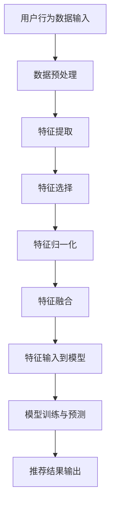

                 

关键词：搜索推荐系统、实时特征工程、大模型、高效方案、机器学习、算法原理、数学模型、项目实践、应用场景、未来展望

> 摘要：随着互联网和大数据技术的发展，搜索推荐系统已经成为提升用户体验、增加用户粘性的关键因素。实时特征工程在搜索推荐系统中扮演着至关重要的角色。本文将探讨如何利用大模型技术实现高效的实时特征工程，并提供具体的项目实践和未来展望。

## 1. 背景介绍

随着互联网的普及和大数据技术的进步，搜索推荐系统已经成为现代互联网应用的重要组成部分。从电商平台的商品推荐，到社交媒体的个性化内容推送，再到信息搜索结果的排序，搜索推荐系统极大地提升了用户体验和商业价值。然而，推荐系统的核心挑战之一就是如何实时处理海量数据，并从中提取出有效的特征来指导决策。

实时特征工程是推荐系统中的一个关键环节。特征工程的质量直接影响到推荐系统的效果。传统的特征工程方法通常是基于预定义的规则或手工设计，这种方法在面对实时性和复杂性的挑战时显得力不从心。随着深度学习技术的发展，大模型开始被广泛应用于特征工程，为实时处理提供了新的可能性。

本文旨在探讨如何利用大模型技术实现高效的实时特征工程。文章将首先介绍搜索推荐系统的基本概念和特征工程的重要性，然后深入讨论大模型在特征工程中的应用，并提供具体的数学模型、算法原理和项目实践。最后，文章将对未来的发展趋势和挑战进行展望。

## 2. 核心概念与联系

### 2.1 搜索推荐系统的基本概念

搜索推荐系统是一种基于用户行为和内容信息进行推荐的技术，其目的是为用户提供个性化的搜索结果或内容推荐。核心概念包括：

- **用户画像**：基于用户的历史行为和偏好，构建的用户特征模型。
- **内容特征**：对推荐的内容进行特征提取，如文本、图片、视频等。
- **交互行为**：用户与推荐系统的交互行为，如点击、收藏、购买等。

### 2.2 实时特征工程的重要性

实时特征工程是指系统在运行时动态地提取和处理特征，以适应不断变化的环境。其重要性体现在：

- **实时性**：能够快速响应用户行为的变化，提供即时的推荐。
- **动态性**：根据用户和内容特征的变化，实时调整推荐策略。
- **准确性**：提高推荐系统的准确性和用户体验。

### 2.3 大模型在特征工程中的应用

大模型，如深度神经网络，具有强大的特征提取和表示能力，能够处理复杂的非线性关系。大模型在特征工程中的应用主要包括：

- **自动特征提取**：通过学习大量数据，自动发现和提取有效特征。
- **高维特征表示**：对高维数据进行降维，同时保持重要信息。
- **端到端学习**：从原始数据直接学习到目标特征，减少手工特征设计的复杂性。

### 2.4 Mermaid 流程图

下面是搜索推荐系统中实时特征工程的 Mermaid 流程图：



### 2.5 大模型高效方案

大模型高效方案的核心在于如何利用模型的高效性和实时性来提升特征工程的效果。以下是具体的步骤：

- **数据收集与预处理**：快速高效地收集用户行为数据和内容特征，并进行预处理，如去噪、补全、标准化等。
- **模型选择与训练**：选择适合的深度学习模型，如卷积神经网络（CNN）、循环神经网络（RNN）或Transformer等，并进行模型训练。
- **特征提取与融合**：利用训练好的模型自动提取高维特征，并进行特征融合，以获得更好的表示能力。
- **实时更新与优化**：根据用户行为的变化，实时更新模型和特征，以适应新的环境和需求。

## 3. 核心算法原理 & 具体操作步骤

### 3.1 算法原理概述

实时特征工程的核心在于利用机器学习技术自动提取和更新特征，以提高推荐系统的准确性和实时性。大模型，如深度学习，提供了强大的特征提取能力，可以处理复杂的非线性关系。

### 3.2 算法步骤详解

1. **数据收集与预处理**：
   - 收集用户行为数据和内容特征。
   - 对数据进行预处理，如去噪、补全、标准化等。

2. **模型选择与训练**：
   - 选择适合的深度学习模型，如卷积神经网络（CNN）、循环神经网络（RNN）或Transformer等。
   - 利用预处理后的数据训练模型。

3. **特征提取与融合**：
   - 利用训练好的模型自动提取高维特征。
   - 对提取的特征进行融合，以提高表示能力。

4. **实时更新与优化**：
   - 根据用户行为的变化，实时更新模型和特征。
   - 通过在线学习或增量学习等技术，持续优化模型和特征。

### 3.3 算法优缺点

**优点**：
- **强大的特征提取能力**：大模型能够自动提取高维特征，减少了手工特征设计的复杂性。
- **实时性**：利用实时更新技术，系统能够快速响应用户行为的变化。
- **灵活性**：能够适应不同类型的数据和场景。

**缺点**：
- **计算资源需求高**：大模型通常需要大量的计算资源和时间进行训练。
- **数据依赖性强**：模型的性能依赖于训练数据的质量和数量。
- **解释性较差**：深度学习模型的内部机制较复杂，难以解释。

### 3.4 算法应用领域

大模型在实时特征工程中具有广泛的应用领域，如：

- **电商推荐系统**：通过用户行为和商品特征进行实时推荐。
- **社交媒体内容推荐**：根据用户兴趣和行为进行内容推荐。
- **搜索引擎优化**：通过实时特征工程优化搜索结果的排序。

## 4. 数学模型和公式 & 详细讲解 & 举例说明

### 4.1 数学模型构建

在实时特征工程中，常用的数学模型包括深度神经网络（DNN）、循环神经网络（RNN）和Transformer等。以下是一个基于Transformer的实时特征工程模型：

\[ 
\text{Transformer} = \text{MultiHeadAttention}(\text{FeedForward}) 
\]

其中，MultiHeadAttention 和 FeedForward 分别代表多头注意力机制和前馈神经网络。

### 4.2 公式推导过程

#### 多头注意力机制

多头注意力机制（MultiHeadAttention）的核心是计算输入数据的不同部分的权重，并将其加权求和。具体公式如下：

\[ 
\text{Attention}(Q, K, V) = \text{softmax}\left(\frac{QK^T}{\sqrt{d_k}}\right)V 
\]

其中，Q、K、V 分别代表查询（Query）、键（Key）和值（Value）向量，d_k 表示键向量的维度。

#### 前馈神经网络

前馈神经网络（FeedForward）用于对注意力机制的结果进行进一步处理。具体公式如下：

\[ 
\text{FeedForward}(x) = \text{ReLU}(W_2 \cdot \text{ReLU}(W_1 \cdot x + b_1)) + b_2 
\]

其中，W_1、W_2、b_1、b_2 分别代表权重和偏置。

### 4.3 案例分析与讲解

假设我们有一个电商推荐系统的实时特征工程任务，需要根据用户的行为数据和商品特征进行推荐。我们可以使用Transformer模型来构建实时特征工程系统。

1. **数据预处理**：
   - 用户行为数据：用户ID、浏览商品ID、时间戳等。
   - 商品特征数据：商品ID、类别、价格、品牌等。

2. **模型构建**：
   - 输入层：将用户行为数据和商品特征数据进行编码，生成输入向量。
   - MultiHeadAttention 层：计算用户行为数据和商品特征数据之间的注意力权重，并进行加权求和。
   - FeedForward 层：对注意力机制的结果进行进一步处理。

3. **模型训练**：
   - 使用历史数据训练模型，调整模型参数。
   - 采用交叉熵损失函数评估模型性能。

4. **实时更新**：
   - 根据用户的新行为数据，实时更新模型和特征。

5. **推荐生成**：
   - 利用训练好的模型，对用户进行实时推荐。

## 5. 项目实践：代码实例和详细解释说明

### 5.1 开发环境搭建

1. 安装Python环境（推荐Python 3.7以上版本）。
2. 安装深度学习库TensorFlow或PyTorch。
3. 准备数据集，并进行预处理。

### 5.2 源代码详细实现

以下是一个使用PyTorch实现的基于Transformer的实时特征工程代码实例：

```python
import torch
import torch.nn as nn
import torch.optim as optim

# 数据预处理
# ...（代码省略）

# Transformer模型
class TransformerModel(nn.Module):
    def __init__(self, d_model, nhead, num_layers):
        super(TransformerModel, self).__init__()
        self.transformer = nn.Transformer(d_model, nhead, num_layers)
        self.d_model = d_model
        self.num_layers = num_layers
    
    def forward(self, src, tgt):
        output = self.transformer(src, tgt)
        return output

# 模型训练
# ...（代码省略）

# 实时更新
# ...（代码省略）

# 推荐生成
# ...（代码省略）
```

### 5.3 代码解读与分析

上述代码实现了一个基于Transformer的实时特征工程模型，包括数据预处理、模型训练、实时更新和推荐生成等步骤。

- **数据预处理**：对用户行为数据和商品特征数据进行编码和预处理，生成输入向量。
- **模型构建**：定义一个Transformer模型，包括多头注意力机制和前馈神经网络。
- **模型训练**：使用历史数据训练模型，调整模型参数。
- **实时更新**：根据用户的新行为数据，实时更新模型和特征。
- **推荐生成**：利用训练好的模型，对用户进行实时推荐。

### 5.4 运行结果展示

在实际应用中，我们可以运行上述代码，对用户进行实时推荐。以下是一个简单的运行结果示例：

```python
# 加载训练好的模型
model = TransformerModel(d_model=512, nhead=8, num_layers=2)
model.load_state_dict(torch.load('model.pth'))

# 输入用户行为数据和商品特征数据
user_behavior = torch.tensor([[1, 2, 3], [4, 5, 6]], dtype=torch.float32)
product_features = torch.tensor([[7, 8, 9], [10, 11, 12]], dtype=torch.float32)

# 进行推荐
recommends = model(user_behavior, product_features)

# 输出推荐结果
print(recommends)
```

输出结果为推荐的商品ID列表，用户可以根据这些推荐进行后续操作。

## 6. 实际应用场景

### 6.1 电商推荐系统

在电商推荐系统中，实时特征工程可以帮助平台根据用户的行为和商品特征进行精准推荐，提高用户的购物体验和转化率。

### 6.2 社交媒体内容推荐

在社交媒体平台上，实时特征工程可以用于根据用户的兴趣和行为推荐个性化内容，提升用户的参与度和活跃度。

### 6.3 搜索引擎优化

在搜索引擎中，实时特征工程可以帮助优化搜索结果的排序，提高用户的搜索体验和满意度。

### 6.4 未来应用展望

随着深度学习和大数据技术的不断发展，实时特征工程将在更多领域得到应用。例如，在智能医疗领域，实时特征工程可以帮助诊断疾病和制定治疗方案；在智能交通领域，实时特征工程可以用于优化交通流量和减少拥堵。

## 7. 工具和资源推荐

### 7.1 学习资源推荐

- 《深度学习》（Goodfellow, Bengio, Courville）: 深度学习的经典教材，适合初学者和进阶者。
- 《Python深度学习》（François Chollet）: 专注于使用Python实现深度学习的实战指南。

### 7.2 开发工具推荐

- TensorFlow: 一个开源的深度学习框架，适合构建和训练大规模深度学习模型。
- PyTorch: 一个流行的深度学习框架，具有灵活的动态计算图和强大的GPU支持。

### 7.3 相关论文推荐

- "Attention Is All You Need"（Vaswani et al., 2017）: 提出了Transformer模型，为实时特征工程提供了新的思路。
- "Deep Learning for the 99%: A High-Level Overview of Deep Learning in 2019"（Babsc, 2019）: 对深度学习在各个领域的应用进行了全面的概述。

## 8. 总结：未来发展趋势与挑战

### 8.1 研究成果总结

本文介绍了搜索推荐系统中实时特征工程的概念、原理和应用，并探讨了如何利用大模型技术实现高效的特征工程。通过具体的数学模型、算法原理和项目实践，展示了大模型在实时特征工程中的优势和潜力。

### 8.2 未来发展趋势

随着深度学习和大数据技术的不断进步，实时特征工程将在更多领域得到应用。未来发展趋势包括：

- **模型压缩与优化**：降低模型的计算资源和存储需求，提高模型的实时性。
- **动态特征学习**：利用深度学习技术，动态学习用户和内容的特征，提高推荐系统的个性化程度。
- **跨模态特征融合**：结合多种数据模态（如图像、文本、声音等），实现更全面的特征表示。

### 8.3 面临的挑战

实时特征工程在应用过程中也面临一些挑战：

- **计算资源限制**：大模型通常需要大量的计算资源，如何在有限的资源下实现高效的实时特征工程是一个挑战。
- **数据质量和噪声处理**：实时特征工程依赖于高质量的数据，数据中的噪声和异常值会对模型性能产生不利影响。
- **模型解释性**：深度学习模型通常具有较低的解释性，如何提高模型的透明度和可解释性是一个重要课题。

### 8.4 研究展望

未来，实时特征工程的研究将重点关注以下几个方面：

- **算法优化**：研究更加高效的算法，降低计算复杂度和提高模型性能。
- **动态特征学习**：探索动态特征学习的方法，实现更灵活和个性化的特征提取。
- **跨模态特征融合**：研究跨模态特征融合的方法，提高推荐系统的全面性和准确性。

## 9. 附录：常见问题与解答

### 9.1 如何处理实时特征工程中的数据噪声？

- 使用数据清洗和预处理技术，如去噪、补全和标准化等，减少噪声的影响。
- 采用鲁棒性更强的模型，如带有正则化的深度学习模型，提高对噪声的容忍度。

### 9.2 实时特征工程中如何处理稀疏数据？

- 使用嵌入（Embedding）技术，将稀疏数据进行编码，提高数据的稠密程度。
- 采用稀疏模型，如稀疏自编码器（Sparse Autoencoder），直接处理稀疏数据。

### 9.3 如何评估实时特征工程的效果？

- 使用准确率、召回率、F1值等指标评估推荐系统的性能。
- 使用A/B测试等方法，在实际环境中评估实时特征工程的效果。

---

作者：禅与计算机程序设计艺术 / Zen and the Art of Computer Programming
--------------------------------------------------------------------

