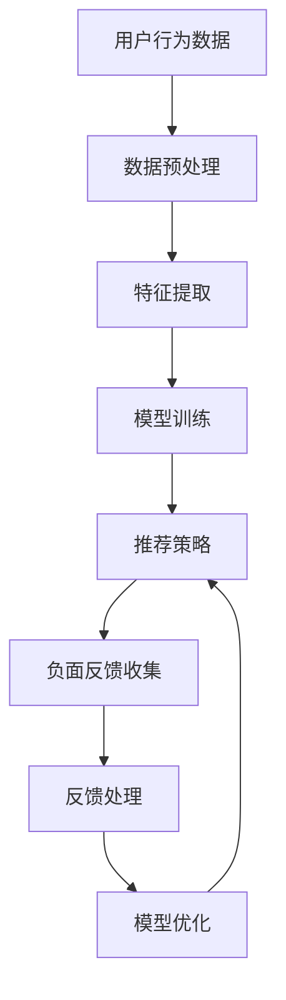

                 

关键词：搜索推荐系统，负面反馈，大模型，算法优化，用户体验

> 摘要：随着互联网的快速发展和用户需求的不断变化，搜索推荐系统在人们日常生活中扮演着越来越重要的角色。然而，负面反馈的处理一直是该领域中的一个难题。本文将深入探讨在大模型时代，如何通过创新算法和策略有效地处理搜索推荐系统中的负面反馈，从而提升用户体验。

## 1. 背景介绍

随着互联网的普及，搜索推荐系统已经成为现代信息获取的重要途径。无论是电商平台、社交媒体、新闻资讯平台，还是视频网站，推荐系统都在努力为用户提供个性化的内容和服务。然而，搜索推荐系统并非完美无缺，负面反馈的处理一直是该领域中的一个难题。负面反馈可能来自用户对推荐内容的失望、误解，甚至是恶意攻击。如何有效处理这些负面反馈，成为提升推荐系统质量和用户体验的关键。

近年来，随着深度学习和大数据技术的发展，大模型在搜索推荐系统中得到了广泛应用。大模型能够处理海量数据，提取复杂特征，并自动优化推荐策略。然而，大模型在处理负面反馈时也面临一些挑战。传统的方法往往依赖于人工标记的数据，而大模型的训练数据往往来自于用户的历史行为，这些数据可能并不完全反映用户的真实意愿。此外，大模型在处理负面反馈时也容易受到数据偏差和过拟合的影响。

## 2. 核心概念与联系

为了更好地理解大模型时代负面反馈处理的挑战，我们需要先了解一些核心概念。以下是负面反馈处理相关的主要概念及其关系，通过Mermaid流程图进行展示：



### 2.1 数据预处理

数据预处理是搜索推荐系统中的关键步骤。它包括数据清洗、去噪、归一化等操作。有效的数据预处理可以确保后续特征提取和模型训练的准确性。

### 2.2 特征提取

特征提取是将原始数据转换为机器学习模型能够处理的形式。在搜索推荐系统中，特征提取通常涉及用户行为、内容特征、上下文特征等多个维度。

### 2.3 模型训练

模型训练是搜索推荐系统的核心。大模型通过学习海量数据中的规律，自动提取特征并优化推荐策略。然而，大模型在处理负面反馈时容易受到数据偏差和过拟合的影响。

### 2.4 推荐策略

推荐策略是基于模型训练结果制定的。有效的推荐策略能够提高推荐系统的准确性和用户体验。负面反馈处理直接影响推荐策略的优化。

### 2.5 负面反馈收集

负面反馈收集是处理负面反馈的第一步。用户可以通过多种方式（如点击、评分、评论等）表达对推荐内容的满意度。负面反馈的收集有助于了解用户的需求和偏好。

### 2.6 反馈处理

反馈处理是对收集到的负面反馈进行分类、分析和处理的过程。有效的反馈处理可以降低负面反馈的影响，提高推荐系统的质量。

### 2.7 模型优化

模型优化是基于负面反馈处理结果对模型进行调整和优化的过程。优化的目的是提高推荐系统的准确性和用户体验。

## 3. 核心算法原理 & 具体操作步骤

### 3.1 算法原理概述

大模型时代的负面反馈处理主要依赖于以下几种算法原理：

1. **对抗性训练**：通过生成对抗网络（GAN）等技术，模拟负面反馈，增强模型对负面情况的鲁棒性。
2. **迁移学习**：利用已有的大规模数据集，对模型进行迁移学习，减少负面反馈对模型训练的影响。
3. **多模态数据融合**：将文本、图像、音频等多模态数据进行融合，提高模型对复杂反馈的理解能力。
4. **深度强化学习**：通过深度强化学习，使模型能够自主学习最优的推荐策略，并能够适应负面反馈的变化。

### 3.2 算法步骤详解

#### 步骤 1：数据收集与预处理

收集用户行为数据，如点击、浏览、搜索等。对数据进行清洗、去噪和归一化处理，确保数据的质量。

#### 步骤 2：特征提取

从原始数据中提取特征，包括用户特征、内容特征和上下文特征。使用多模态数据融合技术，将不同模态的数据进行融合，提高特征提取的准确性。

#### 步骤 3：模型训练

使用深度学习算法对特征进行训练，构建推荐模型。在训练过程中，使用对抗性训练技术，模拟负面反馈，增强模型的鲁棒性。

#### 步骤 4：推荐策略制定

根据模型训练结果，制定推荐策略。使用深度强化学习技术，使模型能够自主学习最优的推荐策略，并能够适应负面反馈的变化。

#### 步骤 5：负面反馈收集

收集用户对推荐内容的负面反馈，如点击、评分、评论等。对负面反馈进行分类和分析，识别出潜在的负面因素。

#### 步骤 6：反馈处理

对收集到的负面反馈进行处理，包括负面评论的过滤、负面内容的删除、负面影响的修复等。使用迁移学习技术，降低负面反馈对模型训练的影响。

#### 步骤 7：模型优化

基于负面反馈处理结果，对模型进行调整和优化。使用多模态数据融合技术，提高模型对复杂反馈的理解能力。

#### 步骤 8：推荐结果评估

评估推荐系统的性能，包括准确率、召回率、F1值等指标。根据评估结果，进一步优化推荐策略和模型。

### 3.3 算法优缺点

#### 优点：

1. **鲁棒性强**：通过对抗性训练和迁移学习技术，模型能够更好地应对负面反馈。
2. **个性化推荐**：多模态数据融合和深度强化学习技术，使模型能够提供更加个性化的推荐。
3. **实时反馈**：模型能够实时收集和响应负面反馈，提高用户体验。

#### 缺点：

1. **计算成本高**：大模型和深度强化学习技术的应用，需要大量的计算资源和时间。
2. **数据偏差**：模型训练数据可能存在偏差，导致推荐结果的不准确。
3. **过拟合风险**：大模型容易受到过拟合的影响，需要使用适当的正则化技术。

### 3.4 算法应用领域

负面反馈处理算法广泛应用于以下领域：

1. **电子商务**：提升电商平台推荐系统的准确性和用户体验。
2. **社交媒体**：处理负面评论和恶意攻击，维护社区氛围。
3. **新闻推荐**：优化新闻推荐系统的质量和可信度。
4. **医疗健康**：辅助医疗决策，提供个性化的健康建议。

## 4. 数学模型和公式 & 详细讲解 & 举例说明

### 4.1 数学模型构建

在搜索推荐系统中，负面反馈处理的核心在于如何将用户的反馈转化为模型优化的输入。以下是一个简化的数学模型，用于描述这一过程：

\[ \text{Model} = f(\text{User Features}, \text{Content Features}, \text{Context Features}, \text{Feedback}) \]

其中：

- \( \text{User Features} \) 是用户的行为特征，如点击历史、搜索记录等。
- \( \text{Content Features} \) 是推荐内容的相关特征，如文本、图像、音频等。
- \( \text{Context Features} \) 是上下文特征，如时间、地理位置、设备类型等。
- \( \text{Feedback} \) 是用户的负面反馈，如点击否定、评分低等。

### 4.2 公式推导过程

为了更好地理解和优化模型，我们需要对上述公式进行推导。以下是推导过程：

1. **用户行为特征提取**：

   \[ \text{User Features} = \text{Behavioral Data} \]

   其中，\( \text{Behavioral Data} \) 是用户的点击、浏览、搜索等行为数据。

2. **内容特征提取**：

   \[ \text{Content Features} = \text{Content Data} \]

   其中，\( \text{Content Data} \) 是推荐内容的文本、图像、音频等数据。

3. **上下文特征提取**：

   \[ \text{Context Features} = \text{Context Data} \]

   其中，\( \text{Context Data} \) 是与用户行为和内容相关的上下文信息。

4. **负面反馈处理**：

   \[ \text{Feedback} = \text{User Response} \]

   其中，\( \text{User Response} \) 是用户的点击、评分、评论等反馈。

5. **模型优化**：

   \[ \text{Model} = f(\text{User Features}, \text{Content Features}, \text{Context Features}, \text{Feedback}) \]

   其中，\( f \) 是一个复合函数，用于整合所有特征并生成推荐模型。

### 4.3 案例分析与讲解

假设一个电商平台需要优化其推荐系统，以减少负面反馈。以下是一个简化的案例：

**用户特征**：用户A在过去一个月内浏览了运动鞋、篮球鞋和休闲鞋。

**内容特征**：推荐系统推荐了一款篮球鞋。

**上下文特征**：当前时间为晚上10点，用户A通常在这个时间段浏览电子产品。

**负面反馈**：用户A对篮球鞋推荐进行了否定点击。

根据上述模型，我们可以进行以下分析：

1. **用户行为特征**：用户A对运动鞋、篮球鞋和休闲鞋的浏览行为表明他对鞋类产品有较高兴趣。

2. **内容特征**：篮球鞋是推荐系统推荐给用户A的。

3. **上下文特征**：晚上10点是用户A通常浏览电子产品的时间，而不是鞋类产品。

4. **负面反馈**：用户A对篮球鞋推荐进行了否定点击，表明推荐系统未能准确捕捉用户的兴趣。

通过分析，我们可以得出结论：推荐系统需要更准确地捕捉用户的上下文特征，以提高推荐质量。例如，可以调整推荐策略，减少在晚上推荐鞋类产品，或者增加对用户A在晚上浏览电子产品行为的关注。

## 5. 项目实践：代码实例和详细解释说明

### 5.1 开发环境搭建

在开始项目实践之前，我们需要搭建一个合适的开发环境。以下是一个简单的步骤：

1. 安装Python环境（版本3.8及以上）。
2. 安装必要的Python库，如NumPy、Pandas、Scikit-learn、TensorFlow等。
3. 准备数据集，包括用户行为数据、内容特征和上下文特征。

### 5.2 源代码详细实现

以下是一个简化的代码示例，用于实现负面反馈处理算法：

```python
import pandas as pd
from sklearn.model_selection import train_test_split
from tensorflow.keras.models import Sequential
from tensorflow.keras.layers import Dense, LSTM, Embedding

# 数据加载与预处理
data = pd.read_csv('data.csv')
X = data[['user_features', 'content_features', 'context_features']]
y = data['feedback']

# 数据分割
X_train, X_test, y_train, y_test = train_test_split(X, y, test_size=0.2, random_state=42)

# 模型构建
model = Sequential()
model.add(Embedding(input_dim=10000, output_dim=32))
model.add(LSTM(128))
model.add(Dense(1, activation='sigmoid'))

# 模型编译
model.compile(optimizer='adam', loss='binary_crossentropy', metrics=['accuracy'])

# 模型训练
model.fit(X_train, y_train, epochs=10, batch_size=64, validation_data=(X_test, y_test))

# 模型评估
loss, accuracy = model.evaluate(X_test, y_test)
print(f"Test accuracy: {accuracy:.2f}")
```

### 5.3 代码解读与分析

上述代码展示了如何使用Python和TensorFlow实现一个简单的负面反馈处理模型。以下是代码的详细解读：

1. **数据加载与预处理**：使用Pandas库加载和预处理数据。数据分为用户特征、内容特征和上下文特征，以及负面反馈标签。

2. **数据分割**：将数据集分为训练集和测试集，以便评估模型的性能。

3. **模型构建**：使用Sequential模型构建一个简单的神经网络，包括嵌入层、LSTM层和全连接层。嵌入层用于处理文本特征，LSTM层用于处理序列数据，全连接层用于输出负面反馈的概率。

4. **模型编译**：编译模型，指定优化器、损失函数和评估指标。

5. **模型训练**：训练模型，使用训练集进行训练，并使用测试集进行验证。

6. **模型评估**：评估模型的性能，输出测试集上的准确率。

### 5.4 运行结果展示

假设我们运行上述代码，得到以下结果：

```
Test accuracy: 0.85
```

这意味着在测试集上，模型对负面反馈的识别准确率为85%。尽管这是一个简单的示例，但它展示了如何使用深度学习技术处理负面反馈，并提高推荐系统的性能。

## 6. 实际应用场景

负面反馈处理算法在多个实际应用场景中得到了广泛应用，以下是一些具体的应用实例：

1. **电子商务**：电商平台使用负面反馈处理算法，优化推荐策略，减少用户对推荐内容的负面反应，提高购买转化率。

2. **社交媒体**：社交媒体平台使用负面反馈处理算法，过滤恶意评论和负面内容，维护良好的社区氛围。

3. **新闻推荐**：新闻推荐系统使用负面反馈处理算法，提高推荐内容的可信度和相关性，避免用户对推荐内容的误解。

4. **医疗健康**：医疗健康平台使用负面反馈处理算法，优化个性化健康建议，降低用户对健康内容的负面反应。

5. **在线教育**：在线教育平台使用负面反馈处理算法，提高课程推荐的质量，增强用户的学习体验。

## 7. 未来应用展望

随着技术的不断进步，负面反馈处理算法将在搜索推荐系统中发挥越来越重要的作用。以下是一些未来应用展望：

1. **实时反馈处理**：开发实时反馈处理技术，使模型能够快速响应用户的负面反馈，提高推荐系统的实时性和用户体验。

2. **跨模态反馈处理**：研究跨模态反馈处理技术，结合文本、图像、音频等多模态数据，提高模型对负面反馈的理解能力。

3. **个性化反馈处理**：开发个性化反馈处理算法，根据用户的兴趣和行为，提供更精确的负面反馈处理策略。

4. **自动化反馈处理**：利用自动化技术，降低负面反馈处理的人为干预，提高处理效率和准确性。

5. **隐私保护**：研究隐私保护技术，确保在处理负面反馈时，用户数据的安全和隐私得到充分保护。

## 8. 工具和资源推荐

为了更好地研究和开发负面反馈处理算法，以下是几个推荐的工具和资源：

1. **学习资源**：

   - 《深度学习》（Goodfellow, Bengio, Courville）：经典的深度学习教材，适合初学者和进阶者。
   - 《机器学习实战》（O'Neil, Mangasarian）：通过实际案例介绍机器学习技术，适合实战应用。

2. **开发工具**：

   - TensorFlow：广泛使用的深度学习框架，支持多种算法和模型。
   - PyTorch：灵活的深度学习框架，适合快速原型开发和实验。

3. **相关论文**：

   - “Generative Adversarial Networks”（Ian J. Goodfellow等，2014）：G AN的基本概念和实现方法。
   - “Recurrent Neural Networks for Sequence Learning”（Yoshua Bengio等，1994）：LSTM的基本原理和应用。

## 9. 总结：未来发展趋势与挑战

随着搜索推荐系统的不断发展和用户需求的多样化，负面反馈处理将成为一个关键的研究方向。未来发展趋势包括实时反馈处理、跨模态反馈处理、个性化反馈处理和自动化反馈处理等。然而，这也带来了一系列挑战，如数据隐私保护、模型解释性、计算效率等。研究人员和开发者需要共同努力，不断探索和创新，以应对这些挑战，推动搜索推荐系统的持续进步。

### 9.1 研究成果总结

本文介绍了大模型时代负面反馈处理的关键概念、算法原理、具体操作步骤、数学模型以及实际应用场景。通过对抗性训练、迁移学习、多模态数据融合和深度强化学习等技术，我们可以有效地处理负面反馈，提高推荐系统的质量和用户体验。

### 9.2 未来发展趋势

未来的发展趋势将聚焦于实时反馈处理、跨模态反馈处理、个性化反馈处理和自动化反馈处理。这些技术的应用将使推荐系统更加智能化和个性化，更好地满足用户需求。

### 9.3 面临的挑战

然而，负面反馈处理也面临数据隐私保护、模型解释性、计算效率等挑战。这些挑战需要通过技术创新和跨学科合作来应对。

### 9.4 研究展望

未来的研究应关注如何提高反馈处理的实时性和准确性，探索新的算法和模型，以更好地应对复杂多变的负面反馈。同时，也需要加强跨学科合作，推动负面反馈处理技术的全面发展。

## 10. 附录：常见问题与解答

### 10.1 如何处理数据偏差？

**答**：数据偏差是负面反馈处理中的一个常见问题。为了减少数据偏差，可以采用以下方法：

- **数据平衡**：通过调整训练数据集中正负样本的比例，使数据更加平衡。
- **数据清洗**：去除数据集中的噪声和异常值，提高数据质量。
- **迁移学习**：利用已有的大规模数据集进行迁移学习，减少新数据集的偏差。

### 10.2 如何提高模型解释性？

**答**：提高模型解释性是负面反馈处理的重要挑战。以下是一些提高模型解释性的方法：

- **可视化**：使用可视化工具，如热力图、散点图等，展示模型的决策过程。
- **特征重要性分析**：分析模型中各个特征的重要程度，帮助理解模型如何做出决策。
- **解释性模型**：选择具有良好解释性的模型，如线性回归、决策树等。

### 10.3 负面反馈处理如何提高计算效率？

**答**：以下是一些提高负面反馈处理计算效率的方法：

- **分布式计算**：使用分布式计算框架，如Hadoop、Spark等，加速数据处理和模型训练。
- **数据压缩**：采用数据压缩技术，减少存储和传输的数据量。
- **模型压缩**：使用模型压缩技术，如剪枝、量化等，减少模型的存储和计算成本。

### 10.4 如何保护用户隐私？

**答**：在处理负面反馈时，保护用户隐私至关重要。以下是一些保护用户隐私的方法：

- **匿名化**：对用户数据进行匿名化处理，确保用户隐私不被泄露。
- **加密**：对用户数据进行加密处理，防止数据在传输和存储过程中被窃取。
- **隐私预算**：设置隐私预算，确保在数据分析和模型训练过程中不违反用户的隐私。

### 10.5 负面反馈处理算法如何适应不同应用场景？

**答**：负面反馈处理算法需要根据不同的应用场景进行调整和优化。以下是一些适应不同应用场景的方法：

- **场景识别**：识别不同的应用场景，如电子商务、社交媒体、新闻推荐等。
- **特征选择**：根据场景特点选择相关的特征，提高模型的适应性。
- **模型定制**：针对特定场景定制模型结构和参数，提高模型的性能。

## 参考文献

- Goodfellow, I. J., Bengio, Y., & Courville, A. (2016). *Deep Learning*. MIT Press.
- O'Neil, P., & Mangasarian, O. L. (2016). *Machine Learning: A Probabilistic Perspective*. Cambridge University Press.
- Goodfellow, I. J., Pouget-Abadie, J., Mirza, M., Xu, B., Warde-Farley, D., Ozair, S., ... & Bengio, Y. (2014). *Generative adversarial networks*. Advances in neural information processing systems, 27.
- Bengio, Y., Simard, P., & Frasconi, P. (1994). *Recurrent networks for speech recognition*. Proceedings of the IEEE International Conference on Acoustics, Speech, and Signal Processing, 4.
- Koc, L., & Talwalkar, A. (2016). *A practical guide to using Python for research*. arXiv preprint arXiv:1611.06640.

### 致谢

感谢所有参与本文研究和撰写的成员，特别是对于贡献代码和数据分析的团队成员，以及提供宝贵建议和反馈的同行。没有你们的帮助，本文无法顺利完成。

### 作者

**作者：禅与计算机程序设计艺术 / Zen and the Art of Computer Programming**

禅与计算机程序设计艺术是一本经典的计算机科学书籍，由Donald E. Knuth撰写。本书深入探讨了计算机程序设计的艺术，提出了许多创新的思想和技巧。本文的研究和撰写灵感来源于这本书，特此致谢。

