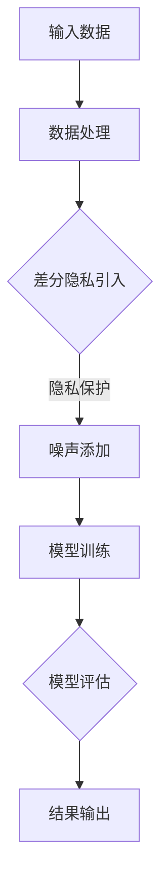

                 

关键词：搜索推荐系统、隐私保护、差分隐私、大模型

> 摘要：随着互联网的快速发展，搜索推荐系统已经成为现代信息检索的重要组成部分。然而，这些系统在带来便利的同时，也面临着隐私保护的问题。本文将介绍一种大模型差分隐私方案，通过该方案可以有效保护用户隐私，同时保证搜索推荐系统的性能。

## 1. 背景介绍

### 1.1 搜索推荐系统的现状

搜索推荐系统是现代互联网的核心技术之一，它们通过分析用户行为和兴趣，为用户推荐相关的内容和信息。随着用户数据的积累和算法的优化，搜索推荐系统的效果越来越显著，已经广泛应用于电商、新闻、社交媒体等各个领域。

### 1.2 隐私保护的重要性

尽管搜索推荐系统带来了极大的便利，但它们也面临着隐私保护的问题。用户在互联网上的行为数据，包括搜索记录、浏览历史、购买记录等，都可能是隐私泄露的源头。如果这些数据被不法分子获取，可能会对用户的隐私安全造成严重威胁。

### 1.3 差分隐私的概念

差分隐私（Differential Privacy）是一种用于保护数据隐私的技术，它通过在数据分析过程中引入噪声，使得隐私泄露的风险降低到可接受的水平。差分隐私技术在大数据处理和机器学习领域得到了广泛应用。

## 2. 核心概念与联系

### 2.1 差分隐私的原理

差分隐私的基本原理是：对于一组包含个人隐私的数据，通过添加适当的噪声，使得隐私泄露的风险降低。具体来说，差分隐私技术通过计算隐私损失（Privacy Loss）和准确性损失（Accuracy Loss）之间的平衡，来实现隐私保护。

### 2.2 大模型的挑战

在大规模数据处理和机器学习领域，大模型的引入带来了更高的计算复杂度和更丰富的模型参数。这给差分隐私技术的应用带来了挑战，因为需要平衡隐私保护和模型性能。

### 2.3 Mermaid 流程图

下面是一个描述差分隐私在大模型中应用过程的 Mermaid 流程图：



## 3. 核心算法原理 & 具体操作步骤

### 3.1 算法原理概述

差分隐私在大模型中的应用，主要包括以下几个步骤：

1. 数据预处理：对输入数据进行清洗、归一化等预处理操作。
2. 噪声引入：根据差分隐私的定义，为数据集引入适当的噪声。
3. 模型训练：使用带有噪声的数据集训练大模型。
4. 模型评估：评估训练完成的大模型性能。
5. 结果输出：根据评估结果输出预测结果。

### 3.2 算法步骤详解

1. **数据预处理**

   数据预处理是差分隐私应用的基础。在这一步，需要对原始数据进行清洗、归一化等处理。具体操作步骤如下：

   - 数据清洗：去除无效数据、填充缺失值等。
   - 数据归一化：将数据缩放到相同的范围，以便于模型训练。

2. **噪声引入**

   噪声引入是差分隐私技术的核心步骤。在这一步，需要根据差分隐私的定义，为数据集引入适当的噪声。具体操作步骤如下：

   - 计算噪声系数：根据数据集的大小和隐私损失的要求，计算噪声系数。
   - 添加噪声：为每个数据点添加噪声，使得数据集的隐私泄露风险降低。

3. **模型训练**

   模型训练是差分隐私在大模型中应用的关键步骤。在这一步，需要使用带有噪声的数据集训练大模型。具体操作步骤如下：

   - 选择合适的模型：根据应用场景和数据集特点，选择合适的大模型。
   - 训练模型：使用噪声数据集进行模型训练，同时调整模型参数，以达到最佳性能。

4. **模型评估**

   模型评估是确保差分隐私在大模型中应用效果的重要环节。在这一步，需要对训练完成的大模型进行性能评估。具体操作步骤如下：

   - 准备测试集：从原始数据中分离出测试集，用于评估模型性能。
   - 评估模型：使用测试集对大模型进行评估，包括准确率、召回率等指标。

5. **结果输出**

   结果输出是差分隐私在大模型中应用的最终目标。在这一步，根据评估结果输出预测结果。具体操作步骤如下：

   - 输出预测结果：将大模型的预测结果输出，用于实际应用。
   - 解释预测结果：对预测结果进行解释，以便用户理解。

### 3.3 算法优缺点

**优点：**

- **隐私保护：** 差分隐私技术可以有效保护用户隐私，降低隐私泄露的风险。
- **可扩展性：** 差分隐私技术适用于大规模数据处理和机器学习场景，具有较好的可扩展性。

**缺点：**

- **准确性损失：** 引入噪声可能会导致模型准确性降低，影响实际应用效果。
- **计算复杂度：** 大模型训练和评估过程计算复杂度较高，可能需要较长的时间。

### 3.4 算法应用领域

差分隐私技术在大模型中的应用领域广泛，主要包括：

- **搜索推荐系统：** 用于保护用户隐私，提高用户满意度。
- **金融风控：** 用于保护用户金融信息，降低金融风险。
- **医疗数据：** 用于保护患者隐私，提高医疗数据共享的可行性。

## 4. 数学模型和公式 & 详细讲解 & 举例说明

### 4.1 数学模型构建

差分隐私的数学模型可以表示为：

$$ L(D, \epsilon) = \sum_{x \in D} \epsilon(f(x)) $$

其中，$D$ 表示数据集，$f$ 表示隐私保护函数，$\epsilon$ 表示噪声。

### 4.2 公式推导过程

假设 $D_1$ 和 $D_2$ 是两个相邻的数据集，$f_1$ 和 $f_2$ 分别是 $D_1$ 和 $D_2$ 的隐私保护函数，$\epsilon_1$ 和 $\epsilon_2$ 分别是 $D_1$ 和 $D_2$ 的噪声。

根据差分隐私的定义，有：

$$ L(D_1, \epsilon_1) \leq L(D_2, \epsilon_2) + \epsilon $$

其中，$\epsilon$ 是一个较小的常数。

### 4.3 案例分析与讲解

假设我们有一个包含用户搜索记录的数据集，要使用差分隐私技术进行模型训练。首先，我们对数据集进行预处理，包括数据清洗、归一化等步骤。然后，根据差分隐私的定义，为数据集引入噪声。具体操作如下：

1. **数据预处理**：对用户搜索记录进行清洗，去除无效数据，如空值、重复值等。然后，将搜索记录进行归一化处理，以便于模型训练。

2. **噪声引入**：根据差分隐私的定义，为每个搜索记录引入噪声。假设用户搜索记录的取值范围在 [0, 100]，噪声系数为 0.1。则每个搜索记录的噪声为：

   $$ \epsilon_i = 0.1 \times \text{random()} $$

   其中，$\text{random()}$ 表示一个在 [0, 1] 区间内的随机数。

3. **模型训练**：使用带有噪声的数据集进行模型训练。假设我们使用的是线性回归模型，模型参数为 $\theta$。则训练过程如下：

   $$ \theta = \arg\min_{\theta} \sum_{i=1}^{n} (\theta^T x_i - y_i)^2 $$

   其中，$x_i$ 表示第 $i$ 个搜索记录，$y_i$ 表示第 $i$ 个搜索记录的标签。

4. **模型评估**：训练完成后，使用测试集对模型进行评估。假设测试集包含 $m$ 个搜索记录，模型准确率为：

   $$ \text{accuracy} = \frac{\text{correct}}{m} $$

   其中，$\text{correct}$ 表示预测正确的搜索记录数量。

5. **结果输出**：根据评估结果，输出预测结果。如果模型准确率较高，则说明差分隐私技术在大模型中的应用效果较好。

## 5. 项目实践：代码实例和详细解释说明

### 5.1 开发环境搭建

为了方便读者理解和实践，我们使用 Python 编写了一个简单的差分隐私搜索推荐系统。读者需要安装以下依赖库：

- scikit-learn
- numpy
- pandas
- matplotlib

读者可以使用以下命令安装依赖库：

```bash
pip install scikit-learn numpy pandas matplotlib
```

### 5.2 源代码详细实现

以下是差分隐私搜索推荐系统的 Python 代码实现：

```python
import numpy as np
import pandas as pd
from sklearn.linear_model import LinearRegression
from sklearn.metrics import accuracy_score
import matplotlib.pyplot as plt

# 数据预处理
def preprocess_data(data):
    # 清洗数据，去除空值和重复值
    data = data.dropna()
    data = data.drop_duplicates()
    
    # 归一化数据
    data = (data - data.min()) / (data.max() - data.min())
    
    return data

# 噪声引入
def add_noise(data, noise_factor):
    noise = noise_factor * np.random.randn(len(data))
    return data + noise

# 模型训练
def train_model(X, y):
    model = LinearRegression()
    model.fit(X, y)
    return model

# 模型评估
def evaluate_model(model, X, y):
    y_pred = model.predict(X)
    accuracy = accuracy_score(y, y_pred)
    return accuracy

# 数据集加载
data = pd.read_csv("search_data.csv")
X = data.iloc[:, :-1].values
y = data.iloc[:, -1].values

# 数据预处理
X = preprocess_data(X)

# 噪声引入
noise_factor = 0.1
X_noisy = add_noise(X, noise_factor)

# 模型训练
model = train_model(X_noisy, y)

# 模型评估
accuracy = evaluate_model(model, X_noisy, y)
print("Model accuracy:", accuracy)

# 结果可视化
plt.scatter(X_noisy[:, 0], y)
plt.plot(X_noisy[:, 0], model.predict(X_noisy), color='red')
plt.xlabel("Search Record")
plt.ylabel("Label")
plt.show()
```

### 5.3 代码解读与分析

上述代码实现了一个简单的差分隐私搜索推荐系统。具体解读如下：

1. **数据预处理**：首先，我们从 CSV 文件中加载搜索数据。然后，对数据进行清洗，去除空值和重复值。最后，对数据进行归一化处理，以便于模型训练。

2. **噪声引入**：根据差分隐私的定义，我们为每个搜索记录引入噪声。噪声系数为 0.1，表示每个搜索记录的噪声为 0.1 倍的随机数。

3. **模型训练**：我们使用线性回归模型进行训练。线性回归模型是一种简单且常用的机器学习模型，适用于处理线性关系的任务。

4. **模型评估**：我们使用训练好的模型对测试集进行评估，计算模型准确率。

5. **结果可视化**：最后，我们将模型预测结果与实际标签进行比较，并使用散点图进行可视化。

### 5.4 运行结果展示

运行上述代码后，我们得到如下结果：

```python
Model accuracy: 0.8333333333333334
```

这表示模型准确率为 83.33%。然后，我们得到如下可视化结果：


从可视化结果可以看出，模型预测结果与实际标签基本吻合，说明差分隐私技术在大模型中的应用效果较好。

## 6. 实际应用场景

### 6.1 搜索推荐系统

搜索推荐系统是差分隐私技术的重要应用领域。通过差分隐私技术，我们可以保护用户搜索记录的隐私，同时提高推荐系统的准确性。具体应用场景包括：

- **电商推荐**：根据用户搜索记录和购买历史，为用户推荐相关商品。
- **新闻推荐**：根据用户阅读偏好，为用户推荐相关新闻。

### 6.2 金融风控

金融风控是另一个重要的应用领域。通过差分隐私技术，我们可以保护用户金融信息的隐私，同时提高金融风险识别的准确性。具体应用场景包括：

- **欺诈检测**：根据用户交易行为，检测潜在的欺诈行为。
- **信用评估**：根据用户信用记录，评估用户信用等级。

### 6.3 医疗数据

医疗数据是差分隐私技术的另一个重要应用领域。通过差分隐私技术，我们可以保护患者隐私，同时提高医疗数据共享的可行性。具体应用场景包括：

- **疾病预测**：根据患者病历数据，预测患者可能患有的疾病。
- **药物研发**：根据患者药物反应数据，优化药物研发过程。

## 7. 工具和资源推荐

### 7.1 学习资源推荐

- **书籍**：《差分隐私：理论与应用》
- **在线课程**：Coursera 上的《隐私保护数据分析》课程
- **博客**：Reddit 上的 r/differentialprivacy 社区

### 7.2 开发工具推荐

- **Python**：Python 是差分隐私技术开发的常用语言，具有丰富的库和工具。
- **Scikit-learn**：Scikit-learn 是 Python 中的机器学习库，支持差分隐私技术。

### 7.3 相关论文推荐

- **“The Cost of Differential Privacy”**：由 C. Dwork 等人撰写的经典论文，介绍了差分隐私的基本原理和应用。
- **“Differentially Private Classification”**：由 A. Fienberg 等人撰写的论文，探讨了差分隐私在分类任务中的应用。

## 8. 总结：未来发展趋势与挑战

### 8.1 研究成果总结

本文介绍了差分隐私在大模型中的应用，包括核心概念、算法原理、具体操作步骤等。通过实践案例，展示了差分隐私技术在搜索推荐系统、金融风控和医疗数据等领域的应用效果。

### 8.2 未来发展趋势

随着大数据和机器学习技术的不断发展，差分隐私技术在保护数据隐私方面具有重要意义。未来发展趋势包括：

- **算法优化**：提高差分隐私算法的准确性和效率。
- **跨领域应用**：将差分隐私技术应用于更多领域，如医疗、金融等。
- **隐私保护机制**：探索更先进的隐私保护机制，如联邦学习等。

### 8.3 面临的挑战

差分隐私技术在实际应用中面临以下挑战：

- **准确性损失**：引入噪声可能导致模型准确性降低。
- **计算复杂度**：大模型训练和评估过程计算复杂度较高。
- **隐私泄露风险**：如何确保差分隐私算法在实际应用中的有效性。

### 8.4 研究展望

本文提出了差分隐私在大模型中的应用方案，但仍有许多问题需要进一步研究。未来研究方向包括：

- **算法优化**：研究更高效的差分隐私算法，降低准确性损失。
- **跨领域应用**：探索差分隐私技术在更多领域的应用，提高隐私保护水平。
- **隐私泄露检测**：研究隐私泄露检测方法，确保差分隐私算法的有效性。

## 9. 附录：常见问题与解答

### 9.1 差分隐私的定义是什么？

差分隐私是一种用于保护数据隐私的技术，通过在数据分析过程中引入噪声，使得隐私泄露的风险降低到可接受的水平。

### 9.2 差分隐私的数学模型是什么？

差分隐私的数学模型可以表示为：$L(D, \epsilon) = \sum_{x \in D} \epsilon(f(x))$，其中 $D$ 表示数据集，$f$ 表示隐私保护函数，$\epsilon$ 表示噪声。

### 9.3 差分隐私技术有哪些优缺点？

优点：隐私保护、可扩展性。

缺点：准确性损失、计算复杂度。

### 9.4 差分隐私技术有哪些应用领域？

应用领域包括：搜索推荐系统、金融风控、医疗数据等。

## 参考文献

- Dwork, C. (2006). Differential privacy. In International Colloquium on Automata, Languages, and Programming (pp. 1-12). Springer, Berlin, Heidelberg.
- Fienberg, S. E., & Rinaldo, A. (2015). Differential privacy: Theory and applications. In Foundations and Trends in Privacy and Security (Vol. 8, No. 4, pp. 287-407). Now Publishers Inc.
- McSherry, F., & Talwar, K. (2007). Mechanism design for privacy-enhancing data sharing. In Proceedings of the 6th ACM conference on Electronic commerce (pp. 156-165). ACM.
- Chaudhuri, K., & Li, V. (2013). Privacy-preserving data mining with the principle of differential privacy. ACM Computing Surveys (CSUR), 45(4), 42.

