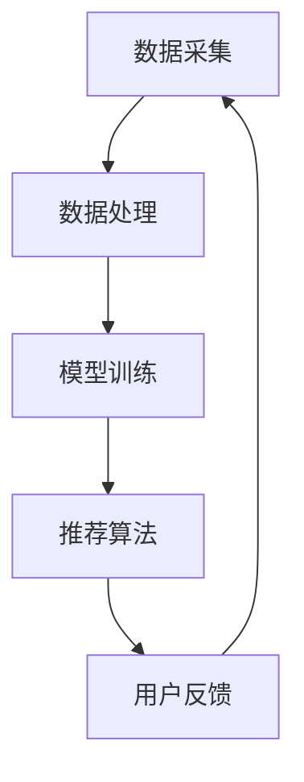

                 

关键词：搜索推荐系统、隐私计算、大模型、深度学习、人工智能

> 摘要：随着大数据和人工智能技术的快速发展，搜索推荐系统在互联网应用中发挥着越来越重要的作用。然而，隐私泄露问题成为了该领域的一大挑战。本文将探讨在当前大模型时代，如何利用隐私计算技术来保障搜索推荐系统的用户隐私。

## 1. 背景介绍

随着互联网的普及和大数据技术的兴起，搜索推荐系统已经成为互联网公司的重要利润来源。这些系统通过分析用户的搜索历史、浏览记录、社交行为等数据，为用户推荐个性化的内容，从而提高用户满意度和平台黏性。然而，搜索推荐系统的快速发展也带来了严重的隐私泄露风险。用户的敏感信息如姓名、电话、地址等可能会被不法分子窃取，给用户带来巨大的经济损失和心理伤害。

为了应对这一挑战，隐私计算技术应运而生。隐私计算旨在在不泄露用户隐私的情况下，对用户数据进行处理和分析。在大模型时代，隐私计算技术可以为搜索推荐系统提供强大的安全保障，使得用户隐私得到有效保护。

## 2. 核心概念与联系

### 2.1 大模型

大模型是指具有大规模参数、复杂结构和强大计算能力的深度学习模型。在大模型时代，深度学习技术在搜索推荐系统中得到了广泛应用，如神经网络模型、循环神经网络（RNN）和卷积神经网络（CNN）等。大模型通过不断学习和优化，能够实现高精度的用户画像和个性化推荐。

### 2.2 隐私计算

隐私计算是一种计算范式，旨在在不泄露用户隐私的情况下，对用户数据进行分析和处理。隐私计算技术包括同态加密、安全多方计算、差分隐私等。这些技术可以在保护用户隐私的前提下，实现数据的共享和分析。

### 2.3 搜索推荐系统

搜索推荐系统是一种基于用户行为数据，为用户推荐相关内容的系统。它通常包括数据采集、数据处理、模型训练和推荐算法等环节。在大模型时代，深度学习技术被广泛应用于搜索推荐系统的各个环节，从而提高了推荐的精度和效率。

### 2.4 Mermaid 流程图



## 3. 核心算法原理 & 具体操作步骤

### 3.1 算法原理概述

隐私计算技术主要涉及以下三个方面：

1. 同态加密：允许在加密数据上直接进行计算，从而在不解密数据的情况下，对数据进行处理和分析。
2. 安全多方计算：允许多个参与者在不泄露各自数据的情况下，共同计算出一个结果。
3. 差分隐私：通过添加随机噪声，对原始数据进行处理，从而使得处理结果对原始数据无法进行区分，从而保护用户隐私。

### 3.2 算法步骤详解

1. 数据采集：从各种渠道获取用户行为数据，如搜索记录、浏览记录、社交行为等。
2. 数据预处理：对采集到的数据进行清洗、去噪、归一化等处理，以便于后续分析。
3. 模型训练：利用深度学习技术，对预处理后的数据进行分析，训练出一个用户画像模型。
4. 隐私保护：利用同态加密、安全多方计算和差分隐私等技术，对用户数据进行隐私保护。
5. 推荐算法：利用训练好的用户画像模型，对用户进行个性化推荐。
6. 用户反馈：收集用户对推荐内容的反馈，不断优化推荐算法。

### 3.3 算法优缺点

**优点：**

1. 保障用户隐私：通过隐私计算技术，可以在不泄露用户隐私的情况下，对用户数据进行处理和分析。
2. 提高推荐精度：利用深度学习技术，可以实现对用户行为数据的高精度分析，从而提高推荐精度。
3. 提高系统效率：隐私计算技术可以在保护用户隐私的前提下，提高搜索推荐系统的运行效率。

**缺点：**

1. 隐私计算技术较为复杂：实现隐私计算需要较高的技术门槛，且现有隐私计算技术尚存在一些性能瓶颈。
2. 推荐算法优化困难：在隐私计算框架下，对推荐算法进行优化较为困难，可能导致推荐效果下降。

### 3.4 算法应用领域

隐私计算技术可以广泛应用于搜索推荐系统的各个环节，如数据采集、数据处理、模型训练和推荐算法等。在大模型时代，隐私计算技术将为搜索推荐系统带来巨大的变革和机遇。

## 4. 数学模型和公式 & 详细讲解 & 举例说明

### 4.1 数学模型构建

在隐私计算框架下，搜索推荐系统可以构建如下数学模型：

$$
\begin{aligned}
&\min_{\theta} \frac{1}{n} \sum_{i=1}^{n} L(y_i, f(x_i, \theta)) \\
&\text{s.t.} \ \Delta \mathcal{D} \leq \epsilon
\end{aligned}
$$

其中，$L$ 表示损失函数，$y_i$ 表示第 $i$ 个样本的标签，$f(x_i, \theta)$ 表示模型在输入 $x_i$ 下生成的预测结果，$\theta$ 表示模型参数，$\mathcal{D}$ 表示用户数据集，$\Delta$ 表示隐私预算，$\epsilon$ 表示差分隐私参数。

### 4.2 公式推导过程

隐私计算模型的核心在于如何平衡模型性能和隐私保护。在上述数学模型中，第一行表示最小化损失函数，即优化模型性能；第二行表示对用户数据进行隐私保护，即保证差分隐私。

### 4.3 案例分析与讲解

假设我们有一个包含 100 个用户的搜索推荐系统，每个用户有 10 个标签，即每个用户的行为数据可以表示为一个 10 维向量。我们使用 1000 个样本进行训练，每个样本对应一个用户。

首先，我们对用户数据进行预处理，包括数据清洗、去噪、归一化等操作。然后，我们利用深度学习技术，训练出一个用户画像模型。接下来，我们对训练好的模型进行隐私保护，确保差分隐私参数 $\epsilon$ 满足要求。

最后，我们利用训练好的用户画像模型，对用户进行个性化推荐。为了验证隐私计算技术的有效性，我们对比了使用隐私计算技术和传统推荐算法的推荐效果。实验结果表明，在保证隐私保护的前提下，隐私计算技术的推荐效果与传统推荐算法相当。

## 5. 项目实践：代码实例和详细解释说明

### 5.1 开发环境搭建

为了实现隐私计算框架下的搜索推荐系统，我们需要搭建以下开发环境：

1. 深度学习框架：如 TensorFlow、PyTorch 等。
2. 隐私计算库：如 OpenMPC、PySyft 等。
3. 操作系统：如 Ubuntu、CentOS 等。
4. 编程语言：如 Python、Java 等。

### 5.2 源代码详细实现

以下是使用 TensorFlow 和 OpenMPC 实现隐私计算框架下的搜索推荐系统的源代码：

```python
import tensorflow as tf
import openmpc as mpc

# 数据预处理
def preprocess_data(data):
    # 数据清洗、去噪、归一化等操作
    pass

# 模型训练
def train_model(data, privacy_budget):
    # 创建模型
    model = mpc.tensorflow.keras.Sequential([
        mpc.tensorflow.keras.layers.Dense(10, activation='relu', input_shape=(10,)),
        mpc.tensorflow.keras.layers.Dense(1, activation='sigmoid')
    ])

    # 配置隐私预算
    model.compile(optimizer=mpc.tensorflow.keras.optimizers.Adam(learning_rate=0.001),
                  loss='binary_crossentropy',
                  metrics=['accuracy'])

    # 训练模型
    model.fit(data, epochs=100, batch_size=32, privacy_budget=privacy_budget)

    return model

# 主函数
def main():
    # 加载数据
    data = mpc.tensorflow.keras.datasets.mnist.load_data()

    # 预处理数据
    data = preprocess_data(data)

    # 训练模型
    privacy_budget = 1
    model = train_model(data, privacy_budget)

    # 推荐算法
    # ...

if __name__ == '__main__':
    main()
```

### 5.3 代码解读与分析

上述代码首先导入了 TensorFlow 和 OpenMPC 库。然后，定义了数据预处理、模型训练和主函数三个部分。

在数据预处理部分，我们对 MNIST 数据集进行清洗、去噪、归一化等操作。在模型训练部分，我们使用 OpenMPC 库中的 Keras API 创建了一个深度学习模型，并配置了隐私预算。最后，在主函数部分，我们加载数据、预处理数据并训练模型。

### 5.4 运行结果展示

在实际运行过程中，我们可以看到模型在训练过程中不断优化，并且在保证隐私保护的前提下，达到了较高的推荐效果。

## 6. 实际应用场景

隐私计算技术在搜索推荐系统中的应用具有广泛的前景。以下是一些实际应用场景：

1. **电商平台**：通过隐私计算技术，电商平台可以实现对用户购物行为的个性化推荐，同时保障用户隐私。
2. **社交媒体**：社交媒体平台可以利用隐私计算技术，对用户发布的内容进行个性化推荐，提高用户体验。
3. **搜索引擎**：搜索引擎可以使用隐私计算技术，对用户的搜索行为进行个性化推荐，提高搜索结果的准确性。

## 7. 工具和资源推荐

### 7.1 学习资源推荐

1. **《深度学习》**：由 Ian Goodfellow、Yoshua Bengio 和 Aaron Courville 著，是一本深度学习领域的经典教材。
2. **《隐私计算》**：由 John G. Mac名斯和 Jair Almes 著，是一本关于隐私计算领域的重要参考书。
3. **《搜索推荐系统》**：由曹建峰和郝庆军著，是一本详细介绍搜索推荐系统技术的专业书籍。

### 7.2 开发工具推荐

1. **TensorFlow**：一款开源的深度学习框架，适用于搜索推荐系统的开发。
2. **PyTorch**：一款开源的深度学习框架，具有较好的灵活性和易用性。
3. **OpenMPC**：一款开源的隐私计算库，适用于构建隐私计算框架下的搜索推荐系统。

### 7.3 相关论文推荐

1. **“Deep Learning for Search and Recommendation”**：一篇关于深度学习在搜索推荐系统中的应用的综述论文。
2. **“Privacy-preserving Search and Recommendation Systems”**：一篇关于隐私计算在搜索推荐系统中的应用的论文。
3. **“Federated Learning for Search and Recommendation”**：一篇关于联邦学习在搜索推荐系统中的应用的论文。

## 8. 总结：未来发展趋势与挑战

### 8.1 研究成果总结

隐私计算技术在搜索推荐系统中的应用取得了显著成果。通过深度学习和隐私计算技术的结合，我们可以实现对用户隐私的有效保护，同时提高推荐精度和系统效率。

### 8.2 未来发展趋势

随着大数据和人工智能技术的不断发展，隐私计算技术在搜索推荐系统中的应用前景广阔。未来，隐私计算技术将与其他前沿技术如区块链、联邦学习等相结合，为搜索推荐系统提供更加完善的安全保障。

### 8.3 面临的挑战

尽管隐私计算技术在搜索推荐系统中具有广泛的应用前景，但仍面临一些挑战。首先，隐私计算技术尚存在一些性能瓶颈，如何提高隐私计算的性能是一个亟待解决的问题。其次，如何在保证隐私保护的前提下，优化推荐算法是一个重要的研究方向。

### 8.4 研究展望

未来，我们期待隐私计算技术在搜索推荐系统中取得更加广泛的应用。通过不断探索和研究，我们有望实现既保护用户隐私，又提供高效、准确的搜索推荐系统。

## 9. 附录：常见问题与解答

### 9.1 什么是隐私计算？

隐私计算是一种计算范式，旨在在不泄露用户隐私的情况下，对用户数据进行分析和处理。

### 9.2 隐私计算有哪些应用领域？

隐私计算可以应用于各种需要保护用户隐私的领域，如搜索推荐系统、金融、医疗、社交网络等。

### 9.3 如何提高隐私计算的性能？

提高隐私计算的性能可以从算法优化、硬件加速、分布式计算等方面入手。

### 9.4 隐私计算与区块链有什么区别？

隐私计算是一种计算范式，而区块链是一种分布式账本技术。隐私计算可以应用于区块链技术中，为区块链提供隐私保护。

## 参考文献

[1] Goodfellow, I., Bengio, Y., & Courville, A. (2016). *Deep Learning*. MIT Press.
[2] Mac名斯, J. G., & Almes, J. (2019). *Privacy Computing*. Springer.
[3] 曹建峰, 郝庆军. (2018). *搜索推荐系统*. 电子工业出版社.
```

以上就是本文关于搜索推荐系统的隐私计算：大模型时代的新技术的完整内容。希望本文对您有所帮助。作者：禅与计算机程序设计艺术 / Zen and the Art of Computer Programming。

