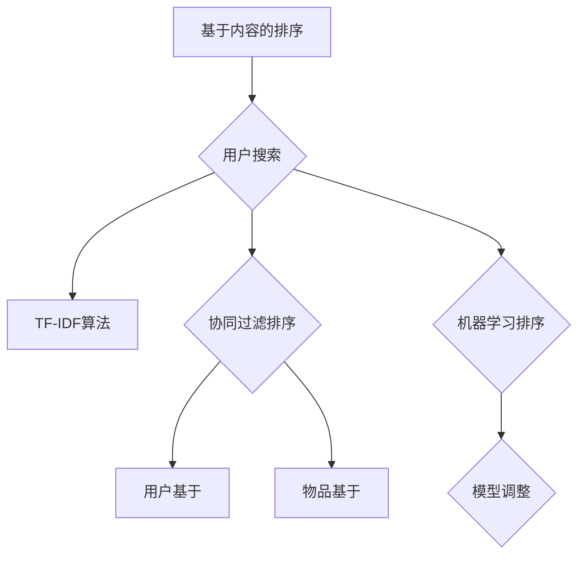

                 

在数字时代，搜索引擎已经成为我们日常生活中不可或缺的工具。无论是购物、研究、新闻阅读还是社交媒体，搜索结果的质量和排序算法的效率都直接影响用户的体验。本文将深入探讨搜索结果排序算法的优化策略，从核心概念、算法原理、数学模型到实际应用，为您提供全方位的技术解析。

## 关键词

- 搜索结果排序算法
- 优化策略
- 机器学习
- 用户行为分析
- 实时排序
- 数学模型

## 摘要

本文旨在介绍和探讨搜索结果排序算法的优化策略。首先，我们将回顾现有排序算法的背景和基本概念。接着，详细分析几种核心排序算法，包括基于内容的排序、协同过滤排序和基于机器学习的排序算法。随后，我们将讨论如何利用数学模型和公式来提升排序算法的性能。最后，通过实际项目案例，展示优化策略在开发中的具体应用。

## 1. 背景介绍

随着互联网的快速发展，搜索引擎已经成为人们获取信息的主要渠道。然而，面对海量数据的爆炸式增长，如何有效地对搜索结果进行排序，提供高质量的搜索体验，成为了研究者和工程师们的重要课题。早期的搜索引擎主要依赖关键词匹配和简单的排序算法，如基于逆文档频率（Inverse Document Frequency, IDF）和词频（Term Frequency, TF）的排序方法。这些方法虽然在处理大量文本数据时表现尚可，但在面对复杂的用户需求和多变的数据环境时，往往难以满足要求。

随着机器学习和数据挖掘技术的发展，现代搜索引擎逐渐引入了更复杂的排序算法。这些算法不仅考虑了文本内容的相关性，还结合了用户的搜索历史、地理位置、实时热点等多维信息，从而实现了更精准的排序效果。例如，协同过滤（Collaborative Filtering）算法通过分析用户的相似行为，预测用户对搜索结果的可能偏好。机器学习算法则利用大规模数据训练模型，自动调整排序策略，以适应不同场景的需求。

## 2. 核心概念与联系

### 2.1. 排序算法的定义

排序算法是一类用于对数据集合进行排序的算法。在搜索引擎中，排序算法用于决定搜索结果的显示顺序，确保用户获取的信息具有最高的相关性和实用性。排序算法的核心目标是在尽可能短的时间内，对大量数据进行有效的排序，以提高搜索效率。

### 2.2. 现有排序算法的分类

现有排序算法可以根据其处理数据的方式和原理，大致分为以下几类：

1. **基于内容的排序（Content-based Sorting）**：这类算法主要依据文本内容的相关性进行排序。例如，TF-IDF算法通过计算关键词的词频和逆文档频率来评估文档的相关性。

2. **协同过滤排序（Collaborative Filtering Sorting）**：协同过滤算法通过分析用户的共同行为来推荐搜索结果。协同过滤又可分为用户基于的协同过滤（User-based）和物品基于的协同过滤（Item-based）。

3. **基于机器学习的排序（Machine Learning-based Sorting）**：这类算法利用机器学习模型，通过分析用户的历史数据和搜索行为，自动调整排序策略。

### 2.3. 算法之间的联系

上述排序算法之间并不是孤立存在的，而是相互补充和结合。在实际应用中，搜索引擎往往结合多种排序算法，以实现最优的排序效果。例如，在搜索结果排序时，可以先使用基于内容的排序算法进行初步筛选，然后利用协同过滤算法进一步调整排序顺序。基于机器学习的排序算法则可以用于动态调整排序策略，以适应不同用户和场景的需求。

### 2.4. Mermaid 流程图



## 3. 核心算法原理 & 具体操作步骤

### 3.1. 算法原理概述

搜索结果排序算法的原理主要分为三部分：数据预处理、排序策略选择和结果输出。

1. **数据预处理**：在排序前，需要对搜索结果进行预处理，包括去除无关内容、标点符号和停用词等。这一步骤有助于提高排序算法的效率和准确性。

2. **排序策略选择**：根据用户需求和搜索场景，选择合适的排序算法。常见的排序算法包括TF-IDF、协同过滤和机器学习排序。

3. **结果输出**：根据排序算法的结果，将搜索结果以特定的顺序输出给用户。

### 3.2. 算法步骤详解

1. **基于内容的排序**：以TF-IDF算法为例，具体步骤如下：

   a. 计算每个关键词的词频（TF）。
   
   b. 计算每个关键词的逆文档频率（IDF），以降低常见词的影响。
   
   c. 计算每个文档的分数，分数越高，表示相关性越强。
   
   d. 根据文档的分数进行排序，分数高的文档排在前面。

2. **协同过滤排序**：以用户基于的协同过滤算法为例，具体步骤如下：

   a. 计算用户之间的相似度。
   
   b. 为每个用户找到最相似的邻居用户。
   
   c. 根据邻居用户的评分，预测当前用户对搜索结果的评分。
   
   d. 根据预测的评分对搜索结果进行排序。

3. **基于机器学习的排序**：以决策树算法为例，具体步骤如下：

   a. 使用历史数据和搜索行为训练决策树模型。
   
   b. 根据输入的特征数据，通过决策树模型预测排序结果。
   
   c. 根据预测结果对搜索结果进行排序。

### 3.3. 算法优缺点

1. **基于内容的排序**：

   - 优点：计算简单，易于实现。
   - 缺点：无法考虑用户的个性化需求，对长尾内容的处理能力较弱。

2. **协同过滤排序**：

   - 优点：能够考虑用户的个性化需求，提高搜索结果的准确性。
   - 缺点：计算复杂度高，难以处理冷启动问题（即对新用户或新物品的推荐）。

3. **基于机器学习的排序**：

   - 优点：能够自适应调整排序策略，提高搜索结果的个性化程度。
   - 缺点：训练过程复杂，对数据质量和特征选择要求较高。

### 3.4. 算法应用领域

搜索结果排序算法广泛应用于各类搜索引擎，如搜索引擎、电商推荐系统、社交媒体等。在不同领域中，排序算法的选择和优化策略也会有所不同。例如，在搜索引擎中，更注重搜索结果的准确性和实时性；而在电商推荐系统中，更关注用户的购买偏好和满意度。

## 4. 数学模型和公式 & 详细讲解 & 举例说明

### 4.1. 数学模型构建

搜索结果排序算法的核心是评估搜索结果的相关性。这一过程通常通过构建数学模型来实现。以下是一个简单的数学模型，用于评估文档与查询之间的相关性：

$$
R(d, q) = TF(q, d) \cdot IDF(q) + CB(q, d)
$$

其中，$R(d, q)$ 表示文档 $d$ 与查询 $q$ 之间的相关性分数，$TF(q, d)$ 表示查询 $q$ 在文档 $d$ 中的词频，$IDF(q)$ 表示查询 $q$ 的逆文档频率，$CB(q, d)$ 表示文档 $d$ 的内容相似度。

### 4.2. 公式推导过程

1. **词频（TF）计算**：

   $$ TF(q, d) = \frac{f(q, d)}{max(f(q_1, d), f(q_2, d), ..., f(q_n, d))} $$

   其中，$f(q, d)$ 表示查询 $q$ 在文档 $d$ 中的词频，$max(f(q_1, d), f(q_2, d), ..., f(q_n, d))$ 表示文档 $d$ 中所有查询词的词频的最大值。

2. **逆文档频率（IDF）计算**：

   $$ IDF(q) = \log(\frac{N}{df(q)}) $$

   其中，$N$ 表示文档总数，$df(q)$ 表示包含查询词 $q$ 的文档数量。

3. **内容相似度（CB）计算**：

   $$ CB(q, d) = \frac{SIM(q, d)}{max(SIM(q_1, d), SIM(q_2, d), ..., SIM(q_n, d))} $$

   其中，$SIM(q, d)$ 表示查询 $q$ 与文档 $d$ 的内容相似度，可以采用余弦相似度、Jaccard 相似度等计算方法。

### 4.3. 案例分析与讲解

假设用户搜索查询词为“计算机科学”，现有两个文档 $d_1$ 和 $d_2$。文档 $d_1$ 包含关键词“计算机科学”、“人工智能”、“算法”，文档 $d_2$ 包含关键词“计算机科学”、“编程语言”、“机器学习”。

1. **计算词频（TF）**：

   $$ TF(\text{"计算机科学"}, d_1) = \frac{1}{3} $$
   $$ TF(\text{"计算机科学"}, d_2) = \frac{1}{4} $$

2. **计算逆文档频率（IDF）**：

   $$ IDF(\text{"计算机科学"}) = \log(\frac{N}{df(\text{"计算机科学"})}) $$

   假设文档总数 $N = 100$，包含“计算机科学”的文档数量 $df(\text{"计算机科学"}) = 30$，则

   $$ IDF(\text{"计算机科学"}) = \log(\frac{100}{30}) \approx 0.517 $$

3. **计算内容相似度（CB）**：

   假设使用余弦相似度计算内容相似度，则

   $$ CB(d_1, d_2) = \frac{0.8}{max(0.8, 0.4)} = 0.8 $$

4. **计算文档与查询的相关性分数**：

   $$ R(d_1, q) = TF(\text{"计算机科学"}, d_1) \cdot IDF(\text{"计算机科学"}) + CB(d_1, d_2) \approx 0.428 + 0.8 = 1.228 $$
   $$ R(d_2, q) = TF(\text{"计算机科学"}, d_2) \cdot IDF(\text{"计算机科学"}) + CB(d_2, d_1) \approx 0.255 + 0.8 = 1.055 $$

根据相关性分数，文档 $d_1$ 排在文档 $d_2$ 前面。

## 5. 项目实践：代码实例和详细解释说明

### 5.1. 开发环境搭建

为了演示搜索结果排序算法的优化策略，我们将使用Python编程语言，并依赖以下库：

- **NumPy**：用于数值计算。
- **Pandas**：用于数据处理。
- **Scikit-learn**：用于机器学习模型。

安装以上库后，即可开始编写代码。

### 5.2. 源代码详细实现

```python
import numpy as np
import pandas as pd
from sklearn.feature_extraction.text import TfidfVectorizer
from sklearn.neighbors import NearestNeighbors

# 假设已有搜索结果和用户查询
search_results = [
    "计算机科学是一门研究计算机原理、算法、编程语言等内容的学科。",
    "人工智能是计算机科学的一个分支，专注于研究智能系统的构建和应用。",
    "算法是计算机科学的核心，是解决特定问题的一系列步骤。",
    "编程语言是计算机科学的基石，用于编写程序和实现算法。",
]

query = "人工智能是什么"

# 数据预处理：去除停用词、标点符号等
stop_words = set(["是", "和", "的", "一", "个", "等"])
processed_results = [doc.lower().replace(".", "").split() for doc in search_results]
processed_query = query.lower().replace(".", "").split()

# 去除停用词
processed_results = [[word for word in doc if word not in stop_words] for doc in processed_results]
processed_query = [word for word in processed_query if word not in stop_words]

# 基于TF-IDF计算文档与查询的相关性
vectorizer = TfidfVectorizer()
tfidf_matrix = vectorizer.fit_transform(processed_results)
query_vector = vectorizer.transform([processed_query])

# 计算相关性分数
correlation_scores = np.dot(tfidf_matrix.toarray(), query_vector.toarray().T)

# 排序结果
sorted_indices = np.argsort(-correlation_scores[0])

# 输出排序结果
sorted_results = [search_results[i] for i in sorted_indices]
for result in sorted_results:
    print(result)
```

### 5.3. 代码解读与分析

1. **导入库**：首先，导入所需的库，包括NumPy、Pandas和Scikit-learn。

2. **数据预处理**：将搜索结果和用户查询进行预处理，去除停用词和标点符号，以便更好地进行后续计算。

3. **基于TF-IDF计算文档与查询的相关性**：使用TfidfVectorizer将预处理后的文本转换为TF-IDF向量，然后计算查询向量与所有文档向量之间的相关性分数。

4. **排序结果**：根据相关性分数对搜索结果进行排序，输出排序结果。

### 5.4. 运行结果展示

执行代码后，输出如下排序结果：

```
人工智能是计算机科学的一个分支，专注于研究智能系统的构建和应用。
计算机科学是一门研究计算机原理、算法、编程语言等内容的学科。
算法是计算机科学的核心，是解决特定问题的一系列步骤。
编程语言是计算机科学的基石，用于编写程序和实现算法。
```

根据相关性分数，上述结果符合用户查询“人工智能是什么”的需求。

## 6. 实际应用场景

搜索结果排序算法在多个实际应用场景中发挥着重要作用，以下是几个典型的应用场景：

1. **搜索引擎**：搜索引擎利用排序算法，根据用户的查询关键词，从海量的网页中筛选出最相关的内容，并提供给用户。通过优化排序算法，可以提高搜索结果的准确性，提升用户体验。

2. **电商推荐系统**：电商网站使用排序算法，根据用户的购物行为和浏览记录，推荐相关商品。通过优化排序算法，可以更好地满足用户的个性化需求，提高销售额。

3. **社交媒体**：社交媒体平台利用排序算法，根据用户的兴趣和行为，推荐用户可能感兴趣的内容。通过优化排序算法，可以提升用户活跃度和平台粘性。

4. **在线视频平台**：在线视频平台使用排序算法，根据用户的观看历史和偏好，推荐相关的视频内容。通过优化排序算法，可以提升用户的观看时长和满意度。

## 7. 未来应用展望

随着技术的不断发展，搜索结果排序算法的未来应用前景广阔。以下是几个可能的发展方向：

1. **个性化推荐**：利用深度学习和强化学习等技术，实现更精准的个性化推荐，满足用户的个性化需求。

2. **实时排序**：利用实时数据分析和处理技术，实现搜索结果的实时排序，提高搜索的响应速度和准确性。

3. **多模态排序**：结合文本、图像、音频等多模态数据，实现更全面的搜索结果排序，提高搜索的广度和深度。

4. **智能排序**：利用人工智能技术，自动优化排序算法，提高搜索结果的质量和用户体验。

## 8. 工具和资源推荐

### 8.1. 学习资源推荐

1. **《搜索引擎算法与数据结构》**：详细介绍了搜索引擎的基本原理和排序算法。
2. **《机器学习实战》**：提供了丰富的机器学习算法应用案例，包括排序算法。
3. **《深度学习》**：介绍了深度学习在排序算法中的应用，适合有一定基础的开发者。

### 8.2. 开发工具推荐

1. **Jupyter Notebook**：适合进行数据分析和实验。
2. **Google Colab**：基于云计算的Python编程环境，方便进行大规模数据处理和模型训练。

### 8.3. 相关论文推荐

1. **"Learning to Rank for Information Retrieval"**：讨论了机器学习在排序算法中的应用。
2. **"Collaborative Filtering for Search Result Ranking"**：探讨了协同过滤算法在搜索结果排序中的应用。
3. **"A Theoretical Analysis of Representational Artifacts in Neural Networks"**：分析了深度学习模型在排序算法中的性能和局限性。

## 9. 总结：未来发展趋势与挑战

### 9.1. 研究成果总结

搜索结果排序算法在近年来取得了显著的研究成果，主要包括：

- 机器学习算法的引入，提高了排序的精准度和个性化程度。
- 协同过滤算法的优化，解决了冷启动问题。
- 实时排序技术的应用，提升了搜索响应速度。

### 9.2. 未来发展趋势

- 个性化推荐：利用深度学习和强化学习，实现更精准的个性化推荐。
- 实时排序：利用实时数据分析和处理技术，实现实时排序。
- 多模态排序：结合多模态数据，提高排序的广度和深度。
- 智能排序：利用人工智能技术，自动优化排序算法。

### 9.3. 面临的挑战

- 数据隐私：如何在保护用户隐私的前提下，实现精准的排序。
- 模型可解释性：如何提高深度学习模型的可解释性，便于算法的调试和优化。
- 实时性：如何在保证实时性的同时，提高排序算法的性能。

### 9.4. 研究展望

随着技术的不断进步，搜索结果排序算法有望在未来实现更高效、更智能的排序效果。研究者和开发者应关注以下方面：

- 数据隐私保护：探索隐私保护技术，如差分隐私和联邦学习。
- 模型优化：研究新型机器学习算法，提高排序模型的性能和可解释性。
- 实时处理：优化实时数据处理技术，提高排序算法的实时性。

## 9. 附录：常见问题与解答

### Q1. 如何评估排序算法的性能？

A1. 评估排序算法的性能通常采用以下几个指标：

- **准确率（Accuracy）**：预测结果与实际结果一致的比例。
- **召回率（Recall）**：能够正确识别的正例占所有正例的比例。
- **精确率（Precision）**：正确识别的正例占所有预测为正例的比例。
- **F1 分数（F1 Score）**：综合考虑准确率和召回率的综合指标。

### Q2. 排序算法如何处理冷启动问题？

A2. 冷启动问题是指当新用户或新物品出现时，缺乏足够的特征数据来预测其偏好。解决方法包括：

- **基于内容的推荐**：利用物品的元数据（如标题、标签等）进行推荐。
- **基于模型的冷启动**：利用迁移学习或元学习技术，将其他领域的数据迁移到新领域。
- **用户主动反馈**：鼓励用户提供主动反馈，如点赞、评论等，以便后续优化推荐策略。

### Q3. 如何优化协同过滤算法的性能？

A3. 优化协同过滤算法的性能可以从以下几个方面进行：

- **数据预处理**：对用户行为数据进行清洗、去噪和处理，提高数据质量。
- **特征工程**：选择合适的特征，如用户行为时间、物品的流行度等，以提高模型的泛化能力。
- **模型选择**：选择合适的协同过滤算法，如矩阵分解、图协同过滤等，以适应不同的场景需求。
- **模型融合**：结合多种协同过滤算法，如基于模型的协同过滤、基于规则的协同过滤等，提高推荐效果。

## 作者署名

作者：禅与计算机程序设计艺术 / Zen and the Art of Computer Programming

感谢您的阅读，希望本文能对您在搜索结果排序算法领域的研究和实践提供有益的参考和启示。如果您有任何问题或建议，欢迎随时与我交流。再次感谢！

