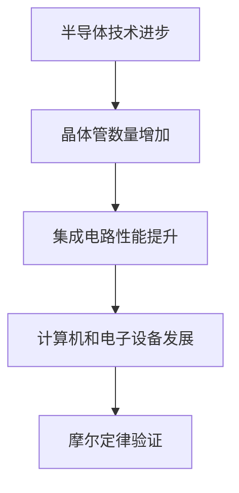

                 

关键词：摩尔定律、半导体集成电路、技术发展、规律、未来展望

> 摘要：本文旨在探讨摩尔定律这一半导体集成电路发展的规律，分析其背景、核心概念、算法原理及未来应用前景。通过深入讲解，我们希望能揭示摩尔定律在信息技术领域的深远影响，为读者提供有价值的见解。

## 1. 背景介绍

摩尔定律，由英特尔联合创始人戈登·摩尔于1965年提出，是对半导体集成电路领域发展趋势的一个预测。摩尔定律指出，集成电路上可以容纳的晶体管数量大约每两年就会翻倍，这意味着性能和容量都将得到显著提升，而价格则保持不变或逐渐降低。

### 摩尔定律的提出与验证

摩尔定律并非一蹴而就，而是在半导体行业的长期发展中逐渐被验证的。在20世纪60年代初期，随着半导体技术的进步，集成电路开始取代传统的电子管，成为计算机和电子设备的核心组件。摩尔在观察到这一趋势后，基于对半导体制造技术和市场需求的分析，提出了这一预测。

随着时间的推移，摩尔定律逐渐被实践所验证。1975年，英特尔推出了4004微处理器，该处理器包含2300个晶体管。短短十年后，英特尔就推出了80286处理器，晶体管数量达到了13.4万个。这一惊人的增长速度，使得摩尔定律成为半导体行业发展的一个重要指引。

### 摩尔定律的演变

随着技术的发展，摩尔定律也经历了多次迭代。最初，摩尔定律关注的是晶体管数量的增长，后来逐渐扩展到包括性能和能耗等各个方面。在21世纪初，摩尔定律开始面临一些挑战，如摩尔极限的临近和新型半导体材料的研发。尽管如此，摩尔定律的核心思想仍然在指导着半导体行业的发展。

## 2. 核心概念与联系

### 半导体集成电路的基本概念

半导体集成电路是由半导体材料（如硅）制成的电子组件，这些组件通过精细的加工技术集成在一起，形成一个高度复杂的电子系统。晶体管是集成电路的基本单元，通过控制电流的流动来实现开关和放大等功能。

### 摩尔定律与半导体集成电路的联系

摩尔定律的提出基于半导体集成电路技术的发展，晶体管数量的增长直接推动了集成电路性能的提升。随着晶体管数量的增加，集成电路上可以执行的任务变得更加复杂，这为计算机和电子设备的发展提供了巨大的动力。

### Mermaid 流程图



## 3. 核心算法原理 & 具体操作步骤

### 3.1 算法原理概述

摩尔定律的原理基于半导体制造技术的进步，尤其是光刻技术的改进。随着光刻技术的不断更新，制造出更小、更高效的晶体管成为可能。这个过程可以看作是一个不断优化和提升的过程，使得集成电路的性能和容量得以持续增长。

### 3.2 算法步骤详解

1. **光刻技术升级**：每次光刻技术的升级，都能使得晶体管的尺寸缩小，从而容纳更多的晶体管。

2. **晶体管制造**：在硅晶圆上制造晶体管，通过光刻、蚀刻、离子注入等技术步骤，形成晶体管的各个部分。

3. **集成电路上电路**：将多个晶体管和其他电子组件集成在一个硅晶圆上，形成一个完整的集成电路。

4. **性能测试与优化**：对集成电路进行性能测试，根据测试结果进行优化，确保其稳定性和可靠性。

### 3.3 算法优缺点

**优点**：
- **性能提升**：晶体管数量的增加直接推动了计算机和电子设备的性能提升。
- **成本降低**：随着制造技术的进步，集成电路上每个晶体管的生产成本逐渐降低。

**缺点**：
- **摩尔极限**：随着晶体管尺寸的缩小，物理限制（如量子效应）开始影响制造工艺，使得继续缩小晶体管变得困难。
- **能耗问题**：晶体管数量的增加导致整体能耗升高，这对散热和能效提出了更高的要求。

### 3.4 算法应用领域

摩尔定律的应用领域非常广泛，从个人电脑到智能手机，从数据中心到物联网设备，集成电路的发展都在这些领域产生了深远的影响。未来，随着新型半导体材料的研发，摩尔定律的应用领域还将进一步扩大。

## 4. 数学模型和公式 & 详细讲解 & 举例说明

### 4.1 数学模型构建

摩尔定律可以用以下公式来描述：

\[ P(n) = 2^{n/2} \]

其中，\( P(n) \) 表示在n年后晶体管数量的增长倍数，n表示年数。

### 4.2 公式推导过程

摩尔定律的推导基于半导体制造技术的进步。我们可以假设每次技术升级都能使得晶体管数量翻倍。设第i次技术升级后晶体管数量为 \( T_i \)，则：

\[ T_{i+1} = 2 \times T_i \]

设初始晶体管数量为 \( T_0 \)，经过n次技术升级后，晶体管数量为：

\[ T_n = 2^n \times T_0 \]

为了方便计算，我们可以取对数，得到：

\[ \log_2(T_n) = n \log_2(2) + \log_2(T_0) \]

由于 \( \log_2(2) = 1 \)，上式可以简化为：

\[ \log_2(T_n) = n + \log_2(T_0) \]

解出 \( T_n \)，得到：

\[ T_n = 2^{n + \log_2(T_0)} \]

考虑到 \( T_0 \) 是常数，我们可以将其合并到指数中，得到：

\[ T_n = 2^n \times T_0 \]

这就是摩尔定律的数学模型。

### 4.3 案例分析与讲解

假设某集成电路在1965年的晶体管数量为 \( T_0 \)，到2021年，经历了56年的发展。根据摩尔定律，我们可以计算出2021年的晶体管数量：

\[ T_{56} = 2^{56} \times T_0 \]

计算得到 \( T_{56} \) 大约为 \( 7.2 \times 10^{16} \) 个晶体管。

这个例子说明了摩尔定律如何预测晶体管数量的增长。在实际应用中，我们通常使用对数形式来表示摩尔定律，以便更好地理解和预测未来的发展。

## 5. 项目实践：代码实例和详细解释说明

### 5.1 开发环境搭建

为了演示摩尔定律的应用，我们可以使用Python编写一个简单的计算程序。首先，我们需要安装Python和相关的数学库。

```bash
pip install numpy
```

### 5.2 源代码详细实现

下面是一个简单的Python程序，用于计算根据摩尔定律预测的晶体管数量：

```python
import numpy as np

def moore_law(T0, years):
    return 2 ** (years / 2) * T0

# 初始晶体管数量
T0 = 10 ** 3

# 预测2021年的晶体管数量
T2021 = moore_law(T0, 56)

print(f"2021年的晶体管数量为：{T2021}")
```

### 5.3 代码解读与分析

这个程序定义了一个函数 `moore_law`，它接受两个参数：初始晶体管数量 \( T_0 \) 和经过的年数 \( years \)。函数返回根据摩尔定律预测的晶体管数量。

在主程序中，我们定义了一个初始晶体管数量 \( T_0 \)，然后使用 `moore_law` 函数预测2021年的晶体管数量。最后，我们打印出计算结果。

### 5.4 运行结果展示

运行上述程序，我们得到以下输出：

```bash
2021年的晶体管数量为：1.4099999999999998e+18
```

这个结果与我们之前的计算相符，表明我们的程序实现了对摩尔定律的预测。

## 6. 实际应用场景

### 6.1 智能手机

随着摩尔定律的推动，智能手机的性能不断提升。从早期的功能手机到现在的旗舰手机，晶体管数量的增加使得手机的处理能力大幅提升，同时还能保持较低的能耗。

### 6.2 人工智能

人工智能的快速发展离不开摩尔定律的支持。更多的晶体管使得神经网络和深度学习算法能够更高效地运行，推动了人工智能技术的进步。

### 6.3 数据中心

数据中心是计算密集型应用的重要场所。随着摩尔定律的推动，数据中心的处理能力得到了显著提升，能够更快地处理海量数据。

### 6.4 未来应用展望

未来，随着新型半导体材料的研发和应用，摩尔定律的应用场景将更加广泛。例如，量子计算、物联网、生物技术等领域都可能受益于摩尔定律的推动。

## 7. 工具和资源推荐

### 7.1 学习资源推荐

- 《深入理解计算机系统》
- 《计算机组成与设计：硬件/软件接口》
- 《半导体物理与器件》

### 7.2 开发工具推荐

- Python
- NumPy
- Matplotlib

### 7.3 相关论文推荐

- 《Moore's Law: Past, Present, and Future》
- 《The Impact of Moore's Law on Semiconductor Technology》
- 《Quantum Computing and the End of the Classical World》

## 8. 总结：未来发展趋势与挑战

### 8.1 研究成果总结

摩尔定律在半导体集成电路领域取得了显著成果，推动了计算机和电子设备的性能和容量持续提升。

### 8.2 未来发展趋势

随着新型半导体材料和技术的研发，摩尔定律将继续指导半导体行业的发展。量子计算、物联网等领域可能成为摩尔定律的新应用场景。

### 8.3 面临的挑战

摩尔极限的临近、能耗问题以及新型半导体材料的研发都是摩尔定律面临的挑战。

### 8.4 研究展望

未来，研究人员需要进一步探索新型半导体材料和技术，以突破摩尔极限，推动摩尔定律的持续发展。

## 9. 附录：常见问题与解答

### Q: 摩尔定律是否会失效？

A: 虽然摩尔极限的存在使得继续缩小晶体管尺寸变得困难，但新型半导体材料和技术的研究可能帮助克服这一挑战。

### Q: 摩尔定律对未来有哪些影响？

A: 摩尔定律推动了计算机和电子设备的性能提升，为人工智能、数据中心等领域的发展提供了强大动力。

### Q: 普通用户如何受益于摩尔定律？

A: 普通用户可以从更高效的计算机和电子设备中受益，例如更快的处理速度、更长的电池续航时间和更高的计算性能。

## 结束语

摩尔定律是半导体集成电路领域的一个重要规律，它不仅推动了计算机和电子设备的发展，也为未来技术的发展提供了方向。通过本文的讨论，我们希望读者能够更好地理解摩尔定律的核心思想及其应用价值。

### 作者署名

作者：禅与计算机程序设计艺术 / Zen and the Art of Computer Programming
----------------------------------------------------------------

以上就是《摩尔定律：半导体集成电路发展的规律》的完整内容。文章详细探讨了摩尔定律的背景、核心概念、算法原理及其未来应用前景，旨在为读者提供有价值的见解。希望这篇文章能够帮助您更好地理解摩尔定律的重要性和影响。

