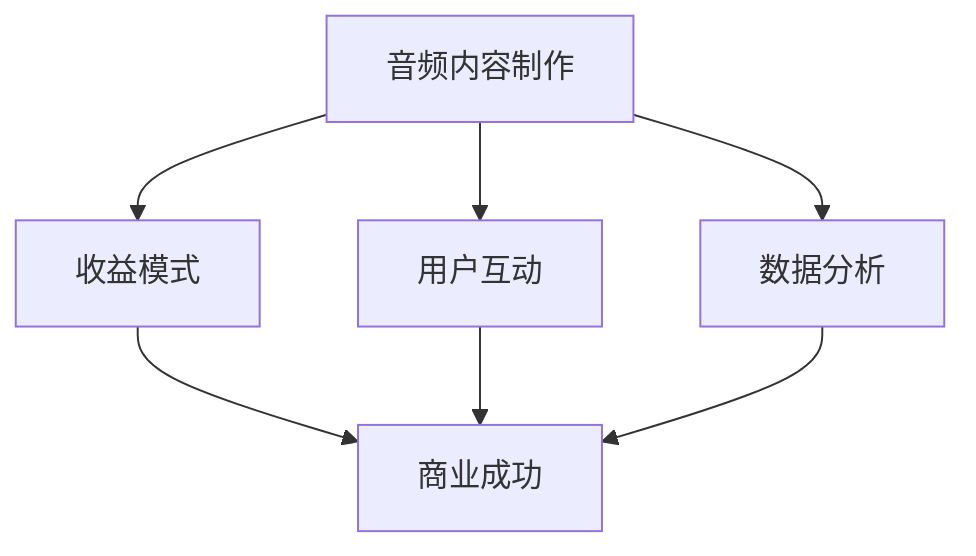

                 

关键词：播客，音频内容，商业化，创业，AI技术，内容制作，收益模式，用户互动，数据分析

> 摘要：本文将探讨在人工智能时代，如何利用音频内容进行商业化探索。我们将分析播客市场的现状，介绍音频内容制作的技巧，探讨多种收益模式，分析用户互动与数据分析的重要性，并展望播客创业的未来趋势与挑战。

## 1. 背景介绍

随着互联网的普及和移动设备的广泛使用，音频内容逐渐成为信息传播的重要方式。尤其是播客（Podcast），作为一种可以随时随地收听的音频节目，受到了广大用户的喜爱。据统计，全球播客听众数量已经超过5亿，市场规模不断扩大。

在这样一个繁荣的市场中，创业者们看到了巨大的商机。然而，如何成功商业化音频内容，成为许多创业者面临的挑战。本文将深入探讨播客创业的各个方面，帮助读者理解这一领域的商业逻辑和操作技巧。

## 2. 核心概念与联系

在探讨播客创业之前，我们需要了解一些核心概念，包括音频内容制作、收益模式、用户互动和数据分析等。以下是这些概念之间的联系，以及一个简单的Mermaid流程图来描述这些关系。



### 2.1 音频内容制作

音频内容制作是播客创业的基础。高质量的音频内容能够吸引和留住听众。制作过程包括内容策划、录制、编辑和发布等多个环节。一个成功的播客节目需要有独特的观点、深入的探讨和专业的声音效果。

### 2.2 收益模式

收益模式是播客商业化的关键。目前，常见的收益模式包括广告收入、付费订阅、赞助商支持和会员制等。不同模式适用于不同的播客类型和市场定位。

### 2.3 用户互动

用户互动是提升播客品牌价值的重要手段。通过社交媒体、邮件列表和论坛等渠道，播客主可以与听众建立紧密的联系。这不仅能够增强用户的忠诚度，还可以为产品推广和口碑传播提供支持。

### 2.4 数据分析

数据分析是优化播客运营的重要工具。通过分析用户的收听习惯、反馈和行为数据，播客主可以更好地了解市场需求，调整内容策略，提高用户体验。

## 3. 核心算法原理 & 具体操作步骤

### 3.1 算法原理概述

在音频内容制作过程中，常用的算法包括音频处理算法和语音识别算法。音频处理算法用于优化音频质量，去除噪声，增强音质等。语音识别算法则用于将语音转换为文本，以便进行后续的数据分析和内容创作。

### 3.2 算法步骤详解

#### 3.2.1 音频处理算法

1. **降噪**：使用如波纹降噪、谱减法等算法去除音频中的噪声。
2. **均衡**：调整音频的频谱，使其在不同的频率范围内达到平衡。
3. **压缩**：通过压缩算法，减小音频文件的大小，同时保持音频质量。

#### 3.2.2 语音识别算法

1. **预处理**：对音频信号进行滤波、去噪等处理，提高语音识别的准确性。
2. **特征提取**：从预处理后的音频中提取特征，如频谱特征、倒谱特征等。
3. **模型训练**：使用神经网络、隐马尔可夫模型（HMM）等算法进行模型训练，提高语音识别的准确性。

### 3.3 算法优缺点

#### 音频处理算法

**优点**：能够显著提高音频质量，使内容更易于听取。

**缺点**：处理过程复杂，计算资源消耗大。

#### 语音识别算法

**优点**：能够将语音转换为文本，便于数据分析。

**缺点**：在噪声较大的环境中，识别准确性可能会受到影响。

### 3.4 算法应用领域

音频处理算法广泛应用于音频编辑、语音合成等领域。语音识别算法则广泛应用于智能语音助手、自动字幕生成等领域。

## 4. 数学模型和公式 & 详细讲解 & 举例说明

在音频内容制作和数据分析中，数学模型和公式扮演着重要的角色。以下是一个简单的数学模型，用于预测音频内容的收益。

### 4.1 数学模型构建

设 \(R\) 为音频内容的收益，\(C\) 为制作成本，\(P\) 为听众数量，\(R_p\) 为每个听众的平均收益，\(C_p\) 为每个听众的平均成本。

收益模型：\(R = P \times R_p - C\)

### 4.2 公式推导过程

收益 \(R\) 等于听众数量 \(P\) 乘以每个听众的平均收益 \(R_p\) 减去制作成本 \(C\)。

### 4.3 案例分析与讲解

假设一个播客节目每月的听众数量为10000人，每个听众的平均收益为5元，制作成本为2000元。根据收益模型，该节目的月收益为：

\[R = 10000 \times 5 - 2000 = 48000 \text{元}\]

通过调整制作成本或增加听众数量，可以提高收益。

## 5. 项目实践：代码实例和详细解释说明

### 5.1 开发环境搭建

为了实现音频内容的商业化，我们需要搭建一个开发环境。以下是基本的步骤：

1. **安装音频处理工具**：如Audacity、Adobe Audition等。
2. **安装语音识别API**：如Google Cloud Speech-to-Text、Amazon Transcribe等。
3. **搭建数据分析平台**：如使用Python的Pandas库进行数据处理。

### 5.2 源代码详细实现

以下是一个简单的Python代码示例，用于实现音频内容的语音识别和数据存储。

```python
import os
from google.cloud import speech

# 设置Google Cloud Speech-to-Text的API密钥
os.environ['GOOGLE_APPLICATION_CREDENTIALS'] = 'path/to/your/credentials.json'

# 初始化Speech-to-Text客户端
client = speech.SpeechClient()

# 读取音频文件
with open('audio.wav', 'rb') as audio_file:
    content = audio_file.read()

# 分析音频
response = client.recognize(content, config={
    'encoding': 'WAV',
    'language_code': 'en-US',
    'sample_rate_hertz': 16000,
})

# 输出识别结果
for result in response.results:
    print(result.alternatives[0].transcript)
```

### 5.3 代码解读与分析

这段代码首先设置了Google Cloud Speech-to-Text的API密钥，然后初始化了客户端。接着，代码读取音频文件，使用语音识别API进行音频分析，并将识别结果输出。

### 5.4 运行结果展示

运行上述代码后，你将得到音频文件的文本转录结果。这个结果可以用于后续的数据分析，如情感分析、关键词提取等。

## 6. 实际应用场景

播客创业在多个领域有着广泛的应用，如教育培训、商业咨询、娱乐休闲等。以下是一些实际应用场景的案例：

1. **教育培训**：通过播客形式提供在线课程，吸引学生进行学习。
2. **商业咨询**：邀请行业专家分享经验和见解，为听众提供有价值的信息。
3. **娱乐休闲**：制作有趣、轻松的节目，吸引听众进行收听。

## 6.4 未来应用展望

随着技术的进步，播客创业在未来将面临更多的机遇和挑战。以下是几个可能的趋势：

1. **AI技术的深入应用**：音频内容制作和数据分析将更加智能化。
2. **跨平台发展**：播客内容将更多地与其他媒体形式结合，如视频、图文等。
3. **个性化推荐**：基于用户行为数据，提供更加个性化的内容推荐。

## 7. 工具和资源推荐

### 7.1 学习资源推荐

- 《播客创业入门与实战》
- 《音频处理与语音识别技术》
- 《数据科学实战：使用Python进行数据分析》

### 7.2 开发工具推荐

- Audacity：音频编辑工具。
- Adobe Audition：专业的音频处理软件。
- Google Cloud Speech-to-Text：语音识别API。

### 7.3 相关论文推荐

- "Speech Recognition with Deep Neural Networks" by Hinton et al.
- "WaveNet: A Generative Model for Raw Audio" by Amodei et al.

## 8. 总结：未来发展趋势与挑战

播客创业正处于快速发展阶段。随着AI技术的不断进步，音频内容的制作和分发将变得更加高效和智能化。然而，创业者在追求商业成功的过程中，也需要面对内容原创性、市场竞争激烈等挑战。

未来，成功的播客创业将需要具备创新思维、强大的内容制作能力和优秀的用户互动策略。随着技术的不断进步，播客创业将在教育培训、商业咨询、娱乐休闲等多个领域发挥更大的作用。

### 8.1 研究成果总结

本文通过分析播客市场的现状，介绍了音频内容制作、收益模式、用户互动和数据分析等核心概念，探讨了人工智能在音频内容制作中的应用，并展望了播客创业的未来发展趋势。

### 8.2 未来发展趋势

未来，播客创业将朝着更加智能化、个性化、多元化的方向发展。AI技术将进一步提升音频内容的制作质量和数据分析能力，为创业者提供更多的商业机会。

### 8.3 面临的挑战

播客创业面临的挑战主要包括内容原创性、市场竞争激烈、用户留存困难等。如何提供高质量、有价值的音频内容，如何在激烈的市场竞争中脱颖而出，是创业者需要深思的问题。

### 8.4 研究展望

未来的研究可以进一步探讨AI技术在音频内容创作和分发中的应用，如语音合成、个性化推荐等。同时，研究如何更好地结合其他媒体形式，提升播客内容的吸引力和竞争力。

## 9. 附录：常见问题与解答

### 9.1 如何制作高质量的音频内容？

- 使用专业的录音设备和软件。
- 注意音频环境的噪音控制。
- 进行多遍录音和后期处理，确保音频质量。

### 9.2 如何选择适合的收益模式？

- 根据目标受众和内容特点选择合适的收益模式。
- 可以结合多种收益模式，提高收入稳定性。

### 9.3 如何提升用户互动？

- 定期发布互动话题，鼓励听众参与。
- 通过社交媒体和邮件列表与听众保持联系。
- 定期举办线下活动，增强用户参与感。

### 9.4 如何进行数据分析？

- 使用数据分析工具，如Python的Pandas库。
- 收集用户行为数据，进行分析和可视化。
- 根据分析结果，调整内容策略和运营策略。

**作者：禅与计算机程序设计艺术 / Zen and the Art of Computer Programming**

