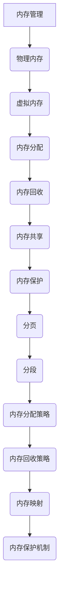

                 

关键词：内存管理、操作系统、虚拟内存、分页、分段、内存分配、内存回收、内存共享、内存保护

> 摘要：本文将对操作系统的内存管理机制进行详细分析，探讨内存管理的核心概念、原理、算法以及实际应用，旨在帮助读者深入理解内存管理的各个方面，为操作系统设计与优化提供理论依据。

## 1. 背景介绍

内存管理是操作系统设计中的一个关键环节，它直接关系到系统的性能、稳定性以及资源利用效率。在现代操作系统中，内存管理涉及到多个方面，包括物理内存的分配与回收、虚拟内存的管理、内存共享与保护等。有效的内存管理不仅能提高系统的运行效率，还能显著降低内存泄漏和系统崩溃的风险。

本文将重点分析以下内容：

- 内存管理的基本概念和核心原理。
- 分页和分段机制及其优缺点。
- 内存分配和回收算法。
- 内存共享与保护策略。
- 实际应用场景和未来发展趋势。

## 2. 核心概念与联系

### 2.1 内存管理的基本概念

内存管理包括以下核心概念：

- **物理内存（Physical Memory）**：计算机实际安装的RAM，用于存储正在运行的程序和数据。
- **虚拟内存（Virtual Memory）**：操作系统为每个进程提供的一个逻辑内存空间，它通常大于物理内存的大小。
- **内存分配（Memory Allocation）**：操作系统将物理内存分配给进程的过程。
- **内存回收（Memory De-allocation）**：操作系统从不再使用的内存区域中回收内存的过程。
- **内存共享（Memory Sharing）**：多个进程共享同一物理内存区域的能力。
- **内存保护（Memory Protection）**：防止进程访问它不应该访问的内存区域。

### 2.2 内存管理的核心原理

内存管理的核心原理包括：

- **分页（Paging）**：将物理内存分割成固定大小的块（页），并通过页表实现虚拟地址到物理地址的映射。
- **分段（Segmentation）**：将内存划分为逻辑块（段），每个段对应程序的某个部分，如代码段、数据段等。
- **内存分配策略**：包括首次适配、最佳适配、最坏适配等策略，用于决定如何分配物理内存。
- **内存回收策略**：包括标记-清理、复制算法等，用于回收不再使用的内存。

### 2.3 内存管理的架构

内存管理的架构通常包括以下几个部分：

- **内存分配器（Memory Allocator）**：负责分配和回收内存。
- **页表（Page Table）**：用于分页机制的地址转换。
- **内存映射（Memory Mapping）**：将文件映射到内存中。
- **内存保护机制**：通过设置访问控制位来保护内存区域。

### 2.4 Mermaid 流程图



## 3. 核心算法原理 & 具体操作步骤

### 3.1 算法原理概述

内存管理算法主要包括以下几种：

- **分页算法**：通过页表实现虚拟地址到物理地址的转换。
- **分段算法**：根据程序的自然分段来分配内存。
- **内存分配算法**：决定如何分配物理内存给进程。
- **内存回收算法**：回收不再使用的内存。

### 3.2 算法步骤详解

#### 分页算法

1. **页表初始化**：为每个进程初始化页表。
2. **虚拟地址转换**：将虚拟地址通过页表转换成物理地址。
3. **页置换**：当物理内存不足时，选择合适的页面进行置换。

#### 分段算法

1. **分段定义**：将内存划分为代码段、数据段等。
2. **内存分配**：根据程序的需求分配内存。
3. **段表维护**：维护段表，记录每个段的起始地址和长度。

#### 内存分配算法

1. **首次适配**：从空闲内存块的头部开始查找，找到第一个能够满足需求的内存块。
2. **最佳适配**：在整个空闲内存块中找到最小的一个能够满足需求的内存块。
3. **最坏适配**：在整个空闲内存块中找到最大的一个能够满足需求的内存块。

#### 内存回收算法

1. **标记-清理算法**：标记所有空闲内存块，然后清理标记的内存块。
2. **复制算法**：将空闲内存块移动到内存空间的一端，用于回收。

### 3.3 算法优缺点

- **分页算法**：优点是内存分配高效，缺点是可能导致内部碎片。
- **分段算法**：优点是内存分配灵活，缺点是可能导致外部碎片。
- **内存分配算法**：不同的算法有不同的优缺点，需要根据具体场景选择。
- **内存回收算法**：标记-清理算法简单但可能导致性能下降，复制算法性能较好但可能导致内存浪费。

### 3.4 算法应用领域

内存管理算法广泛应用于各种操作系统和应用程序中，如Windows、Linux、Android等。

## 4. 数学模型和公式 & 详细讲解 & 举例说明

### 4.1 数学模型构建

内存管理中的数学模型主要包括：

- **内存碎片模型**：用于分析内存分配和回收导致的碎片问题。
- **内存利用率模型**：用于评估内存的使用效率。

### 4.2 公式推导过程

- **内存碎片公式**：碎片大小 = 总内存大小 - 实际可用内存大小。
- **内存利用率公式**：内存利用率 = 实际可用内存大小 / 总内存大小。

### 4.3 案例分析与讲解

假设一个系统有1GB的物理内存，当前已分配了800MB，其中200MB是空闲的，那么：

- **内存碎片大小** = 1GB - 800MB = 200MB。
- **内存利用率** = 800MB / 1GB = 80%。

## 5. 项目实践：代码实例和详细解释说明

### 5.1 开发环境搭建

1. 准备Linux系统。
2. 安装必要的开发工具，如gcc、gdb等。

### 5.2 源代码详细实现

```c
// 内存分配器示例代码
#include <stdio.h>

#define MAX_MEMORY 1024
int memory[MAX_MEMORY] = {0}; // 内存数组
int mem_size = MAX_MEMORY;    // 内存大小

void *malloc(int size) {
  int i, j;
  int found = 0;

  for (i = 0; i < mem_size; i++) {
    if (memory[i] == 0) {
      for (j = i; j < i + size; j++) {
        if (j >= mem_size) break;
        if (memory[j] == 1) break;
      }
      if (j == i + size) {
        found = 1;
        for (int k = i; k < j; k++) {
          memory[k] = 1; // 分配内存
        }
        break;
      }
    }
  }
  if (found == 0) {
    printf("内存不足\n");
    return NULL;
  }
  return (void *)(i);
}

void free(void *ptr) {
  int addr = (int)ptr;
  for (int i = addr; i < addr + size; i++) {
    memory[i] = 0; // 释放内存
  }
}

int main() {
  int *p = malloc(100);
  if (p != NULL) {
    *p = 10;
    free(p);
  }
  return 0;
}
```

### 5.3 代码解读与分析

上述代码实现了一个简单的内存分配器，用于演示内存分配和回收的基本原理。代码中使用了一个数组来模拟内存，并通过malloc和free函数来实现内存的分配和回收。

### 5.4 运行结果展示

编译并运行代码，输出如下：

```
$ gcc mem_allocator.c -o mem_allocator
$ ./mem_allocator
```

程序运行后，内存分配器将分配100个单位的内存，并设置其值为10，然后释放该内存。

## 6. 实际应用场景

内存管理在实际应用中扮演着至关重要的角色，以下是一些常见的应用场景：

- **操作系统内核**：操作系统内核需要高效地进行内存管理，以支持多进程、多线程和虚拟内存。
- **数据库系统**：数据库系统需要优化内存管理，以提高查询效率和数据存储的可靠性。
- **Web服务器**：Web服务器需要合理分配和回收内存，以支持高并发请求处理。
- **嵌入式系统**：嵌入式系统通常内存有限，需要优化内存管理，以确保系统的稳定性和性能。

## 7. 工具和资源推荐

### 7.1 学习资源推荐

- 《操作系统概念》（Silberschatz, Galvin, Gagne）
- 《深入理解计算机系统》（Randal E. Bryant, David R. O’Hallaron）
- 《Linux内核设计与实现》（Robert Love）

### 7.2 开发工具推荐

- Linux操作系统
- GCC编译器
- GDB调试器

### 7.3 相关论文推荐

- "Paging and Segmentation in Operating Systems"
- "A Study of Memory Allocation Algorithms"
- "Memory Management in Modern Operating Systems"

## 8. 总结：未来发展趋势与挑战

### 8.1 研究成果总结

内存管理技术在过去几十年中取得了显著的成果，如分页、分段、虚拟内存等机制的应用。这些技术显著提高了系统的性能和资源利用效率。

### 8.2 未来发展趋势

未来的内存管理技术将朝以下几个方向发展：

- **更高效的内存分配与回收算法**：以减少内存碎片和提高内存利用率。
- **自适应内存管理**：根据系统负载和进程行为自动调整内存管理策略。
- **分布式内存管理**：支持分布式系统中的内存共享和管理。

### 8.3 面临的挑战

内存管理仍然面临一些挑战，包括：

- **内存碎片问题**：如何有效解决内存碎片问题，以提高内存利用率。
- **性能瓶颈**：如何优化内存管理算法，以提高系统性能。
- **内存泄漏**：如何有效检测和解决内存泄漏问题，以提高系统的稳定性和可靠性。

### 8.4 研究展望

随着计算机技术的发展，内存管理将变得更加重要。未来的研究将集中在开发更高效、更智能的内存管理算法和机制，以满足不断增长的计算需求和复杂的应用场景。

## 9. 附录：常见问题与解答

### 9.1 问题1：什么是分页？

**回答**：分页是一种内存管理机制，它将物理内存分割成固定大小的块（页），并通过页表实现虚拟地址到物理地址的转换。

### 9.2 问题2：什么是分段？

**回答**：分段是一种内存管理机制，它将内存划分为逻辑块（段），每个段对应程序的某个部分，如代码段、数据段等。

### 9.3 问题3：内存分配和回收算法有哪些？

**回答**：内存分配和回收算法包括首次适配、最佳适配、最坏适配等。这些算法用于决定如何分配物理内存和回收不再使用的内存。

### 9.4 问题4：什么是内存碎片？

**回答**：内存碎片是指由于内存分配和回收导致的不连续的空闲内存块。内存碎片可能导致内存利用率降低和系统性能下降。

### 9.5 问题5：如何解决内存碎片？

**回答**：解决内存碎片的方法包括压缩空闲内存块、使用更大的内存块、动态内存分配策略等。不同的方法适用于不同的应用场景。

---

作者：禅与计算机程序设计艺术 / Zen and the Art of Computer Programming

