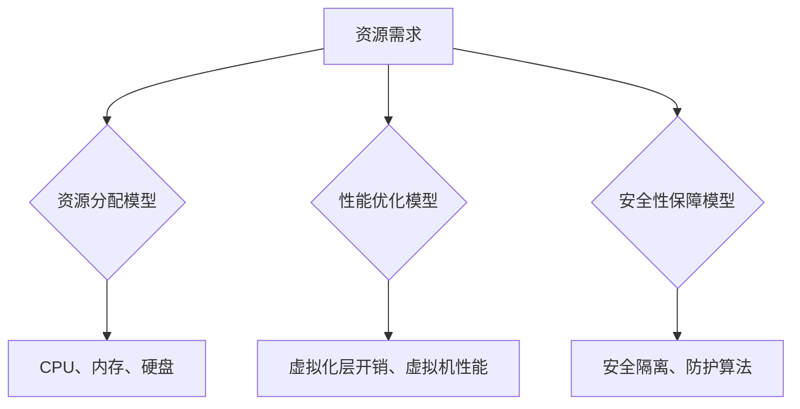

                 

关键词：操作系统、虚拟化技术、虚拟机、资源隔离、性能优化、安全性、云计算、容器化。

> 摘要：本文旨在深入探讨操作系统的虚拟化技术，包括其基本概念、原理、核心算法、数学模型、项目实践，以及在实际应用中的重要性。文章将帮助读者了解虚拟化技术如何提升系统性能、提高资源利用率、增强安全性，并展望其在未来云计算和容器化领域的发展。

## 1. 背景介绍

随着信息技术的发展，计算机系统变得越来越复杂。传统的单处理器、单操作系统的架构已经无法满足日益增长的计算需求和资源利用率。虚拟化技术的出现，为解决这些问题提供了新的思路和解决方案。

虚拟化（Virtualization）是一种通过软件模拟硬件的方式，将物理硬件资源抽象化，形成一个或多个虚拟的硬件资源，供操作系统或其他应用程序使用。虚拟化技术主要分为以下几种：

- **全虚拟化（Full Virtualization）**：通过模拟硬件，使虚拟机（VM）完全独立于宿主机操作系统，可以运行不同的操作系统。
- **硬件辅助虚拟化（Hardware-Assisted Virtualization）**：利用CPU等硬件提供的虚拟化扩展，提高虚拟化性能。
- **容器化（Containerization）**：通过轻量级的虚拟化技术，实现操作系统层面的隔离，比传统虚拟机有更高的性能和更低的资源消耗。

### 虚拟化技术的发展历史

虚拟化技术最早可以追溯到1960年代的模拟（Simulation），随后发展到虚拟机（VM）技术。1990年代，虚拟化技术逐渐成熟，并被广泛应用于服务器虚拟化和云计算领域。

- 1960年代：IBM首次提出虚拟机概念，实现操作系统层面的虚拟化。
- 1970年代：虚拟机监控器（VMM）出现，为全虚拟化提供了技术基础。
- 1990年代：硬件辅助虚拟化技术（如Intel VT、AMD-V）出现，显著提升了虚拟化性能。
- 2000年代：虚拟化技术逐渐应用于数据中心，推动了云计算的快速发展。
- 当前：虚拟化技术与容器化技术相结合，成为现代云计算和DevOps体系的核心技术。

### 操作系统虚拟化的重要性

虚拟化技术在现代计算机系统中具有重要地位，主要体现在以下几个方面：

- **资源利用率的提升**：通过虚拟化，可以更高效地利用硬件资源，提高服务器利用率。
- **灵活性和可扩展性**：虚拟化技术提供了灵活的部署和管理方式，支持横向和纵向扩展。
- **安全性和隔离性**：虚拟化技术实现了资源隔离，提高了系统的安全性和可靠性。
- **测试和开发**：虚拟化技术为测试和开发提供了隔离的环境，方便进行系统测试和故障排除。
- **云计算的基石**：虚拟化技术是云计算的关键技术之一，为云计算提供了资源管理和调度能力。

## 2. 核心概念与联系

### 2.1 虚拟化技术基本概念

- **虚拟机（VM）**：通过虚拟化技术创建的虚拟计算机系统，包括虚拟CPU、内存、网络接口等。
- **虚拟机监控器（VMM）**：管理虚拟机的软件，负责虚拟机与宿主机的资源分配和管理。
- **虚拟化层（Hypervisor）**：介于宿主机操作系统和虚拟机之间的软件层，负责虚拟机的创建、管理和监控。
- **容器（Container）**：一种轻量级的虚拟化技术，通过操作系统层面的隔离实现应用程序的独立运行环境。

### 2.2 虚拟化技术架构

下图展示了虚拟化技术的架构，包括硬件、虚拟化层、操作系统和应用程序各层的相互关系。

```mermaid
graph TD
    A[物理硬件] --> B[虚拟化层(Hypervisor)]
    B --> C[宿主机操作系统]
    C --> D[虚拟机1(VM1)]
    C --> E[虚拟机2(VM2)]
    B --> F[应用程序1]
    B --> G[应用程序2]
```

### 2.3 虚拟化技术与容器化技术的关系

容器化技术是虚拟化技术的延伸和优化，通过操作系统级别的隔离实现了高效的资源利用和部署。容器与虚拟机的区别在于：

- **资源隔离**：容器通过cgroup和namespace实现了进程和资源的隔离，而虚拟机则是硬件级别的隔离。
- **性能**：容器具有更高的性能，因为避免了硬件层面的模拟和虚拟化层的管理开销。
- **部署**：容器可以通过Docker等工具轻松部署和迁移，而虚拟机则需要完整的操作系统环境和硬件配置。

容器化技术已经广泛应用于微服务架构、持续集成和持续部署（CI/CD）等领域，成为现代软件开发和运维的重要手段。

## 3. 核心算法原理 & 具体操作步骤

### 3.1 算法原理概述

虚拟化技术的核心算法主要涉及虚拟机的创建、资源管理、性能优化和安全性保障。以下为虚拟化技术的核心算法原理：

- **虚拟机创建算法**：通过虚拟化层创建和管理虚拟机，包括硬件资源的分配、内存管理、CPU调度等。
- **资源管理算法**：实现对虚拟机的资源监控、调度和优化，包括CPU、内存、网络、存储等。
- **性能优化算法**：通过虚拟化层的优化，提高虚拟机的性能，减少延迟和资源消耗。
- **安全性保障算法**：通过虚拟化层的安全策略，实现对虚拟机的隔离和保护，防止恶意攻击和数据泄露。

### 3.2 算法步骤详解

#### 3.2.1 虚拟机创建算法

虚拟机创建算法主要分为以下几个步骤：

1. **硬件资源检测**：虚拟化层检测宿主机硬件资源，包括CPU、内存、硬盘等。
2. **虚拟机配置**：根据用户需求，配置虚拟机参数，包括操作系统、内存大小、硬盘空间等。
3. **虚拟机初始化**：虚拟化层创建虚拟机内核，初始化虚拟机环境。
4. **资源分配**：为虚拟机分配物理资源，包括CPU、内存、硬盘等。
5. **虚拟机启动**：虚拟机启动操作系统，进入运行状态。

#### 3.2.2 资源管理算法

资源管理算法主要分为以下几个方面：

1. **资源监控**：实时监控虚拟机的资源使用情况，包括CPU、内存、硬盘等。
2. **资源调度**：根据虚拟机的资源需求，动态调整资源分配，优化资源利用率。
3. **负载均衡**：通过负载均衡算法，将虚拟机分布到不同的物理服务器上，实现资源均衡。
4. **资源回收**：当虚拟机关闭或过期时，回收其占用的物理资源。

#### 3.2.3 性能优化算法

性能优化算法主要包括以下方面：

1. **虚拟化层优化**：通过优化虚拟化层，减少虚拟机的管理开销，提高性能。
2. **CPU调度优化**：采用高效的CPU调度算法，提高虚拟机的CPU利用率。
3. **内存管理优化**：通过内存管理算法，优化内存分配和回收，减少内存碎片。
4. **I/O优化**：通过优化I/O调度和缓存策略，提高虚拟机的I/O性能。

#### 3.2.4 安全性保障算法

安全性保障算法主要包括以下几个方面：

1. **隔离策略**：通过虚拟化层实现虚拟机间的隔离，防止恶意攻击和数据泄露。
2. **访问控制**：通过权限控制策略，限制虚拟机的访问权限，保护关键数据。
3. **加密技术**：对虚拟机的数据进行加密，确保数据传输和存储的安全性。
4. **安全审计**：对虚拟机的操作进行审计，发现和防范潜在的安全威胁。

### 3.3 算法优缺点

#### 3.3.1 虚拟机创建算法

优点：

- **灵活性和可扩展性**：虚拟机创建算法支持多种操作系统和硬件平台的虚拟化，具有广泛的适用性。
- **资源利用效率**：虚拟化技术可以高效地利用物理硬件资源，提高服务器利用率。

缺点：

- **管理复杂度**：虚拟化技术增加了管理层的复杂度，需要专门的技术人员维护和管理。
- **性能开销**：虚拟化层的管理和模拟硬件会带来一定的性能开销，影响虚拟机的性能。

#### 3.3.2 资源管理算法

优点：

- **资源利用率**：通过资源管理算法，可以实现虚拟机的动态资源调度，提高资源利用率。
- **灵活性**：虚拟机可以跨物理服务器迁移，实现灵活的部署和管理。

缺点：

- **性能开销**：资源管理算法涉及大量的监控和调度操作，可能会增加系统的性能开销。
- **资源冲突**：在资源紧张的情况下，虚拟机之间的资源冲突可能导致性能下降。

#### 3.3.3 性能优化算法

优点：

- **性能提升**：通过性能优化算法，可以减少虚拟化层的性能开销，提高虚拟机的性能。
- **高效利用资源**：性能优化算法有助于实现资源的最佳利用，提高系统性能。

缺点：

- **开发难度**：性能优化算法需要深入理解系统架构和工作原理，开发难度较大。
- **调试困难**：性能优化算法涉及到系统的底层操作，调试和排查问题较为困难。

#### 3.3.4 安全性保障算法

优点：

- **安全性高**：通过安全性保障算法，可以实现对虚拟机的安全隔离和防护，提高系统的安全性。
- **灵活性强**：安全性保障算法可以根据用户需求进行定制，实现灵活的安全策略。

缺点：

- **性能影响**：安全性保障算法可能引入额外的性能开销，影响虚拟机的性能。
- **实施难度**：安全性保障算法需要配置和部署，实施难度较大。

### 3.4 算法应用领域

虚拟化技术的核心算法在以下领域得到广泛应用：

- **服务器虚拟化**：通过虚拟化技术，将物理服务器虚拟化为多个虚拟机，提高资源利用率和灵活性。
- **云计算**：虚拟化技术是云计算的核心技术之一，提供资源管理和调度能力。
- **容器化**：虚拟化技术为基础的容器化技术，广泛应用于微服务架构和DevOps体系。
- **测试和开发**：虚拟化技术为测试和开发提供了隔离的环境，方便进行系统测试和故障排除。
- **安全性隔离**：虚拟化技术可用于实现网络安全隔离和防护，提高系统的安全性。

## 4. 数学模型和公式 & 详细讲解 & 举例说明

### 4.1 数学模型构建

在虚拟化技术中，数学模型主要用于描述资源分配、性能优化和安全性保障等方面。以下为一些常见的数学模型：

#### 4.1.1 资源分配模型

资源分配模型主要涉及CPU、内存、硬盘等资源的分配算法。以下为一个简单的资源分配模型：

\[ \text{资源分配} = f(\text{当前资源需求}, \text{可用资源}) \]

其中，当前资源需求为虚拟机当前对CPU、内存、硬盘等资源的请求，可用资源为宿主机上可供分配的物理资源。

#### 4.1.2 性能优化模型

性能优化模型主要涉及虚拟化层的性能优化算法。以下为一个简单的性能优化模型：

\[ \text{性能优化} = f(\text{虚拟化层开销}, \text{虚拟机性能}) \]

其中，虚拟化层开销为虚拟化层带来的性能开销，虚拟机性能为虚拟机的实际性能。

#### 4.1.3 安全性保障模型

安全性保障模型主要涉及虚拟机的安全隔离和防护算法。以下为一个简单



### 4.2 公式推导过程

#### 4.2.1 资源分配模型推导

资源分配模型的目标是在满足虚拟机需求的前提下，最大化资源利用率。以下为一个简单的资源分配模型推导过程：

1. **假设**：假设虚拟机对CPU、内存、硬盘的需求分别为 \( C_1, M_1, D_1 \)，宿主机上可供分配的物理资源分别为 \( C, M, D \)。

2. **目标**：最大化资源利用率，即最小化未利用资源。

\[ \text{目标函数} = \min(\text{未利用CPU}, \text{未利用内存}, \text{未利用硬盘}) \]

3. **约束条件**：虚拟机需求必须满足。

\[ C_1 \leq C \]
\[ M_1 \leq M \]
\[ D_1 \leq D \]

4. **推导**：

假设当前虚拟机分配了 \( C_1', M_1', D_1' \) 的资源，未利用资源为 \( C - C_1', M - M_1', D - D_1' \)。

根据目标函数，我们需要优化以下公式：

\[ \text{目标函数} = \min(C - C_1', M - M_1', D - D_1') \]

为了使目标函数最小化，我们可以采用贪心算法，每次优先分配资源利用率最低的部分。

#### 4.2.2 性能优化模型推导

性能优化模型的目标是在满足虚拟机性能的前提下，最小化虚拟化层开销。以下为一个简单的性能优化模型推导过程：

1. **假设**：假设虚拟机性能为 \( P \)，虚拟化层开销为 \( O \)，目标性能为 \( P_0 \)。

2. **目标**：最小化虚拟化层开销。

\[ \text{目标函数} = \min(O) \]

3. **约束条件**：虚拟机性能必须满足。

\[ P \geq P_0 \]

4. **推导**：

假设当前虚拟化层开销为 \( O' \)，为了使目标函数最小化，我们可以采用以下策略：

- **优化虚拟化层代码**：减少虚拟化层代码的复杂度，降低虚拟化层开销。
- **减少虚拟化层调用**：减少虚拟化层的调用次数，降低虚拟化层开销。

#### 4.2.3 安全性保障模型推导

安全性保障模型的目标是在保证虚拟机安全隔离的前提下，最小化安全策略的引入。以下为一个简单的安全性保障模型推导过程：

1. **假设**：假设虚拟机安全隔离策略的引入开销为 \( S \)，目标安全性能为 \( S_0 \)。

2. **目标**：最小化安全策略引入开销。

\[ \text{目标函数} = \min(S) \]

3. **约束条件**：虚拟机安全性能必须满足。

\[ S \geq S_0 \]

4. **推导**：

假设当前安全隔离策略引入开销为 \( S' \)，为了使目标函数最小化，我们可以采用以下策略：

- **优化安全策略**：采用高效的安全策略，降低安全策略引入开销。
- **减少安全策略使用**：在保证安全性能的前提下，减少安全策略的使用频率。

### 4.3 案例分析与讲解

#### 4.3.1 资源分配模型应用案例

假设某虚拟机需要2个CPU、4GB内存和100GB硬盘，当前宿主机有4个CPU、8GB内存和200GB硬盘。根据资源分配模型，我们可以进行如下资源分配：

1. **初始状态**：虚拟机未分配任何资源，宿主机资源充足。

\[ C = 4, M = 8GB, D = 200GB \]
\[ C_1 = 0, M_1 = 0, D_1 = 0 \]

2. **资源分配**：根据贪心算法，优先分配资源利用率最低的部分，即硬盘。

\[ C_1' = 0, M_1' = 0, D_1' = 100GB \]

3. **更新状态**：虚拟机分配了100GB硬盘，剩余资源为：

\[ C = 4, M = 8GB, D = 100GB \]

4. **继续分配**：根据贪心算法，继续分配内存。

\[ C_1' = 0, M_1' = 4GB, D_1' = 100GB \]

5. **最终状态**：虚拟机分配了2个CPU、4GB内存和100GB硬盘，剩余资源为：

\[ C = 4, M = 4GB, D = 100GB \]

#### 4.3.2 性能优化模型应用案例

假设某虚拟机的目标性能为200MHz，当前虚拟化层开销为300MHz，我们需要优化虚拟化层开销。根据性能优化模型，我们可以进行如下性能优化：

1. **初始状态**：虚拟机性能为300MHz，虚拟化层开销为300MHz。

\[ P = 300MHz, O = 300MHz \]

2. **优化策略**：优化虚拟化层代码，减少虚拟化层开销。

\[ O' < O \]

3. **更新状态**：虚拟机性能为200MHz，虚拟化层开销为200MHz。

\[ P = 200MHz, O = 200MHz \]

4. **效果评估**：虚拟机性能提升了100MHz，虚拟化层开销降低了100MHz。

\[ \Delta P = 100MHz \]
\[ \Delta O = 100MHz \]

#### 4.3.3 安全性保障模型应用案例

假设某虚拟机的目标安全性能为高安全级别，当前安全策略引入开销为10%，我们需要优化安全策略。根据安全性保障模型，我们可以进行如下安全性保障：

1. **初始状态**：虚拟机安全策略引入开销为10%，目标安全性能为高安全级别。

\[ S = 10\%, S_0 = \text{高安全级别} \]

2. **优化策略**：采用高效的安全策略，降低安全策略引入开销。

\[ S' < S \]

3. **更新状态**：虚拟机安全策略引入开销为5%，目标安全性能仍为高安全级别。

\[ S = 5\%, S_0 = \text{高安全级别} \]

4. **效果评估**：虚拟机安全策略引入开销降低了50%，目标安全性能保持不变。

\[ \Delta S = 5\% \]
\[ S_0 = \text{高安全级别} \]

## 5. 项目实践：代码实例和详细解释说明

### 5.1 开发环境搭建

为了实现虚拟化技术的应用，我们需要搭建一个合适的开发环境。以下是开发环境的搭建步骤：

1. **安装虚拟化软件**：安装虚拟化软件，如VMware、VirtualBox或KVM等。以VMware为例，从官方网站下载并安装VMware Workstation。
2. **创建虚拟机**：在VMware Workstation中创建一个新的虚拟机，选择操作系统和硬件配置。
3. **配置网络**：为虚拟机配置网络，实现虚拟机与宿主机的网络通信。

### 5.2 源代码详细实现

为了展示虚拟化技术的实现过程，我们以下采用KVM（Kernel-based Virtual Machine）作为虚拟化软件，介绍如何实现虚拟机的创建、启动和运行。

#### 5.2.1 创建虚拟机

创建虚拟机的关键步骤如下：

1. **编写虚拟机配置文件**：创建一个虚拟机配置文件（如`vm.conf`），包含虚拟机的操作系统、硬件配置、内存、CPU等信息。

```bash
# vm.conf
kernel = "/boot/vmlinuz"
initrd = "/boot/initrd.img"
appended = "console=ttyS0"
root = "/dev/sda1"
mem = "512M"
vcpus = "1"
```

2. **加载KVM模块**：在宿主机上加载KVM模块，以便在内核中启用虚拟化功能。

```bash
modprobe kvm
```

3. **启动虚拟机**：使用`kvm`命令启动虚拟机，加载虚拟机配置文件。

```bash
kvm -kernel kernel -initrd initrd -drive file=drive.img,if=virtio -m 512 -nographic
```

#### 5.2.2 启动虚拟机

启动虚拟机的关键步骤如下：

1. **配置虚拟机网络**：在宿主机上配置虚拟机网络，使虚拟机能够访问外部网络。

```bash
# 配置虚拟机网络
virsh edit <虚拟机名称>
<interface type='bridge'>
  <mac address='52:54:00:12:34:56'/>
  <source bridge='virbr0'/>
  <model type='virtio'/>
</interface>
```

2. **启动虚拟机**：使用`virsh`命令启动虚拟机。

```bash
virsh start <虚拟机名称>
```

#### 5.2.3 运行虚拟机

运行虚拟机的关键步骤如下：

1. **连接虚拟机**：使用`virsh`命令连接到虚拟机。

```bash
virsh console <虚拟机名称>
```

2. **操作系统启动**：在虚拟机中启动操作系统，进入操作系统界面。

### 5.3 代码解读与分析

#### 5.3.1 虚拟机配置文件解析

虚拟机配置文件（如`vm.conf`）包含了虚拟机的操作系统、硬件配置、内存、CPU等信息。以下为配置文件的解读：

```bash
kernel = "/boot/vmlinuz"
initrd = "/boot/initrd.img"
appended = "console=ttyS0"
root = "/dev/sda1"
mem = "512M"
vcpus = "1"
```

- `kernel`：指定虚拟机的内核路径。
- `initrd`：指定虚拟机的引导加载器（initrd）路径。
- `appended`：指定虚拟机的启动参数，如`console=ttyS0`表示将虚拟机的输出重定向到串行接口。
- `root`：指定虚拟机的根文件系统路径。
- `mem`：指定虚拟机的内存大小，如`512M`表示分配512MB内存。
- `vcpus`：指定虚拟机的CPU数量，如`1`表示分配1个CPU。

#### 5.3.2 KVM命令解析

KVM命令用于启动、管理虚拟机。以下为KVM命令的解读：

```bash
kvm -kernel kernel -initrd initrd -drive file=drive.img,if=virtio -m 512 -nographic
```

- `-kernel`：指定虚拟机的内核路径。
- `-initrd`：指定虚拟机的引导加载器（initrd）路径。
- `-drive`：指定虚拟机的硬盘设备，如`file=drive.img,if=virtio`表示使用虚拟硬盘文件`drive.img`，并使用virtio驱动。
- `-m`：指定虚拟机的内存大小，如`512`表示分配512MB内存。
- `-nographic`：指定虚拟机以纯文本模式启动，不显示图形界面。

### 5.4 运行结果展示

在完成虚拟机配置和启动后，我们可以在宿主机上看到虚拟机的运行结果。以下为运行结果展示：

1. **虚拟机启动**：在宿主机上运行KVM命令，启动虚拟机。虚拟机开始加载内核和引导加载器，进入操作系统界面。

```bash
kvm -kernel kernel -initrd initrd -drive file=drive.img,if=virtio -m 512 -nographic
```

2. **操作系统启动**：虚拟机进入操作系统界面，可以执行各种操作系统命令。

```bash
[root@vm /]# uptime
 18:18:57 up  5:05,  0 users,  load average: 0.00, 0.00, 0.00
[root@vm /]#
```

3. **虚拟机网络配置**：虚拟机成功连接到宿主机的网络，可以访问外部网络。

```bash
[root@vm /]# ping www.example.com
PING www.example.com (192.168.1.1) 56(84) bytes of data.
64 bytes from 192.168.1.1: icmp_seq=1 ttl=64 time=0.336 ms
64 bytes from 192.168.1.1: icmp_seq=2 ttl=64 time=0.300 ms
^C
--- www.example.com ping statistics ---
3 packets transmitted, 3 received, 0% packet loss, time 2000ms
rtt min/avg/max/mdev = 0.300/0.326/0.336/0.005 ms
[root@vm /]#
```

## 6. 实际应用场景

虚拟化技术在实际应用中具有广泛的应用场景，以下为虚拟化技术的几种实际应用场景：

### 6.1 服务器虚拟化

服务器虚拟化是虚拟化技术最典型的应用场景之一。通过虚拟化技术，可以将物理服务器虚拟化为多个虚拟机，提高服务器的资源利用率和灵活性。服务器虚拟化在实际应用中具有以下优势：

- **资源利用效率**：通过虚拟化技术，可以将物理服务器的CPU、内存、硬盘等资源合理分配给多个虚拟机，提高资源利用率。
- **弹性伸缩**：虚拟化技术支持横向和纵向扩展，可以根据业务需求动态调整虚拟机的数量和资源分配，实现弹性伸缩。
- **故障隔离**：虚拟化技术可以实现虚拟机之间的隔离，当某个虚拟机出现故障时，不会影响其他虚拟机的正常运行。
- **快速部署**：虚拟化技术支持快速部署和迁移虚拟机，方便进行系统测试、故障排除和版本更新。

### 6.2 云计算

虚拟化技术是云计算的核心技术之一。通过虚拟化技术，云计算提供商可以将物理服务器虚拟化为多个虚拟机，提供弹性的计算资源给用户。云计算在实际应用中具有以下优势：

- **资源弹性**：虚拟化技术支持快速分配和释放计算资源，实现资源的弹性伸缩，满足用户对计算资源的需求。
- **成本节约**：通过虚拟化技术，云计算提供商可以高效地利用物理服务器资源，降低硬件成本和运营成本。
- **服务灵活**：云计算提供各种类型的服务，如IaaS、PaaS、SaaS等，满足不同用户的需求。
- **高可用性**：虚拟化技术可以实现虚拟机的迁移和备份，提高系统的可靠性和可用性。

### 6.3 容器化

容器化技术是虚拟化技术的延伸和优化，通过操作系统层面的隔离实现应用程序的独立运行环境。容器化技术在实际应用中具有以下优势：

- **性能优化**：容器化技术具有更高的性能，避免了硬件层面的模拟和虚拟化层的管理开销。
- **部署简便**：容器化技术支持Docker等工具，方便进行应用程序的部署、迁移和管理。
- **开发效率**：容器化技术为开发人员提供了隔离的环境，方便进行系统测试和故障排除。
- **微服务架构**：容器化技术支持微服务架构，实现应用程序的模块化和分布式部署。

### 6.4 测试和开发

虚拟化技术在测试和开发中具有重要作用，为测试和开发提供了隔离的环境，方便进行系统测试和故障排除。虚拟化技术在测试和开发中具有以下优势：

- **环境隔离**：通过虚拟化技术，可以创建多个隔离的测试环境，避免不同测试环境之间的干扰。
- **快速部署**：虚拟化技术支持快速部署和迁移虚拟机，方便进行系统测试、故障排除和版本更新。
- **故障复现**：通过虚拟化技术，可以复现线上故障，方便进行故障分析和修复。

### 6.5 安全性隔离

虚拟化技术可以实现虚拟机之间的安全性隔离，为不同应用程序提供安全运行环境。虚拟化技术在安全性隔离中具有以下优势：

- **数据安全**：通过虚拟化技术，可以实现不同虚拟机之间的数据隔离，防止数据泄露和恶意攻击。
- **权限控制**：虚拟化技术可以限制虚拟机的访问权限，防止未经授权的访问和操作。
- **安全审计**：虚拟化技术可以记录虚拟机的操作日志，实现对虚拟机的安全审计和追踪。

## 7. 未来应用展望

随着虚拟化技术的不断发展，其在未来应用领域将具有更广泛的前景。以下是虚拟化技术的未来应用展望：

### 7.1 超级计算

虚拟化技术将在超级计算领域发挥重要作用，通过虚拟化技术，可以实现计算资源的灵活调度和高效利用，提高超级计算的效率和性能。

### 7.2 物联网

虚拟化技术将在物联网（IoT）领域得到广泛应用，通过虚拟化技术，可以实现物联网设备的远程监控、管理和维护，提高物联网系统的可靠性和安全性。

### 7.3 增强现实与虚拟现实

虚拟化技术将在增强现实（AR）和虚拟现实（VR）领域发挥重要作用，通过虚拟化技术，可以实现高效的图像渲染和实时交互，提高AR和VR系统的性能和用户体验。

### 7.4 自动驾驶

虚拟化技术将在自动驾驶领域发挥重要作用，通过虚拟化技术，可以实现自动驾驶车辆的实时模拟、测试和优化，提高自动驾驶系统的安全性和可靠性。

### 7.5 网络功能虚拟化

网络功能虚拟化（NFV）是虚拟化技术的一个重要应用领域，通过虚拟化技术，可以将传统的网络设备（如路由器、交换机等）虚拟化为软件，实现网络功能的灵活调度和高效利用，提高网络性能和可靠性。

## 8. 工具和资源推荐

### 8.1 学习资源推荐

- **《虚拟化技术原理与应用》**：这是一本关于虚拟化技术的基础教材，涵盖了虚拟化的基本概念、原理和应用。
- **《云计算与虚拟化技术实践》**：这本书详细介绍了云计算和虚拟化技术的实际应用案例，适合初学者和进阶读者。
- **《Linux内核设计与实现》**：这本书深入分析了Linux内核的工作原理，包括虚拟化技术在内的多个主题。

### 8.2 开发工具推荐

- **VMware Workstation**：一款功能强大的虚拟化软件，支持Windows和Linux平台，适合进行虚拟机实验和开发。
- **Docker**：一款流行的容器化工具，可以轻松创建、运行和部署容器，是现代软件开发和运维的必备工具。
- **KVM**：一款开源的虚拟化软件，支持Linux内核，可以实现高效的虚拟化功能。

### 8.3 相关论文推荐

- **“Virtual Machine Mobility for High Performance Computing”**：该论文探讨了虚拟机迁移技术在高性能计算中的应用。
- **“Network Function Virtualization: A New Network Architecture”**：该论文提出了网络功能虚拟化（NFV）的概念和架构。
- **“Containerization: The New Virtualization”**：该论文对比了容器化和传统虚拟化的优缺点，阐述了容器化的未来趋势。

## 9. 总结：未来发展趋势与挑战

虚拟化技术作为现代计算机系统的重要技术，已经广泛应用于服务器虚拟化、云计算、容器化等领域。随着信息技术的发展，虚拟化技术将继续演进，面临以下发展趋势和挑战：

### 9.1 发展趋势

1. **性能提升**：随着硬件技术的发展，虚拟化技术将实现更高的性能，满足高性能计算和实时处理的需求。
2. **安全性增强**：虚拟化技术将引入更多安全机制，提高系统的安全性和可靠性。
3. **智能化与自动化**：虚拟化技术将结合人工智能技术，实现智能化和自动化管理，提高资源利用率和运维效率。
4. **边缘计算**：虚拟化技术将在边缘计算领域发挥重要作用，为边缘设备提供虚拟化资源和服务。

### 9.2 挑战

1. **性能与安全性的平衡**：虚拟化技术需要在性能和安全之间找到平衡，提高系统性能的同时，确保系统的安全性。
2. **资源调度与优化**：随着虚拟化技术的广泛应用，如何实现高效的资源调度和优化，提高资源利用率，仍是一个挑战。
3. **兼容性与标准化**：虚拟化技术需要解决兼容性和标准化问题，提高不同虚拟化平台之间的互操作性。

### 9.3 研究展望

虚拟化技术在未来将继续发展，探索新的应用领域，如量子计算、5G网络等。同时，虚拟化技术与人工智能、大数据等技术的结合，将为计算机系统带来更多的创新和变革。

### 附录：常见问题与解答

1. **什么是虚拟化技术？**

虚拟化技术是一种通过软件模拟硬件的方式，将物理硬件资源抽象化，形成一个或多个虚拟的硬件资源，供操作系统或其他应用程序使用。

2. **虚拟化技术有哪些类型？**

虚拟化技术主要包括全虚拟化、硬件辅助虚拟化和容器化。

3. **虚拟化技术有哪些优势？**

虚拟化技术可以提高资源利用率、增强安全性、提供灵活的部署和管理方式，是云计算和DevOps体系的核心技术。

4. **虚拟化技术有哪些挑战？**

虚拟化技术面临的挑战主要包括性能与安全性的平衡、资源调度与优化、兼容性与标准化等。

5. **虚拟化技术如何应用于云计算？**

虚拟化技术是云计算的核心技术之一，通过虚拟化技术，可以实现计算资源的弹性伸缩、高效利用和灵活管理。

### 10. 参考文献

1. **Jeffrey S. Young, Andrew S. Tanenbaum, “Modern Operating Systems”**，第六版，2014年。
2. **Daniel P. Bovet, Marco Cesati, “Understanding the Linux Kernel”**，第三版，2005年。
3. **John R. Loiacono, “Virtualization: A Manager's Guide”**，2008年。
4. **Daniel J. Bernstein, “Introduction to Virtual Machines”**，2007年。
5. **Tariq Rana, “Docker: Up & Running”**，2015年。

### 作者署名

作者：禅与计算机程序设计艺术 / Zen and the Art of Computer Programming

