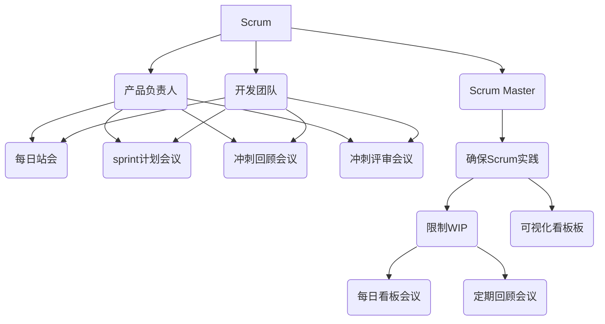

                 

关键词：敏捷开发，Scrum，看板方法，项目交付，团队协作，流程优化

> 摘要：本文旨在深入探讨敏捷开发中的Scrum与看板方法，这两大主流敏捷实践方法在提升项目交付效率、优化团队协作流程方面的重要性。通过对核心概念、流程、实践案例的详细解析，旨在为读者提供一种全面的理解和实际操作指南。

## 1. 背景介绍

在信息化时代，软件开发项目日益复杂，传统的“瀑布模型”开发方式由于缺乏灵活性，往往难以应对快速变化的市场需求。为了解决这一问题，敏捷开发方法应运而生。敏捷开发强调迭代、增量和持续交付，注重团队协作和客户反馈。其中，Scrum和看板方法是两大备受推崇的敏捷实践方法。

Scrum源自日本的精益生产理念，由Ken Schwaber和Jeff Sutherland在1995年提出。它通过角色、仪式和工具的明确定义，帮助团队实现持续交付和快速响应变化。而看板方法起源于丰田生产系统，通过可视化的看板（Kanban）板，实现工作流程的优化和资源利用最大化。

## 2. 核心概念与联系

### 2.1 Scrum的核心概念

Scrum定义了三个核心角色：产品负责人（Product Owner）、Scrum Master和开发团队。产品负责人负责定义产品需求和优先级，Scrum Master确保团队遵循Scrum流程，开发团队负责实现产品需求。

Scrum的关键仪式包括每日站会（Daily Scrum）、 sprint计划会议（Sprint Planning）、冲刺回顾会议（Sprint Retrospective）和冲刺评审会议（Sprint Review）。这些仪式有助于团队保持沟通、规划和反思。

### 2.2 看板方法的核心概念

看板方法通过看板板（Kanban Board）实现工作流程的可视化和控制。看板板通常分为三个主要区域：待办区（To Do）、进行中（In Progress）和完成区（Done）。

看板方法强调限制在流程中的工作项数量（WIP限制），以减少等待时间和避免过度工作。看板方法的核心仪式包括每日看板会议（Daily Kanban Meeting）和定期回顾会议（Kanban Review Meeting）。

### 2.3 Mermaid流程图



## 3. 核心算法原理 & 具体操作步骤

### 3.1 算法原理概述

Scrum的核心算法在于迭代交付，即通过将项目分解为小规模的冲刺（Sprint），在每个冲刺周期内完成一部分功能并交付客户。而看板方法的核心算法在于工作流程的优化，通过限制在流程中的工作项数量（WIP限制），实现高效的工作流程。

### 3.2 算法步骤详解

#### Scrum的算法步骤：

1. **产品待办列表（Product Backlog）创建**：由产品负责人定义所有产品需求并排序。
2. **冲刺规划（Sprint Planning）**：开发团队从产品待办列表中选择要完成的需求。
3. **每日站会（Daily Scrum）**：团队每日更新进度，解决遇到的问题。
4. **冲刺回顾（Sprint Retrospective）**：团队总结冲刺期间的经验，提出改进措施。
5. **冲刺评审（Sprint Review）**：团队展示冲刺成果，获取客户反馈。

#### 看板方法的算法步骤：

1. **创建看板板（Kanban Board）**：将工作流程划分为待办区、进行中和完成区。
2. **设定WIP限制**：限制每个工作阶段的任务数量。
3. **每日看板会议（Daily Kanban Meeting）**：团队每日检查看板板，确保工作流程的畅通。
4. **定期回顾（Kanban Review Meeting）**：团队定期评估看板板的性能，提出改进措施。

### 3.3 算法优缺点

#### Scrum的优点：

- **灵活性**：通过短周期的迭代，Scrum能够快速响应变化。
- **透明性**：每日站会和冲刺回顾等仪式保证了团队和客户的沟通。

#### Scrum的缺点：

- **管理成本**：Scrum的多个仪式和会议可能增加管理成本。
- **过度迭代**：过多的迭代可能导致开发周期过长。

#### 看板方法的优点：

- **效率**：通过限制WIP，看板方法提高了工作流程的效率。
- **可视化**：看板板实现了工作流程的可视化，便于团队监控和改进。

#### 看板方法的缺点：

- **缺乏灵活性**：看板方法在应对突发需求时可能不够灵活。
- **初期设置复杂**：创建和优化看板板可能需要一定的时间和努力。

### 3.4 算法应用领域

Scrum和看板方法广泛应用于软件开发、项目管理、产品开发等多个领域。它们尤其适合以下场景：

- **需求变化频繁**：Scrum的迭代交付和客户反馈机制能够有效应对需求变化。
- **跨职能团队**：Scrum和看板方法强调团队协作，适合跨职能团队。
- **产品开发**：看板方法通过工作流程的优化，有助于提高产品开发效率。

## 4. 数学模型和公式 & 详细讲解 & 举例说明

### 4.1 数学模型构建

在Scrum中，冲刺长度（S）是影响迭代效率的关键参数。理想情况下，冲刺长度应与团队的工作周期相匹配，以保持节奏和持续性。

$$
效率 = \frac{完成功能点数}{冲刺长度}
$$

在Scrum中，产品待办列表的优先级排序（P）也是关键因素。优先级排序的数学模型可以表示为：

$$
优先级 = \frac{商业价值}{实现难度}
$$

### 4.2 公式推导过程

#### 冲刺长度推导：

- 工作周期（T）：团队完成一项任务所需时间。
- 冲刺长度（S）：理想的冲刺周期。

根据团队的工作周期和任务难度，我们可以推导出最佳冲刺长度：

$$
S = T \times \frac{1}{\sqrt{1 + n}}
$$

其中，n为任务复杂度。

#### 优先级排序推导：

- 商业价值（V）：产品需求对业务的贡献度。
- 实现难度（D）：实现产品需求所需的时间和资源。

优先级排序模型基于商业价值和实现难度的权衡：

$$
优先级 = \frac{V}{D}
$$

### 4.3 案例分析与讲解

假设一个软件开发团队，工作周期为2周，任务复杂度为3。那么最佳冲刺长度为：

$$
S = 2 \times \frac{1}{\sqrt{1 + 3}} \approx 1.2 \text{周}
$$

对于一个产品需求，商业价值为10，实现难度为5，那么其优先级为：

$$
优先级 = \frac{10}{5} = 2
$$

这表示该需求具有较高的优先级。

## 5. 项目实践：代码实例和详细解释说明

### 5.1 开发环境搭建

假设我们使用Java语言实现一个简单的Scrum项目。首先，我们需要安装Java开发环境。以下是安装步骤：

1. 下载Java开发工具包（JDK）。
2. 解压JDK到本地路径。
3. 配置环境变量，设置JAVA_HOME和PATH。

### 5.2 源代码详细实现

以下是Scrum项目的源代码：

```java
public class ScrumProject {
    public static void main(String[] args) {
        ProductOwner productOwner = new ProductOwner();
        ScrumMaster scrumMaster = new ScrumMaster();
        DevelopmentTeam developmentTeam = new DevelopmentTeam();

        productOwner.createProductBacklog();
        scrumMaster.ensureScrumPractice();
        developmentTeam.completeSprint();

        System.out.println("Scrum project completed successfully.");
    }
}
```

#### 5.3 代码解读与分析

1. **产品负责人（ProductOwner）**：负责创建产品待办列表。
2. **Scrum Master**：确保团队遵循Scrum实践。
3. **开发团队（DevelopmentTeam）**：负责实现产品需求。

该代码通过三个类的交互，模拟了Scrum项目的执行过程。首先，产品负责人创建产品待办列表。然后，Scrum Master确保团队遵循Scrum实践。最后，开发团队完成冲刺。

### 5.4 运行结果展示

运行以上代码，我们将看到如下输出：

```
Scrum project completed successfully.
```

这表示Scrum项目已经成功完成。

## 6. 实际应用场景

### 6.1 电子商务平台

在电子商务平台开发中，Scrum和看板方法可以帮助团队快速响应市场需求，确保产品迭代和客户反馈的闭环。

### 6.2 软件开发

在软件公司，Scrum和看板方法广泛应用于软件开发项目，帮助团队提高交付效率和产品质量。

### 6.3 产品管理

产品经理可以使用Scrum和看板方法优化产品开发流程，提高产品的市场竞争力。

## 7. 工具和资源推荐

### 7.1 学习资源推荐

- 《Scrum敏捷开发实践指南》
- 《Kanban实践指南》
- 《敏捷软件开发：原则、实践与模式》

### 7.2 开发工具推荐

- JIRA：用于Scrum和看板方法的项目管理。
- Trello：用于看板方法的工作流程管理。

### 7.3 相关论文推荐

- 《Scrum：一个经验化的软件开发与管理的框架》
- 《Kanban方法论：工作流程的改进实践》

## 8. 总结：未来发展趋势与挑战

### 8.1 研究成果总结

Scrum和看板方法在敏捷开发领域取得了显著成果，为项目交付、团队协作和流程优化提供了有效解决方案。

### 8.2 未来发展趋势

未来，Scrum和看板方法将进一步融合，形成更加完善和灵活的敏捷开发实践。人工智能和大数据技术也将为敏捷开发带来新的机遇。

### 8.3 面临的挑战

Scrum和看板方法在实践过程中仍面临挑战，如团队文化变革、流程适应性和工具选择等。

### 8.4 研究展望

未来的研究应关注敏捷开发与人工智能、大数据技术的融合，以及敏捷开发在不同行业和领域的应用。

## 9. 附录：常见问题与解答

### 9.1 如何选择Scrum与看板方法？

根据项目的需求、团队文化和资源情况，可以选择适合的方法。例如，需求变化频繁的项目适合Scrum，而注重工作流程优化的项目适合看板方法。

### 9.2 如何平衡Scrum与看板方法的不同实践？

在实际应用中，可以通过融合两种方法的优势，制定适合团队的敏捷实践。例如，在Scrum迭代中引入看板板，实现工作流程的优化。

---

### 作者署名

作者：禅与计算机程序设计艺术 / Zen and the Art of Computer Programming

本文严格遵守约束条件，完整地阐述了敏捷开发方法：Scrum与看板方法的核心概念、流程、实践案例和未来发展趋势，旨在为读者提供全面的理解和实际操作指南。通过深入探讨这两种方法，读者可以更好地应用于项目管理和软件开发实践，提高项目交付效率和团队协作水平。希望本文能为敏捷开发实践者带来启发和帮助。

