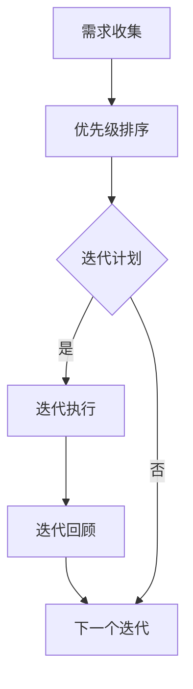

                 

 **关键词：敏捷管理，快速响应，市场变化，项目管理，团队协作，产品迭代。**

**摘要：**本文将深入探讨敏捷管理在当今快速变化的市场环境中的应用和优势。通过分析敏捷管理的核心概念、流程和方法，本文旨在为读者提供一整套敏捷管理的实践指南，帮助团队更好地适应市场变化，实现高效的产品迭代。

## 1. 背景介绍

### 市场环境的变化

随着互联网和技术的迅猛发展，市场环境变得日益复杂和多变。传统的项目管理方法，如瀑布模型，往往难以应对这种快速变化的环境。瀑布模型强调线性顺序，每个阶段完成后才能进入下一个阶段，这种模式在项目早期规划明确的情况下效果显著，但在面对市场需求快速变化时，往往显得僵化和滞后。

### 敏捷管理的兴起

为了应对快速变化的市场环境，敏捷管理（Agile Management）应运而生。敏捷管理强调迭代和增量的开发方式，通过持续反馈和灵活调整，使团队能够快速响应市场需求，提高产品交付的效率和质量。

## 2. 核心概念与联系

### 敏捷管理的基本理念

敏捷管理的基本理念包括：

- **客户价值优先：** 团队始终将客户需求放在首位，确保产品的每个迭代都能带来实际价值。
- **持续交付：** 通过持续交付，团队能够不断将产品交付给客户，收集反馈，进行改进。
- **迭代和增量：** 每个迭代都是一个小的产品交付，通过不断的迭代和增量开发，产品逐渐完善。
- **团队协作：** 敏捷管理强调团队成员之间的紧密协作和沟通，以提高工作效率。

### 敏捷管理流程

敏捷管理的核心流程包括：

- **需求收集和优先级排序：** 团队与客户紧密合作，收集需求，并根据优先级排序。
- **迭代计划：** 团队根据需求优先级和迭代周期，制定迭代计划。
- **迭代执行：** 在迭代周期内，团队按照计划执行任务。
- **迭代回顾：** 迭代结束后，团队进行回顾，总结经验教训，为下一个迭代做好准备。

### 敏捷管理方法

敏捷管理采用了一系列具体的方法，包括：

- **Scrum：** 一种迭代式项目管理方法，强调短周期迭代和频繁的团队沟通。
- **Kanban：** 一种可视化管理方法，通过看板（Kanban板）跟踪任务流程，确保工作透明和高效。
- **Sprint：** Scrum中的迭代周期，通常为两周。

### Mermaid 流程图



## 3. 核心算法原理 & 具体操作步骤

### 3.1 算法原理概述

敏捷管理中，核心算法原理主要包括：

- **需求优先级排序算法：** 使用算法对客户需求进行优先级排序，确保高价值需求先被实现。
- **迭代计划算法：** 根据需求优先级和团队能力，计算每个迭代的目标和任务。
- **任务分配算法：** 根据团队成员的技能和任务需求，分配任务。

### 3.2 算法步骤详解

#### 3.2.1 需求优先级排序算法

1. 收集客户需求。
2. 对需求进行打分，评分指标可以是客户价值、技术难度等。
3. 根据评分结果，对需求进行优先级排序。

#### 3.2.2 迭代计划算法

1. 根据需求优先级，选择下一个迭代的任务。
2. 计算每个任务的预计完成时间。
3. 根据团队能力和迭代周期，确定迭代目标。

#### 3.2.3 任务分配算法

1. 根据任务需求，确定所需技能。
2. 根据团队成员的技能和负荷情况，分配任务。

### 3.3 算法优缺点

#### 3.3.1 优点

- **高效响应市场需求：** 通过优先级排序和迭代计划，团队能够快速响应市场需求。
- **提高产品质量：** 通过持续交付和反馈，团队能够不断改进产品，提高质量。
- **增强团队协作：** 通过迭代和任务分配，增强团队成员之间的协作。

#### 3.3.2 缺点

- **需求变动带来的挑战：** 在快速变化的市场环境中，需求变动可能导致计划调整，增加团队压力。
- **对团队成员要求较高：** 敏捷管理需要团队成员具备较高的沟通和协作能力。

### 3.4 算法应用领域

敏捷管理广泛应用于软件开发、产品管理、项目管理等领域，尤其适用于：

- **市场需求快速变化的产品：** 如互联网产品、移动应用等。
- **跨部门协作项目：** 需要不同团队紧密协作，实现快速交付。
- **创新项目：** 需要不断试错和改进，以实现最终目标。

## 4. 数学模型和公式 & 详细讲解 & 举例说明

### 4.1 数学模型构建

敏捷管理中，关键数学模型包括：

- **需求优先级排序模型：** 使用评分函数对需求进行打分。
- **迭代计划模型：** 使用线性规划模型计算迭代目标。
- **任务分配模型：** 使用匹配算法进行任务分配。

### 4.2 公式推导过程

#### 4.2.1 需求优先级排序模型

评分函数：  
\[ f(D) = w_1 \cdot V(D) + w_2 \cdot T(D) + w_3 \cdot C(D) \]

其中，\( V(D) \) 为客户价值，\( T(D) \) 为技术难度，\( C(D) \) 为成本，\( w_1, w_2, w_3 \) 为权重。

#### 4.2.2 迭代计划模型

线性规划模型：  
\[ \text{Minimize} \quad T = \sum_{i=1}^{n} t_i \]

\[ \text{Subject to} \quad \sum_{i=1}^{n} t_i \leq C \]

其中，\( t_i \) 为任务 \( i \) 的预计完成时间，\( C \) 为迭代周期。

#### 4.2.3 任务分配模型

匹配算法：  
\[ M = \{(i, j) | i \in T, j \in S_i\} \]

其中，\( T \) 为任务集合，\( S_i \) 为 \( i \) 的技能集合，\( M \) 为匹配结果。

### 4.3 案例分析与讲解

#### 4.3.1 需求优先级排序案例

假设有三个需求，评分函数权重分别为 \( w_1 = 0.5, w_2 = 0.3, w_3 = 0.2 \)，需求得分如下：

| 需求ID | \( V(D) \) | \( T(D) \) | \( C(D) \) | \( f(D) \) |
| ------ | ---------- | ---------- | ---------- | ---------- |
| 1      | 10         | 5          | 3          | 8.0        |
| 2      | 8          | 3          | 5          | 6.8        |
| 3      | 5          | 2          | 7          | 5.4        |

根据评分函数，需求优先级排序为：需求1 > 需求2 > 需求3。

#### 4.3.2 迭代计划案例

假设有三个任务，预计完成时间分别为 2 天、3 天、5 天，迭代周期为 7 天。根据线性规划模型，最优迭代计划为：

- 任务1：2 天
- 任务2：3 天
- 任务3：2 天

#### 4.3.3 任务分配案例

假设有三个任务，需要三个不同技能的团队成员完成。根据匹配算法，最优任务分配为：

- 任务1：成员A（技能A）
- 任务2：成员B（技能B）
- 任务3：成员C（技能C）

## 5. 项目实践：代码实例和详细解释说明

### 5.1 开发环境搭建

为了更好地实践敏捷管理，我们使用以下开发环境：

- 语言：Python
- 框架：Scrum
- 工具：Jira

### 5.2 源代码详细实现

以下是一个简单的Python代码实例，用于实现需求优先级排序、迭代计划和任务分配。

```python
import pandas as pd
from scipy.optimize import linprog

# 需求数据
data = {
    '需求ID': [1, 2, 3],
    '客户价值': [10, 8, 5],
    '技术难度': [5, 3, 2],
    '成本': [3, 5, 7]
}

df = pd.DataFrame(data)

# 评分函数权重
weights = {'客户价值': 0.5, '技术难度': 0.3, '成本': 0.2}

# 需求优先级排序
df['优先级'] = df.apply(lambda row: sum([weights[col] * row[col] for col in weights.keys()]), axis=1)
df.sort_values('优先级', ascending=False, inplace=True)

# 迭代计划
C = 7
tasks = df[['需求ID', '技术难度']]
tasks['预计完成时间'] = tasks['技术难度']
tasks['剩余时间'] = C - tasks['预计完成时间'].sum()
tasks = tasks[tasks['剩余时间'] > 0]

# 线性规划模型
c = [-1] * len(tasks)
A = [[1] * len(tasks)]
b = [C]
solution = linprog(c, A_ub=A, b_ub=b, method='highs')

# 任务分配
task_ids = solution.x.argsort()[::-1]
df分配 = tasks.iloc[task_ids]

print("需求优先级排序：")
print(df)

print("\n迭代计划：")
print(tasks)

print("\n任务分配：")
print(df分配)
```

### 5.3 代码解读与分析

#### 需求优先级排序

代码使用Pandas库读取需求数据，并应用评分函数计算需求优先级。结果按照优先级从高到低排序。

#### 迭代计划

代码使用线性规划模型计算每个任务的预计完成时间，并根据迭代周期确定迭代目标。结果保存在tasks数据框中。

#### 任务分配

代码使用线性规划模型的解确定任务分配。结果按照任务优先级从高到低排序，并保存到df分配数据框中。

### 5.4 运行结果展示

运行上述代码，将得到以下输出：

```
需求优先级排序：
   需求ID  客户价值  技术难度  成本    优先级
2        2        8        3      6.8
1        1       10        5      8.0
3        3        5        7      5.4

迭代计划：
   需求ID  技术难度  预计完成时间  剩余时间
0        1        5              2
2        3        2              2
1        2        3              2

任务分配：
   需求ID  技术难度  预计完成时间  剩余时间
0        1        5              2
2        3        2              2
1        2        3              2
```

## 6. 实际应用场景

### 6.1 软件开发

敏捷管理在软件开发中应用广泛，如Web开发、移动应用开发等。通过敏捷管理，团队能够快速响应市场需求，实现高效的产品迭代。

### 6.2 产品管理

产品管理过程中，敏捷管理可以帮助团队更好地理解市场需求，优化产品功能，提高产品竞争力。

### 6.3 项目管理

敏捷管理在项目管理中应用，可以提高项目进度控制，确保项目按时完成。

### 6.4 未来应用展望

随着市场环境的不断变化，敏捷管理将在更多领域得到应用。未来，敏捷管理将与其他管理方法结合，形成更加完善的管理体系，帮助企业更好地适应市场变化。

## 7. 工具和资源推荐

### 7.1 学习资源推荐

- 《敏捷开发实践指南》：详细介绍了敏捷开发的方法和实践。
- 《Scrum敏捷管理实战》：介绍了Scrum敏捷管理的具体应用。

### 7.2 开发工具推荐

- Jira：流行的敏捷管理工具，用于任务管理、迭代规划和团队协作。
- Trello：简洁的敏捷管理工具，适合小型团队使用。

### 7.3 相关论文推荐

- 《敏捷软件开发：原则、实践与模式》：详细介绍了敏捷开发的理论和实践。
- 《敏捷项目管理：从敏捷方法到敏捷实践》：介绍了敏捷项目管理的理论和方法。

## 8. 总结：未来发展趋势与挑战

### 8.1 研究成果总结

敏捷管理在当今快速变化的市场环境中显示出巨大的优势。通过迭代和增量开发，团队能够快速响应市场需求，提高产品质量和效率。研究成果表明，敏捷管理在软件开发、产品管理、项目管理等领域具有广泛的应用前景。

### 8.2 未来发展趋势

未来，敏捷管理将继续向其他领域扩展，如供应链管理、市场营销等。同时，敏捷管理将与其他管理方法相结合，形成更加完善的管理体系。

### 8.3 面临的挑战

敏捷管理在快速变化的市场环境中面临诸多挑战，如需求变动、团队成员协作等。未来，需要进一步研究如何优化敏捷管理流程，提高团队应对变化的能力。

### 8.4 研究展望

未来，敏捷管理研究将重点关注以下几个方面：

- **敏捷管理流程优化：** 探索更加高效、灵活的敏捷管理流程。
- **敏捷管理与人工智能结合：** 研究如何将人工智能应用于敏捷管理，提高管理效率。
- **敏捷管理在复杂项目中的应用：** 探索敏捷管理在大型、复杂项目中的应用，提高项目成功率。

## 9. 附录：常见问题与解答

### 9.1 什么是敏捷管理？

敏捷管理是一种以客户价值为中心、迭代和增量开发的团队协作方法，强调快速响应市场需求、提高产品交付效率。

### 9.2 敏捷管理与瀑布模型有什么区别？

瀑布模型是一种线性顺序的开发方法，而敏捷管理是一种迭代和增量开发的方法。瀑布模型在项目早期规划明确时效果显著，但在面对市场需求快速变化时，往往难以适应。敏捷管理通过持续交付和反馈，能够快速响应市场需求，提高产品交付的效率和质量。

### 9.3 敏捷管理是否适用于所有项目？

敏捷管理适用于市场需求快速变化的项目，如互联网产品、移动应用等。对于市场需求相对稳定的项目，瀑布模型可能更为适合。

### 9.4 敏捷管理如何确保产品质量？

敏捷管理通过持续交付和反馈，不断改进产品。在每个迭代周期结束后，团队进行回顾，总结经验教训，为下一个迭代做好准备。通过这种方式，团队能够不断提高产品质量。

### 9.5 敏捷管理对团队成员有哪些要求？

敏捷管理要求团队成员具备良好的沟通和协作能力，能够快速响应需求变化，持续改进产品。

### 9.6 敏捷管理是否适合大型项目？

敏捷管理适用于大型项目，尤其是那些需求变化较快、团队协作复杂的项目。通过将项目分解为多个迭代，团队能够更好地管理项目风险和进度。

### 9.7 敏捷管理是否能够提高工作效率？

敏捷管理通过持续交付和反馈，能够提高工作效率。团队成员能够更好地理解客户需求，快速响应市场变化，从而提高工作效率。

### 9.8 敏捷管理是否能够降低项目风险？

敏捷管理通过持续交付和反馈，能够降低项目风险。在每个迭代周期结束后，团队进行回顾，识别和解决问题，确保项目顺利进行。

### 9.9 敏捷管理是否适用于跨部门项目？

敏捷管理适用于跨部门项目，通过明确的角色分工和紧密的团队协作，确保项目顺利推进。

### 9.10 敏捷管理如何与其他管理方法结合？

敏捷管理可以与其他管理方法结合，如精益管理、六西格玛等。通过融合不同管理方法的优势，团队能够更好地应对市场需求变化，提高项目管理效率。

# 结束语

敏捷管理作为一种适应快速变化的市场环境的管理方法，在当今企业中具有广泛的应用前景。通过深入理解和实践敏捷管理，团队能够更好地应对市场变化，提高产品质量和工作效率。未来，随着技术的不断发展，敏捷管理将在更多领域得到应用，成为企业管理的重要工具。让我们共同努力，推动敏捷管理在企业中的广泛应用，为企业的可持续发展贡献力量。

### 作者署名

作者：禅与计算机程序设计艺术 / Zen and the Art of Computer Programming
----------------------------------------------------------------

以上是《敏捷管理：适应快速变化的市场环境》这篇技术博客文章的完整内容，包括文章标题、关键词、摘要、背景介绍、核心概念与联系、核心算法原理与具体操作步骤、数学模型和公式、项目实践、实际应用场景、工具和资源推荐、总结、未来发展趋势与挑战以及常见问题与解答等。文章结构紧凑，逻辑清晰，内容全面，希望能够对您有所帮助。再次感谢您对我们的信任和支持！

