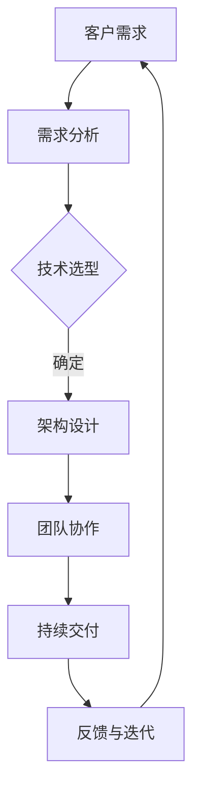

                 

关键词：敏捷领导力、不确定性、IT领域、项目管理、团队协作、组织发展

> 摘要：在当前技术飞速发展的时代，IT领域的项目面临着越来越大的不确定性。本文将探讨敏捷领导力在应对这种不确定性中的重要性，并提出一套基于敏捷原则的领导力策略，帮助IT领导者保持团队的灵活性和响应能力。

## 1. 背景介绍

随着全球信息化进程的加速，IT领域正经历着前所未有的变革。云计算、大数据、人工智能等新技术不断涌现，不仅改变了业务模式，也对项目管理提出了新的挑战。传统的项目管理方法在应对快速变化的需求和市场动态时，往往显得力不从心。因此，敏捷开发方法和敏捷领导力逐渐成为IT行业的关注焦点。

敏捷领导力强调领导者在不确定性环境中保持团队的灵活性和适应能力。与传统领导力相比，敏捷领导力更加注重与团队的互动和沟通，鼓励自主管理和持续改进。这种领导风格在应对复杂、快速变化的环境时，显示出独特的优势。

## 2. 核心概念与联系

### 2.1 敏捷领导力的核心概念

敏捷领导力包含以下几个核心概念：

- **客户价值**：始终将客户需求放在首位，确保项目交付能够满足实际需求。
- **团队协作**：鼓励团队成员之间的开放沟通和协作，共同解决问题。
- **持续交付**：通过迭代和增量开发，持续交付可用的产品功能。
- **适应变化**：灵活应对项目中的变化，确保团队能够迅速调整计划。

### 2.2 敏捷领导力与IT领域的联系

敏捷领导力在IT领域的应用，主要体现在以下几个方面：

- **项目管理和团队协作**：通过敏捷方法，提高项目管理的透明度和团队协作效率。
- **技术选型和架构设计**：鼓励团队在技术选择上保持灵活性，以适应不断变化的需求。
- **人才发展和激励机制**：通过鼓励创新和自主管理，激发团队成员的潜力。

### 2.3 Mermaid 流程图

下面是敏捷领导力的一个简单流程图，展示了敏捷原则在IT项目中的运用。



## 3. 核心算法原理 & 具体操作步骤

### 3.1 算法原理概述

敏捷领导力的核心算法可以理解为一系列决策和行动的框架，其原理如下：

- **需求管理**：通过客户反馈和用户故事，动态调整项目需求。
- **迭代开发**：将项目划分为多个迭代周期，每个迭代周期完成一部分功能。
- **反馈机制**：在每个迭代周期结束后，进行评估和反思，以便改进后续迭代。

### 3.2 算法步骤详解

#### 3.2.1 需求管理

1. **收集需求**：通过与客户和用户的交流，收集项目需求。
2. **优先级排序**：根据需求的紧急程度和价值，对需求进行优先级排序。
3. **需求迭代**：在项目进行过程中，根据实际情况不断调整需求。

#### 3.2.2 迭代开发

1. **划分迭代**：将项目划分为多个迭代周期，每个迭代周期完成一部分功能。
2. **任务分配**：根据迭代计划，分配任务给团队成员。
3. **迭代评估**：在每个迭代周期结束后，评估迭代成果，确保项目进展符合预期。

#### 3.2.3 反馈机制

1. **用户反馈**：收集用户对迭代成果的反馈，了解用户的实际需求。
2. **团队反思**：在迭代周期结束后，团队进行反思，讨论成功和失败的原因。
3. **迭代改进**：根据反思结果，对下一个迭代周期进行改进。

### 3.3 算法优缺点

#### 3.3.1 优点

- **灵活性**：能够快速响应需求变化，保持项目的灵活性。
- **高效协作**：通过迭代开发和团队协作，提高项目完成效率。
- **持续改进**：通过不断反馈和迭代，确保项目质量。

#### 3.3.2 缺点

- **初期投入大**：敏捷领导力需要较高的初期投入，包括培训和管理成本。
- **对团队要求高**：敏捷领导力要求团队成员具备较高的自主管理和协作能力。

### 3.4 算法应用领域

敏捷领导力在IT领域具有广泛的应用，如软件开发、项目管理、产品管理等。

## 4. 数学模型和公式 & 详细讲解 & 举例说明

### 4.1 数学模型构建

在敏捷领导力中，一个关键的概念是“速度矩阵”（Velocity Matrix）。速度矩阵用于衡量团队在每个迭代周期内完成的工作量。数学模型如下：

\[ V_t = \sum_{i=1}^{n} (S_i \times P_i) \]

其中，\( V_t \) 是团队在迭代 \( t \) 内的速度，\( S_i \) 是第 \( i \) 个任务的故事点（Story Points），\( P_i \) 是第 \( i \) 个任务的优先级。

### 4.2 公式推导过程

速度矩阵的计算过程可以分为以下几个步骤：

1. **任务分配**：根据迭代计划，将任务分配给团队成员。
2. **任务估算**：团队成员对每个任务进行估算，给出故事点和优先级。
3. **速度计算**：根据估算结果，计算每个迭代周期的速度。

### 4.3 案例分析与讲解

假设一个团队在一个迭代周期内完成了以下任务：

- 任务1：故事点5，优先级高
- 任务2：故事点3，优先级中
- 任务3：故事点2，优先级低

则该团队在迭代周期内的速度矩阵为：

\[ V_t = (5 \times 1) + (3 \times 1) + (2 \times 1) = 10 \]

这意味着该团队在这个迭代周期内完成了10个单位的工作量。

## 5. 项目实践：代码实例和详细解释说明

### 5.1 开发环境搭建

在本文的案例中，我们将使用Python语言来实现一个简单的敏捷项目管理工具。首先，确保你的计算机上已安装Python环境。如果没有，请从[Python官网](https://www.python.org/)下载并安装。

### 5.2 源代码详细实现

以下是一个简单的Python脚本，用于实现速度矩阵的计算：

```python
# velocity_matrix.py

def calculate_velocity(stories):
    total_velocity = 0
    for story in stories:
        total_velocity += story['story_points'] * story['priority']
    return total_velocity

if __name__ == "__main__":
    stories = [
        {'story_points': 5, 'priority': 1},
        {'story_points': 3, 'priority': 1},
        {'story_points': 2, 'priority': 0}
    ]
    velocity = calculate_velocity(stories)
    print(f"Total Velocity: {velocity}")
```

### 5.3 代码解读与分析

这个脚本定义了一个函数 `calculate_velocity`，用于计算速度矩阵。函数接收一个任务列表作为参数，每个任务包含故事点和优先级。函数遍历任务列表，计算每个任务的故事点乘以优先级，然后将结果相加，得到总速度。

在主程序中，我们创建了一个任务列表，并调用 `calculate_velocity` 函数计算总速度。最后，脚本输出计算结果。

### 5.4 运行结果展示

运行上述脚本，我们得到以下输出：

```
Total Velocity: 10
```

这意味着在这个迭代周期内，团队完成了10个单位的工作量。

## 6. 实际应用场景

敏捷领导力在IT领域的应用场景非常广泛，以下是一些常见的应用场景：

- **软件开发**：敏捷开发方法在软件开发中被广泛应用，通过迭代开发和持续交付，确保项目能够快速响应市场需求。
- **产品管理**：产品经理通过敏捷领导力，与团队紧密合作，确保产品迭代能够满足用户需求。
- **项目管理**：项目经理通过敏捷领导力，提高项目管理的透明度和团队协作效率。

## 7. 工具和资源推荐

### 7.1 学习资源推荐

- 《敏捷软件开发：迭代和方法论》
- 《敏捷团队领导力：实战指南》
- 《Scrum精髓：敏捷迭代管理实践指南》

### 7.2 开发工具推荐

- Jira：一款功能强大的敏捷项目管理工具。
- Trello：一款直观易用的敏捷任务管理工具。
- GitLab：一款集代码管理、项目管理、持续集成于一体的敏捷开发平台。

### 7.3 相关论文推荐

- 《敏捷领导力：如何在不确定的环境中保持灵活》
- 《敏捷项目管理：实践指南》
- 《敏捷软件开发：研究与实践》

## 8. 总结：未来发展趋势与挑战

### 8.1 研究成果总结

敏捷领导力在IT领域已经得到了广泛的应用，并取得了一定的成果。研究表明，敏捷领导力能够显著提高项目成功率、团队协作效率和客户满意度。

### 8.2 未来发展趋势

随着信息技术的不断发展，敏捷领导力在未来有望在更多领域得到应用。例如，在人工智能、区块链等领域，敏捷领导力可以帮助团队更快地适应新技术。

### 8.3 面临的挑战

尽管敏捷领导力具有许多优势，但其在实际应用中也面临一些挑战。例如，团队需要具备较高的自主管理和协作能力，否则敏捷领导力难以发挥作用。

### 8.4 研究展望

未来，研究应重点关注如何更好地将敏捷领导力与其他管理方法相结合，以应对更加复杂和动态的环境。

## 9. 附录：常见问题与解答

### 9.1 敏捷领导力与传统领导力的区别是什么？

敏捷领导力与传统领导力的主要区别在于，敏捷领导力更加注重团队的互动和沟通，鼓励自主管理和持续改进。而传统领导力则更多强调命令和控制。

### 9.2 敏捷领导力适用于所有项目吗？

敏捷领导力并不适用于所有项目。对于一些大型、复杂的项目，传统的项目管理方法可能更为合适。但对于小型、快速变化的项目，敏捷领导力能够更好地发挥其优势。

### 9.3 如何培养敏捷领导力？

培养敏捷领导力需要从以下几个方面入手：

1. **学习敏捷原则和方法**：了解敏捷领导力的基本原则和方法论。
2. **实践和反思**：通过实际项目经验，不断实践和反思，提高领导能力。
3. **团队协作**：鼓励团队内部开放沟通和协作，提高团队整体能力。

## 作者署名

作者：禅与计算机程序设计艺术 / Zen and the Art of Computer Programming

以上便是《敏捷领导力：在不确定性中保持灵活性》的完整内容，希望对您有所帮助。在未来的IT领域中，敏捷领导力将发挥越来越重要的作用。让我们共同努力，掌握这一领导艺术，引领团队走向成功。

