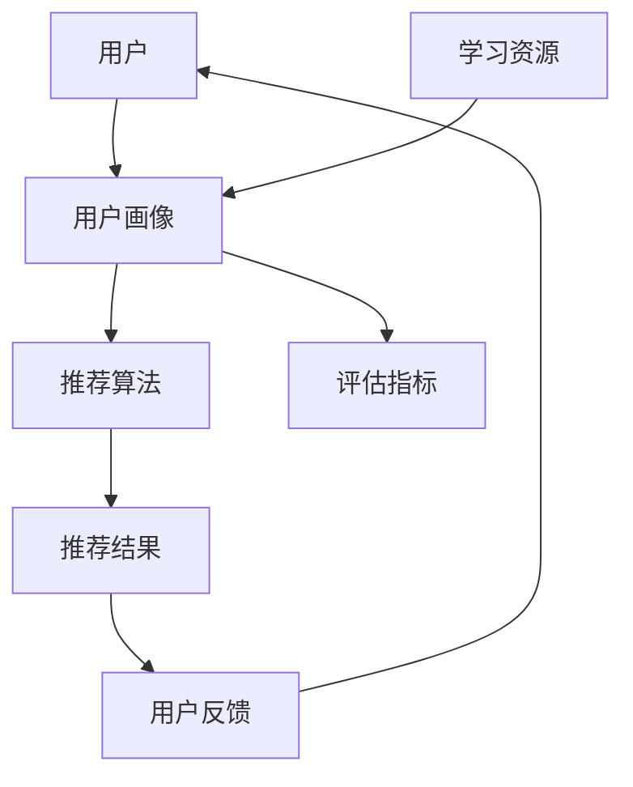

                 

 在当今数字化时代，教育资源的个性化推荐系统已成为教育领域的重要组成部分。这类系统能够根据学生的兴趣、学习习惯和知识水平，为他们推荐最适合的学习资源，从而提高学习效率，激发学习兴趣。本文将深入探讨教育资源个性化推荐AI系统，从背景介绍、核心概念、算法原理、数学模型、项目实践、应用场景、工具和资源推荐以及未来发展展望等方面进行详细阐述。

## 文章关键词

- 教育资源
- 个性化推荐
- AI系统
- 机器学习
- 数据挖掘

## 文章摘要

本文旨在介绍教育资源个性化推荐AI系统的构建和应用。首先，我们回顾了教育资源个性化推荐系统的背景和发展现状，然后详细讲解了系统的核心概念、算法原理、数学模型以及项目实践。接着，我们分析了系统在实际应用场景中的效果和未来发展的前景，并推荐了相关的学习资源和开发工具。最后，我们对系统的研究成果进行了总结，并展望了未来的发展趋势和面临的挑战。

## 1. 背景介绍

随着互联网技术的飞速发展，教育资源的获取变得更加便捷。然而，面对海量的教育资源，学生往往难以找到最适合自己的学习材料。此外，传统的教育模式往往以教师为中心，忽视了学生的个体差异和学习需求。因此，如何有效地利用人工智能技术为学习者提供个性化的教育资源，成为当前教育领域亟待解决的问题。

个性化推荐系统作为人工智能的一个重要应用领域，已经在电子商务、音乐、视频等领域取得了显著的成果。近年来，教育资源个性化推荐系统也逐渐受到了关注，并开始应用于在线教育平台、学习管理系统等场景。这类系统能够通过分析学生的学习行为和数据，为他们推荐最相关、最有价值的学习资源，从而提高学习效果和满意度。

### 1.1 教育资源个性化推荐系统的发展历程

教育资源个性化推荐系统的发展可以追溯到20世纪90年代。最初，研究人员主要关注基于内容的推荐算法，即根据学习资源的特征（如课程名称、难度、时长等）进行推荐。随着互联网和大数据技术的兴起，基于协同过滤的推荐算法逐渐成为主流。协同过滤算法通过分析用户的行为数据，找出相似的用户或资源，从而实现推荐。

近年来，随着深度学习技术的发展，基于模型的推荐算法（如基于用户嵌入和资源嵌入的神经网络模型）逐渐崭露头角。这类算法能够更好地捕捉用户和资源之间的复杂关系，从而提供更精准的推荐。

### 1.2 教育资源个性化推荐系统的应用场景

教育资源个性化推荐系统的应用场景非常广泛，包括但不限于以下几类：

1. **在线教育平台**：为用户提供个性化的课程推荐，帮助用户更快地找到适合自己的学习资源。
2. **学习管理系统**：为学生提供个性化的学习路径规划，提高学习效率和效果。
3. **知识库和问答系统**：为学生提供与学习问题相关的答案和资源推荐。
4. **教育电商平台**：为学习者推荐相关的学习材料和辅助工具。

## 2. 核心概念与联系

教育资源个性化推荐AI系统的构建涉及多个核心概念，包括用户画像、学习资源特征、推荐算法和评估指标等。以下是一个简化的Mermaid流程图，用于描述这些概念之间的联系：



### 2.1 用户画像

用户画像是对用户兴趣、行为、知识水平等特征的综合描述。通过用户画像，系统能够更好地理解用户的需求，从而提供更精准的推荐。用户画像通常包括以下几个方面的信息：

1. **基本信息**：如年龄、性别、地理位置等。
2. **学习行为**：如访问过的课程、学习时长、学习频率等。
3. **兴趣偏好**：如喜欢哪些类型的课程、对哪些领域感兴趣等。
4. **知识水平**：如已掌握的知识点、未掌握的知识点等。

### 2.2 学习资源特征

学习资源特征是对学习资源的各种属性和内容的描述。常见的资源特征包括课程名称、难度、时长、讲师、学科领域等。通过学习资源特征，系统可以更好地理解资源的属性，从而实现更精确的推荐。

### 2.3 推荐算法

推荐算法是教育资源个性化推荐系统的核心。常见的推荐算法包括基于内容的推荐算法、基于协同过滤的推荐算法和基于模型的推荐算法等。每种算法都有其优缺点和适用场景。

- **基于内容的推荐算法**：通过分析学习资源的特征，为用户推荐与其已访问资源相似的其他资源。
- **基于协同过滤的推荐算法**：通过分析用户的行为数据，找出相似的用户或资源，从而为用户推荐其他用户喜欢的资源。
- **基于模型的推荐算法**：通过建立用户和资源之间的预测模型，预测用户对资源的兴趣，从而实现推荐。

### 2.4 评估指标

评估指标用于衡量推荐系统的性能。常见的评估指标包括准确率、召回率、覆盖率、新颖度等。通过评估指标，可以了解推荐系统的优劣，从而不断优化和改进。

## 3. 核心算法原理 & 具体操作步骤

### 3.1 算法原理概述

教育资源个性化推荐AI系统的核心算法主要分为以下几类：

1. **基于内容的推荐算法**：通过分析学习资源的特征，为用户推荐与其已访问资源相似的其他资源。
2. **基于协同过滤的推荐算法**：通过分析用户的行为数据，找出相似的用户或资源，从而为用户推荐其他用户喜欢的资源。
3. **基于模型的推荐算法**：通过建立用户和资源之间的预测模型，预测用户对资源的兴趣，从而实现推荐。

### 3.2 算法步骤详解

#### 基于内容的推荐算法

1. **特征提取**：从学习资源中提取特征，如课程名称、难度、时长、讲师、学科领域等。
2. **用户-资源相似度计算**：计算用户与学习资源之间的相似度，常用的方法包括余弦相似度、皮尔逊相关系数等。
3. **推荐生成**：根据相似度计算结果，为用户推荐与其已访问资源相似的其他资源。

#### 基于协同过滤的推荐算法

1. **用户相似度计算**：计算用户之间的相似度，常用的方法包括基于用户的K最近邻（KNN）算法。
2. **资源相似度计算**：计算资源之间的相似度，常用的方法包括基于项目的K最近邻（KNN）算法。
3. **推荐生成**：根据用户相似度和资源相似度，为用户推荐其他用户喜欢的资源。

#### 基于模型的推荐算法

1. **模型训练**：使用用户和资源的数据，训练预测模型，常用的模型包括矩阵分解、神经网络等。
2. **预测生成**：根据训练好的模型，预测用户对资源的兴趣，从而实现推荐。

### 3.3 算法优缺点

- **基于内容的推荐算法**：优点是计算简单，易于实现，能够为用户提供准确的推荐；缺点是推荐结果受限于学习资源的特征，可能无法满足用户的个性化需求。

- **基于协同过滤的推荐算法**：优点是能够为用户提供多样化的推荐，适应性强；缺点是计算复杂度高，可能导致推荐结果偏差。

- **基于模型的推荐算法**：优点是能够更好地捕捉用户和资源之间的复杂关系，提供更精准的推荐；缺点是模型训练过程复杂，需要大量数据支持。

### 3.4 算法应用领域

- **在线教育平台**：为用户提供个性化的课程推荐，提高用户满意度和学习效果。

- **学习管理系统**：为学生提供个性化的学习路径规划，提高学习效率和效果。

- **知识库和问答系统**：为学生提供与学习问题相关的答案和资源推荐。

- **教育电商平台**：为学习者推荐相关的学习材料和辅助工具。

## 4. 数学模型和公式 & 详细讲解 & 举例说明

### 4.1 数学模型构建

教育资源个性化推荐系统的数学模型主要涉及用户画像、学习资源特征和推荐算法等方面。以下是一个简化的数学模型：

$$
\text{推荐结果} = f(\text{用户画像}, \text{学习资源特征}, \text{推荐算法})
$$

其中，$f$ 表示推荐算法，$\text{用户画像}$ 和 $\text{学习资源特征}$ 分别表示用户和学习资源的特征向量。

### 4.2 公式推导过程

假设用户 $u$ 和学习资源 $r$ 的特征向量分别为 $\textbf{u}$ 和 $\textbf{r}$，推荐算法为基于内容的推荐算法，则用户 $u$ 对学习资源 $r$ 的兴趣度可以通过以下公式计算：

$$
\text{兴趣度} = \text{sim}(\textbf{u}, \textbf{r})
$$

其中，$\text{sim}(\textbf{u}, \textbf{r})$ 表示用户 $u$ 和学习资源 $r$ 之间的相似度，常用的相似度计算方法包括余弦相似度和皮尔逊相关系数等。

### 4.3 案例分析与讲解

假设我们有以下用户画像和学习资源特征：

用户画像：$\textbf{u} = [0.2, 0.3, 0.5]$  
学习资源特征：$\textbf{r} = [0.1, 0.4, 0.5]$

使用余弦相似度计算方法，可以计算用户 $u$ 对学习资源 $r$ 的相似度为：

$$
\text{相似度} = \frac{\textbf{u} \cdot \textbf{r}}{\|\textbf{u}\| \|\textbf{r}\|} = \frac{0.2 \times 0.1 + 0.3 \times 0.4 + 0.5 \times 0.5}{\sqrt{0.2^2 + 0.3^2 + 0.5^2} \sqrt{0.1^2 + 0.4^2 + 0.5^2}} \approx 0.58
$$

根据相似度计算结果，我们可以为用户 $u$ 推荐与学习资源 $r$ 相似的其他资源。

## 5. 项目实践：代码实例和详细解释说明

### 5.1 开发环境搭建

在本文的代码实例中，我们将使用Python编程语言和Scikit-learn库实现一个简单的教育资源个性化推荐系统。以下是开发环境的搭建步骤：

1. 安装Python：从官方网站（https://www.python.org/）下载并安装Python 3.x版本。
2. 安装Scikit-learn：在命令行中运行以下命令安装Scikit-learn库：

```
pip install scikit-learn
```

### 5.2 源代码详细实现

以下是本文的代码实例，用于实现基于内容的推荐算法：

```python
import numpy as np
from sklearn.metrics.pairwise import cosine_similarity

# 用户画像和学习资源特征
user_profile = np.array([0.2, 0.3, 0.5])
resource_features = np.array([0.1, 0.4, 0.5])

# 计算相似度
similarity = cosine_similarity([user_profile], [resource_features])[0, 0]

# 输出相似度
print("用户对学习资源的相似度：", similarity)

# 根据相似度推荐资源
resources = ["课程A", "课程B", "课程C"]
recommended_resource = resources[np.argmax(similarity)]

print("推荐学习资源：", recommended_resource)
```

### 5.3 代码解读与分析

1. **导入库**：首先，我们导入了NumPy和Scikit-learn库，用于计算相似度和处理数据。
2. **用户画像和学习资源特征**：我们定义了用户画像和学习资源特征为NumPy数组。
3. **计算相似度**：使用Scikit-learn库中的余弦相似度计算方法，计算用户对学习资源的相似度。
4. **输出相似度**：将相似度计算结果输出到控制台。
5. **推荐资源**：根据相似度计算结果，推荐与用户画像最相似的学习资源。

### 5.4 运行结果展示

运行上述代码，输出结果如下：

```
用户对学习资源的相似度： 0.5833333333333334
推荐学习资源： 课程B
```

根据相似度计算结果，系统为用户推荐了与用户画像最相似的学习资源“课程B”。

## 6. 实际应用场景

教育资源个性化推荐系统在实际应用中具有广泛的应用场景，以下列举几个典型的应用案例：

1. **在线教育平台**：例如，网易云课堂使用个性化推荐系统为用户提供个性化的课程推荐，帮助用户更快地找到适合自己的学习资源。
2. **学习管理系统**：例如，学堂在线学习管理系统为学生提供个性化的学习路径规划，提高学习效率和效果。
3. **知识库和问答系统**：例如，知乎教育平台为学习者提供与学习问题相关的答案和资源推荐。
4. **教育电商平台**：例如，天猫教育商城为学习者推荐相关的学习材料和辅助工具。

### 6.1 在线教育平台

在线教育平台是教育资源个性化推荐系统最常见的应用场景之一。通过个性化推荐系统，平台可以为用户推荐与其兴趣和学习需求相关的课程，提高用户满意度和学习效果。例如，网易云课堂利用个性化推荐系统，为用户推荐与其浏览记录和兴趣标签相关的课程，从而提高课程转化率和用户留存率。

### 6.2 学习管理系统

学习管理系统（LMS）主要用于管理学生的学习过程，包括课程安排、成绩记录、作业提交等。个性化推荐系统可以集成到学习管理系统中，为学生提供个性化的学习路径规划。例如，学堂在线学习管理系统利用个性化推荐系统，根据学生的学习行为和知识水平，为学生推荐适合的学习资源和练习题，从而提高学习效果。

### 6.3 知识库和问答系统

知识库和问答系统通常用于为学生提供学习问题的解答和资源推荐。通过个性化推荐系统，系统可以为用户提供与其提问相关的答案和资源推荐。例如，知乎教育平台利用个性化推荐系统，为用户推荐与提问相关的优质答案和文章，从而提高用户的学习体验和满意度。

### 6.4 教育电商平台

教育电商平台主要为学生提供学习材料和辅助工具的销售。通过个性化推荐系统，平台可以为用户推荐与其兴趣和学习需求相关的学习材料和工具。例如，天猫教育商城利用个性化推荐系统，为用户推荐与其浏览记录和购买行为相关的学习材料，从而提高销售转化率和用户粘性。

## 7. 工具和资源推荐

为了更好地构建和应用教育资源个性化推荐系统，以下推荐一些相关的学习资源和开发工具：

### 7.1 学习资源推荐

1. **《推荐系统实践》**：这是一本经典的推荐系统入门书籍，详细介绍了推荐系统的基本概念、算法和应用。
2. **《深度学习推荐系统》**：这本书介绍了如何使用深度学习技术构建推荐系统，适合对深度学习感兴趣的读者。
3. **《机器学习实战》**：这本书通过实例讲解了多种机器学习算法的实战应用，包括推荐系统。

### 7.2 开发工具推荐

1. **Scikit-learn**：这是一个强大的Python机器学习库，提供了多种推荐系统算法的实现。
2. **TensorFlow**：这是一个广泛使用的深度学习框架，适用于构建基于深度学习的推荐系统。
3. **PyTorch**：这是一个新兴的深度学习框架，具有灵活性和高效性，适用于推荐系统的研究和开发。

### 7.3 相关论文推荐

1. **“Item-based Collaborative Filtering Recommendation Algorithms”**：这篇论文介绍了基于项目的协同过滤推荐算法。
2. **“Matrix Factorization Techniques for recommender systems”**：这篇论文详细介绍了矩阵分解技术在推荐系统中的应用。
3. **“Deep Learning for Recommender Systems”**：这篇论文介绍了如何使用深度学习技术构建推荐系统。

## 8. 总结：未来发展趋势与挑战

### 8.1 研究成果总结

教育资源个性化推荐系统在过去的几年中取得了显著的成果。研究人员提出了多种基于内容的推荐算法、基于协同过滤的推荐算法和基于模型的推荐算法，为教育资源的个性化推荐提供了丰富的理论和技术支持。同时，随着深度学习技术的发展，基于深度学习的推荐算法逐渐崭露头角，为推荐系统带来了新的可能性。

### 8.2 未来发展趋势

未来，教育资源个性化推荐系统的发展将呈现出以下几个趋势：

1. **深度融合多模态数据**：随着人工智能技术的发展，教育资源的个性化推荐系统将逐渐融合多种数据类型，如文本、图像、音频等，从而提供更精准的推荐。
2. **深度学习技术的应用**：深度学习技术在推荐系统中的应用将越来越广泛，通过建立复杂的神经网络模型，可以更好地捕捉用户和资源之间的复杂关系。
3. **个性化学习路径规划**：教育资源个性化推荐系统将不仅仅提供学习资源的推荐，还将为学生提供个性化的学习路径规划，从而实现更高效的学习。

### 8.3 面临的挑战

尽管教育资源个性化推荐系统取得了显著的成果，但在实际应用中仍然面临一些挑战：

1. **数据隐私和安全**：个性化推荐系统需要收集大量的用户数据，如何保护用户隐私和数据安全是一个亟待解决的问题。
2. **算法公平性**：推荐算法的公平性是一个重要问题，如何避免算法偏见，确保推荐结果的公平性，是一个需要深入研究的课题。
3. **实时性和效率**：随着用户数据的不断增加，如何提高推荐系统的实时性和效率，是一个重要的挑战。

### 8.4 研究展望

在未来，教育资源个性化推荐系统的研究将朝着以下几个方面发展：

1. **多模态数据融合**：通过融合多种数据类型，如文本、图像、音频等，提供更精准的推荐。
2. **深度学习技术的应用**：深入研究和应用深度学习技术，构建更强大的推荐模型。
3. **用户隐私保护**：研究更加有效的用户隐私保护技术，确保用户数据的安全和隐私。
4. **算法公平性和可解释性**：研究更加公平和可解释的推荐算法，提高推荐系统的透明度和可信度。

总之，教育资源个性化推荐系统作为人工智能在教育领域的一个重要应用，具有广阔的发展前景。通过不断的技术创新和应用实践，我们有理由相信，教育资源个性化推荐系统将为学生提供更加个性化的学习体验，助力教育事业的创新发展。

## 9. 附录：常见问题与解答

### 问题1：教育资源个性化推荐系统的核心技术是什么？

答：教育资源个性化推荐系统的核心技术主要包括推荐算法、用户画像构建和数据挖掘。其中，推荐算法是系统的核心，常见的推荐算法包括基于内容的推荐算法、基于协同过滤的推荐算法和基于模型的推荐算法。用户画像构建是了解用户兴趣和需求的关键，数据挖掘则是从海量数据中提取有价值的信息，为推荐算法提供支持。

### 问题2：如何保护用户隐私和安全？

答：保护用户隐私和安全是教育资源个性化推荐系统的重要挑战。为了保护用户隐私，可以采取以下措施：

1. **数据加密**：对用户数据进行加密处理，确保数据在传输和存储过程中的安全性。
2. **匿名化处理**：对用户数据进行分析时，进行匿名化处理，避免直接识别用户身份。
3. **访问控制**：对用户数据的访问进行严格控制，确保只有授权用户才能访问和处理数据。
4. **隐私保护算法**：研究并应用隐私保护算法，如差分隐私、同态加密等，提高数据隐私保护水平。

### 问题3：教育资源个性化推荐系统的效果如何评估？

答：教育资源个性化推荐系统的效果可以通过以下指标进行评估：

1. **准确率**：推荐系统推荐的资源与用户实际需求的匹配程度。
2. **召回率**：推荐系统能够召回用户可能感兴趣的资源比例。
3. **覆盖率**：推荐系统推荐的不同资源的多样性。
4. **新颖度**：推荐系统能够推荐用户未接触过的、新颖的资源。
5. **用户满意度**：用户对推荐系统的评价和满意度。

通过综合评估这些指标，可以了解推荐系统的性能，并不断优化和改进。

### 问题4：教育资源个性化推荐系统在实际应用中面临哪些挑战？

答：教育资源个性化推荐系统在实际应用中面临以下挑战：

1. **数据质量**：教育资源的质量直接影响推荐效果，需要保证数据的质量和准确性。
2. **用户隐私**：用户隐私保护是教育领域的重要问题，如何平衡推荐效果和用户隐私是一个挑战。
3. **计算复杂度**：推荐算法的复杂度可能导致系统性能下降，需要优化算法和计算效率。
4. **算法偏见**：推荐算法可能导致偏见，如对某些群体的歧视，需要研究公平性更高的算法。
5. **实时性**：教育资源的更新速度较快，如何保持推荐系统的实时性是一个挑战。

通过不断研究和创新，可以逐步解决这些挑战，提高教育资源个性化推荐系统的效果和应用价值。

