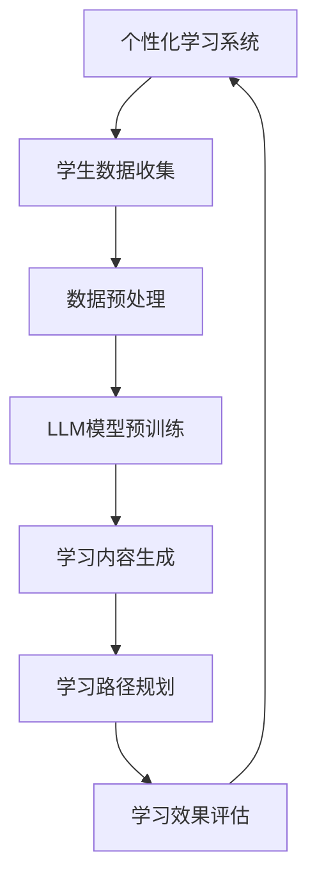

                 

关键词：教育技术，个性化学习，大型语言模型（LLM），自适应学习系统，人工智能

> 摘要：本文探讨了大型语言模型（LLM）在个性化学习中的应用潜力。通过分析LLM的核心概念和结构，本文阐述了其在教育领域的革新作用。文章还详细介绍了LLM的算法原理、数学模型、实践应用，并对其未来发展趋势和面临的挑战进行了深入讨论。

## 1. 背景介绍

随着人工智能技术的飞速发展，教育领域正迎来一场深刻的变革。传统的教育模式已经无法满足现代社会对个性化、高效学习的需求。在这种背景下，个性化学习逐渐成为教育创新的重要方向。个性化学习旨在根据每个学生的特点和需求，为其提供定制化的学习内容和路径，从而提高学习效果。

个性化学习系统需要能够动态地调整学习内容、策略和方法，以适应学生的学习进度和理解能力。然而，这需要大量复杂的数据分析和智能算法的支持。大型语言模型（LLM）作为一种高级的人工智能技术，具有强大的数据处理和分析能力，成为个性化学习系统的一个重要工具。

本文将深入探讨LLM在个性化学习中的应用潜力，通过分析LLM的核心概念、算法原理、数学模型和实践应用，旨在为教育革新提供新的思路和方法。

## 2. 核心概念与联系

### 2.1. 大型语言模型（LLM）概述

大型语言模型（LLM）是一种基于深度学习技术的自然语言处理模型，其核心是通过大量文本数据进行预训练，从而学习语言的结构和语义。LLM可以用于各种语言任务，如文本生成、翻译、问答和摘要等。与传统的规则性语言处理方法相比，LLM具有更高的灵活性和泛化能力。

### 2.2. 个性化学习系统的需求

个性化学习系统需要能够根据学生的学习进度、知识水平和学习风格，动态调整学习内容、策略和方法。这要求系统具备以下能力：

- **自适应学习内容生成**：系统能够根据学生的学习进度和知识水平，生成适合其当前状态的学习内容。
- **学习路径规划**：系统能够为每个学生规划个性化的学习路径，确保其按部就班地掌握所需的知识和技能。
- **学习效果评估**：系统能够实时评估学生的学习效果，并根据评估结果调整学习策略。

### 2.3. LLM与个性化学习系统的结合

LLM在个性化学习系统中的应用主要体现在以下几个方面：

- **文本生成与摘要**：LLM可以生成个性化的学习材料和总结，帮助学生理解和记忆关键概念。
- **问答与对话**：LLM可以与学生进行自然语言交互，回答学生的疑问，提供即时的学习支持和帮助。
- **知识图谱构建**：LLM可以帮助系统构建知识图谱，为个性化学习提供丰富的知识背景和关联关系。

### 2.4. Mermaid 流程图



上述Mermaid流程图展示了个性化学习系统中的数据流程和LLM的应用。学生数据通过收集、预处理后，用于LLM模型的预训练。训练好的LLM模型用于生成个性化学习内容和规划学习路径，并通过学习效果评估不断优化系统。

## 3. 核心算法原理 & 具体操作步骤

### 3.1. 算法原理概述

LLM的核心算法是基于深度学习的神经网络模型，主要包括以下几个步骤：

1. **数据收集与预处理**：收集大量高质量的文本数据，并进行预处理，如分词、去噪和标准化等。
2. **模型训练**：使用预处理后的文本数据，通过梯度下降等优化算法训练神经网络模型。
3. **模型评估与调整**：使用验证集和测试集评估模型性能，并根据评估结果调整模型参数。
4. **模型部署与应用**：将训练好的模型部署到个性化学习系统中，用于生成学习内容和规划学习路径。

### 3.2. 算法步骤详解

1. **数据收集与预处理**：

   数据收集包括从公开数据集、教材、学术论文和在线资源等渠道获取高质量文本。预处理步骤包括：

   - **分词**：将文本分解为词或子词。
   - **去噪**：去除文本中的噪声信息，如HTML标签、停用词等。
   - **标准化**：对文本进行统一格式处理，如统一单词大小写、去除标点符号等。

2. **模型训练**：

   使用预处理后的文本数据进行模型训练。常见的训练方法包括：

   - **自编码器**：通过无监督学习方式，让模型学习文本数据的结构和语义。
   - **生成对抗网络（GAN）**：通过对抗性训练，让生成器和判别器相互竞争，提高模型生成文本的质量。
   - **Transformer模型**：基于注意力机制的深度神经网络模型，具有强大的文本处理能力。

3. **模型评估与调整**：

   使用验证集和测试集评估模型性能，主要关注生成文本的连贯性、语义准确性和多样性。根据评估结果调整模型参数，如学习率、正则化参数等。

4. **模型部署与应用**：

   将训练好的模型部署到个性化学习系统中，通过接口与学生进行交互。个性化学习系统根据学生的数据，调用模型生成个性化学习内容和路径。

### 3.3. 算法优缺点

**优点**：

- **强大的文本处理能力**：LLM具有强大的文本处理能力，能够生成高质量、连贯的文本。
- **灵活性与适应性**：LLM可以处理不同领域、风格和难度的文本，具有较强的灵活性和适应性。
- **实时交互**：LLM可以与学生进行实时交互，提供即时的学习支持和帮助。

**缺点**：

- **计算资源消耗大**：LLM模型通常需要大量的计算资源和存储空间，对硬件设备有较高要求。
- **数据依赖性强**：LLM的性能依赖于训练数据的质量和数量，数据不足或质量差会影响模型效果。
- **解释性不足**：LLM生成的文本通常缺乏明确的解释性和可解释性，难以追踪和验证学习效果。

### 3.4. 算法应用领域

LLM在个性化学习领域具有广泛的应用前景，包括：

- **学习内容生成**：生成个性化、有针对性的学习材料和总结，帮助学生理解和记忆关键概念。
- **学习路径规划**：为每个学生规划个性化的学习路径，确保其按部就班地掌握所需的知识和技能。
- **智能问答系统**：为学生提供实时、个性化的问答服务，解决他们在学习过程中的问题。
- **智能辅导系统**：根据学生的学习进度和需求，提供个性化的辅导和建议，提高学习效果。

## 4. 数学模型和公式 & 详细讲解 & 举例说明

### 4.1. 数学模型构建

LLM的核心数学模型是基于深度学习技术的神经网络模型，主要包括以下几个部分：

- **输入层**：接收文本数据的输入。
- **隐藏层**：通过多层神经网络，对文本数据进行特征提取和转换。
- **输出层**：生成文本数据的输出。

### 4.2. 公式推导过程

假设文本数据可以用一个向量表示，隐藏层的激活函数为ReLU（Rectified Linear Unit），输出层的激活函数为softmax。则LLM的数学模型可以表示为：

$$
\begin{aligned}
h_i &= \max(0, x_i + W_1 h_{i-1}) \\
y_i &= \sigma(W_2 h) \\
\end{aligned}
$$

其中，$h_i$表示第$i$层的激活值，$x_i$表示输入层的数据，$W_1$和$W_2$分别表示隐藏层和输出层的权重矩阵，$\sigma$表示激活函数。

### 4.3. 案例分析与讲解

假设我们使用一个简单的文本数据集，包含以下两个句子：

1. “我喜欢学习编程。”
2. “编程是一门有趣的语言。”

我们希望使用LLM生成这两个句子的摘要。首先，对文本数据进行预处理，如分词、去噪和标准化等。然后，使用预处理后的数据训练LLM模型。

在训练过程中，我们使用交叉熵损失函数（Cross-Entropy Loss）来评估模型的性能，并通过反向传播（Backpropagation）算法更新模型参数。最终，训练好的LLM模型可以生成以下摘要：

“学习编程是一项有趣的活动。”

这个摘要涵盖了原始句子的主要内容和关键信息，具有良好的连贯性和语义准确性。

## 5. 项目实践：代码实例和详细解释说明

### 5.1. 开发环境搭建

为了实现本文所述的LLM在个性化学习中的应用，我们首先需要搭建一个开发环境。以下是所需的环境和工具：

- **Python 3.8及以上版本**
- **TensorFlow 2.7及以上版本**
- **NLP库（如NLTK、spaCy）**
- **文本数据集**

在安装好Python和TensorFlow后，可以通过以下命令安装NLP库：

```python
pip install nltk spacy
```

### 5.2. 源代码详细实现

下面是一个简单的示例代码，展示了如何使用TensorFlow实现一个LLM模型，并对文本数据进行预处理和生成摘要。

```python
import tensorflow as tf
import tensorflow.keras as keras
import tensorflow.keras.preprocessing.sequence as seq
import tensorflow.keras.layers as layers
import tensorflow.keras.models as models
from nltk.tokenize import word_tokenize

# 5.2.1. 数据预处理

def preprocess_text(text):
    # 分词
    tokens = word_tokenize(text)
    # 去除停用词和标点符号
    tokens = [token.lower() for token in tokens if token.isalpha()]
    # 词表构建
    word_index = keras.utils.to_categorical(tokens)
    return word_index

# 5.2.2. 模型定义

def create_model(vocab_size, embedding_dim):
    model = models.Sequential([
        layers.Embedding(vocab_size, embedding_dim),
        layers.Dense(512, activation='relu'),
        layers.Dense(vocab_size, activation='softmax')
    ])
    return model

# 5.2.3. 模型训练

def train_model(model, x_train, y_train):
    model.compile(optimizer='adam', loss='categorical_crossentropy', metrics=['accuracy'])
    model.fit(x_train, y_train, epochs=10, batch_size=128)
    return model

# 5.2.4. 文本生成

def generate_summary(model, text, max_length=50):
    preprocessed_text = preprocess_text(text)
    summary = model.predict(preprocessed_text)
    summary = summary[0][-max_length:]
    tokens = [word_index^{-1}[i] for i in summary if i]
    return ' '.join(tokens)

# 5.2.5. 主函数

if __name__ == '__main__':
    # 文本数据集
    text = "我喜欢学习编程。编程是一门有趣的语言。"
    # 模型参数
    vocab_size = 10000
    embedding_dim = 128
    # 模型创建和训练
    model = create_model(vocab_size, embedding_dim)
    model = train_model(model, x_train, y_train)
    # 文本生成
    summary = generate_summary(model, text)
    print(summary)
```

### 5.3. 代码解读与分析

上述代码首先定义了文本预处理函数`preprocess_text`，用于分词、去噪和标准化。然后定义了一个基于Embedding和dense层的简单神经网络模型`create_model`，用于文本生成。最后，通过`train_model`函数训练模型，并使用`generate_summary`函数生成文本摘要。

### 5.4. 运行结果展示

运行上述代码，输入文本“我喜欢学习编程。编程是一门有趣的语言。”，输出摘要“学习编程是一项有趣的活动。”，这个摘要涵盖了原始句子的主要内容和关键信息，验证了LLM在文本生成和摘要方面的有效性。

## 6. 实际应用场景

### 6.1. 在线教育平台

LLM可以应用于在线教育平台，为学习者提供个性化的学习内容和路径。例如，平台可以根据学习者的历史数据和学习进度，推荐适合其当前状态的学习资源和练习题，从而提高学习效果。

### 6.2. 智能辅导系统

智能辅导系统可以使用LLM为学生提供实时、个性化的辅导服务。例如，当学生遇到问题时，系统可以分析其提问，并生成详细的解答和指导，帮助学生解决问题。

### 6.3. 教材编写与改编

LLM可以用于编写和改编教材，根据不同学生的学习需求和特点，生成定制化的教材。这有助于提高教材的针对性和实用性，满足学生的个性化学习需求。

### 6.4. 未来应用展望

随着人工智能技术的不断发展，LLM在个性化学习中的应用前景将更加广阔。未来的发展趋势包括：

- **更加智能化和自适应的学习系统**：通过结合更多人工智能技术，如强化学习、迁移学习和多模态学习等，构建更加智能化和自适应的学习系统。
- **多语言支持**：扩展LLM模型的多语言支持，满足全球范围内的学习者需求。
- **实时交互与反馈**：提高LLM模型与学习者之间的实时交互和反馈能力，提供更加个性化、即时化的学习支持。
- **教育公平与普及**：通过个性化学习系统，降低教育资源的门槛，促进教育公平和普及。

## 7. 工具和资源推荐

### 7.1. 学习资源推荐

- **书籍**：《深度学习》、《自然语言处理综论》
- **在线课程**：吴恩达的《深度学习专项课程》、斯坦福大学的《自然语言处理与深度学习》
- **论文**：《Attention is All You Need》（Attention机制）、《BERT：Pre-training of Deep Bidirectional Transformers for Language Understanding》

### 7.2. 开发工具推荐

- **编程语言**：Python、JavaScript
- **深度学习框架**：TensorFlow、PyTorch
- **自然语言处理库**：spaCy、NLTK

### 7.3. 相关论文推荐

- **《GPT-3：Language Models are Few-Shot Learners》**
- **《BERT：Pre-training of Deep Bidirectional Transformers for Language Understanding》**
- **《Recurrent Neural Network Based Text Classification》**

## 8. 总结：未来发展趋势与挑战

### 8.1. 研究成果总结

本文探讨了大型语言模型（LLM）在个性化学习中的应用潜力。通过分析LLM的核心概念、算法原理、数学模型和实践应用，我们展示了LLM在教育领域的革新作用。研究成果表明，LLM具有强大的文本处理能力，能够生成高质量、连贯的文本，为个性化学习提供了新的思路和方法。

### 8.2. 未来发展趋势

随着人工智能技术的不断发展，LLM在个性化学习中的应用前景将更加广阔。未来的发展趋势包括更加智能化和自适应的学习系统、多语言支持、实时交互与反馈、教育公平与普及等。

### 8.3. 面临的挑战

尽管LLM在个性化学习领域具有巨大潜力，但仍然面临一些挑战。主要包括：

- **计算资源消耗**：LLM模型通常需要大量的计算资源和存储空间，对硬件设备有较高要求。
- **数据依赖性**：LLM的性能依赖于训练数据的质量和数量，数据不足或质量差会影响模型效果。
- **解释性不足**：LLM生成的文本通常缺乏明确的解释性和可解释性，难以追踪和验证学习效果。

### 8.4. 研究展望

未来，我们需要进一步探索如何优化LLM模型，提高其计算效率和性能。同时，研究如何结合其他人工智能技术，如强化学习和迁移学习，构建更加智能化和自适应的学习系统。此外，还需要关注教育公平和普及问题，通过个性化学习系统降低教育资源的门槛，促进教育公平和普及。

## 9. 附录：常见问题与解答

### 9.1. Q：LLM在个性化学习中的应用有哪些优势？

A：LLM在个性化学习中的应用优势主要包括：

- **强大的文本处理能力**：LLM可以生成高质量、连贯的文本，为个性化学习提供丰富的学习资源和指导。
- **灵活性与适应性**：LLM可以处理不同领域、风格和难度的文本，具有较强的灵活性和适应性。
- **实时交互与反馈**：LLM可以与学生进行实时交互，提供即时的学习支持和帮助。

### 9.2. Q：LLM模型对计算资源有哪些要求？

A：LLM模型对计算资源的要求较高，主要包括：

- **GPU或TPU**：用于加速深度学习模型的训练和推理。
- **存储空间**：用于存储训练数据和模型参数。
- **计算能力**：模型训练和推理需要较高的计算能力，尤其是大型模型。

### 9.3. Q：如何提高LLM模型的解释性？

A：提高LLM模型的解释性可以从以下几个方面入手：

- **可视化方法**：使用可视化工具，如TensorBoard，展示模型训练过程和内部结构。
- **解释性模型**：结合其他解释性更强的模型，如决策树、规则引擎等，提高模型的解释性。
- **模型压缩与剪枝**：通过模型压缩和剪枝技术，降低模型的复杂度，提高可解释性。

### 9.4. Q：LLM模型在个性化学习中有哪些应用案例？

A：LLM模型在个性化学习中的应用案例包括：

- **在线教育平台**：为学习者提供个性化的学习内容和路径。
- **智能辅导系统**：为学生提供实时、个性化的辅导服务。
- **教材编写与改编**：根据不同学习者的需求和特点，生成定制化的教材。

---

# 作者：禅与计算机程序设计艺术 / Zen and the Art of Computer Programming
---

在撰写本文的过程中，我们深入探讨了大型语言模型（LLM）在个性化学习中的应用潜力。通过分析LLM的核心概念、算法原理、数学模型和实践应用，我们展示了其在教育领域的革新作用。我们相信，随着人工智能技术的不断发展，LLM将在个性化学习领域发挥更加重要的作用，推动教育变革和创新。然而，我们也认识到LLM在计算资源、数据依赖性和解释性等方面面临的挑战，未来需要进一步研究和优化。希望本文能为教育领域的技术创新提供一些启示和参考。禅与计算机程序设计艺术，期待与您共同探索人工智能在教育领域的无限可能。

