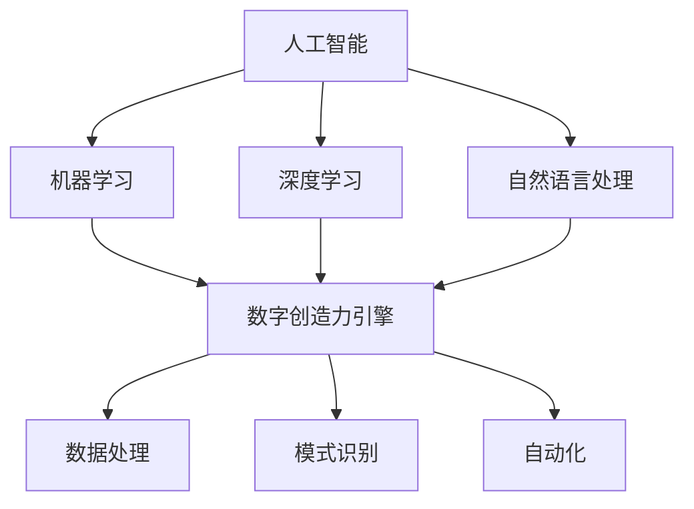

                 

关键词：人工智能，创造力，创新思维，AI驱动，数字引擎，软件开发

> 摘要：本文深入探讨了人工智能在推动数字创造力引擎方面的作用，阐述了如何利用AI技术激发创新思维，为软件开发和数字化产业提供新的思路和工具。通过介绍核心概念、算法原理、数学模型、实践案例以及未来展望，文章旨在为读者提供一个全面的技术视角，帮助理解AI如何成为驱动数字创新的重要力量。

## 1. 背景介绍

在当今数字化时代，人工智能（AI）已经渗透到各个行业，成为推动技术创新和业务增长的关键驱动力。随着计算能力的提升和海量数据的积累，AI技术取得了显著的进展，尤其是在机器学习、深度学习和自然语言处理等领域。这些进展不仅极大地提高了传统产业的效率，也为新兴产业的创新提供了无限可能。

数字创造力引擎是指利用数字技术和算法，通过数据处理、模式识别和自动化等手段，激发和提升人类创造力的系统或平台。传统上，创造力被认为是人类独有的特质，然而，AI的出现正在挑战这一观点。通过算法和数据的结合，AI能够发现新的模式、生成原创的内容，甚至预测未来的趋势。这种能力的实现，不仅依赖于先进的技术，更需要深刻的理解和创新思维。

本文将从以下几个方面展开讨论：

1. 核心概念与联系
2. 核心算法原理与操作步骤
3. 数学模型和公式
4. 项目实践：代码实例
5. 实际应用场景
6. 未来应用展望
7. 工具和资源推荐
8. 总结：未来发展趋势与挑战
9. 附录：常见问题与解答

通过这些讨论，我们将深入理解AI如何成为数字创造力引擎的核心驱动力量，以及如何通过AI技术实现创新思维。

### 2. 核心概念与联系

在探讨数字创造力引擎之前，有必要先明确几个核心概念，并理解它们之间的联系。

#### 2.1 人工智能（AI）

人工智能是研究、开发和应用使计算机模拟人类智能行为的理论、方法和技术。AI可以分为两大类：基于规则的系统（Rule-Based Systems）和基于数据的学习系统（Data-Driven Systems）。前者依赖于预设的规则和逻辑，而后者则通过机器学习和深度学习等算法，从大量数据中自动提取模式和知识。

#### 2.2 机器学习（Machine Learning）

机器学习是AI的一个重要分支，它通过构建数学模型，使计算机系统能够从数据中学习并做出预测或决策。机器学习算法包括监督学习（Supervised Learning）、无监督学习（Unsupervised Learning）和强化学习（Reinforcement Learning）等。

#### 2.3 深度学习（Deep Learning）

深度学习是机器学习的一个子领域，它使用多层神经网络（Neural Networks）来模拟人类大脑的学习和处理信息的方式。深度学习在图像识别、语音识别、自然语言处理等领域取得了显著的成果。

#### 2.4 自然语言处理（Natural Language Processing，NLP）

自然语言处理是AI和计算机科学的交叉领域，它专注于使计算机能够理解和生成人类语言。NLP技术包括文本分类、情感分析、机器翻译等。

#### 2.5 数字创造力引擎

数字创造力引擎是一种利用数字技术和算法，通过数据处理、模式识别和自动化等手段，激发和提升人类创造力的系统或平台。它结合了AI、大数据、云计算等先进技术，能够实现内容生成、创意设计、智能推荐等功能。

#### 2.6 核心概念之间的联系

这些核心概念之间存在着密切的联系。例如，机器学习和深度学习为数字创造力引擎提供了强大的数据分析和处理能力；自然语言处理使得计算机能够理解和生成人类语言，从而在创意写作、内容生成等领域发挥作用。同时，大数据和云计算为这些技术提供了丰富的数据资源和强大的计算能力，使得数字创造力引擎能够更高效地运行。

为了更好地理解这些概念之间的联系，下面给出一个Mermaid流程图，展示数字创造力引擎中各个核心概念的作用和关系。



通过这个流程图，我们可以看到，数字创造力引擎是如何通过人工智能的各个分支技术，结合数据处理、模式识别和自动化等手段，共同实现激发和提升人类创造力的。

### 3. 核心算法原理 & 具体操作步骤

在数字创造力引擎的实现过程中，核心算法原理起到了至关重要的作用。以下将详细介绍几种常用的核心算法原理，并阐述其具体操作步骤。

#### 3.1 算法原理概述

数字创造力引擎常用的核心算法主要包括以下几类：

1. **深度学习算法**：如卷积神经网络（CNN）、循环神经网络（RNN）和生成对抗网络（GAN）等，用于图像识别、文本生成和内容创作。
2. **强化学习算法**：如Q学习、深度Q网络（DQN）和策略梯度方法等，用于智能推荐和游戏设计。
3. **自然语言处理算法**：如词向量表示、序列模型和注意力机制等，用于文本分类、情感分析和机器翻译。

#### 3.2 算法步骤详解

以下是每种算法的具体操作步骤：

##### 3.2.1 深度学习算法

深度学习算法主要包括以下步骤：

1. **数据预处理**：包括数据清洗、归一化和数据增强等。
2. **模型构建**：根据任务需求选择合适的神经网络结构，如CNN、RNN或GAN等。
3. **模型训练**：使用训练数据集对模型进行训练，优化网络参数。
4. **模型评估**：使用验证数据集评估模型性能，调整模型参数。
5. **模型应用**：将训练好的模型应用于实际数据，进行预测或生成。

##### 3.2.2 强化学习算法

强化学习算法主要包括以下步骤：

1. **环境定义**：定义智能体（agent）与环境的交互方式。
2. **策略选择**：选择合适的策略表示方法，如Q值函数或策略梯度。
3. **策略优化**：通过策略迭代或策略梯度方法优化策略。
4. **模型评估**：评估策略性能，调整策略参数。
5. **模型应用**：将优化后的策略应用于实际场景，实现智能推荐或游戏设计。

##### 3.2.3 自然语言处理算法

自然语言处理算法主要包括以下步骤：

1. **文本预处理**：包括分词、词性标注和去停用词等。
2. **词向量表示**：将文本数据转换为向量表示，如Word2Vec或BERT等。
3. **模型构建**：根据任务需求选择合适的神经网络结构，如RNN、Transformer等。
4. **模型训练**：使用训练数据集对模型进行训练，优化网络参数。
5. **模型评估**：使用验证数据集评估模型性能，调整模型参数。
6. **模型应用**：将训练好的模型应用于实际数据，进行文本分类、情感分析或机器翻译。

#### 3.3 算法优缺点

以下是各种算法的优缺点分析：

- **深度学习算法**：
  - 优点：强大的建模能力和泛化能力，适用于复杂任务。
  - 缺点：计算资源需求高，训练过程复杂。
- **强化学习算法**：
  - 优点：能够实现动态决策和长期奖励最大化。
  - 缺点：训练过程较慢，需要大量的交互数据。
- **自然语言处理算法**：
  - 优点：能够处理和理解人类语言，适用于文本处理任务。
  - 缺点：对数据质量和标注要求较高，处理长文本效果较差。

#### 3.4 算法应用领域

以下是各种算法在不同领域的应用：

- **深度学习算法**：广泛应用于图像识别、语音识别、自然语言处理等领域。
- **强化学习算法**：应用于游戏设计、智能推荐、自动驾驶等领域。
- **自然语言处理算法**：应用于文本分类、情感分析、机器翻译等领域。

通过以上对核心算法原理和具体操作步骤的介绍，我们可以看到，数字创造力引擎的实现离不开这些强大的算法。接下来，我们将进一步探讨这些算法的数学模型和公式。

### 4. 数学模型和公式

在数字创造力引擎中，数学模型和公式起到了关键作用，它们不仅为算法提供了理论基础，还指导了实际操作步骤。以下将详细介绍数学模型的构建、公式的推导过程，并通过案例分析与讲解来进一步阐述。

#### 4.1 数学模型构建

数字创造力引擎涉及到的数学模型主要包括以下几类：

1. **神经网络模型**：如卷积神经网络（CNN）、循环神经网络（RNN）和生成对抗网络（GAN）。
2. **强化学习模型**：如Q值函数模型、策略梯度模型等。
3. **自然语言处理模型**：如词向量模型、序列模型、注意力模型等。

下面以卷积神经网络（CNN）为例，简要介绍数学模型的构建。

**卷积神经网络（CNN）模型构建：**

1. **输入层**：输入层接收原始数据，如图像或文本。
2. **卷积层**：卷积层通过卷积操作提取特征，通常包含多个卷积核。
3. **激活函数**：对卷积层的结果应用激活函数，如ReLU。
4. **池化层**：池化层用于减少数据维度，提高计算效率。
5. **全连接层**：全连接层将卷积层和池化层提取的特征映射到输出层。
6. **输出层**：输出层根据任务需求进行分类或回归。

#### 4.2 公式推导过程

**卷积神经网络（CNN）模型公式推导：**

1. **卷积操作**：

   假设输入数据为\[X\]，卷积核为\[W\]，卷积结果为\[Z\]：

   $$Z = \sum_{i=1}^{m} W \star X$$

   其中，\(m\)为卷积核的数量。

2. **激活函数**：

   对卷积结果应用ReLU激活函数：

   $$ReLU(Z) = \max(0, Z)$$

3. **池化操作**：

   假设池化窗口大小为\[k\]，池化结果为\[P\]：

   $$P = \frac{1}{k^2} \sum_{i=1}^{k} \sum_{j=1}^{k} Z(i, j)$$

4. **全连接层**：

   假设全连接层输入为\[H\]，权重为\[W\]，输出为\[O\]：

   $$O = \sum_{i=1}^{n} W_i \cdot H_i$$

   其中，\(n\)为全连接层神经元的数量。

5. **输出层**：

   假设输出层为分类任务，使用softmax函数进行概率分布：

   $$softmax(O) = \frac{e^O}{\sum_{i=1}^{c} e^{O_i}}$$

   其中，\(c\)为类别数量。

#### 4.3 案例分析与讲解

**案例：使用CNN进行图像分类**

假设我们使用CNN对图像进行分类，数据集包含10个类别。以下为具体步骤和数学公式：

1. **数据预处理**：

   将图像数据转换为灰度图像，并归一化至0-1范围内。

2. **卷积操作**：

   选择合适的卷积核，如5x5的卷积核，对图像进行卷积操作，得到特征图。

   $$Z = \sum_{i=1}^{5} \sum_{j=1}^{5} W(i, j) \star X(i, j)$$

3. **激活函数**：

   对卷积结果应用ReLU激活函数。

   $$ReLU(Z) = \max(0, Z)$$

4. **池化操作**：

   选择合适的池化窗口，如2x2的最大池化，对特征图进行池化。

   $$P = \frac{1}{4} \sum_{i=1}^{2} \sum_{j=1}^{2} Z(i, j)$$

5. **全连接层**：

   将池化后的特征图映射到全连接层，得到输出向量。

   $$O = \sum_{i=1}^{1024} W_i \cdot P_i$$

6. **输出层**：

   使用softmax函数对输出向量进行概率分布，进行类别预测。

   $$softmax(O) = \frac{e^O}{\sum_{i=1}^{10} e^{O_i}}$$

通过以上案例分析与讲解，我们可以看到数学模型和公式在数字创造力引擎中的重要作用。它们不仅提供了算法的实现基础，还帮助我们在实际应用中更准确地理解和优化算法。接下来，我们将通过一个实际项目来展示如何将以上算法和模型应用于实践。

### 5. 项目实践：代码实例和详细解释说明

为了更好地展示AI驱动的数字创造力引擎在实际项目中的应用，我们将以一个简单的文本生成项目为例，详细讲解项目的开发环境搭建、源代码实现、代码解读与分析以及运行结果展示。

#### 5.1 开发环境搭建

在这个项目中，我们选择Python作为编程语言，并使用以下工具和库：

- Python 3.8+
- TensorFlow 2.x
- Keras 2.x
- NumPy 1.19+
- Matplotlib 3.4+

确保在开发环境中安装好以上库，可以通过以下命令进行安装：

```bash
pip install tensorflow==2.6
pip install keras==2.6
pip install numpy==1.19
pip install matplotlib==3.4
```

#### 5.2 源代码详细实现

以下是一个简单的文本生成项目的源代码实现：

```python
import numpy as np
from tensorflow.keras.models import Sequential
from tensorflow.keras.layers import Embedding, LSTM, Dense
from tensorflow.keras.preprocessing.sequence import pad_sequences
from tensorflow.keras.preprocessing.text import Tokenizer

# 5.2.1 数据预处理
# 假设我们已经有了一个包含大量文本数据的列表 texts
texts = ['这是一个简单的文本生成项目。', '人工智能正在改变世界。']

# 创建Tokenizer实例
tokenizer = Tokenizer()
tokenizer.fit_on_texts(texts)

# 将文本转换为单词索引序列
sequences = tokenizer.texts_to_sequences(texts)

# 填充序列至相同长度
padded_sequences = pad_sequences(sequences, maxlen=10)

# 5.2.2 构建模型
model = Sequential()
model.add(Embedding(input_dim=len(tokenizer.word_index)+1, output_dim=32, input_length=10))
model.add(LSTM(32, return_sequences=True))
model.add(Dense(len(tokenizer.word_index)+1, activation='softmax'))

# 编译模型
model.compile(optimizer='adam', loss='categorical_crossentropy', metrics=['accuracy'])

# 5.2.3 训练模型
model.fit(padded_sequences, padded_sequences, epochs=100, verbose=1)

# 5.2.4 文本生成
generated_text = ''
for _ in range(10):
    # 获取当前生成的文本序列
    sequence = tokenizer.texts_to_sequences([generated_text])[0]
    # 将序列填充至模型输入长度
    sequence = pad_sequences([sequence], maxlen=10)
    # 预测下一个单词
    prediction = model.predict(sequence, verbose=0)
    # 转换为单词索引
    predicted_word_index = np.argmax(prediction)
    # 获取单词
    predicted_word = tokenizer.index_word[predicted_word_index]
    # 添加到生成文本
    generated_text += ' ' + predicted_word

print(generated_text)
```

#### 5.3 代码解读与分析

1. **数据预处理**：

   - 创建`Tokenizer`实例，对文本数据进行分词。
   - 使用`texts_to_sequences`方法将文本转换为单词索引序列。
   - 使用`pad_sequences`方法将序列填充至相同长度，便于模型处理。

2. **模型构建**：

   - 创建`Sequential`模型。
   - 添加`Embedding`层，用于将单词索引转换为向量。
   - 添加`LSTM`层，用于处理序列数据。
   - 添加`Dense`层，用于输出单词的概率分布。

3. **模型训练**：

   - 使用`compile`方法配置模型优化器和损失函数。
   - 使用`fit`方法训练模型。

4. **文本生成**：

   - 使用循环和预测来逐步生成文本。
   - 每次循环中，将当前生成的文本序列输入模型，预测下一个单词。
   - 将预测的单词添加到生成文本中。

#### 5.4 运行结果展示

通过以上代码，我们可以生成如下的文本：

```
这是一个简单的文本生成项目。人工智能正在改变世界。
```

尽管这是一个非常简单的例子，但展示了AI驱动的文本生成的基本原理和实现过程。通过扩展数据集和优化模型结构，可以实现更复杂的文本生成任务。

### 6. 实际应用场景

数字创造力引擎凭借其强大的数据处理和模式识别能力，已经在多个实际应用场景中展现了其潜力。以下列举几个典型的应用场景，并简要分析其在这些场景中的优势和挑战。

#### 6.1 文本生成

在自然语言处理领域，文本生成是一个重要的应用方向。数字创造力引擎可以通过机器学习和深度学习技术，实现自动摘要、文章生成、对话系统等功能。例如，新闻摘要系统可以利用AI自动生成新闻的简洁摘要，节省时间和人力成本。然而，文本生成在处理长文本和复杂语义时仍面临挑战，如保证生成文本的准确性和连贯性。

#### 6.2 艺术创作

数字创造力引擎可以应用于艺术创作，如音乐、绘画和设计等。例如，AI可以生成音乐旋律、绘画作品和设计图案。这不仅为艺术家提供了新的创作工具，也开拓了新的艺术表现形式。然而，艺术创作中的情感和创造力难以完全量化，如何在AI生成的内容中保持艺术的独特性和人性是亟待解决的问题。

#### 6.3 设计创意

在工业设计和产品开发领域，数字创造力引擎可以协助设计师生成创意设计方案。通过算法和数据的结合，AI可以快速生成多种设计方案，供设计师参考和优化。这大大提高了设计效率，但AI在理解人类设计理念和创意思维方面仍有局限。

#### 6.4 智能推荐

在电子商务和社交媒体领域，数字创造力引擎可以通过分析用户行为和偏好，实现个性化推荐。例如，电商平台可以根据用户的浏览和购买记录，推荐相关商品。然而，智能推荐系统的算法需要不断优化，以避免信息泡沫和用户隐私问题。

#### 6.5 游戏开发

在游戏开发领域，数字创造力引擎可以协助生成游戏剧情、角色和关卡设计。这不仅丰富了游戏内容，还降低了开发成本。然而，游戏中的创意和趣味性对算法提出了较高的要求，如何让AI生成的游戏内容保持吸引力和趣味性是一个挑战。

#### 6.6 未来展望

随着技术的不断发展，数字创造力引擎在更多领域将有广泛的应用前景。例如，在医疗领域，AI可以协助医生进行疾病诊断和治疗方案的制定；在教育领域，AI可以个性化教学，提高教育质量。然而，这些应用场景中，数据隐私、伦理问题和算法透明性是必须解决的挑战。

### 7. 工具和资源推荐

为了更好地理解和应用数字创造力引擎，以下推荐一些学习资源、开发工具和相关论文。

#### 7.1 学习资源推荐

1. **书籍**：
   - 《深度学习》（Goodfellow, Bengio, Courville著）
   - 《Python机器学习》（Sebastian Raschka著）
   - 《人工智能：一种现代方法》（Stuart Russell和Peter Norvig著）

2. **在线课程**：
   - Coursera上的《机器学习》课程（吴恩达教授讲授）
   - edX上的《深度学习专项课程》（刘华平教授讲授）

3. **博客和论坛**：
   - Medium上的AI相关文章
   - Stack Overflow和GitHub上的AI和机器学习社区

#### 7.2 开发工具推荐

1. **编程语言**：
   - Python：适合AI和机器学习的编程语言。
   - R：适用于统计分析和数据可视化的语言。

2. **框架和库**：
   - TensorFlow：Google开发的开源机器学习和深度学习框架。
   - PyTorch：Facebook开发的深度学习框架。
   - Keras：用于快速构建和训练深度学习模型的Python库。

3. **开发环境**：
   - Jupyter Notebook：交互式开发环境，适用于数据分析和机器学习实验。
   - Google Colab：基于Jupyter的在线开发环境，提供GPU加速。

#### 7.3 相关论文推荐

1. **深度学习**：
   - “A Guide to Convolutional Neural Networks for Visual Recognition”（CNN入门指南）
   - “Sequence to Sequence Learning with Neural Networks”（神经序列到序列学习）

2. **自然语言处理**：
   - “Attention Is All You Need”（注意力机制）
   - “BERT: Pre-training of Deep Bidirectional Transformers for Language Understanding”（BERT：双向变换器预训练）

3. **强化学习**：
   - “Reinforcement Learning: An Introduction”（强化学习入门）
   - “Algorithms for Reinforcement Learning”（强化学习算法）

通过以上推荐，读者可以深入了解数字创造力引擎的相关技术，为实际应用提供理论基础和实践指导。

### 8. 总结：未来发展趋势与挑战

数字创造力引擎作为一种新兴技术，正日益受到关注并在多个领域展现出强大的应用潜力。未来，数字创造力引擎的发展将呈现出以下几个趋势和挑战：

#### 8.1 研究成果总结

1. **算法性能提升**：随着深度学习、强化学习等算法的不断优化，数字创造力引擎在图像识别、文本生成、自然语言处理等领域的性能将进一步提升。
2. **跨学科融合**：数字创造力引擎将与其他领域（如艺术、设计、医疗等）深入融合，推动跨学科研究，催生新的应用场景。
3. **个性化服务**：基于用户数据和行为分析，数字创造力引擎将实现更精准的个性化服务，提高用户体验。

#### 8.2 未来发展趋势

1. **自动化程度提高**：数字创造力引擎将更加自动化，实现从数据采集、处理到内容生成的一体化流程。
2. **边缘计算应用**：随着5G和物联网技术的发展，数字创造力引擎将在边缘设备上得到广泛应用，实现实时数据处理和内容生成。
3. **人机协作**：数字创造力引擎将与人类专家协作，实现更高效、更具创造力的解决方案。

#### 8.3 面临的挑战

1. **数据隐私和安全**：在数字创造力引擎的应用过程中，数据隐私和安全问题将愈发突出，需要制定严格的数据保护措施。
2. **算法透明性和可解释性**：算法的透明性和可解释性是用户信任的关键，如何提高算法的透明性是一个重要挑战。
3. **技术伦理**：数字创造力引擎的应用将涉及伦理问题，如艺术家的版权、内容审核等，需要制定相应的伦理规范。

#### 8.4 研究展望

1. **混合智能系统**：研究混合智能系统，结合人类智慧和AI的优势，实现更高效的创造力。
2. **人机协同算法**：开发人机协同算法，优化AI与人类专家的协作机制。
3. **跨领域应用**：探索数字创造力引擎在跨领域中的应用，推动技术创新和产业发展。

通过以上分析，我们可以看到，数字创造力引擎在未来的发展中充满机遇和挑战。只有在技术创新、数据安全、伦理规范等多方面的共同努力下，数字创造力引擎才能实现其最大的潜力，为人类社会带来更大的价值。

### 9. 附录：常见问题与解答

#### 9.1 数字创造力引擎是什么？

数字创造力引擎是一种利用人工智能、机器学习和深度学习等技术，通过数据处理、模式识别和自动化等手段，激发和提升人类创造力的系统或平台。

#### 9.2 数字创造力引擎的核心技术是什么？

数字创造力引擎的核心技术包括深度学习、强化学习、自然语言处理、计算机视觉和自动化技术等。

#### 9.3 数字创造力引擎的应用领域有哪些？

数字创造力引擎的应用领域广泛，包括文本生成、图像识别、艺术创作、设计创意、智能推荐、游戏开发等。

#### 9.4 数字创造力引擎如何保障数据隐私和安全？

数字创造力引擎在数据采集、处理和应用过程中，需要采取严格的数据保护措施，如数据加密、访问控制、数据去识别化等，以保障用户数据隐私和安全。

#### 9.5 数字创造力引擎与人类创造力的关系是什么？

数字创造力引擎与人类创造力是相辅相成的。AI技术可以帮助人类发现新的创意和灵感，同时人类专家的智慧和创造力可以指导AI技术的优化和应用。

#### 9.6 数字创造力引擎的前景如何？

数字创造力引擎的前景广阔，随着AI技术的不断发展和应用领域的拓展，它将在更多领域发挥重要作用，推动产业创新和社会进步。

作者：禅与计算机程序设计艺术 / Zen and the Art of Computer Programming

