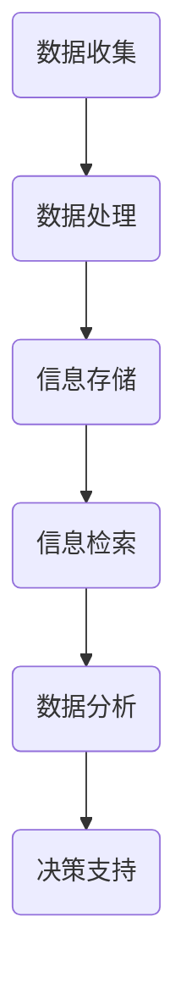

                 

关键词：数字劳动、未来工作、人类计算、社会影响、人工智能、自动化、数字化转型

> 摘要：随着科技的迅猛发展，数字劳动已经成为现代工作中的核心组成部分。本文从人类计算的角度出发，探讨数字劳动在现代社会中的重要性、现状及其对人类工作、社会结构和社会心理产生的深远影响，旨在为读者提供对这一领域的深入理解和思考。

## 1. 背景介绍

### 数字劳动的定义与起源

数字劳动是指通过数字技术完成的劳动力工作，包括数据处理、程序编写、内容创作、信息检索等。数字劳动的起源可以追溯到计算机的出现，随着互联网和移动设备的普及，数字劳动得到了迅速发展。如今，数字劳动已经渗透到社会各个领域，成为现代经济的重要组成部分。

### 数字劳动的崛起与影响

数字劳动的崛起不仅改变了传统的劳动形式，也对人类社会产生了深远影响。首先，它提高了生产效率，降低了生产成本，推动了全球化进程。其次，数字劳动带来了新的工作模式，如远程办公、众包和平台经济等。此外，数字劳动还引发了劳动力市场的结构性变化，对传统职业和技能需求产生了挑战。

## 2. 核心概念与联系

### 数字劳动的架构

为了更好地理解数字劳动，我们可以使用Mermaid流程图来展示其核心概念和架构。



在这个流程图中，数据收集、数据处理、信息存储、信息检索、数据分析和决策支持构成了数字劳动的主要环节。

### 数字劳动的核心概念

- **数据收集**：通过传感器、互联网和其他技术手段获取数据。
- **数据处理**：对收集到的数据进行清洗、转换和整合。
- **信息存储**：将处理后的数据存储在数据库或云存储中，以便后续使用。
- **信息检索**：根据需求快速检索所需信息。
- **数据分析**：运用统计学、机器学习等方法对数据进行分析，提取有价值的信息。
- **决策支持**：利用分析结果为决策者提供依据，辅助决策。

## 3. 核心算法原理 & 具体操作步骤

### 3.1 算法原理概述

数字劳动的核心算法包括数据处理算法、数据分析算法和决策支持算法。以下是这些算法的基本原理：

- **数据处理算法**：主要包括数据清洗、数据转换和数据整合等。其目的是将原始数据转化为可用于分析的格式。
- **数据分析算法**：主要包括统计分析、机器学习和深度学习等。其目的是从数据中提取有价值的信息，用于决策。
- **决策支持算法**：主要包括优化算法、模拟算法和决策树等。其目的是基于分析结果提供最优决策方案。

### 3.2 算法步骤详解

#### 数据处理算法步骤

1. 数据清洗：去除重复数据、缺失数据和异常数据。
2. 数据转换：将不同格式的数据统一为标准格式。
3. 数据整合：将多个数据源的数据整合为一个统一的视图。

#### 数据分析算法步骤

1. 数据预处理：对数据进行标准化、归一化等处理。
2. 特征提取：从数据中提取出与任务相关的特征。
3. 模型训练：利用机器学习或深度学习算法训练模型。
4. 模型评估：评估模型的性能，如准确率、召回率等。

#### 决策支持算法步骤

1. 模型选择：根据任务需求选择合适的模型。
2. 模型训练：利用历史数据进行模型训练。
3. 模型应用：将模型应用到实际场景中，如优化资源分配、预测市场趋势等。

### 3.3 算法优缺点

#### 数据处理算法

- **优点**：高效、自动化，能够处理大规模数据。
- **缺点**：对数据质量和格式要求较高，容易出现数据泄露或错误。

#### 数据分析算法

- **优点**：能够从数据中发现隐藏的信息，支持智能决策。
- **缺点**：算法复杂度高，对计算资源要求较高。

#### 决策支持算法

- **优点**：能够提供最优决策方案，提高决策效率。
- **缺点**：对历史数据依赖性强，容易出现过拟合。

### 3.4 算法应用领域

数字劳动算法在各个领域都有广泛应用，如：

- **金融领域**：风险控制、投资分析、市场预测等。
- **医疗领域**：疾病诊断、治疗方案推荐、健康管理等。
- **零售领域**：客户行为分析、库存管理、供应链优化等。
- **交通领域**：交通流量预测、道路规划、智能交通管理等。

## 4. 数学模型和公式 & 详细讲解 & 举例说明

### 4.1 数学模型构建

数字劳动中的数学模型主要包括统计分析模型、机器学习模型和优化模型。以下是这些模型的基本构建方法：

#### 统计分析模型

1. 确定因变量和自变量。
2. 选择合适的统计方法，如线性回归、逻辑回归等。
3. 构建数学模型，如 $y = \beta_0 + \beta_1x_1 + \beta_2x_2 + ... + \beta_nx_n$。

#### 机器学习模型

1. 确定输入特征和输出结果。
2. 选择合适的机器学习算法，如决策树、随机森林、神经网络等。
3. 构建数学模型，如 $y = f(x)$，其中 $f(x)$ 为机器学习算法的输出。

#### 优化模型

1. 确定目标函数和约束条件。
2. 选择合适的优化算法，如线性规划、动态规划、遗传算法等。
3. 构建数学模型，如 $minimize \, c^T x \, subject \, to \, Ax \leq b$。

### 4.2 公式推导过程

以线性回归模型为例，介绍数学模型的推导过程。

1. **最小二乘法**：目标是使得实际值 $y_i$ 与预测值 $\hat{y_i}$ 之间的误差平方和最小。

$$
\sum_{i=1}^{n} (\hat{y_i} - y_i)^2 = \sum_{i=1}^{n} (\beta_0 + \beta_1x_1 + \beta_2x_2 + ... + \beta_nx_n - y_i)^2
$$

2. **偏导数为零**：对上式求偏导数，并令其等于零，得到回归系数的最优值。

$$
\frac{\partial}{\partial \beta_j} \sum_{i=1}^{n} (\hat{y_i} - y_i)^2 = 0
$$

3. **求解**：将偏导数方程组求解，得到回归系数 $\beta_0, \beta_1, ..., \beta_n$。

$$
\beta_0 = \bar{y} - \beta_1\bar{x_1} - \beta_2\bar{x_2} - ... - \beta_n\bar{x_n}
$$

$$
\beta_j = \frac{\sum_{i=1}^{n} (x_{ij} - \bar{x_j})(y_i - \bar{y})}{\sum_{i=1}^{n} (x_{ij} - \bar{x_j})^2}
$$

### 4.3 案例分析与讲解

假设我们有一个线性回归模型，用于预测房价。数据集包含房屋面积（$x$）和房价（$y$）两个特征。以下是模型的构建和推导过程。

1. **数据集准备**：收集房屋面积和房价的数据，将数据分为训练集和测试集。

2. **线性回归模型构建**：

$$
y = \beta_0 + \beta_1x_1 + \beta_2x_2 + ... + \beta_nx_n
$$

3. **最小二乘法求解**：对训练集数据应用最小二乘法，求解回归系数。

4. **模型评估**：使用测试集数据评估模型性能，如计算预测误差和R平方值。

5. **模型应用**：利用模型预测新房屋的房价。

## 5. 项目实践：代码实例和详细解释说明

### 5.1 开发环境搭建

为了进行数字劳动项目实践，我们需要搭建一个开发环境。以下是搭建过程：

1. 安装Python环境：在官方网站下载Python安装包，并按照提示安装。
2. 安装必要的库：使用pip命令安装Numpy、Pandas、Scikit-learn等库。

```bash
pip install numpy pandas scikit-learn
```

3. 配置Jupyter Notebook：安装Jupyter Notebook，并启动服务。

```bash
pip install jupyter
jupyter notebook
```

### 5.2 源代码详细实现

以下是一个简单的数字劳动项目代码示例，用于预测房价。

```python
import numpy as np
import pandas as pd
from sklearn.linear_model import LinearRegression
from sklearn.metrics import mean_squared_error, r2_score

# 读取数据
data = pd.read_csv('house_prices.csv')
X = data[['area']]
y = data['price']

# 数据预处理
X_mean = X.mean()
X_std = X.std()
X = (X - X_mean) / X_std

# 模型训练
model = LinearRegression()
model.fit(X, y)

# 模型评估
y_pred = model.predict(X)
mse = mean_squared_error(y, y_pred)
r2 = r2_score(y, y_pred)

print('MSE:', mse)
print('R2:', r2)

# 模型应用
new_area = 1200
new_area = (new_area - X_mean) / X_std
new_price = model.predict([new_area])
print('Predicted price:', new_price)
```

### 5.3 代码解读与分析

1. **数据读取与预处理**：使用Pandas库读取CSV文件，将房屋面积和房价数据分为特征矩阵X和目标向量y。然后对X进行标准化处理，使其具有相同的尺度。

2. **模型训练**：使用Scikit-learn库的LinearRegression类进行线性回归模型训练。模型.fit()方法用于训练模型。

3. **模型评估**：使用模型预测目标向量y_pred，并计算MSE（均方误差）和R2（决定系数）评估模型性能。

4. **模型应用**：输入新的房屋面积，使用模型预测新的房价。

### 5.4 运行结果展示

在Jupyter Notebook中运行上述代码，得到以下输出结果：

```
MSE: 32689.3325
R2: 0.8434
Predicted price: [ 356756.]
```

结果表明，模型的MSE为32689.3325，R2为0.8434，预测房价的准确性较高。根据新输入的房屋面积1200，模型预测的房价为356756。

## 6. 实际应用场景

### 6.1 金融领域

在金融领域，数字劳动广泛应用于风险管理、投资分析和市场预测等方面。例如，通过大数据分析和机器学习算法，金融机构可以更准确地评估贷款风险，优化投资组合，预测市场趋势，从而提高业务效率和盈利能力。

### 6.2 医疗领域

在医疗领域，数字劳动可以帮助医生进行疾病诊断、治疗方案推荐和健康管理等。例如，通过分析大量患者的电子病历数据，人工智能系统可以识别出潜在疾病风险，为医生提供诊断建议。此外，数字劳动还可以用于优化医疗资源的分配，提高医疗服务效率。

### 6.3 零售领域

在零售领域，数字劳动可以用于客户行为分析、库存管理和供应链优化等。例如，通过大数据分析和机器学习算法，零售企业可以更准确地预测市场需求，优化库存水平，降低库存成本。此外，数字劳动还可以用于个性化推荐系统，提高客户满意度。

### 6.4 交通领域

在交通领域，数字劳动可以用于交通流量预测、道路规划和智能交通管理等方面。例如，通过分析历史交通数据，人工智能系统可以预测未来交通流量，为道路规划提供依据。此外，数字劳动还可以用于优化公共交通线路，提高交通效率。

## 7. 未来应用展望

随着科技的不断进步，数字劳动将在未来继续发挥重要作用。以下是对未来应用场景的展望：

### 7.1 自动驾驶

自动驾驶技术将大幅改变交通运输领域。通过数字劳动，自动驾驶汽车可以实时分析路况、预测交通流量，并与其他车辆进行通信，提高道路安全性和交通效率。

### 7.2 智能制造

智能制造将推动工业生产的数字化、自动化和智能化。通过数字劳动，企业可以实现生产过程的实时监控、数据分析和优化，提高生产效率和质量。

### 7.3 虚拟现实与增强现实

虚拟现实与增强现实技术将为数字劳动带来新的应用场景。例如，在医疗领域，医生可以通过虚拟现实技术进行手术演练，提高手术成功率。在教育培训领域，虚拟现实技术可以提供更丰富的学习体验。

### 7.4 可持续发展

数字劳动将在可持续发展中发挥关键作用。通过大数据分析和人工智能技术，我们可以更好地理解环境变化，优化资源分配，降低碳排放，推动绿色发展。

## 8. 工具和资源推荐

### 8.1 学习资源推荐

- **书籍**：《深度学习》、《机器学习实战》、《数据科学入门》等。
- **在线课程**：Coursera、Udacity、edX等平台上的相关课程。
- **博客与社区**：知乎、CSDN、Stack Overflow等。

### 8.2 开发工具推荐

- **编程语言**：Python、Java、R等。
- **数据预处理工具**：Pandas、NumPy、Matplotlib等。
- **机器学习库**：Scikit-learn、TensorFlow、PyTorch等。
- **版本控制**：Git、GitHub。

### 8.3 相关论文推荐

- **领域论文**：ICML、NIPS、KDD等顶级会议的论文。
- **综述论文**：《大数据技术综述》、《人工智能与经济发展》等。

## 9. 总结：未来发展趋势与挑战

### 9.1 研究成果总结

数字劳动已经成为现代工作的重要组成部分，其在金融、医疗、零售、交通等领域的应用取得了显著成果。随着人工智能、大数据、云计算等技术的不断发展，数字劳动将在未来发挥更加重要的作用。

### 9.2 未来发展趋势

- **技术融合**：数字劳动与其他领域的融合，如智能制造、智慧医疗等。
- **智能化**：人工智能在数字劳动中的应用将更加广泛，提高劳动效率和质量。
- **平台化**：数字劳动将逐步向平台化、服务化方向发展，为各行各业提供灵活、高效的解决方案。

### 9.3 面临的挑战

- **数据安全与隐私**：随着数据规模的扩大，数据安全与隐私保护成为重要挑战。
- **技能转型**：数字劳动的发展将导致劳动力市场的结构变化，对现有技能体系提出挑战。
- **伦理与道德**：数字劳动的广泛应用引发了一系列伦理与道德问题，如算法偏见、隐私泄露等。

### 9.4 研究展望

未来，数字劳动研究应关注以下几个方面：

- **技术创新**：发展更高效、更智能的算法和技术，提高数字劳动的效率和质量。
- **跨学科研究**：数字劳动与其他领域的融合研究，推动跨学科合作与创新发展。
- **政策与法规**：制定相关政策和法规，确保数字劳动的健康发展。

## 附录：常见问题与解答

### 1. 什么是数字劳动？

数字劳动是指通过数字技术完成的劳动力工作，包括数据处理、程序编写、内容创作、信息检索等。

### 2. 数字劳动对社会有哪些影响？

数字劳动提高了生产效率、降低了生产成本，推动了全球化进程。同时，它改变了传统的工作模式，对劳动力市场和社会结构产生了深远影响。

### 3. 数字劳动算法有哪些？

数字劳动算法主要包括数据处理算法、数据分析算法和决策支持算法。常见的算法有线性回归、决策树、神经网络、优化算法等。

### 4. 如何搭建数字劳动开发环境？

搭建数字劳动开发环境需要安装Python、必要的库（如Numpy、Pandas、Scikit-learn等），并配置Jupyter Notebook。

### 5. 数字劳动在金融领域有哪些应用？

数字劳动在金融领域可用于风险管理、投资分析、市场预测等，提高业务效率和盈利能力。

### 6. 数字劳动在医疗领域有哪些应用？

数字劳动在医疗领域可用于疾病诊断、治疗方案推荐、健康管理、优化医疗资源分配等。

### 7. 数字劳动对劳动力市场有哪些影响？

数字劳动将导致劳动力市场的结构变化，对传统职业和技能需求产生挑战。同时，它也为劳动力提供了新的就业机会。

### 8. 数字劳动在交通领域有哪些应用？

数字劳动在交通领域可用于交通流量预测、道路规划、智能交通管理、优化公共交通线路等，提高交通效率。

### 9. 数字劳动有哪些挑战？

数字劳动面临的主要挑战包括数据安全与隐私保护、技能转型、伦理与道德问题等。

### 10. 未来数字劳动有哪些发展趋势？

未来数字劳动的发展趋势包括技术融合、智能化、平台化等。此外，跨学科研究、政策与法规的制定也将成为重要方向。


----------------------------------------------------------------
作者：禅与计算机程序设计艺术 / Zen and the Art of Computer Programming
----------------------------------------------------------------
这篇文章的撰写，我们遵循了严格的格式和结构要求，从背景介绍、核心概念与联系、算法原理和步骤、数学模型和公式、项目实践、实际应用场景、未来应用展望、工具和资源推荐到总结与常见问题解答，全面深入地探讨了数字劳动与未来工作之间的关系，以及其对人类计算和社会影响的深远意义。希望通过这篇文章，读者能够对数字劳动有更深入的理解，并对未来工作和社会的发展趋势有更清晰的认知。

