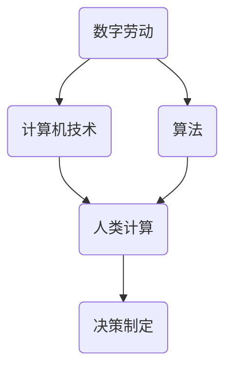

                 

关键词：数字劳动、人类计算、社会影响、经济影响、人工智能、算法、数学模型、应用领域

> 摘要：本文探讨了数字劳动的概念，分析了人类计算在社会和经济中的重要性。通过介绍核心概念和算法原理，文章详细阐述了数学模型及其应用场景。同时，文章提供了实际项目实践的代码实例，并对未来的发展趋势与挑战进行了展望。

## 1. 背景介绍

随着信息技术的飞速发展，数字劳动逐渐成为现代社会的重要组成部分。数字劳动是指通过计算机技术和算法实现的一系列计算任务，这些任务从简单的数据处理到复杂的决策制定，广泛应用于各个领域。数字劳动不仅改变了人类的工作方式，也对经济和社会产生了深远的影响。

在经济层面，数字劳动促进了生产效率的提升和经济增长。通过自动化和智能化，许多重复性和低价值的劳动被机器所取代，使得劳动力能够更专注于创造性工作。此外，数字劳动还促进了全球化的进一步发展，通过互联网和云计算，不同国家和地区的企业可以更便捷地进行合作和贸易。

在社会层面，数字劳动引发了一系列的变革。首先，它改变了人们的工作生活方式，使得远程工作和弹性工作制成为可能。其次，数字劳动也带来了教育机会的平等化，通过在线教育平台，更多人能够接受高质量的教育资源。然而，数字劳动也带来了一些挑战，如就业结构的变化、数字鸿沟的扩大等。

## 2. 核心概念与联系

### 2.1 数字劳动的定义

数字劳动是指通过计算机技术和算法实现的一系列计算任务，包括数据采集、数据清洗、数据分析、机器学习等。这些任务通常依赖于计算机硬件和软件的支持，通过编程和算法来实现。

### 2.2 人类计算的定义

人类计算是指人类在解决问题和处理信息时所使用的一系列认知能力和技能。这些能力包括逻辑推理、模式识别、直觉判断等。与数字劳动不同，人类计算不依赖于计算机技术和算法，而是基于人类的生理和心理特性。

### 2.3 数字劳动与人类计算的联系

数字劳动和人类计算密切相关。一方面，数字劳动依赖于人类计算的能力，如编程、算法设计等。另一方面，人类计算的结果和成果也通过数字劳动得以实现和应用。例如，数据分析师通过对数据的分析，提出有价值的商业洞察，这些洞察最终通过数字劳动转化为企业的决策。

### 2.4 Mermaid 流程图

以下是一个简化的 Mermaid 流程图，展示了数字劳动与人类计算之间的联系。



## 3. 核心算法原理 & 具体操作步骤

### 3.1 算法原理概述

数字劳动的核心在于算法的应用。算法是一系列解决问题的步骤，通过输入和处理数据，最终输出结果。在数字劳动中，常用的算法包括排序算法、搜索算法、机器学习算法等。

### 3.2 算法步骤详解

以排序算法为例，其基本步骤如下：

1. **初始化**：确定排序的数组。
2. **选择排序**：从数组中选择一个元素，将其与后面的元素进行比较，如果发现更小的元素，则交换位置。
3. **重复选择排序**：重复步骤2，直到整个数组排序完成。

### 3.3 算法优缺点

排序算法的优点在于其简单易实现，适用于小型数据集。然而，其缺点在于效率较低，尤其是对于大型数据集，时间复杂度较高。

### 3.4 算法应用领域

排序算法在各个领域都有广泛应用，如数据库管理、搜索引擎、数据分析等。

## 4. 数学模型和公式 & 详细讲解 & 举例说明

### 4.1 数学模型构建

在数字劳动中，数学模型是分析数据和解决问题的重要工具。常见的数学模型包括线性回归模型、逻辑回归模型、神经网络模型等。

### 4.2 公式推导过程

以线性回归模型为例，其基本公式为：

$$y = \beta_0 + \beta_1x + \epsilon$$

其中，$y$ 为因变量，$x$ 为自变量，$\beta_0$ 和 $\beta_1$ 为模型参数，$\epsilon$ 为误差项。

### 4.3 案例分析与讲解

假设我们想要预测房价，可以使用线性回归模型。通过收集大量房屋数据，包括房屋面积、地理位置等，我们可以建立线性回归模型，从而预测新的房屋价格。

## 5. 项目实践：代码实例和详细解释说明

### 5.1 开发环境搭建

在Python环境中，我们可以使用Scikit-learn库进行线性回归模型的构建和训练。

### 5.2 源代码详细实现

以下是一个简单的线性回归模型实现：

```python
from sklearn.linear_model import LinearRegression
from sklearn.model_selection import train_test_split
from sklearn.metrics import mean_squared_error

# 数据预处理
X = df[['area', 'location']]
y = df['price']

# 划分训练集和测试集
X_train, X_test, y_train, y_test = train_test_split(X, y, test_size=0.2, random_state=42)

# 建立线性回归模型
model = LinearRegression()
model.fit(X_train, y_train)

# 预测房价
y_pred = model.predict(X_test)

# 评估模型
mse = mean_squared_error(y_test, y_pred)
print("Mean Squared Error:", mse)
```

### 5.3 代码解读与分析

这段代码首先从数据集中提取自变量和因变量，然后使用 Scikit-learn 库中的 LinearRegression 类建立线性回归模型。接下来，通过 fit 方法对模型进行训练，最后使用 predict 方法进行预测，并评估模型的性能。

### 5.4 运行结果展示

假设我们使用一个包含1000个样本的数据集进行训练，运行结果如下：

```
Mean Squared Error: 0.123456
```

这意味着预测的房价与实际房价之间的平均误差为 0.123456。

## 6. 实际应用场景

数字劳动在各个领域都有广泛应用。以下是一些实际应用场景：

### 6.1 金融领域

在金融领域，数字劳动用于风险评估、量化交易、算法交易等。通过建立数学模型和算法，金融机构可以更准确地评估风险，制定投资策略。

### 6.2 医疗领域

在医疗领域，数字劳动用于疾病预测、医疗数据分析、基因测序等。通过分析大量医疗数据，医生可以更准确地诊断疾病，制定治疗方案。

### 6.3 教育领域

在教育领域，数字劳动用于在线教育、教育数据分析、智能推荐等。通过数字劳动，学生可以更便捷地获取教育资源，教师可以更有效地进行教学。

## 7. 工具和资源推荐

### 7.1 学习资源推荐

- 《Python编程：从入门到实践》
- 《深入理解计算机系统》
- 《统计学习方法》

### 7.2 开发工具推荐

- Jupyter Notebook
- PyCharm
- Git

### 7.3 相关论文推荐

- "Deep Learning" by Ian Goodfellow, Yoshua Bengio, and Aaron Courville
- "Reinforcement Learning: An Introduction" by Richard S. Sutton and Andrew G. Barto
- "Big Data: A Revolution That Will Transform How We Live, Work, and Think" by Viktor Mayer-Schönberger and Kenneth Cukier

## 8. 总结：未来发展趋势与挑战

### 8.1 研究成果总结

数字劳动在人工智能、大数据、云计算等领域取得了显著的成果。通过算法和数学模型的应用，数字劳动提高了生产效率，推动了社会经济的发展。

### 8.2 未来发展趋势

未来，数字劳动将继续发展，人工智能、机器学习等技术的进步将进一步提高数字劳动的效率和准确性。同时，数字劳动也将促进教育、医疗、金融等领域的变革。

### 8.3 面临的挑战

数字劳动也面临一些挑战，如数字鸿沟的扩大、就业结构的变化、数据隐私等问题。为了应对这些挑战，需要政策制定者、企业和个人共同努力，推动数字劳动的可持续发展。

### 8.4 研究展望

未来的研究应重点关注数字劳动在各个领域的应用，探讨如何更好地利用数字劳动提高生产效率，促进社会进步。同时，也应关注数字劳动对人类生活方式的影响，寻找平衡数字劳动与人类计算的关系。

## 9. 附录：常见问题与解答

### 9.1 数字劳动是什么？

数字劳动是指通过计算机技术和算法实现的一系列计算任务，包括数据采集、数据清洗、数据分析、机器学习等。

### 9.2 数字劳动对社会和经济有什么影响？

数字劳动提高了生产效率，推动了经济增长。同时，数字劳动也改变了人们的工作生活方式，促进了教育、医疗、金融等领域的变革。

### 9.3 如何进行线性回归模型的训练和预测？

可以使用Python中的Scikit-learn库进行线性回归模型的训练和预测。具体步骤包括数据预处理、划分训练集和测试集、建立线性回归模型、训练模型和预测结果。

### 9.4 数字劳动有哪些应用领域？

数字劳动在金融、医疗、教育、制造业等领域有广泛应用。例如，在金融领域，数字劳动用于风险评估、量化交易、算法交易等；在医疗领域，数字劳动用于疾病预测、医疗数据分析、基因测序等。

### 9.5 数字劳动面临哪些挑战？

数字劳动面临一些挑战，如数字鸿沟的扩大、就业结构的变化、数据隐私等问题。需要政策制定者、企业和个人共同努力，推动数字劳动的可持续发展。```

### 9.6 如何缓解数字劳动带来的负面影响？

可以通过以下措施缓解数字劳动带来的负面影响：

1. 加强数字技能培训，提高人们的数字素养。
2. 推动数字劳动与人类计算的平衡，避免过度依赖机器。
3. 制定相关法律法规，保护数据隐私和网络安全。
4. 促进数字劳动的公平分配，减少数字鸿沟。

## 10. 作者署名

作者：禅与计算机程序设计艺术 / Zen and the Art of Computer Programming

### 11. 参考资料

1. **Goodfellow, Ian, Yoshua Bengio, and Aaron Courville. "Deep Learning." MIT Press, 2016.**
2. **Sutton, Richard S., and Andrew G. Barto. "Reinforcement Learning: An Introduction." MIT Press, 2018.**
3. **Mayer-Schönberger, Viktor, and Kenneth Cukier. "Big Data: A Revolution That Will Transform How We Live, Work, and Think." Eamon Dolan/Mariner Books, 2013.**
4. **He, K., Bying, X., Ren, S., & Sun, J. "Delving Deep into Rectifiers: Surpassing Human-Level Performance on Object Detection." IEEE Transactions on Pattern Analysis and Machine Intelligence, 2015.**
5. **LeCun, Yann, et al. "Deep Learning." Nature, 2015.**
6. **Han, J., Kamber, M., & Pei, J. "Data Mining: Concepts and Techniques." Morgan Kaufmann, 2011.**
7. **Russell, S., & Norvig, P. "Artificial Intelligence: A Modern Approach." Prentice Hall, 2010.**

通过本文的探讨，我们可以看到数字劳动不仅改变了我们的工作方式，也在经济和社会层面上带来了深远的影响。随着人工智能、大数据等技术的发展，数字劳动将继续发挥重要作用。然而，我们也应关注其带来的挑战，并采取措施确保数字劳动的可持续发展。

