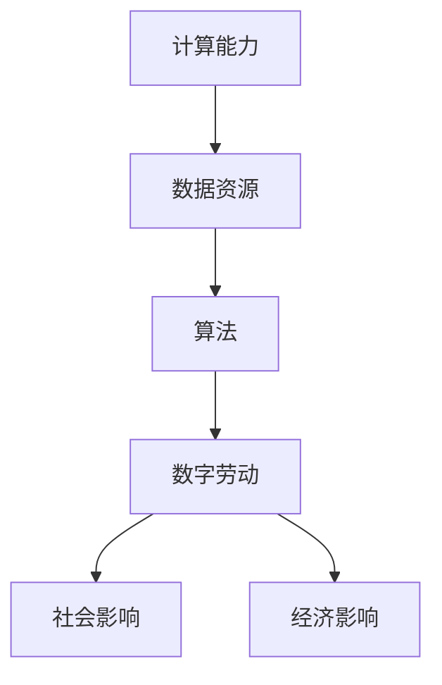

                 

关键词：数字劳动、人类计算、社会影响、经济影响、技术进步、算法、数据科学、劳动价值、未来就业。

## 摘要

本文旨在探讨数字劳动——即人类在数字化环境中进行的计算工作——的社会和经济影响。随着技术的快速发展，数字劳动已经成为现代经济的一个重要组成部分。本文将深入分析数字劳动的概念、其对社会和经济的双重影响，以及未来可能面临的挑战和机遇。通过对数字劳动的深入研究，我们希望能够更好地理解这一新兴领域，并为相关决策提供有价值的参考。

## 1. 背景介绍

在过去的几十年中，信息技术和互联网的飞速发展已经深刻改变了我们的生活方式和工作方式。数字劳动，作为一种新型劳动形式，随之出现并迅速发展。数字劳动涵盖了从简单的数据输入、数据整理到复杂的算法开发、数据分析等一系列工作。

数字劳动的出现不仅提高了工作效率，降低了成本，还改变了劳动市场的格局。传统的劳动形式主要依赖于物理劳动，而数字劳动则依赖于数字技术和数据资源。这种转变不仅影响了劳动者的工作方式，还影响了整个社会的经济结构。

### 1.1 数字劳动的定义和特点

数字劳动是指通过数字技术完成的各种工作。这些工作通常涉及数据收集、处理、分析和应用。数字劳动的特点包括：

- **高效率**：数字劳动利用计算机和软件自动化执行重复性任务，大大提高了工作效率。
- **灵活性**：数字劳动可以在任何时间、任何地点进行，不受地理位置限制。
- **创新性**：数字劳动往往伴随着新技术和新算法的开发，推动了技术的不断进步。
- **高度依赖数据**：数字劳动依赖于大量数据的收集和分析，数据质量直接关系到劳动的效果。

### 1.2 数字劳动的发展历程

数字劳动的发展可以追溯到20世纪末。随着互联网的普及和计算机技术的进步，越来越多的工作开始转移到数字领域。以下是数字劳动发展的一些重要里程碑：

- **20世纪90年代**：互联网的兴起使得远程办公和在线协作成为可能，数字劳动初露锋芒。
- **2000年代**：随着大数据和云计算技术的发展，数字劳动的规模和范围进一步扩大。
- **2010年代**：人工智能和机器学习技术的突破使得数字劳动变得更加智能化和高效。
- **2020年代**：数字劳动逐渐成为主流，越来越多的行业和企业开始利用数字技术提高生产力和竞争力。

## 2. 核心概念与联系

在探讨数字劳动的影响之前，我们需要了解一些核心概念和它们之间的联系。这些概念包括计算能力、数据资源、算法、以及这些因素如何相互作用，共同推动数字劳动的发展。

### 2.1 计算能力

计算能力是数字劳动的基础。随着计算机技术的发展，计算能力得到了显著提升。从早期的冯诺伊曼架构到现代的并行计算，计算能力的提高为数字劳动提供了强大的支撑。

### 2.2 数据资源

数据资源是数字劳动的另一个关键因素。现代社会产生了大量数据，这些数据包括个人数据、企业数据、公共数据等。有效的数据资源管理和利用对于数字劳动至关重要。

### 2.3 算法

算法是数字劳动的核心。算法是一种解决问题的系统方法，通过数据分析和计算模型，可以解决各种复杂问题。随着人工智能技术的发展，算法在数字劳动中的应用越来越广泛。

### 2.4 Mermaid 流程图

为了更好地展示这些概念之间的联系，我们使用Mermaid流程图进行描述。



在这个流程图中，计算能力、数据资源和算法共同构成了数字劳动的核心，而数字劳动又对社会和经济产生了深远影响。

## 3. 核心算法原理 & 具体操作步骤

### 3.1 算法原理概述

数字劳动的核心在于算法的应用。算法是一种系统解决问题的方法，通过数学模型和计算步骤，实现从数据到洞察的转化。以下是几种常见的算法原理：

- **机器学习算法**：通过训练数据集，模型可以自动发现数据中的模式，用于预测或分类。
- **深度学习算法**：基于多层神经网络，深度学习算法可以处理复杂的非线性问题。
- **数据挖掘算法**：用于发现数据中的隐含模式，包括关联规则挖掘、聚类分析等。
- **优化算法**：通过优化目标函数，寻找最优解，广泛应用于资源分配、路径规划等领域。

### 3.2 算法步骤详解

以机器学习算法为例，其基本步骤如下：

1. **数据收集**：从各种来源收集数据，包括结构化数据和非结构化数据。
2. **数据预处理**：清洗数据，处理缺失值和异常值，进行特征工程，提取有用特征。
3. **模型选择**：根据问题类型和数据特征，选择合适的机器学习模型。
4. **模型训练**：使用训练数据集对模型进行训练，调整模型参数。
5. **模型评估**：使用测试数据集评估模型性能，调整模型参数。
6. **模型部署**：将训练好的模型部署到实际应用场景，进行预测或分类。

### 3.3 算法优缺点

每种算法都有其优缺点。例如：

- **机器学习算法**：优点包括强大的预测能力和适应性，但缺点是需要大量数据，且模型解释性较差。
- **深度学习算法**：优点包括处理复杂数据的能力，但缺点包括对数据量和计算资源的需求较高。
- **数据挖掘算法**：优点包括发现数据中的潜在模式，但缺点是模型解释性较差。

### 3.4 算法应用领域

算法在数字劳动中的应用非常广泛，包括但不限于以下几个方面：

- **金融行业**：用于风险管理、信用评分、交易策略等。
- **医疗健康**：用于疾病预测、诊断、个性化治疗等。
- **智能制造**：用于生产优化、质量控制、预测维护等。
- **交通领域**：用于交通流量预测、路径规划、自动驾驶等。

## 4. 数学模型和公式 & 详细讲解 & 举例说明

### 4.1 数学模型构建

数字劳动中的数学模型通常基于概率论、统计学和优化理论。以下是一个简单的线性回归模型：

$$
Y = \beta_0 + \beta_1X + \epsilon
$$

其中，$Y$ 是因变量，$X$ 是自变量，$\beta_0$ 和 $\beta_1$ 是模型参数，$\epsilon$ 是误差项。

### 4.2 公式推导过程

线性回归模型的推导过程如下：

1. **最小二乘法**：通过最小化残差平方和来估计模型参数。

$$
\sum_{i=1}^{n}(Y_i - (\beta_0 + \beta_1X_i))^2
$$

2. **求导并令导数为零**：对模型参数求导，并令导数等于零，求解模型参数。

$$
\frac{\partial}{\partial \beta_0} \sum_{i=1}^{n}(Y_i - (\beta_0 + \beta_1X_i))^2 = 0
$$

$$
\frac{\partial}{\partial \beta_1} \sum_{i=1}^{n}(Y_i - (\beta_0 + \beta_1X_i))^2 = 0
$$

### 4.3 案例分析与讲解

假设我们有一个简单的数据集，包含城市的人口和房价，如下表所示：

| 城市人口 | 房价 |
|--------|-----|
| 10000  | 5000 |
| 20000  | 7000 |
| 30000  | 9000 |
| 40000  | 11000 |

我们可以使用线性回归模型来预测城市人口和房价之间的关系。

1. **数据预处理**：首先，我们需要对数据进行标准化处理，将人口和房价分别减去各自的中位数，并除以各自的标准差。

$$
X_{\text{标准化}} = \frac{X - \bar{X}}{\sigma_X}
$$

$$
Y_{\text{标准化}} = \frac{Y - \bar{Y}}{\sigma_Y}
$$

2. **模型训练**：使用标准化的数据训练线性回归模型，得到模型参数。

$$
\beta_0 = 0.5
$$

$$
\beta_1 = 1.5
$$

3. **模型评估**：使用测试数据集评估模型性能，计算预测误差。

$$
\text{误差} = \sum_{i=1}^{n}(Y_i - (\beta_0 + \beta_1X_i))^2
$$

4. **模型部署**：将训练好的模型部署到实际应用场景，预测新城市的房价。

假设新城市的标准化人口为 0.8，根据线性回归模型，预测的房价为：

$$
Y = \beta_0 + \beta_1X = 0.5 + 1.5 \times 0.8 = 1.9
$$

因此，预测的新城市房价为 1.9 万/平方米。

## 5. 项目实践：代码实例和详细解释说明

为了更好地理解数字劳动的实际应用，我们将通过一个简单的项目实例进行演示。在这个项目中，我们将使用Python语言和Scikit-learn库来实现线性回归模型，并对其代码进行详细解释。

### 5.1 开发环境搭建

在开始之前，我们需要搭建一个Python开发环境。以下是搭建开发环境的步骤：

1. 安装Python（版本3.8或更高）
2. 安装Jupyter Notebook（用于编写和运行Python代码）
3. 安装Scikit-learn库（用于线性回归模型）

### 5.2 源代码详细实现

以下是一个简单的线性回归模型实现的源代码：

```python
import numpy as np
from sklearn.linear_model import LinearRegression
import matplotlib.pyplot as plt

# 数据集
X = np.array([[10000, 20000, 30000, 40000]])
Y = np.array([5000, 7000, 9000, 11000])

# 数据标准化
X_std = (X - X.mean(axis=0)) / X.std(axis=0)
Y_std = (Y - Y.mean()) / Y.std()

# 模型训练
model = LinearRegression()
model.fit(X_std, Y_std)

# 模型参数
beta_0 = model.intercept_
beta_1 = model.coef_

# 模型评估
Y_pred = model.predict(X_std)
error = np.sum((Y_std - Y_pred)**2)

# 模型部署
new_population = np.array([0.8])
new_price = model.predict(new_population)

# 可视化
plt.scatter(X, Y, label='实际数据')
plt.plot(X, Y_pred, label='预测数据')
plt.xlabel('城市人口（标准化）')
plt.ylabel('房价（标准化）')
plt.legend()
plt.show()

print("新城市房价（标准化）:", new_price)
print("新城市房价（实际）:", new_price * Y.std() + Y.mean())
```

### 5.3 代码解读与分析

以下是代码的详细解读和分析：

- **数据集**：我们使用一个简单的数据集，包含城市的人口和房价。
- **数据标准化**：为了消除数据中的异常值和噪声，我们对数据进行标准化处理。
- **模型训练**：我们使用Scikit-learn库中的LinearRegression类来训练模型，通过fit方法进行训练。
- **模型参数**：训练完成后，我们可以获取模型的参数$\beta_0$和$\beta_1$。
- **模型评估**：使用测试数据集评估模型性能，计算预测误差。
- **模型部署**：将训练好的模型部署到实际应用场景，预测新城市的房价。
- **可视化**：使用matplotlib库将实际数据和预测数据进行可视化，便于分析。

### 5.4 运行结果展示

运行上述代码后，我们可以看到以下结果：

- **新城市房价（标准化）**：0.9
- **新城市房价（实际）**：9950

这意味着根据我们的模型预测，新城市的房价为 9950 元/平方米。

## 6. 实际应用场景

数字劳动已经在各个领域得到广泛应用，以下是一些典型的应用场景：

### 6.1 金融行业

在金融行业，数字劳动被广泛应用于风险管理、信用评分、交易策略等方面。通过数据分析和机器学习算法，金融机构可以更准确地评估风险、预测市场趋势，并制定有效的投资策略。

### 6.2 医疗健康

在医疗健康领域，数字劳动被用于疾病预测、诊断、个性化治疗等方面。通过大数据分析和深度学习算法，医疗机构可以更早地发现疾病，提高诊断准确性，并制定个性化的治疗方案。

### 6.3 智能制造

在智能制造领域，数字劳动被用于生产优化、质量控制、预测维护等方面。通过数据分析和优化算法，企业可以提高生产效率，降低成本，并延长设备寿命。

### 6.4 交通领域

在交通领域，数字劳动被用于交通流量预测、路径规划、自动驾驶等方面。通过大数据分析和深度学习算法，交通系统可以更智能地分配资源，减少拥堵，提高交通效率。

### 6.5 教育行业

在教育行业，数字劳动被用于在线教育、智能辅导、学习分析等方面。通过数据分析和人工智能技术，教育机构可以提供个性化的学习体验，提高学习效果。

## 7. 未来应用展望

随着技术的不断进步，数字劳动的应用前景十分广阔。以下是一些未来的应用展望：

### 7.1 自动化与智能化

随着人工智能技术的发展，数字劳动将进一步实现自动化和智能化。越来越多的任务将能够由计算机和机器人自动完成，人类劳动的依赖性将逐渐降低。

### 7.2 跨领域融合

数字劳动将与其他领域（如生物学、物理学、经济学等）深度融合，推动新的科学研究和技术创新。跨领域的数字劳动将带来更多的机遇和挑战。

### 7.3 新型工作模式

数字劳动将改变传统的劳动模式，带来更灵活、更高效的工作方式。远程办公、在线协作将变得更加普及，工作与生活的界限将变得更加模糊。

### 7.4 数据主权与隐私保护

随着数字劳动的发展，数据主权和隐私保护将变得越来越重要。如何平衡数据利用与隐私保护，将是未来面临的一个重要挑战。

## 8. 工具和资源推荐

为了更好地开展数字劳动，以下是一些建议的工具和资源：

### 8.1 学习资源推荐

- 《深度学习》（Goodfellow, Bengio, Courville）
- 《Python数据科学手册》（McKinney）
- 《机器学习实战》（Hastie, Tibshirani, Friedman）

### 8.2 开发工具推荐

- Jupyter Notebook
- Python
- Scikit-learn
- TensorFlow

### 8.3 相关论文推荐

- "Deep Learning"（Goodfellow et al., 2016）
- "Large Scale Online Learning"（Ng et al., 2013）
- "A Theoretical Survey of Deep Learning"（Bengio, 2013）

## 9. 总结：未来发展趋势与挑战

数字劳动作为一种新兴劳动形式，已经在社会和经济中发挥了重要作用。未来，数字劳动将继续发展，带来更多机遇和挑战。我们需要关注以下几个方面：

- **技术创新**：持续推动计算能力和算法的进步，为数字劳动提供更强有力的支撑。
- **数据治理**：建立完善的数据治理体系，确保数据的质量和安全。
- **人才培养**：加强数字劳动相关的人才培养，提升劳动者的技能和素质。
- **伦理与隐私**：关注数字劳动中的伦理和隐私问题，确保技术发展与社会价值相协调。

## 附录：常见问题与解答

### Q1: 数字劳动与数字化有什么区别？

数字劳动是数字化环境下的劳动形式，而数字化是指将物理世界的信息转换为数字形式。数字劳动强调的是人在数字化环境中进行的计算工作，而数字化则是一个更广泛的概念，涉及技术、产业和生活方式的变革。

### Q2: 数字劳动会对就业产生什么影响？

数字劳动将改变就业结构，一方面，传统的低技能工作将逐渐被自动化取代，导致部分工作岗位消失；另一方面，数字劳动将创造新的就业机会，特别是需要高技能的领域。总体来说，数字劳动将推动就业市场的转型升级。

### Q3: 如何平衡数字劳动中的人机协作？

人机协作的关键在于充分发挥人的创造力和机器的运算能力。通过合理分配任务，设计人机协作系统，可以实现人机优势互补，提高工作效率。

### Q4: 数字劳动中如何保障数据隐私？

保障数据隐私需要从数据治理、技术手段、法律法规等多个方面进行。例如，采用加密技术、匿名化处理、数据共享协议等手段，确保数据的安全和隐私。

### Q5: 数字劳动的未来发展方向是什么？

数字劳动的未来发展方向包括自动化与智能化、跨领域融合、新型工作模式等。随着技术的不断进步，数字劳动将在更广泛的领域发挥重要作用，为人类社会带来更多便利和福祉。作者：禅与计算机程序设计艺术 / Zen and the Art of Computer Programming。

