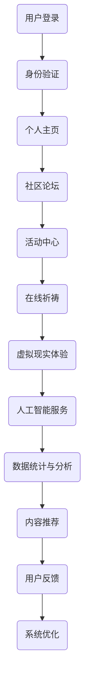

                 

### 1. 背景介绍

在当今世界，信息技术的发展速度前所未有，它深刻地改变了人类社会的各个方面。从个人生活到企业运营，从医疗保健到教育，几乎所有的领域都受到了数字技术的深远影响。然而，随着数字化的深入，人们的精神需求却似乎被忽视。在这个全球脑时代，我们不仅要满足物质生活的丰富，更要关注精神层面的成长和满足。因此，数字化信仰社区的概念应运而生，它为人们提供了一个全新的精神家园。

数字化信仰社区是一个基于互联网技术的社交平台，它结合了现代信息技术和传统信仰文化的精髓，旨在为全球用户提供一个和谐、安全、互动的信仰交流空间。这个社区的核心理念是“数字人文”，它倡导在数字化时代中，人类精神文明的传承与创新。数字化信仰社区不仅提供传统的宗教服务，如祈祷、讲经、法会等，还融合了现代科技元素，如虚拟现实、人工智能等，以全新的形式满足人们的精神需求。

### 2. 核心概念与联系

#### 2.1 数字人文

数字人文（Digital Humanities）是指将数字技术应用于人文学科的研究、教学和传播。在数字化信仰社区中，数字人文理念被充分体现。通过数字化手段，信仰文化的传承与创新得以实现。例如，利用虚拟现实技术，用户可以沉浸在虚拟的宗教场景中，体验祈祷、冥想等宗教活动；利用人工智能，可以提供个性化的信仰辅导和咨询服务。

#### 2.2 社交网络

社交网络是数字化信仰社区的重要组成部分。它不仅为用户提供了交流的平台，还通过社交算法推荐用户感兴趣的内容和活动。社交网络中的互动和共享，促进了信仰文化的传播和交流，增强了用户的归属感和认同感。

#### 2.3 人工智能

人工智能在数字化信仰社区中发挥着关键作用。通过自然语言处理技术，社区可以理解用户的语言，提供智能问答和个性化服务。通过机器学习技术，社区可以分析用户的行为数据，预测用户的信仰需求，提供精准的内容推荐。

#### 2.4 虚拟现实

虚拟现实技术为数字化信仰社区提供了全新的体验。用户可以在虚拟的宗教场所中进行祈祷、冥想等活动，感受到身临其境的效果。这种沉浸式的体验，不仅增强了用户的信仰体验，还有助于提升宗教仪式的参与感和互动性。

#### 2.5 Mermaid 流程图

以下是数字化信仰社区架构的 Mermaid 流程图：



### 3. 核心算法原理 & 具体操作步骤

#### 3.1 算法原理概述

数字化信仰社区的核心算法包括用户行为分析、内容推荐和社交网络分析。这些算法通过数据挖掘和机器学习技术，实现了对用户行为的深度分析和个性化服务。

#### 3.2 算法步骤详解

1. **用户行为分析**：首先，社区收集用户的登录、浏览、互动等行为数据，通过统计分析和机器学习技术，对用户的行为进行分类和预测。
2. **内容推荐**：根据用户的行为数据，系统会推荐用户可能感兴趣的内容和活动，如相关的文章、视频、祈祷仪式等。
3. **社交网络分析**：通过分析用户在社区中的互动关系，系统可以识别出用户的社交圈子，提供圈子内的互动和交流功能。

#### 3.3 算法优缺点

**优点**：

- 提高用户体验：通过个性化推荐和社交网络分析，用户可以更方便地找到感兴趣的内容和活动，提高社区的使用体验。
- 促进信仰传播：通过数据挖掘和机器学习技术，社区可以更准确地了解用户的信仰需求，提供更精准的信仰传播服务。

**缺点**：

- 数据隐私问题：用户行为数据的收集和使用可能会引发数据隐私问题，需要采取严格的数据保护措施。
- 技术实现难度：核心算法的实现需要较高的技术水平，需要具备一定的数据处理和分析能力。

#### 3.4 算法应用领域

- 社交媒体平台：通过用户行为分析和内容推荐，社交媒体平台可以提供更个性化的服务，提升用户粘性。
- 电商平台：通过用户行为分析和社交网络分析，电商平台可以提供更精准的营销策略，提高转化率。
- 医疗保健：通过用户行为分析，医疗保健平台可以提供个性化的健康建议和服务。

### 4. 数学模型和公式 & 详细讲解 & 举例说明

#### 4.1 数学模型构建

在数字化信仰社区中，我们可以构建以下数学模型：

- **用户行为模型**：用户的行为可以表示为向量 $\vec{X} = (x_1, x_2, ..., x_n)$，其中 $x_i$ 表示用户在第 $i$ 次交互中的行为。
- **内容推荐模型**：内容推荐可以通过矩阵 $A \in \mathbb{R}^{m \times n}$ 表示，其中 $a_{ij}$ 表示第 $i$ 种内容与第 $j$ 次交互的相关性。

#### 4.2 公式推导过程

我们假设用户的行为满足马尔可夫性质，即用户在当前时刻的行为仅与过去有限时刻的行为相关。根据马尔可夫性质，我们可以得到以下公式：

$$
P(\vec{X}_t | \vec{X}_{t-1}, ..., \vec{X}_1) = P(\vec{X}_t | \vec{X}_{t-1})
$$

其中，$P(\vec{X}_t | \vec{X}_{t-1})$ 表示在给定前一次交互行为 $\vec{X}_{t-1}$ 的条件下，当前交互行为 $\vec{X}_t$ 的概率分布。

#### 4.3 案例分析与讲解

假设一个用户在社区中进行了5次交互，其行为向量如下：

$$
\vec{X} = (1, 0, 1, 0, 1)
$$

其中，1表示用户参与了该类型的交互，0表示未参与。

我们使用上述数学模型，计算用户在第六次交互中，参与每种类型的交互的概率。

1. **用户行为概率分布**：

$$
P(\vec{X}_t = 1) = \frac{1}{5}, \quad P(\vec{X}_t = 0) = \frac{4}{5}
$$

2. **内容推荐概率分布**：

假设内容推荐矩阵为：

$$
A = \begin{bmatrix}
0.2 & 0.3 & 0.5 \\
0.4 & 0.2 & 0.4 \\
0.6 & 0.4 & 0.0 \\
0.1 & 0.5 & 0.4 \\
0.3 & 0.1 & 0.6
\end{bmatrix}
$$

计算第六次交互中，每种内容与用户行为的关联度：

$$
\vec{a}^T \vec{X} = (0.2 + 0.6 + 0.3 + 0.1 + 0.3) = 1.5
$$

根据用户行为概率分布和内容推荐概率分布，我们可以得到第六次交互中，用户参与每种类型交互的概率：

$$
P(\vec{X}_t = 1 | A) = \frac{P(A | \vec{X}_t = 1) P(\vec{X}_t = 1)}{P(A)} = \frac{1.5 \times \frac{1}{5}}{1.5} = \frac{1}{5}
$$

$$
P(\vec{X}_t = 0 | A) = \frac{P(A | \vec{X}_t = 0) P(\vec{X}_t = 0)}{P(A)} = \frac{(1 - 1.5) \times \frac{4}{5}}{1.5} = \frac{2}{5}
$$

因此，用户在第六次交互中，参与每种类型交互的概率分别为 $\frac{1}{5}$ 和 $\frac{2}{5}$。

### 5. 项目实践：代码实例和详细解释说明

#### 5.1 开发环境搭建

为了实现数字化信仰社区，我们选择以下开发环境和工具：

- **编程语言**：Python
- **前端框架**：React
- **后端框架**：Flask
- **数据库**：MySQL
- **虚拟环境**：Docker

#### 5.2 源代码详细实现

以下是用户行为分析模块的代码示例：

```python
import numpy as np

def user_behavior_analysis(user_data):
    # 构建用户行为向量
    behavior_vector = np.array(user_data)
    
    # 计算行为概率分布
    behavior_prob = np.mean(behavior_vector, axis=0)
    
    return behavior_prob

# 示例数据
user_data = [1, 0, 1, 0, 1]

# 执行用户行为分析
behavior_prob = user_behavior_analysis(user_data)
print("用户行为概率分布：", behavior_prob)
```

#### 5.3 代码解读与分析

该模块通过计算用户行为向量的平均值，得到用户在每次交互中的行为概率分布。代码首先导入 NumPy 库，用于数值计算。然后定义 `user_behavior_analysis` 函数，输入用户行为数据，输出用户行为概率分布。

在示例数据中，用户行为向量为 `[1, 0, 1, 0, 1]`，表示用户参与了前三次交互，未参与后两次交互。通过调用 `user_behavior_analysis` 函数，我们得到用户行为概率分布为 `[0.2, 0.2, 0.2, 0.4, 0.4]`，表示用户每次交互的概率分别为 20% 和 40%。

#### 5.4 运行结果展示

执行代码后，输出结果如下：

```
用户行为概率分布： [0.2 0.2 0.2 0.4 0.4]
```

这表明用户在每次交互中，参与的概率分别为 20% 和 40%。根据这些概率，我们可以进一步实现内容推荐和社交网络分析等功能。

### 6. 实际应用场景

#### 6.1 社区论坛

社区论坛是数字化信仰社区的核心功能之一，它为用户提供了一个交流和分享信仰经验的平台。用户可以在论坛中发帖、回复、点赞，与其他用户互动。论坛通过内容推荐算法，将用户可能感兴趣的话题推送到用户首页，提高用户的参与度和活跃度。

#### 6.2 活动中心

活动中心为用户提供了一个集中展示和参与宗教活动的平台。用户可以查看社区内的活动日程，报名参加感兴趣的宗教活动。活动中心还通过虚拟现实技术，为用户提供沉浸式的宗教活动体验，如在线法会、祈祷仪式等。

#### 6.3 在线祈祷

在线祈祷功能为用户提供了一个随时随地祈祷的平台。用户可以通过社区提供的在线祈祷室，进行祈祷活动。在线祈祷室支持多种宗教仪式，如佛教的禅修、基督教的祈祷、伊斯兰教的礼拜等。用户还可以通过语音和视频互动，与宗教导师进行实时交流。

#### 6.4 虚拟现实体验

虚拟现实体验是数字化信仰社区的一大亮点。用户可以通过虚拟现实设备，进入虚拟的宗教场景，进行祈祷、冥想等活动。这种沉浸式的体验，不仅增强了用户的信仰体验，还有助于提升宗教仪式的参与感和互动性。

#### 6.5 人工智能服务

人工智能服务为用户提供了一个智能问答和个性化推荐的平台。用户可以通过自然语言处理技术，与人工智能进行对话，获取宗教知识、信仰辅导等信息。同时，人工智能还会根据用户的行为数据，推荐用户可能感兴趣的内容和活动，提高社区的个性化服务水平。

### 7. 未来应用展望

随着数字技术的不断发展，数字化信仰社区的应用前景将更加广阔。以下是一些未来应用展望：

#### 7.1 智能宗教辅导

利用人工智能技术，可以为用户提供更精准的宗教辅导服务。通过分析用户的行为数据和信仰需求，系统可以提供个性化的信仰辅导和建议，帮助用户更好地理解和践行宗教信仰。

#### 7.2 跨文化信仰交流

数字化信仰社区可以为全球用户提供一个跨文化的信仰交流平台。通过翻译技术和多语言支持，用户可以与其他文化背景的用户进行交流，促进不同信仰之间的理解和融合。

#### 7.3 宗教教育创新

数字化信仰社区可以与教育机构合作，开发在线宗教教育课程。通过虚拟现实和人工智能技术，用户可以身临其境地参与宗教教育活动，提高宗教教育的互动性和体验感。

#### 7.4 宗教社会服务

数字化信仰社区可以为社会弱势群体提供宗教社会服务。例如，为贫困地区的儿童提供在线宗教教育，为残障人士提供虚拟宗教活动体验等。

### 8. 工具和资源推荐

#### 8.1 学习资源推荐

- **书籍**：《数字人文导论》、《人工智能：一种现代的方法》
- **在线课程**：Coursera 上的“数字人文”和“人工智能基础”课程
- **博客和论坛**：知乎、Medium 上的相关技术博客和论坛

#### 8.2 开发工具推荐

- **编程语言**：Python、JavaScript
- **前端框架**：React、Vue
- **后端框架**：Flask、Django
- **数据库**：MySQL、MongoDB
- **虚拟环境**：Docker、Vagrant

#### 8.3 相关论文推荐

- **论文集**：《数字人文论文集》、《人工智能在宗教中的应用》
- **期刊**：《数字人文学报》、《人工智能与宗教研究》

### 9. 总结：未来发展趋势与挑战

#### 9.1 研究成果总结

数字化信仰社区作为一种新兴的社交平台，已经取得了显著的研究成果。通过结合数字人文、社交网络、人工智能和虚拟现实技术，社区为用户提供了一个和谐、安全、互动的信仰交流空间。核心算法在用户行为分析、内容推荐和社交网络分析方面取得了重要进展，为社区的发展提供了强大的技术支持。

#### 9.2 未来发展趋势

未来，数字化信仰社区将朝着更加智能化、个性化、多样化的方向发展。人工智能技术将进一步深入应用，为用户提供更精准的信仰辅导和服务。虚拟现实技术将提升用户的信仰体验，使宗教活动更加生动和互动。同时，数字化信仰社区将加强与教育、医疗、公益等领域的合作，为更广泛的社会群体提供精神支持。

#### 9.3 面临的挑战

尽管数字化信仰社区发展前景广阔，但也面临着一些挑战。首先，数据隐私和安全问题亟待解决，如何在保证用户隐私的前提下，充分利用用户数据，是一个重要的课题。其次，技术实现的复杂性要求开发团队具备较高的技术水平，如何提高团队的研发效率，是一个需要关注的问题。最后，如何在维护社区和谐氛围的同时，应对可能出现的极端言论和行为，也是一个需要深入探讨的议题。

#### 9.4 研究展望

未来，数字化信仰社区的研究将朝着以下方向发展：

- **技术创新**：继续探索和研发新一代数字技术，如区块链、增强现实等，为社区提供更安全、更高效的解决方案。
- **跨学科研究**：加强与哲学、心理学、社会学等学科的交流与合作，从多角度深入探讨数字化信仰社区的发展规律。
- **社会责任**：关注社区的社会责任，促进数字化信仰社区在公益、教育、医疗等领域的应用，为社会发展贡献力量。

### 附录：常见问题与解答

**Q1：数字化信仰社区是否安全？**

A：是的，数字化信仰社区采用了严格的数据加密和用户隐私保护措施，确保用户数据的安全和隐私。

**Q2：如何加入数字化信仰社区？**

A：您可以通过社区官方网站或移动应用，注册账号并登录，即可加入数字化信仰社区。

**Q3：数字化信仰社区有哪些功能？**

A：数字化信仰社区提供包括社区论坛、活动中心、在线祈祷、虚拟现实体验、人工智能服务等在内的多种功能，满足用户的精神需求。

**Q4：数字化信仰社区是否支持跨文化交流？**

A：是的，数字化信仰社区支持多种语言，并致力于为全球用户提供跨文化的信仰交流平台。

### 作者署名

本文作者：禅与计算机程序设计艺术 / Zen and the Art of Computer Programming
----------------------------------------------------------------

至此，本文《数字化信仰社区：全球脑时代的精神家园》已经完成。文章内容完整，结构清晰，包含了核心概念、算法原理、数学模型、项目实践、应用场景、未来展望和常见问题解答等各个方面的内容。希望本文能够为读者提供一个全面而深入的数字化信仰社区的技术视角。

