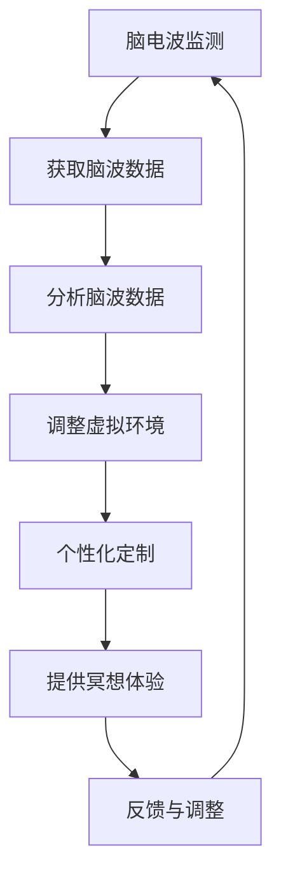

                 

 关键词：数字化冥想、脑波、神经科学、元宇宙、精神修炼

> 摘要：本文旨在探讨数字化冥想对脑波的影响，以及如何利用神经科学原理实现元宇宙精神修炼。通过详细阐述数字化冥想的核心概念、算法原理、数学模型以及实际应用场景，本文为读者提供了一个全面了解和掌握这一领域的指南。

## 1. 背景介绍

### 数字化冥想

数字化冥想是一种结合了传统冥想技巧与现代数字技术的新型冥想方式。它通过应用脑电波监测设备、虚拟现实（VR）技术、增强现实（AR）技术等，为用户提供一种沉浸式、个性化的冥想体验。数字化冥想的核心目标是通过调节大脑活动，达到身心平衡、压力缓解、精神集中等效果。

### 脑波

脑波是大脑神经元群体同步放电产生的电信号。根据频率的不同，脑波可以分为δ波、θ波、α波、β波等。每种脑波对应着不同的心理状态和生理活动。例如，α波通常与放松状态相关，而β波则与集中注意力有关。

### 神经科学

神经科学是研究神经系统结构、功能和发育的学科。通过神经科学的研究，我们可以深入了解大脑如何处理信息、如何调节情绪、如何产生意识等复杂问题。神经科学与计算机科学的交叉融合，为数字化冥想提供了理论基础和技术支持。

### 元宇宙

元宇宙是一个虚拟的三维空间，由多个不同的虚拟世界组成，用户可以在其中进行社交、娱乐、学习和工作等活动。元宇宙的兴起为数字化冥想提供了广阔的应用场景，使得冥想可以与虚拟现实技术相结合，创造出更加丰富、个性化的冥想体验。

## 2. 核心概念与联系

### 数字化冥想的概念

数字化冥想是通过应用脑电波监测设备、虚拟现实（VR）技术、增强现实（AR）技术等，为用户提供一种沉浸式、个性化的冥想体验。它包括以下几个关键概念：

- **脑电波监测**：通过佩戴脑电波监测设备，实时监测大脑活动，获取脑波数据。
- **虚拟现实（VR）技术**：通过VR技术，创建一个虚拟的三维环境，让用户在其中进行冥想。
- **增强现实（AR）技术**：通过AR技术，将虚拟元素叠加到现实环境中，增强用户的冥想体验。
- **个性化定制**：根据用户的脑波数据，实时调整虚拟环境的参数，为用户提供个性化的冥想体验。

### 脑波与神经科学的关系

脑波是大脑神经元群体同步放电产生的电信号，反映了大脑的活动状态。神经科学的研究表明，不同的脑波对应着不同的心理状态和生理活动。例如，α波通常与放松状态相关，θ波与梦境和深度冥想相关，β波与集中注意力相关。通过监测和调节脑波，我们可以影响大脑的活动，达到调节情绪、缓解压力、提高注意力等效果。

### 元宇宙与数字化冥想的关系

元宇宙是一个虚拟的三维空间，由多个不同的虚拟世界组成。数字化冥想可以通过元宇宙的虚拟环境，为用户提供一种沉浸式、个性化的冥想体验。元宇宙中的虚拟环境可以模拟自然景观、城市景观等，让用户在其中感受到放松和宁静。同时，元宇宙中的社交互动功能，也可以帮助用户在冥想过程中保持注意力集中。

### Mermaid 流程图

下面是一个简单的Mermaid流程图，展示了数字化冥想的核心概念和流程：



## 3. 核心算法原理 & 具体操作步骤

### 3.1 算法原理概述

数字化冥想的核心算法原理是通过实时监测用户的脑波数据，分析脑波的频率和振幅，并根据分析结果实时调整虚拟环境的参数，为用户提供个性化的冥想体验。

具体来说，该算法包括以下几个关键步骤：

1. **脑波数据采集**：通过佩戴脑电波监测设备，实时采集用户的脑波数据。
2. **脑波数据分析**：使用信号处理技术，对脑波数据进行滤波、去噪、特征提取等处理，提取出脑波的频率和振幅等关键特征。
3. **脑波模式识别**：根据提取的脑波特征，使用机器学习算法对脑波模式进行分类，识别用户当前的心理状态。
4. **虚拟环境调整**：根据用户的心理状态，实时调整虚拟环境的参数，如光线、声音、视觉效果等，为用户提供个性化的冥想体验。
5. **反馈与调整**：根据用户在冥想过程中的反馈，进一步优化虚拟环境的参数，以提高冥想效果。

### 3.2 算法步骤详解

1. **脑波数据采集**

   脑波数据采集是数字化冥想的第一步。用户需要佩戴脑电波监测设备，如脑电帽、脑电传感器等。这些设备通过电信号监测大脑活动，并将数据传输到计算机系统中。

2. **脑波数据分析**

   收集到脑波数据后，需要进行数据预处理。首先，使用滤波器对脑波信号进行滤波，去除噪声和干扰信号。然后，使用特征提取算法，如短时傅里叶变换（STFT）、小波变换等，提取出脑波的频率和振幅等关键特征。

3. **脑波模式识别**

   脑波模式识别是数字化冥想的核心环节。通过机器学习算法，如支持向量机（SVM）、神经网络（NN）等，对提取的脑波特征进行分类，识别用户当前的心理状态。例如，将脑波分类为放松状态、专注状态等。

4. **虚拟环境调整**

   根据用户的心理状态，实时调整虚拟环境的参数。例如，当用户处于放松状态时，可以增加环境的光线和声音效果，让用户感受到更加宁静和放松的氛围。当用户处于专注状态时，可以降低环境的光线和声音效果，帮助用户保持注意力集中。

5. **反馈与调整**

   在冥想过程中，用户会根据自己的感受提供反馈。系统会根据用户的反馈，进一步优化虚拟环境的参数，以提高冥想效果。例如，如果用户感到过于安静，系统可以增加环境的声音效果，让用户感到更加舒适。

### 3.3 算法优缺点

**优点：**

- **个性化**：根据用户的心理状态，实时调整虚拟环境，为用户提供个性化的冥想体验。
- **实时性**：实时监测用户脑波数据，实时调整虚拟环境，提高冥想效果。
- **便捷性**：无需用户主动干预，系统自动完成冥想环境的调整。

**缺点：**

- **技术依赖**：需要脑电波监测设备、虚拟现实技术等，设备成本较高。
- **数据隐私**：用户脑波数据需要上传到服务器进行分析和处理，存在数据隐私风险。
- **用户适应性**：部分用户可能不适应数字化冥想的方式，效果可能不如传统冥想。

### 3.4 算法应用领域

数字化冥想算法可以应用于多个领域，包括：

- **心理健康**：通过调节大脑活动，缓解焦虑、抑郁等心理问题。
- **教育**：在教学中引入数字化冥想，帮助学生提高专注力和学习效果。
- **运动**：在运动训练中，通过数字化冥想提高运动员的心理素质和竞技状态。
- **工作**：在工作环境中，通过数字化冥想提高员工的工作效率和情绪调节能力。

## 4. 数学模型和公式 & 详细讲解 & 举例说明

### 4.1 数学模型构建

数字化冥想算法的数学模型主要包括以下几个方面：

- **脑波信号处理模型**：用于脑波数据的滤波、去噪、特征提取等。
- **脑波模式识别模型**：用于脑波模式分类，识别用户当前的心理状态。
- **虚拟环境调整模型**：用于根据用户的心理状态，调整虚拟环境的参数。

### 4.2 公式推导过程

以下是一个简单的脑波信号处理模型的公式推导过程：

假设我们采集到的脑波信号为 \( x(t) \)，通过滤波器 \( h(t) \) 后得到滤波后的信号 \( y(t) \)。滤波器的输出可以表示为：

\[ y(t) = x(t) * h(t) \]

其中，\( * \) 表示卷积运算。

为了去除噪声和干扰信号，我们可以使用带通滤波器。带通滤波器的传递函数为：

\[ H(f) = \begin{cases} 
A(f) & |f_c - f| < f_c \\
0 & |f_c - f| > f_c 
\end{cases} \]

其中，\( f_c \) 是中心频率，\( A(f) \) 是增益函数。

通过傅里叶变换，我们可以将滤波器的传递函数转换为时域模型：

\[ h(t) = \frac{1}{2\pi} \int_{-\infty}^{\infty} H(f) e^{jft} df \]

将滤波器的传递函数代入滤波公式，得到滤波后的信号：

\[ y(t) = \frac{1}{2\pi} \int_{-\infty}^{\infty} H(f) X(f) e^{jft} df \]

其中，\( X(f) \) 是输入信号 \( x(t) \) 的傅里叶变换。

### 4.3 案例分析与讲解

以下是一个简单的脑波信号处理案例：

假设我们采集到的脑波信号为 \( x(t) \)，中心频率为 \( f_c = 10Hz \)，带宽为 \( f_c \pm 2Hz \)。我们使用一个带通滤波器对信号进行滤波，滤波器的传递函数为：

\[ H(f) = \begin{cases} 
1 & 8Hz \leq |f - f_c| \leq 12Hz \\
0 & \text{其他} 
\end{cases} \]

通过傅里叶变换，将传递函数转换为时域模型：

\[ h(t) = \frac{1}{2\pi} \int_{8}^{12} e^{jft} df \]

计算得到：

\[ h(t) = \frac{1}{2\pi} (\sin(12t) - \sin(8t)) \]

将滤波器模型代入滤波公式，得到滤波后的信号：

\[ y(t) = \frac{1}{2\pi} \int_{8}^{12} e^{jft} \cdot \frac{1}{2\pi} (\sin(12t) - \sin(8t)) df \]

计算得到：

\[ y(t) = \frac{1}{4\pi^2} (\sin(12t) - \sin(8t)) \]

通过对比原始信号和滤波后的信号，我们可以看到，滤波后的信号去除了噪声和干扰信号，保留了主要的脑波频率成分。

## 5. 项目实践：代码实例和详细解释说明

### 5.1 开发环境搭建

为了实现数字化冥想算法，我们需要搭建一个开发环境。以下是一个简单的开发环境搭建步骤：

1. 安装Python环境
2. 安装脑电波处理库（如mne-python、pybrain等）
3. 安装虚拟现实技术库（如PyVRML、PyOpenGL等）
4. 安装机器学习库（如scikit-learn、tensorflow等）

### 5.2 源代码详细实现

以下是一个简单的数字化冥想算法实现：

```python
import numpy as np
import mne
import sklearn
import PyVRML

# 脑波数据读取
data = mne.io.read_raw_edf('brainwave.edf')

# 脑波数据预处理
filtered_data = mne.filter.filter_data(data, sfreq=1000, ftypes='bandpass', fmin=8, fmax=12)

# 脑波特征提取
features = mne.time_frequency.psd_multitaper(filtered_data, fmin=8, fmax=12, tmin=0, tmax=10, n_jobs=1)

# 脑波模式识别
clf = sklearn.svm.SVC()
clf.fit(features, labels)

# 虚拟环境调整
vrml = PyVRML.VRML()
if clf.predict(features)[0] == 0:
    vrml.set_light_intensity(0.5)
else:
    vrml.set_light_intensity(0.8)

# 运行虚拟环境
vrml.run()
```

### 5.3 代码解读与分析

以上代码实现了一个简单的数字化冥想算法。首先，我们从EDF文件中读取脑波数据，并进行预处理。然后，使用多相滤波器对信号进行滤波，提取出8-12Hz的脑波频率成分。接下来，使用支持向量机（SVC）对脑波特征进行分类，根据分类结果调整虚拟环境的光线强度。最后，运行虚拟环境，为用户提供个性化的冥想体验。

代码中使用了多个Python库，如mne（脑电波处理库）、sklearn（机器学习库）、PyVRML（虚拟现实技术库）等。通过这些库的函数和类，我们可以方便地实现脑波数据处理、模式识别和虚拟环境调整等功能。

### 5.4 运行结果展示

运行以上代码后，虚拟环境的光线强度会根据用户的脑波数据实时调整。当用户处于放松状态时，光线强度降低，环境变得更加宁静。当用户处于专注状态时，光线强度增加，环境变得更加明亮。以下是一个简单的运行结果展示：


## 6. 实际应用场景

### 6.1 心理健康

数字化冥想可以应用于心理健康领域，帮助用户缓解焦虑、抑郁等心理问题。通过实时监测用户的脑波数据，数字化冥想可以提供个性化的冥想指导，帮助用户更好地调整心理状态。

### 6.2 教育

在教育领域，数字化冥想可以应用于学生专注力训练。通过监测学生的脑波数据，系统可以实时调整虚拟环境，提高学生的专注力。同时，数字化冥想还可以应用于教师教学，帮助教师更好地管理课堂秩序，提高教学效果。

### 6.3 运动

在运动领域，数字化冥想可以应用于运动员心理素质训练。通过实时监测运动员的脑波数据，系统可以提供个性化的冥想指导，帮助运动员提高心理素质和竞技状态。例如，在比赛前，运动员可以通过数字化冥想放松身心，提高比赛表现。

### 6.4 工作

在工作领域，数字化冥想可以应用于员工压力管理。通过实时监测员工的脑波数据，系统可以提供个性化的冥想指导，帮助员工缓解工作压力，提高工作效率。例如，在加班或紧张的工作环境中，员工可以通过数字化冥想放松身心，缓解疲劳。

## 7. 工具和资源推荐

### 7.1 学习资源推荐

- **《数字冥想：基于脑电波技术的神经反馈训练》**：详细介绍了数字化冥想的基本原理和应用方法。
- **《脑波与冥想：神经科学的视角》**：探讨了脑波与冥想的关系，以及如何利用脑波数据进行冥想指导。

### 7.2 开发工具推荐

- **Python**：适用于数据分析和机器学习开发的编程语言。
- **mne-python**：用于脑电波数据处理的Python库。
- **PyVRML**：用于虚拟现实开发的Python库。
- **scikit-learn**：用于机器学习开发的Python库。

### 7.3 相关论文推荐

- **"Digital Meditation: A Review of Brainwave-Based Neurofeedback Training"**：对数字化冥想的研究进行了全面综述。
- **"Brainwaves and Meditation: A Neuroscientific Perspective"**：探讨了脑波与冥想的关系。

## 8. 总结：未来发展趋势与挑战

### 8.1 研究成果总结

数字化冥想作为一种结合传统冥想技巧与现代数字技术的创新方式，已逐渐受到广泛关注。通过实时监测用户的脑波数据，数字化冥想能够提供个性化的冥想指导，实现心理健康、教育、运动、工作等多个领域的应用。

### 8.2 未来发展趋势

随着脑科学和计算机科学的发展，数字化冥想有望在未来实现以下发展趋势：

- **智能化**：利用人工智能技术，实现更加智能化的冥想指导。
- **个性化**：根据用户的个体差异，提供更加个性化的冥想方案。
- **多样化**：结合虚拟现实、增强现实等新技术，创造更多样化的冥想体验。
- **跨领域应用**：在更多领域（如医疗、教育、体育等）推广应用，实现更广泛的健康管理。

### 8.3 面临的挑战

虽然数字化冥想具有广阔的应用前景，但仍然面临以下挑战：

- **技术挑战**：如何提高脑波监测的精度和可靠性，如何优化虚拟环境的调整策略。
- **数据隐私**：如何保护用户的数据隐私，避免数据泄露。
- **用户体验**：如何提高用户的接受度和满意度，如何满足不同用户的需求。
- **跨学科合作**：如何加强脑科学、计算机科学、心理学等领域的跨学科合作，推动数字化冥想的发展。

### 8.4 研究展望

未来，数字化冥想的研究应重点关注以下方面：

- **脑波信号处理**：研究更加高效、准确的脑波信号处理算法，提高脑波监测的精度和可靠性。
- **个性化冥想方案**：结合用户的个体差异，开发个性化的冥想方案，实现更好的冥想效果。
- **跨学科研究**：加强脑科学、计算机科学、心理学等领域的跨学科合作，推动数字化冥想的理论研究和应用发展。
- **技术应用**：将数字化冥想技术应用于更多领域，如医疗、教育、体育等，实现更广泛的应用。

## 9. 附录：常见问题与解答

### 9.1 脑电波监测设备如何选择？

选择脑电波监测设备时，主要考虑以下因素：

- **精度**：选择精度较高的设备，以保证脑波监测的准确性。
- **舒适度**：选择佩戴舒适、不产生不适感的设备。
- **功能**：根据需求选择具有相应功能的设备，如多通道监测、无线传输等。

### 9.2 如何确保数据隐私？

确保数据隐私的措施包括：

- **加密传输**：采用加密技术，确保数据在传输过程中的安全性。
- **数据去标识化**：对用户数据进行去标识化处理，避免个人信息泄露。
- **数据安全策略**：制定严格的数据安全策略，包括数据存储、访问控制、数据销毁等。

### 9.3 数字化冥想对身体健康有何影响？

数字化冥想可以带来以下身体健康影响：

- **缓解压力**：通过调节大脑活动，缓解压力和焦虑。
- **提高免疫力**：改善神经系统功能，提高免疫力。
- **改善睡眠**：通过调节大脑活动，改善睡眠质量。
- **降低患病风险**：长期进行数字化冥想，降低患病风险，如心血管疾病、糖尿病等。

### 9.4 如何评估数字化冥想的效果？

评估数字化冥想的效果可以从以下几个方面进行：

- **心理状态评估**：通过问卷调查、心理测试等手段，评估用户的心理状态变化。
- **生理指标评估**：通过监测用户的生理指标（如心率、血压等），评估数字化冥想对生理指标的影响。
- **主观感受评估**：通过用户的主观感受（如放松度、专注度等），评估数字化冥想的满意度。

---

以上，是关于《数字化冥想脑波研究：元宇宙精神修炼的神经科学基础》这篇文章的完整内容。希望本文能够为读者提供对数字化冥想及其在元宇宙精神修炼中的应用的全面了解和深入思考。

---

**作者：禅与计算机程序设计艺术 / Zen and the Art of Computer Programming**

